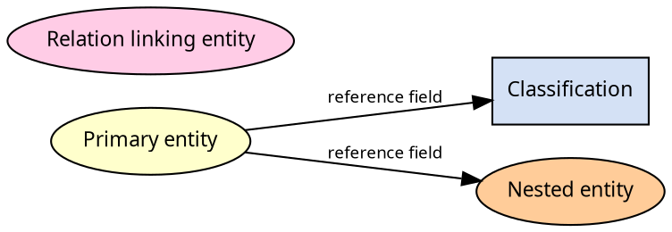
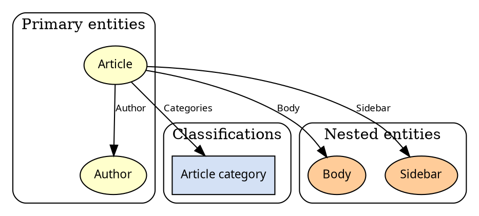

# Graphviz ER fixture

Legend and a small editorial slice.
Primary entities are ellipses (`#ffffcc`), classifications are boxes (`#d4e1f5`),
nested entities are ellipses (`#ffcc99`).

## Visual language

## Editorial content (sample)

