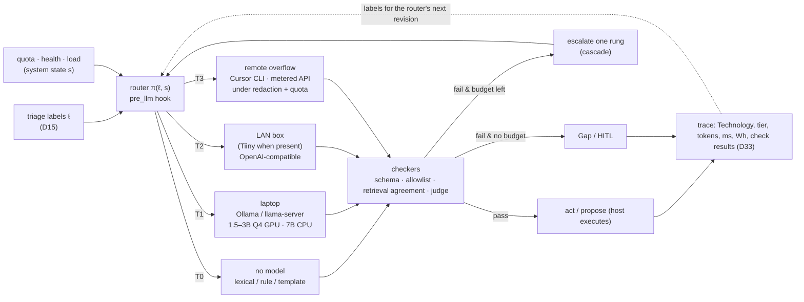
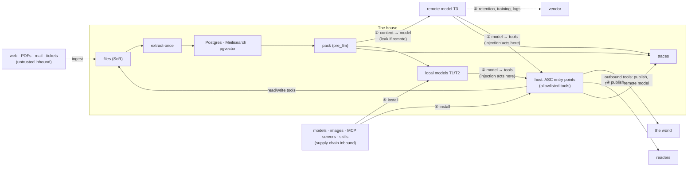
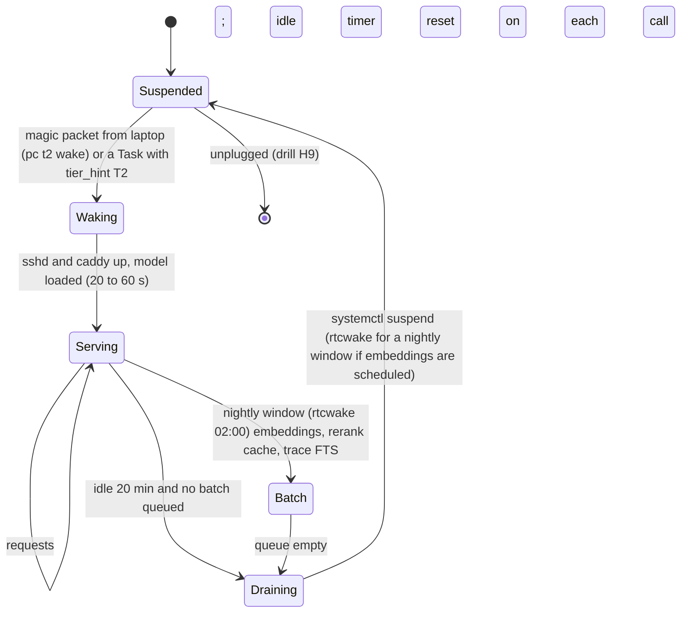
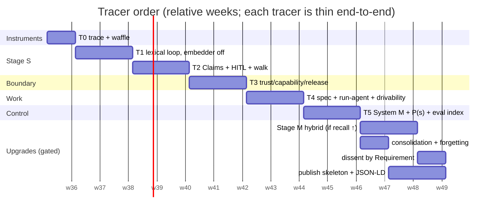

# Dense Mermaid fixture

```mermaid
flowchart LR
  T["triage labels ℓ<br/>(D15)"] --> R["router π(ℓ, s)<br/>pre_llm hook"]
  Q["quota · health · load<br/>(system state s)"] --> R
  R -->|"T0"| N["no model<br/>lexical / rule / template"]
  R -->|"T1"| L["laptop<br/>Ollama / llama-server<br/>1.5–3B Q4 GPU · 7B CPU"]
  R -->|"T2"| B["LAN box<br/>(Tiiny when present)<br/>OpenAI-compatible"]
  R -->|"T3"| C["remote overflow<br/>Cursor CLI · metered API<br/>under redaction + quota"]
  N & L & B & C --> V["checkers<br/>schema · allowlist · retrieval agreement · judge"]
  V -->|pass| A["act / propose (host executes)"]
  V -->|"fail & budget left"| E["escalate one rung<br/>(cascade)"]
  E --> R
  V -->|"fail & no budget"| G["Gap / HITL"]
  A & G --> TR["trace: Technology, tier, tokens, ms, Wh, check results (D33)"]
  TR -.->|"labels for the router's next revision"| R
```

```mermaid
flowchart LR
  subgraph house["The house"]
    F["files (SoR)"] --> X["extract-once"] --> IDX["Postgres · Meilisearch · pgvector"]
    IDX --> P["pack (pre_llm)"]
    L["local models T1/T2"]
    H["host: ASC entry points<br/>(allowlisted tools)"]
    TR["traces"]
  end
  W["web · PDFs · mail · tickets<br/>(untrusted inbound)"] -->|"ingest"| F
  P -->|"① content → model<br/>(leak if remote)"| R["remote model T3"]
  P --> L
  R & L -->|"② model → tools<br/>(injection acts here)"| H
  H -->|"outbound tools: publish, mail, http, remote model"| OUT["the world"]
  H -->|"read/write tools"| F
  R -.->|"③ retention, training, logs"| V["vendor"]
  H -->|"④ publish"| PUB["readers"]
  M["models · images · MCP servers · skills<br/>(supply chain inbound)"] -->|"⑤ install"| L & H
  P & H & R --> TR
```

```mermaid
stateDiagram-v2
  [*] --> Suspended
  Suspended --> Waking : magic packet from laptop (pc t2 wake) or a Task with tier_hint T2
  Waking --> Serving : sshd and caddy up, model loaded (20 to 60 s)
  Serving --> Serving : requests; idle timer reset on each call
  Serving --> Draining : idle 20 min and no batch queued
  Draining --> Suspended : systemctl suspend (rtcwake for a nightly window if embeddings are scheduled)
  Serving --> Batch : nightly window (rtcwake 02:00) embeddings, rerank cache, trace FTS
  Batch --> Draining : queue empty
  Suspended --> [*] : unplugged (drill H9)
```

```mermaid
gantt
  title Tracer order (relative weeks; each tracer is thin end-to-end)
  dateFormat  YYYY-MM-DD
  axisFormat  w%W
  section Instruments
  T0 trace + waffle            :t0, 2026-09-07, 1w
  section Stage S
  T1 lexical loop, embedder off:t1, after t0, 2w
  T2 Claims + HITL + walk      :t2, after t1, 2w
  section Boundary
  T3 trust/capability/release  :t3, after t2, 2w
  section Work
  T4 spec + run-agent + drivability :t4, after t3, 2w
  section Control
  T5 System M + P(s) + eval index   :t5, after t4, 2w
  section Upgrades (gated)
  Stage M hybrid (if recall ↑) :m, after t5, 2w
  consolidation + forgetting   :c, after t5, 1w
  dissent by Requirement       :d, after m, 1w
  publish skeleton + JSON-LD   :p, after c, 2w
```
