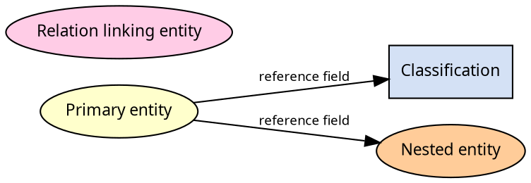
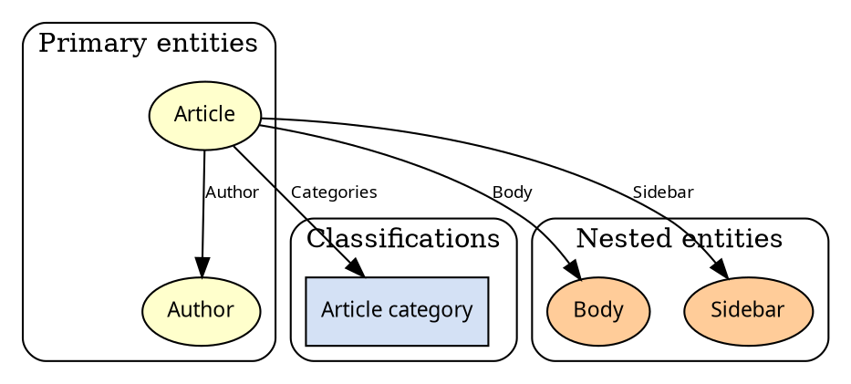

# PDF Graphviz fences (entity-reference ER maps)

| Field | Value |
|-------|--------|
| **Date** | 2026-09-17 |
| **Status** | implemented |
| **Scope** | ASC print pipeline: `asc/doc/pdf_export.sh`, `asc/doc/md2pdf_asc.py`, new `asc/doc/print_graphviz.py`, `asc/doc/print_code.py`, `asc/doc/print_paginate.py`, `asc/doc/print_katex.py` (`ignoredClasses` only), `asc/doc/pdf_styles.css`, `asc/doc/html_preview.sh`, `asc/doc/asc/pdf.test.sh`, plus a Graphviz fixture. Not conversion of consumer Markdown outside this repo. |
| **Related** | [04-pdf-generation-improvements.md](./04-pdf-generation-improvements.md). Comparison snapshot 2026-09-17: [sigma.js](https://github.com/jacomyal/sigma.js) v4, [graphology](https://github.com/graphology/graphology), [d3](https://github.com/d3/d3), plus Cytoscape / vis-network / ELK / Dagre / Viz.js (see § Library comparison). |
| **Lifecycle** | Review this file; implement the locked design below. Do not treat this as permission to rewrite Mermaid or change pagination order. |
| **Host dep** | Graphviz CLI (`dot`). **User** prerequisite (`sudo apt install graphviz`); **not** an agent step. Missing `dot` never aborts export (see Global constraints). Not installed on this machine at plan time (`command -v dot` empty). |

---

# Graphviz in the Markdown→PDF pipeline — implementation plan

> **For agentic workers:** REQUIRED SUB-SKILL: Use superpowers:subagent-driven-development (recommended) or superpowers:executing-plans to implement this plan task-by-task. Steps use checkbox (`- [ ]`) syntax for tracking.

**Goal:** Export Markdown that contains Graphviz fences (```` ```dot ```` / ```` ```graphviz ```` / engine aliases) to PDF the same way Mermaid already works, with native ellipses, boxes, fills, and edge labels readable at entity-reference ER scale.

**Architecture:** Keep Playwright/Chromium via `md2pdf_asc.py`. Graphviz layout runs **in Python** with the system `dot` CLI **before** Markdown, then inlines SVG. Pagination still measures a finished document. No new boot stage. Interactive JS graph UIs (Sigma.js / Graphology / D3 / Cytoscape) are compared below and **not** wired into this export; they solve a different job (pan/zoom exploration).

**Tech stack:** Graphviz (`dot -K<engine> -Tsvg`), Python 3.13 (md2pdf-mermaid pipx venv), Playwright/Chromium, bundled Source Sans 3 `@font-face`, `pdf_styles.css`. Optional Plan B (not this implementation): `@viz-js/viz` WASM if a host `dot` is unacceptable.

## Global constraints

- Engine stays Playwright/Chromium via `asc/doc/md2pdf_asc.py`. No WeasyPrint, Kroki, Sigma.js, D3, or Cytoscape as the print renderer. WASM Graphviz (`@viz-js/viz` / `@hpcc-js/wasm-graphviz`) is Plan B only if we drop the host binary (see § Choice).
- Do **not** reorder the locked print pipeline from [04-pdf-generation-improvements.md](./04-pdf-generation-improvements.md). Graphviz is a **string-time** stage (with Mermaid fence patch / before Markdown). It must **not** run after pagination.
- Offline print: no CDN. Graphviz is a **host binary**, not a vendored JS bundle.
- **Missing `dot` never aborts export.** Same rule with or without Graphviz fences, including when every fence fails. Each Graphviz fence becomes `pre.graphviz-error` (escaped source) plus `warning: graphviz fence N failed: …` on stderr. Do **not** `sys.exit` / `exit 1` / return a failed conversion because `dot` is missing, timed out, or non-zero. Do **not** leave a leftover ```` ```dot ```` fence. Lazy host dep: exporter startup must not require `dot` (Mermaid-only docs still export).
- Do not rewrite Mermaid sources or disable Mermaid. Both may coexist in one file.
- In changelog/docs prose, `$` prefixes remain ASC placeholders only.
- Do not commit unless the user asks. Task “Commit” steps are checkpoints for the implementing session.
- Do not convert consumer Markdown outside this repo. The ASC fixture encodes the visual language (ellipse / box / labeled arrows).

---

## Context (why Graphviz)

Mermaid `flowchart` (and `architecture-beta`) collapses on dense entity-reference maps (~100+ edges). The visual language we need is a classic ER legend:

| Kind | Shape | Fill | Role |
|------|--------|------|------|
| Node | ellipse | `#ffffcc` | primary entity (e.g. content type) |
| Term | rectangle | `#d4e1f5` | classification entity (e.g. vocabulary) |
| Custom entity | ellipse | `#ffcc99` | nested/component entity |
| Relation | ellipse | `#ffcce6` | linking mid-entity |
| Reference | labeled arrow | black stroke | directed reference field |

Mermaid has no real ellipse token (circles are a stand-in) and cannot layout this graph. **Graphviz `dot` / `fdp`** provides native shapes, exact fills, edge labels, and `subgraph` clusters. Keep **per-domain** graphs rather than one giant map.

ASC’s exporter must grow Graphviz fences so idea notes and docs can switch to DOT and print.

`pdf_export.sh` today only orchestrates `md2pdf_asc.py`. The real change is the Python print stack; the shell script documents the new dep and does not need a second renderer.

---

## Library comparison (informed decision)

Stars and activity below are a **2026-09-17** snapshot (GitHub). npm weekly counts are a health signal, not a quality ranking (Cytoscape’s millions include transitive use).

This section exists so we do not pick Graphviz by inertia. The job is **static, labeled, mixed-shape ER diagrams in a PDF**. Most “popular graph libraries” optimize for **interactive network exploration**. Those are complementary, not interchangeable.

### What we score against

| Criterion | Why it matters here |
|-----------|---------------------|
| Vector print | Chromium `page.pdf()` already paints SVG; raster (WebGL/canvas PNG) looks soft and does not scale with type |
| Ellipse + box + exact fills | `#ffffcc` / `#d4e1f5` / `#ffcc99` ellipses and rectangles, not “everything is a circle” |
| Labeled directed edges | Field names on arrows |
| Clusters | Per-domain subgraphs |
| Cycles | Entity-reference graphs loop (self-refs, back-refs). DAG-only engines must break cycles |
| Source in Markdown | A fence in the `.md` is the SoT, like Mermaid today |
| Offline / no CDN | Same rule as vendored Mermaid/KaTeX |
| Layout at ~30–80 nodes | Per-domain maps; one giant 100+ edge hairball already failed in Mermaid |

Interactive pan/zoom of the **full** inventory is a valid *later* product. It is not this `pdf_export.sh` change.

### Snapshot table

| Project | Role | Popularity | Render | Layout | ER visual language | Cycles | Print/PDF | License |
|---------|------|------------|--------|--------|--------------------|--------|-----------|---------|
| **Graphviz `dot` CLI** | layout + SVG | decades of ER/DOT use; host pkg | SVG | `dot`/`fdp`/… | native ellipse, box, cluster, edge labels | yes | **best** | EPL (engine); output is ours |
| [@viz-js/viz](https://github.com/mdaines/viz-js) | Graphviz in WASM | 4.3k ★ | SVG | same engines | same as Graphviz | yes | excellent (same SVG) | MIT |
| [@hpcc-js/wasm-graphviz](https://github.com/hpcc-systems/hpcc-js-wasm) | Graphviz 15 WASM | 0.4k ★, active | SVG | same | same | yes | excellent | Apache-2.0 |
| [sigma.js](https://github.com/jacomyal/sigma.js) **v4** | WebGL network UI | 12.2k ★; v4 **alpha** | WebGL (no canvas labels) | none (uses graphology layouts) | circles; v4 adds primitives/styles; not draw.io ER | yes | PNG/JPEG via `@sigma/export-image`; **no SVG** | MIT |
| [graphology](https://github.com/graphology/graphology) | graph data + algorithms | 1.7k ★ | none | FA2, force, circle, noverlap, … | data only | yes | n/a | MIT |
| [graphology-svg](https://www.npmjs.com/package/graphology-svg) | SVG export | ~2.7k npm/wk; last 0.1.3 in **2021** | SVG | uses precomputed x/y | **circles + straight lines only** | yes | poor for ER | MIT |
| [Gephi Lite](https://github.com/gephi/gephi-lite) | full web app | ~0.35k ★; v1.0.2 Dec 2025 | Sigma | graphology | network explorer | yes | not a library | **GPL-3.0** |
| [GitNexus](https://github.com/abhigyanpatwari/GitNexus) | product using Sigma+graphology | 47k ★ | Sigma v3 | FA2 / tree / circle | code KG, not ER | yes | not a library | (product) |
| [@react-sigma](https://github.com/sim51/react-sigma) | React bindings | 0.24k ★ | Sigma | graphology-layout-* | same as Sigma | yes | same as Sigma | MIT |
| [d3](https://github.com/d3/d3) | visualization toolkit | 114k ★ | SVG or canvas (you draw) | `d3-force` etc. | you implement shapes/labels | yes | SVG possible, high effort | ISC |
| [vasturiano/force-graph](https://github.com/vasturiano/force-graph) | D3-force on canvas | 2.1k ★, active | canvas | d3-force; optional dagre | network, not ER legend | DAG mode assumes DAG | raster | MIT |
| [d3-dag](https://github.com/erikbrinkman/d3-dag) | layered DAG layout | 1.5k ★, TS, small vs ELK | none | Sugiyama / Zherebko / grid | layout only | **DAG** | need a renderer | MIT |
| [cytoscape.js](https://github.com/cytoscape/cytoscape.js) | graph theory + view | 11.2k ★; ~15M npm/wk | canvas (SVG via extras) | cose, dagre, elk, … | ellipse, rectangle, edge labels **yes** | yes | possible; still a UI kit | MIT |
| [vis-network](https://github.com/visjs/vis-network) | network view | 3.6k ★; v10 in 2026 | canvas | hierarchical + physics | ellipse/box, edge labels **yes** | yes | raster | Apache-2.0 OR MIT |
| [dagre](https://github.com/dagrejs/dagre) | hierarchical layout | 5.8k ★ | none | Sugiyama-style | layout only | cycle-breaking | need SVG renderer | MIT |
| [elkjs](https://github.com/kieler/elkjs) | ELK layered layout | 2.8k ★; used by React Flow | none | layered + ports | layout only; excellent for directed diagrams | yes (feedback arcs) | need renderer; **EPL-2.0 OR GPL-3.0** | dual |

Already rejected for this map: Mermaid flowchart / architecture-beta, PlantUML ER, D2, Kroki, draw.io codegen as the *generator*. Hand-tuned draw.io remains a visual *ideal*, not the pipeline.

### Sigma.js v4

[sigma.js](https://github.com/jacomyal/sigma.js) is a WebGL renderer for **thousands of nodes**, built on graphology. v4 (alpha; site [v4.sigmajs.org](https://v4.sigmajs.org/)) moves **all** drawing to WebGL to fix v3 layering/label bugs. It adds a style/primitives API, parallel edges, self-loops, WebGL labels and edge labels.

**Pros**

- Best-in-class for *interactive* exploration of a large entity-reference graph (pan, zoom, hover, filter).
- v4 edge labels and non-circle primitives close some of the “everything is a disc” gap.
- Framework-agnostic; `@react-sigma` if we ever ship a React companion.
- Graphology layouts (ForceAtlas2, noverlap, Louvain) are the same stack Gephi Lite uses.

**Cons (for this PDF job)**

- Renderer, not a layout engine. Positions must come from FA2/circle/random — **not** hierarchical ER with clusters.
- Export is **PNG/JPEG** (`@sigma/export-image` composites WebGL canvases). Official answer for SVG is a *different* project (`graphology-svg`), and it does **not** match Sigma’s look.
- v4 is **alpha**. Pinning it in `pdf_export.sh` would couple print to an unstable GPU stack.
- Wrong visual language: force-directed networks ≠ ellipse/box ER legend.
- Needs a DOM + WebGL context. That means a **new Playwright boot stage** after fonts, racing Mermaid/KaTeX, and pagination measuring raster bitmaps.

**Verdict:** keep Sigma in mind for an optional **HTML explorer** of the full entity-ref inventory. Do **not** use it to render Markdown fences into PDF.

### Graphology ecosystem (popular + active only)

[graphology](https://github.com/graphology/graphology) is a directed/undirected/mixed `Graph` plus a standard library (layouts, metrics, community detection, GEXF/GraphML). Sigma.js is the flagship renderer. Search also turns up many toys; **kept** (relatively popular *and* active):

| Project | Why it counts | Use for us? |
|---------|---------------|-------------|
| **graphology** | 1.7k ★; data layer for everything below | Only if we build a JS companion |
| **sigma.js** | 12k ★; v3 production, v4 alpha | Interactive companion, not PDF |
| **Gephi Lite** | Official Gephi web app; Sigma + graphology; v1.0.2 (2025-12) | Human analysis tool (GPL-3 — do not vendor). Export GEXF and open in Lite |
| **GitNexus** | 47k ★; Sigma v3 + FA2 + Louvain at 10k–70k nodes | Proof the stack scales; not a library we import |
| **@react-sigma** (`sim51/react-sigma`, 0.24k ★) | Documented React bindings; layouts as hooks | Only if the companion is React |

**Dropped** (not popular or not active enough to leverage): `lmortimer/longitude` (0 ★), `Sigma-Graph-POC` (1 ★), small example galleries, GitNexus clones. **`graphology-svg`** is official but **stale** (0.1.x, 2021): circle nodes, unlabeled straight edges. It does not implement the ellipse/box ER legend.

**Pros of the Graphology stack:** clean split (data / layout / render); ForceAtlas2 is the right algorithm for *hairball-scale* graphs; GEXF round-trip to Gephi Lite.

**Cons:** no `dot`-quality hierarchical layout with subgraphs; SVG path is either stale (`graphology-svg`) or raster (Sigma). Building ellipse/box/cluster/edge-label SVG ourselves on top of graphology is a **new renderer**, not a library choice.

**Verdict:** Graphology+Sigma is the right stack if we later want “click the full entity map.” It is the wrong stack for `pdf_export.sh`.

### D3

[d3](https://github.com/d3/d3) (114k ★) is a **toolkit**. `d3-force` does network physics; you join data to SVG (`ellipse`, `rect`, `text`, `path`) yourself. That *can* match the ellipse/box legend pixel-for-pixel — at the cost of writing a diagram compiler.

Adjacent, still active:

- [force-graph](https://github.com/vasturiano/force-graph) (2.1k ★): canvas + d3-force, pan/zoom, optional `dagMode`. Canvas → PDF is a screenshot. `dagMode` wants a DAG; entity-reference graphs cycle.
- [d3-dag](https://github.com/erikbrinkman/d3-dag) (1.5k ★): small TypeScript Sugiyama layout; advertised as lighter than elkjs; React Flow can swap dagre → d3-dag. **Layout only**, and **acyclic**.
- [dagre-d3](https://github.com/dagrejs/dagre-d3) (~3k ★): D3 renderer for Dagre. Older front-end; Dagre itself was revived (v3) but this pairing is not the smallest path into our Python pipeline.

**Pros**

- SVG output is first-class if we draw it.
- Unlimited styling (Spectral / Source Sans 3, exact fills).
- Huge ecosystem; no GPU.

**Cons**

- Not a product: we would own layout *and* paint *and* Markdown fences *and* Playwright timing.
- Hierarchical ER with clusters and edge labels is weeks of work Graphviz already does.
- Force layouts reproduce the Mermaid failure mode at this density.
- `d3-dag` / naive Dagre need cycle-breaking; we would silently drop or invert real reference edges.

**Verdict:** D3 is a good *drawing* layer if some other engine (Graphviz, ELK, Dagre) supplies x/y. Using D3 as the whole solution is a custom diagram product, not a print-pipeline patch.

### Other lightweight / popular / active options

**Cytoscape.js** (11.2k ★, MIT, very high npm use). Canvas graph theory library with ellipse/rectangle, edge labels, and layout plugins ([cytoscape-dagre](https://www.npmjs.com/package/cytoscape-dagre), ELK adapter). Closest *JS UI* to the ellipse/box ER legend.

- Pros: shapes we need; cycles OK; JSON model; can screenshot from Playwright.
- Cons: interactive kit, not DOT; SVG export is extra; we would invent a fence language (JSON/Cypher-ish) or compile DOT → Cytoscape elements; canvas default; another boot stage; heavier than calling `dot`.

**vis-network** (3.6k ★, v10 in 2026). Canvas; ellipse/box; edge labels; built-in hierarchical option.

- Pros: small API; shapes + labels without plugins.
- Cons: canvas; hierarchical layout is vis.js-physics, not Graphviz `dot`; no Markdown-native source; raster PDF.

**Dagre** (5.8k ★) and **elkjs** (2.8k ★). Layout-only. ELK (layered + ports) is what React Flow uses for directed diagrams; quality is high. Dagre is simpler Sugiyama.

- Pros: hierarchical coordinates we could feed to a tiny SVG writer; elkjs handles cycles via feedback-arc set.
- Cons: still need node drawing (ellipse vs box, clusters, edge labels along splines). elkjs license is **EPL-2.0 OR GPL-3.0-or-later** — a real constraint if we vendor it into ASC. Dagre does not emit Graphviz-quality clusters/splines by itself.

**Graphviz-in-JS (Plan B, same language):** [@viz-js/viz](https://github.com/mdaines/viz-js) (4.3k ★, MIT) and [@hpcc-js/wasm-graphviz](https://github.com/hpcc-systems/hpcc-js-wasm) (Graphviz 15, Apache-2.0). Same DOT, same SVG, no `apt`. Cost: WASM payload in `asc/vendor/` (or pip), version pins, slower cold start. Prefer **viz-js** if we must go WASM (more stars, dedicated Graphviz product). Prefer **hpcc** if we need a newer Graphviz than viz-js ships.

**Not worth a row:** ngraph (force, not ER), Cosmograph (GPU analytics), Springy (stale), Kroki (network service, against offline), PlantUML (wrong legend).

### Ranking for *this* PDF change

| Rank | Option | Fits this PDF job? |
|------|--------|----------------------|
| 1 | **Graphviz `dot` CLI → inline SVG** | Yes: language, shapes, clusters, cycles, print |
| 2 | **`@viz-js/viz` (or hpcc WASM) → same SVG** | Yes, if we refuse a host binary |
| 3 | Cytoscape.js + dagre/elk, SVG/PNG from Playwright | Partial: shapes yes, new DSL, heavy boot |
| 4 | vis-network hierarchical | Partial: shapes yes, canvas, weak clusters |
| 5 | elkjs/dagre + custom SVG | Partial: layout only; license/work |
| 6 | D3 SVG by hand | Possible, expensive |
| — | Sigma v4 / Graphology / FA2 | **No** for print; **yes** for a later explorer |
| — | graphology-svg / force-graph / d3-dag alone | No |

### Choice for this plan

| | Approach | Pros | Cons |
|---|---|---|---|
| **A (chosen)** | **System `dot` → inline SVG** in Python, before Markdown | Real Graphviz; pagination sees vector SVG; DOT is the Markdown fence; Debian `apt install graphviz`; no JS vendor | Host binary (missing on this machine today) |
| B | Vendored `@viz-js/viz` (or `@hpcc-js/wasm-graphviz`) at string-time or in boot | Same DOT/SVG, no apt | Large WASM to pin; slower; still Graphviz, just heavier |
| C | Author writes `.svg` and `` | Works today (`rewrite_local_img_srcs`) | No fence; regen is manual |
| D | Sigma v4 + graphology in Playwright | Great interactive HTML | Raster; wrong layout; alpha; new boot stage |
| E | D3 / Cytoscape / vis-network as the fence renderer | Familiar JS | Own a compiler + paint path; canvas or custom SVG; cycles/clusters weaker than `dot` |

**Choice: A.** Fence in the Markdown, `dot` at export time, SVG in the print HTML.

**Do not mix jobs:** if a full entity inventory must be *browsed*, add a follow-up HTML page (Sigma v3/v4 + graphology ForceAtlas2, or open a GEXF in Gephi Lite). That does not replace Graphviz in the PDF.

**Revisit Plan B** only if installing Graphviz on every machine that runs `pdf_export.sh` is unacceptable. Then vendor `@viz-js/viz` and keep the same fences — do not switch the authoring language to Sigma/D3 JSON.

---


## Locked design

### Fence languages

A fenced block is Graphviz when the info string’s **first token** (lowercased) is one of:

```
dot, graphviz, neato, fdp, sfdp, circo, twopi
```

| Token | `dot -K` |
|-------|----------|
| `dot`, `graphviz` | `dot` |
| `neato` | `neato` |
| `fdp` | `fdp` |
| `sfdp` | `sfdp` |
| `circo` | `circo` |
| `twopi` | `twopi` |

Extra info-string tokens are ignored (` ```dot title="legend" ` still runs `-Kdot`). Indented fences are out of scope (same as Mermaid). Closing fence is a line that is exactly `` ``` ``.

Default engine for `graphviz` is **`dot`** (hierarchical), which is what per-domain ER maps need. Authors who want force-directed layout write ```` ```fdp ```` or set Graphviz `layout=fdp` inside the graph **and** use ```` ```fdp ```` so `-K` matches.

### Pipeline slot (do not reorder the rest)

```
protect math → Graphviz fences→SVG → markdown (incl. Mermaid pre patch)
  → restore math → explode code (skip pre.graphviz-error; success wrap has no pre)
  → inject CSS/boot → write HTML → fonts → Mermaid JS → KaTeX → emulate print
  → mark long paras (skip .graphviz-wrap) → paginate → page.pdf
```

Graphviz is **not** a Playwright boot step. `ascLayoutBoot` stays `fonts → Mermaid → KaTeX`.

Call site: inside the existing `markdown_to_html` wrapper in `md2pdf_asc.py`, **after** `protect_katex_math` and **before** `orig(...)`. KaTeX already skips fenced code, so DOT source is still in the string at that point.

### Render

```python
GRAPHVIZ_ENGINES = ("dot", "neato", "fdp", "sfdp", "circo", "twopi")
GRAPHVIZ_FENCE_ALIASES = {"graphviz": "dot"}
GRAPHVIZ_TIMEOUT_SEC = 30
```

```python
def render_dot_svg(
    source: str,
    engine: str,
    *,
    timeout: int = GRAPHVIZ_TIMEOUT_SEC,
    runner=None,
    which_dot=None,
) -> str:
    """Run ``dot -K<engine> -Tsvg``. Raise GraphvizError on missing binary / non-zero / timeout / empty SVG.

    ``which_dot`` defaults to ``shutil.which``; ``runner(argv, input_bytes, timeout)``
    defaults to ``subprocess.run(..., capture_output=True, check=False)`` and must
    return a ``CompletedProcess``-like object (``returncode``, ``stdout``, ``stderr``)
    or raise ``subprocess.TimeoutExpired``. Inject both in unit tests so missing
    binary, timeout, and non-zero ``dot`` do not need host Graphviz.
    """
```

Invoke: `dot -K{engine} -Tsvg` on stdin, UTF-8. No `-Gsize` (authors control graph attributes; CSS `max-width: 100%` caps page width without stretching). Charset is Graphviz default UTF-8 (labels with diacritics).

**Missing `dot` / failed `dot` (locked):** `render_dot_svg` may raise `GraphvizError` (message for missing binary names `sudo apt install graphviz`). `render_graphviz_fences` **always** catches per fence and substitutes `pre.graphviz-error` + stderr warning. It **never** re-raises, never aborts the PDF/HTML, never leaves the original fence. This holds for one failed fence **and** for every fence failed. `markdown_to_html` / `pdf_export.sh` / `html_preview.sh` must not `exit 1` when `dot` is missing.

### SVG sanitize

`dot -Tsvg` emits XML. Parse and rewrite with **`xml.etree.ElementTree`** (not a loose regex, not `html.parser`). For inline HTML:

1. Drop `<?xml …?>` and `<!DOCTYPE …>`.
2. Keep `<svg …>…</svg>` only (default SVG xmlns is `http://www.w3.org/2000/svg`; register or strip it so serialization stays valid).
3. Keep `viewBox` if present; if missing, leave Graphviz `width`/`height`.
4. **Do not** set `width="100%"` or `height="auto"` on the `<svg>` (that stretches a small legend across the page — same lesson as Mermaid `min(100%, viewBox-width)` in [04-pdf-generation-improvements.md](./04-pdf-generation-improvements.md) / `ascFitViewBox`). Keep Graphviz’s intrinsic `width`/`height` when present. Scaling is CSS only: `.graphviz-wrap svg { max-width: 100%; height: auto; }`.
5. Rewrite every `font-family` (attributes and CSS inside `<style>`) to `"Source Sans 3", system-ui, sans-serif` so Chromium uses the bundled `@font-face`.
6. Strip any `<script>` (Graphviz should not emit one; belt and suspenders).
7. Prefix every `id` with a per-diagram token (`gv{n}-`) so two diagrams cannot collide. Rewrite references with ElementTree attribute walks + `<style>` text:
   - `url(#arrowhead)` → `url(#gv0-arrowhead)` (`marker-end`, `clip-path`, `fill`, `stroke`, `filter`, …)
   - `href="#…"`, `xlink:href="#…"`
   - CSS `#arrowhead` selectors inside `<style>`
8. **Scope Graphviz `<style>`** so it cannot restyle Mermaid: prefix remaining type/class selectors with `.graphviz-wrap ` (so `.node` / `ellipse` / `polygon` become `.graphviz-wrap .node` etc.). After sanitize, a document-global `.node {` or `ellipse {` rule must not remain. IDs in CSS must use the `gv{n}-` prefix.

Wrap:

```html
<div class="graphviz-wrap" data-asc-gv-engine="dot">
  <!-- sanitized svg -->
</div>
```

On failure:

```html
<pre class="graphviz-error" data-asc-gv-engine="dot">Graphviz (dot) failed: …\n\n{escaped source}</pre>
```

Log `warning: graphviz fence N failed: …` to stderr (same tone as Mermaid failures). The PDF/HTML still writes.

### CSS

Mirror `.mermaid-wrap` spacing/centering. Put Graphviz rules under `.graphviz-wrap` / `pre.graphviz-error` only (do not add global `.node` / `ellipse` rules — those would fight Mermaid). Do **not** set `page-break-inside: avoid` on huge SVGs that are taller than one page (that recreates the long-code blank-page bug). Use avoid only as a *hint*; Chromium may still split. Accept a split SVG rather than a blank leaf.

Do **not** set `width: 100%` on the SVG. Intrinsic Graphviz width + `max-width: 100%; height: auto` matches Mermaid’s “never stretch past viewBox width” rule.

```css
.graphviz-wrap {
  margin: var(--pico-spacing) 0;
  text-align: center;
  overflow: visible;
}
.graphviz-wrap svg {
  max-width: 100%;
  height: auto;
  display: inline-block;
}
pre.graphviz-error {
  color: #8b0000;
  white-space: pre-wrap;
}
```

### Code explode + pagination + KaTeX

- `print_code.py`: skip a `<pre>` with class `graphviz-error` (this is the only Graphviz `<pre>` the pipeline emits). Also skip a `<pre>` whose ancestor has `graphviz-wrap` (defense in depth; **unused on the success path**, which is `<div class="graphviz-wrap"><svg>…</svg></div>` with no `<pre>`). Do not treat a wrap-div-only string as a skip test — explode only mutates `<pre>`.
- `print_paginate.py` `MARK_LONG_PARAS_JS`: skip `p.closest('…, .graphviz-wrap')`.
- `sectionHeadForTable`: treat `.graphviz-wrap` like `.mermaid-wrap` (a diagram is not intro text for a following table).
- `print_katex.py` `KATEX_RUN_JS` `ignoredClasses`: add `'graphviz-wrap'` and `'graphviz-error'` next to `'mermaid', 'mermaid-wrap'` so auto-render does not walk DOT error text or SVG.

### Exporter / preview

- `pdf_export.sh` header: document Graphviz fences + `sudo apt install graphviz` as a **user** host dep. Do **not** `exit 1` at startup if `dot` is missing (lazy: Mermaid-only docs and Graphviz docs both still export).
- Graphviz still runs in preview because `html_preview.sh` calls `render_html()` → the same `markdown_to_html` wrapper.
- **Conversion banner lives in `md2pdf_asc.py` `main()`, not in `render_html()` / `html_preview.sh`.** Today `main()` prints the `Converting … (ASC style: … Mermaid local … KaTeX local …)` line; preview only prints `Wrote …` plus an optional Mermaid note. Do not promise that banner in preview. If the source had Graphviz fences, `main()` adds `Graphviz local dot (/usr/bin/dot)` (or whatever `shutil.which("dot")` returned) or, when `dot` is missing, `Graphviz: 'dot' not on PATH; fences become error blocks (sudo apt install graphviz)`. Preview-equivalent (in the `html_preview.sh` Python snippet, not `main()`): if `'class="graphviz-wrap"'` in HTML, print `Graphviz: inline SVG`; if `'class="graphviz-error"'`, print a warning that fences rendered as error blocks.

### Visual language (fixture, not pipeline)

The pipeline is generic DOT. The fixture proves the ellipse/box legend can print:

- Primary entity: `shape=ellipse, style=filled, fillcolor="#ffffcc"`
- Classification: `shape=box, style=filled, fillcolor="#d4e1f5"`
- Nested/component: `shape=ellipse, style=filled, fillcolor="#ffcc99"`
- Edge: `arrowhead=normal, color="#000000", fontsize=…`, label = field name

Keep the fixture **small** (legend + a handful of sample edges: Article → Author, Article → Category, Article → Body). Do not paste a full production graph.

### Non-goals

- Generating DOT from a CMS config dump (consumer tooling, not ASC).
- Replacing Mermaid for small flowcharts.
- Interactive pan/zoom HTML.
- Vendoring Graphviz binaries.
- `page-break-inside: avoid` as a guarantee that a tall ER map stays on one page.

---

## File map

| File | Role |
|------|------|
| `asc/doc/print_graphviz.py` | Fence scan, engine map, `dot` subprocess (`runner=` / `which_dot=`), SVG sanitize (ElementTree), HTML wrap |
| `asc/doc/md2pdf_asc.py` | Call `render_graphviz_fences` after protect math, before `orig()`; docstring stage list; Graphviz line in `main()` conversion banner (not in `render_html()`) |
| `asc/doc/print_code.py` | Skip `graphviz-error` `<pre>`; ancestor skip for `.graphviz-wrap` (unused on success path) |
| `asc/doc/print_paginate.py` | Skip `.graphviz-wrap` in para-mark and table-intro walk |
| `asc/doc/print_katex.py` | `ignoredClasses`: add `graphviz-wrap`, `graphviz-error` |
| `asc/doc/pdf_styles.css` | `.graphviz-wrap` / `pre.graphviz-error` (no `width: 100%` on SVG) |
| `asc/doc/pdf_export.sh` | Header: Graphviz fences + host dep (lazy; no `exit 1` if `dot` missing) |
| `asc/doc/html_preview.sh` | Header mention + preview-equivalent Graphviz note in the Python snippet (not the `main()` banner) |
| `asc/doc/fixtures/graphviz-er.md` | Legend + small editorial ER in DOT |
| `asc/doc/asc/pdf.test.sh` | Unit tests + optional `dot` fixture export |

---

### Task 1: `print_graphviz.py` helpers and unit tests

**Files:**

- Create: `asc/doc/print_graphviz.py`
- Modify: `asc/doc/asc/pdf.test.sh`
- Test: `asc/doc/asc/pdf.test.sh`

**Interfaces:**

- Consumes: Markdown string; `dot` CLI via injectable `which_dot=` / `runner=` (tests must not require host Graphviz)
- Produces:

```python
GRAPHVIZ_FENCE_LANGS = frozenset({
    "dot", "graphviz", "neato", "fdp", "sfdp", "circo", "twopi",
})
GRAPHVIZ_FENCE_ALIASES = {"graphviz": "dot"}
GRAPHVIZ_ENGINES = ("dot", "neato", "fdp", "sfdp", "circo", "twopi")
GRAPHVIZ_TIMEOUT_SEC = 30

class GraphvizError(RuntimeError):
    """dot missing, non-zero, timeout, or empty SVG."""

def graphviz_engine_for(info: str) -> str | None:
    """First info-string token → engine, or None if not a Graphviz fence."""

def iter_graphviz_fences(md: str) -> list[tuple[int, int, str, str]]:
    """List of (start, end, engine, source) for non-indented fences. end is exclusive."""

def sanitize_graphviz_svg(svg: str, id_prefix: str) -> str:
    """ElementTree XML → inline <svg>; rewrite fonts; prefix ids and url(#); scope <style>."""

def render_dot_svg(
    source: str,
    engine: str,
    *,
    timeout: int = GRAPHVIZ_TIMEOUT_SEC,
    runner=None,
    which_dot=None,
) -> str:
    """dot -Kengine -Tsvg on stdin. Raises GraphvizError. See Locked design § Render."""

def render_graphviz_fences(md: str, *, runner=None, which_dot=None) -> str:
    """Replace Graphviz fences with .graphviz-wrap (or .graphviz-error).

    Passes ``runner`` / ``which_dot`` through to ``render_dot_svg``.
    Never raises ``GraphvizError``. Idempotent on HTML wraps.
    """
```

- [ ] **Step 1: Write the failing tests** in `pdf.test.sh`:

```bash
test_graphviz_engine_and_fences() {
  "$PDF_PY" - <<'PY'
import re
import subprocess
from print_graphviz import (
    graphviz_engine_for,
    iter_graphviz_fences,
    sanitize_graphviz_svg,
    render_graphviz_fences,
)

assert graphviz_engine_for("dot") == "dot"
assert graphviz_engine_for("DOT") == "dot"
assert graphviz_engine_for("graphviz") == "dot"
assert graphviz_engine_for("fdp extra") == "fdp"
assert graphviz_engine_for("mermaid") is None
assert graphviz_engine_for("python") is None

md = (
    "Intro\n\n"
    "```dot\n"
    "digraph G { a -> b }\n"
    "```\n\n"
    "```fdp\n"
    "graph H { x -- y }\n"
    "```\n\n"
    "```python\n"
    "print(1)\n"
    "```\n"
)
fences = iter_graphviz_fences(md)
assert len(fences) == 2
assert fences[0][2] == "dot" and "a -> b" in fences[0][3]
assert fences[1][2] == "fdp" and "x -- y" in fences[1][3]

svg = '''<?xml version="1.0"?>
<!DOCTYPE svg>
<svg xmlns="http://www.w3.org/2000/svg" viewBox="0 0 10 10" width="72pt" height="72pt">
  <defs>
    <marker id="arrowhead" markerWidth="10" markerHeight="10">
      <path d="M0,0 L10,5 L0,10"/>
    </marker>
    <clipPath id="clip1"><rect width="10" height="10"/></clipPath>
  </defs>
  <style type="text/css">
    .node { stroke: none; }
    ellipse { fill: #ffffcc; }
  </style>
  <script>alert(1)</script>
  <g id="node1" class="node" clip-path="url(#clip1)">
    <polygon fill="url(#clip1)"/>
    <text font-family="Times,serif">Hi</text>
    <path marker-end="url(#arrowhead)" d="M0,0 L10,10"/>
  </g>
</svg>
'''
out = sanitize_graphviz_svg(svg, "gv0-")
assert out.startswith("<svg")
assert "<?xml" not in out
assert "<!DOCTYPE" not in out
assert "<script" not in out
assert 'id="gv0-node1"' in out
assert 'id="gv0-arrowhead"' in out
assert 'id="gv0-clip1"' in out
assert 'url(#gv0-arrowhead)' in out
assert 'url(#gv0-clip1)' in out
assert 'url(#arrowhead)' not in out
assert 'url(#clip1)' not in out
assert "Source Sans 3" in out
assert 'width="100%"' not in out
assert 'viewBox="0 0 10 10"' in out
assert "72pt" in out  # intrinsic Graphviz size kept
# Scoped CSS: substring checks would false-fail on `.graphviz-wrap .node {`.
assert ".graphviz-wrap .node" in out or ".graphviz-wrap ellipse" in out
assert re.search(r"(?<!graphviz-wrap )\.node\s*\{", out) is None
assert re.search(r"(?<!graphviz-wrap )ellipse\s*\{", out) is None

# Non-Graphviz fences stay fences. A ```dot fence without `dot` becomes
# graphviz-error (not a leftover fence).
plain = render_graphviz_fences("```python\nprint(1)\n```\n")
assert "```python" in plain

class _Proc:
    def __init__(self, returncode=0, stdout=b"", stderr=b""):
        self.returncode = returncode
        self.stdout = stdout
        self.stderr = stderr

def _no_dot(_name="dot"):
    return None

missing = render_graphviz_fences(
    "```dot\ndigraph G { a -> b }\n```\n",
    which_dot=_no_dot,
)
assert "graphviz-error" in missing
assert "```dot" not in missing
assert "digraph G" in missing

def _bad_runner(argv, input, timeout):
    return _Proc(1, b"", b"syntax error")

nonzero = render_graphviz_fences(
    "```dot\ndigraph G { a -> b }\n```\n",
    which_dot=lambda name="dot": "/usr/bin/dot",
    runner=_bad_runner,
)
assert "graphviz-error" in nonzero
assert "```dot" not in nonzero

def _timeout_runner(argv, input, timeout):
    raise subprocess.TimeoutExpired(cmd=argv, timeout=timeout)

timed = render_graphviz_fences(
    "```dot\ndigraph G { a -> b }\n```\n",
    which_dot=lambda name="dot": "/usr/bin/dot",
    runner=_timeout_runner,
)
assert "graphviz-error" in timed
assert "```dot" not in timed

_FAKE_SVG = (
    b'<svg xmlns="http://www.w3.org/2000/svg" viewBox="0 0 10 10" width="72pt" height="72pt">'
    b'<g id="n1"><text>ok</text></g></svg>'
)

def _ok_runner(argv, input, timeout):
    assert "-Tsvg" in argv and any(a.startswith("-K") for a in argv)
    return _Proc(0, _FAKE_SVG, b"")

ok = render_graphviz_fences(
    "```dot\ndigraph G { a -> b }\n```\n",
    which_dot=lambda name="dot": "/usr/bin/dot",
    runner=_ok_runner,
)
assert 'class="graphviz-wrap"' in ok
assert "<svg" in ok
assert "```dot" not in ok
assert "digraph" not in ok
print("ok")
PY
  assertEquals 'graphviz engine/fence Python assertions failed' 0 $?
}

test_graphviz_survives_markdown_nl2br() {
  "$PDF_PY" - <<'PY'
# md2pdf markdown_to_html enables nl2br. Graphviz SVG is inserted before orig();
# newlines inside <svg> must not become <br>.
import re
from md2pdf.html_renderer import markdown_to_html as orig
from print_graphviz import render_graphviz_fences

class _Proc:
    def __init__(self, returncode=0, stdout=b"", stderr=b""):
        self.returncode = returncode
        self.stdout = stdout
        self.stderr = stderr

_FAKE_SVG = b'''<svg xmlns="http://www.w3.org/2000/svg" viewBox="0 0 10 10" width="72pt" height="72pt">
  <g id="n1">
    <text>ok</text>
  </g>
</svg>'''

def _ok_runner(argv, input, timeout):
    return _Proc(0, _FAKE_SVG, b"")

md = render_graphviz_fences(
    "```dot\ndigraph G { a -> b }\n```\n",
    which_dot=lambda name="dot": "/usr/bin/dot",
    runner=_ok_runner,
)
html = orig(md, title="t", enable_mermaid=False)
assert "<svg" in html
m = re.search(r"<svg\b[^>]*>.*?</svg>", html, re.I | re.S)
assert m, "svg missing after orig()"
assert "<br" not in m.group(0).lower()
print("ok")
PY
  assertEquals 'graphviz nl2br round-trip failed' 0 $?
}
```

- [ ] **Step 2: Run tests; expect fail** (`print_graphviz` missing)

Run: `bash asc/doc/asc/pdf.test.sh test_graphviz_engine_and_fences` from the repo root (or the full file; extra tests still pass).

Expected: FAIL import / assert

- [ ] **Step 3: Implement helpers**

Fence regex (non-indented, first token only):

```python
_FENCE = re.compile(
    r"(?m)^```([^\n]*)\n(.*?)^```\s*$",
    re.DOTALL,
)
```

Skip a match when `graphviz_engine_for(info)` is `None`. Replace from the end of the list so offsets stay valid.

`render_dot_svg`:

```python
def render_dot_svg(
    source: str,
    engine: str,
    *,
    timeout: int = GRAPHVIZ_TIMEOUT_SEC,
    runner=None,
    which_dot=None,
) -> str:
    if engine not in GRAPHVIZ_ENGINES:
        raise GraphvizError(f"unsupported Graphviz engine: {engine}")
    which = which_dot or shutil.which
    binary = which("dot")
    if not binary:
        raise GraphvizError(
            "Graphviz 'dot' is not on PATH. Install with: sudo apt install graphviz"
        )
    run = runner or (
        lambda argv, input, timeout: subprocess.run(
            argv,
            input=input,
            capture_output=True,
            timeout=timeout,
            check=False,
        )
    )
    try:
        proc = run([binary, f"-K{engine}", "-Tsvg"], source.encode("utf-8"), timeout)
    except subprocess.TimeoutExpired as exc:
        raise GraphvizError(f"Graphviz timed out after {timeout}s") from exc
    if proc.returncode != 0:
        err = (
            (proc.stderr.decode("utf-8", "replace") if isinstance(proc.stderr, (bytes, bytearray)) else proc.stderr)
            or ""
        ).strip() or f"exit {proc.returncode}"
        raise GraphvizError(err)
    svg = proc.stdout.decode("utf-8", "replace") if isinstance(proc.stdout, (bytes, bytearray)) else proc.stdout
    if "<svg" not in svg.lower():
        raise GraphvizError("Graphviz produced no SVG")
    return svg
```

`sanitize_graphviz_svg`: **`xml.etree.ElementTree` only** (Graphviz SVG is well-formed XML). Walk elements for `id`, `url(#…)`, `href`/`xlink:href`, `font-family`, and strip `script`. Rewrite `<style>` text to prefix ids and scope selectors under `.graphviz-wrap`. Keep `viewBox` and intrinsic `width`/`height`. Do **not** set `width="100%"`.

`render_graphviz_fences`: for each fence, try `sanitize_graphviz_svg(render_dot_svg(src, engine, runner=runner, which_dot=which_dot), f"gv{n}-")` and wrap; on `GraphvizError`, wrap `html.escape(src)` in `pre.graphviz-error` and `print(f"warning: graphviz fence {n} failed: {exc}", file=sys.stderr)`. Never re-raise.

If `test_graphviz_survives_markdown_nl2br` fails (md2pdf enables `nl2br`), flatten the inline SVG to a single line **or** stash a placeholder like KaTeX and restore after `orig()`. Stay string-time after protect math / before Markdown. Do **not** add a Playwright boot stage.

- [ ] **Step 4: If `dot` is present, add a live render assertion** in the same test file (optional extra; fake-runner cases above are required):

```python
import shutil
from print_graphviz import render_dot_svg, sanitize_graphviz_svg, render_graphviz_fences

if shutil.which("dot"):
    raw = render_dot_svg('digraph G { a [label="Article"]; a -> b; }', "dot")
    svg = sanitize_graphviz_svg(raw, "gv0-")
    assert "Article" in svg
    assert 'width="100%"' not in svg
    html = render_graphviz_fences("```dot\ndigraph G { x -> y }\n```\n")
    assert 'class="graphviz-wrap"' in html
    assert "<svg" in html
    assert "```dot" not in html
else:
    print("skip live dot")
```

- [ ] **Step 5: Re-run tests; expect pass**

- [ ] **Step 6: Commit** (when asked)

```bash
git add asc/doc/print_graphviz.py asc/doc/asc/pdf.test.sh
git commit -m "$(cat <<'EOF'
Add Graphviz fence helpers for the Markdown→PDF pipeline.

EOF
)"
```

---

### Task 2: Wire into the print pipeline (CSS, explode, paginate, wrapper)

**Missing `dot` never aborts export.** Same as Global constraints / Locked design: `render_graphviz_fences` turns every Graphviz fence into `pre.graphviz-error` + stderr warning. Do not `exit 1` in `pdf_export.sh` / `html_preview.sh` / `md2pdf_asc.py` when `dot` is missing, timed out, or non-zero — including when every fence failed. Do not leave leftover ```` ```dot ```` fences.

**Files:**

- Modify: `asc/doc/md2pdf_asc.py` (import + call `render_graphviz_fences`; module docstring stage list; Graphviz line in `main()` conversion banner)
- Modify: `asc/doc/print_code.py` (skip `graphviz-error`; ancestor skip for `graphviz-wrap`)
- Modify: `asc/doc/print_paginate.py` (para-mark + `sectionHeadForTable`)
- Modify: `asc/doc/print_katex.py` (`ignoredClasses`: `graphviz-wrap`, `graphviz-error`)
- Modify: `asc/doc/pdf_styles.css`
- Modify: `asc/doc/pdf_export.sh` (header; lazy host dep)
- Modify: `asc/doc/html_preview.sh` (header + preview-equivalent Graphviz note in the Python snippet)
- Test: `asc/doc/asc/pdf.test.sh`

**Interfaces:**

- Consumes: `render_graphviz_fences(md: str, *, runner=None, which_dot=None) -> str` from Task 1
- Produces: Graphviz SVG already in the HTML that Playwright paginates

- [ ] **Step 1: Failing tests** — extend existing tests:

```bash
test_explode_skips_graphviz() {
  "$PDF_PY" - <<'PY'
from print_code import explode_pre_code_lines

# Success path has no <pre> inside .graphviz-wrap (only <svg>), so explode is a
# no-op. That is NOT a skip test — explode only mutates <pre>.
wrap = '<div class="graphviz-wrap"><svg><text>a\nb</text></svg></div>'
assert explode_pre_code_lines(wrap) == wrap

# Real skip: error fences are <pre class="graphviz-error">.
err = '<pre class="graphviz-error">digraph G {\na -> b\n}</pre>'
assert explode_pre_code_lines(err) == err
assert "code-line" not in explode_pre_code_lines(err)

# Ancestor skip is unused on the success path. Keep it as defense in depth;
# this nested <pre> is synthetic (the pipeline never emits it):
nested = '<div class="graphviz-wrap"><pre>a\nb</pre></div>'
assert "code-line" not in explode_pre_code_lines(nested)
print("ok")
PY
  assertEquals 'explode skip graphviz failed' 0 $?
}

test_pipeline_mentions_graphviz() {
  "$PDF_PY" - <<'PY'
from pathlib import Path
src = Path("asc/doc/md2pdf_asc.py").read_text(encoding="utf-8")
assert "render_graphviz_fences" in src
# protect → graphviz → orig (markdown/mermaid)
fn = src.split("def markdown_to_html", 1)[1].split("hr.markdown_to_html", 1)[0]
assert fn.index("protect_katex_math") < fn.index("render_graphviz_fences")
assert fn.index("render_graphviz_fences") < fn.index("orig(")
# Conversion banner is in main(), not render_html() / html_preview.sh.
main = src.split("def main", 1)[1]
assert "Graphviz" in main
css = Path("asc/doc/pdf_styles.css").read_text(encoding="utf-8")
assert ".graphviz-wrap" in css
assert "pre.graphviz-error" in css
assert 'width: 100%' not in css.split(".graphviz-wrap svg", 1)[1].split("}", 1)[0]
pag = Path("asc/doc/print_paginate.py").read_text(encoding="utf-8")
assert "graphviz-wrap" in pag
katex = Path("asc/doc/print_katex.py").read_text(encoding="utf-8")
assert "graphviz-wrap" in katex and "graphviz-error" in katex
sh = Path("asc/doc/pdf_export.sh").read_text(encoding="utf-8")
assert "graphviz" in sh.lower() and "dot" in sh.lower()
assert "fatal only" not in sh.lower()
preview = Path("asc/doc/html_preview.sh").read_text(encoding="utf-8")
assert "graphviz" in preview.lower()
print("ok")
PY
  assertEquals 'pipeline graphviz wiring assertions failed' 0 $?
}

test_graphviz_does_not_restyle_mermaid() {
  "$PDF_PY" - <<'PY'
import re
from md2pdf.html_renderer import markdown_to_html as orig
from print_graphviz import render_graphviz_fences

class _Proc:
    def __init__(self, returncode=0, stdout=b"", stderr=b""):
        self.returncode = returncode
        self.stdout = stdout
        self.stderr = stderr

_FAKE_SVG = b'''<svg xmlns="http://www.w3.org/2000/svg" viewBox="0 0 10 10">
  <style>.node { fill: red !important; }</style>
  <g class="node" id="n1"/>
</svg>'''

def _ok_runner(argv, input, timeout):
    return _Proc(0, _FAKE_SVG, b"")

md = (
    "```mermaid\nflowchart LR\n  A-->B\n```\n\n"
    "```dot\ndigraph G { a -> b }\n```\n"
)
out = render_graphviz_fences(
    md,
    which_dot=lambda name="dot": "/usr/bin/dot",
    runner=_ok_runner,
)
assert "```mermaid" in out
assert 'class="graphviz-wrap"' in out
assert "```dot" not in out
assert re.search(r"(?<!graphviz-wrap )\.node\s*\{", out) is None
html = orig(out, title="t", enable_mermaid=False)
assert "```mermaid" in html or 'class="mermaid"' in html or "flowchart LR" in html
print("ok")
PY
  assertEquals 'graphviz must not restyle mermaid' 0 $?
}
```

Also extend `test_pipeline_order_in_driver` so the Playwright order is unchanged (`__ascLayoutReady` → `emulate_media` → `MARK_LONG_PARAS_JS` → `apply_print_pushes` → `page.pdf`) and boot still has `await ascRunMermaid()` before `await ascRunKatex()`. No new boot stage.

- [ ] **Step 2: Run; expect fail** (`render_graphviz_fences` not imported)

- [ ] **Step 3: Wire**

In `markdown_to_html`:

```python
protected, katex_placeholders = protect_katex_math(markdown_text)
protected = render_graphviz_fences(protected)
html = orig(protected, title=title, enable_mermaid=enable_mermaid)
```

`print_code.py` skip when `"mermaid" in classes or "graphviz-error" in classes` **or** ancestor has `mermaid-wrap` **or** `graphviz-wrap`.

`print_paginate.py`:

```javascript
if (p.closest('table, pre, .mermaid, .mermaid-wrap, .graphviz-wrap')) return;
```

and in `sectionHeadForTable`:

```javascript
if (n.tagName === 'TABLE' || (n.classList && (
      n.classList.contains('mermaid-wrap') ||
      n.classList.contains('graphviz-wrap')))) {
  break;
}
```

`print_katex.py` `ignoredClasses`:

```javascript
ignoredClasses: ['mermaid', 'mermaid-wrap', 'graphviz-wrap', 'graphviz-error']
```

`md2pdf_asc.py` `main()` conversion banner (not `render_html()`): if the source had Graphviz fences, print `Graphviz local dot (…)` or the missing-`dot` error-block note. `html_preview.sh` Python snippet: preview-equivalent `Graphviz: inline SVG` / error-block warning only.

Docstrings in `md2pdf_asc.py` and `pdf_export.sh` get the Graphviz bullet in the stage list. `pdf_export.sh` example:

```text
# Graphviz: ```dot / ```graphviz / ```fdp / …  (user host dep: sudo apt install graphviz)
# Missing `dot` never aborts export. Each Graphviz fence becomes pre.graphviz-error
# plus a stderr warning (including when every fence failed).
```

- [ ] **Step 4: Unit tests pass**

- [ ] **Step 5: Commit** (when asked)

---

### Task 3: ER-legend fixture and PDF export

**Files:**

- Create: `asc/doc/fixtures/graphviz-er.md`
- Modify: `asc/doc/asc/pdf.test.sh` (optional Playwright/`dot` export)
- Test: fixture PDF via `asc/doc/pdf_export.sh --force 'asc/doc/fixtures/graphviz-er.md'`

**Interfaces:**

- Consumes: wired pipeline from Task 2
- Produces: `asc/doc/fixtures/graphviz-er.pdf` with ellipse/box shapes, fills, and labeled arrows

- [ ] **Step 1: Write the fixture** `asc/doc/fixtures/graphviz-er.md` exactly:

````markdown
# Graphviz ER fixture

Legend and a small editorial slice.
Primary entities are ellipses (`#ffffcc`), classifications are boxes (`#d4e1f5`),
nested entities are ellipses (`#ffcc99`).

## Visual language



## Editorial content (sample)


````

- [ ] **Step 2: User prerequisite — do not `sudo apt` as an agent step**

Graphviz is a **user** host dep (`sudo apt install graphviz`). The implementing agent must **not** run `sudo apt install graphviz`. Check only:

```bash
command -v dot && dot -V || echo "dot not on PATH — skip PDF export; commit the .md fixture only"
```

If `dot` is missing: still write `asc/doc/fixtures/graphviz-er.md`. Skip PDF export. Do **not** git-add an error-block PDF (`pre.graphviz-error` dump). Other fixture PDFs (`mermaid-dense.pdf`, `katex-delimiters.pdf`, …) **are** git-tracked; once a real SVG PDF exists, track `graphviz-er.pdf` the same way.

- [ ] **Step 3: Add a test that skips when `dot` is absent** — when `dot` is present it must prove SVG, not leftover DOT:

```bash
test_graphviz_er_fixture_pdf() {
  if ! command -v dot >/dev/null 2>&1; then
    echo "skip graphviz fixture (dot not on PATH)"
    return 0
  fi
  ./asc/doc/pdf_export.sh --force 'asc/doc/fixtures/graphviz-er.md' || return 1
  html="$(ls -1 data/tmp/doc-print/*graphviz-er.html 2>/dev/null | head -1)"
  [ -n "$html" ] || return 1
  grep -q 'class="graphviz-wrap"' "$html" || return 1
  grep -q '<svg' "$html" || return 1
  grep -q 'fill="#ffffcc"' "$html" || true  # optional; Graphviz may emit rgb()
  grep -q 'digraph' "$html" && return 1
  grep -q 'fillcolor' "$html" && return 1
  grep -q '```dot' "$html" && return 1
  text="$(pdftotext -layout asc/doc/fixtures/graphviz-er.pdf -)"
  echo "$text" | grep -q 'Article' || return 1
  echo "$text" | grep -q 'Article category' || return 1
  echo "$text" | grep -q 'Author' || return 1
  echo "$text" | grep -q 'digraph' && return 1
  echo "$text" | grep -q 'fillcolor' && return 1
  echo "$text" | grep -q '```dot' && return 1
  return 0
}
```

- [ ] **Step 4: Export and inspect** (only if `command -v dot`)

Run: `bash asc/doc/asc/pdf.test.sh` from repo root.

Expected when `dot` is present: fixture PDF exists; print HTML has `class="graphviz-wrap"` and `<svg`; neither HTML nor PDF text still contains leftover `digraph` / `fillcolor`; labels readable; shapes are ellipses/boxes (spot-check the PDF pages, not just text); Mermaid fixtures still pass.

Expected when `dot` is missing: unit tests still pass; fixture PDF test skips; no error-block PDF is staged.

- [ ] **Step 5: `html_preview.sh` on the fixture** (same `dot` gate)

```bash
asc/doc/html_preview.sh 'asc/doc/fixtures/graphviz-er.md'
```

Grep the written HTML under `data/tmp/doc-print/` for `class="graphviz-wrap"` and `<svg`. Must **not** contain ```` ```dot ````, `digraph`, or `fillcolor`. Must still contain `await ascRunMermaid`. Preview may print the Graphviz inline-SVG note; it will **not** print the `md2pdf_asc.py` `main()` conversion banner.

- [ ] **Step 6: Commit** (when asked)

```bash
git add asc/doc/fixtures/graphviz-er.md
# Add the PDF only when Step 3 proved real SVG (wrap + <svg, no leftover DOT).
# Other fixture PDFs are already git-tracked; do the same once that PDF exists.
# Do not git-add an error-block PDF.
git commit -m "$(cat <<'EOF'
Add a Graphviz ER fixture using the ellipse/box visual language.

EOF
)"
```

---

## Acceptance

| # | Check | Pass when |
|---|--------|-----------|
| 1 | ```` ```dot ```` / ```` ```graphviz ```` / ```` ```fdp ```` | Become inline SVG in print HTML/PDF; Python fences unchanged. Print HTML has `class="graphviz-wrap"` and `<svg`. HTML/PDF must **not** still contain leftover `digraph` / `fillcolor`. |
| 2 | Missing `dot` | **Never aborts export** (no Graphviz fences, some fences, or every fence failed). Each Graphviz fence logs a warning and prints `pre.graphviz-error`; the PDF/HTML still writes; no leftover fence. Exporter startup does not `exit 1` if `dot` is missing. |
| 3 | ER legend fixture | When `dot` is present: ellipses `#ffffcc` / `#ffcc99`, boxes `#d4e1f5`, labeled arrows; labels survive in `pdftotext`; print HTML is SVG not DOT. When `dot` is absent: `.md` fixture only; no error-block PDF committed. |
| 4 | Pipeline order | Pagination still last; Mermaid/KaTeX boot unchanged (no new boot stage); Graphviz is string-time after protect math / before Markdown |
| 5 | Long-code / Mermaid regressions | Existing `pdf.test.sh` cases still pass |

---

## Follow-up (not this plan)

1. **Consumer Markdown → DOT.** Convert dense Mermaid entity-reference maps to per-domain ```` ```dot ```` graphs (same ellipse/box fills). Keep domain splits. Do not attempt one giant Graphviz of a full inventory.

```bash
asc/doc/pdf_export.sh --force path/to/diagram.md
```

2. **Interactive full-graph explorer (optional, different stack).** If a complete inventory must be browsed in one view: Graphology + Sigma.js (v3 stable, or v4 when it leaves alpha) + ForceAtlas2, or export GEXF and open [Gephi Lite](https://lite.gephi.org/) (GPL-3 app — do not vendor). Do not route that UI through `pdf_export.sh`.

3. **WASM Graphviz (Plan B).** Only if host `dot` is unacceptable: vendor `@viz-js/viz`, keep the same fences. Do not change the authoring language.

---

## Safety / locks

- Local trusted Markdown only. Do not add HTTP image includes in fixture DOT (`image=` / `shapefile`).
- `securityLevel: 'loose'` for Mermaid is unchanged and does not apply to Graphviz.
- After `apply_print_pushes`, do not re-run `dot`.
- Do not vendor Graphviz, Sigma.js, Graphology, D3, or Cytoscape into `asc/vendor/` in this plan. (Plan B WASM Graphviz would be a later, explicit vendor pin.)
- Gephi Lite is GPL-3; do not copy it into ASC.

---

## Spec coverage (self-review)

| Requirement | Task |
|-------------|------|
| ```` ```dot ```` / aliases → SVG in PDF (not leftover DOT) | 1, 2, 3 |
| Native ellipse + box + fills | 3 (fixture); pipeline is generic |
| `dot` / `fdp` engines | 1 |
| `url(#)` / id prefix via ElementTree; no `width="100%"` | 1 |
| Missing `dot` never aborts; fence → `pre.graphviz-error` | 1, 2 (Global constraints / Locked design / Task 2 header / Acceptance #2) |
| Injectable `runner=` / `which_dot=` (no host Graphviz for unit tests) | 1 |
| `orig()`/`nl2br` round-trip: `<svg` intact, no `<br>` inside | 1 |
| Lazy host dep (startup does not `exit 1` if `dot` missing) | 2 |
| KaTeX `ignoredClasses` includes `graphviz-wrap` / `graphviz-error` | 2 |
| Explode skips `pre.graphviz-error`; wrap-div is not a skip test | 2 |
| Graphviz `<style>` scoped; cannot restyle Mermaid | 1, 2 |
| No pagination reorder; explode/para-mark skip wraps | 2 |
| `pdf_export.sh` documents Graphviz; banner in `main()` not preview | 2 |
| User installs Graphviz; no error-block PDF in git | 3 |
| Consumer Markdown conversion | Follow-up, not a task |
| Sigma / Graphology / D3 / Cytoscape as PDF renderer | Rejected in § Library comparison |
| Optional Sigma HTML explorer / WASM Graphviz | Follow-up, not a task |

No placeholders: fence languages, `dot` argv, CSS, wrapper call order, fixture DOT, verification commands, library comparison (stars snapshot 2026-09-17), and the consumer-Markdown follow-up boundary are specified.
