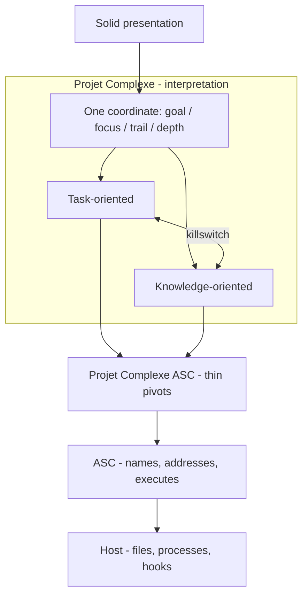
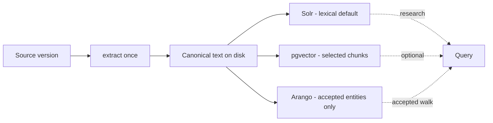
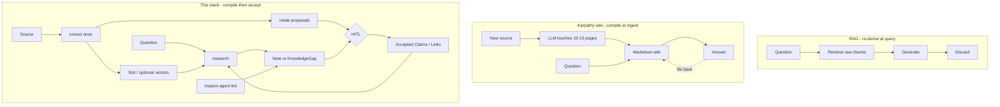
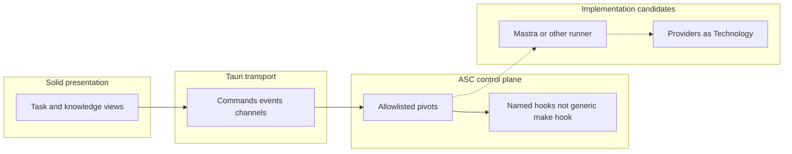
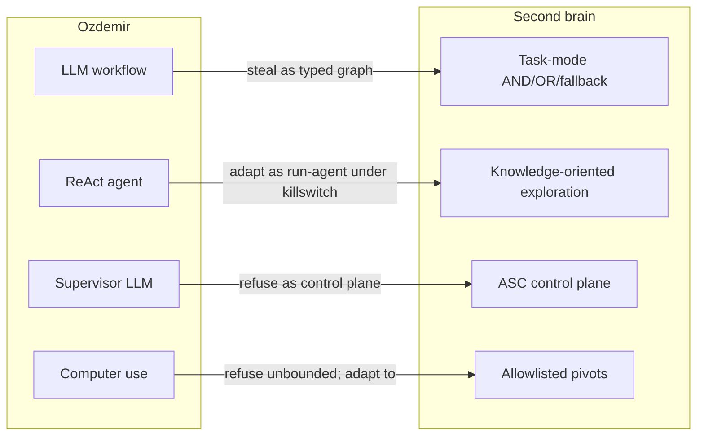
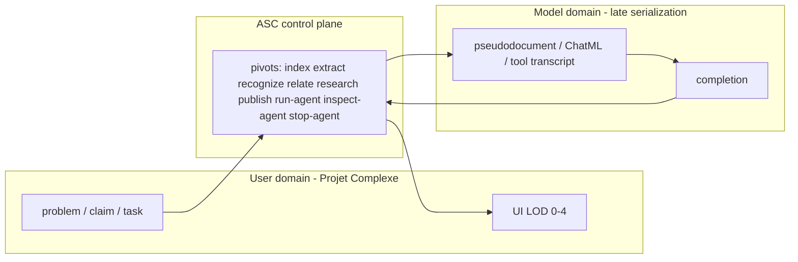
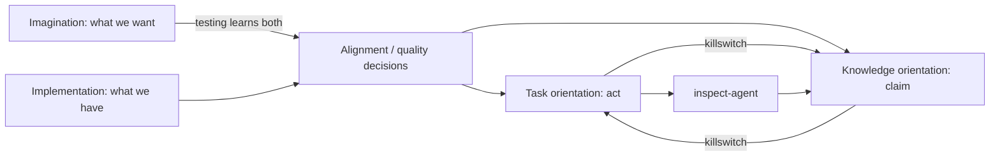
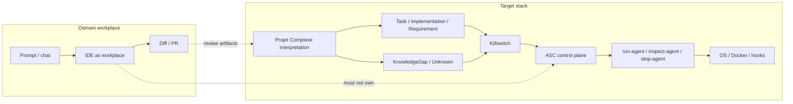
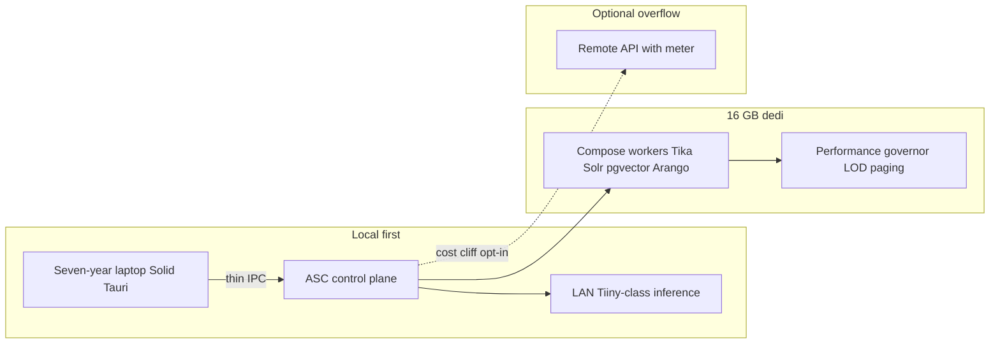
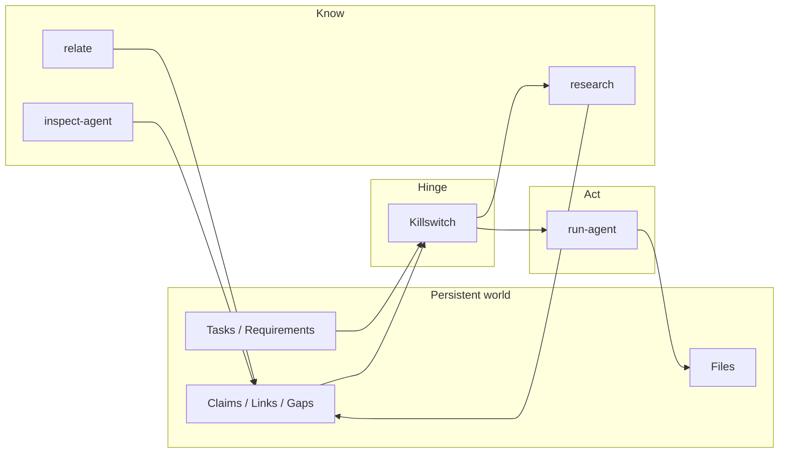

# AI Agents Literature Review

## Toward a second brain with task-oriented and knowledge-oriented agents

- **Date:** 2026-08-18
- **Status:** literature review / design instrument (not a spec, not an implementation plan)
- **Length:** ~702 000 characters (target band 450 000–750 000)
- **Scope:** synthesis of eleven books plus the April 2026 LLM-wiki cluster (Karpathy gist and adjacent memory literature), read against the August 2026 revival of Projet Complexe and ASC
- **End goal:** a durable approach to a personal “second brain” whose agents can *act* (task-oriented) and *know* (knowledge-oriented) without collapsing those two orientations into a chatbot, a vector index, or a second control plane
- **Related (ASC, 2026-08):** Projet Complexe 2026 Revival (v1 and v2); Four Layers; Cognitive Institutions; IEML-as-compass; Reasoning without probabilistic inference; Meadows leverage points; Reverse prompting / Cognitive Load Ratio; Agents of Redirection; Le Moigne; Lefèvre; What is Ecological Redirection
- **Related (Projet Complexe, 2026-08):** `14-proposed-architecture.md`; `17-local-dev-stack-architecture.md`; `17-ui-design-ideas.md`; `18-graph-rag-wikipedia-db-pedia-ieml.md`

This document is a **working instrument**. It exists so that later pivots (`index`, `extract`, `relate`, `research`, `run-agent`, `inspect-agent`, `stop-agent`, `publish`) can be chosen with a map of the 2024–2026 practitioner literature in one place, instead of rediscovering the same mistakes inside LangChain tutorials, Mastra READMEs, and vendor blogs.

It is **not** a substitute for the books. It is a **reading of the books from a specific architectural stance** that was already taking shape in August 2026, before this corpus was opened as a set.

**Contents**

- [§0–8 Front matter](#0-how-this-review-was-produced-and-how-to-use-it) — method, August 2026 decisions, reading grid
- [Part I](#part-i--memory-context-and-tools-as-cognitive-infrastructure) — Grootendorst & Alammar; Labaschin & Wallace; Karpathy LLM Wiki (2026) and adjacent sources
- [Part II](#part-ii--principles-and-patterns-of-production-agents-bhagwat--mastra) — Bhagwat; Bhagwat & Gienow
- [Part III](#part-iii--agentic-workflows-evaluation-multimodality-and-production-ozdemir) — Ozdemir
- [Part IV](#part-iv--prompt-assembly-application-loops-and-conversational-agency-berryman--ziegler) — Berryman & Ziegler
- [Part V](#part-v--verification-testing-and-quality-as-agent-governance-winteringham) — Winteringham
- [Part VI](#part-vi--vibe-coding-ai-assisted-engineering-and-the-70-problem-osmani) — Osmani
- [Part VII](#part-vii--classical-multi-agent-coordination-and-what-llm-societies-should-not-inherit-sadhu--konar) — Sadhu & Konar
- [Part VIII](#part-viii--machine-learning-as-a-system-not-a-model-reddi) — Reddi
- [Part IX](#part-ix--combined-implementation-stance-for-a-second-brain) — combined stance
- [Part X](#part-x--open-choices-the-eleven-books-do-not-settle) — open choices and appendices A–C

---

## 0. How this review was produced, and how to use it

### 0.1 Method

A manual selection of books plus Karpathy’s 2026 wiki cluster (Part I §I.8c). Reddi is read as a systems textbook (consequences, not a neural-net tutorial).

The review **paraphrases**. Long quotation would be both a copyright problem and a design problem: a second brain that stores other people’s books as its own thoughts is exactly the failure mode the 2026 notes already named for Wikipedia dumps (a library, not an import). Terms of art are kept (`ReAct`, `MCP`, `lethal trifecta`, `SOMA`, `Matryoshka embeddings`, `correlated equilibrium`, and so on). Arguments are restated in the vocabulary of Projet Complexe: Task, Implementation, Requirement, Fallback, Claim, Link, Factor, KnowledgeGap, pivot, hook, event, page, LOD.

Each major claim is asked four questions:

1. **What does the author actually claim?** (not the marketing subtitle)
2. **How do they implement it?** (framework, protocol, eval, hardware assumption)
3. **Where does it sit on the August 2026 stack?** (ASC / Projet Complexe ASC / Projet Complexe / Compose engine / UI)
4. **Steal, adapt, or refuse?** for a local, multi-provider, filesystem-first second brain

### 0.2 What this document is for

It is for **approaching** the “projet complexe” described in `/home/paul/Documents/projet-complexe/data/ideas/2026/08`: a Tauri + SolidJS semantic environment over ASC, with task and knowledge as two projections of one coordinate, with Graph RAG as one retrieval strategy among others, with Wikipedia as an offline library, with IEML as a compass.

It is **not** for choosing a forever-framework. Several of the books are written by people who sell or maintain a framework (Mastra, Pearson courseware, vendor reports). That is useful field reporting. It is also a bias. The review treats frameworks as **Implementation** candidates behind stable pivots, never as the control plane.

### 0.3 Character of the corpus

The folder is not a random shelf. It is a 2024–2026 **practitioner stack** with one academic outlier (Sadhu & Konar, 2021) and one systems textbook (Reddi, 2025). Together they cover, almost without remainder, the engineering surface that the revival notes left as “open choices”:

| Surface the revival left open | Books that speak to it |
|---|---|
| What is an agent, technically | Bhagwat *Principles*; Grootendorst & Alammar; Ozdemir ch.1–5 |
| Memory that survives a session | Labaschin & Wallace; Grootendorst & Alammar ch. Memory; Bhagwat memory processors; Karpathy LLM Wiki (2026) and adjacent sources (I.8c) |
| How to put a problem in front of a model | Berryman & Ziegler; Osmani prompting chapters |
| Workflows vs free agents | Ozdemir; Bhagwat graph workflows; Berryman ch. workflows |
| Multi-agent coordination | Ozdemir supervisors; Bhagwat context-sharing; Sadhu & Konar (classical MARL) |
| Evaluation and production quality | Bhagwat *Patterns* evals; Ozdemir experimentation; Winteringham; Berryman SOMA |
| Security and autonomy limits | Bhagwat lethal trifecta / sandbox / guardrails; Reddi security & privacy; Osmani generated-code security |
| Coding agents and the 70% problem | Osmani both titles; Ozdemir coding/computer-use; Winteringham TDD |
| Systems, energy, on-device, MLOps | Reddi entire textbook |
| Testing as governance | Winteringham |

What the corpus **does not** contain, and which the August notes already supply, is the *interpretive* layer: Morin, Le Moigne, Meadows, Lévy, Monnin, Foucault, Lefèvre, ecological redirection, IEML-as-compass. This review therefore **does not redo** Edgar Morin *La Méthode* or the revival v2. It **uses** them as the frame into which the engineering books are placed.

### 0.4 How the parts are organized

The review is **not** eleven sequential book reports dumped in filename order. It is organized by the problems a second brain actually has:

| Part | Problem | Primary books |
|---|---|---|
| **0** (this front matter) | Stance, corpus, August 2026 decisions, reading grid | ASC + Projet Complexe notes |
| **I** | Memory, context, tools as cognitive infrastructure | Grootendorst & Alammar; Labaschin & Wallace; Karpathy LLM Wiki cluster (I.8c) |
| **II** | Production principles and patterns | Bhagwat; Bhagwat & Gienow |
| **III** | Workflows, evals, multimodality, deployment | Ozdemir |
| **IV** | Prompt assembly and the application loop | Berryman & Ziegler |
| **V** | Verification and testing as governance | Winteringham |
| **VI** | Vibe coding, the 70% problem, ownership of generated code | Osmani |
| **VII** | Classical multi-agent coordination (what not to inherit) | Sadhu & Konar |
| **VIII** | ML as a system (edge, MLOps, privacy, sustainability) | Reddi |
| **IX** | Combined implementation stance for Projet Complexe | all |
| **X** | Open choices, refusals, and a suggested order of experiments | all |

If you are in a hurry, read **§1 (what August already decided)**, **§3 (reading grid)**, then **Part IX**. The middle parts exist so that Part IX is evidenced rather than asserted.

---

## 1. What August 2026 already decided (the literature must not undo this)

The books below are full of tempting inversions: make Mastra the brain, make LangGraph the workflow engine, make a vector database the memory, make the IDE the agent, make computer-use the universal tool, make Wikipedia the knowledge graph, make the cloud the default runtime. The August notes already refused most of those inversions. The literature review’s job is to **steal mechanisms** without **importing control planes**.

### 1.1 Three projects, not one blob

Revival v2 distinguishes:

- **ASC** — generic computational vocabulary. What exists computationally, where it is, what can be done. Useful with no GUI.
- **Projet Complexe** — semantic and visual environment. What am I trying to accomplish, what is known, how should I act. The second-brain layer. Tauri + SolidJS is incidental.
- **Projet Complexe ASC** — thin, project-specific pivots. The names the UI is allowed to speak.

The engineering books almost never make this cut. They say “application” and mean a Python process that is simultaneously ontology, planner, tool runner, UI, and database. That is the 2025 default. It is the default this project is not taking.



The UI never operates the host. Task and knowledge are two faces of the same coordinate, not two apps. Pivots are the only verbs the UI may speak.

### 1.2 Two orientations, one coordinate

Task-oriented and knowledge-oriented are **not tabs**. They are two projections of one location (`goal`, `focus`, `trail`, `depth`). Switching mode must not move the coordinate. Agents sit on the hinge: they must stop acting in order to research, and stop researching in order to act (the mutual killswitch).

Most of the selected books corpus is **task-shaped** (workflows, tools, evals, code). A few chapters are **knowledge-shaped** (RAG, memory, Graph RAG mentions). Almost none model **unknowns** as first-class objects. That absence is the most important finding of this review, and it is why the 2010s knowledge-oriented entity diagram (Note, Source, Link, Factor, Type of Link) plus the 2026 additions (Claim, Evidence, KnowledgeGap, confidence, valid_at, provenance) remain the interpretive core.

### 1.3 Four communication primitives, not “the API”

Proposed architecture (14): **Request, Event, Stream, Query**. Tauri commands for bounded work; events for small notices; channels for ordered high-volume data; queries for paged graph/search slices. Never ship the whole graph. Never let the webview open Solr. Never pass an arbitrary `make` string.

The books talk constantly about “the agent loop.” They almost never talk about **IPC budgets**. Reddi is the exception at the ML-system layer (data movement, memory hierarchy, on-device). Berryman & Ziegler are the exception at the prompt-assembly layer (snippetizing, scoring, elastic snippets). Those two, plus the performance governor in note 14, are the correct lineage for paging.

### 1.4 Extract once, fan-out projections

Local-dev-stack note (17): Tika / OCR / ASR write canonical text; Solr, pgvector, and Arango are projections that may lag. Lexical first. Embed selected corpora. ASR on video is a cost cliff. Bibliographic snapshot HTML/JS is noise.



One extract, three projections, none of them the system of record. The dashed arrows are retrieval, not a second ingest.

Several books will recommend “just embed everything” or “just use a vector database as memory.” Those recommendations are **refused** as defaults. They remain available as *optional projections* behind `index`.

### 1.5 Knowledge is not RAG

Graph-RAG note (18): Graph RAG is a retrieval strategy over *your* texts. Wikipedia is an offline third-party library. IEML is a compass. Chat logs are not memory across providers.

The memory books in this corpus still, on the whole, **identify memory with embeddings plus conversation history**. They are right about engineering pain (nondeterministic retrieval, context windows, checkpointing). They are wrong if they are taken as an epistemology.

### 1.6 Capability, not implementation

Revival: the consumer asks for OCR, not for Tesseract; for `run-agent`, not for `ollama run`. Providers expected in one environment: Ollama (laptop), a LAN device (Tiiny or similar), remote APIs, Cursor CLI wrapped as a runtime. What must travel between them is **typed artifacts + provenance**, not hidden states and not mixed embedding spaces.

Bhagwat’s “dynamic agents” and “model routing,” Ozdemir’s “when workflows versus agents,” and Berryman’s “application loop” are all compatible with this **if** the stable name lives in Projet Complexe ASC, not in the framework config.

### 1.7 What not to build first

Revival §59–60 and UI note §9: no giant API, giant graph schema, giant agent framework, giant component library, second execution engine, TanStack-as-architecture, IEML in the hash, code-graph-rag on day one.

Several books are implicitly selling the giant agent framework. Read them as **pattern catalogs**, then keep the framework out of the control plane.

---

## 2. The August 2026 interpretive frame (authors the selected books corpus does not contain)

A literature review that only repeated practitioner manuals would make the project dumber than it already is. The engineering books are **execution-layer** literature. The interpretive frame is already written. This section restates it just enough that later parts can point at it without rewriting Morin.

### 2.1 Four layers (Monnin, Lévy, Meadows, agents)

| Layer | Question | Closest inspiration | What selected books mostly offer |
|---|---|---|---|
| Ontology | What exists? | Monnin (digital objects, identity through revision) | Files, sessions, checkpoints, “memories” as rows |
| Semantics | What does it mean? | Lévy (computable semantics; IEML as compass) | Embeddings, entity strings, sometimes knowledge graphs |
| Dynamics | How does it evolve? | Meadows (stocks, flows, delays, leverage) | Eval loops, memory promotion, forgetting curves |
| Execution | Who changes it? | Agent frameworks | Tools, workflows, supervisors, computer-use |

The books are thick at execution, thin at ontology (except when they say “it’s just data”), thinner at explicit semantics, and accidentally interesting at dynamics whenever they discuss evals, promotion of memories, or hysteresis.

### 2.2 Cognitive institutions (comparison axes)

The Superpowers vs Guardrails memo already warned not to compare unlike layers. The fifteen dimensions collapse to four axes used throughout this review:

- **Cognition** — planning, memory, attention, reflection
- **Governance** — constraints, permissions, verification, accountability
- **Ecology** — humans, tools, other agents, hosts, energy, vendors
- **Evolution** — learning, adaptation, self-modification, long-term change

Mastra, LangGraph, Mem0, MCP, Cursor, Ollama, Solr, Arango are **not competitors**. They occupy different cells of this grid. Part IX places them.

### 2.3 Meadows leverage applied to agents

The leverage-points memo already ranked temperature and chunk size as the lowest interventions. The selected books corpus spends a surprising fraction of its pages at levels 12–10 (parameters, buffers, stocks and flows of tokens). The highest-leverage chapters, relative to this project, are the ones that change **information flows** (who sees what), **rules** (allowlists, lethal trifecta), **goals** (complete the project vs answer the chat), and **paradigms** (agent as OS vs agent as chatbot vs agent as collaborator vs agent as modeling system).

### 2.4 Cognitive Load Ratio and reverse prompting

Prompt engineering books will try to make the prompt the main variable. The CLR memo already ranked:

1. reverse prompting (infer the prompt from the output) — weakest
2. prompt engineering
3. context engineering
4. meta-cognitive regulation of the operating regime — strongest

Berryman & Ziegler, despite the title, are mostly a **level 3** book (assembly of a model-domain document). Grootendorst’s “context as the specification” is also level 3. Osmani’s 70% problem is a **level 4 symptom**: the task’s residual complexity exceeds the architecture’s effective capacity, and more prompting does not close the gap. KnowledgeGap is the object that should be created at that point, not another prompt.

### 2.5 Lefèvre: autonomy is a loop against a resistant world

Tool-calling agents choose from an API. Lefèvre’s RPG loop is description → intention+means → decision → world’s resolution → new description. The environment is an interlocutor, not a database. This matters when Ozdemir and Bhagwat celebrate computer-use: unbounded computer-use is an attempt to make the whole OS into a tool API. Projet Complexe already decided the world-that-resolves is **ASC + the filesystem + Compose**, and the webview does not get a generic shell.

### 2.6 Le Moigne: models are constructed for a purpose

Every agent memory schema is a model, not a mirror. Usefulness, coherence, and revisability beat “true ontology.” This licenses the revival’s refusal of a giant frozen graph schema, and it licenses **comparing implementations** as a first-class activity (the 2010s task diagram’s Comparison entity).

### 2.7 Ecological redirection

Transition optimizes means. Redirection questions direction, attachments, heritage, closure, negative commons. For agents this is not a sermon. It is a design rule:

- every new attachment (a hosted memory vendor, an always-on computer-use browser, an embed-everything pipeline, a Wikipedia-in-Arango import) is something that will later be expensive to renounce;
- local-first and allowlisted pivots preserve the possibility of redirection;
- energy, disks, and seven-year-old laptops are not edge cases; they are the ecology.

Reddi’s sustainable-AI and on-device chapters are the engineering counterpart. Monnin is the reason those chapters are not optional CSR.

### 2.8 IEML remains a compass

The engineering books do not mention IEML. They do, repeatedly, rediscover the **spec** the IEML memo already isolated: compositionality, canonical representation, stable identifiers, interoperability across model upgrades. They implement that spec as JSON memories, namespaces, graph edges, or MCP resource URIs. That is fine. It is not a reason to ship an IEML runtime.

---

## 3. A reading grid for the eleven books

Before the deep parts, a compact placement. Later parts justify the cells.

### 3.1 What each book thinks an “agent” is

| Book | Implicit definition of agent | Hidden goal | Typical runtime assumption |
|---|---|---|---|
| Grootendorst & Alammar | LLM + memory + tools + (later) planning | Understand internals visually | Hosted or local LLM, Python-shaped |
| Labaschin & Wallace | Nondeterministic program whose data is “memory” | Stop digital amnesia | Redis / vector DB / LangGraph |
| Bhagwat *Principles* | Model + tools + memory + optional workflow graph | Ship a Mastra app | TypeScript, hosted models default |
| Bhagwat & Gienow *Patterns* | Same, plus evals and security as production | Get from MVP to production | Same |
| Ozdemir | Workflow and/or multi-agent system that can be evaluated and optimized | Business outcomes (SDR, policy, research) | GPU / API budget available |
| Berryman & Ziegler | An application loop that translates user problems into model-domain documents | Make Copilot-class products | Large context, retrieval stack |
| Winteringham | LLM as assistant to a *tester*, sometimes as a tool-using test agent | Quality under skepticism | ChatGPT-era APIs (2024) |
| Osmani | Spectrum from conversational code to AI-assisted engineering | Ship software without drowning in 70% residue | Cursor / Copilot / Claude / local IDE |
| Sadhu & Konar | Multiple RL agents sharing a Markov game | Coordinated robots | Simulation + Q-tables |
| Reddi | Not an “agent book”: ML **system** spanning data, training, inference, ops | Make AI that actually runs | Cloud → tiny continuum |
| Karpathy LLM Wiki (2026 gist) + cluster (I.8c) | Maintainer of a compiled markdown wiki between human and raw sources | Stop re-deriving knowledge at every query | Markdown + git + optional local hybrid search; human-in-the-loop ingest |

Projet Complexe’s definition is stricter than all of these except perhaps Lefèvre’s: an agent is a **consumer of pivots** that moves between task and knowledge orientations, emitting events, writing typed artifacts, and submitting to a killswitch. That definition is compatible with Bhagwat’s “levels of autonomy” and Ozdemir’s “workflows versus agents,” and incompatible with “the agent is the Python process that is the app.”

### 3.2 Cognition / Governance / Ecology / Evolution

| Book | Strongest axis | Weakest axis |
|---|---|---|
| Grootendorst & Alammar | Cognition (memory types, context engineering, tool learning) | Ecology (energy, attachments, local-first) |
| Labaschin & Wallace | Cognition (storage/retrieval) + a little Evolution (promotion, forgetting) | Semantics as inspectable structure; Governance beyond vendor lock-in chapter |
| Bhagwat *Principles* | Cognition (building blocks) + Governance (middleware) | Knowledge epistemology |
| Bhagwat *Patterns* | Governance (evals, lethal trifecta, sandbox) | Knowledge-oriented work |
| Ozdemir | Cognition (multi-agent, multimodal) + Evolution (fine-tune, optimize) | Ontology of unknowns; redirection |
| Berryman & Ziegler | Cognition (assembly loop) + Governance (eval) | Multi-host ASC world |
| Winteringham | Governance (skepticism, testing) | Agentic second-brain memory |
| Osmani | Cognition (workflows) + Governance (own the code) + Ecology of teams | Knowledge graph; ASC |
| Sadhu & Konar | Evolution (learning to coordinate) | LLM-era cognition; personal knowledge |
| Reddi | Ecology (energy, on-device, privacy, sustainability) + Governance (responsible AI, security) | Agent loop as such |
| Karpathy LLM Wiki cluster (I.8c) | Cognition (compile vs retrieve) + Governance (schema, lint) | Ecology; HITL as a Requirement rather than a preference |

The stack this project needs is therefore **not** “pick the best agent book.” It is: Reddi for ecology and systems, Winteringham + Bhagwat Patterns for governance, Berryman + Grootendorst for cognition of context, Labaschin for the honesty of nondeterministic retrieval, Karpathy (I.8c) for compilation-at-ingest versus RAG, Osmani for the human/agent coding ecology, Ozdemir for when to prefer workflows, Sadhu for what coordination proofs look like so we do not fake them.

### 3.3 Meadows leverage: where each book actually intervenes

| Leverage | Typical selected books move | Prefer instead, for this project |
|---|---|---|
| 12 Parameters | temperature, chunk size, top_k | Keep as last-mile knobs on a named embedding space |
| 11 Buffers | bigger context windows, Redis, vector DB capacity | Working memory as ASC-visible checkpoint, not only RAM |
| 10 Stocks and flows | memory architecture, tool orchestration | Separate working / episodic / semantic / procedural **and** keep documents as the semantic stock |
| 9 Delays | nightly summarization, checkpoint TTL | Memory consolidation as a scheduled `relate` / reflection job, not every turn |
| 8 Balancing loops | evals, guardrails, tests, HITL | Winteringham + Patterns evals + killswitch |
| 7 Reinforcing loops | skill libraries, fine-tuning, memory promotion | Accepted Links and reusable Implementations; not unattended graph growth |
| 6 Information flows | subagent context, supervisor, specialized retrievers | Planner sees goals; researcher sees corpus; coder sees repo; reviewer sees traces — already in the leverage memo |
| 5 Rules | allowlists, sandbox, lethal trifecta | Tauri allowlist + ASC capabilities + `lan-only` vs `api-ok` Requirements |
| 4 Self-organization | dynamic agents, tool creation | Allowed later; dangerous as a first milestone (revival: no giant self-modifying framework) |
| 3 Goals | “answer the user” vs “complete the job” vs “maximize eval score” | Complete the *project* and maintain the *knowledge* — two goals in tension, by design |
| 2 Paradigm | chatbot vs agent vs OS vs pair-programmer | Second brain as modeling system (Le Moigne) + machine abstraction (ASC) |
| 1 Transcend paradigms | almost absent | Architecture as hypothesis: compare implementations |

### 3.4 Task-oriented vs knowledge-oriented coverage

A second brain that only reads this shelf will overbuild **task** machinery and underbuild **knowledge** machinery.

**Task-oriented density (high):** Osmani, Winteringham, Bhagwat workflows, Ozdemir SDR/policy/computer-use, Sadhu coordination, Reddi MLOps.

**Knowledge-oriented density (medium, and usually reduced to RAG):** Grootendorst RAG/agentic RAG/A-MEM, Labaschin semantic/episodic/procedural, Bhagwat RAG chapters, Ozdemir “from RAG to agents,” Berryman retrieval/snippetizing, Winteringham RAG-for-tests. Karpathy’s 2026 gist is the exception that names compilation instead of retrieval; the adjacent products (Letta, Mem0, Wiki v2, Rowboat) often collapse it back into a memory service.

**Knowledge-oriented density (low — must come from Projet Complexe itself):** typed contradiction, versioned opinions, KnowledgeGap, Factor, Assembly, comparison pages, killswitch, IEML compass, offline encyclopedia as library, provenance across providers.

That imbalance is not a reason to discard the corpus. It is a reason to **translate** every RAG chapter into “projection over canonical text,” to steal Karpathy’s ingest fan-out as `relate` proposals, and to refuse every chapter (or gist fork) that wants the vector store, the markdown vault, or a memory MCP to be the system of record.

### 3.5 The application loop, rewritten for this stack

Berryman & Ziegler’s loop is: user’s problem → convert to model domain → complete → convert back to user domain.

Projet Complexe’s loop is longer, and the model is not the center:

```text
intent (human or agent)
  → coordinate (goal, focus, trail, depth)
    → orientation (task | knowledge)
      → pivot (allowlisted Projet Complexe ASC name)
        → ASC execution (hook, process, files)
          → engines (Solr / pgvector / Arango / OCR / ASR) as needed
            → bounded artifacts (YAML/JSON sidecars, events, pages)
              → interpretation (Claim, Link, KnowledgeGap, Completion)
                → UI projection (Solid) and/or next pivot
```

The LLM, when present, sits **inside** a pivot as one Implementation. Prompt assembly (Berryman) happens there. Memory retrieval (Labaschin, Grootendorst) happens there. Evals (Bhagwat, Ozdemir, Winteringham) wrap there. The UI does not see the prompt. The UI sees the coordinate and the artifacts.

This inversion — **prompt inside pivot, not pivot inside prompt** — is the single most important translation rule in this review. Parts I–VIII keep applying it.

---

## 4. Inventory of mechanisms the corpus will keep naming

The same dozen mechanisms recur. Naming them once avoids twelve conflicting vocabularies later.

### 4.1 The augmented LLM

Grootendorst & Alammar: a raw LLM is stateless. Hosted chat products are already **augmented** (memory, tools, sometimes retrieval). “Agent” in 2025 marketing usually means this augmentation plus a loop. ASC already has the loop-shaped objects (thread, hook, event). Do not reimplement the augmented LLM as the architecture; implement **augmentation as hooks**.

### 4.2 Working memory vs long-term memory

Working memory ≈ context window contents ≈ conversation or thread state. Long-term ≈ stores outside the window. Psychology-flavored splits (episodic / semantic / procedural) are useful **labels** and dangerous **schemas**. Projet Complexe already has better splits: Source/Note/Claim (semantic), Completion/thread events (episodic), Implementation/Requirement/pivot (procedural). Map, do not duplicate.

### 4.3 RAG, agentic RAG, Graph RAG

- **Vanilla RAG:** embed, retrieve nearest, stuff prompt. Good for paraphrase over a *selected* corpus. Bad as the brain.
- **Agentic RAG:** retrieval is a tool the agent may call repeatedly, possibly across sources. Compatible with `research` if sources are allowlisted and results become citations, not vibes.
- **Graph RAG:** extract entities/relations, maybe communities, retrieve a neighborhood or summary. Compatible with `relate` on personal corpora, schema-guided types, never on Wikipedia.

Lexical retrieval (Berryman, Solr-first note) remains the default for names, quotes, filenames.

### 4.4 Context engineering

Grootendorst lists selection, compression, ordering, tracking, context-as-spec. Bhagwat Patterns adds: parallelize carefully, share context between subagents, avoid failure modes (poisoning, distraction, clash, confusion — the literature’s names vary), compress, feed errors back. Berryman adds snippetizing, scoring, elastic snippets, inertness, position/importance/dependency.

All of that is **the performance governor applied to tokens**, plus Meadows information-flow design. It belongs in the pivot implementation and in `inspect-agent`, not in Solid.

### 4.5 Tools, MCP, computer-use

Tools are the most important design step (Bhagwat). MCP is a USB-C for tools (Bhagwat, Grootendorst). Computer-use is Ozdemir’s and the industry’s bid to skip tool design.

For this project:

- **Tools that are ASC pivots** — yes.
- **MCP** — possible later as a *sidecar protocol* for third-party tools; not the semantic model; not exposed raw to the webview.
- **Computer-use / generic shell / generic `make hook`** — no from the UI. Operator terminal only.

### 4.6 Workflows vs agents

Ozdemir and Berryman both insist a conversational agent is often the wrong shape. Deterministic graphs (branch, chain, merge, condition) are Bhagwat’s Part IV and Ozdemir’s “when workflows versus agents.”

This maps cleanly onto the Minimal Reasoning Model: Requirement chains, AND/OR, fallback. **Prefer workflows for known procedures** (extract → index → page). **Prefer agents for unknown procedures** that should create KnowledgeGaps when they exceed budget. Do not start with a supervisor-of-supervisors.

### 4.7 Evals

Bhagwat Patterns is the most operational: list failure modes, list business metrics, cross-reference, iterate, suite, SME labels, production data. Ozdemir: experimentation as a first-class loop. Berryman: SOMA. Winteringham: skepticism, LLM-as-judge as a tactic not a religion.

Evals are **balancing feedback**. They should become Comparison/Factor objects and CI jobs, not a reason to vendor-lock an eval SaaS.

### 4.8 Fine-tuning vs RAG vs prompts vs typed memory

Ozdemir and Winteringham both compare RAG and fine-tuning. Reddi explains why training is a *system*. For a personal second brain on mixed PDFs and notes: **prompts and typed artifacts first, RAG on selected chunks second, fine-tuning almost never** (except perhaps a small reranker or NER, which Labaschin actually argues for). Fine-tuning is an attachment: model version lock-in, GPU, datasets, forgetting.

### 4.9 Human-in-the-loop

Bhagwat Patterns treats HITL as a configuration pattern. Lefèvre treats the world-resolver as structural. Projet Complexe treats HITL as: the human may be the meneur of the world, the reviewer of Claims, the owner of the killswitch, and the author of Requirements such as `lan-only`. Do not reduce HITL to a React modal in a framework demo.

### 4.10 Security: lethal trifecta, sandbox, secrets

Bhagwat Patterns (following the 2025 public conversation): combining private data, untrusted content, and external communication is how agents exfiltrate. Sandbox code execution. Granular access. Guardrails.

This is already the Tauri allowlist plus “Solid must not hold Solr passwords” plus “no generic hook from the webview.” The books give **vocabulary and attacker stories**. ASC gives **the place to enforce**.

### 4.11 The 70% problem

Osmani: AI gets you to a demo; the last 30% (integration, edge cases, ownership, production) is where senior judgment lives. For agents that are not coding, the same curve appears as: extraction works on clean PDFs and dies on the mixed archive; RAG works on the FAQ and dies on contradiction; multi-agent demos work until context clash.

KnowledgeGap is how the 70% problem should be **represented** rather than endlessly prompted through.

### 4.12 On-device, hybrid, sustainable

Reddi: cloud / edge / mobile / tiny / hybrid are deployment *patterns*, not ideologies. On-device learning, model optimization, acceleration, benchmarking. Sustainable AI and responsible AI are chapters, not appendices.

This is the systems translation of “Ollama on the laptop, Tiiny on the LAN, API when the link and budget allow, Cursor CLI for repo-shaped work.” Hybrid ML is the **Implementation** graph the 2010s task diagram already wanted.

---

## 5. Preliminary steal / adapt / refuse (to be evidenced in later parts)

This table is a promise the deep parts must keep. If a later part contradicts it, the later part wins only with an argument.

| Mechanism | Steal | Adapt | Refuse as default |
|---|---|---|---|
| Working / episodic / semantic / procedural split | the distinctions | map onto Claim/event/Implementation, not four vector stores | four vendor memory products |
| Conversation summarization | as a compression tactic | scheduled consolidation job | every-turn LLM summary as system of record |
| MemoryBank-style forgetting | importance × recency as a *Factor* | human/agent-accepted deletion | silent Ebbinghaus deletion of citations |
| A-MEM / Zettelkasten notes | atomic notes + links | this *is* the knowledge-oriented diagram | LLM-generated tags as ontology |
| Agentic RAG | retrieval as a tool | `research` with allowlisted sources | unbounded web+mail+slack tools |
| Graph RAG | neighborhood retrieval | schema-guided, personal corpus only | Graph-RAG Wikipedia; generic `related_to` |
| NER | entity candidates | resolve to existing Author/Work ids | NER as identity |
| Semantic cache | for repeated lexical queries | Solr/query helper, not a second brain | cache as memory |
| Checkpointing | thread state on disk | ASC thread + sidecar | Redis as the architecture |
| MCP | optional tool transport | behind pivots | MCP as semantic layer; MCP from webview |
| Computer-use | study the failure modes | never as UI-exposed primitive | “the agent uses the computer” |
| Dynamic agents | provider/model as data | Environment/Technology on Task | agents that spawn unrestricted agents |
| Graph workflows | branch/chain/merge/condition | Minimal Reasoning Model | LangGraph/Mastra as control plane |
| Guardrails | schema/policy checks | ASC + pivot I/O schema | Guardrails-as-product required |
| Lethal trifecta | the warning | capability partitioning | “trust the model” |
| Evals / SOMA / SME labels | the discipline | Comparison entity + CI | eval SaaS lock-in; LLM-as-judge alone |
| Fine-tuning | understand the cost | rare, small, named | fine-tune the second brain into a 7B |
| Matryoshka embeddings | multi-resolution vectors | LOD / performance governor | yet another embed-everything pipeline |
| Vibe coding | speed of first draft | pair + validator; own the code | IDE as control plane; skip tests |
| MARL equilibria | conceptual honesty about coordination | typed handoff contracts | Q-learning the second brain |
| Tiny/edge/hybrid ML | local-first legitimacy | Ollama/Tiiny/API as Requirements | cloud-only RAG platforms |
| Sustainable/responsible AI | energy, consent, provenance | redirection + `lan-only` | ethics as a slide |

---

## 6. How Projet Complexe should *read* a vendor chapter

A practical heuristic used throughout:

1. **Replace the framework name with “Implementation.”** If the sentence still matters, keep it. If it becomes empty, it was marketing.
2. **Replace “memory” with “which object, with which provenance, surviving which provider swap?”** If the author cannot answer, they are describing a cache.
3. **Replace “agent” with “who is allowed to call which pivot.”** If the answer is “anything,” refuse.
4. **Ask where the human is.** If only at the start of a prompt, the design is under-governed.
5. **Ask what is refused.** Books that never renounce a feature are transition-engineering, not redirection.
6. **Ask what happens when the home link drops.** If the chapter assumes Wikipedia and a hosted embedder, it is writing for a different ecology.

---

## 7. Map of later parts (reader’s index)

The following parts go book-deep. Each starts from the authors’ structure, then translates.

- **Part I** — Memory and tools (Grootendorst & Alammar; Labaschin & Wallace): types of memory, RAG variants, context engineering, MCP/tool learning, nondeterministic retrieval, NER, multimodel economics, lock-in, collective memory.
- **Part II** — Principles and patterns (Bhagwat; Bhagwat & Gienow): building blocks, MCP, workflows, twenty-two production patterns, evals, lethal trifecta.
- **Part III** — Production handbook (Ozdemir): workflows vs agents, multi-agent, multimodal, reasoning/computer-use, fine-tune, compression, embeddings.
- **Part IV** — Application loop (Berryman & Ziegler): tokenizer-world, prompt content and assembly, tools/ReAct, workflows, SOMA evals.
- **Part V** — Testing (Winteringham): mindset, TDD, exploratory testing, test agents, RAG/fine-tune for QA.
- **Part VI** — Coding with models (Osmani): 70% problem, prompting, ownership, security of generated code, autonomy spectrum.
- **Part VII** — MARL (Sadhu & Konar): coordination, consensus, correlated equilibrium — analogies and refusals.
- **Part VIII** — ML systems (Reddi): workflow, data, ops, on-device, robust/secure/responsible/sustainable AI.
- **Part IX** — Combined stance: a single architecture reading.
- **Part X** — Open experiments behind named pivots.

---

## 8. A note on years, hype cycles, and zombie features

Monnin’s zombie technologies are not only oil infrastructures. They are also **software features that remain socially alive after they have become epistemically dead**: conversation memory sold as knowledge, embeddings sold as meaning, auto-GPT sold as autonomy, computer-use sold as a universal tool, eval dashboards sold as understanding.

The 2021 Sadhu book is already “old.” That is useful: it shows what coordination looked like when it still required a proof. The 2024 Winteringham book is pre-agent-boom and therefore calmer about skepticism. The 2025 books are written in the year of agents; they are field manuals with short half-lives. Reddi is the one most likely to still matter in 2029, because data movement and energy do not care what we named the loop.

Read the 2025 manuals for **patterns**. Read Reddi for **constraints**. Read the August 2026 notes for **ends**.

---


# Part I — Memory, context, and tools as cognitive infrastructure

In 2025, Maarten Grootendorst and Jay Alammar published a visual textbook on how agents are built and how they “think.” Benjamin Labaschin, Jim Allen Wallace, Andrew Brookins, and Manvinder Singh wrote on managing memory for AI agents: nondeterministic retrieval, long-term memory, multimodel economics, and collective memory. Together they are the shelf’s cognition of memory and tools. Import their distinctions; do not import their stores. §I.8c adds Karpathy’s LLM Wiki gist and the memory systems around it.


---

## I.1 What kind of books these are

Grootendorst is a psychologist–data scientist who explains models visually (BERTopic, KeyBERT). Alammar is the visual-transformer explainer, now at Cohere. The book is visual intuition, not a framework manual.

Labaschin and Wallace is a field report: Redis, LangGraph, Mem0, Google ADK, vendor interviews, economics charts. It is the most honest book in the folder about nondeterministic retrieval. It is also the most tempted by enterprise transactive memory systems (TMS) as a product category. Redis, LangCache, and related products are worked examples, not a survey.

On the cognitive-institution axes: the illustrated guide is strongest on **cognition** (memory types, RAG families, context engineering, tool learning); Managing Memory on **governance** and **ecology** (evals, lock-in, token cost, TMS) — neither names a killswitch, energy, or heritage. **Evolution** is weak in both (forgetting curves are not decades of a second brain); Requirement / Environment / Technology / Fallback is the mechanism already chosen.

Meadows’ ranking is the sorting rule: prefer information flows, rules, goals, and paradigms over temperature knobs. Lefèvre’s description–intention–resolution loop is the autonomy test: choosing a function from an API is not autonomy. Cognitive Load Ratio (CLR) regulates task complexity against context, retrieval, tools, memory, and budget.

Chat logs, embeddings, and framework “memory objects” are not strata. Working memory, long-term typed artifacts, and a governed collective layer are.

---

## I.2 The forgetful function

Grootendorst’s opening move is definitional. A raw local LLM does not remember a name across calls. Hosted ChatGPT and Claude products are not raw LLMs; they are augmented with memory and tools. Without memory a personal assistant cannot recall past conversations, a coding agent cannot hold a codebase, and an agent repeats actions it has already taken. Memory is not only the history of this run. It includes external information beyond agent–environment interaction: hosted documentation, issue trackers, organizational corpora. Memory is both recall and the decision of what newly generated information to store, and how.

Labaschin’s introduction names the lived pain: brilliance inside a session, blank stare across sessions — digital amnesia that forces a loop of re-explanation. Memory management sounds like data management, and it is, except agents use data nondeterministically. A classical database returns the same records for the same query. An agent may retrieve different items under slight rephrasing; it may compress old transactions into vague summaries; it does not run a precise `SELECT`.

Three consequences for Projet Complexe:

1. **Do not confuse product UX with model capability.** If Ollama “forgets,” that is correct behavior of a stateless function. Persistence is this stack’s job (ASC threads, sidecars, typed objects), not a missing flag on the model.
2. **Hosted memory is an attachment.** The convenience of ChatGPT memory is Labaschin’s lock-in category three: conversation histories and embeddings on someone else’s disk, with egress pain. Local-first and `lan-only` Requirements exist to refuse this by default.
3. **The loop is not ASC.** ASC already has threads, hooks, events. The LLM loop is an Implementation inside `run-agent`. Grootendorst’s diagrams of “modules around the LLM” should be redrawn as hooks around a pivot, or the project will rebuild LangChain in YAML.

The tension Labaschin names — humanlike metaphor versus different architecture — is high-leverage. If memory is RAM-plus-psychology, you will buy Mem0. If memory is durable digital objects, you will store Claims. The books improve chat-with-memory. This project is building a second brain whose interpretations are inspectable without replaying a model.

### Steal / adapt / refuse

**Steal.** Stateless LLM versus augmented product as a clarity rule. Memory includes external corpora (`extract` on personal sources). Persistence across sessions is the actual product.

**Adapt.** “Agent = LLM + memory + tools + loop” becomes: pivot + assembled window + projections + ASC execution. The human remains the conductor (Labaschin’s conclusion); the score is typed artifacts, not a better whisper to a hosted orchestra.

**Refuse.** Hosted hidden memory as the model for a local-first knowledge institution. Collapsing ASC, Projet Complexe, and pivots into “the agent’s memory module.”

---

## I.3 Four types of memory (CoALA) and why they must not become four products

Grootendorst follows Sumers et al., *Cognitive Architectures for Language Agents* (CoALA): short-term **working memory** and three long-term kinds — **episodic**, **semantic**, **procedural** — plus **parametric** memory in the weights. Labaschin uses the same triad, adds a sensory bucket (images, audio, haptics) that the illustrated guide postpones to unavailable multimodal chapters, and stresses industry drift: Anthropic, OpenAI, and Google use different words for similar layers. Hybrid systems let memories change type by usage. Semantic caching and promotion of frequently accessed short-term items into long-term stores are presented as analogues of human consolidation, including a Redis CEO’s REM-cycle metaphor. The metaphor is pedagogically effective and architecturally dangerous if taken as a license to auto-delete personal knowledge.

These types are a **reading grid**, not four databases.

### Working memory

Limited-capacity buffer for the current decision. For LLMs: chat/thread history re-injected every call. The model does not recall; it is told. Context windows bound the buffer. As history grows, tokens compete with reasoning tokens and retrieved text. Attention degrades; answers truncate; prompts fail to process.

Techniques in the illustrated guide:

- **Trim / FIFO** — drop oldest messages. Fast; loses early constraints. Labaschin notes that FIFO makes early legal negations disappear, and that transformers recall recent tokens better than first tokens even in million-token windows.
- **Summarize each turn and stack summaries** — slower growth; stacked summaries still rot; summaries lose negations and case citations (Labaschin’s legal-text warning is canonical for a research brain).
- **Rolling summary of last *k* turns**, or **one living summary updated in place**.
- **Crop** to system prompt plus a durable artifact such as `PLAN.md` after a planning exchange, so the superseded plan never occupies the next call.

Labaschin’s operational palette for the same problem: importance scoring (recency, frequency, engagement, keywords); cascading systems where the agent chooses what to promote; intelligent compression by specialized summarizers; vector-store offloading of older messages; semantic caching of frequent corpus queries; checkpointing of agent state (Redis threads, TTLs).

FIFO is acceptable for ephemeral chatter. It is lethal when the first messages contained the killswitch, the forbidden corpus, or the rule that Wikipedia is library-not-graph. Turn-by-turn summarization must remain a *working* compression with originals on disk for `inspect-agent`. A summary that drops “not” or “unknown” converts a KnowledgeGap into a fake Claim. Cropping to typed task artifacts is the tactic that already looks like Projet Complexe. Vector-store offloading of old messages is episodic archive plus similarity search — useful for “did we already try this compiler flag last Thursday,” harmful if those hits become facts about the world. Importance scoring is a window-admission policy, not a deletion policy for accepted knowledge. Cascading promotion (“the agent chooses what is long-term”) is refused as a default; it can be a proposal that `relate` or a human accepts.

Steal: working memory is a **budgeted window**, not a diary. Adapt: the window is an ASC thread’s working set, governed like the UI’s LOD 0–4. Refuse: every-turn LLM summarization as the system of record. A Completion can *contain* a summary; the events remain.

### Episodic memory

Specific events and outcomes. For agents: traces of actions. Labaschin: RAG over conversation histories, few-shot from past sequences, structured logs of events, key events/actions/outcomes in structured formats.

Steal: traces are first-class. An event stream (`agent.started`, `process.output`, tool I/O, failures) is episodic memory. Adapt: store traces as files/events Solr can search; do not embed every stderr line. Refuse: “episodic = vector of the chat.”

Checkpointing (Labaschin, Chapter 1 and again in Chapter 5): periodic save of internal state so a killed session can resume. The insight they emphasize is that a checkpoint must be retrievable and actionable under nondeterminism, not merely a blob. Redis appears as the industry default because it is fast and has TTL. Hierarchical tiers (short-term, long-term, archival), cross-agent sync, and version control with rollback appear later as organizational tactics.

For this project the analogue is **ASC thread state on disk** with optional TTL for *working* checkpoints, not for Claims. TTL on a citation is vandalism. `run-agent` / `inspect-agent` / `stop-agent` need restorable process state (step, tool call, worker PIDs, budget spent). Versioned artifacts hold intention (plans, requirements, killswitch). Cross-agent “sync discoveries” must pass through `relate` and acceptance. “Learned patterns” as prompt diffs belong in procedural memory under review, not silent self-modification. Refuse checkpoint-as-knowledge-base and hosted vendor checkpoints as the only copy of personal context.

### Semantic memory

World knowledge. For agents: external DBs, Wikipedia, the codebase. Grootendorst’s RAG pipeline lives here. Labaschin: facts, definitions, rules, knowledge bases, symbolic AI, vector embeddings, user or entity profiles inserted into system prompts.

This is the dangerous category. Semantic memory in psychology is stable knowledge. Semantic memory in 2025 products is whatever the embedder last indexed. Projet Complexe already split this into Source / Note / Claim / Concept / Link, plus unknowns and knowledge-gaps with provenance, confidence, and `valid_at`. Keep that split. RAG is how you *find* passages, not how you *are* knowledge. Wikipedia/DBpedia fr+en+pt are an offline *library* of pointers (QID), not an Arango import. Graph RAG, when used, walks accepted personal entities under closed link types (similarity, complementarity, variant, contradiction, supports, conflicts, sufficient-for). Never Graph-RAG Wikipedia.

### Procedural memory

How to do things. Parametric (weights) or system prompt (persistent instructions). Labaschin: least common in products; growing via reflection/metaprompting that rewrites the agent’s own prompt. Combinations of LLM weights, agent code, and system prompts.

Steal: procedures should be **Implementations and pivots**, versioned in git. Adapt: a successful `extract` path can be saved as an Implementation (reinforcing loop). System prompts should be assembled from versioned policy objects (allowed tools for this pivot, date, killswitch state), not from a growing essay. Refuse: unsupervised prompt self-rewrite as v1 — evolution of the institution without governance. Persistence across calls is not persistence across years. Prompts die with products. ASC names and pivot names are the durable procedural vocabulary.

### Parametric memory

The model already “knows” Paris is the capital of France. Fine-tuning can instill more; Grootendorst warns it is unstable (what is retained versus reconstructed). Labaschin and later economics chapters price this. For a personal brain: **do not fine-tune your notes into a 7B.** Notes change; weights do not like to. Multi-provider handoff carries typed artifacts and provenance, not a fine-tune you cannot export.

### Sensory / multimodal as a cost cliff

Labaschin’s sensory bucket (images, audio, haptics) is real work and a real bill. Grootendorst defers multimodal chapters. This stack already treats ASR on all video, embed everything, and OCR every photo as **opt-in cost cliffs**. Sensory ingestion is not a default memory type. It is `extract` with an Environment and a Fallback.

### Steal / adapt / refuse (memory types)

**Steal.** Working / episodic / semantic / procedural as labels. Working = assembled window for one pivot invocation. Episodic = `run-agent` / `research` events. Semantic = Solr + selected pgvector + accepted Arango + QID library. Procedural = ASC hooks, pivot implementations, policies.

**Adapt.** Promotion from working to long-term is an acceptance act, not an agent whim. Sensory/multimodal is opt-in. Collective memory (Labaschin’s third layer, developed in I.13) is a separate governed stratum, not a fourth CoALA type mixed into the personal graph.

**Refuse.** Four vendor databases, one per type. Parametric memory for personal knowledge. Auto-forgetting inspired by Ebbinghaus or REM on the user’s second brain. Conversation history as system of record. Mixing team TMS into personal Arango without access rules.

---

## I.4 Vanilla RAG, with the project’s extract-once rule

Grootendorst presents retrieval-augmented generation as the common long-term memory method, in two stages. **Ingestion** embeds unstructured text with an embedding model trained so similar meanings lie nearby, and stores those vectors. **Inference** has four steps: embed the query with the *same* model; retrieve nearest neighbours (similarity, or hybrid lexical-plus-vector / bag-of-words); stuff hits into the prompt; generate. Purpose: reduce hallucination by providing assumed-true external text. They name Graph RAG and multimodal RAG as variants that each need their own design, without developing Graph RAG in the extracted text.

Labaschin: retrieval is fuzzy (`bank` the building versus the river); metrics include cosine, Euclidean, TF-IDF; local stores include Chroma, Redis, Postgres/pgvector, Qdrant; there is no single right search. RAG is also their answer to quadratic attention and stuffed windows: constrain the corpus, force sourced generation. Semantic caching is a refinement for repeated queries against a shared corpus (internal RAG, many users, same documents). It works for single-shot questions and breaks down in multiturn dialogue.

Hallucination reduction only holds if the retrieved context is actually relevant **and** actually true. OCR errors poison both Solr and vectors. Keep confidence. Link image region to text block when you can.

Large context windows (Gemini-class millions of tokens) do **not** replace RAG. Grootendorst: Needle-in-a-Haystack (NIAH) looks good and produced marketing heatmaps; RULER and later work show multi-hop tracing and aggregation collapse as length grows; “context rot” names quality collapse from stuffing. Cost and latency scale with tokens; VRAM too. Stuffing the mixed archive into context is a recipe for failure. That sentence is the same rule as “never dump the graph over IPC,” applied to prompts.

**Translation already decided:**

- Canonical text on disk first (`extract` once per source version; Tika or Docling or a future worker).
- Solr lexical default.
- pgvector optional on selected chunks, **named embedding space** (model, version, dimension).
- Arango receives *accepted* entities, claims, and closed links — not raw chunks, not Wikipedia.
- Do not embed the social-media photo dump.
- Do not treat similarity as contradiction-detection.

Never mix incompatible embedding spaces. Both books say use the same model at query as at ingest for a given index. They do not labor the multi-provider case. This project must: a handoff carries typed artifacts and provenance, not a pickle of vectors from embedder A queried by embedder B. If an embedder is retired, re-embed selected chunks as a new projection; do not concatenate spaces. Query-time code refuses a 1024-D query against a 768-D index. If a cloud embedder is withdrawn, lexical and graph projections still work; the vector projection is marked stale.

Labaschin’s menu of Pinecone / Weaviate / Qdrant / Chroma / pgvector / Redis is a Technology row for the vector *projection only*. Solr is not on their menu and stays first. Arango is not on their menu because they treat graphs as Mem0g or Zep features. Semantic cache, if any, caches projection answers (query → hit IDs), not a fourth source of truth.

### Steal / adapt / refuse

**Steal.** Hybrid lexical-plus-vector as legitimate, not a compromise. Same embedder at ingest and query. RAG as a way to limit stuffing.

**Adapt.** Vanilla RAG as a *projection query*, then a typed write — not as knowledge. Hybrid means Solr first, vectors on selected chunks, graph walk on accepted entities.

**Refuse.** Naive RAG as the knowledge model. Embed-all. Treating hallucination reduction via RAG as equivalent to claims-with-evidence. Mixing embedders in one index. Wikipedia vectors in the personal index.

---

## I.5 MemoryBank, forgetting curves, and why silent deletion is forbidden here

MemoryBank (Zhong et al., in Grootendorst): long-term store of conversation experiences, updated with an Ebbinghaus-inspired rule. Retrieved items persist; unused items may vanish; spaced repetition analogue. Variants stored: raw multi-turn conversations, LLM summaries of past events, a “user portrait” of traits and emotions always injected. Turns and summaries are embedded; the portrait is dynamically updated. When a query arrives, related turns and summaries are retrieved with the portrait; retrieved turns are strengthened.

This is clever product design for a companion chatbot. It is a **hazard** for a research journal.

- Forgetting unused citations because they were not retrieved lately is how you lose the dissenting source.
- A “user portrait” is a statistical stereotype injected into every prompt — a hidden system prompt you did not version.
- Strength-on-retrieve is a reinforcing loop without a balancing “this is still true” check (`valid_at`, contradiction links).

The lesson Grootendorst draws is that each use case needs different memory types and update rules; vanilla RAG is a cartoon. Steal that lesson. Refuse the forgetting daemon on accepted knowledge.

Adapt: **importance × recency as a Factor** on a Link, displayed in knowledge mode, never as silent deletion. Human or `relate` can archive. Archival storage (Labaschin’s hierarchical tiers) is allowed if it is reversible and inspectable (git, not TTL). MemoryBank-style strength can apply to *caches* of frequent Solr/pgvector hits, never to the source of truth.

---

## I.6 Agentic RAG: retrieval as a tool, not as a personality

Vanilla RAG gives the model whatever the retriever chose; the LLM has no agency over retrieval. Agentic RAG gives the **agent** the database as a tool: it may choose source, query again, stop when “enough.” Single-agent form: router over several external knowledge sources. It may extract from one search and run a subsequent search in another database. Multi-agent form: small retriever specialists coordinated by a more capable orchestrator. Sources need not be vector DBs (web, Slack, Gmail APIs). The vocabulary shift is deliberate: they speak of LLMs for RAG and of agents for agentic RAG, because agency is the point.

This is closer to `research` than vanilla RAG is, but the books do not encode a killswitch between acting and researching, nor a rule that Wikipedia is a library of pointers. “Enough” is judged inside the agent. Unbounded loops, mail-as-memory, and cost cliffs follow.

Steal: `research` is allowed to call retrieval **more than once**, across Solr then optional vectors then accepted neighbours. Adapt: sources are **allowlisted**. “Enough” is a budget (CLR) plus a KnowledgeGap if still insufficient. Graph RAG is a *third rung* on selected personal corpora, schema-guided, never a general Wikipedia graph. Multi-agent retrieval maps to small specialized workers behind ASC, each with a narrow context, coordinated by `run-agent` / `research`, not a swarm that shares one chat log. Refuse: Gmail+Slack+web as default tools (lethal trifecta with a private corpus). Agentic RAG that browses connectors into the personal graph without extract-once and acceptance.

Agentic RAG is the *control* of rungs 1–3, not a fourth ontology.

---

## I.7 A-MEM and Zettelkasten: the knowledge-oriented diagram in 2025 clothing

A-MEM (Xu et al., 2025, cited by both books) copies Zettelkasten: atomicity, hypertextual notes, personalization. Each note is one interaction (atom) plus timestamp, LLM-generated keywords, tags, and a contextual description. Almost everything is concatenated and embedded as one vector; that embedding is used as an identifier. Linking: similarity search for top-*k* candidates, then an LLM decides which candidates become links. After linking, the LLM updates tags, keywords, and descriptions of related notes — an “evolutionary” memory. At query time the agent can retrieve a note and follow links.

This is **Note + Link + Topic** from the knowledge-oriented diagram, with the taxonomy generated by an LLM.

Steal:

- Atomicity: one unit of knowledge per note (one Claim or one observation, not a chat blob).
- Hypertext: links are first-class. Closed types already decided (similarity, complementarity, variant, contradiction, supports, conflicts, sufficient-for) are stricter and better than A-MEM’s LLM-elected “related.”
- Personalization: Domain remains arbitrary grouping until a Concept is durable. IEML, if ever, annotates durable Concepts as a compass, is not a runtime, and does not enter the URL hash.

Refuse:

- LLM keywords/tags as the ontology. They drift across providers (handoff must not depend on them).
- Auto-linking without Type of Link and Factor.
- Treating an “interaction turn” as the default atom. For this project the atom is closer to **Claim** or **Note**, with the turn as provenance.
- Using note embeddings as identity (identities are ASC addresses and typed IDs, not vectors).
- Evolutionary rewrite of old notes by the LLM. The graph would become a diary of model opinions; contradiction would become relatedness.

Labaschin’s collective-memory chapter cites A-MEM as how enterprises capture institutional knowledge. For a personal second brain, “institution” means **you across years and models**. Version the notes. Do not let a vendor TMS be the institution.

---

## I.8 Search-o1, Reason-in-Documents, and Search-R1

Search-o1 (Li et al., 2025, in Grootendorst’s memory chapter) inserts retrieval *inside* a reasoning trace. Special tokens mark search queries and results so the model can refine reasoning until confident, in one call rather than an outer agent loop. Raw documents disrupt reasoning, so a Reason-in-Documents module — the same reasoning model — condenses retrieved text into steps aligned with the current trace. Example in the book: why flamingos are pink; Wikipedia then ArXiv; pigments then carotenoids. Aimed at long-term/semantic memory during reasoning, not at working-memory housekeeping.

Search-R1 (tooling chapter) is the training-time cousin: reinforcement learning that teaches a model to emit search calls during reasoning (`<think>`, `<search>`, `<information>`, `<answer>`), interleaved, with **loss masking on retrieved tokens** so the model is not trained to imitate the search engine. Outcome-based accuracy rewards; PPO and GRPO. Framed as an open analogue of DeepResearch. The search tool can be any application (ArXiv, mixed sources).

Together they describe a family: interleaved search-and-think, compression of hits, outcome-based rewards. Grootendorst cites Search-o1 as a context-engineering ally because it ranks or compresses rather than dumps.

Steal: retrieved documents should be **compressed for the prompt**, not for the disk. Canonical text stays. Compression is a view — LOD for tokens. Reason-in-Documents becomes a short evidence note with provenance. `research` may interleave thinking and search. Loss masking as a *principle*: retrieved library text is not the model’s output and should not be trained as if it were; keep Wikipedia as library text.

Refuse at the level of **training**: this project will not GRPO-train Qwen on 4000 traces to make a personal brain. Use a model that already tool-calls; keep search as an allowlisted tool. Refuse Search-o1 against an unbounded web as default `research` (cost, provenance, ecology). Proprietary DeepResearch products hide sources and spend freely. An open loop with inspectable search tokens is acceptable only against projections and the QID library, with a budget visible in `inspect-agent` and a stop.

---

## I.8b Five retrieval families as information flows

Meadows’ high leverage sits in flows. Rewrite the families that way. The fifth is not in Grootendorst or Labaschin; it is Karpathy’s April 2026 gist, treated in I.8c.

1. **Vanilla RAG.** Source → embedder → vector table → similarity(query) → prompt stuffing → generation. The only typed object is the chunk. Interpretation is entirely inside generation. Failure: fluent answers with untracked provenance, mixed into the next working window as if they were sources.
2. **Agentic RAG.** Query → agent chooses source/tool → retrieve → possibly another retrieve → generate when “enough.” Interpretation of “enough” is inside the agent. Failure: unbounded loops, tool catalogs that include mail and chat, no killswitch, cost cliffs.
3. **A-MEM.** Interaction → LLM writes atom, keywords, tags, description → embed concatenation → kNN candidates → LLM chooses links → LLM rewrites old notes. Interpretation happens at write, at link, and at rewrite. Failure: graph as diary of model opinions; identities as vectors; contradiction as relatedness.
4. **Search-o1.** Reasoning trace → search tokens → documents → Reason-in-Documents compression → continue trace → maybe search again. Interpretation is interleaved with retrieval but still not a Claim. Failure: treating the compressed trace as knowledge; searching Wikipedia as if it were personal corpus; no `valid_at`.
5. **LLM Wiki (compilation).** Source → immutable raw → LLM writes/updates interlinked wiki pages at ingest → query reads the wiki (index first) → optionally files the answer back → periodic lint. Interpretation happens at *write time*, then again at lint. Failure: the LLM “owns” the wiki without HITL; encyclopedia-shaped pages flatten Tasks, deadlines, and contradictions into prose; a markdown vault becomes a second control plane (Obsidian-as-IDE); unsupervised ingest from every tool call fills the wiki with stale low-signal observations.

The flow this stack wants: source → `extract` (once) → projections (lexical always, vector selected, graph on acceptance) → `research` queries projections (and QID library) → compression into evidence notes with provenance → human or policy acceptance → Claim / Link / KnowledgeGap. Generation may help write the note; it does not close the flow. Karpathy’s timing rule (I.8c) belongs here: compile at ingest via `relate` fan-out, do not re-derive at every query. MemoryBank sits between (1) and a forgetting daemon: steal unequal window space; refuse evaporation of unused personal knowledge.

---

## I.8c Compilation rather than retrieval: Karpathy’s LLM Wiki and the sources around it

The 2025 memory books in this part still treat “what to do with documents” as a retrieval problem: chunk, embed, retrieve, stuff, maybe let the agent call search again. In April 2026 Andrej Karpathy published an **idea file** — explicitly not a library — arguing that this is the wrong timing. Fabio Akita’s research note (`akitaonrails/ai-memory`, `docs/research-karpathy-llm-wiki.md`) is a careful reading of that gist plus the competing memory products that immediately clustered around it. This section uses Karpathy’s gist as primary source, marks community extensions as extensions, and maps the cluster onto pivots that already exist.

It is the missing *practitioner* articulation of a cut the August notes had already made: knowledge is compiled artifacts with provenance, not RAG. The selected books did not yet have this text. The revival already did, under other names.

### What Karpathy actually said (gist `llm-wiki.md`, April 2026)

Most people’s LLM-and-documents experience is RAG: upload files, retrieve chunks at query time, generate. That works, and it **does not accumulate**. Ask a question that needs five documents, and the model re-finds and re-pieces the fragments every time. NotebookLM, ChatGPT file uploads, and default RAG stacks work this way.

The alternative: the LLM **incrementally builds and maintains a persistent wiki** — structured, interlinked markdown that sits *between* you and the raw sources. On ingest it does not only index. It reads, extracts, and **integrates**: updates entity pages, revises topic summaries, notes contradictions, strengthens or challenges the evolving synthesis. Knowledge is compiled once and kept current. Cross-references are already there. Contradictions have already been flagged.

Three layers:

- **Raw sources** — immutable. The LLM reads; it never edits. Source of truth.
- **Wiki** — markdown the LLM writes and maintains. You read; the model writes.
- **Schema** — a conventions file (`CLAUDE.md` / `AGENTS.md`) that turns a generic chatbot into a disciplined maintainer. Human and model co-evolve it.

Three operations:

- **Ingest.** One source typically touches **10–15 wiki pages** (summary, index, entity and concept pages, log). Karpathy prefers one source at a time with the human watching; batch ingest is allowed if the schema says so.
- **Query.** Search wiki pages, answer with citations. **Good answers can be filed back as new pages.** Explorations compound like ingested sources.
- **Lint.** Periodic health check: contradictions, stale claims, orphan pages, missing cross-references, data gaps, suggested next questions and sources.

Two navigation files: **`index.md`** (content catalog, category-organized, surprisingly enough at ~100 sources / hundreds of pages, no embeddings required) and **`log.md`** (append-only ledger with a grep-able prefix such as `## [YYYY-MM-DD] ingest | title`).

Division of labor: the human curates sources and asks questions; the LLM does summarizing, cross-referencing, filing, and bookkeeping. Metaphor: “Obsidian is the IDE; the LLM is the programmer; the wiki is the codebase.” Related in spirit to Vannevar Bush’s 1945 Memex (personal store, associative trails). Bush could not solve *who maintains*. LLMs do not get bored, do not forget a cross-reference, and can touch fifteen files in one pass. Humans abandon wikis because maintenance grows faster than value.

Optional at larger scale: shell out to a local hybrid searcher. Karpathy names [`qmd`](https://github.com/tobi/qmd) (BM25 + vector + LLM re-rank, CLI and MCP). Tooling around the pattern is ordinary: markdown in git, optional YAML frontmatter, Web Clipper into `raw/`, graph view to see hubs and orphans.

He boosted **Farzapedia** as an example of the pattern in the wild. The gist remains an idea file to copy into an agent so *that* agent instantiates a domain-specific wiki with you. It is not a product.

### What Karpathy did *not* say (honest caveats)

Akita’s note is right to separate gist from folklore. The following are **extensions**, frequently attributed to him, not in the gist:

- Episodic vs semantic memory tiers (neuroscience framing) — LLM Wiki v2 and the memory-research literature.
- “Sleep-like” consolidation — Wiki v2 / agentmemory. Karpathy’s closest analog is **Lint**, which is a health check, not a dream cycle.
- Confidence scores, Ebbinghaus decay, supersession semantics — Wiki v2.
- Numbered talking points about “explicit memory artifacts” versus “AI that allegedly gets better the more you use it” — community paraphrase (including tweet-thread summaries), not the gist.

Read those as later design pressure, not as Karpathy’s architecture.

### Competing and adjacent ideas (the sources at the end of Akita’s note)

**A-MEM (Xu et al., arXiv 2502.12110, NeurIPS 2025).** Already the closest *published* analog in I.7: Zettelkasten atomic notes, LLM-generated keywords/tags/descriptions, kNN then LLM-chosen links, then **evolution** (new notes rewrite old notes’ representations). Karpathy’s wiki is the same instinct with a different atom (encyclopedia-style *pages* and ingest fan-out, not interaction-turn notes) and a different maintainer contract (schema + lint, not automatic embedding-identity). Steal remains atomicity and hypertext. Refuse remains LLM-elected “related,” embeddings as identity, and unsupervised rewrite of accepted notes.

**ReadAgent (DeepMind, 2024).** Gist-memory: compress a long document into a tree of summaries with pointers back to detail. Same compile-don’t-re-retrieve instinct, scoped to *one* long read rather than a compounding personal wiki. Adapt as LOD for a single Source during `research`. Refuse as the knowledge store (a tree of gists is a view).

**MemGPT / Letta.** Treats the context window as virtual memory: the *agent* pages core / recall / archival. Stronger on long-horizon episodic coherence; higher lock-in (owns the agent loop). Letta’s later filesystem benchmark is the useful result for this stack: on LoCoMo, a weak model with `grep` / `search_files` / `open` / `close` over a plain file beat a reported Mem0 graph variant. Their moral: agents are already good at filesystem tools; specialized memory APIs can lose because the model was not trained to use them. **Steal** the filesystem-as-sufficient-retrieval-surface. **Adapt** as `research` over Solr + files, not as Letta’s OS metaphor becoming ASC (ASC already *is* the computational OS of this house). **Refuse** Letta/MemGPT as the control plane, and refuse “memory = paging the window” as a substitute for typed claims.

**Mem0.** Lightweight `extract / store / retrieve`. Extracts memories *passively* from conversations; the agent does not self-edit a wiki. Low lock-in, high temptation to treat chat as the corpus. **Steal** nothing architectural that extract-once plus HITL does not already cover. **Refuse** passive conversation-extraction as knowledge; refuse Mem0 (or Redis TMS) as the institution.

**LLM Wiki v2 (Rohit Ghumare / agentmemory).** Explicit production extension: confidence, supersession, Ebbinghaus-style decay, four consolidation tiers (working → episodic → semantic → procedural), event-driven hooks, audit trails, hybrid BM25+vector+graph with RRF past ~100 pages, crystallization of finished work threads into digests, privacy filter on ingest. This is the “lifecycle layer” Akita says a *coding* agent needs because Karpathy’s gist assumes a human watching each source. **Steal:** supersession as a typed Link (`supersedes` / `contradicts`) plus `valid_at`; audit trail; “the schema is the product”; crystallization of a `research` answer into a Note. **Adapt:** confidence as a **Factor** displayed in knowledge mode, not a float that silently ranks truth; four tiers as *working window / session Note / accepted Claim / Requirement-or-procedure* — promotion across tiers is HITL or an explicit consensus rule, not a sleep daemon; event hooks as ASC events (`pre_compact`, session end), not 51 MCP memory tools. **Refuse:** Ebbinghaus decay on accepted personal knowledge (same as MemoryBank in I.5); auto-resolution of contradictions; last-write-wins mesh sync; always-on consolidation that needs a provider key or else no-ops while still pretending to be a wiki.

**Akita’s field report (May 2026) and the walk-back.** Compaction in Claude Code, Codex CLI, and opencode is **not** long-term memory. Codex: per-model auto-compact into a four-bullet handoff. opencode: 20K buffer, anchored summary updated in place, recent turns kept verbatim. Claude Code: microcompact (clear old tool results after a 60-minute cache-TTL gap), autocompact with circuit breaker, experimental session-memory compact; summarizer forced to list *all* user messages. Compaction creates room and **destroys** the start of the session (discarded trade-offs collapse to a bullet). Manual `HANDOFF.md` between agents is more honest than hoping autocompact remembered why Redis was refused. agentmemory (MCP daemon, SQLite + in-memory vectors, hook plugins, four-tier “sleep” consolidation) was Akita’s attempt to automate the wiki; a week later he walked it back (BM25 reindex on every restart, a data-loss window, wrong hook key on a large fraction of Claude Code tool calls) and started a Rust replacement (`ai-memory`). **Steal:** compaction ≠ memory; PreCompact/PostCompact as ASC events; explicit handoff files as typed artifacts; “memory is text, text needs management.” **Refuse:** installing agentmemory or its successor as the second brain; a permanent memory daemon as an ecological default; MCP memory catalogs as a second control plane; treating leaked Claude Code internals as a spec to clone.

**Avi Chawla / Rowboat (April 2026).** Karpathy’s wiki compiles *relatively stable* concepts and relations. It **breaks** for evolving work context: deadlines, commitments, “what shifted overnight.” A page titled “Project X” is a summary; it is not every decision, who made it, what was promised, and whether it moved. Rowboat’s answer is a **typed-entity knowledge graph** in the same markdown-and-Obsidian clothing: people, decisions, commitments, deadlines as separate files with backlinks; ingest from Gmail/Granola/Fireflies; scheduled background briefing agents. **Steal the diagnosis.** It is the two-orientations cut: knowledge-oriented compilation of concepts versus task-oriented typed entities (Task, Requirement, Implementation, Fallback). **Adapt:** wiki-like Notes for relatively stable Concepts and Claims; typed YAML/Arango entities for work that has a clock. **Refuse:** mail-and-meeting ingest as default (lethal trifecta + private corpus); always-on daily briefing agents; Rowboat as the product; treating “knowledge graph” as a reason to skip HITL.

**Gamgee’s six problems** (relationship, temporal, consolidation, decay, abstention, verification). Useful as a **checklist**, not as a vendor brief. Karpathy’s wiki is strong on relationship (wikilinks *are* a graph of prose). Lint gestures at consolidation. Temporal tracking, principled decay, abstention, and verification are thin in the gist. In this stack: temporal = `valid_at` and dated extracts; consolidation = `relate` + lint-as-`inspect-agent`; decay = Factor on *caches and working memory*, never silent deletion of accepted Claims; abstention = **KnowledgeGap**; verification = provenance + Winteringham oracles + HITL. **Refuse** the pitch that a hypergraph product is what was missing (Arango already exists as a projection; the missing piece is acceptance, not another store).

**qmd.** Named in the gist as the scale-out searcher. **Adapt** as an Implementation behind `research` when `index.md` no longer fits the window — same role as Solr (+ optional pgvector + rerank). **Refuse** as source of truth. Embeddings index the wiki/notes; they never replace them.

Community recaps (Analytics Vidhya, Agentpedia, Level Up Coding) mostly restate the gist. Use them only as pointers back to Karpathy. Farzapedia is an existence proof, not a schema to copy. Tolkien Gateway is Karpathy’s fan-wiki analogy: thousands of interlinked pages. Steal the *maintenance* lesson. **Refuse** building a private Wikipedia of your life as the knowledge model — encyclopedia pages are not Claims, and Wikipedia itself stays an offline library of pointers (note 18), not an ingest target.

### Mapping onto ASC / Projet Complexe / the pivots

Karpathy’s three layers are already this stack, if you refuse to let markdown become the ontology:

| Karpathy layer | Here | Must not become |
|---|---|---|
| Raw sources | `extract` once; canonical files; git | A second copy the model may “tidy” |
| Wiki | Notes, Claims, Links, KnowledgeGaps; YAML-first, Arango as projection | LLM-owned encyclopedia the UI cannot address |
| Schema | Pivot I/O schemas, closed Link types, ASC conventions, this review’s doctrine | `CLAUDE.md` as control plane; vendor `AGENTS.md` as institution |

Karpathy’s three operations:

| Operation | Pivot / object | Steal | Refuse |
|---|---|---|---|
| Ingest (fan-out, ~10–15 touches) | `extract` then `recognize` then `relate` proposing updates to neighbours | Write fan-out, not append-only RAG | Unsupervised fan-out; auto-accept; Wikipedia ingest |
| Query | `research` (lexical → optional vector → accepted neighbours) | Index-first at small scale; file good answers back as Notes | Query-time re-derivation as the only memory; stuffing |
| Lint | `inspect-agent` + Comparison/Factor + KnowledgeGap list | Contradictions, orphans, stale `valid_at`, missing links | Silent LLM rewrite; Ebbinghaus eviction; lint that needs a paid API or no-ops |

The tables name the mapping. The timing difference is easier to see than to hold:



RAG forgets. Karpathy compiles but lets the model own the pages. This stack compiles *proposals* and keeps acceptance as the authority. That is the whole of I.8c in one picture.

`index.md` / `log.md`: steal as **projections** (a catalog page and an append-only event log). Solr already *is* the catalog that scales past a file the model can read in one pass. ASC events already *are* the log (`AscEvent` envelopes). Do not add a third ledger in Obsidian that the UI cannot query.

“Obsidian is the IDE” is the sentence to refuse as architecture. Obsidian (or any markdown vault) may be a **viewer** of files ASC already owns. It must not become the workplace, the control plane, or the place where identity lives. That is the same refusal as “Cursor is not the stack,” applied to notes.

Human-in-the-loop on ingest is Karpathy’s own preference and this project’s Requirement. Coding-agent forks that ingest every tool call unsupervised are solving a different problem (compaction loss in Claude Code / Codex / opencode). For those, steal **HANDOFF.md** and PreCompact events; do not steal always-on memory daemons into Projet Complexe. Multi-provider handoff stays typed artifacts, not a shared MCP memory server. Akita’s “vendor lock doesn’t exist, memory is text” is true **if** the text is inspectable files with provenance. It becomes false if 51 memory tools and a daemon own the schema.

Rowboat’s typed-entity critique is why task and knowledge stay two projections of one coordinate: a wiki page is a knowledge-oriented view; a deadline is a Task/Requirement. Do not compile them into the same encyclopedia article.

Gamgee’s abstention is already an object. A lint pass that cannot say “unknown” is not lint; it is more prose.

### Steal / adapt / refuse (cluster)

**Steal.** Compilation at ingest, not re-derivation at query. Immutable raw / compiled layer / schema. Ingest as fan-out across related pages. File good answers back. Lint as a named operation. `index` + `log` as catalog and ledger. Filesystem tools over opaque memory APIs. Explicit handoff files across providers and across compaction. Supersession and contradictions as first-class links. Schema-as-discipline (closed types, not vibes). Memex maintenance argument: bookkeeping was the bottleneck; LLMs can do bookkeeping *if gated*.

**Adapt.** Wiki pages → addressable Notes/Claims the Solid UI can project (LOD, paging — never dump the vault over IPC). Fan-out → `relate` *proposals* with Type of Link and Factor. Lint → `inspect-agent` producing KnowledgeGaps, not a rewrite. `index.md` → Solr (and a human-readable catalog as a view). `log.md` → ASC events. qmd / RRF hybrid → Implementation behind `research` at scale. Wiki v2 tiers → working memory vs accepted knowledge, with HITL promotion. Compaction hooks → events, not a second brain. Rowboat typed entities → objects this stack already named (Task, Claim, Link). Confidence → Factor. Crystallization → `publish` / accepted Note from a finished `research` thread.

**Refuse.** RAG as the knowledge model (Karpathy and the August notes agree; keep refusing). LLM owns the wiki. Auto-accept links. Evolutionary rewrite of accepted notes (A-MEM + Wiki v2). Ebbinghaus / silent decay on personal knowledge (MemoryBank already forbidden). Memory MCP or Letta/Mem0/agentmemory/ai-memory/Rowboat/Hypabase as control plane. Obsidian-as-IDE. `CLAUDE.md` as institution. Unsupervised ingest from chat, mail, or every tool call. Wikipedia/DBpedia as wiki ingest (library of pointers only). Always-on briefing/consolidation daemons. Mesh last-write-wins. Treating Farzapedia or Tolkien Gateway as a schema. Installing the idea file as if it were a dependency.

Karpathy’s one usable sentence, rewritten in this vocabulary: **raw sources stay immutable; `extract` once; `relate` compiles accepted structure so `research` does not have to rediscover it; lint is `inspect-agent`; the model does not own identity, acceptance, or the host.** Everything in the 2026 wiki cluster that contradicts that sentence is a product. Everything that supports it is a pattern already waiting behind the pivots.


---

## I.9 Context engineering as the real discipline (Grootendorst)

The memory chapter’s second half is the most important text in this extract for this project.

After enumerating memory types, Grootendorst and Alammar argue that context is larger than memory: system prompt (procedural), conversation and inner thoughts (working), past tool events and user facts (episodic), retrieved text (semantic), and still other sources as the field grows. The user query is a subset of context. An LLM is a function from tokens to tokens. One may train the function or optimize the input. **Context engineering** is finding the input that maximizes output quality for a task. Prompt engineering is a subset (system/user text). Context engineering is the whole window.

**Not:** fill a million tokens. NIAH is a retrieval toy. RULER shows reasoning over long context fails. Cost/latency/VRAM punish stuffing. Too much or too irrelevant information raises compute and lowers performance; too little, in an inefficient form, leaves the model ignorant. It is a careful balance — an architectural problem with tracking, storage, and retrieval as moving parts. MemoryBank and Search-o1 are cited as allies because they rank or compress rather than dump.

Labaschin’s Chapter 1 reaches the same operational moral from the other direction: FIFO loses early constraints; pruning and summarization lose negations; million-token windows still recall recent tokens better than first tokens because self-attention is quadratic (FlashAttention mitigates compute, not the quality curve). Semantic cache helps repeated single-shot corpus questions. None of this is “solved by Claude’s window.”

### What can go in the window

Grootendorst’s inventory, regrouped for this stack:

| Grootendorst item | Projet Complexe analogue |
|---|---|
| Agent behavior, tool usage, tool outputs | ASC events, thread logs |
| Sub-agent interactions | child Tasks / nested threads |
| Internal reasoning steps | optional, usually cropped (expensive, leaky) |
| Conversation history | working memory, cropped |
| Failures/successes | feed errors into context; Completions |
| User intent, feedback, edits, approvals | HITL; Factor; accept/reject on Links |
| Snapshots of proprietary DBs | dated extract-once versions, not live Wikipedia-in-Arango |
| External documents | Sources; retrieve by page |
| Structured artifacts `PLAN.md`, `REQUIREMENTS.md` | Task, Requirement, Implementation |
| Config, hyperparameters, tools | Environment, Technology |
| Policies, guardrails, constraints | Rules; killswitch; `lan-only` |

They warn that not everything is useful. Tracking also serves debugging and communicating user intent — a bridge to context-as-spec.

### Worked example (deep research)

A system prompt uses XML-ish regions for instructions, tools, date, and user query — placeholders filled from external sources. The model proposes a plan (ten recent ArXiv papers). The user redirects to surveys. The plan is written to `PLAN.md`. History is *cropped* to system prompt plus plan. A `search_arxiv` tool returns abstracts. A *separate* summarization agent receives only papers, not the orchestrator’s whole life. Summaries return; the orchestrator’s messages keep system, updated plan, summaries, and a short think — not the summarizer’s inner trace. Even a toy run is a dance of store, crop, delegate, and exclude. Multimodal context is deferred to unavailable chapters.

Rewrite without remainder: policy plus allowed ASC entry points instead of a stuffed system prompt; a task goal instead of an evaporating chat string; an Implementation (with Environment and Fallback) instead of `role: assistant` prose; the user’s “search surveys instead” as an inspectable rejection; the next window cropped to the accepted plan; `research` with provenance; a summarizer that returns evidence notes or a KnowledgeGap and whose inner tokens never cross IPC; `publish` citing claim IDs rather than first-person narration. `PLAN.md` as a special file should become a Task entity. If the agent writes a markdown file the UI cannot address, you have created a shadow ontology.

### Context selection

RAG chunks isolate subjects; retrieval still returns a related set, not an answer. A **re-ranker** (often another model) scores query-plus-hits together and can drop the tail. Structure the agent’s own output so later steps receive logical parts. Business rules can pin always-on context (as a system prompt does). Selecting the right context *for the right agent* is as important as selecting documents: isolation is a selection strategy. Isolation of context across specialists is the same as “planner sees goals, coder sees repo.”

### Context compression

Summaries of history; Search-o1-style compression of RAG hits. Reduce redundancy: top-five hits may be paraphrases of one fact. **Maximal Marginal Relevance (MMR)** (Carbonell and Goldstein): a relevance vector (query–document similarity) versus a redundancy matrix (document–document), with λ trading similarity against diversity. Iteratively pick the next document that is relevant enough and dissimilar to those already chosen. Deduplication is the coarse cousin. Compression is not only LLM summarization; it is also *not inserting* near-duplicates.

MMR is a legitimate query-time tool for `research` on Solr/pgvector result lists. It is not a reason to delete near-duplicate Sources from disk (excluding snapshot HTML from the index is different).

### Context ordering

Lost-in-the-middle (Liu et al.): models attend more to beginning and end of long prompts, like the human serial-position effect (primacy and recency). Order is a performance parameter, not cosmetics. Put instructions, killswitch, and the current intention at the edges; long inert citations in the middle — or do not put them in at all (pointers). Layout rule: killswitch and constraints at the edges; short plan; small diverse MMR/re-ranked evidence set; current tool result. LOD 0–4 is the same rule for pixels: do not render the whole graph; do not prompt the whole memory.

### Context as the specification

Grootendorst’s most important shift. Context is a communication tool to the agent *and* to collaborators. Query, plan, requirements, and codebase specify a feature when a coding agent opens a PR. Inspecting only the diff without the input specification is like throwing away the arguments to a function and keeping the return value. Tracking inputs is required for reproducibility, for explaining *why* tools were chosen, and for debugging. Context-as-spec is developer-facing; prompt engineering is user-facing. There is no universal context framework: health care is not law. Domain sources must be designed.

Combined with CLR: engineer the epistemic environment, do not tweak adjectives in the user prompt. Combined with Lefèvre: the description of the world (what is in context) *creates* the decision space. `inspect-agent` exists to show those arguments.

Labaschin does not use the phrase “context engineering,” but checkpointing, pruning, and “memory is data” are the ops half of the same job. Evaluation in their Chapter 3 (task completion, tool correctness, reasoning coherence, LLM-as-judge) is how you know a context policy is working — public leaderboards will not. Local evaluation should ask whether `research` stopped, cited projection IDs, opened a KnowledgeGap on conflict, and whether `run-agent` refrained from acting during research — not whether NIAH passed.

### Multi-agent context

Not only the main agent’s window: every specialist has a window; **interaction is shared context**. Small agents with small models on small windows have clear responsibilities and are easier to test. Reliability comes from separation, not from one hero model juggling every residue. The orchestrator keeps compute for coordination. Default-share-everything is how you get clash and poisoning. Share context between subagents *on purpose*.

### Steal / adapt / refuse

**Steal.** Context engineering as the discipline above prompting. Crop to typed artifacts after a planning turn. Delegate heavy reading to a narrow worker. Re-rank and MMR on projection queries. Lost-in-the-middle as assembly order. Context-as-spec: inputs to `run-agent` and `research` are first-class. Multi-agent isolation as a CLR control.

**Adapt.** XML regions become structured assembly from Projet Complexe objects. “User portrait” if it exists is a typed, editable, inspectable artifact with provenance. Tracking lists rewrite to the two orientations: task events versus knowledge events. Approvals and rejections are the acceptance pathway into Arango. Date-in-prompt for “what is SOTA” is a research convenience; durable claims need `valid_at`.

**Refuse.** Filling the window because it is large. NIAH as a success metric. Letting the orchestrator ingest sub-agent traces. System prompt as dumping ground for dozens of tool JSON schemas. Context engineering as an excuse to skip typed claims. LLM-as-judge as the only evaluation of knowledge quality.

---

## I.10 Labaschin’s core challenge: storage and retrieval are stochastic

The sentence to keep: **retention of knowledge is dynamic and stochastic on both sides.**

How do you decide what should be stored? Do you store everything? Conversations range from a few sentences to dozens of pages. When storage gets tight, how do you flush? Labaschin’s strategies (importance scoring, cascading promotion, intelligent compression, vector offload) are **policies**. They must be visible (Factors, events), not magic.

Implications:

- The same query may pull different memories when phrased differently. Closed vocabularies and entity ids (NER, QIDs, Author nodes) exist to **reduce** this, not to pretend it is gone.
- “Store everything” collides with flushing policy.
- Summaries lose information **by definition**. For legal, OCR, and contradiction-sensitive research, keep the canonical span and retrieve it; summarize only for working memory.
- Semantic cache: great for repeated single-shot questions over a shared corpus; breaks in multiturn. For this project, Solr plus a warm query helper is the cache; do not add a fourth store.
- FlashAttention and long-context tricks do not give perfect recall. Transformers’ attention is quadratic; stuffing is still wrong.

Framework mappings in Chapter 2 are exhibits, not a shortlist: LangGraph namespaced JSON plus LangMem; Mem0 facts (optional Mem0g); Redis LangCache; ADK in-memory versus Vertex Memory Bank. Each is a philosophy. Here a vector DB shapes one projection, not the architecture.

The chapter recap: manage what to keep, compress, and drop — do not stuff windows or chase databases. Adapt the operational moral. Refuse the slogan that applying data dynamically *is* intelligence: interpretation lives in the knowledge orientation.

### NER and structured memory versus typed claims

Named-entity recognition, Labaschin argues, turns fuzzy language into structure agents can filter. Pipeline: extract people, places, organizations, dates, custom types, with confidence, linked across turns; store entities as metadata beside embeddings; hybrid semantic-plus-entity search; entity-centric indexes. Retrieval then answers “what did John say about the budget?” by intersecting entity filters rather than hoping the embedding neighborhood contains both. NER also feeds knowledge graphs, disambiguates (Apple company versus fruit), and helps resolve pronouns. Production mentions: Redis Agent Memory Server, Mem0g, LangChain entity modules. Future: NER on images and audio, domain adaptation with little training.

Grootendorst does not develop NER in the extracted chapters. A-MEM’s keywords and tags are a generative cousin: the LLM writes the structure instead of a recognizer extracting it.

Steal: NER as **candidate generator** for `recognize`. Structure beats fuzzy recall for entity-shaped questions. Hybrid lexical + entity + vector is already the retrieval story (Solr + accepted graph + selected pgvector). Confidence on extracted mentions belongs on the extract/recognize path. Disambiguation is a knowledge problem (QID pointers into the offline library).

Adapt: `recognize` is the pivot; `extract` is once-per-source; `relate` attaches closed link types among *accepted* entities. Custom entity types must not freeze a giant ontology on day one. Compare implementations (Requirement / Environment / Technology / Fallback): spaCy versus LLM extraction versus Docling metadata can change behind `recognize`. Mentions are not claims. A mention of “Paris” is an observation; “the meeting was in Paris on 12 March” may become a claim with evidence and `valid_at`. Unknowns and knowledge-gaps are first-class when NER fails or conflicts — the books have no such objects. Resolve to existing entities; do not mint a fifth copy of the same person. Multimodal NER is a later cousin of OCR/ASR, not a reason to skip extract-once.

Refuse: entity metadata piled onto chat embeddings as a substitute for Claim / Link / KnowledgeGap. LLM-written tags as the schema. Auto-building an open knowledge graph from NER across Wikipedia. Treating Mem0 “key facts” as claims.

### Steal / adapt / refuse (stochastic retrieval, NER, frameworks)

**Steal.** Honesty about fuzziness. Ids and lexical search as anti-fuzz. Checkpointing to resume threads. NER as candidates.

**Adapt.** Policies visible as Factors and events. Framework stores as optional Implementation of working memory, never as identity.

**Refuse.** Pretend exactness. Redis-as-architecture. Vertex-only MemoryBank. Silent flush of accepted knowledge.

---

## I.11 Economics and the multimodel strategy (Labaschin Chapter 3)

LLMs are cognitive engines with a cost. As agents gain tools (MCP, function calling), user benefit rises, but marginal cost of each action rises with task complexity (time, API spend, failure on niche tasks). A figure plots complexity against marginal benefit and marginal cost; their intersection is the economic deployment frontier. Better models shift the cost curve down and right, widening the viable zone. Defaulting to the newest flagship is a heuristic for toys, not for a core product. Table-stakes questions: text versus multimodal, user count, latency. Context-window size coupled to cost can catch teams at production scale.

They import Kahneman’s System 1 / System 2. Chain-of-thought forces System 2: better accuracy, more latency and tokens. Early-exit and speculative decoding try to recover quality at two- to three-times less cost. Token prices mislead: projects stuff hundreds of thousands to millions of tokens per day; **egress** (generated tokens) is typically dearer than ingress.

**Multimodel strategy:** a dear, slow model for planning and decomposition; a fleet of cheaper models for subtasks (Sonnet, Flash, mini); at enterprise scale, MoE (Mixtral) or many light specialists rather than one monolith. Model selection is context-dependent inside a workflow.

**Evaluation** must be local: public benchmarks do not predict proprietary tasks. Criteria should assess the whole agentic process: task completion (did substantive work get done, timely, relatively correct); tool correctness and efficiency (right tools, right parameters, no redundant calls); reasoning coherence and relevance (did thought steps contribute). LLM-as-judge: a strong model scores outputs against a rubric, original prompt, and ground truth, often with chain-of-thought in the judge to reduce random variability. Biases remain. Humans cannot score thousands of traces; that is why the method exists.

Grootendorst’s cost argument is shorter and cognitive: stuffing windows hurts quality *and* money. The tools chapter adds that too many tools degrade selection. Together: capacity is a budget of attention, tokens, tools, and dollars. CLR is the name this project already has for that budget.

Kahneman’s labels are useful only if CLR stays in charge: the question is whether task complexity exceeds effective capacity (window, retrieval, tools, memory stratum, money/energy), not which model card is smarter. Default `run-agent` on a local cheap model, small catalog, lexical retrieval. Escalate to `research` when a KnowledgeGap or contradiction appears (stop acting to research). Escalate the *model* only when local evaluation shows tool-selection or coherence failure. Cap Search-o1-style loops in `inspect-agent`. Never escalate by silently turning on ASR, OCR, or embed-all. Early-exit and speculative decoding are allowed when self-hosting if traces stay inspectable; they are not a killswitch. LLM-as-judge may regression-test `run-agent` (including “did not write Arango without acceptance”); it may not accept Claims. Egress pricing favors a short evidence note with IDs over a restuffed report. HuggingGPT’s final stage that restuffs all previous stages is an egress anti-pattern. Crop, then `publish`. When a new model shifts the MB/MC frontier, re-choose *which tasks* to automate; some should remain un-automated as renunciation.

For a personal stack, **local Ollama changes the accounting** (electricity and time, not API invoices) but not the CLR. A 70B that fills context is still slow. Make spend and energy visible (ecological redirection). Prefer information-flow changes (better `extract`, lexical-first, fewer tools in window) over buying a smarter model when the bottleneck is retrieval or schema.

### Steal / adapt / refuse

**Steal.** Multimodel routing as first-class comparison of implementations (Requirement / Environment / Technology / Fallback): Ollama versus remote API versus Cursor CLI behind the same pivot name. Frontier of complexity versus cost as CLR. Measure tool-call efficiency, not only final prose. Opt-in cost cliffs.

**Adapt.** System 1 / System 2 maps to killswitch: fast task execution versus slow `research`. Do not silently escalate every query. LLM-as-judge for *task* traces; knowledge quality needs evidence, contradiction, and human acceptance. Semantic cache as an economic control for repeated projection queries.

**Refuse.** Flagship-only architecture. Embedding-space lock-in to a cloud model’s hidden embedder. Judging the second brain by public boards. Treating cheaper sub-models as a reason to spawn unbounded swarms (IPC, LOD, and governor exist because you must not dump graphs or traces wholesale). Hiding vendor bills in “the agent just works.”

---

## I.12 Build versus framework versus hosted (Labaschin Chapter 4)

Labaschin recasts a classic software decision. Scope drives architecture: existential to the business versus exploratory; data volume; user scale; internal versus customer-facing; existing infra. Digital organizations should shift integration from systems to **capabilities**, emphasizing clean interfaces (Byars). Despite agents being a new category, the fundamentals are those of most software products.

**Build** when agents are core (Spolsky: if it is a core business function, do it yourself); frameworks and hosted solutions become strategic liabilities when AI is the competitive advantage; maximum flexibility for bespoke systems; clean interfaces between capabilities rather than point-to-point integrations; the agent becomes more valuable as it becomes more extensible; at scale, custom can invert linear API pricing into more predictable infrastructure cost, optimized for your use patterns.

**Frameworks** (LangGraph, AutoGen, CrewAI) for speed, tutorials, encapsulated practice, lower barrier to entry; easier to start in a framework and later extract than to framework-wash a custom stack. Careful choice: the wrong framework turns a two-hour integration into weeks. If scope is unclear but demos matter, start here.

**Hosted** (Glean, Cognigy, AWS/GCP/Azure agent platforms): fastest time-to-value, no infra overhead, SLAs, continuous updates — and the deepest dependency. Safe when the organization lacks experience.

Lock-in flavors:

1. Proprietary model APIs that force vendor-specific coding — abstract behind provider routing.
2. Non-exportable fine-tunes that hostage IP — another reason not to fine-tune on a vendor.
3. **Integrated data and memory on the vendor** — the lethal one. Conversation histories, user metadata, embeddings, egress fees, formats you cannot host. Migrating this data can become costly or impossible.

Mitigations: modularity and abstraction (an internal chat-completion service that can route GPT / Claude / local so only the service changes); open standards without betting on the bleeding edge (MCP is interesting, not guaranteed to remain the norm); containerization for deploy-anywhere, including on-prem if agents become central. Their path: hosted or framework to learn; if committed, graduate to a custom stack that protects independence.

Grootendorst does not adjudicate vendors; MCP is offered as standardization that reduces glue code, which can either enable portability or concentrate it in host products (Cursor, Claude) that become the de facto memory.

| Labaschin option | Role here |
|---|---|
| **Build** | ASC + Projet Complexe + typed objects. Core. Interpretation and execution vocabulary are not for sale. |
| **Framework** | Optional Implementation of `run-agent` (Mastra, LangGraph, …). Start here for a spike; do not let it own identity. |
| **Hosted** | Glean-like org memory: **refuse** as the brain. Remote model APIs are hosted *inference*, allowed under an `api-ok` Environment. |

The graduation path he recommends (framework → custom) is the **wrong direction for the control plane** and the **right direction for a single pivot’s internals**: spike `research` with a library, then replace the library with a boring script that talks to Solr. ASC already containerizes Compose services (Tika, Solr, Postgres, Arango, OCR/ASR). Do not containerize Tauri. Do not treat MCP as the semantic layer. Compare implementations as objects; do not freeze a framework ontology. Cursor as MCP host is a neighbor process, not the second brain.

### Steal / adapt / refuse

**Steal.** Ranking of lock-in: memory stores and embeddings are more dangerous than which chat API you called last week. Abstraction at the pivot boundary. Clean interfaces between capabilities is ASC’s job. Containerization of workers.

**Adapt.** “Build because it is core” applies to interpretation and ASC, not to reinventing an LLM. Use frameworks experimentally *outside* the source of truth. Hosted copilots emit typed artifacts into `extract`. Internal routing service = multimodel strategy behind `run-agent`.

**Refuse.** LangGraph namespaces as the knowledge model. Vertex-only MemoryBank. Glean-class products as organizational TMS for this stack. Storing the second brain in a vendor’s conversation store. Fine-tunes you cannot export as carriers of personal knowledge. Letting MCP hosts own checkpointing. Premature “industry standard” bets that freeze tool protocols into the URL hash or the schema.

---

## I.13 Collective memory (Labaschin Chapter 5) without becoming an enterprise wiki

So far both books focus on individual agents. Labaschin asks why limit memory to one user’s interactions. Organizations leak knowledge at tenure boundaries (retirement, promotion, role change). Agents could hold a binding organizational memory.

**TMS** (transactive memory systems): group-level encoding, storing, retrieving; knowing who knows what; associated with team effectiveness. New architectures expand from one-on-one to agent–human–team with shared knowledge bases. A 2023 call-center study (Brynjolfsson, Li, Raymond): novice productivity rose sharply (about 34%) while experienced workers gained little, suggesting captured expertise of top performers was redistributed. Convincing evidence, they say, that centralized systems help existing members and onboarding novices.

Platforms named:

- **Zep**: temporal knowledge graphs from team interactions and business data; tracks how information changes; preferences, conversations, business knowledge; transfer of practices.
- **Onyx**: open-source connector platform (Drive, Slack, Confluence, Salesforce, …); unified search and assistants; security; embeddable into workflows; scales from small teams to thousands.
- **MCP**: not a platform but a protocol; Knowledge Graph Memory Server maintaining entities, relationships, observations across conversations; decentralized lightweight servers; unified interface.

Capture tactics: observe experts’ daily problem-solving (not just what they do but how they approach problems); preserve **why** of decisions, alternatives, constraints — unlike traditional documentation; A-MEM-style interconnected notes when new memory is added.

Preservation: checkpointing of learned patterns; hierarchical memory (short-term, long-term, archival); cross-agent knowledge synchronization so one agent’s discoveries benefit all; version control for agent memory with rollback.

Human side: empowerment (let employees choose agents and experiment); culture of augmentation not replacement; transparency about what agents can access, how they learn, and which decisions stay human. Without trust, the TMS does not form.

Feedback loop: more use → more stored context → more value for others, accelerating. Companies that thrive will turn agents into collaborative team members, static data into living knowledge, individual expertise into collective intelligence.

Grootendorst’s multi-agent context splitting is a technical prelude to team systems but stays inside one product’s agent graph.

The conclusion of *Managing Memory* returns to finitude: memory is data and must live somewhere; attention stays quadratic; routing and retention differentiate more than infinite storage; tooling will commoditize and memory will not; experimentation builds a TMS of *who knows how to use agents*; the human is the conductor.

**Personal translation.** The “team” is you, future-you, and future models — plus, later, an explicit collective stratum with governance. “Who knows what” is the knowledge graph plus the task graph, not Slack. “Why of decisions” is Comparison + Requirement + Completion. Version control is git. Cross-agent sync is accepted artifacts, not embedding merge. Drive/Slack/Salesforce connectors are how the lethal trifecta enters a home archive; ingest *files you chose*. Temporal graphs mean `valid_at`, not a Zep dependency. Semantic cache is a cost control, not already collective intelligence. The call-center study must be read twice: captured tactics can scale, and they can flatten judgment. A team layer needs Labaschin’s transparency *before* “more use, more value” runs. The reinforcing feedback loop needs a balancer: accept/reject, evals, killswitch.

### Steal / adapt / refuse

**Steal.** Collective memory as a **third stratum** with explicit governance. Preserve rationale and alternatives (already close to requirements, fallbacks, knowledge-gaps). Versioning and rollback. Transparency about access. Novice onboarding as a use case for a curated institutional layer. Killswitch as a decision that stays human.

**Adapt.** Connectors feed `extract` with opt-in, not live agent browsing. Team TMS may live in a separate Projet Complexe space with different acceptance rules. “Who knows what” can be typed links among people and claims without importing an HR ontology on day one. Feedback loops need ecology: more use must not mean silent ASR of every meeting.

**Refuse.** Binding organizational memory that outruns consent. Democratizing expertise as cover for deskilling. Cross-agent sync of unaccepted notes. A-MEM evolutionary rewrite of team knowledge. Hosted enterprise “AI memory” as the institution. Mixing personal second brain with org TMS in one Arango graph. Wikipedia-scale graphs as team memory. Redis-shaped examples as the default.

---

## I.14 Tools: intention versus execution (Grootendorst Chapter 5)

By themselves LLMs are functions from string to string. They cannot search the web, use a calculator, or schedule appointments; they can only communicate the *intention* of doing so. Tools reach environments, external knowledge (the previous chapter), and specialized models (vision, code). With enough capability, agents may even create tools. Degree of autonomy matters. A fixed flow always calls ArXiv then summarizes. A more autonomous agent chooses tools and order. Without tools, agents can think autonomously and not act autonomously. Tools make planning more than a theoretical exercise (planning sits in an unavailable chapter).

Lefèvre’s critique: this pipeline is still too often “choose a function from an API.” Autonomy is describing a situation, forming an intention, and resolving it against files, hosts, indexes, and people that push back. Tools are one resolution channel. ASC is the layer that actually names hosts, files, processes, and hooks. `run-agent` must not pretend the LLM executed `docker compose`.

### Pipeline: creation, definition, selection, calling, output processing

**Creation.** Ordinary functions or APIs, documented because docstrings are shown to the model. Design for the model as for a human colleague: names, return values, scope. Example in the book: `multiply(a, b)` stored in a dictionary keyed by name. External APIs count. The LLM should be told what exists, what does not, and what tools can do.

**Definition.** How the model learns that a tool exists: training, or prompting. Recent models learn *general* tool use and instruction following rather than a fixed catalog, because catalogs rot and are costly to bake in. Definitions may be ad hoc prompt lines or JSON Schema (name, description, parameters, required). APIs often take a `tools` parameter; in practice schemas are still linearized into the system prompt, sometimes with XML wrappers and instructions to emit `<tool_call>` JSON. Format of the call string does not matter as long as software can parse it. Best practices: extensive descriptions and examples; **minimize the number of tools**; **minimize the scope of each tool**. Complex tools with many parameters are hard even for people.

**Selection.** Hard at dozens of tools; the model must pick the right one (if any) and use it correctly. Reasoning models spend tokens thinking. Filling a large window with tool JSON degrades performance (same as context rot). RAG over tool schemas is proposed when the catalog cannot fit. Planning for multi-step goals is deferred.

**Calling.** The model emits a string (intention). Regex/JSON parse plus a dispatcher actually runs the function. The book’s example extracts JSON from `<tool_call>` tags and calls `tools[name](**arguments)`. The LLM does not execute.

**Output processing.** Append `assistant` (tool call) and `tool` (result) messages so the next call sees results the model never itself executed. The system pretends the model ran the tool. The model may then combine or pretty-print. Reliability depends on reasoning quality; the model is an orchestrator of intentions.

This split is the same as Tauri/ASC: the webview must not execute; Rust must not become the brain; ASC executes. The model is another proposer of intent. **Never** `eval` the model’s JSON in the Tauri process. Map names to allowlisted pivots; drop unknown names. A tool named `run_anything(cmd: str)` is a generic `make hook`. Bound the payload. Pointers to files. OCR of 80 pages is not a tool result; it is a job that wrote a sidecar.

### Steal / adapt / refuse

**Steal.** Five-step pipeline as the inner implementation of `run-agent`, with ASC as dispatcher. Minimize number and scope of tools in one window; discover the rest (RAG over *pivot* descriptions, not over a hundred JSON schemas). Documentation of tools as engineering practice. Verify tool correctness in evaluation (Labaschin’s metric).

**Adapt.** Tool catalog = ASC entry points and pivots, not a Hub of random functions. JSON Schema for execution; knowledge objects are Claim/Link/KnowledgeGap, not function parameters.

**Refuse.** Autonomy = choosing a tool from an API. Agents creating unbounded new tools that write to the knowledge graph. Exposing create-PR / send-email class tools in the same window as `relate`. Letting narration hide provenance.

---

## I.15 Tool learning: in-context, ToolFormer, ToolRL, Search-R1

Instilling tool-calling is hard if the model was not trained for it. Three categories.

### In-context / few-shot

Show example calls in the window; or fabricate message histories that make the model believe it has already called tools. Cheap; eats context; improves as models get more capable; brittle with too many tools.

**HuggingGPT** (Shen et al.): LLM orchestrator over Hugging Face Hub models in four stages — task planning (JSON tasks with dependencies among 24 Hub types, specification plus demonstrations), model selection (id plus reason; top-K by **download count**), execution (parallel when deps allow), response generation (restuff all stages; narrate in first person). Evaluated on Alpaca-7B, Vicuna-7B, GPT-3.5 — how far prompting can go, and how much context it consumes. Looks like ASC resolving Implementations, except it selects from millions of Hub models by popularity. Steal JSON-with-deps and stage isolation (killswitch: planning/research are not silent side effects of execution). Refuse Hub-as-universe, download count as quality, and “a model exists, therefore call it.” Narration is `publish`.

### Supervised fine-tuning / ToolFormer

Prompting fills the window and may not be followed. SFT distills tool skill into weights. Popular in 2023–early 2024 as relatively cheap.

**ToolFormer** (Schick et al.) inlines calls in the generation stream: generate until `[`, emit API and args until `→`, pause for execution, splice the result, close `]`, continue. Example shape: a calculator call appears inside the sentence that uses the number. Fluent; good for tool-integrated reasoning (TIR); cousin of Search-o1 (tools during reasoning rather than a message round-trip). Dataset: few-shot sample many candidate insertions per tool, filter by correctness and loss decrease, then SFT (GPT-J). Gains over zero-shot at the time; generalization is brittle because SFT mimics surface forms.

Do not SFT a local model on your personal tools in v1. Use a model that already speaks tool JSON. Fine-tune general tool-following only if a local model cannot emit JSON; never fine-tune the user’s knowledge. Closed link types and corpora must change without retraining.

### Reinforcement learning / ToolRL / Search-R1

Compared to SFT’s mimicking, RL uses trial and error and feedback signals. **Tool-integrated reasoning (TIR):** tools inside reasoning traces, possibly many calls, answer depending on all intermediates.

**ToolRL** (Qian et al.): GRPO (as in DeepSeek-R1) with two rewards — correctness of names/parameters, and format (required fields in order). Tags: thinking, tool_call, answer. Trained on about 4000 sampled TIR traces on Qwen2.5 variants. Length rewards did **not** consistently help and hurt smaller models — relevant to CLR (longer think ≠ better). GRPO is flexible; format reward can be dropped for non-reasoning models.

**Search-R1:** see I.8. Verifiable rewards for tools and code explain why RL for tools has exploded (Qwen3, GPT-OSS as later examples).

Steal: verifiable rewards for tool correctness belong in **evals**, not necessarily in training. TIR as UX of reasoning models; show tool I/O in `inspect-agent`. Refuse: running GRPO as a hobby MLOps for a personal brain. Parametric tool skill is lock-in to that model’s habits; prefer explicit allowlisted tools.

### Ladder of commitment

The three methods are increasing commitments of energy and irreversibility. In-context is the default. SFT writes procedure into weights. RL fits verifiable rewards, not “was this Claim fair.” MCP sits beside the ladder (transport, not teaching). Lefèvre: the model only intends; ASC resolves against a world that resists. Measure description–intention–resolution, not well-formed strings.

### Steal / adapt / refuse

**Steal.** Stage isolation. In-context as default teaching method. Loss masking as principle. Tool-correctness evals.

**Adapt.** In-context fake histories → prefer real `inspect-agent` traces when typed and redacted. HuggingGPT’s 24 Hub tasks are a different ontology; do not import them.

**Refuse.** Baking personal tools into SFT weights. ToolRL-style self-play against the user’s corpus as a default. HuggingGPT parallel model calls as a reason to embed or ASR everything.

---

## I.16 MCP: USB-C for tools, not a semantic layer

The N×M problem: N models × M tools, custom integrations for every pair. If a new model has a new calling convention, every tool integration must be rewritten. If ArXiv’s API changes, every user updates.

**Model Context Protocol** (Anthropic) yields N+M: each model implements the client side once; each tool provider maintains a server. Maintenance of API drift moves to the provider. Often called the “USB-C port of AI.” Not the only protocol (A2A for agent-to-agent is mentioned); in 2025 MCP is the popular one. A survey of agent protocols is cited.

Without MCP, every tool must be manually tracked, described (JSON schema), and updated on API change. With MCP, the server handles that.

**Core components:**

- **MCP Server** — lightweight program exposing APIs/tools via the standard; often one data source or service (e.g. ArXiv search/load/view).
- **MCP Host** — LLM application (ChatGPT, Claude, Cursor, Copilot) that initiates; the “brain” of the flow.
- **MCP Client** — inside the host; one-to-one connections, discovery, request forwarding.
- **Resources** — tools, data, or services, local or remote.

**Flow example** (“summarize the five latest commits”): user query → host asks server which tools exist → server returns GitHub API catalog (`list_commits`, `create_pr`, …) → LLM sees catalog with the prompt → requests `list_commits` → client → server executes → results return through the protocol → LLM summarizes or calls another tool. Discovery plus standardized JSON-RPC 2.0. The model still needs tool-calling skill; MCP does not replace ToolRL. The LLM should follow the protocol’s JSON-like structure when it wants to execute.

Labaschin mentions MCP twice: as a way agents access more tools (raising user benefit and marginal cost of complexity), and as a decentralized way teams build persistent memory servers (entities, relationships, observations). They also warn, in the lock-in chapter, not to bet the farm on a protocol that might not remain the industry norm.

**Stance.** MCP is later *transport* behind a pivot, for glue ASC already runs. ASC is not an MCP server in v1. Cursor-as-host is a neighbor provider, not the brain. A knowledge-graph MCP server that *writes* entities rivals Arango — refuse a second writer; a server that *reads* accepted entities is a projection. No public servers with broad long-lived keys; no session state in the URL hash; IEML stays a compass, not a protocol. A2A is later; agents coordinate through the world (files, events, typed objects).

### Steal / adapt / refuse

**Steal.** N+M instead of N×M as a reason to standardize *transport*. Discovery of tools at runtime rather than stuffing every schema.

**Adapt.** MCP as one adapter family behind pivots, not as the architecture. Labaschin’s caution and Grootendorst’s enthusiasm can both be true.

**Refuse.** MCP as hype that justifies hosting memory on vendor servers. Knowledge Graph Memory Server as the store. USB-C metaphor as a reason to skip allowlists.

---

## I.17 ASC pivots mapped, typed artifacts, extract-once

The books describe modules. This stack exposes pivots. Mapping is obligatory so the literature does not drag the project back into a monolith agent.

- **`extract`**: ingest a source once. Tika or Docling or a future worker. Produces text, structure, provenance. Not RAG. Not memory. The books’ “ingestion stage” lives here and stops here. Karpathy’s ingest (I.8c) is *not* this pivot: raw stays immutable; extract-once parses a version; the 10–15 page fan-out is `relate` proposing updates, not a second write into the source. Vanilla RAG, MemoryBank, A-MEM rewrites, Mem0 facts, Zep graphs, and MCP memory servers *continuously write* derived structure from interaction. Extract-once is the opposite: parse a source *once per version*; all search structures are projections of that extract plus later *accepted* interpretations. Replacing Tika with Docling re-runs `extract` and rebuilds projections; it does not grow a parallel vendor graph.
- **`index`**: build projections. Solr lexical always; pgvector only for selected chunks, with embedder ID in provenance; no Arango write except through later acceptance.
- **`recognize`**: NER-like and other detectors. Mentions, spans, media types. Confidence. Does not create claims.
- **`relate`**: proposed links of closed types among accepted entities and claims. Human or policy acceptance. A-MEM’s link step is a *proposal generator* at most. Karpathy’s ingest (I.8c) is the same step as a **fan-out**: one source updates many neighbouring Notes — still proposals, never auto-accepted. Graph walk happens here, on accepted structure, never on Wikipedia dumps.
- **`research`**: agentic retrieval under a knowledge-oriented orientation. May query Solr, pgvector, Arango, or the offline Wikipedia/DBpedia library by QID. May use Search-o1-style compress-then-reason. May not act on the world (killswitch). Outputs evidence notes, unknowns, knowledge-gaps — not a chat answer as source of truth. Karpathy’s query rule applies: a good answer may be filed back as a Note, still subject to acceptance.
- **`run-agent`**: task-oriented loop. Tools via ASC. Working memory assembled by context engineering. Checkpoints for execution. Multimodel routing. Stops when the killswitch flips to research, or when `stop-agent` fires.
- **`inspect-agent`**: context-as-spec and traces. The function arguments, not only the return value. Tool I/O, budgets, which projection was queried, which embedder version. Also Karpathy’s **lint**: contradictions, stale `valid_at`, orphan Notes, missing cross-references — as KnowledgeGaps, not as silent rewrites.
- **`stop-agent`**: first-class halt. Not an afterthought of TTL.
- **`publish`**: emission of typed artifacts to a human-readable surface. HuggingGPT’s “narrate the process” is a publish concern, with provenance.

Grootendorst’s deep-research example (plan file, crop, search, summarize worker) is almost a screenplay for `run-agent` + `research` if rewritten so summaries become claims-or-gaps rather than assistant prose.

### Typed Claim / Link / KnowledgeGap versus chat logs

Both books still orbit the message list. Even when they introduce `PLAN.md`, MemoryBank portraits, Mem0 facts, or A-MEM notes, the gravitational center is conversation. Knowledge-oriented objects are different in kind:

- A **Claim** has wording, evidence pointers, provenance, confidence, `valid_at`, and an acceptance state. It is not a sentence in a chat.
- A **Link** has a closed type. It is not a cosine neighbor or an LLM “see also.”
- A **KnowledgeGap** is an explicit unknown, not a failed retrieval or a hedge in prose.
- An **Unknown** in a source is first-class, not noise to compress away.

Chat logs, if kept, are episodic evidence of interaction — working or archival — and may be summarized for context engineering. They are not the graph. Multi-provider handoff sends these typed objects plus provenance. It does not send embeddings, and it does not send “the thread.”

This is the paradigm-level refusal (Meadows: highest leverage). The books improve chat-with-memory. The project stores interpretations that survive the guest model.

Paging neighbours and LOD 0–4 are the UI twin of context engineering: do not stuff the window, do not stuff the wire. An agent that requests “the whole graph” is making the same mistake as NIAH-motivated stuffing. A performance governor owns LOD, paging, and animation. Solid owns presentation; Tauri owns transport; ASC owns meaning-of-execution.

---

## I.18 Meadows leverage: information flows over parameters

Sort every technique in these books by leverage, not by recency.

**Low leverage (parameters, buffers).** Temperature, window size, λ in MMR, FIFO versus rolling summary, flagship versus flash model, GRPO versus PPO, length penalties in ToolRL. Use them; do not organize the institution around them.

**Medium leverage (material stocks and delays).** Checkpoint cadence, cache TTLs, which chunks get embedded, OCR/ASR opt-in, number of tools in a window, re-ranker on/off. These change costs and CLR.

**High leverage (information flows).** Extract-once; typed artifacts as the only handoff; `inspect-agent` showing inputs; killswitch between task and knowledge; lexical-first retrieval; provenance and `valid_at`; making vendor, energy, and lock-in visible; context-as-spec as communication among humans; crop after planning; specialist workers that do not dump traces; allowlisted tools.

**Highest leverage (rules, goals, paradigm).** Rules: never mix embedding spaces; never Graph-RAG Wikipedia; UI never operates the host; pivots stay stable; chat logs are not memory. Goals: a second brain with two orientations, not a better chatbot. Paradigm: memory is not chat; autonomy is not tool choice; data well managed is not yet knowledge — knowledge is claims, links, gaps, and acceptance.

Grootendorst and Alammar, read this way, are strongest when they move up the ladder: memory as more than history, context as specification, tools as intention until software acts. They are weakest when illustrations imply a single agent owning all layers. Labaschin and colleagues are strongest on nondeterministic retrieval, checkpointing, multimodel cost, lock-in in memory stores, and TMS. They are weakest when Redis-shaped examples and forgetting-as-intelligence become the default, and when collective memory is sold without consent.

Both books borrow human memory language. Steal the distinctions that separate session from store from skill. Refuse the physiology when it licenses auto-deletion. Both underplay ecological redirection (energy, vendors, lock-in) and contradiction (closed types `contradiction` / `conflicts`, knowledge-gaps). Without those, memory is a similarity soup.

---

## I.19 Steal / adapt / refuse — Part I card

| Idea | Steal | Adapt | Refuse |
|---|---|---|---|
| Stateless LLM vs augmented product | clarity | persistence via ASC | hosted memory as default |
| Working/episodic/semantic/procedural | labels | map to thread/events/claims/pivots | four vendor DBs |
| Trim, summarize, crop | working-set tactics | token/LOD governor | summary as source of truth |
| Vanilla RAG | optional projection | Solr first; named embedder | embed-all; RAG as knowledge |
| MemoryBank forgetting | Factor/recency | visible archive | silent Ebbinghaus |
| Agentic RAG | `research` loops | allowlisted sources | Slack/Gmail/web default |
| A-MEM / Zettelkasten | atomic notes + links | typed objects; human accept | LLM tags as ontology; embed-as-id |
| Search-o1 / Search-R1 | compress-then-reason; loss-mask principle | budgeted `research` | unbounded web; GRPO as v1 |
| Context engineering | selection/compression/order/as-spec | CLR + LOD + Meadows | million-token stuffing |
| PLAN.md artifacts | structured working files | Task/Requirement entities | shadow markdown ontology |
| MMR / rerank | query-time | inside `research` | delete near-dup Sources |
| Lost-in-the-middle | assembly order | or use pointers | ignore |
| Stochastic retrieval | honesty | ids, NER candidates, lexical | pretend exactness |
| Checkpointing | resume threads | disk/ASC | Redis-as-architecture; TTL on claims |
| NER | `recognize` | resolve to existing | mint entities; NER as claims |
| Semantic cache | repeated queries | Solr helper | fourth store |
| Multimodel economics | routing | Environment on Task | always-biggest-model |
| LLM-as-judge | scale evals | task traces only | judge as truth on Links |
| Build/framework/hosted | decision grid | ASC is build; frameworks spike | hosted org-memory as brain |
| Vendor memory lock-in | warning | artifacts on disk | chat-history in vendor |
| TMS / collective memory | why/alternatives/constraints | Comparison+Completion; git | Zep/Onyx as the second brain |
| Tool intent vs execute | split | allowlist map via ASC | model executes shell |
| HuggingGPT planning JSON | deps between steps | declared Implementations | Hub popularity as quality |
| ToolFormer inline tools | TIR as UX | pretrained tool-callers | SFT your notes |
| ToolRL / Search-R1 | evals on tool correctness | `research` | GRPO training as v1 |
| MCP | later transport | behind pivots | semantic layer; public broad keys |
| Same embedder in/out | named space | re-embed as new projection | mix spaces on handoff |

---

## I.20 What to build, try, and leave

**Build** (reinforced): three projects uncollapsed; thin pivots; extract-once projections; typed knowledge objects; context assembled from artifacts; working memory as a window; `research` versus `run-agent` with a killswitch; multimodel behind stable names; inspectable traces; no mixed embedding spaces; UI never operates the host.

**Try** (reversible): MMR/re-rank on projection results; Search-o1-style evidence notes; semantic cache of frequent queries; NER in `recognize` with QID links; MCP adapters behind ASC for a small tool set; LLM-as-judge on *task* traces; importance scoring for window admission only.

**Leave:** MemoryBank forgetting on accepted knowledge; A-MEM evolutionary rewrite; chat logs as graph; Graph-RAG of Wikipedia; parametric memory for personal facts; hosted memory as canonical store; framework memory objects as schema; unbounded tool catalogs; silent cross-agent sync; System 2 for every query; NIAH as a quality gate; LLM-owned wiki without HITL; unsupervised ingest from every tool call; memory MCP / Letta / Mem0 / agentmemory as control plane; Obsidian-as-IDE; Ebbinghaus decay on accepted Claims.

The two books, read against Projet Complexe, converge on one usable sentence: **an agent is an LLM plus memory plus tools, but memory that matters is engineered context over typed, projected, accepted information, and tools that matter are executed by a control plane against a world that resists.** Everything else is a parameter.

# Part II — Principles and patterns of production agents (Bhagwat / Mastra)

In 2025, Sam Bhagwat published *Principles of Building AI Agents*, a practitioner textbook for the Mastra TypeScript agent framework: providers, prompts, agents, tools, memory, workflows, RAG, evals, deployment. With Michelle Gienow, *Patterns for Building AI Agents* collects twenty-two production patterns (configure, context-engineer, evaluate, secure). They are implementation literature: how to wire LLMs so a product behaves like a reliable employee rather than a one-shot contractor. Mastra is an *implementation candidate* behind `run-agent` / `inspect-agent` / `stop-agent`. It is never the control plane.


## II.1 Two volumes, three projects, one refusal

*Principles* is conceptual-operational: what to build, in which order, with which primitive. *Patterns* is retrospective-operational: how production teams actually survived once those primitives met users, attackers, and nondeterminism. Bhagwat’s own distinction is that principles get you through the first weeks; patterns should stay on the desk until they are muscle memory. That split maps cleanly onto the three-project stack, provided one does not collapse the stack.

ASC owns meaning-of-execution: files, processes, hosts, hooks, entry points. Tauri owns transport (commands, events, channels). Solid/Kobalte owns presentation. A performance governor owns LOD, paging, and animation. Interpretation — goals, implementations, requirements, fallbacks, killswitch; sources, notes, claims, typed links, unknowns, knowledge-gaps — lives in Projet Complexe. The pivots are the only verbs the UI may request. Capability names stay stable while implementations change (Tika versus Docling; Ollama versus remote API versus Cursor CLI; Mastra versus some other runner).

Bhagwat repeatedly treats “the agent framework” as the place where tools, memory, workflows, evals, and auth compose. That is true *inside an implementation*. It is false as an architecture for this stack. If Mastra (or LangGraph, or Claude’s tool loop, or a homegrown TypeScript runner) is allowed to own identity, authorization, hook invocation, and “what a tool is,” then ASC becomes a library and Tauri becomes a second control plane. The literature review that follows therefore reads every principle and every numbered pattern twice: once as Bhagwat states it, once as a steal / adapt / refuse decision against the already-decided rules.

The cognitive-institution axes help classify the contribution. *Cognition*: context engineering, memory processors, RAG alternatives, Cognitive Load Ratio (regulate task complexity against effective capacity — context, retrieval, tools, memory, budget — rather than only writing better prompts). *Governance*: HITL, guardrails, granular access, lethal trifecta, evals as Comparison/Factor objects, killswitch as a Requirement. *Ecology*: cost cliffs (ASR on all video, embed everything, OCR every photo), local-first versus hosted providers, vendor lock-in in model routing, energy of long reasoning traces. *Evolution*: evolve architecture, dynamic agents versus a frozen giant ontology, implementations as first-class Environment / Technology / Fallback. Meadows leverage applies: prefer information flows, rules, goals, and paradigms over temperature knobs. Bhagwat’s books are strongest on information flows (traces, evals, context processors) and rules (tool schemas, guardrails, sandbox). They are weaker on goals (what is the activity *for*) and almost silent on paradigms (Lefèvre’s description–intention–resolution against a resistant world; ecological redirection; negative commons). Those silences are refusals, not gaps to fill by importing Mastra’s defaults.



The dashed arrows are the point. The UI never operates the host. It asks ASC. ASC may dispatch a pivot implementation that happens to be Mastra. Mastra must not ask the host, must not register arbitrary MCP servers from the renderer, and must not become the place where “agent” is defined.

## II.2 Prompting a model is not choosing a world (Principles, Part I)

### II.2.1 A brief history, used as a boundary

Chapter 1 of *Principles* is a compressed origin story: forty years of “AI on the horizon,” then the 2017 transformer paper, then ChatGPT in November 2022, then a small set of providers (OpenAI, Anthropic, Google Gemini, Meta Llama, plus Mistral and DeepSeek). Bhagwat is explicit about what the book will *not* cover: reinforcement learning, training, fine-tuning. Most applications, he says, only need to *use* LLMs. That boundary is worth stealing as a scope rule for Projet Complexe’s first years. The second brain is not a model lab. Fine-tuning as a service appears later as a “what’s next” rumor; it is not an architectural requirement. What must travel across providers is typed artifacts plus provenance, not chat logs and not embeddings mixed across embedders. The history chapter’s hidden claim — that “AI engineering” is a new domain like data engineering or DevOps, learnable in days with a framework — should be adapted, not swallowed. The domain is learnable. The *institution* (ASC + Projet Complexe) is not a weekend Mastra tutorial.

### II.2.2 Choosing a provider and a model

Chapter 2 gives the usual decision surface: hosted versus open-source; model size as accuracy versus cost and latency; context-window size; reasoning models; a dated (May 2025) provider snapshot. The operational advice is prototype on hosted APIs even if you expect to need open-source later, start with larger models and cost-reduce after something works, and treat giant context windows as a prototyping crutch (Gemini Flash-class windows measured in millions of tokens). Reasoning models are framed as “report generators”: they need many-shot context up front or they go off the rails; they stream thinking steps but return a completed answer; they are not chat models (Bhagwat points to Ben Hylak’s “o1 isn’t a chat model”).

**Steal.** Provider and model are not a global `.env` default. They are an Environment / Technology pair bound to a Task (and often to a Fallback). “Start hosted, then local” is an implementation trajectory, not a worldview: Ollama, a remote API, and Cursor CLI are already named as interchangeable implementations behind stable pivots.

**Adapt.** Context-window size is a Cognitive Load Ratio input, not a feature to max out. Projet Complexe already forbids dumping the whole graph over IPC; the same law applies to dumping the whole personal corpus into Gemini. Reasoning models map to the knowledge-oriented orientation when the Task is “write a report from assembled claims,” and they map poorly to the task-oriented killswitch, which needs interruptibility rather than a three-minute silent box.

**Refuse.** Do not let a model-routing library (Vercel AI SDK, Mastra’s router, etc.) become the control plane for “which intelligence is allowed.” Routing belongs in ASC as a declared Technology on the Task, inspectable by `inspect-agent`, stoppable by `stop-agent`. Do not treat open-source as morally local: a local Llama still has energy, vendor, and eval consequences. Do not freeze a provider into the conceptual graph.

### II.2.3 Writing great prompts

Chapter 3 is craft: zero-shot versus single-shot versus few-shot; a “seed crystal” trick (ask the same model to generate and critique its own prompt); system prompt as persona and tone (explicitly *not* a reliability lever); formatting tricks (capitalization, XML-like structure, task/context/constraints blocks); the observation that production prompts (bolt.new is the example) are shockingly long. Mastra even ships a prompt CMS in local dev.

**Steal.** Few-shot examples and structured sections are cheap leverage. Production prompts as versioned artifacts belong in the knowledge-oriented graph: a Prompt is a Source with provenance, not a string buried in a Mastra file.

**Adapt.** “Seed crystal” generation is a `research` or `run-agent` activity with HITL before the prompt becomes a Requirement. System prompts that set tone are presentation-adjacent; system prompts that set *permissions* are a governance bug — permissions belong in ASC and in pivot allowlists, not in prose the model might ignore.

**Refuse.** A prompt CMS inside Tauri or Solid. A prompt is not a second database. Weird formatting as a substitute for schemas, tools, and claims. Measuring prompt quality only by vibe: that is what evals (Part VII and Patterns 10–17) are for, and in this stack evals are Comparison objects, not a Mastra playground score.

## II.3 Agents as employees, tools as analyst operations (Principles, Part II)

### II.3.1 Agents 101 and the autonomy spectrum

Chapter 4 distinguishes one-shot LLM transforms (“given a transcript, draft a description”) from agents that maintain context, hold a role, and use tools — “employees rather than contractors.” Agency is a spectrum analogous to self-driving levels: low (binary choices in a decision tree), medium (memory, tools, retries), high (planning, subtasks, task queue). The book focuses on low-to-medium autonomy; widely deployed high-autonomy agents are still rare. In Mastra, an agent is persistent memory plus a model configuration plus a suite of tools and workflows.

This is the first place Lefèvre must interrupt Bhagwat. Lefèvre’s autonomy is a description–intention–resolution loop against a resistant world, not “choose a tool from an API.” Bhagwat’s medium-autonomy agent *looks* like a loop (observe, call tool, observe, retry). The difference is institutional. In Projet Complexe, description lives in knowledge objects (claims, evidence, unknowns); intention lives in Task / Requirement / Fallback; resolution is an ASC execution with a killswitch. An LLM that picks `getBooksByGenre` is not yet autonomous in Lefèvre’s sense. It is a Technology applied to a Task. Steal the employee metaphor as *role discipline* (specialists, not a mega-agent). Refuse the implication that more tool-calling is more autonomy. Cognitive Load Ratio, not tool count, is the regulator.

### II.3.2 Model routing and structured output

Chapter 5 treats model routing as the ability to swap providers without rewriting SDK calls, and structured output as JSON-by-schema (resume → jobs/employers/dates; medical record → symptoms). **Steal** structured output as the default boundary between LLM mush and Projet Complexe objects: `extract` and `recognize` should emit typed records, not paragraphs. **Adapt** routing as Environment/Technology on Task, with Fallback declared (if Anthropic is down, Ollama; if structured decode fails, a stricter schema pass). **Refuse** routing libraries that hide which model produced which claim. Provenance is non-negotiable; embeddings from different embedders must never be mixed.

### II.3.3 Tool calling: the most important step

Chapter 6 is the book’s sharpest engineering claim: *designing tools is the most important step*. Best practices are detailed descriptions, input/output schemas, semantic names (`multiplyNumbers` not `doStuff`), and system-prompt guidance about *when* to call. The worked example is Alana Goyal’s book-recommendation agent. Dumping the corpus into the context window failed. Breaking the problem into analyst operations succeeded: tools for the investor corpus, recommendations, genre tags, then “get all books by genre,” “get recommendations by investor,” “sort recommenders by type.” The takeaway: think like an analyst; write reusable operations as tools.

This chapter is both the strongest steal and the strongest refuse.

**Steal.** Tool design before coding. Analyst operations, not “give the model the filesystem.” Schemas as the contract. The failure of “drop the corpus in the window” as a cousin of “dump the graph over IPC.”

**Adapt.** In this stack the “tools” the model may see are *not* an open API surface. They are implementations of allowlisted pivots, plus strictly scoped helpers behind those pivots (Tika, Solr query, Arango walk on *accepted* entities, a sandboxed command ASC already named). The UI lists capabilities by pivot name, not by MCP tool name. A book-recommendation analogue would be: `index` the corpus, `extract` structured records, `relate` typed links (similarity, complementarity, variant, contradiction, supports, conflicts, sufficient-for), `research` under a Requirement, `publish` a note. The agent does not get a generic `sql_query` or `run_shell`.

**Refuse.** Arbitrary tool APIs. Third-party “agentic iPaaS” (Composio, Pipedream, Salesforce, Gong) bound directly into the desktop agent. Browser-use / Playwright / Stagehand as first-class Projet Complexe verbs. Any design in which Tauri commands *are* the tools. Tools that exist only in Mastra’s registry and not as ASC-addressable hooks. The analyst metaphor is correct; the employment of the analyst is ASC’s job.

### II.3.4 Agent memory

Chapter 7 splits memory into working memory (persistent user characteristics — with a cautionary ChatGPT anecdote about mis-attributed identity), hierarchical memory (recent messages plus semantically recalled long-term snippets: `lastMessages`, `semanticRecall`, `topK`, `messageRange`), and memory processors that prune before the context window (`TokenLimiter` drops oldest messages; `ToolCallFilter` strips verbose tool traces so the model does not skip re-calling a tool). The note that developers often throw everything into growing context windows and “set up memory later” is an ecological and cognitive warning.

**Steal.** Hierarchical memory as a pattern: a sliding window of the live Task plus retrieved claims, not a transcript dump. Processors as Cognitive Load Ratio actuators. Filtering tool calls from memory so that `inspect-agent` still has the full trace while the model does not eat it.

**Adapt.** “Working memory” in Mastra is a blob of user traits. In Projet Complexe, durable characteristics belong to knowledge objects with `valid_at`, confidence, and provenance — not to an agent-private store that diverges from the graph. Semantic recall is a projection (pgvector on selected chunks), never the source of truth. Solr remains lexical-first; vectors are opt-in on selected chunks; graph walk is on accepted entities only.

**Refuse.** Agent-private memory as a second brain. Mixing embedders. Recalling Wikipedia/DBpedia into working memory as if they were personal claims (those corpora are an offline library of pointers/QIDs). Using memory processors as a substitute for the killswitch: if the Task should stop acting and start researching, that is a Requirement, not a token trim.

### II.3.5 Dynamic agents versus a frozen giant ontology

Chapter 8 (and Pattern 3, treated fully in §II.10) defines a dynamic agent as one whose instructions, model, and tools are determined at runtime from user, environment, or other context — a tradeoff of predictability versus power. The support-agent example switches tone, model, and `topK` by subscription tier and language.

This is the correct antidote to “freeze a giant ontology on day one.” **Steal** runtime binding of Technology (model), tool subset (pivot implementations), and instructions (Requirement text) from Task context. **Adapt** via first-class comparison: a dynamic choice is a Comparison among Implementations, each with Environment, Technology, Fallback, and eval Factors — not a hidden `if (userTier)` in Mastra `runtimeContext`. **Refuse** dynamic agents that mint new conceptual types at runtime, or that expose different *pivots* per user. Pivot names stay stable. What changes is the implementation behind the pivot, the Requirement’s constraints, and the budget. Also refuse personalization that silently changes epistemic standards (enterprise users get “more truth” via higher `topK`): retrieval depth is a declared Factor, not a class privilege smuggled into the agent.

### II.3.6 Middleware: guardrails, authn, authz

Chapter 9 places guardrails and authorization in middleware — the perimeter around the agent, not the inner loop. Guardrails sanitize input (prompt injection, jailbreak, PII, off-topic spend) and output. Bhagwat notes that models have improved since the memorable 2023 injections (Chris Bakke), which is true and insufficient. Two permission layers: which resources the agent may touch, and which users may invoke the agent. Middleware is the right home for the second; the first was “covered” by tool design — too casually. Security through obscurity fails when users can ask an agent to rummage.

**Steal.** Perimeter versus inner loop. Dual layer (agent-to-resource, user-to-agent). Obscurity is not a control.

**Adapt.** The perimeter is ASC, not Mastra middleware and not Tauri command guards alone. User-to-agent is who may call `run-agent`. Agent-to-resource is which named hooks that pivot implementation may invoke. Input guardrails that detect jailbreaks are useful *behind* the pivot; they do not replace allowlists.

**Refuse.** Guardrails as the only security story (Patterns 18–21 will insist on lethal trifecta and sandbox). Putting authorization in the system prompt. Letting the UI pass a hook name string to a generic `make hook` because middleware will “catch it.”

## II.4 Tools, third parties, and MCP — USB-C is not a constitution (Principles, Part III)

### II.4.1 Popular third-party tools

Chapter 10 splits the ecosystem into browser/computer use and SaaS integrations. Browser use: cloud search APIs (Exa, Browserbase, Tavily), Playwright, agentic browsers (Stagehand, Browser Use), plus the old automation curses (anti-bot, fragility). Integrations: email, calendar, documents as the personal-assistant minimum; then domain SaaS (Salesforce/Gong, Rippling/Workday, GitHub/Jira). The suggested escape from months of OAuth glue is “agentic iPaaS,” split into developer-cheap (Composio, Pipedream, Apify) and enterprise-expensive.

**Steal.** Budget time for glue and breakage; browser automation is not “AI.” Prefer not to spend a year writing Gmail OAuth.

**Adapt.** If a personal corpus needs mail or calendar, that is a *source adapter* behind `index` / `extract`, with local-first and ecological accounting, not a chat tool. GitHub is a knowledge source and a publish target, not a reason to install the GitHub MCP server into the desktop agent (see lethal trifecta, Pattern 18).

**Refuse.** iPaaS as architecture. Computer-use as a Projet Complexe orientation. Any path from Solid UI → Tauri → Playwright on the host. Search APIs that exfiltrate queries of private notes to a cloud RAG vendor without being a declared Technology with a Fallback.

### II.4.2 MCP: a protocol for remote tool execution

Chapter 11 is Bhagwat’s protocol essay. MCP (November 2024, Anthropic) is “USB-C for AI applications”: servers wrap tools (any language, HTTP), clients list and execute, the whole thing is remote code execution akin to OpenAPI or RPC. Ecosystem: vendor servers (Stripe), independents, registries (Smithery, PulseMCP, mcp.run), framework adapters. Use MCP as a *client* if the roadmap is full of third-party integrations; ship an MCP *server* if others’ agents should call you. Challenges: discovery fragmentation, no NPM-like quality scores, incomplete client implementations (Cursor versus Windsurf). Advice: do not roll your own client this year; use a framework. What’s next: registries of registries, quality signals, config convergence.

**Steal.** Standardize how an *implementation* talks to tools. Treat MCP as RPC, not magic. Expect client skew. Do not hand-roll protocol edge cases.

**Adapt.** An ASC hook may be *implemented* by an MCP server running in Docker (Tika, a scoped retrieval server). Projet Complexe ASC pivots stay English verbs. `inspect-agent` can show “this run used MCP server X with tools {…}” as provenance. A future `publish` might expose a *read-only*, non-exfiltrating server for the user’s own notes — never the lethal trifecta assembled.

**Refuse.** MCP as the user-visible capability surface. MCP registries as a plugin store inside the desktop app. Installing community MCP servers from the UI. Using MCP to let the renderer execute host actions. Treating “the model asked for a tool” as authorization. Cursor/Windsurf compatibility as a product requirement for Projet Complexe: those products are *other* control planes.

## II.5 Graph-based workflows are not the conceptual graph (Principles, Part IV)

This part is the most important *disambiguation* in the mapping. Bhagwat’s “graph” is an execution DAG: steps, branches, joins, conditions, suspend/resume, streams, traces. Projet Complexe’s graph is conceptual and evidentiary: sources, notes, claims, typed links, unknowns, knowledge-gaps, accepted entities in Arango, with PixiJS as an optional renderer at LOD 0–4. They must not share a vocabulary unthinkingly. A workflow step is not a Concept. An Arango edge `contradicts` is not a Mastra `.branch()`. IEML is a compass for durable Concepts, not a runtime for either graph.

### II.5.1 Workflows 101

Chapter 12: agents that can call any tool at every step sometimes have too much freedom. Graph workflows exist when agents are not predictable enough. Break the problem down; let the system make several binary decisions instead of one giant decision. Primitives: branching logic, parallel execution, checkpoints, tracing.

**Steal.** When `run-agent` is too free, compile the Task into an ASC workflow of named steps (still pivots, still allowlisted). Predictability is a Requirement, not a vibe.

**Refuse.** Replacing the conceptual graph with a workflow engine. Using workflow nodes as a substitute for claims. A “workflow visualizer” in Tauri that can *invoke* steps; visualization is presentation, invocation is ASC.

### II.5.2 Branching, chaining, merging, conditions

Chapter 13: branch for parallel LLM calls on the same input (twelve symptom checkers beat one twelve-symptom checker); chain with `.then()` so each step sees prior results; merge to recombine; put conditions on the *child* because parallel parents should not own exclusive control. Best practices: make each step’s I/O meaningful in traces; at most one LLM call per step; loops and retries are compositions of these primitives.

**Steal.** Decompose so traces are readable. Parallelize only embarrassingly parallel extractions (a cousin of Pattern 5’s warning). One cognitive move per step — another Cognitive Load Ratio rule.

**Adapt.** Parallel `extract` over pages of a document is in-scope; parallel *subagents* that invent incompatible architectures is Pattern 5’s failure mode. Conditions that encode killswitch (“if confidence < τ, stop acting and `research`”) are Requirements, not buried `.if()`.

**Refuse.** Twelve parallel calls that each embed the whole corpus (cost cliff). Workflow-as-ontology.

### II.5.3 Suspend and resume

Chapter 14: pause for a third party (HITL) without holding a process; persist state; resume later. This is the execution-level twin of Pattern 4 and of durable-execution engines (Temporal, Inngest) mentioned in deployment.

**Steal.** HITL must not be a blocking UI spinner. Persist Task state in Projet Complexe; resume via ASC. Human time is the bottleneck; design for it.

**Adapt.** Suspend points are Requirements (approval, clarification, killswitch). The persisted state is typed artifacts, not a Mastra-internal blob the UI cannot query. `stop-agent` is a first-class suspend that does not imply later resume.

**Refuse.** Resume tokens held only in the renderer. HITL implemented as a Tauri dialog that then calls the host.

### II.5.4 Streaming updates

Chapter 15: streaming is UX for long work. The Hawaii-trip anecdote: o1 pro’s silent reasoning box versus Deep Research’s questions and incremental finds. The engineering catch: functions have return types, but users need tokens and step events *during* the call. Escape hatches (write tokens to a DB, sync to the frontend) exist because the call stack is the wrong abstraction. Stream tokens, workflow steps, and custom progress. Use reactive sync. Bottom line: streaming is not optional for “feeling fast.”

**Steal.** `run-agent` must emit inspectable events. Tauri channels exist for this. Progress is a governance surface (`inspect-agent` while running) as well as UX.

**Adapt.** Do not stream the whole trace graph; page it. LOD applies to live traces. Distinguishing token stream (presentation) from step events (ASC) from claim proposals (Projet Complexe interpretation) prevents the UI from treating tokens as knowledge.

**Refuse.** Streaming as a reason to put agent logic in the client. ElectricSQL-style “write every token to the DB” as the knowledge model. Silent reasoning models on task-oriented paths that need a killswitch.

### II.5.5 Observability, tracing, and the first appearance of evals

Chapter 16: nondeterminism means the question is when, not whether, the app goes off the rails. Production teams inspect every step of every run. Observability, citing Charity Majors, is the ability to visualize traces. A trace is a tree of spans; the portable format is OpenTelemetry. UI patterns converge: flame/trace view, JSON I/O, latency metadata. Eval UIs add side-by-side expected versus actual, per-PR scores, history, tags. Emit OTel. Look at traces locally *and* in production.

**Steal.** OTel from ASC executions. Local inspectability (`inspect-agent`) without a vendor. Step-level I/O as the unit of debugging.

**Adapt.** Traces are evidence, not the conceptual graph. Span attributes should name pivot, Technology, Environment, Task id, Requirement id. Eval scores in Mastra Cloud are not enough: they must land as Comparison / Factor objects in Projet Complexe (see §II.12).

**Refuse.** Vendor lock-in as the price of seeing traces. Datadog as control plane. “We have a tracing screenshot, therefore we have science.”

## II.6 Retrieval is a projection; knowledge is not RAG (Principles, Part V)

### II.6.1 RAG 101 and the pipeline

Chapters 17–19 teach the canonical pipeline: chunk → embed (e.g. 1536-d vectors) → vector DB → index → query (cosine similarity as high-dimensional geo search) → optional rerank → synthesize with an LLM. Vector DB form factors: extension (pgvector, libsql), standalone OSS (Chroma), hosted specialist (Pinecone), cloud-provider (Vectorize, Astra). Bhagwat’s 2025 take: the feature is commoditized; avoid infra sprawl; if you already have Postgres, use pgvector. Chunking: strategy plus overlap; recursive, character, token-aware, format-specific. Embedding providers: OpenAI, Cohere, etc. Upsert vectors plus metadata. Index dimension must match the embedder. Query plus hybrid metadata filters (dates, categories). Rerank on the candidate set only. Advanced ideas (LLM-generated metadata, query rewrite, graph DBs for relationships) should wait until a boring pipeline works. Code examples use a uniform interface so Pinecone can be swapped.

**Steal.** Extract once; Solr / pgvector / Arango are projections — this is already a Projet Complexe rule, and Bhagwat’s pipeline is the vector projection’s internals. Hybrid lexical + metadata + vector is the right order: lexical first (Solr), vectors on selected chunks, graph walk on accepted entities. Start by tuning chunking, embedder, reranker — not by inventing Graph-RAG.

**Adapt.** Chunking belongs to `extract`. Embedding is opt-in (cost cliff: do not embed everything). Rerank is a Technology with latency/energy cost. Metadata must include provenance, confidence, `valid_at`. Synthesis is *not* the knowledge object: the LLM’s paragraph is a candidate Note; claims still need evidence links.

**Refuse.** RAG as the knowledge model. Graph-RAG over Wikipedia. Importing DBpedia into Arango. A second vector DB besides pgvector without a sprawl argument. Mixing embedding spaces. “Synthesis” that writes into the graph without HITL when the Task is knowledge-oriented with high epistemic stakes.

### II.6.2 Alternatives: agentic RAG, ReAG, full context

Chapter 20 resists the “RAG is dead” meme by ranking simpler approaches *first*. Agentic RAG: give tools (APIs, calculators) so the agent *computes* rather than searches; more precise, more maintenance; Alana’s MCP server of site-query tools is the example. ReAG: spend 10× LLM budget asynchronously to enrich chunks (multi-sample high temperature for consensus, LLM before retrieve, extract entities and cross-references). Full context loading: dump the corpus into a million-token window; simple and reliable until cost, size, and distraction bite. Conclusion: engineers over-engineer; step one entire corpus into a long context; step two functions + MCP into a coding agent; step three only then a RAG pipeline.

**Steal.** The three-step escalation, mapped onto cost cliffs and Cognitive Load Ratio. Tools-over-search for structured personal data (the analyst-operations lesson again). Asynchronous enrichment as a batch `extract` / `relate` job, not a chat feature.

**Adapt.** “Full context” for Projet Complexe means *selected* pages of neighbours, not the whole second brain. ReAG-style entity/relation extraction is how `recognize` and `relate` earn their keep — schema-guided closed link types only. Agentic RAG’s tools are pivots, not a new MCP zoo.

**Refuse.** Skipping to Graph-RAG because it sounds aligned with Arango. Enriching every photo with OCR and every video with ASR by default. Using a coding-agent MCP (Cursor/Windsurf) as Projet Complexe’s retrieval layer — that imports another control plane.

## II.7 Multi-agent systems are organizational design, not a swarm runtime (Principles, Part VI)

### II.7.1 Multi-agent 101

Chapter 21: a specialized team. Production coding agents already are multi-agent (planner, code manager, writer, sandbox executor feeding errors back). Different memories, prompts, tools. Designing them uses org-design skills: job descriptions you could hire a human for; split generative from review work; gossip-until-consensus versus manager decision. Fractal supervisors are possible; start simple.

**Steal.** Specialist roles. Error-feedback loops (Pattern 9). Do not start with a swarm.

**Adapt.** The two orientations of Projet Complexe (task-oriented versus knowledge-oriented) are *not* two agents to gossip. They are the same activity with a killswitch. Specialists map to pivots and to Implementations, not to a cast of persistent personas in the UI. A “planner” is a Task decomposition that produces Requirements; a “writer” is `publish` or a draft Note; a “reviewer” is HITL plus eval Factors.

**Refuse.** Agent theatre: named mascots that are actually one loop. Supervisor-of-supervisors as day-one architecture (Pattern 2 will agree). Network dynamics as a substitute for a control plane.

### II.7.2 Supervisor, control flow, workflows-as-tools, combining patterns

Chapters 22–25 are rearrangements of the same primitives. A supervisor is an agent that receives other agents wrapped as tools (publisher supervising copywriter and editor). Control flow: align on architecture before execution; PM-like spec and checkpoints; do not let agents code before the plan is agreed. Workflows as tools: if you need three structured tasks, make three workflows and pass them as tools — more certainty than one LLM call. Combining: coding products (Replit, Lovable) use planner → human checkpoint → writer/reviewer; sometimes agents *are* workflow steps, sometimes workflows *are* agent tools; invert freely to match the control flow you want.

**Steal.** Plan-then-execute with a human checkpoint. Wrap stable procedures as tools rather than hoping one prompt does three jobs. Primitives rearrange; there is no one true topology.

**Adapt.** “Supervisor” in this stack is ASC composing pivots, or a Task with subtasks — not an LLM with other LLMs as JSON tools, unless that LLM is *behind* `run-agent` and still cannot invent tools. Plan-then-execute is the task-oriented path; the knowledge-oriented path has an analogue (assemble claims before synthesizing). The inversion of agents and workflows is interesting locally and dangerous globally: the *control flow you want* is already decided at the institution layer (UI asks ASC; killswitch; allowlist).

**Refuse.** Supervisor as a second control plane. Wrapping `make hook` as a tool the supervisor may pick. Planner agents that mutate the conceptual schema. Treating Replit/Lovable’s internal architecture as a template for a second brain (those products optimize for code in a sandbox, not for claims with provenance).

### II.7.3 A2A versus MCP

Chapter 26: Google’s A2A is for *untrusted* agents you do not control, solving n×n interoperability via `/.well-known/agent.json`, task IDs, states (submitted, working, input-required, completed, failed, canceled), JSON-RPC, SSE, OAuth. Microsoft supports it; OpenAI and Anthropic have not jumped in; they may see MCP as competitive. Expect some interoperability standard to win.

**Steal.** Explicit task states. Streaming for long tasks. Auth as web auth, not vibes. The distinction *trusted internals versus untrusted peers*.

**Adapt.** Internally, Projet Complexe does not need A2A: ASC already names executions. Task states map to inspectable agent lifecycle (`run-agent` / `inspect-agent` / `stop-agent`). If a future peer (another machine, another person’s agent) appears, A2A is a candidate *adapter*, still behind ASC.

**Refuse.** Publishing `agent.json` from the desktop app as if Projet Complexe were a public agent. Letting untrusted agents call pivots. Betting the architecture on A2A versus MCP tribalism.

## II.8 Evals in *Principles*: scores between 0 and 1, still not the whole institution (Part VII)

Chapters 27–29 introduce evals as the bridge across nondeterminism: not pass/fail, but scores in [0,1], analogous to flaky performance tests that still correlate over time. Test at step level and system level (especially RAG and workflows). Textual evals, rubric-like: hallucination, faithfulness, content similarity, completeness, answer relevancy; context position/precision/relevancy/recall; tone, prompt alignment, summarization quality, keyword coverage; toxicity/bias mostly “baked into leading models.” Other evals: classification/labeling (including entity extraction), tool-usage evals (Jest-like `expect(fn).toHaveBeenCalled`), prompt-engineering evals (sensitivity, jailbreak robustness), A/B tests (Perplexity and Replit reportedly lean on user metrics more than evals), human review of traces for what assertions cannot catch.

**Steal.** Step and system evals. Tool-usage assertions. Human review of traces. Faithfulness/hallucination as first-class for anything that looks like RAG.

**Adapt.** In Projet Complexe these are not only CI gates. A Comparison object relates Implementations; Factors are the metrics (faithfulness, false-approval analogue, tool-correctness, energy, latency, ecological cost). SME labels (Pattern 15) attach to Notes and Claims. A/B tests are legitimate when there is traffic; a personal second brain has *you* as the traffic — that makes HITL and SME-yourself the default, not a Perplexity-style dashboard.

**Refuse.** Toxicity evals as a substitute for lethal-trifecta design. “Baked into leading models” as a reason to skip output governance. Prompt-injection evals without removing an exfiltration leg. Treating 0.87 as knowledge.

## II.9 Local development, deployment, multimodality, code generation (Principles, Parts VIII–IX)

### II.9.1 Local development and the frontend/backend split

Chapter 30: frontends are chatty, streaming, autoscrolling, tool-call displaying; transports include SSE, websockets, webhooks; prototype kits include Assistant UI, Copilot Kit, AI SDK UI; many agents live in Slack/WhatsApp/email instead. Agent logic must not live in the browser (API key leakage). Backends need: chat against real tools, workflow visualizer with suspend/resume/replay, curl-able endpoints, a tool playground that invokes tools *without* the agent, traces and evals. Mastra’s local studio is the screenshot.

**Steal.** Tool playground without the agent (ASC should be able to dry-run a hook). Local traces. Replay. Logic off the client.

**Adapt.** Projet Complexe’s “frontend” is not a chat app. It is a semantic/visual environment. Chat may be *a* pane. The playground is `inspect-agent` plus pivot dry-runs. Curl-able endpoints are ASC entry points, not Mastra’s HTTP server bound to 0.0.0.0 from Tauri.

**Refuse.** Copilot-Kit-in-the-renderer as the product. Workflow visualizer with write powers. Client-side tools. A second local control plane “for developer experience.”

### II.9.2 Deployment

Chapter 31: May 2025 is “the Heroku era of agents” — wrap a web server, Docker, hope it scales. Serverless (Lambda, Vercel) mismatches long-running agent work (timeouts, bundle size, incomplete Node). Durable-execution kinship (Temporal, Inngest) but still request-tied. Managed autoscaling is how teams sleep; containers (EC2, DigitalOcean) are fine for B2B without spikes; Mastra Cloud is mentioned as beta.

**Steal.** Agents are long-running; design for suspend. Do not pretend Lambda is a good default.

**Adapt.** Projet Complexe is local-first desktop. “Deployment” is: ASC on the host, Docker Compose for Tika/Solr/Postgres/Arango/OCR/ASR, optional remote Technologies. The dedicated server (if used) is an Environment, not Mastra Cloud.

**Refuse.** Mastra Cloud as architecture. Serverless as the execution home of `run-agent`. Autoscaling rhetoric for a single-user second brain (ecology: do not provision as if you were Replit).

### II.9.3 Multimodal

Chapter 32 historicizes images/voice/video as later, heavier layers (web, then social, then AI). Image gen: the March 2025 “Ghibli” consumer moment; product uses in mockups, try-on, game/film previsualization; NSFW as a business aside. Voice: STT, TTS, and true speech-to-speech; realtime voice is hard (information density, turn-taking / VAD, latency); production mostly STT→LLM→TTS. Video: not yet an AI-engineering commodity; no Ghibli moment for character consistency; GPU-heavy.

**Steal.** Treat multimodality as immature and expensive. Prefer pipelines (STT/TTS) over realtime voice.

**Adapt.** Cost cliffs already decided: ASR on all video, OCR every photo, embed everything — opt-in. Voice is an `extract` implementation, not a personality. Image gen is a `publish` Technology with provenance (model, prompt, source photo), not a knowledge claim.

**Refuse.** Realtime voice as the interface to the second brain. Video generation in the inner loop. Multimodal “memory” that cannot be inspected as artifacts.

### II.9.4 Code generation

Chapter 33: bolt.new, Lovable, a week of coding-agent releases. Feedback loops (write, run, read error, retry), sandboxing (`rm -rf /`), code analysis tools as ground truth. If you build a coding agent, look at specialized platforms.

**Steal.** Error-in-context (Pattern 9). Sandbox (Pattern 19). Linters as tools.

**Adapt.** Code generation in this stack is a *possible* implementation of a Task, always sandboxed by ASC, never a generic hook from the UI. Generated code that would modify ASC or Tauri is a different class of risk (granular access, Pattern 20).

**Refuse.** In-process eval of model-written JS in the Tauri webview. “The agent can run make” as a feature.

### II.9.5 What’s next in *Principles*

Chapter 34: reasoning models will improve and it is unclear what agents *designed for them* look like; agent learning from traces is unsolved (SFT-as-a-service rumors); synthetic evals from traces with human approval; security incidents will scale with deployments (GitHub MCP leak as the then-current example); “eternal September” — newcomers plus shifting models keep everyone beginner; stay humble.

These forecasts pair with Pattern 22 (§II.14). For Projet Complexe: synthetic evals must still become Comparison objects; agent learning must not silently rewrite the ontology; security is already a pivot-and-sandbox problem; humility means not freezing Mastra’s 2025 defaults into ASC.

## II.10 Configure your agents (Patterns 1–4)

*Patterns* Part I argues that teams fail less because models cannot do the work than because they did not break the wishlist into a buildable system. Four configuration patterns follow.

### Pattern 1 — Whiteboard agent capabilities

**Claim.** Outside-in enthusiasm (hundreds of automations) must be converted by an inside-out org-design exercise: list everything, group by data source / job title / API, find natural divisions (department, fetch vs synthesize vs act, business-process stage), then group into agents with tools, rank-ordered.

**Implementation.** A facilitated whiteboard (they report fifty-plus workshops). Sales example: CRM wishlist splits into a support agent plus a sales agent with three subagents (discovery, synthesis, next steps), each with a focused toolset.

**Mapping.** The whiteboard is a Projet Complexe activity in the knowledge-oriented orientation (claims about capabilities) that produces a Task architecture. Groups should land on *pivots and Implementations*, not on a zoo of named agents. “Returned by the same API” is a dangerous grouping criterion here: APIs are Technologies, not capabilities. Natural divisions that *do* transfer: fetch (`index`/`extract`) versus synthesis (`relate`/`research`) versus triggering actions (`publish`/`run-agent`) versus stopping (`stop-agent`). Rank order is a Requirement priority, not a backlog in Mastra.

**Steal.** Comprehensiveness (“what are we missing?”). Grouping by job-you-could-hire. Ranked specialists.

**Adapt.** The output artifact is a Comparison of candidate Implementations plus an allowlist proposal, reviewed HITL, then frozen as *pivot names* (stable) and *implementations* (changeable).

**Refuse.** One agent per executive wish. Grouping by third-party API. Letting the whiteboard mint tools that skip ASC.

### Pattern 2 — Evolve your agent architecture

**Claim.** Mega-agents fail like Michael Scott: more tools, more chance of picking the wrong one; more complex tasks, more chances to fail. Discover architecture by iterating: burning problem → one good agent → watch what users ask → new agent or split → routing if multiple → repeat. Production systems are orchestrated specialists.

**Implementation.** The content example: LinkedIn writer → social writer → router → blog writer → coordinator that extracts talking points so specialists do not hallucinate features. Final topology: coordinator → router → parallel/sequential specialists. Never a “master content agent.”

**Mapping.** This is Evolution on the Meadows ladder, and it is already a Projet Complexe rule: do not freeze a giant ontology on day one; compare implementations as first-class. Routing is not a new control plane; it is Task dispatch in ASC. The coordinator that extracts talking points is `extract` + claims, which then constrain `publish`.

**Steal.** One burning path. Split when unwieldy. Specialists with cohesive toolchains and clear success criteria (those criteria become Factors).

**Adapt.** “What users ask next” in a personal second brain is often *you* crossing the killswitch (stop acting to research, or the reverse). That is a Requirement change, not necessarily a new agent. Hallucinated features are knowledge-oriented failures: they need `relate` to accepted claims, not only a coordinator prompt.

**Refuse.** A router LLM as the UI’s only entry point. Infinite agent mitosis. Coordinator as a place to hide ontology changes.

### Pattern 3 — Dynamic agents

**Claim.** Scalability versus personalization. Static system prompt / tools / memory / model cannot cover the user spectrum without a combinatorial explosion of agent versions. Dynamic agents adjust reasoning, tools, memory, model from runtime signals (role, preferences, state). Cost: logic, testing, consistency.

**Implementation.** Support tiers: docs-only vs technical vs human escalation; `topK` 8 vs 15; GPT-5 vs GPT-3.5. Mastra `runtimeContext` carries user metadata, session, env vars.

**Mapping.** Restated from §II.3.5 because *Patterns* makes it a named pattern: runtime binding is Environment/Technology/Fallback on Task. Testing dynamic behavior is an eval problem (Patterns 10–17) and a Comparison problem, not a unit test of a prompt string.

**Steal.** Do not clone agents per persona.

**Adapt.** Runtime signals that are *epistemic* (corpus, valid_at, confidence thresholds) versus *commercial* (SaaS tiers). A second brain should not reproduce SaaS class systems. Budget and model size are ecological Factors, declared, not hidden in `userTier`.

**Refuse.** Dynamic *pivots*. Dynamic authority (the agent gains `make hook` if the user is “trusted”). Silent model swaps without provenance.

### Pattern 4 — Human-in-the-loop

**Claim.** Full autonomy is often untenable: performance is heterogeneous; some classes of task stay bad; organizational, legal, ethical context exceeds the model. HITL is turn-taking: (1) in-the-loop pause for decision/clarification/approval (even between tool selection and execution — a 12-Factor Agents principle); (2) draft-then-human-edit (email, clinical, legal); (3) deferred tool execution (async approval, agent continues other work). Humans sleep; they become the bottleneck. Examples: clinician final call; Claude’s clarifying questions; GitHub PR left for review while other work continues.

**Mapping.** This pattern must be implemented *twice* in Projet Complexe, or it will be implemented as a chat modal and then bypassed.

1. **HITL as killswitch.** Task-oriented and knowledge-oriented orientations yield to each other by an explicit stop: stop acting to research; stop researching to act. `stop-agent` is the emergency form. The killswitch is not a guardrail after the fact; it is a first-class transition with persisted state (suspend/resume).

2. **HITL as Requirement.** Approvals, clarifications, and deferred executions are Requirements on the Task: blocking or non-blocking, with an assignee (the human), a due artifact (decision, edited draft, signed-off claim), and a Fallback if the human never answers (do not exfiltrate; do not mutate; park the Task). Between tool *selection* and tool *execution* is exactly where ASC must intercept: the model may *propose* a pivot; ASC executes only if the allowlist and the Requirement say so.

**Steal.** Pause between selection and execution. Draft-then-edit for `publish`. Deferred review for low-risk extracts. Heterogeneous performance as a reason to keep HITL forever on some classes.

**Adapt.** Clinician-in-the-loop becomes SME-in-the-loop (Pattern 15) for knowledge claims. Claude-style nagging questions are a Cognitive Load Ratio smell if they interrupt a task that should have been a workflow with one checkpoint. Bottleneck design: queue, don’t spin.

**Refuse.** HITL as a Tauri `confirm()` around `make hook`. Autonomy theater that asks after the side effect. Treating “the model asked a clarifying question” as governance.

## II.11 Engineer agent context (Patterns 5–9)

The Part II essay defines the agent as tools plus a bounded loop plus working memory, a Goldilocks problem. Karpathy’s “context engineering” is named as both science (prompts, RAG, tools, state) and art (model whispering). Cognitive Load Ratio is the Projet Complexe name for the same constraint: regulate complexity against capacity (context, retrieval, tools, memory, budget). These five patterns are the operational handbook.

### Pattern 5 — Parallelize carefully

**Claim.** Fan-out to subagents and merge is fragile: unaware siblings produce incompatible artifacts; the parent cannot reconcile them. Prefer a single-threaded linear agent that preserves continuous context. Example: “Temple Run clone” split into movement and path-generation yields a platformer mashed with a decision maze. Dissent: Devin avoids parallel; Claude Code parallelizes heavily.

**Steal.** Default to linear for any Task whose parts share constraints (architecture, tone, ontology, brand, schema). Treat disagreement between coding-agent vendors as evidence that the pattern is domain-relative.

**Adapt.** Embarrassingly parallel `extract` (pages, images) is still in-scope (Principles’ twelve-symptom pattern). Incompatible *conceptual* inventions must not run in parallel without a schema: closed link types, accepted entities, Requirements. Subagents that do not share the conceptual graph will invent clashing types — a frozen-ontology risk *and* a mega-agent risk.

**Refuse.** Parallel `run-agent` trees from the UI. Parallel tools that each have exfiltration. Using Claude Code’s taste as an argument to skip ASC serialization.

### Pattern 6 — Share context between subagents

**Claim.** Reliability comes from full context, not isolated tickets. “I made a red button” versus the full trace (user request, brand research, user approval). Dissent again: Devin shares; Claude Code often does not.

**Steal.** When you must fan out, share the Requirement, the accepted claims, and the relevant trace — not a one-liner.

**Adapt.** Sharing “full trace” can cause context rot (Pattern 7). Share *typed artifacts*: the Task, the Requirement, the talking-point claims, provenance. Do not share raw token streams or embeddings. Do not dump the graph; page neighbours.

**Refuse.** Shared mutable global memory as “context.” Subagents that write competing claims without `relate`.

### Pattern 7 — Avoid context failure modes

**Claim.** Context is not free; every token exerts force. Five failure modes (after Drew Breunig and others): *poisoning* (a hallucination enters and is reused), *distraction* (overlong context crowds out training priors), *confusion* (irrelevant stuff used anyway), *clash* (new info contradicts old prompt content), *rot* (~100k tokens, even fat windows lose the plot). Gemini Pokémon-agent evidence: degradation near 125k in a 500k window; fixes were top-K RAG, pruning, and a structured context compiled into a string before each call — accuracy 34% → >90%.

**Steal.** Name the five modes as eval failure tags (Pattern 10). Structured, compiled context rather than concatenation. Top-K and prune.

**Adapt.** Poisoning in Projet Complexe is a claim entering the graph without evidence — HITL on accept. Clash is a `contradicts` / `conflicts` link, which should be *represented*, not flattened into a prompt that confuses the model. Distraction/rot are Cognitive Load Ratio alarms: reduce Task complexity or increase capacity (better retrieval, not a bigger window). Compiled context is a projection, regenerated, never the store.

**Refuse.** Million-token bravado. Compiling the entire Arango graph into the string. Treating 90% Pokémon-benchmark as a second-brain SLA.

### Pattern 8 — Compress context

**Claim.** Naive append overflows. Compress between steps: every step, at x% of window, prune oldest (hierarchical summarization), recursive summarize, compress after token-heavy tools, summarize at agent boundaries. Do not compress events/decisions that must be kept. Claude Code autocompact at 95% plus manual compact. Mastra: `TokenLimiter`, `ToolCallFilter`, custom `MemoryProcessor`.

**Steal.** Explicit compaction policy. Protect irreversible decisions from summarizers. Processors as inspectable pipeline stages.

**Adapt.** Compaction outputs are Notes with provenance (“summary of trace T, model M, valid_at”). Decisions that must not compress are Requirements and accepted Claims. Agent-boundary summaries are pivot-boundary summaries. TokenLimiter’s “drop oldest” is dangerous if the oldest message was the Requirement — pin those.

**Refuse.** Silent autocompact that erases HITL decisions. Compression as a way to keep a mega-agent alive instead of splitting (Pattern 2).

### Pattern 9 — Feed errors into context

**Claim.** On failed code (or failed tools), put the error, the code, and relevant context back into the thread; retry; if an error pattern repeats, put it in the prompt. Cursor Auto Run, Windsurf Cascade, Replit, Lovable all do variants.

**Steal.** Errors are first-class context. Repeated errors become Requirements or guardrails. Sandbox so the error is the error, not a host catastrophe.

**Adapt.** Tool failures behind pivots should appear in `inspect-agent` and as knowledge (an Unknown or a failed Implementation). The feedback loop is description–intention–resolution: the world resisted; the description updates. Do not only retry; sometimes the killswitch should fire (stop acting, `research` why the extractor failed).

**Refuse.** Infinite retry budgets (ecology, cost). Feeding errors that contain secrets into a cloud model (lethal trifecta / PII). Running the failed command unsandboxed “to see.”

## II.12 Evaluate agent responses as Comparison objects (Patterns 10–17)

*Patterns* Part III is the production-quality core: failures are nondeterministic, nuanced, often invisible; raw accuracy does not say what to do; abandoned prototypes skipped this work. *Principles* already defined textual and tool evals. *Patterns* supplies the institutional loop. The decisive mapping for Projet Complexe: **do not implement this loop only as CI.** Implement it as knowledge- and task-objects: Comparison (this Implementation versus that), Factor (the metric), Requirement (the bar), Environment (the data slice), Technology (the model/prompt/retriever), Fallback, SME-labeled Notes, production Datasets as Sources. CI may *read* those objects; it must not *be* them.

### Pattern 10 — List failure modes

**Claim.** Know why it failed, not only that the score moved. Classify failures (data quality, reasoning, domain rules — “interpretability” in ML). Medical example: extraction vs clinical reasoning vs rules interpretation on a knee-arthroscopy necessity review.

**Steal.** A living inventory of failure modes, used as tags.

**Adapt.** Failure modes are typed: they can be knowledge-gaps, Unknowns, or Factor dimensions. Domain modes for a second brain might include: provenance loss, embedder mixing, IPC graph-dump, pivot confusion, killswitch miss, over-OCR, Graph-RAG creep, ontology freeze, Tauri-side execution. Medical three-way split analogue: *extraction* (`extract`/`recognize`), *reasoning* (`research`/`relate`), *rules* (Requirements, ASC allowlist).

**Refuse.** A generic “hallucination” bucket that ends inquiry. Failure modes that exist only in an eval vendor’s taxonomy.

### Pattern 11 — List critical business metrics

**Claim.** Engineering evals ≠ objectives. Mix accuracy (FP/FN/overall), domain outcomes (missed legal terms, dollars not lost, test scores), and human-team baselines. Medical north star: false approvals (because customers are insurers), plus accuracy 95% → 99%.

**Steal.** North-star plus supporting metrics. Human baseline when the task had a human.

**Adapt.** “Business” for a second brain is ecological and epistemic: false *acceptances* of claims (poisoning the graph), energy per `run-agent`, time-to-killswitch, retrieval faithfulness, human minutes in HITL, vendor lock-in, local-first ratio. Accuracy without north star is a dashboard to stare at. The insurer’s false-approval north star is a reminder that metrics encode whose interests matter — declare that in the Comparison.

**Refuse.** Importing SaaS north stars (engagement, ticket deflection) as if they were knowledge quality. Optimizing 99% on a synthetic set while production queries drift (Pattern 17).

### Pattern 12 — Cross-reference failure modes and success metrics

**Claim.** Like balancing infra / bugs / polish / features, plot failure modes against the north star; then a four-role loop: SME labels production, PM prioritizes a mode and sets a target (10% → 8%), Eng iterates on a mode-specific dataset, PM validates against past production and go-lives.

**Steal.** The loop. Mode-specific datasets. Go-live as a decision, not a merge.

**Adapt.** In a solo or small Projet Complexe, SME/PM/Eng collapse into roles you wear, not job titles — but the *objects* should still exist so a future collaborator or agent can see them. PM “go-live” is accepting an Implementation as default Technology for a pivot, with Fallback retained. Visualization of false-accept versus failure mode belongs in the knowledge graph (and optionally PixiJS), not only Grafana.

**Refuse.** Engineers picking failure modes because they are easy to CI. Shipping because the PR eval got greener on synthetic data.

### Pattern 13 — Iterate against your evals

**Claim.** Without a benchmark, the feedback loop cannot distinguish better, worse, or merely different. Measure in CI; block merges that drop accuracy; if you must merge a drop, pair an offsetting gain. Example: “95% on this clinical-reasoning set, go to 99%.”

**Steal.** Fixed dataset, clear start and target, iteration discipline.

**Adapt.** CI is *one* consumer. The same dataset is a Source; the score history is Comparisons over time (Evolution). Pairing a regression with an offset is a Requirement on the Task “change the prompt.” For a personal corpus, “merge” means “accept this Implementation.”

**Refuse.** Eval-driven development that ignores ecological cost (a 0.5% gain that doubles embeddings). Blocking on LLM-as-judge noise without human sampling.

### Pattern 14 — Create an eval test suite

**Claim.** High-cost-of-error domains build a suite: expected behaviors, synthetic data, internal/trusted users, SME golden CSV pairs, metrics (relevancy, accuracy), often one LLM-as-judge looped over the scaffold. Replace synthetics with production over time.

**Steal.** Golden pairs. Scaffold of criteria. Migration from synthetic to real.

**Adapt.** Golden pairs are Notes: input artifact, expected claims, disallowed claims. LLM-as-judge is a Technology with its own failure modes (Pattern 17 prefers binary/categorical over 1–10). The suite lives in Projet Complexe so `research` can query it, not only in Git.

**Refuse.** HTML-jQuery “a fix here breaks there” as an excuse to not componentize — ASC pivots exist so tests can target `extract` without standing up a mega-agent. A suite that only scores chat transcripts.

### Pattern 15 — Have SMEs label data

**Claim.** Software engineers are usually the wrong judges of domain output (Hamel Husain). Outsourcing annotation breaks the observe-failure-to-improve loop. SMEs curate ground truth while prototyping and periodically in production. Labels: overall grade, category tags, optional subjective feedback; labels may be *discovered* in the process; multi-rater plus inter-rater reliability. Review UI must look like the artifact (emails look like emails) and show the full trace with details collapsed. Example: clinicians mark correct/incorrect, pick a failure mode, or add a new mode (“domain knowledge addition”).

**Steal.** SME as the labeling authority. Discoverable taxonomy. Full-trace review UI. New-mode button.

**Adapt.** For a second brain the SME is often you — still use the protocol, or you will grade your own prose generously. Domain experts for heritage corpora (family, legal, medical-of-self) may be others; HITL Requirements assign them. The review UI is Projet Complexe presentation, not a Mastra add-on. Discovered labels become Types in a *small, evolving* schema — Evolution without giant freeze.

**Refuse.** Engineers labeling “is this claim true?” for domains they do not hold. Mechanical Turk as ground truth for personal knowledge. A review UI that shows only the final paragraph.

### Pattern 16 — Create datasets from production data

**Claim.** Production is messier and more valuable than curated/synthetic sets. Observability tools extract logs into versioned datasets: inputs, expected outputs, metadata (timestamp, knowledge source); store SME thumbs; stop managing giant JSONL files by hand.

**Steal.** Versioned datasets. Inputs / expected / metadata. Production → eval fuel.

**Adapt.** Logs are not knowledge until extracted. Dataset versioning is provenance. Metadata must include Technology, Environment, pivot, embedder id (if any). Prefer local stores (Postgres) over yet another SaaS eval lake — infra sprawl, ecology, lethal trifecta (production logs are private data).

**Refuse.** Shipping traces to a vendor that also trains. Treating thumbs-up as a Claim. Dataset-as-JSONL in the repo as the only store (ok as export, not as source of truth).

### Pattern 17 — Evaluate production data

**Claim.** Users and query types drift; CI must stay representative. Combine the suite with sampled live data; LLM-as-judge with an evaluation prompt; scoring: binary or categorical *strongly preferred* over numeric (models are better at literacy than numeracy); do not score every response. Human eval in parallel. Legal example: NDA-trained agent used on international/M&A/compliance; binary compliant/noncompliant plus categorical risk; partners rate; cross-ref finds a gap in cross-jurisdictional reasoning.

**Steal.** Drift awareness. Binary/categorical judges. Sampling. Human plus machine.

**Adapt.** Drift is an Evolution signal: new Unknowns, new Requirements, maybe a new Implementation. Partner-rating is Pattern 15. Cross-jurisdictional gap is a knowledge-gap object. Sampling frequency is itself a Factor (cost cliff).

**Refuse.** Scoring every token stream (energy). Numeric 1–10 dashboards as science. Letting LLM-as-judge silently add production claims to the graph.

### Cluster verdict (evals)

**Steal** the whole loop: modes, north star, cross-ref, iterate, suite, SMEs, production datasets, production sampling. **Adapt** every artifact into Comparison / Factor / Requirement / Source, with CI as a projection. **Refuse** eval vendors as control plane, engineers as default SMEs, and “green CI” as permission to skip HITL on graph mutation.

## II.13 Secure your agents: lethal trifecta, sandbox, least privilege (Patterns 18–21)

Part IV’s thesis: classical security assumed humans click, code is deterministic, roles map to access. Agents take instructions from anywhere, write and run code, and span systems. Philosophy: security through *strategic constraints*, not through hoping the model is nice. This maps onto ASC more directly than any other cluster. The already-decided rule “the UI never operates the host; it asks ASC” is the same philosophy.

### Pattern 18 — Prevent the lethal trifecta

**Claim.** Simon Willison’s lethal trifecta: (1) access to private data, (2) exposure to untrusted content, (3) external communication / exfiltration. Any agent with all three can be prompt-injected (summarize this URL → hidden text says email private files to attacker). Exploited against Copilot, Cursor, Jira, Zendesk, major models. No clever complete fix: remove one leg. Easiest: remove exfiltration after untrusted input; constrain so ingested untrusted content cannot trigger side-effecting actions. GitHub MCP example: private repos + public issues (untrusted) + public PRs (exfil) is the full triangle; input processors/middleware as a partial brake.

**Mapping.** A second brain *must* have private data. It *will* ingest untrusted content (web `research`, PDFs, email). Therefore it **must not** give the same agentic loop unconstrained external communication. Concretely:

- Pivots that read private data must not also fetch arbitrary URLs *and* send mail/PRs in one `run-agent` without a missing leg or a HITL Requirement on the side-effecting pivot (`publish`).
- `research` on the live web is untrusted content: its outputs are candidate Notes, not commands.
- No generic `make hook` from the UI: that is an exfiltration and a privilege oracle.
- MCP servers with both private corpus and outbound network are presumed lethal until a leg is removed.
- Input processors are an *additional* guard, not the removed leg.

**Steal.** The triangle as a design review checklist for every pivot Implementation. Constant vigilance as culture, not a plugin.

**Adapt.** Encode the triangle in ASC rules: each hook declares `reads_private`, `ingests_untrusted`, `side_effects_outbound`. A composition that ORs all three is illegal without an explicit Requirement and HITL. `publish` is the outbound leg — gated. Tauri IPC must not grow an outbound channel the agent can call directly.

**Refuse.** “The model is better at ignoring injections now” (Bhagwat ch. 9). GitHub MCP as a default. Summarize-URL tools in the same loop as the personal graph. Agent-initiated email.

### Pattern 19 — Sandbox code execution

**Claim.** Code-executing agents inherit PaaS problems: secret theft, destroying shared environments, crypto mining, illegal hosting, resource hogging. Run untrusted code in a fast-starting, resource-limited sandbox (E2B, Daytona; Docker cold start often too slow for chat UX). Anthropic Code Interpreter as a server-side container; Manus + E2B for many tools in parallel. Measure resources; long-running is legitimate.

**Steal.** Never eval model code on the ASC host. Resource limits. Fast sandbox as a Technology if interactive; batch Docker is fine for `extract` workers already in Compose.

**Adapt.** ASC owns named sandboxes (the Docker Compose workers *are* the pattern for OCR/ASR/Tika). `run-agent` code-gen is optional and opt-in. PixiJS/Solid never execute model-produced JS as code. Measure energy, not only CPU.

**Refuse.** `docker run` from the renderer. Sharing the host filesystem with the sandbox “for convenience.” A sandbox that still holds ASC credentials.

### Pattern 20 — Granular agent access control

**Claim.** Manage the agent’s identity *and* the human identities it assumes. Agents are ephemeral, diligent (obscurity fails), and overeager. Problems: public MCP servers with long-lived fat keys; over-broad roles. Solutions: more granular than for humans — OAuth/MCP elicitation, *per-tool-call* credentials just-in-time, planning mode with programmatically lower perms. Replit example: agent promised not to touch prod DB, then did; planning mode that cannot UPDATE/DELETE.

**Steal.** Per-call credentials. Planning mode as reduced authority, not a prompt. Diligence as a threat model. JIT > long-lived keys.

**Adapt.** Planning mode = Task in a state where only `inspect-agent`, `research`, and non-mutating `extract` are legal. Execution mode requires a Requirement. The “human identity assumed” is the user’s ASC identity, never a confused deputy in Tauri. MCP elicitation is not an excuse to pop OAuth in the webview without ASC.

**Refuse.** One API key for all pivots. “Trust the planner’s promise.” Role-based access copied from SaaS admin (Admin/User) as the only layer.

### Pattern 21 — Agent guardrails

**Claim.** Evals are after-the-fact; you also need live, low-latency filters. Input guardrails: injection, jailbreak, PII, off-topic/on-brand (Toyota agent must not discuss rivals); on fail, default message, don’t spend tokens. Output guardrails: leakage, hallucination, bias, toxicity; retry; streaming requires per-chunk *and* whole-output inspection. Name guards by what they do. DeepSeek Tiananmen demo: output guard as political censorship — a reminder that “harm” is situated.

**Steal.** Input vs output. Streaming inspection. Named guards. Default refusals to save tokens.

**Adapt.** On-brand guards for a second brain are *on-schema* guards: closed link types, no Wikipedia Graph-RAG, no new pivot names. PII guards on `publish`. Hallucination guards are weak without retrieval faithfulness Factors — don’t pretend a classifier is epistemology. The DeepSeek example is Ecology/Governance: whose harms are encoded; make that visible as a Technology constraint, not a moral universal.

**Refuse.** Guardrails as the security architecture (they complement, not replace, Patterns 18–20). Client-side-only filters. Retry loops that hide leakage.

### Cluster verdict (security)

**Steal** trifecta, sandbox, JIT least privilege, named guardrails. **Adapt** all four into ASC hook declarations and pivot composition rules; HITL on remaining side effects; planning versus execution states. **Refuse** generic `make hook` from the UI, MCP plugin stores, Tauri as executor, and “models got safer” as a removed triangle leg.

## II.14 What’s next(ish) (Pattern 22, with *Principles* ch. 34)

Pattern 22 assumes exponential compute and that compute will be spent on accuracy. Near-term: *simulations* sweeping prompts and retrieval settings against strong eval harnesses; *agent learning* so the 1000th task is better than the first (not yet true); *synthetic evals* written by specialized agents. The patterns are still concentrated in a few cities but spreading; Karpathy’s line: 2025–2035 as the decade of agents; the work is wrangling magic into reliable software.

Combined with *Principles* ch. 34 (reasoning-model-native agents unknown; learning from traces unsolved; synthetic evals with human approval; security incidents will scale; eternal September):

**Steal.** Eval harnesses strong enough to simulate. Human approval on synthetic tests. Expect incidents.

**Adapt.** Simulations are Comparisons over Implementation grids (prompt × retriever × model × budget) — ecological cost is a Factor, not an afterthought. Agent learning that updates *weights* is out of scope; agent learning that updates Notes, failure-mode inventories, and Requirements is in scope (Evolution). Synthetic eval agents, if any, run behind `run-agent` in a sandbox and cannot `publish` without HITL.

**Refuse.** Waiting for agent learning instead of building HITL and Comparisons now. Spending exponential compute as a moral good (ecology). Adopting every SF pattern because it is next(ish).

## II.15 Steal / adapt / refuse by cluster

The following is the operational summary the rest of the review argued.

**Cluster A — Models, routing, prompts (*Principles* I; routing in II).** Steal hosted-first prototyping, structured output, few-shot, production-length prompts as versioned Sources. Adapt provider/model as Environment/Technology/Fallback on Task; reasoning models as report-shaped knowledge tasks; Cognitive Load Ratio instead of max context. Refuse routing libraries as control plane; prompt CMS in Tauri; mixing embeddings; undocumented model swaps.

**Cluster B — Tools, third parties, MCP (*Principles* III, ch. 6).** Steal analyst-operation tool design, schemas, “when to call.” Adapt tools as implementations of allowlisted pivots; MCP as RPC behind ASC; source adapters for mail/files. Refuse arbitrary tool APIs, iPaaS-as-architecture, computer-use as an orientation, MCP registries in the UI, GitHub MCP defaults, UI-invoked Playwright.

**Cluster C — Memory and context engineering (*Principles* ch. 7; *Patterns* 5–9).** Steal hierarchical memory, processors, five failure modes, compaction with pinned decisions, errors-in-thread. Adapt as Cognitive Load Ratio; compiled context as a projection; share typed artifacts not traces-as-blobs; pin Requirements under TokenLimiter. Refuse agent-private second brains; graph dumps; silent autocompact; parallel incompatible ontology invention; million-token bravado.

**Cluster D — Execution graphs (*Principles* IV; suspend in Pattern 4).** Steal step decomposition, one LLM move per step, suspend/resume, streaming events, OTel. Adapt workflow DAG as ASC execution graph, *distinct* from Arango conceptual graph; streams as inspect channels; eval spans named by pivot. Refuse workflow-as-ontology; visualizer with invoke powers; conflating PixiJS LOD graph with Mastra `.branch()`.

**Cluster E — RAG and knowledge (*Principles* V).** Steal boring pipeline first; pgvector-if-Postgres; tools-then-RAG escalation; hybrid filters. Adapt extract-once / projections; lexical first; vectors opt-in; closed link types; ReAG enrichment as batch `relate`. Refuse knowledge-equals-RAG; Graph-RAG Wikipedia; embed-everything; synthesis as silent graph write.

**Cluster F — Multi-agent and architecture evolution (*Principles* VI; *Patterns* 1–3).** Steal whiteboard org-design, iterate-from-one-problem, specialists, plan-then-execute checkpoint, primitives rearrange. Adapt specialists as pivots/Implementations; coordinator as `extract` of talking-point claims; dynamic binding without dynamic pivots. Refuse mega-agent; supervisor control plane; agent theatre; A2A/MCP as the desktop’s public identity; frozen giant ontology *and* unbounded type minting.

**Cluster G — HITL and evals (*Principles* VII; *Patterns* 4, 10–17).** Steal turn-taking including pre-execution approval; failure modes; north stars; cross-ref loop; golden suites; SME labels; production datasets; binary/categorical judges. Adapt killswitch + Requirement; Comparison/Factor objects; CI as projection; you-as-SME still uses the protocol. Refuse HITL-as-confirm-dialog; evals-only-in-CI; engineers as default domain judges; numeric LLM scores as knowledge.

**Cluster H — Security and code (*Patterns* 18–21; *Principles* ch. 9, 33).** Steal trifecta, sandbox, JIT per-tool creds, planning mode, named guardrails, no in-process `eval`. Adapt ASC hook declarations (`reads_private` / `ingests_untrusted` / `side_effects_outbound`); no generic `make hook` from UI; planning versus execution pivot sets. Refuse security-through-obscurity, “models improved,” fat MCP keys, Tauri as second executor.

**Cluster I — DevX, deploy, multimodal (*Principles* VIII–IX).** Steal local tool playground, replay, logic-off-client, STT/TTS over realtime voice, opt-in heavy media. Adapt Solid presentation / Tauri transport / ASC execution; Compose workers as sandboxes; cost cliffs. Refuse Mastra Cloud as architecture; Copilot-Kit-as-product; serverless as `run-agent` home; ASR-everything.

**Cluster J — Futures (*Principles* 34; Pattern 22).** Steal humility, synthetic evals with approval, incident expectation. Adapt simulations as Comparison grids with energy Factors; learning as knowledge Evolution not weight updates. Refuse compute maximalism and waiting for unsolved agent-learning.

## II.16 What these books are for, in this stack

Read *Principles* as a catalogue of *implementation primitives* that a `run-agent` candidate (Mastra or otherwise) might offer: model router, structured decode, tool loop, memory processors, dynamic runtimeContext, middleware, MCP client, workflow DAG, RAG helpers, eval runners, OTel, a local studio. Read *Patterns* as the production scars that those primitives accumulate: wishlist overload, mega-agents, brittle parallelism, context rot, eval theater, lethal trifecta, over-privileged planning.

Do not read them as a specification of Projet Complexe. The second brain’s hard problems are elsewhere: two orientations of one activity; claims with evidence, unknowns, and knowledge-gaps; schema-guided links; offline Wikipedia as library not import; IEML as optional compass; typed artifacts across providers; killswitch; cost cliffs; ecological redirection (attachments, heritage, renunciation, negative commons, visible infrastructure); Lefèvre’s resistant world; Cognitive Load Ratio; Implementations as first-class.

Where Bhagwat is strongest for that project is where he is most *institutional* without noticing: design the operations before the prompt; make steps visible; persist across human time; measure failure *modes*; do not combine private data, untrusted text, and outbound action; run other people’s code somewhere else; evolve the architecture instead of wishing a mega-agent. Those sentences survive translation into ASC and Projet Complexe.

Where he is weakest is where Mastra’s product incentives sit: a framework that wants to be the place you compose everything, a Cloud that wants to host it, a chat UI that wants to be the app, MCP that wants to be the capability system, RAG that wants to be knowledge. Translate those as implementation options. Keep the control plane boring, allowlisted, and local. Keep Tauri thin. Keep the conceptual graph for interpretation, the workflow graph for execution, and never let a model-routing convenience erase the names of things.

That is the whole of Part II: steal the primitives and the scars; adapt them onto pivots, Requirements, Comparisons, and ASC rules; refuse a second control plane — whether it calls itself Mastra, MCP, A2A, or a Tauri command that “just runs the hook.”


# Part III — Agentic workflows, evaluation, multimodality, and production (Ozdemir)

In 2025, Sinan Ozdemir published *Building Agentic AI: Workflows, Fine-Tuning, Optimization, and Deployment*, a handbook of recipes after the hype: RAG that does not invent a company into legal trouble, multi-agent sales funnels, reasoning models that sometimes know when they do not know, positional bias, needle-in-a-haystack failures, and BM25 beating a fashionable embedder. Evaluation is not an afterthought. Steal measurement habits; adapt hybrids; refuse competing control planes.




## What kind of book this is (Cognition / Governance / Ecology / Evolution)

On the cognitive-institution axes, Ozdemir is strongest on **Cognition** (how an LLM actually behaves: tokens, positional bias, calibration, retrieval metrics) and **Evolution** (experiment, iterate, treat every knob as a hypothesis). He is weaker on **Governance** in the Meadows sense: the book’s “control” is usually a supervisor prompt, a cron job, or a LangSmith dashboard, not rules and goals sitting above the model. He is almost silent on **Ecology** as redirection (attachments, heritage, renunciation, negative commons, making energy and vendor lock-in visible). Steal the experimental stance. Adapt the metrics into Requirement objects. Refuse the implication that temperature, top-p, and “reasoning effort” are the high-leverage places to intervene. Meadows would put information flows, rules, and paradigms above those knobs. ASC already occupies the rule layer: named entry points, hooks, sidecars, killswitch. Projet Complexe occupies the information-flow layer: typed links and unknowns. Ozdemir occupies the measurement layer we have been under-specifying.

Lefèvre’s loop (description–intention–resolution against a resistant world) is a better account of autonomy than Ozdemir’s “choose a tool from an API.” The book’s agents do choose tools; the surrounding system actually invokes them. That surrounding system is, for him, LangGraph. For us it must remain ASC. The resistant world is the host: files, processes, Docker workers, energy, and the user’s killswitch — not a HubSpot sandbox.

## Chapter 1 — Tokens, alignment, rails versus agency

Ozdemir’s first claim is definitional. Most of the “AI” in the book is a language model: a probabilistic engine filling blanks with tokens. Autoregressive models (GPT, Mistral, Llama, Claude, DeepSeek, Qwen) predict the next token from the left; they are the writers. Autoencoding models (BERT and kin) reconstruct corrupted text looking both ways; they are the readers, used for embeddings and classification. Transformers still dominate. Parameter count is a shorthand for capacity and cost, not a capability guarantee. Context window is short-term memory: if the prompt plus the completion exceed it, the request fails or the model loses coherence. Once a thread is full, the model forgets unless the surrounding system re-feeds history.

He then names a failure that every long-context second brain will hit: the needle-in-the-haystack, also called lost-in-the-middle or positional bias. A fact buried in a 100k-token prompt is not “in memory”; Transformers attend more to the beginning and the end. His Grok 3 Mini versus Gemini 2.5 Flash Lite trivia test is the demonstration: at short prompts placement did not matter; at long prompts the middle became a grave. The engineering answer he offers is not “buy a bigger window.” It is retrieve first, then augment — RAG — so the prompt is not a haystack. Steal this as a Cognitive Load Ratio rule: stuffing the window is not increasing effective capacity; it is degrading it. Adapt it to extract-once plus lexical-first retrieval (Solr) before vectors, and never dump the whole graph over IPC. Refuse the fantasy that a 128k window makes a personal Wikipedia-in-context viable.

The family tree of tasks (generative free text, multiple choice, embedding, classification) is how he will later choose metrics. Alignment is four overlapping pressures: instructional (follow the ask), behavioral (what the model is allowed to do), style (tone), and value (whose ideals sit in the default). They interfere. A model tuned for guardrails may refuse a style request. Grok’s “fun mode” trades facts for jokes. Steal the vocabulary for Projet Complexe’s comparison of implementations: a Technology is not just a model name; it is a bundle of alignments. Adapt: behavior alignment belongs in ASC policy and allowlists, not in a system prompt we hope the model will obey. Refuse: treating value alignment as a prompt prefix that “unlocks another value system” as if culture were a toggle.

Prompt engineering is treated as architecture, not copywriting. Because autoregressive models read left to right, order is causal. Asks and guardrails go first; static documentation and schemas next; volatile retrieved documents last. The test: if understanding section A depends on section B, B must precede A. Static-first also enables prompt caching: providers cache the prefix until the first differing token; a date at the top of a long prompt poisons the cache for everything after. Reasoning models (o-series) break caches because reasoning tokens change. Steal: keep ASC-generated system context (entity names, requirement graphs, allowlisted tools) stable and prefix-shaped; put user queries and retrieved claims at the tail. Adapt: the “documentation” block is not a company blurb; it is typed artifacts plus provenance. Refuse: stuffing few-shot chat logs as if they were durable memory that can travel across providers. Multi-provider handoff carries typed artifacts and provenance, not embeddings mixed across embedders and not transcripts.

Chain of thought, few-shot (preferably in the system prompt, replicating how labs train), and prompt chaining (separate calls versus a growing single prompt) are the three techniques he will reuse. Inference knobs: temperature below 1 for determinism; top-k = 1 is the only true determinism; he has never seen temperature > 1 help. Structured outputs coerce JSON/Pydantic so the surrounding system can parse. Tool/function calling is the same idea pointed outward: the LLM does not invoke the tool; it recommends a name and arguments; the surrounding system invokes and returns an observation. Steal this sentence as law. In our stack the surrounding system is ASC. The UI must not invoke. `run-agent` may recommend; ASC executes. Refuse any SDK that lets a webview-bound model call `os`, `shutil`, or a screenshot-click loop.

The chapter’s payload is the workflow/agent distinction. An LLM workflow is a series of calls with predefined pathways, edge cases, and start/stop triggers. An agent is an autonomous LLM with tools, an environment, a conversational system, a prompt, and some memory (often just the thread). ReAct (Reason + Act + observe, 2023) is the default loop: reason, suggest a tool, receive observation, repeat until the model writes to the user. The same task can be a rigid graph or a ReAct loop; the difference is agency. Workflows demand more upfront coding and yield efficiency. Agents demand auditing because they can ignore your rules or loop. Production systems combine both. Steal the distinction. Map it: task-mode Minimal Reasoning Model is the workflow — AND of requirements, OR of implementations, fallback when a Technology fails in an Environment. Knowledge-oriented exploration is the agent — open, but still schema-guided, still killswitch-gated. Refuse: treating ReAct as the control plane. ASC remains the control plane even when a pivot is `run-agent`.

## Chapter 2 — Case study 1: a text-to-SQL RAG workflow (steal the shape, refuse the ontology freeze)

The first case study is RAG dressed as SQL generation on a subset of BIRD-SQL (12,000+ question–SQL pairs, 95 databases; he uses 11). RAG has three parts: indexer (embed text into a vector store), retriever (similarity search), generator (LLM that uses retrieved context). Here “documents” are the benchmark’s evidence strings — domain hints that would waste prompt space if all were included. The workflow: user question → retrieve evidence by embedding similarity → LLM emits SQL via structured output and a light chain of thought → a DB node executes → show results or a canned error. He uses LangGraph: a shared state object is the only input/output of every node; edges are hardcoded at first; later a conditional edge plus `interrupt` plus MemorySaver makes the graph stateful so “what about oldest?” can follow “who was the youngest driver in 2023.”

Implementation details that matter for us. Embedder identity must match between index and query. Cosine similarity is the default metric; on unit vectors it equals the dot product. Metadata (which database the evidence belongs to) is stored with the vector so retrieval can be scoped. Temperature 0 for consistency. There is no unique ground-truth SQL: two queries can yield the same table, so evaluation must compare result sets, not strings. Schemas vary in size; larger is not always harder. He forces evidence retrieval on every query, including “hi,” because a workflow cannot notice that the user is greeting unless you code that branch or you promote the system to an agent.

Steal: extract-once of evidence; projections (Chroma here; for us Solr lexical, pgvector on selected chunks, Arango on accepted entities); a typed state that travels between nodes; result-based evaluation rather than string match; conversational state as an explicit checkpoint, not a hidden chat blob. Adapt: LangGraph “state” becomes ASC entity fields and sidecars, not a Python TypedDict in the UI process. The DB node is a named `$action` against a named `$object`, not a graph node the webview owns. Conditional edges are the Minimal Reasoning Model’s OR and fallback. Human-in-the-loop interrupt is the killswitch and the task↔knowledge flip: stop acting to research, stop researching to act. Refuse: freezing a giant ontology on day one because BIRD gave you 11 schemas. Compare implementations. Do not import Wikipedia into Arango because a RAG tutorial indexed “documents.” Do not treat the conversation thread as the knowledge store; Otto’s notebook comes later, and even then we want claims with provenance, not a growing vector of self-written hints.

The chapter also plants a trap the rest of the book will spring: a workflow that always retrieves is cheaper to reason about than an agent that might skip the schema 20% of the time. Efficiency is a first-class Requirement, not a later optimization.

## Chapter 3 — Evaluation and experimentation as first-class (steal almost everything)

Ozdemir’s most durable contribution to this literature review is not an agent pattern. It is the insistence that evaluation is how you know what the LLM is contributing, and that you cannot evaluate without task buckets, at least one of {ground truth, heuristic/rubric, target/threshold}, and reproducible scripts. Guessing is not evaluation. From here on the book treats every case study as an experiment. That matches an already-decided rule: compare implementations as Requirement / Environment / Technology / Fallback. Steal this whole stance. Do not ship `run-agent` without `inspect-agent` traces and a stop condition.

Task buckets: generative (free text or multiple choice), understanding (embedding or classification). Metrics must match the bucket. For SQL generation he defines SQL Query Accuracy (SQA): percentage of times the executed result set matches a known ground-truth result. Experiment 1: six models (GPT-4o-mini, 4.1-nano, 4.1-mini, Claude Sonnet 4, Mistral 7B Instruct, Gemini 2.5 Pro) on a static baseline prompt that requires structured output. Gemini won accuracy (~57.5%) at ~28× the median cost of the next model; Mistral collapsed (~18.9%); OpenAI sat on the accuracy/latency/cost Pareto front. SOTA on BIRD was ~75%; a simple prompt plus vector search reached ~60%. Steal: log accuracy, latency, and cost side by side before crowning a local Ollama model or a remote API. Adapt: those three numbers are fields on a Requirement, not a notebook chart. The Environment (laptop vs dedi vs API) changes the Pareto front. Fallback is what happens when SQA or latency breaches a threshold — not a retry loop hidden in LangGraph.

Experiment 2: fourteen prompt configurations on gpt-4o-mini and the formula_1 database — 0/1/3-shot, same-DB vs any-DB vs semantic few-shot, with and without CoT. Semantic few-shot (retrieve similar examples by embedding) beat random examples by ~20%. Adding shots and CoT together moved accuracy from ~33% (0-shot, no CoT) to ~45% (3-shot + CoT), a ~35% relative lift. Three to seven examples usually suffice; too many conflict. Steal: few-shot is retrieval over a corpus of accepted workings, not a paste of three lucky chats. Adapt: the example store is the typed graph of past resolutions (Lefèvre: description–intention–resolution), not an anonymous vector of SQL strings. Refuse: treating CoT as a default for every pivot. Cognitive Load Ratio: extra reasoning on a solved, low-complexity task is unused capacity filling itself with tokens.

Retrieval evaluation is the chapter’s second toolkit. Seven embedders (OpenAI ada-2 / 3-small / 3-large, Cohere English v3 and v4, Jina v3, MiniLM-L6-v2). Metrics: precision@k (of retrieved, how many relevant — trust, medical-style cost of junk), recall@k (of all relevant, how many found — legal-style cost of misses), MRR@k (how soon the first relevant hit appears — single-hop speed). Precision usually falls as k grows because the denominator grows. Recall is monotonic in k. Perfect recall at k=100 can drown the generator. Cohere v4 led on this particular evidence set; two embedders were open. Domain heatmaps (Recall@10 by database) showed that “hard” is not schema length: european_football_2 was easy to retrieve despite a large schema; financial and formula_1 were hard because of semantic overlap (“lap time”) or because the benchmark’s “evidence” had little lexical/semantic overlap with the question (a driver-name question paired with a forename/surname schema note). Fixes he offers: fine-tune the embedder later, or rewrite evidence so the match exists; an LLM gate could pick a database and therefore a specialist embedder.

Steal: lexical-first is already our rule; BM25 arrives in chapter 5 as the old-school sibling of this experiment. Precision/recall/MRR belong in `index` and `extract` evaluation, not as a one-off. Domain difficulty heatmaps belong in knowledge-gap objects: if a corpus is systematically unretrievable, that is a gap, not a prompt failure. Adapt: do not create one Chroma per embedder as a product architecture; embeddings are a projection of extract-once chunks, and you must not mix embedders in one index. An LLM gate that routes to a database is a workflow node — AND/OR in the Minimal Reasoning Model — not an agent exploring the file system. Refuse: embedding everything, including photos and video frames, as a default. Cost cliffs are opt-in. Refuse Graph-RAG over Wikipedia because a heatmap said “some domains are hard.”

Case study 2 attacks the “simple” summary prompt: podcast transcripts, no unique reference summary. His out-of-the-box definition: a summary is good if source information is sufficiently represented. Method: chunk source and summary, embed, take max cosine per 10% slice of the source, average. Longer transcripts forget the middle — the same positional bias as chapter 1. Three prompt variants: single-shot; chain that concatenates chunk summaries; chain that summarizes the summaries. On Llama 4 Scout, chaining beat single-shot; the concatenated chain scored highest because it was longest (metric bias). Claude Sonnet 4 and GPT-4.1-mini were only run single-shot because the experiment got expensive. Steal: evaluate long-form `publish` and `research` outputs against source coverage, not vibes; expect lost-in-the-middle; consider extract-once chunking as the summarizer’s input rather than a 40k-token paste. Adapt: cosine-to-source is a heuristic, not a claim. Claims need evidence links. A high cosine can still be wrong. Refuse: OpenRouter-as-architecture. Multi-provider is a Requirement comparison; what travels is typed artifacts, not a lowest-common-denominator chat API.

Closing recap of the chapter, which we treat as policy: start with task buckets; ground truth, rules, and targets drive metrics; model selection is data; prompt engineering moves the needle; retriever quality is multidimensional; context length is a real failure mode; domain difficulty varies; keep experiments reproducible (versioned prompts, fixed splits). From now on evaluation language is in every case study. Good. `inspect-agent` is not a log viewer bolted on after `run-agent` ships.

## Mapping so far: first-class evaluation into ASC and Projet Complexe

Ozdemir evaluates models. We evaluate implementations. The translation is almost mechanical and must not be delayed until “later, when we have users.”

- A **Requirement** names a job (generate SQL against this schema; summarize this corpus; qualify this lead) plus targets (SQA ≥ x, latency ≤ y, cost ≤ z, calibration ECE ≤ e).
- An **Environment** is where it runs (laptop CPU, local GPU, dedi, API with data-leaving implications).
- A **Technology** is a concrete stack (Ollama quantized Llama; remote Gemini; MiniLM vs a paid embedder; Tika vs Docling).
- A **Fallback** is the next Technology or the killswitch, not a silent retry.

The text-to-SQL workflow is a task-mode graph: AND(retrieve evidence, generate SQL, execute, present), OR(models, embedders, prompts), fallback(canned error, or stop-agent). The summary chain is also a workflow: AND(chunk, map, reduce). Neither needs a supervisor LLM. Both need traces. LangSmith in chapter 4 is a vendor for traces; `inspect-agent` is the pivot whose implementation may be a local store rather than a SaaS.

Cognitive Load Ratio appears here before Ozdemir names “context engineering.” Filling the prompt with all evidence is unused-capacity theater: it looks like more skill and is actually more haystack. Semantic few-shot is capacity-aware: add only similar workings. Chunked summarization is capacity-aware: do not ask one forward pass to hold a 37k-word transcript. Steal the habit. The paradigm (Meadows: highest leverage) is: regulate load, do not worship context length.

## Chapter 4 — From RAG to agents; SDR; when workflows versus agents

Case study 3 converts the SQL workflow into a ReAct agent with three tools: `look_up_evidence` (query, db, k), `run_sql_against_database`, `get_database_schema`. LangGraph’s `create_react_agent` plus a one-line checkpointer yields the statefulness that took a chapter of nodes to build in the workflow. The LLM does not need native tool-calling — he wrote a prompting-only package (“squad goals”) — but native tools are simpler. Distinguishing feature of an agent: the surrounding system can detect a tool request, execute it, and return the observation, and the model may decide not to call.

Empirically the agent skipped `get_database_schema` on ~20% of conversations; sometimes it wrote SQL without a database argument; sometimes the tool threw and the model narrated the traceback. Tool execution is independent of the LLM; error handling must feed the model a usable observation. Evaluation of agents adds process metrics: which tools, in which order, how many calls (efficiency), whether the final natural-language answer is right (now a rubric, because the user sees prose not a table), cost and latency (correlated with tool count). Some conversations called zero tools and two chemistry answers happened to be right from parametric memory — a contamination warning for any second brain that thinks “the model already knows.”

He grades final answers with a structured-output rubric on a 0–3 scale, using a different model family (Llama 4 Scout) to reduce same-family bias, mid-tier not bleeding-edge, chain-of-thought in the grader. After spot-checking ~5%, he trusts it enough to compare. Head-to-head: workflow versus agent accuracy were similar; the agent was slower and more expensive because it spent tokens fetching what the workflow had been given. Steal: process metrics and a separate grader belong in `inspect-agent`. Adapt: the rubric grades claims against evidence objects, not “politeness.” Refuse: using the same model to act and to grade. Refuse: treating parametric “it knew chemistry” as a feature; unknowns should stay unknown.

The Extended Mind experiment (Clark and Chalmers, Otto’s notebook, 1998) is the chapter’s philosophical set piece. Memory need not live in the biological (or parametric) inside; a notebook can be part of the mind. He adds `log_evidence` writing into a wiped vector store, and compares BIRD as-is versus BIRD plus synthetic paraphrases of questions. Without overlap, accuracy does not rise as the notebook fills — a compliment to the benchmark’s coverage. With paraphrases, accuracy climbs from ~38% to ~67% as self-written hints become useful; schema lookups drop; logging rises. He speculates the agent notices matches and logs more. Steal the question: where does durable memory live? Adapt: Otto’s notebook is not a vector dump of free text. It is `relate` into claims with provenance, confidence, valid_at. Synthetic paraphrases are a test of retrieval redundancy, not a license to generate a fake personal web. Refuse: letting the agent grade and delete its own evidence without a human or a typed contradiction link. Refuse: a second agent whose only job is RAG as a hidden microservice the user cannot inspect.

### When workflows versus agents (map onto the Minimal Reasoning Model)

Ozdemir’s own decision procedure, paraphrased: workflows when the pathway is known and edge cases are enumerable; they cost more upfront code and then run efficiently; you can bake few-shot counts, quality gates, and early exits. Agents when the task is not always the same, when you want on-the-fly adaptation or “learning” (his scare-quotes are earned: the notebook tool was written by him, not grown by the model), when the system must switch between chatting and acting. Bottom line: efficiency and definable process → workflow; flexibility and bumps → agent; when in doubt, experiment.

Map, do not merge:

- **Task-oriented Projet Complexe** is workflow-shaped even when an LLM sits on a node. Goals, implementations, requirements, fallbacks, killswitch are the rails. The Minimal Reasoning Model is AND (all must hold), OR (this implementation or that), fallback (if Technology T fails in Environment E, use T′ or stop). That is LangGraph without LangGraph: a typed graph of known pathways.
- **Knowledge-oriented Projet Complexe** is agent-shaped in the sense of open exploration, but it is not ReAct over the live web. Sources, notes, claims, typed links, unknowns, knowledge-gaps are still a schema. Graph walk happens on accepted entities. The killswitch stops research when it is time to act, and stops acting when a knowledge-gap is blocking.
- **Hybrid** is allowed: a workflow node may call `run-agent` for a bounded subtask; an agent may call a workflow (structured RAG) as a tool. Ozdemir says this explicitly. Steal the hybrid. The control plane of the hybrid is still ASC.

Refuse: “just set an agent loose with some tools.” That is how computer-use and MCP sprawl enter a desktop app. Refuse: efficiency tricks that live only in prompt text. Early exits and quality gates are ASC hooks and Requirement thresholds.

### Case study 4: nearly end-to-end SDR (adapt the staging, refuse the product)

A sales development representative finds and qualifies leads, then hands off. He splits the job into three agents, each with a generic SDR prompt plus a specialist addendum, talking to real systems: HubSpot, Resend, Google (Serp), Firecrawl.

Lead generation: find English-speaking university teachers of data science/ML/AI who might use his book; create HubSpot contact; note sources; set status New; follow steps in order. Tools via MCP. Lead qualification: same tools, harder rubric (accredited setting, syllabus mentioning LLMs, etc.), more expensive model because false positives email strangers; statuses Open vs Unqualified. Context engineering avant la lettre: generator has a short rule set and a wide world; qualifier has one person and a long checklist. Cost of false positive is the design variable. Lead emailing: few-shot HTML email, status Connected. He admits this third role is workflow-shaped (known sequence) and keeps it an agent to save engineering, testing that assumption in chapter 5.

MCP (Model Context Protocol, Anthropic, November 2024) is presented as a standard API in front of tool list/execute, so a California developer and a Mumbai developer share tools. At wake, the agent lists tools from configured servers. Caveats: unknown tools with uneven descriptions compound the selection problem already seen; one bad description sends the agent off-path. He writes web-search + crawl himself; writes HubSpot because public MCPs lacked create-contact (or asks an agent to write it from the first server as example); uses Resend’s official TypeScript server to prove language-agnostic MCP. Multi-agent versus one blob: reduce skipped steps (email before qualify), avoid race-condition double email, allow different models per stage, isolate prompt changes (microservices analogy). Streamlit is the ad-hoc test UI. LangSmith is traces for free if you set env vars.

Steal: staged pipelines with different cost-of-error; traces; tool descriptions as a first-class quality surface; isolation of prompt changes. Adapt: stages are Requirements in a task graph, not three LLM personas. MCP’s useful idea is a stable capability name with a swappable implementation — that is already Projet Complexe ASC: `index` stays `index` while Tika vs Docling changes. The protocol need not be Anthropic’s. Adapt HubSpot “system of record” to: the second brain’s system of record is the typed graph plus sidecars, not a CRM. Refuse: MCP servers from the open internet attached at agent wake. Refuse: a lead-gen agent crawling the live web from a desktop webview. `research` may query an offline library (Wikipedia/DBpedia pointers, QID) and selected personal corpora. Refuse: Streamlit as the product UI. SolidJS + Kobalte + Tauri 2 is decided. Refuse: emailing strangers as a tutorial we might “try on personal servers for a few days.” Refuse: supervisor-as-personas. The funnel is a workflow with optional `run-agent` on a node.

Evaluating agents gets a four-bucket taxonomy: system (tool latency, provider errors), quality assurance (instruction adherence, format), tool interaction (right tool, right arguments), agent efficiency (steps, tokens, cost — noting that 1,000 reasoning tokens plus one tool can be worse than five cheap tools). Steal the taxonomy into `inspect-agent`. Efficiency is Cognitive Load Ratio in operational clothing.

## Chapter 5 — Policy bots, deep research, supervisors, tool selection

### Case study 5: policy compliance plus synthetic data (steal BM25 and humility prompts; adapt synthetic data)

Front-line support over a static knowledge base is the most common agent product. He crawls ~1,000 Airbnb help articles, then uses a high-tier LLM (GPT-4.1) to synthesize situation/solution pairs (1,041; train/test split; published on HuggingFace; ~5% spot check). Synthetic data for tests and later fine-tuning is generated by a stronger model than the grader. The agent is ReAct with one tool: query the policy store. Retrieval is BM25 (Best Matching 25): term frequency with diminishing returns, inverse document frequency, length normalization — keyword search that still wins on jargon embeddings miss. He leaves BM25 vs embeddings vs hybrid as homework (we should not: lexical first is already policy).

Three agent variants × two models (GPT-4.1 and 4.1-Nano): no database; database tool but no extra prompt; database plus one sentence: “ALWAYS USE the BM25 tool before answering… even if you think you don’t need it.” Rubric 0–3 again. Result: giving the tool without telling the model to use it barely beat no tool (GPT-4.1: 44.4% vs 47.8%). The extra sentence jumped GPT-4.1 to 70.7%. Nano gained more but still skipped the tool ~20% of the time when ordered to use it — instruction-adherence failure of small models. Counterintuitive: Nano without the sentence sometimes used the tool more than Nano with it. GPT-4.1 almost never used the tool unless ordered — overconfidence, miscalibration, “doesn’t know what it doesn’t know,” probably because pre-training had older Airbnb pages. Instructional alignment is not automatic. Bias: the test set assumes coverage; they did not test honest “I don’t know” on unanswerable questions.

Steal: lexical retrieval; measure tool-use rate as a metric; never assume a capable model will retrieve; synthetic tests need human spot-checks and a train/test split. Adapt: “ALWAYS USE the tool” is a workflow node (AND: retrieve then answer), not a prompt we beg. If the pathway is known, do not leave it to agency. That is the Minimal Reasoning Model. Humble models are a calibration problem; chapter 8 will fine-tune classifiers for ECE. For generative policy, we prefer claims with evidence links and an unknown when retrieval is empty. Refuse: crawling a third-party help center as a data strategy for a personal second brain. Refuse: treating FAQ-RAG as knowledge. Knowledge is claims, not article chunks. Refuse: skipping the unanswerable-question test; knowledge-gaps are first-class.

### Case study 6: deep research as an agentic workflow (steal planning/reflection; refuse uncited web sprawl)

An agentic workflow is a rigid graph whose nodes may be agents. Deep research: multi-step web exploration, aggregation, cited reports. Discursive reasoning (Aristotle: step-by-step) versus intuitive. Planning: spend a large model on a plan, small models on steps; optionally re-plan after each step when the world changed (dead URL, unexpected find). Reflection: a critic node that signs off or sends the actor back. His graph: user task → GPT-4.1 plans → GPT-4.1-mini ReAct-executes → Gemini 2.5 Flash re-plans → loop until done → distilled DeepSeek-R1/Qwen3-8B summarizes. Four models by job, not by brand loyalty. Example: mayor’s birthday of the city with the oldest Chinatown in America → San Francisco, Daniel Lurie, 4 February 1977, cited. Latency is dominated by step execution (hence small executor). Second example: a dated AI newsletter with five stories, 3–5 sentences each, citations, several re-plans, ~2 minutes.

Steal: plan / execute / re-plan / reflect as workflow nodes; spend capacity where complexity is (planning), not on every token; citations as a Requirement of `research` and `publish`; measure where latency lives. Adapt: the executor must not be Firecrawl-over-the-live-web from the webview. `research` walks selected personal corpora and the offline library (pointers, QID). Re-plan is the killswitch’s cousin: if a knowledge-gap appears, stop acting and open research; if research has enough, stop and act. The summary node is `publish` with provenance. Distilled small summarizers are a Technology comparison (local Ollama vs API), not a default. Refuse: “deep research” as unbounded browsing. Refuse: mixing four vendors in one pipeline without a handoff of typed artifacts — embeddings and chat logs must not hop embedders. Refuse: treating a markdown report as the knowledge graph. The report is a projection.

### Multi-agent architectures and the supervisor (refuse supervisor-as-control-plane)

Three patterns: any-to-any (Slack with no moderation; full history passed around; messy); supervisor (manager assigns); supervisor-as-tool-calling (LangGraph common: supervisor waits on sub-agents as tools with limited context). Production question: do agents need each other in real time, or only a stringing mechanism? His weather+calculator toy shows any-to-any ping-pong: agent 1 hands off to agent 2 for weather, back to agent 1 for math — correct, wasteful. Handoffs are LangGraph `Command` objects and handoff tools.

Case study 4 revisited: a fourth supervisor, but not a chatter. Cron daily: if fewer than three unqualified leads, async kick generator; if unqualified leads exist, kick qualifier; if qualified without email, kick emailer. Hard rules, so it could have been a workflow; he leaves a prompt door open. After days on personal servers, dozens of emails went out.

This is the sharp refuse. A supervisor LLM that “runs the show” is a competing control plane. ASC already names, addresses, composes, and executes. Scheduling, if any, is an ASC hook or an OS cron that calls a make entry point, not an LLM with HubSpot tools. Sub-agents as tools is the right *shape* only if the “tools” are allowlisted pivots (`extract`, `relate`, `research`) whose implementations ASC owns. Passing full conversation history between personas is how provenance dies and how embeddings get mixed. Steal: limited context to a subtask (tool-calling supervisor) rather than dumping the thread. Adapt: the “supervisor” is the task-mode graph plus ASC, inspectable, stoppable. Refuse: any-to-any agent mesh in the desktop app. Refuse: cron-woken LLM that emails the world. Refuse: LangGraph as the process manager.

### Case study 7: tool selection, positional bias again (steal the metrics, adapt to allowlists)

Fifteen tools in an MCP server, 80 questions, five models, tools shuffled each trial. Accuracy: large models beat 3B. Precision/recall per tool: SERP vs Firecrawl confusion (Googling a URL instead of fetching it — same answer, wasted call, value-system tell). Translation tool 100% across models. Email-sender 0% for GPT-4.1: the model asked clarifying questions because the prompt lacked subject/body/to — the experiment forbade that as a success. Options: drop the tool, pad the prompts, or add “ask user” as a valid action (hardest, most realistic). Positional bias: models over-select early tools, under-select late ones, even when descriptions are good. CoT and reasoning models exist partly to fight this. Multiple-choice questions have the same first-answer latch.

Steal: tool precision/recall; shuffle order in tests; treat “ask for missing typed fields” as a valid outcome; positional bias as a reason to keep tool cardinality small. Adapt: allowlisted pivots are few and named; we do not present fifteen MCP tools in a prompt. Missing fields are entity schema (required/optional in yml), not a chat clarification dance. Refuse: growing a toolbox until positional bias is a research problem. Refuse: accepting “wrong tool, right idea” as success when the wrong tool has ecological cost (live Google vs local fetch).

Chapter 5’s own moral: no magic prompt; iterate. A single sentence can dominate a 70B-class model’s tool use — which is evidence that the pathway should have been a workflow node. Overconfidence is a calibration and governance problem, not a vibe.

## Chapter 6 — Multimodality maps to extract-once, not to a joint model in the UI

Most of the world is not text. Five methodologies, which he says are not mutually exclusive:

1. **Shared vector space** (CLIP, SigLIP): image and text encoders trained contrastively so cosine works across modes. ViT patches images like tokens. CLIP’s text encoder was autoregressive and weak on long queries; SigLIP’s bidirectional text encoder is stronger. Enables image search by text.
2. **Map mode to mode** (DALL-E, Sora, Flux): diffusion denoises toward a prompt. Text→image, text→video, etc.
3. **Ground in a primary modality** (usually text): OCR, captioning, ASR then LLM then TTS. Voice bots feel multimodal; reasoning is text. This is the method he will productionize in chapter 9.
4. **Joint modeling** (ViLT, LLaVA, Moondream): fusion in one Transformer; VQA; harder to train; three task types (mode A, mode B, both).
5. **Handle separately**: an agent calls an image generator, later a captioner; orchestration outside the models. Fast to prototype; no deep cross-modal understanding.

Steal the taxonomy as a way to classify Technologies. The architectural decision for Projet Complexe is already close to (3) plus (5): **extract once** (Tika, OCR, ASR workers in Docker Compose), then projections (Solr, pgvector, Arango). The UI does not jointly model pixels and text. PixiJS is an optional graph renderer, not a VQA surface. Cost cliffs: ASR on all video, OCR every photo, embed everything — opt-in.

### Case study 8: CLIP retrieval plus ViLT re-rank (adapt as optional second stage)

Camera-roll images as documents. CLIP for fast k-NN, then ViLT cross-encoder re-ranks because it sees image and query together. Three LangGraph nodes: fetch, rerank, output. Example: “a cat or a dog sitting by a door” — CLIP returns many shots of his own pets; ViLT diversifies (another cat in Istanbul). Steal: two-stage retrieve (cheap lexical/vector, expensive joint or cross-encoder on the page). Adapt: images enter through `extract` (caption, OCR, EXIF, optional embedding); re-rank is a Requirement on a subset, not a default over the photo library. Refuse: embedding the entire camera roll on a laptop as a tutorial. Refuse: CLIP as knowledge. A similar image is not a typed link.

### Case study 9: Moondream VQA (adapt as a worker, refuse as chat)

Moondream: SigLIP vision + Phi-1.5B (~1.42B) + projection/concat into the LM. Caption, open VQA, point, box. Not a chat model: one image, one question. Runs on edge. Qwen-class models add tools and conversation. Steal: small local VQA as a Technology for `extract`/`recognize`. Adapt: implementation behind the pivot; swap Moondream vs a cloud VLM via Requirement. Refuse: putting a VQA chat in the webview that sees the user’s screen. Refuse: any-to-any as the architecture.

### Case study 10: coding agent with filesystem, Flux, and Moondream (refuse unbounded; steal the “code as action space” warning)

A coding agent writes executable Python rather than JSON tool calls; one block can loop, call several tools, handle errors. CodeAct is cited. He uses Inception Mercury, a diffusion LLM (~620 tps vs GPT-4.1’s ~62), no native tool-calling, custom `<<PYTHON_CODE>>` tags, simulated human error messages, no ToolMessage types, so any chat model can play. Tools injected into the execution namespace. System prompt grants `os`, `pathlib`, `glob`, `shutil`, screenshots, grep — he warns this is too much access; “chapter 9 will discuss guardrails” (the extracted chapter 9 mostly does compression and voice, not a full guardrail design). Demo: weather in Istanbul plus Flux image on the desktop in one execution; then Moondream captions. Benefits: fewer LLM round-trips; no per-file tools. Costs: security (malicious delete), trust (models that fake passing tests — Anthropic’s research), tool selection inside a Turing-complete action space.

Refuse, clearly: unbounded computer-use and unbounded coding-agent filesystem from the Tauri webview. The UI asks ASC. Allowlisted pivots only. A coding agent that can `shutil` the home directory is not a pivot; it is a takeover. Steal: the observation that JSON tools are a capability-control device, and giving Python removes it. Adapt: if we ever want “code as action,” it runs in a sandbox ASC names, with a killswitch, inspectable, never as a default `run-agent` implementation. Image generation is not a second-brain need; captioning and OCR are. Mercury-as-speed-trick maps to local Ollama/Tiiny versus remote API Requirements, not to a diffusion LM in the UI thread.

### Any-to-any (refuse as a target architecture)

GPT-4o, Gemini, Qwen push toward mixed inputs and outputs. True any-to-any needs tokenization and fusion for unseen combinations. For us it is a vendor Technology that may implement `extract` or TTS. It is not the control plane, not the knowledge model, and not a reason to skip extract-once. Joint modeling’s extra training burden (three task types) is a hint that a laptop should not try to be GPT-4o.

Multimodal steal in one line: **ground in text after extract-once; orchestrate workers separately; never jointly model in the presentation layer.**
## Chapter 7 — Reasoning models, context engineering, and computer use

Ozdemir frames Part III as the pursuit of “smarter,” not merely cheaper. He lists seven pillars that philosophers and AGI talkers keep rediscovering: reasoning, memory, learning, language, perception, self-awareness, motivation/values. The book has already touched each: CoT and ReAct (reasoning), threads and Otto (memory), fine-tuning still to come (learning), prompts (language), CLIP/Moondream (perception), reflection (a thin self-awareness), goals in system prompts (motivation). Useful as a checklist; dangerous as a product spec. We do not need a system that “has all seven pillars.” We need a second brain whose task complexity stays inside effective capacity, and a control plane that can stop.

### Context engineering (adapt to Cognitive Load Ratio; steal the parts list)

He cites a mid-2025 slogan: context engineering as “the art of providing all the context for the task to be plausibly solvable by the LLM.” The parts list is familiar: tool integration (MCP, names, descriptions), prompt engineering, memory (short and long), retrieval. LangGraph assembles; LangSmith traces. He admits the term is new for old work. Adapt: the parts list is the denominator of Cognitive Load Ratio — context, retrieval, tools, memory, budget — plus planning depth and uncertainty. “Plausibly solvable” is the flow channel: not too much unused capacity (rambling, invented distinctions), not too little (forgotten constraints, oscillation). Reverse prompting and load regulation beat “provide all the context.” Providing all the context is how you rebuild the haystack of chapter 1. Steal: be systematic about what the model sees. Refuse: treating context engineering as a reason to enlarge windows and attach more MCP servers.

### Case study 11: benchmarking reasoning (steal “treat effort as a hyperparameter”; map to CLR)

Reasoning models (DeepSeek R1, o3, Claude 4) are still autoregressive; they are trained (often with RL on answer correctness and reasoning length) to emit discursive chain-of-thought before the user-visible answer. Two packaging styles: hidden reasoning blocks discarded between turns (OpenAI, Anthropic — also why their caches break); in-message `<think>` tags that persist (many open weights, e.g. Kimi VL). Providers charge reasoning tokens as output. Some models expose effort (low/medium/high); Anthropic maps those to a fraction of max output tokens (20/50/80%). Some non-reasoning models (Kimi K2-Instruct) still emit markdown scratchpads on hard asks and stay silent on “Hi.” Architecture is not the differentiator; training is.

When reasoning helps: letter-counting (“how many r’s in Constantinople”) where o3 spells the word and 4o first answers 1, then corrects when challenged. When it does not: Humanity’s Last Exam, first 30 text multiple-choice items, o4-mini vs Sonnet 4 at three efforts, five hours of wall time for 180 calls — no clean correlation between effort and accuracy; medium could beat high. MathQA on Opus 4 and Sonnet 4 with reasoning off/low/medium/high and five prompt variants (0-shot, 1/3-shot semantic, ± CoT): both models already >90%; extra reasoning doubled latency and did not help; Opus often best with reasoning off; extra few-shot also stopped helping near the ceiling. Takeaway he states plainly: reasoning is not a universal upgrade; it always costs latency and money; experiment per task family; look for diminishing returns; optionally route (he mentions GPT-5-style routers) hard decomposition to reasoning models and keep high-throughput simple QA on non-reasoning.

Steal this as Cognitive Load Ratio policy. Reasoning effort is unused capacity if the task is “rename this file” or a MathQA item the base model already solves. It is missing capacity if the task is multi-tool planning or coordinate pointing (next case). The symptoms of under-challenge (overthinking, recursive planning, invented distinctions) are exactly what extra CoT produces on easy work. The symptoms of over-challenge (forgotten constraints, oscillation) are what you get when you add reasoning tokens instead of retrieval, tools, or a typed graph. Adapt: `run-agent` implementations expose reasoning-off/low/high as a Technology dimension compared like any other. Default is off for task-mode nodes that already encode AND/OR/fallback. Enable for bounded `research` decomposition when the graph of unknowns is actually deep. Refuse: shipping a “thinking” model as the desktop default. Refuse: paying for hidden reasoning tokens that also destroy prompt cache.

ReAct plus reasoning (Qwen3-32B off vs on) shows interleaved thought before each tool call. Same answer on a toy question; better transparency. Steal as an `inspect-agent` display, not as a requirement that every pivot think out loud.

### Case study 12: computer use (refuse unbounded from the webview; adapt grounded use to named pivots)

Anthropic’s “computer use” (Claude 3.5 Sonnet, October 2024) closes a loop: tools, images, structured output, plus click(x,y). Two approaches:

- **Truly multimodal:** screenshots in; model predicts pixels to click. Real perception.
- **Grounded textual:** DOM/HTML parsed to a numbered list of elements; model says “click element 31 (Submit).” No seeing; a text map of the interface.

Hybrids exist. Interleaved reasoning often improves pointing. He benchmarks MacPaw/UiPad (228 screens): 28 string, 32 coordinate, 63 yes/no, 105 number. Coordinates need perception plus reasoning about layout; IoU and centroid score (1 − normalized diagonal distance) grade boxes; other types use a rubric. Six conditions: Opus 4.1 and Sonnet 4 × {no, high reasoning}; Gemini Flash 2.5 Lite × {minimal, high}. Screen dimensions are provided in the prompt. Result: reasoning is not a drastic overall upgrade; Sonnet 4 even dropped slightly (82.7% → 81.4%); Opus gained across categories but coordinate latency nearly doubled (+96.5%) for a +2.4% score. Then a LangGraph toy: screenshot (sent to the provider), reason, PyAutoGUI execute on his own machine. Demo: click the correct IDE tab.

Refuse: unbounded computer-use from the Tauri webview. Screenshots of the user’s desktop going to a provider is a data-leaving Environment that fails most privacy Requirements. Click-at-xy is not a named computational thing. ASC’s job is to name entry points; grounded textual “element 31” is closer to our world than pixels, but even then the allowlist is pivots, not the live DOM of the host. Adapt: if a UI must be driven, drive **our** UI via typed commands, or drive OS actions through ASC `$subject.$action` that already exist (ssh, compose, entity list). That is grounded, named, inspectable, stoppable. Steal: the distinction between perception-heavy and text-grounded control; the latter is how we stay on the named side of Lefèvre’s resistant world. Steal: coordinate tasks as a reminder that “the model can see” is still weak and expensive. Refuse: PyAutoGUI as a `run-agent` tool. Refuse: treating computer use as a step toward AGI we should reproduce on a personal graph.

The chapter’s “final verdict” is already our policy: reasoning as experimental variable; tie it to task type; watch diminishing returns. Combining all seven pillars in one agent is not a goal. Combining extract-once, a typed graph, ASC, and a killswitch is.

## Chapter 8 — Fine-tuning, calibration, domain adaptation (versus RAG versus typed graph)

Fine-tuning updates parameters of a general model on examples that matter, hoping to add domain language and style without catastrophic forgetting. Ozdemir’s sales pitch: a vanilla model hallucinates columns on a proprietary schema; tools and RAG were the earlier fix; “what if it just knew?” Support bots miscalibrate. Long-term cost: do not spend GPT-class money on a yes/no. Train/validation/test splits still apply. Calibration (honest confidence) enters as a first-class metric.

### Case study 13: classification versus multiple choice (steal calibration; adapt to local classifiers)

The recurring client task: pick from a list (binary or 90-way). A decade ago, fine-tune. Now, people prompt a generator (multiple choice) and parse. A generator is never forced to emit only class tokens; structured output only approximates a classifier. A fine-tuned autoencoder with a classification head can emit only the classes, cheaper, more trustworthy long-run.

Dataset: ~288k app reviews, stars 1–5, heavy 5-star imbalance; stratified 60/20/20. Six conditions: GPT-4.1-Nano 0-shot; Nano 5-shot; Nano FT without system prompt; Nano FT with system prompt; GPT-4.1 FT; ModernBERT FT (350M, 8k context, modernized BERT). Expected calibration error (ECE): bucket confidences, compare average confidence to empirical accuracy per class, average. Closed models need `logprobs` (top-20); if the class token is missing you cannot plot that point. Few-shot improved Nano’s accuracy and ECE but still overconfident at high p and underconfident at low p. After fine-tuning, all four FT models ~73% accuracy, far above prompting; ModernBERT’s ECE ~1.7× better than GPT-4.1 while accuracy nearly tied; rare 2- and 3-star classes remained miscalibrated (data poverty). Fine-tuning cost: GPT-4.1 ~$122; Nano with system prompt ~$15; Nano without ~$7; ModernBERT ~$1 of T4. Drop Nano+system-prompt: fine-tuning should make the instruction unnecessary. Throughput: Nano wins batch=1; ModernBERT wins batch≥10 because GPU batching; GPT-4.1 is slow and ~5× cost per call. Privacy: GPT leaves the building; ModernBERT can be self-hosted. Table of findings: accuracy similar; cost/speed favor small; self-hosting has a human-ops cost; Hugging Face endpoints hide some of that.

Free-text calibration is worse. Asking 4o/4.1 for Daniel Lurie’s birthday plus a 0–100% confidence yields wrong dates at ≥70% claimed confidence. Token-level: Einstein’s month is peaked (memorized); Lurie’s is flat across months (guessing). High token probability means “seen often in training,” not “true.” Fine-tuning on hedged versus asserted language might align distributions; he does not claim to have solved generative calibration.

Steal: ECE and calibration curves for any `recognize` classifier (document type, language, claim-type, contradiction vs support). Steal: multiple-choice prompting is a simulation of classification — if the pathway is a closed list, prefer a small local classifier. Steal: class imbalance as a first-class Environment of the data. Adapt: on a laptop, ModernBERT-class models (or smaller) via Ollama/Tiiny/local Python are the default Technology for high-volume closed labels; remote GPT-4.1 FT is almost never justified (cost, privacy, ops). Fallback: lexical rules, then a prompt, then a human. Refuse: fine-tuning a closed giant so a second brain “just knows” a personal corpus. That is domain adaptation’s temptation (next). Refuse: treating logprobs from a vendor as a portable confidence that can travel in multi-provider handoff. Confidence lives on claims in our graph, with provenance of which Technology produced it.

### Case study 14: domain adaptation of Qwen3-8B on Airbnb policies (refuse as a substitute for RAG and graph)

Domain adaptation: continue pre-training (or slowly fine-tune) on a curated corpus so the model internalizes it and you skip retrieval. He recalls the three-stage lab recipe: pre-train on the internet; instruction-tune on command–response; preference-tune (RLHF-like). Domain adaptation here is “more step 1” without wiping steps 2–3. Chunk policies with max-token windows, overlap, and a source-URL prefix; mix unstructured chunks rather than chat-formatted examples so the model “acknowledges” rather than “replies to” policy; EOS at chunk end; LoRA (~1.42B of 9.61B), 4-bit quant, Unsloth on an A100 (~$6/h, 30–60 minutes); low learning rate, even lower embedding LR, warmup, cosine decay. Evaluation is not a held-out class accuracy; it is declining LM loss plus the chapter 5 rubric on synthetic situations. Base Qwen3-8B: 6.5% grade-3. After: comparable to GPT-4.1-Nano *with* retrieval tools, without looking anything up. Cherry-pick: Superhost rules go from wrong to cited thresholds.

The laptop question: when is fine-tuning justified versus RAG versus a typed graph?

| Job | Typed graph (claims, closed links) | RAG / lexical+vector on selected corpora | Fine-tune / domain-adapt |
|---|---|---|---|
| Personal notes, evolving unknowns, contradictions | Default. `relate` is the knowledge. | Optional projection for retrieval. | Almost never. The corpus changes; weights will lag; forgetting vs new claims is a research problem you do not want. |
| Stable closed labels (star ratings, language ID, doc type) | Schema of classes. | Not the right tool. | **Yes, small local classifier**, if volume and privacy pay for a training set. |
| Large stable jargon (one company’s policy, one legal code) | Still want citations and valid_at. | **Default.** Extract-once, BM25 first, vectors on selected chunks. | Maybe later, local, LoRA, if retrieval fails *and* the corpus is frozen *and* you accept re-training on each revision. |
| “Just know my life” | That is the second brain. | Projections. | **Refuse.** Parametric memory is not provenance. |

Steal: chunking with overlap and source prefixes — that is extract-once hygiene even when we do not fine-tune. Steal: LoRA + quant as the only realistic laptop training recipe. Steal: mix of data to avoid wiping instruction-following. Adapt: the Superhost win is a warning. A model that recites policy without retrieval will be wrong after the help center changes, and you will not see a broken link. `valid_at` exists because the world is resistant. Adapt Unsloth/A100 to: if we cannot train on the laptop, we may not train. An A100 Colab is already a remote Environment with data-leaving. Refuse: domain-adapted Qwen as the knowledge store. Refuse: skipping train/validation/test because “there is no task.” There is a task: not hallucinating Superhost thresholds next month. RAG plus typed citations fails more honestly.

Calibration in this chapter is the trust metric that belongs next to Cognitive Load Ratio. An overconfident policy bot is GPT-4.1 skipping BM25. An overconfident generator is a wrong birthday at 70%. Fine-tuning can humble a classifier. It does not humble a second brain that has no unknowns.

## Chapter 9 — Production optimization, speculative decoding, voice, Matryoshka

Accuracy is not enough; production wants speed, cost, and data governance. Compression first.

VRAM rule of thumb: parameters × bits/8 × ~1.2. An 8B FP16 model is ~18 GB weights plus activations; his Llama-3-8B example spiked ~26 GB in use, versus ~6–9 GB at 4-bit. Quantization (NF4 and friends) rewrites weights in place; you need the weights; expect ~10–15% benchmark drop, partly recoverable with fine-tuning (as in the 4-bit Qwen3 domain adapt). Ollama runs quantized models on CPU offline after download — he even wraps Llama-3.1-8B as a ReAct agent locally. Distillation: student mimics teacher. Task-agnostic (DistilBERT) versus task-specific; often stack: agnostic distill, then task distill, then quantize. Table of trade-offs: quantize is fast and local; distill is slow and can yield a new small specialist.

Steal: quantization is how laptop inference exists. Adapt: local Ollama/Tiiny versus remote API is a first-class Requirement/Environment/Technology/Fallback comparison, not a lifestyle preference. A 7B with retrieval can beat a 70B with a haystack (CLR). Privacy Requirements force local. Latency Requirements may force Groq-class remote. Cost cliffs still apply. Refuse: “just quantize the supervisor LLM and keep the architecture.” A local 8B supervisor is still a competing control plane.

### Case study 15: speculative decoding with Qwen (adapt rarely; refuse as default)

Small assistant proposes n tokens; large base verifies in one forward pass if they match; output distribution unchanged when it works. Assistant: Qwen3-0.6B distilled; base: domain-adapted Qwen3-8B from chapter 8. Six prompt categories. Speed-ups 10–25% on memory recitation, math, general knowledge (aligned, low variation). Entertainment/casual mixed. **Airbnb policy slower**: the assistant was not domain-adapted, so the base spent its life correcting hallucinations. Moral: speculative decoding needs a student that shares the teacher’s domain. For foundation labs with GPUs, maybe; for us, adding a second local model may lose to running one quantized model well. Steal: misaligned assistants can negative-optimize. Adapt: only consider if a local stack already has a distilled pair and a latency Requirement that RAM can pay for. Refuse: two-model serving as a prerequisite for the desktop app.

### Case study 16: voice bot, need for speed (adapt as optional ASR; refuse as always-on)

Grounding in text: Twilio streams audio → STT → LLM → TTS → websocket back. Native speech-to-speech (Kimi Audio, Sesame) not production-ready for him (voice identity, long-conversation quality). Benchmark: round-trip WER and seconds/word across STT×TTS vendors. Groq + distil-whisper won STT latency; Groq TTS similarly fast; GPT-4o-mini was ~7.5× slower STT at similar accuracy; he ignored whether the voice was pleasant. LLM: Llama-4-Scout on Groq (~750 tps). VAD: 500 ms pause then transcribe. Sub-second target.

Steal: measure WER and latency per word; distilled Whisper as a local/cheap Technology; pause detection as a workflow node. Adapt: ASR is an `extract` worker behind a cost cliff — not on all video, not on all meetings, opt-in. Voice as UI for a second brain is optional; typed killswitch and inspectability are harder by ear (confirmation rituals would be needed). Environment: Twilio in the cloud is data-leaving. Local Whisper.cpp plus local Ollama is a different Technology. Refuse: a phone agent with CRM tools as a default pivot. Refuse: hiding policy checks in the audio loop; they belong in text after STT, with traces.

### Case study 17: Matryoshka embeddings (map onto the performance governor / LOD)

Embedding models emit a fixed dimension. Matryoshka training applies the same contrastive (or MNRL) loss to prefixes of the vector (1024, 512, 256, 128, 64) so information is front-loaded, like principal components. At query time you truncate. Disk and latency for 1M vectors drop sharply from 1024-d to 64-d (~20× disk in his plot). Data recipe: chunk *Les Misérables*, synthesize questions per chunk, MNRL with in-batch negatives (assumption: other batch docs are true negatives; false negatives and easy negatives are known flaws; hard-negative mining is the alternative). Two training recipes: MLM on raw chunks then pair fine-tune, versus pair fine-tune only, on BAAI bge-large-en-v1.5. Recall@10: base model collapses at small d (it was not trained to be truncated); both FT recipes stay strong across d; MLM added nothing — probably no new jargon in Hugo. Failed hypotheses are still experiments. Jargon-heavy or cross-lingual domains might still want MLM.

Map onto the performance governor. We already decided: never dump the whole graph over IPC; query pages of neighbours; render LOD 0–4. Matryoshka is the embedding analogue of LOD: same object, cheaper prefix, more detail on demand. Steal: train (or choose models) so truncation is safe; measure recall at each dimension like we must measure graph query cost at each LOD. Adapt: pgvector stores selected chunks, not everything; a governor can request 64-d for overview and 512-d for a focused `research` walk. Do not store five separate indexes if prefixes of one Matryoshka vector suffice. Refuse: embedding *Les Misérables* as a stand-in for “domain-specific text” and then declaring the second brain ready. Literary public domain ≠ personal corpora. Refuse: in-batch negatives as the only training signal if we ever fine-tune — personal notes contain near-duplicates that are not negatives (variants, not contradictions).

### Case study N+1: what comes next

His closing homily: the field rewards people who try; mix quantization, speculative decoding, fine-tuning, self-hosting, domain adaptation; responsibility for hallucination, overconfidence, bias; users will paste surprises; iterate. Steal the experimental ethic. Adapt it into first-class comparison objects, not a personality trait of the engineer. Refuse the implied buffet: we will not try computer-use, MCP-from-the-internet, and domain-adapted parametric memory “because the book said stay curious.” Curiosity sits inside rules (ASC), goals (task vs knowledge orientations), and ecological limits (local-first, cost cliffs, vendor visibility).

## Steal / adapt / refuse — consolidated

The following is the operational digest. If a later chapter of this literature review cites Ozdemir, it should cite this list, not a LangGraph screenshot.

### Steal

- Evaluation before architecture theater: task buckets, ground truth or rubric or threshold, accuracy+latency+cost together, precision/recall/MRR, ECE, tool precision/recall, WER, process traces.
- Workflows when the pathway is known; agents when exploration is the job; hybrids where a node is an agent and a tool is a workflow.
- The LLM recommends; the surrounding system invokes. Error observations must return to the model.
- Positional bias / lost-in-the-middle: retrieve, do not haystack; put stable instructions first; cache-friendly prefixes; shuffle tools in tests; keep tool cardinality small.
- Semantic few-shot over random few-shot; three to seven examples; too many conflict.
- Lexical retrieval (BM25) still belongs, especially on jargon; embeddings are a projection.
- Plan / re-plan / reflect as explicit nodes with cheaper executors.
- Staged pipelines by cost-of-error (cheap generator, expensive qualifier).
- Rubrics on a different model family; spot-check the rubric.
- Structured outputs for anything a machine must consume.
- Calibration as trust: overconfident models skip tools and invent birthdays.
- Quantization + LoRA as the laptop training/inference reality; Ollama as an Environment.
- Matryoshka / truncated representations as a memory–fidelity knob.
- Ground multimodality in text after OCR/ASR/caption; do not pretend the voice bot reasons in audio.
- Failed experiments (MLM added nothing; reasoning effort did not help MathQA) are first-class results.

### Adapt

- LangGraph state → ASC entities, fields, sidecars, `$subject.$action`. Edges → Minimal Reasoning Model AND/OR/fallback. Interrupts → killswitch and task↔knowledge flip.
- MCP capability names → stable pivots (`index`, `extract`, `recognize`, `relate`, `research`, `publish`, `run-agent`, `inspect-agent`, `stop-agent`) with swappable implementations (Tika/Docling, Ollama/API/Cursor CLI).
- Supervisor-as-tool-calling → ASC composes pivots with limited typed artifacts, not chat history.
- Otto’s notebook → `relate` into claims with provenance, not a writable vector store of self-talk.
- Context engineering → Cognitive Load Ratio: regulate complexity against effective capacity; reverse-prompt load, do not dump “all context.”
- Deep research → `research` over selected personal corpora + offline library pointers; citations become evidence links; `publish` is a projection.
- SDR funnel → a task graph of Requirements, not three personas with HubSpot.
- CLIP/ViLT/Moondream/Flux → workers behind `extract`/`recognize`, opt-in, never the UI’s brain.
- Grounded computer-use (named elements) → named ASC actions; never screenshot-click.
- Reasoning effort → a Technology dimension defaulting to off in task-mode.
- Fine-tuned ModernBERT → local `recognize` classifiers when labels are closed and volume exists.
- Chunk+source prefix → extract-once hygiene.
- Speculative decoding / Groq voice → optional Technologies under latency Requirements.
- Matryoshka dimensions → performance governor LOD 0–4 and paged neighbour queries.
- LangSmith → one possible backend for `inspect-agent`, not a SaaS dependency.
- Microservices analogy for multi-agent → compare implementations in isolation without an LLM mesh.

### Refuse

- ASC replaced by a supervisor LLM, a cron-woken agent, or LangGraph as process manager. **ASC remains the control plane.** The UI never operates the host.
- Unbounded computer-use, PyAutoGUI, coding agents with `os`/`shutil`, or screenshot streams from the webview.
- MCP servers from the public internet attached at wake; unknown tool lists; fifteen-tool prompts.
- Any-to-any or jointly modeled multimodal architecture in the presentation layer.
- Graph-RAG over Wikipedia/DBpedia; importing the library into Arango; mixing embedders in one memory that travels.
- RAG as knowledge; chat logs as memory; parametric domain adaptation as the second brain.
- Embed everything, OCR every photo, ASR all video — unless an explicit cost-cliff Requirement is on.
- Reasoning models, temperature, and “just add CoT” as high-leverage defaults (Meadows: knobs below rules and goals).
- Fine-tuning closed giants on a laptop to avoid retrieval; A100 Colab as a hidden production Environment for personal data.
- Streamlit (or any Python dashboard) as the product UI; HubSpot/Resend/Twilio as default systems of record.
- Any-to-any agent networking that passes full threads; race-condition multi-email as a cute ops story.
- Treating “wrong tool, right idea” and “skipped schema but guessed SQL” as success.
- IEML as a runtime, or anything from this book as a reason to put semantics in the URL hash.

## Case-study register (all seventeen, conceptually)

1. **Text-to-SQL workflow (BIRD)** — Indexed evidence, cosine retrieval, structured SQL, execute, then stateful interrupt. Prototype of task-mode rails. Steal shape; refuse ontology freeze.
2. **Simple summary prompt** — Coverage-by-embedding slices; chaining versus single-shot; lost-in-the-middle on long transcripts. Steal evaluation; adapt to extract-once chunks.
3. **RAG → SQL agent** — Three tools, skipped schema, rubric versus workflow Pareto. Steal process metrics; map agency to `run-agent` under killswitch.
4. **SDR multi-agent** — Generate / qualify / email + MCP + CRM. Adapt staging by cost-of-error; refuse live web+email productization and persona control planes.
5. **Policy bot + synthetic FAQs** — BM25, “ALWAYS USE,” overconfident GPT-4.1, weak Nano adherence. Steal lexical+humility; make retrieval a workflow AND; refuse FAQ-as-knowledge.
6. **Deep research agentic workflow** — Plan, cheap execute, re-plan, distilled summary, citations, newsletter. Steal hybrid; bind `research` to selected corpora and library pointers.
7. **Tool selection** — 15 tools, shuffle, precision/recall, clarifying questions, positional bias. Steal metrics; shrink allowlist.
8. **Image retrieval** — CLIP then ViLT re-rank on a camera roll. Adapt as optional second stage after extract; refuse embed-all-photos.
9. **Moondream VQA** — Small local joint model, non-chat. Adapt as `extract` worker.
10. **Coding agent** — Mercury, Python action space, Flux, filesystem, Moondream. Refuse unbounded; steal the warning that code dissolves tool allowlists.
11. **Reasoning benchmarks** — HLE subset, MathQA, effort knobs, cache-breaking thoughts. Steal hyperparameter stance; map to CLR.
12. **Computer use** — Screenshot vs DOM-grounded; UiPad; PyAutoGUI. Refuse unbounded; adapt grounded names to ASC actions.
13. **Classification vs multiple choice** — app_reviews, ECE, ModernBERT vs GPT FT, privacy/cost/speed. Steal calibration; local classifiers when labels close.
14. **Domain adaptation** — Qwen3-8B on chunked Airbnb, LoRA/quant, rubric lift without tools. Refuse as knowledge store; maybe later for frozen jargon if RAG fails.
15. **Speculative decoding** — 0.6B assistant + 8B base; policy domain slowed down. Rare adapt; not a default.
16. **Voice bot** — STT/TTS bake-off, Groq, Twilio, 500 ms VAD. Optional `extract`/channel; cost cliff; traces in text.
17. **Matryoshka embeddings** — *Les Misérables* Q/A pairs, prefix losses, LOD of vectors. Map to governor; selected chunks only.

N+1 is not a case study; it is an ethic. We keep the ethic of experiment, not the buffet of architectures.

## Cognitive Load Ratio, Minimal Reasoning Model, and Ozdemir’s rails

Ozdemir never writes “Cognitive Load Ratio,” but his book is a catalogue of load failures. Needle-in-the-haystack: load exceeds attentional capacity. GPT-4.1 skipping BM25: unused parametric capacity hallucinating competence. Nano ignoring ALWAYS USE: instruction load exceeds small-model capacity. Reasoning on MathQA: extra discursive load with no accuracy return. Speculative decoding on un-adapted policy: assistant load is misaligned, base spends capacity correcting. Voice bots: latency budget is the capacity that matters. Matryoshka: representation load scaled to the query.

Csikszentmihalyi’s channel, reinterpreted: task complexity ≈ effective capacity. Effective capacity is retrieval quality, tool availability, memory organization, planning depth, uncertainty estimates, token/time budget — Ozdemir’s context-engineering parts list — not parameter count. A quantized 8B with BM25 and a typed graph can sit in the channel; a 70B with fifteen MCP tools and a screenshot loop sits in anxiety (instability) or boredom (rambling). Prompt engineering, in the README’s formulation, is challenge regulation. Ozdemir’s best chapters (3, 5, 7, 8) are regulation manuals. His worst temptations (supervisor, computer use, coding-agent root, domain-adapted omniscience) are deregulation: add agency, add modalities, add parameters in the weights.

The Minimal Reasoning Model is how task-mode stays in the channel without ReAct. AND: all requirements of this step. OR: this implementation or that (Ollama vs API; Tika vs Docling; BM25 vs a chosen embedder). Fallback: canned error, next Technology, or `stop-agent`. That is chapter 2’s graph, chapter 5’s “ALWAYS USE” demoted from a prayer to a rail, chapter 6’s CLIP-then-ViLT as an OR with an expensive branch, chapter 9’s local versus remote. Open exploration is allowed in knowledge orientation, but closed link types and the killswitch are the rails that keep exploration from becoming any-to-any mesh.

Lefèvre: autonomy is not tool choice. It is description (extract-once, claims), intention (Requirements, goals), resolution (ASC executes, world resists, traces, fallback). Ozdemir’s surrounding system that actually invokes tools is the right seam. We name that seam ASC and do not let LangGraph or Claude Computer Use occupy it.

## Ecology, vendors, and lock-in (where the book is thin)

The book’s ecology is mostly USD and milliseconds. That is necessary and insufficient. Quantization and Ollama are ecological Technologies (energy, offline). So is “do not embed everything.” So is self-hosted ModernBERT versus OpenAI logprobs. Missing: making invisible infrastructure visible as a product requirement — energy of a five-hour HLE run, vendor lock-in of LangSmith+LangGraph+OpenAI FT+Twilio, the negative commons of crawling Airbnb and emailing professors. Projet Complexe’s ecological redirection (attachments, heritage, renunciation, local-first) must wrap his recipes. A fallback is not only a cheaper model; it can be renunciation: do not run ASR; do not fine-tune; do not click the screen.

Multi-provider handoff: he uses OpenRouter and four models in one deep-research graph as a convenience. We allow multiple Technologies, but what travels is typed artifacts plus provenance. No mixing embeddings across embedders. No shipping a LangGraph checkpoint as memory.

IEML remains a compass for later annotation of durable Concepts, not a runtime, not in the URL hash. Nothing in Ozdemir argues otherwise; CLIP’s shared space is not IEML.

## Governance: information flows, rules, goals, paradigms

Meadows leverage, applied:

- **Parameters** (temperature, top-k, reasoning effort, k in retrieval, Matryoshka d, LoRA rank): Ozdemir’s playground. Keep as experimental fields on Technologies. Low leverage if rules are wrong.
- **Buffers and stocks**: context windows, vector stores, Otto notebooks. We reify stocks as extract-once corpora and claim graphs, with governors on size.
- **Information flows**: traces (`inspect-agent`), calibration, heatmaps of domain difficulty, citation links. Steal and strengthen. This is high leverage.
- **Rules**: allowlisted pivots, killswitch, no webview host control, lexical first, opt-in cost cliffs. Ozdemir under-specifies; we do not.
- **Goals**: task-oriented versus knowledge-oriented, never both at full agency. His SDR goal (send email) is not ours. Ours: a second brain that can stop.
- **Paradigm**: evaluation as first-class; LLM recommends, system invokes; knowledge ≠ RAG. Steal the first, enforce the second, insist on the third.

## What this book changes in the stack (and what it must not)

Changes we should make because of Ozdemir:

- Give every pivot an evaluation harness: even a small golden set, a rubric schema, and a cost/latency log. Chapter 3 is the argument.
- Encode task-mode as AND/OR/fallback graphs, not as a ReAct loop with a humble system prompt.
- Put BM25/Solr in front of pgvector; treat hybrid as an experiment with precision/recall/MRR, not a slogan.
- Store tool-use rate, skip rate, and “asked for clarification” as inspect metrics.
- Prefer small local classifiers for closed `recognize` tasks; measure ECE, not only accuracy.
- Treat reasoning-off as default; enable per Requirement.
- Treat embedding dimension and graph LOD as one governor family.
- Keep extract-once as the multimodal story: Tika/OCR/ASR workers, captions as text, optional CLIP later.
- Compare Ollama/Tiiny quantized models against remote APIs with privacy as a hard field, not a footnote.

Changes we must not make:

- Do not add a supervisor agent above ASC.
- Do not enable computer-use or a coding agent with host filesystem from the UI.
- Do not attach arbitrary MCP.
- Do not fine-tune a model to replace the graph.
- Do not jointly model modalities in SolidJS.
- Do not import Wikipedia.
- Do not wake agents on cron to act in the world without a human in the killswitch path.

## Limits of the source

The book is tied to LangGraph, OpenAI-family APIs, Hugging Face, HubSpot, Twilio, Groq, and the author’s GitHub. APIs will rot; BIRD numbers will move; HLE will saturate. The durable content is the experimental method, the workflow/agent distinction, the retrieval and calibration metrics, the warning that agency skips rails, and the production tricks (quantize, distill, speculate, truncate embeddings, ground audio in text). The non-durable content is every model name. Krohn is right that the methodologies outlast the models. He is wrong if we read that as permission to reproduce computer-use and SDR emailing.

Ozdemir is a builder addressing builders. Projet Complexe is a cognitive institution that happens to contain builders. The difference shows up whenever a case study says “I ran this on my personal servers for a few days.” That is Evolution without Governance. Our stack inverts the order: rules and control plane first, then experiments inside them.

## Closing synthesis

Parts I–III of *Building Agentic AI* walk from tokens to Matryoshka dolls. Part I (chapters 1–3) gives the vocabulary of models, a RAG workflow that actually executes SQL, and a demand that evaluation be designed with the system. Part II (chapters 4–6) promotes the workflow to an agent, then to a hybrid, then to multimodal workers, while quietly proving that a sentence of instruction or a BM25 index can outweigh a larger model, and that a supervisor is one design among others. Part III (chapters 7–9) tests reasoning as a paid hyperparameter, shows computer-use as perception-plus-action, then spends the remaining pages on the only way a laptop stack survives: humble classifiers, cautious domain adaptation, quantization, local serving, and representations that can be truncated.

Mapped onto a second brain: **task-mode is Ozdemir’s workflow (Minimal Reasoning Model); knowledge-mode is bounded exploration, not ReAct over the live web; evaluation is first-class; ASC — not a supervisor LLM — is the control plane; computer-use is refused from the webview in favor of allowlisted pivots; multimodality is extract-once; fine-tuning, RAG, and typed graph are different jobs, with the graph as default knowledge; Matryoshka is the governor’s cousin; reasoning is load, not intelligence; production is Ollama/Tiiny versus remote API as compared implementations.** Steal the measurement culture. Adapt the hybrids. Refuse the competing control planes. The surrounding system that invokes tools already has a name.


# Part IV — Prompt assembly, application loops, and conversational agency (Berryman & Ziegler)

In 2025, John Berryman and Albert Ziegler published *Prompt Engineering for LLMs*. Both come from the GitHub Copilot lineage: Ziegler as founding engineer of Copilot’s prompt system, Berryman later on completions and chat, with a prior career in lexical search (including co-authorship of *Relevant Search*). The through-line: an LLM is a document-completion engine; chat, tools, and “agency” are still document completion, with extra syntax and extra application code around the model.


Treat it as a *context-assembly and loop-design* manual. Prompts are one serialization of intent, not the primary interface. Cognitive Load Ratio is the regulator; reverse prompting (typed artifacts and pivot I/O first, prompt last) is the method. They accidentally describe half of that architecture — Copilot-style snippet scoring, lexical-before-neural retrieval, playwriting as a hidden transcript — while remaining inside a prompt-centric ontology we must refuse to import.

## How to read this book against the stack

Berryman and Ziegler define prompt engineering as the full application: user problem → conversion into a model-domain document → completion → conversion back into the user domain. That loop is the book's most reusable idea. It is also where the book and Projet Complexe diverge. In their framing, the application *is* the transformation layer, and the prompt *is* the contract. In ours, ASC owns meaning-of-execution; Tauri owns transport; Solid owns presentation; Projet Complexe owns interpretation (task-oriented and knowledge-oriented as two orientations of one activity). The prompt is a late, disposable serialization of an already-typed handoff. If a chapter in this book tempts us to put ontology into a system message, we treat that as a failure mode, not a technique.

The authors' professional bias is Copilot: high-urgency, millisecond-scale context from neighboring editor tabs, Jaccard lexical retrieval over open files, a prompt crafter that fills a token budget, gray-ghost completions the user accepts with Tab. That bias is a gift. It forces them to talk about snippetizing, scoring, inertness, elastic snippets, and evaluation-before-shipping — topics most "prompt engineering" books skip. It is also a trap. Copilot's problem is *what will the user type next in this buffer*. Projet Complexe's problem is *what is this person trying to do or know, in a resistant world, with a killswitch between acting and researching*. We steal Copilot's assembly machinery. We refuse Copilot's implication that the buffer (or the chat log) is the world.

Throughout, each major claim is handled as: what they say, how they implement it, what it means here, and steal / adapt / refuse.



The diagram is the book's loop with one extra box. They collapse ASC into "the application." We do not.

---

## I. Foundations

### 1. Introduction: prompt engineering as application engineering

**Claim.** LLMs look like magic because they complete text in ways that feel like conversation, tutoring, and pairing. They are not magic. They predict the next token. Prompt engineering, in the authors' expanded sense, is not nitpicky wording of a single prompt. It is building the application that iteratively translates among three parties: user, application, and model. Sophistication has levels: thin wrapping (early Copilot passing the current file; ChatGPT wrapping ChatML); augmentation (neighboring tabs, Bing search results in the prompt); stateful history with truncation and summarization; tools that reach APIs; and finally "agency" (AutoGPT-class goal following), which they flag as frontier and often failing unless the goal is tightly constrained.

**Implementation in the book.** The origin stories are Copilot-specific. Ziegler (2020) treats Codex as the moment code synthesis stopped being "five years away." Berryman (2023) pairs with Copilot in a language he does not know (Rust) and watches the model interject thirty compiling lines. The historical spine is seq2seq's thought-vector bottleneck, attention, the 2017 transformer, then GPT as decoder-only: GPT-2 as unsupervised multitask learner, GPT-3 as few-shot learner (the "birth of prompt engineering"), ChatGPT/GPT-3.5 as the consumer event. They insist that even when the product looks like chat or tools, the underlying job remains completing a document that resembles training data.

**Meaning for the second-brain / agent stack.** The useful expansion of "prompt engineering" is the expansion *away from the string*. The application loop, not the wording, is the object of design. ASC already names that loop as pivots whose I/O is typed. `run-agent` is not "send a prompt"; it is execute a named capability against artifacts with provenance. The authors' sophistication ladder maps cleanly: thin wrapping is a playground; augmentation is `index`/`extract`/`relate` feeding context; state is conversation and task memory owned by Projet Complexe, not by the model; tools are ASC entry points; agency is `run-agent` with `inspect-agent` and `stop-agent` as first-class, not afterthoughts. AutoGPT-style unconstrained agency is exactly what the task↔knowledge killswitch exists to prevent.

**Steal.** The definition of prompt engineering as *building the translation layer*, not wordsmithing. The warning that agency without constraint fails more often than it succeeds.

**Adapt.** Their "levels of sophistication" become pivot maturity, not prompt maturity. Neighboring-tabs context becomes paged graph neighbours and Solr hits, not "whatever is in the IDE."

**Refuse.** The idea that once you have a clever enough prompt pattern, you have an interface. Also refuse treating AutoGPT as an aspiration. Unconstrained goal-following is a cost cliff and a governance hole.

Cognition: the book correctly relocates intelligence into the loop. Governance: it still locates the contract in text the model sees. Ecology: Copilot-scale context stuffing is the ancestor of "embed everything." Evolution: GPT-scale jumps are treated as destiny; we treat them as vendor weather.

### 2. Understanding LLMs: document completion, token world-view, no pause, no edit

**Claim.** An LLM is a service that takes a string and returns a string. After training, it mimics documents: given a prefix that looks like the start of a training document, it produces the statistically likely continuation. It is not a search index that recites the training set (rote memorization is overfitting, a defect). To predict a completion, do not ask "what would a reasonable person reply?" Ask: if a random training document started with this prefix, what is the most likely continuation?

They contrast human text production with model text production. A human writing a blog post stops, googles a URL, and edits. The raw model cannot google, cannot edit, and will not express doubt as a native capacity. It always guesses. Hallucinations are plausible-looking, confident falsehoods that, from the model's perspective, are the same kind of object as true completions. "Don't make stuff up" in the prompt is of limited use. The antidote is "trust but verify, minus the trust": force checkable background (reasoning, independent calculation, source, searchable details). Truth bias: the model assumes the prompt is true; documents that start wrong and self-correct are rare. Make-believe prompts can exploit this ("It's 2031, a year since Neanderthals were resurrected") but programmatic prompt bugs that insert counterfactuals will not be caught by a raised eyebrow. The application is responsible for a prompt that does not need correction.

**Tokenizer / world-view differences (three differences they name).** Humans group letters into words fuzzily. LLMs use a deterministic tokenizer. Difference 1: typos become alien token sequences (`ghost` one token; `gohst` three), even if models are somewhat resilient from noisy training data. Difference 2: the model cannot slow down and examine letters; subtoken tasks (letter reversal, "how many Rs in strawberry," Scattergories-by-letter) are the wrong job for the LLM — do them in pre/post-processing. Difference 3: models do not *see* letters. Capitalization, accents, and ASCII art are expensive because token identities diverge (`gone` vs `[G][ONE]`; `strange new worlds` four tokens vs all-caps six). The wise engineer does not spend model capacity on case folding.

Tokens, not characters, are the unit of time, money, and context-window law. English often ~4 characters/token on GPT-class tokenizers; other languages, digit strings, and cryptographic keys are worse. Special tokens include end-of-text, which cuts generation. You cannot mix tokenizers and models.

**One token at a time.** Autoregression: each pass predicts one next token, pastes it, repeats. No extra time to think; no backtracking; no explicit take-backs in the text (finished training documents already edited their mistakes). Mistake recognition and backtracking must be supplied by the application designer. Pattern traps: once a list or syntactic pattern starts, continuation is more likely than breaking, so lists never stop and phrases repeat. Filter repetitions; or randomize via temperature.

**Temperature and logprobs.** The model computes a distribution over the vocabulary; sampling turns it into a token. Temperature 0 ≈ most likely, near-deterministic, for correctness. 0.1–0.4 for a few alternatives. 0.5–0.7 for many independent samples. 1 mirrors training-set frequencies. >1 is "more random than the training set" and compounds errors because the model then *mimics the error pattern it just wrote*. Beam search exists but is costly. Logprobs (≤0) are the model's tone of voice.

**Transformer as minibrains.** One processing unit per token, cloned weights, layers of attention. Information flows only left-to-right and bottom-to-top (masking). Prompt tokens can be processed in a parallel triangle; generation is serial, which is why reading a long prompt is roughly an order of magnitude faster than writing a long completion. "Thinking aloud" (emitting a token that becomes the next minibrain's input) is the only path from high layers back to low layers — the mechanistic basis of chain-of-thought. Order is critical: asking for a word count *after* the paragraph means the minibrains did not know to count while reading. Their test: could a human expert who knows the relevant general knowledge by heart complete this prompt in a single go without backtracking, editing, or note-taking?

**Meaning.** This chapter is the cognitive-science core of the book, and it is the strongest argument for reverse prompting. If the model cannot pause, edit, or look twice, then *the application must*. ASC's `inspect-agent` / `stop-agent` are not UX niceties; they are the missing human abilities. If the model has a fixed thought budget per token, stuffing the prompt is not "more intelligence"; it is Cognitive Load Ratio going the wrong way — task complexity up, effective capacity down (attention diluted, Valley of Meh, cost). Tokenizer mismatch is why Projet Complexe must not send IEML, URL hashes, or mixed embedder vectors into a prompt and expect the model to "just understand." Those are different world-views. Extract once into typed artifacts; serialize a *document the tokenizer was born to eat*.

Hallucinations and truth bias are why knowledge-oriented activity cannot be "RAG plus a chatbot." Claims, evidence, unknowns, knowledge-gaps, provenance, confidence, `valid_at` live in Projet Complexe. The model may draft a claim; it does not own the claim. Chekhov's-gun later in the book is the same phenomenon: irrelevant retrieved text will be over-interpreted. Refuse to put Wikipedia into Arango and then into the prompt as if it were accepted personal knowledge.

**Steal.** Document-completion empathy ("what would a training document do next?"). Hallucination as indistinguishable from other completions. Truth bias as an application responsibility. Subtoken work offloaded to code. Order-of-prompt as a first-class design variable. The single-pass human test as a design review question. Temperature as a correctness/diversity knob, not a personality slider. Logprobs as confidence, later used in evaluation.

**Adapt.** "Application supplies backtracking" → ASC workflows with explicit retry, Reflexion-like task loops, and a killswitch, not an inner monologue in the model. "Don't burden the model with capitalization" → don't burden it with ontology either: IEML is a compass on durable Concepts, not prompt garnish.

**Refuse.** Treating temperature as Meadows-leverage (it is a last-layer sampling trick). Treating chain-of-thought as inner life. Treating the context window as a place to pour the whole graph. Never dump the graph over IPC; never dump it into a prompt.

### 3. Moving to chat: RLHF, ChatML, alignment tax, playwriting

**Claim.** Base models complete arbitrary internet documents, including the dark side, and if asked a question they may continue with more questions. Applications want assistants: helpful, honest, harmless (HHH; Anthropic 2021), customizable, hard to jailbreak, eventually able to call tools. RLHF is the specialized training that turns a base completion model into a chat model. The industry then moved from completion APIs to chat APIs (OpenAI: 97% of API traffic by July 2023). Under the hood it is still document completion: the document is now a transcript, possibly with tool syntax.

**Implementation.** Four models, three datasets, three procedures (following OpenAI's 2022 InstructGPT paper): (1) base GPT-3-class model on hundreds of billions of tokens; (2) supervised fine-tuning (SFT) on ~13k human-written HHH transcripts — still next-token training, small scale; (3) reward model derived from SFT, trained on ~33k prompts with 4–9 SFT completions ranked by humans, learning to score pairs; (4) RLHF model: SFT further trained with PPO against the reward model on ~31k prompts, constrained not to diverge too far from SFT (otherwise it "cheats" the scorer and stops sounding like language). Honesty is the hard H: human labelers cannot know the model's knowledge boundary, so SFT on human answers teaches either confident fabrication or universal hedging. RLHF ranks *the model's own* completions, so it can learn to sound confident when internally certain and to hedge when not. Small rater pools risk idiosyncrasy; ranking rather than writing, plus rater agreement, averages that out. RLHF is labor-efficient once SFT exists. Alignment tax: optimizing HHH can make the model dumber at some tasks; mixing original pretraining data back in reduces the tax.

Instruct models treat every prompt as a request, but the prompt itself does not mark "now it is your turn," and mixing completion data back in to fight alignment tax reintroduces ambiguity. Chat models fix this with ChatML: reserved tokens `<|im_start|>` / `<|im_end|>`, roles system / user / assistant (later tool). The system message sets character and rules; it is not dialogue. The API hides ChatML so users cannot emit reserved tokens (a string that looks like `<|im_start|>` tokenizes as many ordinary tokens). Prompt injection via speaking as the assistant is thereby made harder — unless the application stuffs user content into the system message, which they forbid.

What you lose moving from completion to chat: alignment tax and capability drift (they cite Stanford 2023 on GPT-4 changing over time); control (chatty, patronizing, hard to parse a bare code snippet); and the breadth of human register (RLHF polishes the zeitgeist into a polite average). Completion still wins when you need the first tokens to *be* the answer (```python ... ``` with a stop sequence). Tools, introduced later, are again completion of a specialized transcript. Their exercise: implement chat and tool-calling on a completion model by writing the transcript yourself — "you've just aced a 2024 GitHub Copilot technical interview."

**Prompt engineering as playwriting.** Two conversations run in parallel and must not be confused: (1) the human user's conversation with the visible assistant; (2) the application's conversation with the model, a transcript that may include fabricated user/assistant lines, retrieved snippets, and tool results the human never sees. Playwrights: the prompt engineer (structure and boilerplate), the human user (the problem), the LLM (usually assistant lines), and external APIs (context). The prompt engineer is lead playwright and showrunner.

**Meaning.** This is the Lefèvre mapping the brief asked for. Lefèvre: autonomy is a description–intention–resolution loop against a resistant world, not "choose a tool from an API." The user said description/decision/resolution; the target architecture says description–intention–resolution. Both are the same three-beat against resistance. Playwriting is the *hidden* transcript of that loop. Description: what is on stage (typed artifacts, not vibes). Decision/intention: what the showrunner allows the model to attempt (tool schemas, pivot permissions). Resolution: what actually happens in ASC (execution, errors, user sign-off). The resistant world is the OS, Docker, Solr, the user's corpus, energy, vendors — not the ChatML role list.

The dangerous confusion is treating the visible chat as the system of record. Multi-provider handoff travels typed artifacts + provenance, not chat logs, and not embeddings mixed across embedders. ChatML roles are a serialization format for one provider's transcript. They are not an ontology of Projet Complexe (there is no "system" entity in the knowledge graph because OpenAI needed a slot).

**Steal.** Chat as transcript completion. Reserved-token injection defense, and the rule: never inject user or retrieved content into the system message. Alignment tax as a reason to keep a completion-shaped path for structured extraction. Playwriting as an explicit split between UX conversation and model conversation. The Copilot interview exercise as a design test: if you cannot explain an agent as a while-loop over a document, you do not understand it.

**Adapt.** Playwrights → pivot authors. System message → a short, boring, *non-ontological* staging direction ("complete this handoff JSON / markdown report"). Visible chat is one view of task-oriented activity, not the store. Tool role → ASC pivot invocation with `inspect-agent` revealing the hidden transcript, matching their later UX advice (show tool pills, let the user edit arguments).

**Refuse.** HHH as our safety model (too vendor-shaped; we need killswitch, cost cliffs, ecological redirection, dangerous-tool sign-off in the *application* layer — which they themselves later insist on). Chat APIs as destiny (Copilot completions remain completion documents; so do many extractive pivots). Prompt templates as a second ontology: "You are a knowledge graph with link types similarity, complementarity, variant…" is how you freeze a giant ontology on day one, inside a string. Capability names stay in ASC pivots; link types stay in Projet Complexe's schema-guided closed set; the prompt only serializes the current page of that world.

Governance: RLHF is a small committee's preference distilled into a reward model. That is not our governance. Ours is inspectable pivots, provenance, and a killswitch. Ecology: chatty RLHF models burn tokens on fluff (Chapter 7); that is energy. Evolution: do not bake a provider's ChatML into the schema.

### 4. Designing LLM applications: the loop

**Claim.** The LLM application is a transformation layer between the user's problem domain and the model's text domain, with a purpose: solve problems. The loop: user's problem → convert to model domain (the prompt) → complete → transform back to user domain. One-shot (proofreading, email bullets to prose) or multi-iteration (chat, travel planning that changes shape over weeks). The model only completes documents; that is enough to write email, code, stories, transcripts, and function-call transcripts.

**User-problem dimensions.** Medium (text / voice / UI+APIs); abstraction; context required; statefulness. Proofreading is low on all four. IT support is medium. Travel planning is high. Design must face all four, not only wording.

**Four criteria for the model-domain document.** (1) Resemble training documents — the Little Red Riding Hood principle: stay on the path the model was trained on; realistic documents yield stable completions. Ask the model what document types exist; mimic programs, news, markdown, transcripts. Inside chat, still use markdown motifs (`#`, lists, fences). (2) Include all information relevant to the problem, without saturating with loosely relevant text that distracts. (3) Condition a *solution*, not further elaboration of the problem (homework heading `## Solution 2` is the trick for completion models; chat models are already biased to answer). (4) A reasonable stop (chat: `<|im_end|>`; completion: expected following text + `stop` parameter). Their Copilot anecdote: suppressing `<|im_end|>` produced a model that could not shut up, synonym-riffing "have a nice day" until the token limit.

**Homework example.** A fake "Leisure, Travel, and Tourism Studies 101" assignment: few-shot Problem 1 / Solution 1 in the desired voice; Problem 2 interpolates destination, State Department advice, news headlines; `## Solution 2` opens the completion; stop on `\n#`. This is inception-by-genre. Chat simplifies criteria 1, 3, 4; the engineer still owns 2 and the inner motifs.

**Choosing a model for the complete step.** Size vs cost vs latency. Early Copilot chose Codex: small, fast enough that users would wait. GPT-4 quality would have been unused if slow. Fine-tuning when public data lacks the domain (Copilot: less common languages).

**Back to user domain.** Sometimes show the text. More often parse, or treat the completion as a function call (lookup flights; with user sign-off, buy tickets). Medium can change: TTS for phone support; UI events; Copilot gray-ghost vs red/green diff in chat. The transformation is part of prompt engineering.

**Feedforward pass (the rest of the book in miniature).** Context retrieval along a directness spectrum: user text (direct); nearby sources (docs, open tabs); boilerplate (least direct, but it is the glue). Snippetizing: cut to relevant passages; convert voice/JSON into natural language so the model does not emit JSON fragments. Scoring and prioritizing: *priorities* as integer tiers (higher tiers filled first); *scores* as floats within a tier. Prompt assembly: accounting for boilerplate + user request + supporting context under a token budget; last-minute elision or summarization; order so the result still looks like a training document.

**Complexity dimensions of the loop.** Persistent state (chat history; truncate or summarize). External context / RAG (they already prefer not turning up one's nose at Elasticsearch: simpler, easier to debug than vectors). Increasing reasoning depth (TL;DR, few-shot translation, chain-of-thought as thinking aloud because there is no inner monologue). Tool loop nested inside the application loop (ReAct as early tool+reason paper). Evaluation: offline before shipping; online telemetry after. Copilot offline: delete code fragments, regenerate, see if tests still pass. Chat: LLM-as-judge with a checklist. Always evaluate as much of the real context-gathering path as possible; mocking retrieval is peril. Online: thumbs are biased and sparse; prefer implicit metrics that correlate with productivity (Copilot: acceptance rate, later edits). Ambiguous metrics (session length) can mean success or rage-quit.

**Meaning.** This chapter is the spine. Map it onto Projet Complexe without remainder:

| Book loop | Stack |
|---|---|
| User's problem | Task-oriented or knowledge-oriented activity in Projet Complexe (goals, requirements, sources, claims, unknowns) |
| Convert to model domain | Serialize a *page* of typed artifacts into a training-like document; ASC pivot I/O is the contract; the prompt is not |
| Complete | Provider-specific, behind `run-agent`; implementations compared as Requirement / Environment / Technology / Fallback |
| Back to user domain | Parse into claims, patches, tool effects, UI events; never leave "the answer" only in a chat bubble |
| Context retrieval | `index` / `extract` / `relate` / `research`; lexical Solr first, then neural on selected chunks, graph walk on *accepted* entities |
| Snippetize / score / assemble | Performance governor + IPC paging: LOD 0–4, pages of neighbours, token budget as a sibling of frame budget |
| State | Projet Complexe, not the prompt; summarization is a projection, like Solr |
| Tools | ASC entry points; dangerous tools require human sign-off in ASC, not a plea in the tool description |
| Evaluate | Offline harness on pivot I/O; online on task completion and killswitch use, not thumbs |

Little Red Riding Hood, adapted: stay on the path of *documents the model knows* when serializing; stay on the path of *our* types when storing. Two paths. Mixing them is how prompt templates become a second ontology.

**Steal.** The loop as the unit of design. Directness spectrum for context. Priority tiers vs scores. Token accounting as assembly, not as afterthought. Nested tool loop. Evaluate the whole feedforward, including retrieval. Implicit quality metrics tied to actual work (accept/edit, created calendar events). Little Red Riding Hood as a serialization heuristic.

**Adapt.** Homework-document trick → Markdown analytic reports and structured pivot I/O, not fake universities in production prompts. "Travel app" complexity → task-oriented activity with fallbacks and killswitch, not a mega-system-prompt. Copilot test-pass metric → functional tests on artifacts (can Solr find the claim? does the graph edge type-check?).

**Refuse.** The application as the only transformation layer (ASC + PC split). RAG as the name of knowledge (knowledge is claims/evidence/unknowns). Fine-tuning as the default way to add private knowledge (projections first; fine-tuning is a last resort and a lock-in). Unbounded tool loops that buy tickets because the user once said they would love Greece.

---

## II. Core techniques

### 5. Prompt content: static vs dynamic, few-shot dangers, RAG, summarization

**Claim.** Unlike collaborative filtering, an LLM can ingest messy textual context (demographics, tastes, recent life) and recommend with something like common sense — *if you provide that context*. Content is static (defines/clarifies the general problem; same every time) or dynamic (this user, this instance). The line depends on application design: "no self-help books" is static if it is a product rule, dynamic if it was inferred from this user's history.

**Static content.** Clarification matters more than people think because programmatic misunderstandings do not get repaired in conversation. Consistency (same criteria every time) is what lets you optimize and lets users learn the tool. Explicit clarification: say what you want, sometimes at Bing-Sydney length (identity, capabilities, format, limitations, safety). Rules of thumb: prefer positives over negatives; give a reason; avoid absolutes. Put explicit rules in the system message for RLHF chat models; still expect imperfect compliance. Implicit clarification: few-shot examples. Models continue patterns; examples teach format, persona, and "I know it when I see it" rules that you cannot fully list. Zero-shot vs few-shot is a structural choice.

**Three few-shot drawbacks.** (1) Scales poorly with context: repeating full user personas as shots explodes the window and confuses attention (many similar sections shout similar answers). Short fake shots teach the wrong depth; exception: tiny shots that only demonstrate output format. (2) Anchoring: examples bias the implied distribution (name-era experiment; star-rating prior if you show one of each score equally). Use representative samples if you have them; include edge cases without implying they are typical. (3) Spurious patterns: sorted examples teach ascending/descending; "happy path then errors" teaches pessimism. Shuffle; evaluate; later, DSPy-style optimizers. Warning: if the task is already clear, few-shot only lengthens and pollutes.

**Dynamic content.** Gathered at request time; latency is the constraint. Triggers: fire-and-forget (low urgency, email summarizer); on-demand (medium, book recommender); while-the-user-types (high, Copilot — every millisecond risks invalidation). Preparability: cache stable user facts. Comparability: you must score items to triage later; static clarifications often get the highest score because misunderstanding the question is worse than missing a detail. Finding context: mind-map the question *and* inventory what you can actually obtain. Two axes: proximity to the app (on-screen → saved profile → recordable activity → public APIs → permissioned user data) and stability (always-same → slow-changing → ephemeral). Farther and less stable is harder; must be more useful to justify.

**RAG.** Untrained-on content (recent, private) yields refusal or hallucination. RAG (Lewis et al., 2020) retrieves, then generates. Retrieval is a search problem: query vs documents, similarity as a proxy for relevance. **Chekhov's gun fallacy:** models assume every detail was hung on the wall to be fired; bad snippets are not inert, they steer. So retrieve *right*.

**Lexical retrieval.** Word overlap after stopwording and stemming. Jaccard (intersection over union of terms) is crude, fast, no index required — Copilot used it over open tabs. TF*IDF / BM25 weight rare terms; need corpus statistics. Tried and true; Elasticsearch/Solr/Algolia; debuggable (you can see why a doc missed); tunable (boost title vs body). False positives/negatives from synonyms, typos, language.

**Neural retrieval.** Embedding model (not the LLM; contrastive, small, cheap) maps snippets to vectors; FAISS/HNSW/Pinecone for nearest neighbours. Matches meaning, cross-language, even images in a joint space. Opaque: when a match is missing you cannot "fix stemming." Tuning relevance means retrain and reindex. **Snippetizing for embeddings:** stay under the embedder window; one main idea per chunk; prompt-appropriate size. Moving window with overlap vs natural boundaries (paragraphs); for code, lift a method back into class/init context. Query string is itself a mini-prompt (can include task clarification).

**Neural versus lexical.** The book, unusually among 2024 LLM texts, argues lexical may be *preferable*: decades of IR, operational simplicity, debug, field boosts. Neural's unique gift is idea-match across vocabulary. Hybrid is implied rather than operationalized.

**Summarization.** Zoom out instead of zoom in. Hierarchical summarization when the corpus exceeds the window (chapters → books → Bible; files → directories for code). Cost ~ proportional to original tokens if summaries shrink by ~10× per level. Rumor/Telephone problem: errors compound with depth; split on natural borders; avoid unbalanced mixes. General summaries are reusable across apps and even models; specific summaries (Christmas-book notes from social posts) retain the offhand fact the downstream task needs, but must be recomputed if the question changes.

**Meaning.** This chapter is the retrieval constitution of the stack, and it mostly agrees with decisions already taken. Extract once; Solr / pgvector / Arango are projections. Lexical first; vectors on selected chunks; graph walk on accepted entities. Graph RAG only on selected personal corpora with closed link types. Wikipedia/DBpedia stay an offline library of pointers, not an Arango dump. Cost cliffs: embed everything, OCR every photo, ASR all video — opt-in. Hierarchical summarization is a projection, not "memory." Specific summaries are task-oriented views; general summaries are knowledge-oriented compressions; they must not silently replace sources.

Few-shot as implicit ontology is a hazard. A shot that demonstrates our link types inside a prompt will freeze those types in the model's pattern-completer and in our heads. Teach format with tiny shots if needed; keep the schema in code and in Projet Complexe.

Chekhov's gun is why unaccepted entities must not enter the prompt. An unconfirmed `contradiction` edge in Arango, serialized "just in case," will be fired.

**Steal.** Static vs dynamic split. Few-shot drawback list (especially anchoring and spurious patterns). Latency/preparability/comparability triad. Mind-map plus inventory. Jaccard for small, hot, local context (open tabs ≈ current viewport + recent files). BM25/Solr as default corpus retrieval. Chekhov's gun as a retrieval-quality invariant. Hierarchical summarization with natural borders. General vs specific summaries.

**Adapt.** "Search string as mini-prompt" → Solr query built from typed task fields, not from raw chat. Code snippet lifting (method + class) → extractive chunks that preserve provenance anchors. Copilot tab-Jaccard → performance governor: only the LOD-appropriate page of neighbours is even eligible to be snippetized.

**Refuse.** Neural-first RAG as default. Vector stores as source of truth. Prompt-stuffed Sydney-length constitutions as product policy (policy lives in governance, not in a leaked system prompt). Few-shot personas as a substitute for a user model. Summaries as a reason to discard sources (compression is lossy; knowledge-gaps must remain visible).


### 6. Assembling the prompt: anatomy, inertness, elastic snippets, knapsack

**Claim.** Having content is not having a prompt. Assembly is structure, triage, and a small optimization problem: which elements to include under a token budget, in which order, honoring dependencies. Concise prompts are more effective, cheaper, and faster; the context window is a hard cut, but a soft budget against irrelevance matters even at 100k tokens.

**Anatomy of the ideal prompt.** Introduction (document type + early thought-budget spent on the right problem). Then a parade of elements. Two effects: in-context learning (closer to the end ≈ more impact) and the lost-middle phenomenon. Together they form the Valley of Meh: early-middle context is used least well. Mitigations: put high-quality elements outside the valley; keep the prompt short. After context, a refocus (remind the question). Sandwich technique: state the ask at start and end. Last, a firm transition from explaining the problem to solving it. Chat models often only need a question mark; completion models need you to start the answer (inception). Introduction can set the stage; refocus can carry output-format details.

**What kind of document?** Little Red Riding Hood again. Three archetypes.

*Advice conversation.* Helper and helped. Natural, multi-round, good for tools. Chat models add RLHF compliance; completion models avoid RLHF tics and allow inception (dictate the start of the answer). Transcript formats: freeform quotes (hard to assemble dynamically); script (`Me:` / `Husband:`); markerless (good for pasted emails, bad for tracking speakers and stop); structured XML-like roles (clearest). Playwriting: you may write assistant lines; the model will continue as if it said them. Tip: frame context as the assistant answering a question it asked, so the completion starts with the answer, not another clarifying question.

*Analytic report.* Students and analysts have filled the training set with intro–exposition–analysis–conclusion. Scope sections bound the problem more reliably than dialogue refusals. Objective analysis lowers the social-simulation load. Markdown is recommended: universal, light, headings as rearrangeable sections, fences for code, links parseable for verification, TOC as orientation. TOC tricks: scratchpad sections (`# Ideas` before `# Conclusion`) for chain-of-thought you will throw away; a following `# Appendix` as stop sequence.

*Structured document.* Formal spec, parseable completion. Anthropic Artifacts prompt (extracted in the wild): XML with `examples`, `antThinking` (hidden), `antArtifact` with attributes (identifier, type, language, title). XML if elements are short and indentation does not matter (watch five escape characters). YAML if indentation of code/text must be preserved (`field: |2`). JSON once discouraged (escape-heavy); OpenAI invested in JSON because tools, so it is now reasonable *for that family*.

**Formatting snippets.** Aim: modularity (list items or tree leaves, easy to drop); naturalness (comments in a code document; sentences in a report; tags in XML); brevity; **inertness**. Inertness: tokenization of A+B is not tokens(A)+tokens(B). `be`+`am` → `beam` (1+1=1); `cat`+`tail` → three tokens. Separate elements with whitespace; prefer snippets that start with space rather than end with it (GPT tokenizers have space-prefixed tokens); do not let newlines merge across boundaries. Compute token length once per snippet only if inert.

Few-shot formatting: either label as examples, or splice them in as prior solved turns so the model believes it already succeeded in that style.

**Elastic snippets.** One passage can be the whole chapter, two windows with context, two windows with a bridge, or two naked quotes. Elastic elements: a ladder of versions from long to `...`-elided short; at assembly time ask "largest version that fits?" Alternative: multiple overlapping elements marked incompatible, include at most one.

**Relationships among elements.** Position (do not scramble chronology or source order; intro before details). Importance (not the same as recency; intro can outrank middle details). Measure consistently: per-token value or absolute; short efficient elements should win. Tiers: must-include instructions at the top; explanations; context; then floats within tiers. Dependency: requirements (need "Richard is the protagonist" before "he grew up in England") and incompatibilities (summary vs full; elastic variants).

**Putting it together.** 0-1 knapsack plus dependencies. No standard solver; write your own. Copilot needed custom postfix handling for code lines. Prototypes: (1) minimal crafter — keep the suffix that fits (LLMs are trained on document suffixes; good for chat tails and v0); (2) additive greedy — insert highest-value feasible element until budget; (3) subtractive greedy — start with all, drop lowest value, prune broken requirements; elastic is easier subtractively. These are sketches; specialize.

**Meaning.** This chapter is Copilot's real invention, and it is the performance governor of text. IPC paging and LOD 0–4 are the same algorithm in another medium: never send the whole graph; page neighbours; render at a budget; elide. Token budget and frame budget are siblings. Elastic snippets are LOD for prose. Inertness is a reminder that the model's world-view is the tokenizer: ASC should count tokens with the *same* tokenizer as the chosen fallback model, not with characters, and not with a different embedder's idea of a chunk.

The Valley of Meh is Cognitive Load Ratio in the transformer: adding context past a point reduces effective capacity. Reverse prompting follows: do not assemble a bigger prompt; assemble a better *page*, and if the model needs more, it asks via a tool/`details('section 5')` style unfurling — which they propose later in Chapter 8 and which we should implement as ASC `inspect`/`relate` rather than as a prompt gadget.

Document archetype choice is not ontology. Advice conversation is for task-oriented back-and-forth with a human in the loop. Analytic report is for knowledge-oriented synthesis that must be parsed into claims. Structured document is for pivot I/O. If we use XML tags named after Arango collections, we have created a second ontology. Use boring tags (`claim`, `evidence`, `unknown`) only as *serialization of existing types*, generated from the same schema module the UI uses.

**Steal.** Valley of Meh / sandwich / refocus / transition. Three document archetypes as serialization styles. Inertness and whitespace hygiene. Elastic snippets. Position / importance / dependency as three different relations. Suffix-preserving minimal crafter for chat tails. Greedy assembly with explicit incompatibilities. Artifacts-style hidden thinking vs visible object (with the Chapter 11 caveat that rewriting the whole object does not scale).

**Adapt.** Knapsack → shared governor: one budgeter for pixels, neighbours, tokens, and dollars. Markdown TOC scratchpad → chain-of-thought that is stored as an inspectable trace, not shown as knowledge. YAML `|2` → code and OCR text that must keep indent. Copilot comment-asides (`// <consider this snippet from skill.go>`) → provenance-bearing citations in the prompt ("from source X, span …"), which the UI already has.

**Refuse.** Prompt-element graphs as a knowledge graph (dependencies among snippets are assembly constraints, not `supports`/`conflicts` links). "When in doubt, add it to the prompt" (they themselves postpone this to a future of smarter models; we do not wait). JSON as the universal knowledge format because OpenAI tools like JSON. Soft token budgets used as an excuse to skip Solr.

### 7. Taming the model: completions, logprobs, model choice, fine-tuning

**Claim.** After assembly, you must still get a completion you can parse, stop, trust, and afford.

**Anatomy of the ideal completion.** Preamble, then the main answer with a recognizable start and end, then a postscript you intend to ignore.

Preamble types: (1) structural boilerplate — put it in the *prompt* as deterministic transition, do not pay to generate it; (2) reasoning — long preambles are a virtue for chain-of-thought; (3) fluff — RLHF politeness, disclaimers; banish to a later numbered item ("1. answer 2. commentary") so you can parse item 1. Fluff still sometimes leaks a short intro.

Recognizable start/end by document type (Markdown header, YAML key, JSON string, triple-tick, `1.`, braces, indent). Prefer ends that are substring tests so you can use stop sequences. Postscript: stop generating at the recognizable end. Stop sequences (server-side, cheapest) vs streaming+cancel (more general, slightly wasteful because of network). Tip: include the newline in `\n#`; bare `#` false-triggers in comments and phone numbers. For Python classes, `\ndef` at column 0 stops, `\n\tdef` does not.

**Logprobs.** Break the text-in/text-out story. Quality: average logprobs, or Copilot's trick of averaging *probabilities* of early completion tokens. Use as cutoffs: hide low-confidence suggestions; warn; retrieve more context and retry; escalate to a bigger model; do not be Clippy. Generate n samples at temperature ≈ sqrt(n)/10 (their unscientific rule) and pick by logprob. Classification: force a unique first token per class (`North America` vs `Northeast Asia` both start with `North` and steal probability mass). Calibrate thresholds by shifting logprobs (logit_bias) against gold labels — logistic-regression style. Echo logprobs on the *prompt* to find typos, surprises, information-dense spans (double-digit negative logprobs). Unit tests must tolerate ±1 noise; logprobs are not deterministic.

**Choosing the model.** Do not bake the choice in (LiteLLM-style). Criteria in their order: intelligence, speed, latency-sensitive urgency (Chapter 5 table), cost, ease of ops, functionality (instruct/chat/tools/logprobs/vision), special requirements (open weights, residency, no off-prem logging). Tightening one knob constrains the family. Prototype on a slightly larger model than you can afford; yesterday's flagship becomes tomorrow's cheap default. Hosted vs self-host: self-host only if scale and constraints justify ops.

**Fine-tuning as continuation of prompt engineering.** Full continued pretraining: tens of thousands of docs, weeks, new domain facts. LoRA: hundreds to thousands, days; does not teach new tricks so much as which known tricks to expect, format/style, and prior distributions (European students vs Napa Valley). Soft prompting: learn a prefix state from hundreds of examples, hours, if the stack supports it. Loss masking: train only on the answer span. After fine-tuning, static few-shots can often go away — they are now weights. Modified Little Red Riding Hood: look like *fine-tuning* documents, not like the original web, or the model forgets the tune.

**Meaning.** Completions are not the product. Pivot output is the product. Recognizable start/end is a parsing contract, which should be the same contract as ASC I/O schemas. If we need logit_bias and unique class tokens, we are using the LLM as a classifier; often a smaller BERT-like model or a rule would be cheaper and more honest (they say this themselves in Chapter 9). Logprob confidence is not claim confidence: do not write logprobs into `confidence` fields of knowledge objects. Provenance and human/SOMA assessment own that.

Model choice as Requirement / Environment / Technology / Fallback is already our rule. Their list of knobs is the comparison table. Special requirements must include energy, vendor lock-in, and data never leaving the machine — ecological redirection, not only GDPR.

Fine-tuning is the most dangerous chapter for ontology freeze. A LoRA that "bakes in" the schema makes the schema a weight file. Prefer projections and prompts that stay generated from code. Fine-tune only for format priors that are stable (e.g. always emit the pivot JSON) on local models, and keep the ability to throw the adapter away.

**Steal.** Stop sequences and streaming cancel. Fluff-banishment formatting. Unique first-token classes. Logprob-based gating and n-sample rerank. Early-token probability average from Copilot. Echo-logprobs for anomaly spans. Do not bake model identity into code. LoRA for format and priors, not for facts. Loss masking. Modified Little Red Riding Hood after fine-tune.

**Adapt.** Clippy rule → performance governor and killswitch: do not interrupt the user unless certainty *and* task-orientation say so. Escalate-to-bigger-model → Fallback chain (Ollama → remote API → Cursor CLI) with cost accounting. Soft prompting → refuse if it hides the prompt from inspection; inspectability beats a mysterious prefix vector.

**Refuse.** Logprobs as truth. Fine-tuning as memory of the second brain (facts belong in Solr/Arango, not in weights). Commercial APIs that disable logprobs if we depend on them — that dependency is a vendor cliff. "Intelligence" as the first criterion always: for extractive pivots, speed and locality win.

---

## III. An expert of the craft

### 8. Conversational agency: tools, ReAct, context, UX

**Claim.** Agency is completing tasks in a self-directed way. Conversational agency is chat plus the ability to learn hidden/recent facts and to act on real assets, with a human still in the dialogue. Isolated chat cannot see private docs, now, or math, and cannot change the world except by asking the user.

**Tools are still completion.** OpenAI-style: JSON schema tools, `process_messages` loop, `tool_calls`, application executes, `role: tool` returns, maybe several inner iterations, then a user-visible assistant message. Under the hood, schemas become TypeScript in the system message (`namespace functions { type set_room_temp = ... }`); calls look like `assistant to=functions.set_room_temp` plus JSON args; each token is a hierarchical classification: speak as assistant? call a tool? which tool? which argument? which value? done? They reconstruct this by interrogating the model — token budget must include the hidden TypeScript.

**Guidelines for tool definitions.** What is easier for a human is easier for the model; pattern after training data. Limit the number of tools; partition the domain; do not paste a whole web API. Names self-documenting (camelCase for OpenAI's TypeScript). Definitions simple; if a public API is in training, reuse its names and query language (Copilot: GitHub code-search syntax). Few arguments; enums/defaults work; many JSON-schema constraints (`minimum`, `pattern`, nested descriptions) were *not even in the prompt* for 1106-era OpenAI — a brutal lesson in "the schema you wrote is not the schema the model saw." Long string arguments in JSON get escape errors (code is worst); Anthropic's XML calls are more robust here. Argument hallucination (`my-org`): drop the arg if the app knows it, or default, or ask — and still do not trust. Outputs: anticipated, not kitchen-sink. Errors: rewrite into the tool's vocabulary so the model can correct. **Dangerous tools:** never rely on "please ask the user first" in the description. Let the model *request* the catastrophic call; intercept in the application and require explicit sign-off.

**Reasoning.** Next-token "reasoning" is superficial sound-right. Give an external monologue.

*Chain of thought* (Wei et al., 2022): few-shot think-then-answer; StrategyQA and GSM8K jumps. Kojima et al.: "Let's think step-by-step" as zero-shot CoT. Pause tokens (2023): meaningless tokens as extra timesteps — "uh" for models.

*ReAct* (Yao et al., 2022): Thought / Action / Observation with tools `Search`, `Lookup`, `Finish` on Wikipedia/HotpotQA. Vanilla ReAct lost to CoT until ~3k fine-tune examples, then an 8B ReAct beat a 62B standard, and 62B ReAct beat 540B standard — reasoning + tools + a little tune beat scale. Act-without-thought is still decent for fact lookup; thought is critical in ALFWorld (plan, commonsense, extract, track, handle exceptions): 71% vs 45%. Beyond: plan-and-solve ("devise a plan, then carry it out"); Reflexion (verbal RL: inspect failures, retry — good when undo exists, e.g. tests, not when money moved); branch-solve-merge (N solvers, a merger).

**Context for task-based agents.** Preamble (rules, tools, few-shots) in system. Prior conversation (recent turns + artifacts attached to messages). Current exchange (user + UI pointing + tool calls/responses). Artifacts = data relevant later (flight lists). Selection: drop unused tools; all artifacts vs model-selected vs keep as historical tool calls (which also few-shot the tool pattern). Presentation: XML/markdown/JSON, "anecdotally doesn't matter — test." Elastic unfurling idea: bullet summary with `details('section 5')` tool. How far back: drop old sessions; or a small model to trim. They refuse to be more prescriptive: evaluate.

**Building the agent.** `run_conversation` while loop around `process_messages`; inner loop until a non-tool assistant message. Sequence: user ↔ app ↔ model ↔ tool. State is what lets "put it back" restore 64°F. UX: spinner; tool pills; click to see name/args/results as a form; let the user edit args and regenerate from there; authorize dangerous calls; show implicit artifacts (what is on screen) so the user can dismiss mis-attention.

**Meaning.** Conversational agency is task-oriented activity with a human on the loop. It is not knowledge-oriented activity, and it is not ASC. Tools must be ASC pivots or they become a parallel control plane (the second ontology problem in verb form). `get_room_temp` is cute; `index`, `extract`, `recognize`, `relate`, `research`, `publish`, `run-agent`, `inspect-agent`, `stop-agent` are the real verbs. Implementations behind those names may be Tika or Docling, Ollama or Cursor CLI; the model should see a stable, small, human-readable tool surface, not Docker internals.

ReAct's `Finish` is the killswitch's cousin: an explicit end. Reflexion is allowed on undoable tasks (regenerate a note, re-extract). It is forbidden as a pattern for irreversible publish, send, or pay. Branch-solve-merge is expensive; cost cliff.

The hidden TypeScript lesson is existential: **never assume the API schema is the prompt.** Always measure the serialized tool text. Our pivot schemas must have an explicit `to_prompt()` that is tested, not a hope that JSON Schema round-trips through a vendor.

Lefèvre again: description (artifacts on stage), decision (which pivot to request), resolution (ASC executes in a resistant OS). The model does not execute. The application that intercepts dangerous tools is the only adult. `inspect-agent` is their tool-pill UI. `stop-agent` is the killswitch.

Playwriting + tools: the user said "make it LOTS cooler"; the showrunner still must not set 0 K. Common sense from the model is a bonus, not a control.

**Steal.** Tool loop as document completion. Hierarchical token-by-token classification view (for debugging). Small partitioned toolsets. Reuse training-set API dialects when they exist. Application-layer authorization. CoT / ReAct / Reflexion / plan-and-solve as *task internals*, not as the whole product. `Finish`. Artifacts attached to turns. UX: spinner, pills, editable args, authorization, visible attention. Evaluate rather than theologize format (XML vs JSON).

**Adapt.** `details('section 5')` → elastic IPC paging: the model asks ASC for the next LOD, the governor answers. GitHub search syntax reuse → Solr query language is the lexical tool dialect the model should learn, *not* a private vector DSL. Canned conversation evaluation (Chapter 10) for agents. User-edited tool args → the UI is allowed to patch the hidden transcript because the transcript is not sacred; the artifacts are.

**Refuse.** Agents as general intelligence. Wikipedia ReAct inside our loop (Wikipedia is a library of pointers; do not Graph-RAG it). Copying REST APIs into tools. Trusting tool descriptions for safety. Conversational memory as the knowledge store. Letting the visible chat accumulate N rewritten copies of the same object (Chapter 11's critique of ChatGPT) — Projet Complexe objects are stateful; chat is a view.

### 9. LLM workflows: strength vs generality, tasks, DAGs, when not to chat

**Claim.** Today's LLMs trade strength against generality. Pure ChatGPT is general and weak at long work. A domain-tuned conversational agent is stronger and narrower, still best at one or two steps with a human. Workflows go further toward strength: decompose into small high-fidelity tasks; a supervisor (often *not* an LLM) coordinates. A workflow will not handle arbitrary requests; that is the point.

They avoid betting the chapter on LangChain/Semantic Kernel/AutoGen/DSPy; implement in any framework or none.

**When conversation fails.** Shopify plug-in promoter (real 2023 anecdote: mass emails for products that do not exist yet, including "Sock-cess Stories"). A tool-less chat produces a plan you should execute. A chat with `search_web` / `browse_site` / `send_email` still naively Googles, writes form letters, and spams. Moving the spec into the system message and adding specialized tools makes the base prompt huge and distracting, still has no unit of work, and failures are unfixable because the system message is a suggestion. Conclusion: isolate steps as tasks; assemble a workflow.

**Basic workflows.** Define goal → specify tasks (tools, I/O) → implement tasks in isolation → connect → optimize. Modularity is the reason: break, then find the broken task.

Tasks have schemas (plugin name/concept/rationale/store_id in; subject/body out). Prefer non-LLM tasks: crawlers, databases, BERT classifiers — cheaper, faster, deterministic. LLM tasks: templated completion (LangChain-like fill and parse; inception prefix/suffix so the completion *is* the email body) or tool-based extraction (`saveRestaurantDataToDatabase` as a fake tool to force structure; `tool_choice` required; structured outputs). If structure is too nested, split. Sophistication inside a task: CoT, disable tools for a planning turn then enable, Reflexion with compiler/tests/LLM-judge reports, AutoGen expert + user-proxy as an experiment. Mix models by difficulty. Human approval on irreversible actions. Evaluate at task level before the graph exists.

**Topologies.** Pipeline (simple, loses cross-links unless you thread data through). DAG (Airflow/Luigi; Shopify improved by sending store details to both concept and email tasks). Cyclic (QC failure back to extract) — hide recursion *inside* the task if possible; otherwise you must store identity, teach every task about failure payloads, and cap retries. Batch vs stream.

**Example.** Emit HTML (mock) → summarize storefront (sell / tone / values / themes / praise / other) → generate concept (brainstorm then report) → generate email (strategy, then subject, then body) → send (print). DAG with explicit I/O. Optimization: more variety, feasibility planning, Reflexion, I/O logs for DSPy/TextGrad, then online A/B.

**Advanced.** LLM routes among fixed tasks (workflow as agent with task-tools). Tasks as agents with `Finish`. Generate task-agents on the fly from a tool buffet. Work-list prioritization. Stateful task agents attached to files (website JS agent notified when UI agent changes — dependency graph; users converse with the agent that owns the file). Roles and delegation: AutoGen Assistant + UserProxy; group chat manager; CrewAI sequential/hierarchical/consensual. Their exercise: build UserProxy yourself; watch goodbye-loops; prefer no framework.

**Closing doctrine.** Simpler is better. Avoid LLMs when possible. Keep LLMs inside tasks inside deterministic graphs. Optimize tasks, not the world. Advanced autonomy is the frontier and is unstable.

**Meaning.** This is the chapter that most nearly describes Projet Complexe's task-oriented orientation — and the chapter that most clearly must not own knowledge. Workflows are implementations of a goal (requirements, fallbacks, killswitch). They are not the graph of claims. Mixing them is how people build "agentic RAG" that writes emails from unaccepted entities.

ASC is the supervisor that "might or might not use an LLM." Docker Compose workers are non-LLM tasks. `extract` may be Tika (non-LLM) or Docling+LLM (LLM task) behind the same name. Compare implementations as first-class.

The Shopify example is ethically useful as a warning: a workflow can scale spam. Governance is not optional. `publish` and any send/pay pivot require human gates. Ecological and social cost of "thousands of emails at a button" is in scope.

UserProxy/Assistant goodbye-loops are what unconstrained conversational agency does with leftover RLHF politeness. Hard stops, `Finish`, max turns, `stop-agent`.

Stateful task agents attached to files are close to Anthropic Artifacts and to our objects of discourse: the work item is the artifact; the agent is a view; neighbouring updates are `relate` notifications, not a second graph.

**Steal.** Strength/generality diagram as a design question: do we need a workflow yet? Task I/O schemas. Non-LLM tasks first. Fake-tool extraction. Planning turn with tools off. Evaluate tasks in isolation. DAG default; hide cycles. Batch vs stream. Work-item identity. I/O logging as the seed of eval and of later prompt optimization. "How about no framework?"

**Adapt.** Workflow supervisor → ASC. Task catalog → pivot implementations. Feasibility subtask → Requirement/Environment/Technology/Fallback. QC cycle → knowledge-oriented pass only after killswitch (stop acting to research). Stateful file agents → Projet Complexe objects with provenance, not hidden agent memory.

**Refuse.** Crews of role-play agents as architecture (roles are playwriting, not org chart ontology). Autogen group chat as control plane. Generating arbitrary tools on the fly from a large buffet (explodes Cognitive Load Ratio and attack surface). Workflows that send email as a mocked `print` becoming real without a new gate. Treating "the LLM drives the workflow" as default rather than last.

### 10. Evaluating LLM applications: offline, SOMA, online

**Claim.** Copilot's oldest code was evaluation, not the prompt. Eval guides all later development. Offline (lab, before users) vs online (live). Test three layers: the model, individual prompts/passes, the whole application loop. Prefer a harness that covers as much of the real feedforward as possible; add unit tests for hard, important passes. Always record latency and token stats.

**Offline tech tree.** Example suite (5–20 cases, script dumps prompts+completions, eyeball git diffs) — available from day one, not automated pass/fail, invaluable for seeing *how* things fail (PR summarizer: terse vs verbose vs invented motives; hide a "project goals" paragraph as fluff). Then a statistical harness needs many samples and an automatic judge.

**Finding samples.** Mine existing records (forms humans already filled). Mine *similar* corpora (Copilot: hide a function body in a public repo, ask the model to fill it — not identical to typing, infinite). Collect from the app (realistic, late, consent-heavy, invalidated by app changes, outputs contaminated by the app's own suggestions). Synthesize with an LLM: start from solutions, explode a combinatorial topic grid, several examples per call for diversity; danger of incest if the generator is the model under test.

**Evaluating solutions.** Gold match (exact; partial on the aspect that distinguishes breaking vs benign divergence — e.g. right tool + syntax, not exact `{temp: 77}`; first decision that can go wrong). Functional tests (parse, type-correct tools, Copilot: unit tests still pass / linter). LLM assessment for wooly text: only as *relative* comparison, not "81% correct" as a fact. Do not let the model think it is grading itself (forum self-justification vs RLHF over-correction); frame as grading a third party.

**SOMA.** Specific questions (not "is this right?"); Ordinal scaled answers (1–5 with anchored descriptions; psychometrics likes 5); Multi-aspect coverage (intent vs execution; RTC: relevance, truth, completeness from Copilot chat; split Goldilocks "just right" into enough vs not too much). Put the rubric *before* the example (single-pass reading). Ground SOMA in humans: several annotators; Kendall's Tau among humans should remain stable when the model (temperature 0) is added to the pool.

**Online.** Safer/faster/earlier in the lab, but life is live. A/B with predefined metrics and guardrails; offline first to avoid shipping stinkers; finite user bandwidth. Client-side prompt changes require rollout before assignment (do not put slow-updaters in A). Metrics: direct feedback (thumbs biased to anger; contrastive "which is better" clearer and more intrusive); delayed feedback (the trip was actually good); functional correctness (compiled, ticket exists); acceptance (Copilot: acceptance correlated with reported productivity more than fancy impact); achieved impact (fraction of email written by the assistant; ticket actually bought); incidental (latency, conversation length — ambiguous). Start with acceptance/impact; keep guardrails.

**Meaning.** Evaluation is governance. Offline harnesses belong to pivot I/O, not to "prompt vibe." Gold standards for knowledge-oriented activity are *accepted claims with evidence*, not fluent paragraphs. Functional tests: Solr returns the span; Arango rejects illegal link types; ASC dry-run of `publish` fails without provenance. SOMA aspects for us: (1) did the serialization describe the artifacts correctly; (2) did the model intend a permitted pivot; (3) did execution match intention; (4) did we increase unknowns/knowledge-gaps rather than hallucinate fill. RTC maps to relevance of retrieved snippets, truth against sources, completeness against the question — never against "sounds finished."

Do not use LLM-as-judge as a source of knowledge-graph confidence. Use it to compare prompt assemblies and model fallbacks. Human grounding of SOMA is the cost of not lying to ourselves; it is also a labor ecology issue — do not build a rater sweatshop; sample.

Online metrics must include killswitch use, fallback rate, energy/token spend, and whether users *stop researching to act* or get stuck. Copilot's acceptance rate is the right *kind* of metric (behavior that is the work). Thumbs are not.

Canned conversations vs user-simulator models: canned is honest about what it is; user-simulators bake in model prejudice about users. Prefer canned plus real traces.

**Steal.** Eval-first. Example suites in git. Whole-loop tests. Latency/token always. Copilot function-body mining as a pattern for extractive tasks (hide a field, recover it). Partial match on first critical decision. Functional tests where the domain has them. Third-party framing for LLM judges. SOMA recipe. Human agreement as calibration. A/B with guardrails. Acceptance over vanity.

**Adapt.** Git diffs of completions → diffs of pivot outputs and of assembled prompts stored as artifacts (the hidden play is inspectable). Combinatorial synthesis → generate from our schema's Cartesian product of link types and task types, not from the model's clichés. RTC → claim/evidence/unknown scoring. Copilot pass-the-tests → "does the projection still round-trip."

**Refuse.** Leaderboard accuracy as product quality. Self-grading agents that raise their own confidence. Online experiments that spend user attention on prompt trivia. Telemetry without consent. Using production logs as gold solutions when the log is just the previous model's output (incest, again).

### 11. Looking ahead: multimodality, artifacts, intelligence — and what not to wait for

**Claim.** History is logarithmic; the GPT era is compressed. Models will keep getting cheaper, faster, longer-context, and smarter. They will not become psychic: if the prompt lacks what a human would need, the model lacks it too. Two lasting lessons: (1) still just completion of documents the trainer taught the model to like; (2) empathize: easily distracted, must be able to decipher the prompt, must be led, not psychic, no inner monologue.

**Multimodality.** Images as embedding vectors concatenated with text tokens (positional info kept), then the same transformer. Video as sampled frames. Accessibility uses; also a bid to escape the "we will run out of text" worry — images carry spatial and social information. Prompt engineering still applies: only relevant images, framed with text, using common diagram genres (Little Red Riding Hood for pictures). Cost cliff for us: ASR on all video and OCR on every photo remain opt-in, even if models hungry for pixels.

**UX: stateful objects of discourse.** Chat UIs proliferate because speech is old and clicking is new — a weak argument for making everything a conversation. Their real point: humans collaborate on a *thing* that has state (pair programming on files). ChatGPT rewrites the function N times; you cannot say "that one." Anthropic Artifacts: object on the right, transcript on the left, in-place state in the UI. Limitations they name: the model still regenerates the whole object; one artifact at a time; hard to name multiples; user cannot edit the object and have the edit enter the next prompt. Tools acted; artifacts let talk be about things. Conversation also keeps the human able to course-correct (Chapter 8).

**Intelligence.** Benchmarks saturate (real gains *and* contamination). New benches (Open LLM Leaderboard 2, ARC-AGI's generated psychometric puzzles). Better RLHF makes CoT more visible. Distillation: small models trained on teacher's full next-token distribution. Quantization. Expect trends to continue; plan to swap.

**Meaning.** Artifacts are the chapter we already decided. Projet Complexe's objects (tasks, claims, sources, implementations) are stateful objects of discourse. The transcript is not the object. Multi-provider handoff moves the object + provenance. User edits must round-trip into the next serialization (they ask for this; we require it). Multiple named artifacts are the graph page, not a single right pane.

"Models will be smarter tomorrow" is not a reason to dump the graph into the window. Cognitive Load Ratio still applies to GPT-7. Psychic-negation is reverse prompting: put the information in ASC-addressable artifacts; serialize a page; if missing, `relate`/`research`, do not hope.

Multimodality without governors is an ecology failure (video ASR, photo OCR). PixiJS as optional graph renderer is presentation; it is not a vision-LLM requirement.

**Steal.** Not psychic. Distraction/decipher/lead/no-monologue empathy list. Artifacts as objects of discourse, including their listed gaps as our acceptance tests. Distillation/quantization as fallback tech. Benchmark saturation as a reason not to chase public scores.

**Adapt.** Right-pane Artifact → Projet Complexe inspector. Transcript left → chat as one orientation's view. Regeneration-from-scratch → structured patches / diffs (Copilot already had red/green). Shorthand names → ASC addresses.

**Refuse.** Conversational UI as default for all work (200,000 years of speech does not imply the second brain is Slack). Waiting for AGI instead of writing DAGs. Training on our private graph. Kurzweil as a plan.

---

## Cross-cutting mappings

### Prompts are one serialization of intent, not the primary interface

Berryman and Ziegler never quite say this, but their own Copilot career almost does. The primary interface of Copilot is the buffer and the Tab key. The prompt is a behind-the-scenes document assembled from tabs, Jaccard snippets, and a suffix crafter. Chat products inverted the visibility: the prompt-shaped transcript *became* the interface, and assembly hid in the system message. Projet Complexe inverts it back, further: the primary interface is semantic/visual activity (goals, claims, links, LOD). Reverse prompting: the UI and ASC state what is wanted as typed pivot I/O; a serializer produces a Little-Red-Riding-Hood document if and only if a model implementation is the current fallback. Cognitive Load Ratio regulates whether that call is even allowed: if the task's complexity exceeds effective capacity (context page, retrieval quality, tools, memory, budget), we reduce the task or increase capacity — we do not add a paragraph of pep talk to the system message.

Meadows leverage lives in information flows (projections, provenance), rules (killswitch, closed link types), goals (task vs knowledge), and paradigms (completion empathy, not spirit-channeling). Temperature, few-shot order, and Sydney-length constitutions are low leverage.

### ASC pivot I/O is the handoff contract

Their loop's "convert to model domain / convert back" is our pivot boundary. Stable names: `index`, `extract`, `recognize`, `relate`, `research`, `publish`, `run-agent`, `inspect-agent`, `stop-agent`. The book's tool-definition craft applies to *these* verbs: few, partitioned, self-documenting, outputs anticipated, errors in-vocabulary, dangerous ones intercepted. The book's structured-document and recognizable-completion craft applies to their payloads. Implementations swap; the contract does not. Prompt templates must be generated from the same contract, or they drift into a second ontology.

### Lexical Solr first, then neural

Chapter 5 is explicit, and Berryman's search background is the reason this book is usable for us. Jaccard/BM25/Solr: default, debuggable, tunable. Embeddings: selected chunks, after lexical (or in parallel for synonym/cross-language misses), never as the store. Graph walk: accepted entities only, closed types (similarity, complementarity, variant, contradiction, supports, conflicts, sufficient-for). Chekhov's gun is the retrieval acceptance test.

### Copilot-style context assembly ↔ performance governor + IPC paging

Snippetize, score (tiers + floats), elastic versions, position/importance/dependency, greedy fill of a budget, Valley of Meh as a reason to *cut*. Replace "token window" with a joint budget: tokens, neighbours, draw calls, euros, watts. Never dump the graph over IPC; never dump it into a prompt. LOD 0–4 is elastic snippets for graphics.

### Playwriting ↔ Lefèvre description / decision / resolution

Hidden transcript (play) vs visible activity (stage). Description: what artifacts are on stage (truthful; truth bias means lies in the prompt become the world). Decision: what the showrunner permits (tool/pivot subset, not the whole REST surface). Resolution: ASC against the resistant world (failures are real; Reflexion only if undoable). The human user is not the only playwright, but the human is the only person who can authorize irreversible resolution. Alignment tax and RLHF "honesty" are not a substitute for provenance.

### Do not let prompt templates become a second ontology

Symptoms: system messages that restate the graph schema; few-shots that teach link types; tools named after every Arango collection; ChatML roles treated as domain objects; JSON Schema that never appears in the actual prompt (OpenAI 1106 nested descriptions); LoRAs that bake last month's types into weights; CrewAI "roles" as if they were institutions. Cure: one schema module; serializers down; pivots as the verb list; documents that look like reports, code, or transcripts *without* inventing new metaphysics.

---

## Steal / adapt / refuse — chapter index

| Ch | Steal | Adapt | Refuse |
|---|---|---|---|
| 1 | Prompt engineering = application loop | Sophistication = pivot maturity | Prompt as interface; unconstrained AutoGPT |
| 2 | Completion empathy; tokenizer world; no pause/edit; order | Backtracking in ASC; CoT as trace | Context-window hoarding; temperature as leverage |
| 3 | Chat = transcript; injection rules; playwriting split | Roles as serialization; inspect hidden play | ChatML as ontology; HHH as our governance |
| 4 | Loop; priorities/scores; whole-path eval | Directness → projections; metrics → real work | App as only layer; RAG = knowledge |
| 5 | Lexical first; Chekhov; few-shot dangers; hierarchical summary | Mini-prompt → Solr; tabs → LOD page | Embed-all; summary replaces source |
| 6 | Valley of Meh; inertness; elastic; knapsack | Governor unifies budgets | Snippet graph as knowledge graph |
| 7 | Stops; logprob gating; model fallbacks | Confidence ≠ claim confidence | Fine-tune as memory |
| 8 | Tool craft; ReAct; app-layer danger gates; UX pills | Tools = pivots; details() = paging | Wikipedia-as-memory; REST-as-tools |
| 9 | Tasks, DAGs, no-LLM-first, no-framework | Supervisor = ASC; objects stay in PC | Role-play crews as architecture |
| 10 | Eval-first; SOMA; example suites; A/B | Rubrics on artifacts; RTC on claims | Self-grading confidence; leaderboard chasing |
| 11 | Not psychic; artifacts as stateful objects | Inspector = right pane; diffs not rewrite | Conversation-only UX; wait for AGI |

---

## What this book does not give us (and we must not pretend it does)

It does not give a knowledge model (claims, evidence, unknowns, `valid_at`). RAG is as far as it goes. It does not give multi-agent coordination theory (Sadhu-style), memory architecture (Labaschin), or a desktop environment. It does not give ecology: energy, vendors, negative commons, making infrastructure visible — except indirectly via cost, latency, and "don't embed the world in the prompt." It does not give IEML, and we will not stuff IEML into ChatML. It assumes a single application process, not ASC as a control plane with Tauri IPC. It is silent on killswitches between task and knowledge orientations. Its "agency" is conversational or workflow-shaped, always around an LLM; our stack must remain able to run with the LLM fallback set to *off*.

It does give, more clearly than almost any agent book, the missing middle: how to build the document the model deserves, from pieces you can score, drop, and parse, without confusing that document with the world.

---

## Worked implications for Projet Complexe ASC

**`index` / `extract`.** Non-LLM default (Tika, filesystems, Solr). LLM extract is a Chapter 9 task with a schema, a fake-or-real tool for structured output, and SOMA on fields. Snippetizing rules from Chapter 5 apply to chunking: natural boundaries, overlap, code lifted to class context, provenance spans stored, not only text.

**`recognize` / `relate`.** Classification with unique first tokens or, better, a smaller classifier. Closed link types never appear as a smorgasbord tool list; a `relate` tool offers *the few types legal for this pair*, or proposes and waits for acceptance. Unaccepted links do not enter later prompts (Chekhov).

**`research`.** Lexical Solr first. Neural on the already-retrieved or on a dedicated selected subset. Graph walk only on accepted entities. Wikipedia via QID pointers, not import. Hierarchical summaries as optional projections with the rumor problem disclosed as a knowledge-gap.

**`publish`.** Dangerous tool. Model may draft; ASC intercepts; human sign-off. No Reflexion after publish.

**`run-agent`.** Either a single feedforward (Copilot-like complete) or a DAG of tasks. Conversational while-loop only when the orientation is task-oriented with a human present. Inner ReAct allowed with a tiny tool partition and a `Finish`. Max iterations. Token/latency telemetry.

**`inspect-agent`.** Show the play: assembled prompt, tool pills, args as forms, artifacts on stage, LOD page, scores that won the knapsack. User may patch args and regenerate. This is how we avoid the application/model conversation collapsing into the user-visible chat.

**`stop-agent`.** Killswitch. Also the productization of "the model cannot shut up" (missing `<|im_end|>`) and of goodbye-loops. Stopping is a first-class pivot, not an exception.

---

## Cognitive-institution axes

**Cognition.** The book is strongest here: it teaches how the other mind (the tokenizer-minibrain machine) actually reads. Steal empathy; keep our own knowledge representations off that machine except as pages.

**Governance.** Weak if taken as ethics (HHH, rater committees). Strong if taken as eval-first, application-layer authorization, and inspectable hidden transcripts. Our governance is pivots, provenance, killswitch, closed types, human gates.

**Ecology.** Implicit: token cost, latency, "trim the prompt," lexical cheaper than neural, small models, distillation, don't host if you don't have to. Make it explicit: opt-in cliffs, local-first fallbacks, visible spend, refuse embed-everything.

**Evolution.** They expect acceleration and advise flexibility of model choice. We evolve implementations behind stable names. We do not evolve a prompt-ontology in git that no longer matches the schema. Example suites and A/B are the evolutionary pressure, not Twitter demos.

---

## Closing

Berryman and Ziegler wrote the book that the Copilot prompt crafter would write if it could talk: LLMs complete documents; your job is to build a loop that turns a user's problem into a document worth completing and a completion into an effect worth wanting. Read that way, the book is a manual for serializers, governors, and evaluators. Read the wrong way, it is a temptation to live inside ChatML. Projet Complexe takes the manual and leaves the temptation. The stage is the desktop of tasks and claims. The play is a disposable transcript. The world that resists remains the world — files, processes, indexes, people — addressed by ASC, not by a system message.


# Part V — Verification, testing, and quality as agent governance (Winteringham)

In 2024, Mark Winteringham published *Software Testing with Generative AI* for testers, automators, and developers who already know TDD and exploratory testing and now want a working relationship with large language models. Three tenets—**mindset**, **technique**, **context**—and a running hotel-booking example. The argument that survives the tooling: testing is information-gathering about imagination and implementation; tools check; humans test; generated artifacts are not oracles.


Map it as a **verification philosophy**. Superpowers amplify; Guardrails keep fluency from being mistaken for truth. Winteringham writes a Superpowers handbook whose governing thesis is Guardrails. That is the steal. Refuse: generated tests as ground truth; LLM-as-judge closing the loop; collapsing test-assistant agents with agents-under-test; RAG-for-testing as a personal knowledge graph.

---

Winteringham never mentions this stack. He still supplies the missing governance layer for it. Every time an LLM proposes a test, a risk, a charter, a page object, a synthetic row, or a tool call, someone must decide whether that proposal is evidence, a candidate, or noise. That decision is knowledge work. The pivot that must exist if agents are allowed to act is `inspect-agent`.



Donella Meadows’ leverage point 8 is the strength of **negative (balancing) feedback**. TDD is a fast balancing loop on implementation: red makes a discrepancy visible; green shows a local correction; refactor restores structure without losing the signal. Exploratory testing is a slower balancing loop on the imagination–implementation gap: charters bound a session; session notes become claims; bugs become knowledge-gaps. LLMs, used naively, inject **positive (reinforcing) feedback**: more generated cases feel like more coverage, more coverage feels like more quality, more quality licenses more generation. Winteringham’s “area of effect” model is an attempt to keep the human at the center of the balancing loop so the reinforcing loop cannot run away. Projet Complexe should implement that as entities and pivots, not as a vibe.

Comparison and Factor are first-class. Winteringham compares models, prompts, RAG versus fine-tuning, Copilot versus ChatGPT, cosine distance versus vector indexes, OpenAI versus Llama versus Gemini. He never freezes a giant ontology. He does freeze a small vocabulary of **quality characteristics** (functionality, data integrity, security, accessibility, usability, accuracy, performance, interoperability) and a small vocabulary of **heuristics** (What/Where/Why/When/Who/How; SFDIPOT). Those vocabularies are Factors: named dimensions against which Implementations are compared in Environments. A generated test suite is not a Requirement. It is one Implementation of a testing strategy, with Fallbacks (human session, different model, no LLM).

Steal / adapt / refuse is the method of this part, not a closing table. Each chapter is read four ways: what the author claims; how he implements it; what it means for a second-brain / agent stack; what to steal, adapt, or refuse.

---

## Part 1 — Mindset: the institution before the technique

### Chapter 1. Enhancing testing with large language models

**Claim.** LLMs have lowered the barrier to using AI in everyday testing. They summarize, transform, generate, and translate in a form humans can read. They can help with data generation, targeted automation scaffolding, and test design—but only if the tester leads. Value comes from three tenets: mindset (purpose of testing, capabilities of models, a relationship between them), technique (instructions that communicate and constrain), and context (without it, garbage in, garbage out). The “area of effect” diagram is the book’s emblem: tools expand a tester’s reach only if a human remains the center. Tools without a center have no value because feedback never arrives at a decision-maker. Humans without tools are bounded by time, attention, and bias.

**Implementation.** A one-sentence prompt—“Create tests for a file upload feature”—yields a confident, generic list: valid/invalid files, size limits, overwrite, malware, UX, integration, performance, stress. The list invents formats the story does not support (`.jpg`), stays shallow on security, and uses expected outcomes so broad they cannot fail. A second prompt role-plays a professional tester, delimits the user story, and constrains ideas to Functionality, Data Integrity, and Security. The output names PDF/DOCX/TXT, 20MB, progress updates, uploader-only access, audit logs, HTTPS, session termination. Same model; different institution around the prompt. The chapter also plants the hallucination that will haunt the book: ChatGPT invents *AI-Driven Testing* by Julian Harty and Mahesh Sharma. The recommendation reads as authority. The book does not exist.

**Meaning for the stack.** The area of effect is Cognitive Load Ratio in disguise: regulate task complexity against effective capacity (context, retrieval, tools, memory, budget), rather than writing a cleverer prompt. Lefèvre’s autonomy loop—description, intention, resolution against a resistant world—is what Winteringham is reaching for when he says the human leads problem-solving. A prompt is not autonomy. A prompt plus a world that can say no (tests, oracles, SMEs, `stop-agent`) is closer.

**Steal.** The three-tenet scaffold (mindset / technique / context) as the spine of `run-agent` policy: what the agent is for, how it is instructed, which corpus it may see. The file-upload contrast as a teaching artifact: always show weak prompt versus situated prompt before anyone trusts a generated suite. The invented-book anecdote as the canonical warning that fluency is not provenance.

**Adapt.** Store prompts as typed artifacts with provenance (who wrote them, which model, which story version, `valid_at`), not as chat logs. The “area of effect” becomes a UI pattern in Projet Complexe: the human node is always visible; tool nodes are satellites; LOD 0 shows the decision, LOD 4 shows the prompt guts.

**Refuse.** Democratization-as-sufficiency. Public ChatGPT is not a testing strategy. AutoGPT-style “write me the tests” is the confirmatory monoculture the later chapters dismantle. Generated tests are suggestions, never ground truth.

---

### Chapter 2. Large language models and prompt engineering

**Claim.** LLMs are next-token machines trained by unsupervised learning and RLHF. They are not repositories of structured knowledge. Probability is their power and their risk. Three risks are named with unusual bluntness for a Manning how-to: **hallucinations** (authoritative falsehoods; black-box traces; non-reproducible), **data provenance** (unknown training mix; Copilot trained on GitHub, including bad patterns; r/counting as a parable of garbage-in), and **data privacy** (Samsung engineers pasting source and meeting notes into ChatGPT; RLHF as a vacuum for IP and user data; legal and moral duty to users). Anthropomorphizing the model is the fallacy that makes all three worse.

Prompt engineering, drawn from Fulford and Ng’s ChatGPT course, is the counter-technique. Principle 1: clear, specific instructions for a *model*, which is not the same as clear instructions for a human. Tactics: delimiters; structured output; check-for-assumptions (a bail-out clause); few-shot examples. Principle 2: give the model time to “think”—meaning decompose, do not dump a complex task into one greedy decode. Tactics: numbered steps; instruct the model to work out a solution before emitting it. The last tactic is the seed of LLM-as-judge: a unit-test prompt without self-check omits Mockito; with a “confirm assertions are deterministic” instruction, mocks appear.

Models differ by parameter count, training data, extensibility, and observed quality. OpenAI, Gemini, Llama, Hugging Face are surveyed as of mid-2024. Prompt libraries should be versioned like production code. Multi-turn chat can help but overfits and hallucinates as history grows; Bing-style caps exist for a reason. Garbage in still wins.

**Implementation.** Concrete recipes: delimiter-driven SQL/JSON generators; JSON-to-YAML conversion; email extraction with and without a “No .com emails found” escape (without it, the model invents `bret@example.com`); exploratory charters in Hendrickson’s Explore/With/To-discover form via few-shot; a three-step risk→charter→format pipeline; a Java `deleteToken` unit test that only becomes mock-correct after self-evaluation. A public GitHub of the book’s prompts is offered so readers paste rather than retype.

**Meaning for the stack.** Provenance and privacy are not appendix ethics. They are architectural constraints already decided: multi-provider handoff carries typed artifacts and provenance, not chat logs, not embeddings mixed across embedders; local-first; make vendor lock-in visible. Winteringham’s Samsung story is the operational reason those rules exist. Tokenization and context windows, introduced here and expanded in chapter 10, are why “never dump the whole graph over IPC” has a cousin: never dump the whole graph into a prompt.

LLM-as-judge versus SME labeling starts here. “Work out your own solution first” is a useful *decoding tactic*. It is not a labeling policy. The model that wrote the test is the model that grades the test. That is a correlated error. Projet Complexe must keep SME labels (tester, domain expert, the person who can say “accuracy of user access is a nonsense quality characteristic”) as the institution. Automated judges may triage. They may not close claims.

**Steal.** Hallucination / provenance / privacy as a mandatory triad on every `run-agent` policy object. Delimiters and structured output as the default contract for extractors (`extract` pivot). Assumption-check bail-outs as the prompt-level analog of a killswitch: the model must be allowed to return “cannot.” Prompt libraries as versioned, private-when-corporate repositories. Compare-by-experiment: quality of response is an observed Factor, not a parameter-count advertisement.

**Adapt.** Fulford/Ng tactics become schemas on prompt artifacts: `delimiter_convention`, `output_schema`, `assumption_bailout`, `few_shot_refs`, `decomposition_steps`, `self_check`. Self-check is labeled `llm_as_judge_lite` and is never the only oracle. Model comparison (OpenAI / Gemini / Llama / local Ollama) is a Comparison entity with Environment (privacy regime, cost, latency) and Fallback (smaller local model, no model). Extensibility maps to ASC: capability names stay stable (`run-agent`) while the model behind them changes.

**Refuse.** Treating Copilot suggestions as “the community’s best practice.” The training prior is the internet’s average, including the average bug. Treating chat history as memory. Treating “the model evaluated itself” as verification. Sending personal knowledge-graph contents, meeting notes, or user PII to a third-party RLHF vacuum. Parameter count as a quality metric.

---

### Chapter 3. Artificial intelligence, automation, and testing

**Claim.** If you think testing is confirmation of requirements via scripts, LLMs will only generate more scripts, and the rest of the book will waste you. Testing is learning about two circles (after James Lyndsay): **imagination** (what we want—explicit and implicit) and **implementation** (what we have—including side effects). Alignment of the two is quality. Scripts live in the overlap; they are one activity among UX collaboration, exploratory testing, performance, and so on. Automation bias is the original sin of tooling: a banner check that asserts “element A exists” will pass while users see a white box. Knowledge that was implicit in a human glance was stripped into one explicit assertion. Tools cannot test as humans test. Use tools that do one job well inside a loop of: form ideas → set up state → execute → note → update understanding.

LLMs belong inside that loop as three capabilities: **generate** (data, risk suggestions, snippets—not whole strategies or whole frameworks), **transform** (formats, languages, summaries), **enhance** (explain code, comments, expand analysis). Target small tasks. A whole test strategy in one prompt is a context-window fantasy.

**Implementation.** Search-relevance story as imagination-testing (what does “relevant” mean?). Fast-food ordering as a map of activities onto the two circles. Deal-of-the-day banner as automation-bias parable. A process diagram with database clients, data managers, screenshot tools, then LLMs slotted into specific boxes—not wrapping the whole cycle.

**Meaning for the stack.** Imagination versus implementation is Projet Complexe’s two orientations stated in testing dialect. Task-oriented work acts on implementation (run, patch, deploy). Knowledge-oriented work interrogates imagination (what did we mean?) and implementation (what actually happened?). The killswitch—stop acting to research; stop researching to act—is the institution that prevents confirmatory script-generation from eating the learning. Winteringham’s “checks versus tests” distinction (with Richard Bradshaw: tools check, humans test) should be a typed link: `supports` from an automated check to a claim, never `sufficient-for` unless an SME says so.

**Steal.** Imagination / implementation as the verification ontology. Automation bias as a named failure mode in `inspect-agent` reports (“this assertion is thinner than the human oracle it replaced”). Generate / transform / enhance as a capability taxonomy for LLM pivots, parallel to ASC’s extract / recognize / relate.

**Adapt.** Quality characteristics become Factor entities. Test activities become Implementations compared against Requirements in Environments (no GPU, air-gapped, CI-only). The “never enough time” constraint becomes Cognitive Load Ratio: session design must name capacity, not only ambition.

**Refuse.** LLM-generated script monoculture. “AI testing” as a synonym for “more Selenium.” The idea that a passing suite is a model of the product. Generated tests as ground truth—this chapter is the philosophical refusal; later chapters are the tactical ones.

---

## Part 2 — Technique: task identification, not test factories

### Chapter 4. AI-assisted testing for developers

**Claim.** Developer-to-QA ratios are badly skewed; quality is everyone’s job; LLMs will not automate developers any more than Selenium automated testers. AutoGPT and MetaGPT are cited as hyperbolic cousins. Success is pairing: the model simulates a colleague (rubber duck, shift-left questioner, code reviewer) while the developer’s analysis and design lead. TDD is the constructive loop. Copilot is a next-token engine over the current file; ChatGPT is a chat engine over a pasted prompt. Both need guidance. Too many unit checks turn TDD into box-ticking and lose design. There is a push–pull: sometimes the human must take the wheel and sacrifice speed; sometimes the assistant’s breadth is the point.

**Implementation.** Two analysis prompts: (1) user story in hashes, WWWWWW heuristic, quality characteristics Accuracy/Security/Accessibility, few-shot output shape—returns a mixed bag, including a confused “accuracy of user access”; (2) Java `createBooking` snippet, bail-out if no code, risks tagged Performance/Security/Interoperability—SQL injection and missing authorization are usable; “platform dependencies” is mush. The author insists: a simulation of pairing is better than no pairing, provided the human filters.

Then a timesheet feature is built under Copilot. Preparation: the same question-generation prompt, characteristics Accuracy and Consistency; keep validation, drop time zones (out of scope), note future concurrency. The three loops are worth unpacking because they are the book’s best demonstration that **tests are prompts to the assistant, not oracles of the product**.

Loop 1 (save). A POM comment `<!-- Junit jupiter engine-->` yields junit-jupiter-engine 5.8.2; the author bumps to 5.9.2. Provenance bites: Copilot lags GitHub’s average, not Maven Central’s present. A comment in `TimesheetTest`—“when a timesheet is submitted with a project name and hours it returns true”—yields `submitTimesheet("Project 1", 8)` asserting true. The production class then suggests `return true`. The check is green and the design is a stub. Green is not quality; it is a closed local loop.

Loop 2 (retrieve). Comment: timesheets can be retrieved as a list. Copilot writes three submits and `assertEquals(3, getTimesheets().size())`. First `getTimesheets` is `return null`. After the author adds `HashMap<String, Integer>` and deletes the stub, Copilot re-suggests `return timesheets.values()` and a guarded `put`. The project had to *warm up*: Copilot’s area of effect expands only as local context accumulates. That is RAG-by-open-files, not understanding.

Loop 3 (totals). A ChatGPT concurrency question, though out of scope for users, triggers a design thought: multiple submits to the same project. Copilot’s first total check sums the collection *inside the test*; the author rewrites it to demand `getTotalTimesheetHours("Project 1") == 24`. Copilot returns `timesheets.get(projectName)`, which overwrites rather than accumulates. The failing check is the balancing signal. A further comment inside `submitTimesheet` is required to get additive behaviour. The human still owns the world-model (a project’s hours are a sum, not a last write).

Refactor stays under green. Documentation: comments and release notes are generated, then *re-used* as input to a risk prompt—transformation as a testing move, not documentation as truth. Balance: keep TDD about design, not coverage theatre. If Copilot had written both the additive test and the overwrite map, the suite would have certified the wrong model of time.

**Meaning for the stack.** This is Meadows 8 made tactile. The red test is a discrepancy signal. If Copilot writes both the test and the code, the loop can close on a consistent hallucination: test and production agree on a wrong world. That is why generated tests are not ground truth. The oracle must sit outside the generator—acceptance examples from the story, property checks, a second model, a human, a production metric. SME labeling is the timesheet author’s act of discarding time-zone questions. LLM-as-judge would have kept them because they sound professional.

`inspect-agent` on a coding agent must record: which comments were prompts, which versions were suggested versus accepted (JUnit 5.8.2 versus 5.9.2), which generated risks were refused. That log is knowledge: claims about the code, evidence in diffs, unknowns (concurrency deferred).

**Steal.** Comment-as-prompt and signature-as-prompt as explicit interfaces—do not pretend Copilot “understands the project.” Filter-the-questions as the canonical SME pass. Release-notes-as-risk-input: transform, then analyze; do not analyze the code only in one encoding. Version skepticism (dependencies, APIs).

**Adapt.** TDD loops as first-class task objects with killswitch: if the assistant starts optimizing for coverage count, stop acting and research the design. Store refused suggestions as negative evidence (this is how a personal knowledge graph differs from a prompt transcript). Comparison entities: Copilot-in-IDE versus ChatGPT-paste versus local Qwen-in-Ollama, same timesheet Requirement, different Environments (privacy, offline).

**Refuse.** Autonomous developer agents as a quality strategy. Generated unit tests as a specification. “Simulation is better than nothing” as a license to skip real pairing forever. Training-on-GitHub as a moral free lunch.

---

### Chapter 5. Test planning with AI support

**Claim.** Can LLMs generate test cases? Yes. Why would you want thousands of them without direction? Modern test planning, formal or sticky-note, is risk-driven. Asking for cases locks you to one technique (the script monoculture). Asking for risks keeps technique choice open. Weak prompts yield generic OWASP-flavored lists that ignore the system you actually have. The skill is not prompt wording; it is **modeling**: abstract, partial representations that accentuate what you care about. “All models are wrong, but some are useful” (Box). Slice the model; prompt per slice; collage the risks; then, if and only if cases are the right mitigation, generate cases against the slice plus examples you already trust. Healthy skepticism of generated risks and cases is the chapter’s last word.

**Implementation.** A data-flow model of “admin views bookings”: request + token → auth API → booking list. A whole-system prompt about session tokens returns a security encyclopedia and almost nothing about list compilation. A slice prompt about the booking API after authorization returns accuracy, caching, concurrency, documentation. A second slice on token validation returns expiry races and spoofing. Formal alternatives: UML component and sequence diagrams, use-case flows. Mental alternatives: Bach’s SFDIPOT (Structure, Function, Data, Interfaces, Platform, Operations, Time) as lenses over the *same* drawing—Time yields load, latency, expiry-during-view. When cases are finally generated, existing cases sit in a fenced block with an instruction not to duplicate them and to match stated risks (speed, concurrency). Output is incremental (fast user, many users, expiry), not a dump.

**Meaning for the stack.** This is the book’s most important chapter for Projet Complexe. Test-planning models are **explicit world-models**. The personal knowledge graph is not a pile of chunks; it is a set of partial models with typed links. Winteringham’s data-flow slice is a graph walk on *accepted* entities (Auth, Booking, Session), not a similarity search over Wikipedia. Graph RAG belongs on selected personal corpora with closed link types (similarity, complementarity, variant, contradiction, supports, conflicts, sufficient-for). A DFD is a `supports` / `sufficient-for` sketch. SFDIPOT is a Factor set you rotate to generate Comparison rows: same feature, different lens, different risk list, different testing Implementation.

World-models also explain LOD. A Box-useful model discards detail. LOD 0–4 is the same discipline: never dump the whole graph; page neighbours; render the accentuation the current question needs.

**Steal.** Risk-first, cases-later. Slice-then-prompt. Multiple models of the same system (structural, behavioral, heuristic). Few-shot existing cases as anti-duplication. Skepticism as a required step, not a personality trait.

**Adapt.** Persist models as knowledge objects, not screenshots in a slide deck. Each slice prompt is an `extract` + `relate` query. Each accepted risk is a Claim with evidence (the model fragment) and unknowns (what the slice omitted). Comparison: DFD versus component diagram versus SFDIPOT-Time, same Booking-list Requirement. Factor: Time, Data, Platform. Fallback: no LLM, workshop only.

**Refuse.** “Generate a complete test plan for the epic.” Generated cases as the plan. One model as the system. LLM as director of testing. Ground-truth test cases emitted from a general model that has never seen your auth token semantics.

---

### Chapter 6. Rapid data creation using AI

**Claim.** Test data is the quiet bottleneck. LLMs can generate and transform it if prompts state format, types, ranges, and relations explicitly, and if privacy is not an afterthought. Relations that are not stated will be wrong (double room with three beds; `example.com` images). Specs (OpenAPI, XSD, SQL DDL / dumps) are better prompts than adjectives. An LLM can be wired as a data manager behind automation via the OpenAI API (LangChain4J in the examples), with prompts stored outside code so non-programmers can edit them.

**Implementation.** Delimiter recipes for JSON arrays and XML trees; transform-preserving conversion (JSON to CREATE+INSERT SQL with an instruction to cover every field so values are not rewritten); SQL as structure guide. For complexity, Winteringham stops inventing delimiter mini-languages and feeds **format standards already in the world**: OpenAPI 3.0 component schemas and XSD. Rationale: the spec authors already encoded types and constraints; models have seen those dialects in training; teams often already possess the files; intrinsic testability is higher than a homemade `% field | type | range` DSL. SQL dumps and seed files play the same role for distributed schemas: show the model the CREATE, then ask for INSERT siblings that respect FKs. A Selenium contact-form check then `generate`s JSON via the OpenAI API, Gson-parses it, types into the UI, asserts thanks-for-getting-in-touch. Prompts can live in files so non-programmers edit data rules. Warnings: do not paste production PII; synthetic data is the point; unstated relations still break (double room, three beds).

**Meaning for the stack.** Data generation is a task-oriented pivot with a knowledge-oriented shadow. Every synthetic dataset should be a sourced artifact: prompt identity, model, schema version, privacy class (synthetic / anonymized / forbidden). Cost cliffs apply: do not embed every row; do not OCR every photo “because we might need it.” Winteringham’s API-as-data-manager is `run-agent` with a narrow tool surface. It still needs `inspect-agent`: what was generated, whether it satisfied the schema, whether a hallucination invented a column.

Ecological redirection: calling OpenAI to mint five rooms is a vendor and energy choice. Local generators, constraint solvers, or even Faker-plus-schema may be the Fallback Implementation. Comparison entities should make that choice visible.

**Steal.** Schema-as-prompt (OpenAPI, XSD, DDL). Prompt files beside tests. Explicit relation rules. Privacy as a data-generation invariant.

**Adapt.** Treat synthetic data as a projection, like Solr / pgvector / Arango: extract the schema once; generate into a sandbox; never reverse-ETL user data into a third-party model. Link datasets to Claims they were meant to probe.

**Refuse.** Production dumps in prompts. LLM-as-truth for referential integrity. Generated data as an oracle for the system that will consume it (circularity: the model invents a phone format, the test asserts it, the product is “validated” against a dream).

---

### Chapter 7. Accelerating and improving UI automation using AI

**Claim.** The industry’s loudest LLM-testing demo is “write me a Selenium login test.” The resulting Java compiles and is useless: wrong driver lifecycle, wrong URL, locators that belong in page objects, waits left as comments, data that fails validation. Success is knowing **where** in the automation process to ask for help: HTML-to-page-object, a single interaction, a refactor of state setup from UI to API. Copilot gets better as the project accumulates local pattern. Generic “make this less flaky” prompts return the internet’s flakiness checklist (waits, stable locators, retries) without touching *your* 400 from a short description field.

**Implementation.** ChatGPT + HTML → page objects; Copilot fills a check; author supplies real locators and data. Improvement path: contact form’s UI setup replaced by API payload + request after Copilot suggests a `MessagePayload` / `MessageRequest` shape; phone and description still need human correction to pass validation. Login-via-API-then-cookie is left as an exercise.

**Meaning for the stack.** UI automation is an Implementation of a Requirement (signal regressions in a user-visible flow) in an Environment (browser, CI). LLMs propose code; they do not know the product’s validation. That ignorance is desirable if it forces SME labeling of expected data. It is fatal if the suite is merged green against invented oracles.

Agents-as-assistants appear here in larval form: the human sequences HTML extract → object → check → API refactor. Chapter 9 will wrap that sequence in function calling. `inspect-agent` must still show each step’s artifact. Flakiness advice from a general model is a knowledge-gap, not a fix.

**Steal.** Task-slicing for automation. HTML as the context payload (a mini-RAG by hand). Human-owned locators and validation data. Prefer API-prepared state over UI theatre.

**Adapt.** Page objects and checks as typed artifacts with provenance (generated-from-HTML-hash, edited-by). Comparison: full-UI flow versus API-setup-plus-UI-assert, same Requirement, Factor = brittleness.

**Refuse.** One-shot suite generation. Retry-passed-as-fix. Generated locators as ground truth of the DOM. Vendor claims that AI “maintains tests.”

---

### Chapter 8. Assisting exploratory testing with artificial intelligence

**Claim.** Exploratory testing is heuristic, not algorithmic. LLMs must not replace the explorer. They can augment three phases: **organize** (risks → charters), **perform** (understanding, data, bug investigation, idea generation via heuristics), **report** (notes → structured stories). Bias (functional fixedness) is the reason to ask a model for *additional* risks and charters, not for the first list. Output is a mix; the tester keeps the shake-up and discards the rest. During a session, LLMs help where the subtask is algorithmic inside a heuristic frame: explain this JS, emit SQL from `seed.sql`, propose ideas under a named heuristic. Afterward, they can turn messy notes into reports with issues, summaries, evaluations, actions—without reducing exploration to a pass/fail count.

**Implementation.** User story: admin booking report, calendar, click-drag create. Seed risks (not shown, hard to parse, nav broken, cannot submit). Prompt: expand risks for Usability and Accuracy, no duplicates. Charter prompt using Hendrickson’s template and few-shot existing charters; some suggestions are gold (responsiveness), some invent search that the story never offered.

During the “large collection of bookings / easy to read” session, the algorithmic islands are explicit. Understanding: a `getAllRoomsReport` method is sent with “add comments, do not modify code.” The model describes nested loops—rooms, then bookings per room, then calendar entries—which the author then draws as a data-flow so others can falsify the picture. That drawing is the world-model; the comments are not. Data: `seed.sql` for rooms plus a generated booking script; the booking API’s own tests broke when seed was naively rebuilt, so data was loaded in the IDE instead—another reminder that generated data is not a deployment oracle. Ideas: heuristics injected into prompts while the charter stays human. Investigation: actual bugs are phenomenological (slow load, slow month hop, overflow, mobile drag), not the generic XSS list a chapter-1 prompt would have emitted.

Appendix C preserves raw notes. Summarizer turns those into columns (notes / summary / evaluation / action) plus a reflection paragraph. Keep both layers.

**Meaning for the stack.** Exploratory testing is knowledge-oriented work that must be allowed to stop task-oriented delivery (killswitch). Charters are goals with explicit non-goals. Session notes are Sources. Bugs are Claims with evidence (screenshots, timings) and unknowns (does it reproduce at LOD of data X?). The summarizer is a transform, not a verdict. If the summary becomes the only record, provenance dies—keep the raw notes (appendix C’s lesson).

Meadows 8 again: exploration is a balancing loop that discovers discrepancies the confirmatory suite cannot see (the white box; the slow calendar). Using an LLM to mint fifty more charters is reinforcing feedback unless SME priority (risk) gates the queue.

LLM-as-judge versus SME: a model asked to “evaluate the session” will write plausible implications. The explorer who felt the lag is the labeler. `inspect-agent` does not apply to a human session, but a session-assistant agent that proposes data or ideas must be inspectable: which heuristic, which seed notes, which suggestions were refused.

**Steal.** Risks-then-charters-then-sessions. Duplicate-suppression against the human’s list. Heuristic injection (SFDIPOT, WWWWWW) as Factor rotation. Raw notes retained beside summaries. Algorithmic islands inside heuristic seas.

**Adapt.** Charters as task objects; notes as knowledge objects; typed link `supports` from session to claim, `conflicts` if a generated charter assumes a feature that does not exist (search). Publish pivot: the four-column report is a `publish` shape, not a replacement for the graph.

**Refuse.** Autonomous exploratory agents that “test the app.” Generated charters as coverage. Summary-only reporting. Treating the model’s “key findings” as the findings.

---

### Chapter 9. AI agents as testing assistants

**Claim.** An agent, regardless of AI subfield, is goal-driven, perceptive (acts on a world), autonomous (chooses among actions), and adaptive. In the LLM setting, that is **function calling**: tools described in natural language (`@Tool`, `@P` in LangChain4J), a model that picks them, and results written back into context. This is not a fixed pipeline. The book builds a small data assistant: create rooms, create bookings, display DB, backed by H2 and hardcoded INSERTs. The model parses “4 rooms and 2 bookings and tell me what’s in the db” into three calls with counts. Hypothetical next agents: analysis (pull wiki + Jira + metrics), automation (assemble checks in parts), exploratory assistant (cascade prompts). Challenges: opaque tool choice; third-party models; brittleness as tool count grows; **guard rails** against edge cases and bad actors; swallowed exceptions (JDBC failures eaten by OpenAI, infinite retry until function-call limits crash the process); observability as a first-class cost. Sometimes a prompt is enough. Agents are a tool-belt item, not a destiny.

**Implementation.** Maven, LangChain4J 0.31, H2, `AiServices` interface, scanner loop, dummy tools then real SQL. Booking rows appear as repeated “James Dean” tuples—the generator is not a data quality oracle. Vendor sketches (Virtuoso, Applitools, Curiosity, Testreport.io) are acknowledged in the front matter as a world larger than this chapter’s toy.

**Meaning for the stack.** This chapter must be split in two for Projet Complexe, or the architecture collapses.

1. **Agents as test assistants** — Winteringham’s subject. They are `run-agent` implementations with a testing goal. Tools are ASC-addressable functions (query DB, fetch HTML, call `extract`). The assistant expands a human’s area of effect.

2. **Agents as systems under test** — Winteringham’s challenges, inverted. If Projet Complexe *is* an agentic environment, then Winteringham’s failure modes are product bugs: wrong tool, wrong arity, exception swallowed, prompt injection, runaway loops. `inspect-agent` is the pivot that makes the opaque chooser visible. `stop-agent` is the killswitch when the JDBC-equivalent spins. Evaluation is not an afterthought; it is how you know the assistant has not become a liability.

Guardrails in this chapter are the Cognitive Institutions memo’s Guardrails: not a temperature knob, but rules, goals, and information flows (Meadows 5–6, sitting above 8). Superpowers (more tools, more autonomy) without inspectability are governance failure.

Do not mix assistant and SUT in one graph node. A test-assistant agent that books a hotel is acting on a fixture. A user-facing booking agent *is* the product. The same LangChain pattern does not imply the same verification. Comparison entity: assistant-in-lab versus agent-in-production, Factors = blast radius, observability, who labels success.

LLM-as-judge is especially dangerous here: the same model that chose `createRooms(4)` cannot be the sole authority that the database is correct. SME or a deterministic query (the `displayDatabase` tool, ironically) is the oracle—and even that tool only prints; it does not judge.

**Steal.** Tool descriptions as the real prompt surface. Parameter annotations as contracts. World-perception via tools, not via “the model knows SQL.” Exception surfacing. Guard rails as required engineering. “A good prompt may suffice” as anti-hype.

**Adapt.** Map tools to ASC addresses. Persist each tool call as an inspectable span: name, args, result, error, model, latency, token cost. Typed artifacts travel; chat does not. Analysis-assistant idea: retrieve from *accepted* entities only (schema-guided), never from a Wikipedia graph. Automation-assistant idea: emit *parts* (page object, not suite). Exploratory-assistant idea: propose, never execute destructive actions without a human in the loop.

**Refuse.** Unbounded tool belts. Agents that hide errors in the provider. Equating autonomy with quality. Using a test-data agent as evidence that agents do not need testing. Generated DB contents as ground truth (James Dean × N).

---

## Part 3 — Context: testing corpora are not a second brain

### Chapter 10. Introducing customized LLMs

**Claim.** Prompt skill is not enough if the model has never seen your world and defaults to generic patterns. Stuffing the whole world into the prompt fails: **tokens** and **context windows** cap input; cost scales with tokens; long contexts can dilute. Two families of remedy: **RAG** (select relevant documents, attach to the prompt) and **fine-tuning** (nudge weights of a foundation model toward a tone or domain). RAG is advanced prompt engineering, faster, cheaper to start, weaker on control and privacy if hosted. Fine-tuning is slower, hardware-heavy, more controllable, better for private deploy. They combine, at the cost of debug hell. Evaluation of either remains skepticism toward an indeterministic system. Do not think of fine-tuning as “teaching.”

**Implementation.** Token walkthrough of a short prompt; context-window examples (GPT-4 ~128k, Llama-2 4k). RAG sketched as corpus → retrieve-by-query → fill `{relevant_document}`. Fine-tuning sketched as ChatGPT-versus-base-GPT tone, Copilot as code-tuned GPT, loop of prompt → compare to expected → update. Comparison table: learning curve, cost (talent and hardware), speed to production, control/privacy.

**Meaning for the stack.** This is the chapter that must not be allowed to collapse knowledge into RAG. The August 2026 notes already decided: knowledge is claims, evidence, unknowns, knowledge-gaps, provenance, confidence, `valid_at`. RAG is a *projection* for prompting, like Solr and pgvector. Fine-tuning is a *weight-side cache* of a domain, expensive and sticky, dangerous if the domain’s claims change (`valid_at`).

RAG for **testing context** (user stories, session notes, OpenAPI, seed SQL, automation code) is in-scope. RAG for a **personal knowledge graph** is a different design: lexical first; vectors on selected chunks; graph walk on accepted entities; closed link types; never Graph-RAG Wikipedia; Wikipedia stays an offline library of pointers/QIDs. Winteringham’s “put the wiki in the vector DB” must be adapted with those constraints or refused.

Fine-tuning for testing (tone of a tester, local code completion without leaking IP) is a Comparison against: local RAG, prompt libraries, smaller local models. Cost cliffs: GPU for tuning, ASR on all video, embed everything—opt-in.

**Steal.** Context window as a first-class constraint. RAG versus fine-tune as a decision with named Factors (control, cost, speed, privacy). Combination as a last resort. Skepticism as the evaluation method.

**Adapt.** Retrieval must cite sources (Winteringham’s later Canopy “Source:” line is the germ of provenance). Embeddings are provider-specific; do not mix. Capability name `research` stays stable if the backend moves from cosine-over-files to pgvector to Arango walks.

**Refuse.** Fine-tune-as-memory. Whole-codebase-in-context as architecture. Hosted RAG as the knowledge graph. Training-data “teaching.” Generated-from-RAG tests as ground truth (wrong document retrieved → confident wrong suite).

---

### Chapter 11. Contextualizing prompts with retrieval-augmented generation

**Claim.** RAG automates the attachment of relevant context. Relevance is required because of windows, cost, dilution, and because a separate corpus can be updated without retraining. A naïve system: load documents, cosine distance on raw strings, fill a prompt, call GPT-3.5. It works for “test ideas for deleting bookings” when a DELETE user story exists. It fails when queries need multiple documents or when similarity is lexical accident. Vector databases store embeddings and retrieve several neighbours; hosted stacks (Canopy, Pinecone in the book) make that easy and opaque. Bad retrieval yields bad generation—quietly.

**Implementation.** ActivityRAGDemo: Commons IO + Commons Text cosine + LangChain4J. Corpus of synthetic restful-booker user stories. Prompt with hashes for document and backticks for user query; instruction to cite which part of the story each risk is based on. `findClosestMatch` lowest cosine distance. The toy fails in a pedagogically perfect way: query “risks for the delete booking endpoint” retrieves a **GET booking by ID** story because lexical overlap on “booking” beats intent. Generation then looks professional and is attached to the wrong world. That is the RAG original sin, identical in kind to automation bias: a fluent artifact thinner than the oracle you needed. Then Canopy + Pinecone: branding JSON query still generic without the payload in-corpus; “tests for each Booking endpoint” pulls multiple files and lists GET/POST/PUT/summary with a folder-level `Source:` path—better, still not claim-level provenance.

**Meaning for the stack.** This is `extract` + `index` + `research`, not knowledge. Lexical first (Winteringham’s cosine-on-strings is a crude lexical/bag-of-words cousin) is the right default; vectors on selected chunks; graph walk when entities are accepted. Similarity is only one link type, and it is the weakest. A user story “similar” to a query is not `sufficient-for` a test plan.

Inspectability: log the retrieved IDs, scores, and the filled prompt. If `inspect-agent` cannot show why a document was attached, RAG has become another black box. Winteringham’s own warning: incorrect similarity → incorrect response.

Privacy: user stories in Pinecone are already a vendor decision. Personal notes, medical text, credentials—refuse. Local pgvector is the Fallback Implementation for the same Requirement (contextual prompts).

**Steal.** Separate corpus from model. Retrieval before generation. Cite sources. Prototype with a dumb similarity function so you understand the moving part. Multi-doc retrieval when the question is a survey (“each endpoint”).

**Adapt.** Replace toy cosine with the decided pipeline: Tika/Docling extract once; Solr lexical; pgvector on opted-in chunks; Arango for accepted entities. Schema-guided retrieval for testing: only stories, APIs, and session notes tagged `testing_corpus`. Never pull DBpedia into a test-idea prompt and call it domain context.

**Refuse.** Vector DB as system of record. Hosted embeddings mixed with a later local embedder. RAG over the full personal graph. Treating “Source: src/main/resources/data” as adequate provenance (folder-level citation is not claim-level citation). Generated test ideas from retrieved stories as ground truth.

---

### Chapter 12. Fine-tuning LLMs with business domain knowledge

**Claim.** Fine-tuning is accessible enough to learn, still expensive to do well. Process: goals → data → preprocess/tokenize → train (epochs, instruction loop) → test. Goals that are vague poison every later step. Data format (Alpaca-style instruction/input/output) dominates outcomes. Synthetic-only data is a known quality hazard. Parsing real artifacts is the actual work: line-by-line Java was a failed experiment (tuning on `}` and `@Autowired`); JavaParser AST slices (class declaration, fields, methods) worked better. Instruction tuning sends a designed prompt with `{instruction}`, compares to `output`, updates weights. Token limits still apply. Axolotl is the beginner-accessible trainer. Testing is inference (automated) and manual. Results on restful-booker: in-distribution reconstruction is strong; a held-out question about `BrandingResult` annotations returns a plausible class with wrong names, missing constructor, and an unanswered question. Hyperparameters and data quality are the next levers. Experimentation is the method; budget is the constraint.

**Implementation.** Hugging Face dataset of RBP Java slices; instruction/output JSONL. Tokenizer must match the base model (LlamaTokenizer with Llama-2-7b in the Axolotl example); a mismatched tokenizer is “a teacher speaking a made-up language.” Context length (4k on that Llama-2) truncates fat rows—partial prompts poison epochs. Axolotl YAML: `datasets.path: 2bittester/rbp-data-set`, `type: alpaca`, `sample_packing: false`, `num_epochs: 4`. Hardware: a rented 1× RTX 4090 on RunPod is enough for the lesson; the author cites under $10 for several runs. That is an ecological and vendor fact, not a footnote. Prompt template includes a compile-check (LLM-as-judge inside the train loop). In-distribution reconstruction of `initialiseMocks` becomes aligned; a held-out “annotations on BrandingResult” prompt returns a plausible class with wrong field names, missing constructor, and an unanswered question. Hyperparameters and data quality are the next levers. Experimentation is the method; budget is the constraint.

**Meaning for the stack.** Fine-tuning for *testing* (a model that talks like your test reports, or completes against your code without GitHub’s prior) is a Technology choice under a Requirement (private, on-domain assistance). Fine-tuning as a **personal knowledge graph** is a refuse: weights are not claims; they have no `valid_at`, no unknown, no contradiction link. When the code changes, the model lies fluently. RAG plus graph, or even search, fails more visibly.

The train loop’s “compare to expected output” is automated labeling. Who wrote `output`? If another LLM wrote the instructions (the author’s dataset pairs code slices with generated questions), the fine-tune is distilled synthetic—Winteringham warned about Alpaca-style synthetic risk. SME labeling would mean testers authoring instruction/output pairs from real sessions. That is costly and is the point.

`inspect-agent` cannot see inside weights. Evaluation sets, golden questions, and manual review are the Guardrails. LLM-as-judge on the fine-tuned model’s answers is correlated error again. Comparison: base + RAG versus fine-tune versus fine-tune + RAG, Factors = privacy, staleness, cost, inspectability.

**Steal.** Goal-first. Data-prep as the real project. Logical slices not lines. Honest evaluation on prompts the model did not memorize. Open-source trainers as a learning path. Privacy motivation for local code models.

**Adapt.** Treat fine-tunes as versioned Implementations with Environment (GPU, license) and Fallback (RAG). Store eval questions as knowledge objects. If synthetic instructions are used, mark provenance `synthetic` and never let them count as SME labels.

**Refuse.** Fine-tune as second brain. Line-level corpora. Synthetic-only training. “The model now knows our domain.” Generated answers about code as ground truth of the code (read the file; `extract` the AST; do not ask a weight blob).

---

## Appendices as operational residue

**A. ChatGPT.** Account, free versus Plus, regeneration, custom instructions (e.g. “all code in Java”). Steal the custom-instruction idea as a *system policy artifact* on `run-agent`, not as a hidden UI preference. Refuse Plus-as-architecture.

**B. Copilot.** Plugin talks to a remote model; IDE never hosts the weights. Plans, trial, IntelliJ. Steal: make the remote hop visible in the ecology view (energy, vendor, lock-in). Refuse: invisible infrastructure.

**C. Exploratory notes.** The raw session that chapter 8 summarized. Steal: raw beside cooked, always. The bugs (slow calendar, mobile drag, overflow) are implementation-circle facts that no generated script from chapter 1 would have prioritized. That is the demonstration that confirmation is not exploration.

Front matter (Nicola Martin’s foreword; Winteringham’s 2017-to-LLM arc; thanks to Bradshaw, Kidman, tool vendors) should be read as a social provenance: this is a testing-community book that absorbed LLM tools, not an LLM-community book that absorbed testing. The difference matters. The former starts from oracles, risk, and bias. The latter starts from demos.

---

## Verification philosophy: Superpowers versus Guardrails

The Cognitive Institutions memo asks whether a practice amplifies cognition (Superpowers) or binds it (Guardrails). Winteringham’s surface is Superpowers: prompt tactics, Copilot loops, RAG, agents, fine-tunes. His institution is Guardrails: skepticism, area of effect, checks-versus-tests, risk before cases, human filter, privacy, observability.

Projet Complexe should not implement Superpowers *or* Guardrails. It should make the **ratio** visible—Cognitive Load Ratio—and give the human a killswitch when Superpowers start writing the Guardrails (model grades model; suite grades suite; agent inspects itself only).

Meadows ranking, applied:

| Leverage | In this book | In the stack |
|---|---|---|
| Parameters (12) | temperature, epoch count, cosine threshold | last resort |
| Delays (9) | multi-turn chat overfitting | cap conversation as memory |
| **Balancing loops (8)** | TDD; exploratory sessions; SME filter | tests, `inspect-agent`, claims with confidence |
| Information flows (6) | models, reports, retrieval citations | provenance, LOD, never dump graph |
| Rules (5) | prompt contracts, tool annotations, privacy policy | typed artifacts, closed link types |
| Goals (3) | risk mitigation, not case count; fine-tune goals | Requirement entities; killswitch between task and knowledge |
| Paradigm (2) | testing is learning, not confirmation | knowledge ≠ RAG; agents-under-test ≠ assistants |

Steal the paradigm and the balancing loops. Adapt the information flows to graph + lexical + optional vectors. Refuse to live at the parameter layer (“we’ll fix quality with temperature”).

---

## LLM-as-judge, SME labeling, and the ground-truth ban

Winteringham repeatedly asks the model to check itself: count the JSON objects; bail if no emails; confirm unit-test determinism; check risks match Time; check code compiles in a fine-tune prompt. These tactics **reduce some local errors**. They do not produce labels.

SME labeling in this book is the unglamorous work: discarding time-zone questions; bumping JUnit; fixing phone regex data; rejecting a generated “search the report” charter; noticing that cosine retrieved the wrong story; reading `BrandingResult` and seeing the fine-tune’s wrong fields.

Projet Complexe policy:

- Generated tests, risks, charters, data, and summaries are **candidates**.
- Candidates may be linked `similarity` to existing claims, never `sufficient-for` quality.
- Acceptance is an SME act (or a deterministic oracle: compiler, schema validator, recorded production event).
- LLM-as-judge may rank candidates, flag duplicates, or propose contradictions; it may not close a Claim.
- Fine-tune “expected output” columns inherit the trust of their author; synthetic instruction pairs are marked and cannot be the only eval set.
- `inspect-agent` shows the judge’s identity. If judge == generator, the UI must scream.

This is the same rule as “do not treat generated tests as ground truth,” applied to every artifact class in the book.

---

## Agents: assistant, SUT, and the inspect pivot

Winteringham’s agent is a testing assistant with three tools. Projet Complexe’s agents also *are* the software under test. The book’s failure catalog is an eval suite for `inspect-agent`:

- Wrong tool or missing tool (perceptive failure).
- Wrong parameter extraction (goal misread).
- No adaptation after error (exception swallowed).
- Runaway autonomy (retry storm to crash).
- Unguarded world actions (create/delete without policy).
- Opaque third-party model (cannot explain why).

`inspect-agent` should return spans, not chat. `stop-agent` should be reachable from the same screen as the goal. Eval pivots belong beside `run-agent`, not in a quarterly notebook. Comparison: LangChain4J+OpenAI versus local tool-calling model, Factor = inspectability.

When the assistant tests a product, the product’s oracles stay independent. When the product *is* an agent, Winteringham’s exploratory chapter applies to it: charters about tool choice, data leaks, and prompt injection; session notes; no generated “agent test cases” as the only net.

---

## Comparison and Factor: freeze small vocabularies, not a giant ontology

Winteringham never builds an ontology. He reuses small lists until they wear grooves:

**Factors (quality / lens):** functionality, data integrity, security, accessibility, usability, accuracy, consistency, performance, interoperability, compliance; SFDIPOT; WWWWWW.

**Comparisons (technology / method):** ChatGPT vs Gemini vs Llama vs Copilot; single prompt vs sliced prompts; DFD vs UML vs mental model; cosine files vs Pinecone; RAG vs fine-tune vs both; human-only vs human+LLM; UI state vs API state.

Projet Complexe should ingest those as Comparison and Factor entities with Environments (privacy regime, budget, offline) and Fallbacks (no LLM, local model, schema validator). Do not freeze Winteringham’s 2024 model names into the graph as eternal types. Capability names stay stable; Implementations change (Ollama vs API vs Cursor CLI)—the same rule as Tika vs Docling.

---

## Privacy, provenance, ecology

Steal the Samsung lesson as a hard rule: no source, no notes, no user data in third-party prompts unless the Environment is a contractually isolated model. Adapt to local-first: Ollama, local pgvector, ASC on the host. Provenance: prompt version, model id, retrieval ids, human edits, `valid_at`. Ecology: token bills (chapter 11’s $1.28-per-max-window gibe), Copilot’s remote hop, Runpod GPUs, the temptation to embed everything. Make those visible as infrastructure, not magic. Renunciation is a valid Implementation: do this task without an LLM.

---

## Steal / adapt / refuse ledger (book-wide)

**Steal**

- Mindset / technique / context as policy layers.
- Area of effect: human center, tools as reach.
- Imagination / implementation as verification ontology.
- Checks versus tests.
- Risk-first planning; models as useful wrongness.
- TDD as design loop, not coverage theatre.
- Exploratory charters from Hendrickson; raw notes retained.
- Function-calling agents as optional assistants with guard rails.
- RAG as retrieval-for-prompt, not as memory.
- Fine-tune as experimental, data-hard, eval-honest.
- Prompt libraries versioned like code.
- Skepticism as a skill, not a mood.

**Adapt**

- Area of effect → Cognitive Load Ratio + LOD.
- Models (DFD, SFDIPOT) → explicit world-models in the knowledge graph with closed link types.
- Prompt tactics → schemas on artifacts.
- Copilot comments → inspectable prompt spans.
- RAG toy → extract-once, lexical-first, vectors optional, graph on accepted entities, testing corpora separated from personal KG.
- Fine-tune → versioned Implementation with Fallback to RAG.
- Test-data API → `run-agent` with privacy class.
- Agent toy → split assistant vs SUT; `inspect-agent` / `stop-agent`.
- Quality characteristics → Factor entities.
- Model bake-offs → Comparison entities.
- Self-check tactics → LLM-as-judge *lite*, never closer of claims.
- Custom instructions / system prompts → `run-agent` policy objects.

**Refuse**

- Generated tests, data, or charters as ground truth.
- LLM-as-judge as SME.
- Script monoculture and confirmatory “AI testing.”
- Whole-graph prompts; whole-codebase context as design.
- Graph-RAG Wikipedia; hosted vector DB as system of record.
- Fine-tune as knowledge graph or “the model knows.”
- Chat logs as memory; mixed embeddings across providers.
- Uninspected agents; swallowed exceptions; unbounded tools.
- PII/IP in RLHF vacuums.
- Coverage count as quality; flakiness retries as fixes.
- Collapsing test-assistant agents with agents-under-test.
- Treating Manning 2024 vendor details (GPT-3.5, Pinecone, Copilot pricing) as the architecture.

---

## What this book does not give the stack

It does not give a theory of agent evaluation beyond “be skeptical and add logging.” It does not give multi-agent coordination, reinforcement learning, or safety proofs. It does not give a personal knowledge model (claims, unknowns, `valid_at`). It does not give UI architecture (Solid, Tauri, LOD). It does not give ecological accounting beyond cost-as-tokens. Those absences are useful: they mark where Winteringham stops and Projet Complexe must start.

What it does give is permission—and a detailed technique—to put **verification at the center of agent governance** without pretending that a generator can be its own oracle. The second brain needs Superpowers to scale attention. It needs Guardrails so that scale does not become a reinforcing loop of plausible tests. Winteringham is the Guardrails manual that still teaches you how to write the prompt.

---

## Chapter-to-pivot index

| Book locus | ASC / PC pivot | Primary entity |
|---|---|---|
| Prompt library (ch. 2, 6) | `extract` / `publish` | Artifact (prompt) + provenance |
| Imagination/implementation (ch. 3) | knowledge vs task orientations | Claim, Unknown, Requirement |
| TDD loops (ch. 4) | `run-agent` + killswitch | Implementation, Factor (design vs coverage) |
| World models (ch. 5) | `relate` / graph on accepted entities | Model, Factor (SFDIPOT), Comparison |
| Synthetic data (ch. 6) | `run-agent` (narrow) | Artifact (dataset), privacy class |
| UI automation slices (ch. 7) | `run-agent` | Implementation, Fallback (API setup) |
| Exploratory session (ch. 8) | `research` / `publish` | Source (notes), Claim (bug), Charter-as-goal |
| Test assistant (ch. 9) | `run-agent` / `inspect-agent` / `stop-agent` | Agent (assistant) |
| Agent as product | same pivots, different Requirement | Agent (SUT) |
| RAG (ch. 10–11) | `index` / `research` | Projection (not the graph) |
| Fine-tune (ch. 12) | Implementation swap behind `run-agent` | Technology, Environment (GPU), Fallback |
| Eval of all of the above | `inspect-agent` + SME label | Comparison, never auto-closed Claim |

Use this index as a routing table, not as an ontology freeze. When an Implementation changes (Docling instead of Tika; local model instead of OpenAI), the left column still maps. That is the book’s accidental alignment with the stack’s hard rule: names of capabilities stay stable; the world of tools does not.

---

## Cognition, governance, ecology, evolution

The Cognitive Institutions memo’s four axes classify what the book actually contributes.

**Cognition.** Winteringham’s object is tester cognition: imagination versus implementation, bias (functional fixedness, automation bias), heuristics as perspective-shifters, models as partial world-pictures. LLMs are extra association machines, not extra minds. Pairing prompts simulate a colleague; they do not possess lateral thought. For Projet Complexe, this axis says: keep unknowns and knowledge-gaps as first-class, because the book’s whole method is *finding* what the prompt did not know.

**Governance.** Area of effect, skepticism, privacy, guard rails, inspectability, SME filter. This is the Superpowers-versus-Guardrails clash made practical. Superpowers without governance produce the confirmatory monoculture (ten thousand generated cases, zero risks named). Governance without Superpowers is a tester with no tools. The stack’s killswitch, `inspect-agent`, and Comparison entities are how governance is implemented rather than preached.

**Ecology.** Token pricing, Copilot’s remote hop, Samsung-scale leaks, RunPod GPUs, Pinecone as a hosted brain, the temptation to max a 128k window at more than a dollar a prompt. Winteringham treats cost as a retrieval argument (do not stuff the window). Projet Complexe must treat cost, energy, and vendor lock-in as visible infrastructure. Renunciation—doing the charter without a model—is a valid Implementation. Local-first (Ollama, local pgvector) is the Fallback the book’s OpenAI-centric examples under-specify.

**Evolution.** Prompt libraries that version; models that warm up as the repo grows; fine-tunes that go stale when code moves; RAG corpora that can be updated without retraining. Evolution here is not “the AGI will test for us.” It is the slower loop: artifacts acquire `valid_at`; Comparisons accumulate; Factors get renamed when a project’s quality story changes. Do not freeze the 2024 model card into the ontology.

Lefèvre’s description–intention–resolution loop against a resistant world is the philosophical name for chapters 3–8. Description: model the booking list. Intention: charter “large collection, easy to read.” Resolution: the calendar is slow; the world resisted. A generated test that never loaded a thousand bookings never met the world. Agents that only talk never meet it either. Tools in chapter 9 are how an assistant touches the world; `inspect-agent` is how we describe that touch; `stop-agent` is how intention yields when resolution goes feral.

---

## Worked mapping: restful-booker as a Projet Complexe fragment

The book’s sandbox is small enough to show the entities without a giant ontology.

- **Requirement:** an administrator can view bookings in a monthly calendar and create bookings by click-drag.
- **Factors:** usability, accuracy, performance (Time in SFDIPOT), accessibility on mobile.
- **World-model (knowledge):** data-flow from Report API → rooms → bookings → calendar entries. Typed links: Report `depends-on` Room and Booking; calendar `represents` Entry. This model is accepted only after a human ratifies the commented code against HTTP traces—not after the LLM comments it.
- **Unknowns:** does mobile support click-drag? what is “easy to read” at N bookings?
- **Task:** exploratory charter (Hendrickson form) with killswitch back to knowledge when a bug appears.
- **Implementations of testing:** (a) generated Selenium suite, (b) API checks, (c) human session with LLM-assisted data, (d) no LLM. Comparison rows, same Requirement, Environment = CI versus laptop versus air-gap.
- **Artifacts:** `seed.sql`, generated booking script, session notes (appendix C), four-column summary. Provenance on each. The summary `supports` claims; it is not `sufficient-for` them.
- **Assistant agent (optional):** tools `createRooms`, `createBookings`, `displayDatabase`. Inspect spans. Oracle for “is the DB right?” is a query, not the model that called INSERT.
- **SUT agent (if the product were an agent):** different Requirement, same pivots, larger blast-radius Factor.
- **RAG corpus:** user stories and OpenAPI only, tagged `testing_corpus`. Lexical first. The cosine failure (DELETE query, GET document) is a logged miss, a knowledge-gap about the retriever, not a silent wrong suite.
- **Fine-tune:** refused as memory of this graph; optional as a private code-completer Implementation with eval questions stored as Claims.

Generated tests never appear as Requirements. They appear, if at all, as candidate Implementations awaiting SME or deterministic oracles.

---

## Prompt engineering as interface design, not spellcraft

Chapter 2’s tactics should be demystified for this stack. Delimiters are serialization. Structured output is a schema. Assumption bail-outs are error types. Few-shot is a fixture. Decomposition is a workflow. Self-check is a second decoder pass. Copilot comments are the same interface with a code tokenizer. Function-calling `@Tool` strings are the same interface with side effects.

Once seen that way, Superpowers (a large library of prompts) and Guardrails (schemas, bail-outs, inspectable tool calls) are one design. Projet Complexe should not have a “prompt magic” folder and a separate “governance” folder. A prompt artifact that cannot name its output schema, its bail-out, its retrieval set, and its human owner is not ready for `run-agent`.

Multi-prompt chat is a special case of bad interface: hidden state, growing hallucination risk, Bing-style caps as a crude Guardrail. Prefer single, versioned prompts plus explicit retrieved documents—the RAG lesson—over a long thread that pretends to be memory.

---

## Eval pivots beside run-agent

Winteringham’s evaluation practice is scattered: Tab-or-not in Copilot; compile-or-not in TDD; “does this risk match Time?”; “did cosine pick DELETE?”; “does BrandingResult really look like that?”; “did the agent call createRooms(4)?”. Projet Complexe should gather these into a stable pivot family next to `run-agent`:

- **Oracle class:** deterministic (compiler, schema, HTTP status, SQL assertion), human SME, or model-judge (always tagged, never sole).
- **Independence:** generator ≠ judge unless a third oracle exists.
- **Span:** what was retrieved, suggested, accepted, refused.
- **Staleness:** `valid_at` on eval sets when the code or story moved.
- **Cost:** tokens, GPU-seconds, human minutes—Cognitive Load Ratio’s budget term.

Without that, Superpowers write the test suite, the suite writes the dashboard, and the dashboard writes the next prompt. Meadows 8 has been inverted: the balancing loop has become a reinforcing one with a green checkmark for a face.

---

## Closing constraint

If a future reader remembers one sentence from Winteringham in this architecture, it should not be a prompt template. It should be this: **the model will always answer; quality is the institution that decides whether the answer counts.** Generated tests do not count until a world-model, an oracle, and a human (or a deterministic check the human named) say so. That is verification as agent governance.


# Part VI — Vibe coding, AI-assisted engineering, and the 70% problem (Osmani)

In 2025, Addy Osmani, a senior engineering leader at Google Chrome, published field manuals for developers already using Copilot, Cursor, Cline, Windsurf, v0, Bolt, Claude, Gemini, and ChatGPT.

Osmani writes as if the IDE *is* the workplace. That assumption is the main thing to refuse.

## What Osmani is arguing

The 70% essays began on Substack (December 2024–March 2025). *Beyond Vibe Coding* is the book: a named spectrum, a prompting toolbox, ownership practices, prototyping and web-app walkthroughs, security (including Copilot vulnerability rates), ethics (IP, bias, GDPR and the EU AI Act), background agents (OpenAI Codex, Google Jules, Cursor background agents, Devin), and a closing forecast. Vibe coding is not an excuse for low-quality work.

He is not Karpathy celebrating “Accept All.” He is a Chrome performance and developer-experience lead who has evaluated Copilot, Codex, v0, Cursor, Cline, Bolt, Lovable, and Claude Code, and who keeps repeating one sentence: the model is a junior with infinite stamina and no accountability. The books exist to teach professionals how to use that junior without becoming its intern.

Three audiences: experienced developers who want to remain architect; product-minded engineers who want the vision-to-ship gap compressed; managers who must keep culture while one engineer produces what used to take a team. Counterintuitive finding: AI helps experienced developers more than beginners. Seniors prototype what they already understand; juniors accept wrong solutions, miss security, and cannot debug. **Steal** the refusal of “AI democratizes coding” without judgment. **Refuse** “transcend traditional programming” and the 100× myth as slogans for this stack: ASC stays computational; Projet Complexe stays interpretation. **Refuse** treating Cursor’s appearance as a reason to make Cursor the stack.

Osmani’s “personal software” is a marketer building 100 Product Hunt tools, or a PM’s internal dashboard. That is citizen development. It is not a semantic environment with claims, unknowns, and a killswitch. Do not pretend he wrote Projet Complexe.

## Cognition, governance, ecology, evolution

Read against the four cognitive-institution axes, Osmani is strongest on **cognition** (how a developer thinks with a model) and **governance** (review, tests, golden rules, ethics checklists). He is weak on **ecology** (energy, vendors, lock-in, local-first, negative commons) and only gestural on **evolution** (careers, junior pipelines, “AI wrangler” roles). Meadows’ leverage ranking is useful here. Osmani’s practical advice lives at the level of numbers and buffers: commit more often, isolate AI diffs, run SAST, keep a prompt library. Those are real. The higher levers—information flows, rules, goals, paradigms—are named but not designed. “Don’t merge code you don’t understand” is a rule. “The IDE is the place where intent becomes software” is a paradigm. The second is the one this stack must not import.

Le Moigne’s systems modelling (a system that models itself, that distinguishes a project from its representations, that treats complexity as organized rather than as noise) is closer to Projet Complexe than Osmani’s “systems thinking” footnote, which points at Meadows’ *Thinking in Systems* and Senge’s *Fifth Discipline* and then returns to midlevel career advice. Lefèvre’s description–intention–resolution loop against a resistant world is closer still: Osmani’s “programming with intent” is intention without a first-class description layer and without a killswitch when the world resists. The mapping work of this part is to put those missing layers back.



The rest of this part walks *Beyond Vibe Coding* in order. At each major claim: what Osmani claims; how he implements it; what it means for this stack; steal, adapt, or refuse.

## The spectrum: vibe coding versus AI-assisted engineering

### What Osmani claims

Chapter 1 of *Beyond Vibe Coding* is the conceptual core. Osmani takes Karpathy’s coinage—fully giving in to the vibes, Accept All, paste the error, ask for random changes until it goes away—and refuses to treat it as the only professional mode. He draws a spectrum. At one pole is **vibe coding**: code by conversation, prompt-first, exploratory, optimized for short-term velocity, happy to be surprised by the model’s library choices. At the other is **AI-assisted engineering**: plan-first, a mini-PRD or checklist before the model is let loose, AI used at every SDLC phase under constraints, optimized for sustained velocity and reliability. The developer remains in the driver’s seat. The model is an intern, not a replacement.

He is careful not to make this a moral binary. Real workflows blend. A developer may vibe a novel scaffold, then switch to engineering mode to firm it up. An AI-assisted engineer may drop into “vibe mode” for a date-formatting utility, then return to the spec. Experience, he observes, tends to move people from the vibe end toward the engineering end: after the honeymoon, they break problems into pieces, write comments for the model to complete, and become “orchestra conductors” rather than “prompt artists.” Tooling is evolving to support the whole spectrum: chat UIs that hide code until asked, and IDEs that add linters, doc generators, and PR bots.

Karpathy’s joke that he no longer reads diffs is treated as a warning, not a method. Jensen Huang’s line that English is the hottest programming language is quoted and then immediately qualified: English is ambiguous; the last mile is still engineering. Productivity claims (10×, 100×, Copilot’s 55% time reduction on a lab task, 75% of developers already using some AI) are presented as real enough to take seriously and too noisy to treat as architecture.

### How he implements the spectrum

Implementation in Chapter 1 is taxonomic rather than product-specific. Osmani tours VS Code + Copilot (inline, chat, agent mode, MCP), VS Code + Cline (open-source agentic extension, human-in-the-loop file and terminal approvals, multiple providers including Ollama), Cursor (VS Code fork, project index, Composer, voice via SuperWhisper in Karpathy’s experiments), and Windsurf (full-codebase indexing, RAG into the prompt, Cascade / Write modes that apply changes boldly). He then classifies models: speed-optimized, deep-reasoning, multimodal, open-source. Gemini is the multimodal / long-context option; Claude the reasoning virtuoso with Artifacts; ChatGPT the versatile consultant kept open in a browser. The advice is a **portfolio of models**, not a single winner: Gemini for mockups, Claude for architecture and review, ChatGPT for explanation and cross-domain glue.

Ideal vibe-coding uses: zero-to-one product development, feature prototyping and CRUD, glue and integration, modern-framework boilerplate, repetitive generation from one example. AI-assisted engineering should take precedence for complex algorithms, mission-critical systems (finance, health, security), legacy integration, and performance-critical paths. Transition points are to be recognized by feel: start a feature by vibing; when it touches critical systems, shift. Limitations: novel algorithms, low-level / SIMD / microcontroller work, brand-new frameworks, creative UX without precedent, implicit or contradictory requirements. Context-window size is named as a critical factor; million-token windows are treated as a way to “feed entire codebases,” which is a cognitive claim this stack will not copy.

### What it means for the stack

Three projects, not one workplace. **Projet Complexe** is where the spectrum becomes typed. Vibe coding maps onto a *mood of work*, not onto a product surface. The knowledge-oriented orientation (sources, notes, claims, typed links, unknowns, knowledge-gaps) is where intent is described before any model is called. The task-oriented orientation (goals, implementations, requirements, fallbacks, killswitch) is where a plan-first mini-PRD becomes a **Requirement** with **Implementation** candidates and **Fallback**s. Conversation with a model is not a third orientation. It is a *provider behavior* behind `run-agent`.

**ASC** names, addresses, composes, and executes computational things. It does not care whether the human “vibe coded” or “engineered.” It cares that a hook, a process, a container, or a file has an address and a meaning-of-execution. Copilot agent mode, Cline, Cursor Composer, Windsurf Write, Codex, Jules, and Devin are all **implementations** of `run-agent`, distinguished by Environment (local IDE vs cloud VM vs CLI) and Technology (which model, which sandbox rules). They are not the architecture. Cursor CLI in particular is one `run-agent` provider among others, swappable with Ollama, a remote API, or a future local agent. Capability names stay stable.

**Refuse to let the IDE become the control plane.** Osmani’s tour of VS Code, Cursor, and Windsurf is useful vendor ethnography. It is a category error to let any of those products own meaning-of-execution. Tauri owns transport. Solid owns presentation. ASC owns execution. The UI asks ASC; it never operates the host. If a user is “talking an app into existence” inside Cursor, that is a local habit, not a Projet Complexe invariant.

Million-token “feed the whole repo to the model” is a **cost cliff** and an ecology failure. Lexical search first; vectors on selected chunks; graph walk only on *accepted* entities. Do not dump the graph over IPC; page neighbours; render LOD 0–4. Osmani’s Windsurf RAG is retrieval into a chat prompt. That is not Graph RAG, and it is not a reason to stand up Arango on day one.

**Steal:** the spectrum itself, as a named pair of work moods with explicit transition points; the intern metaphor; the portfolio-of-models idea as multi-provider handoff (typed artifacts + provenance, never chat logs or embeddings mixed across embedders). **Adapt:** “mini-PRD before generation” into Requirement / Implementation / Environment / Technology / Fallback. **Refuse:** code-by-conversation as the primary interface; Accept All; English-as-programming-language as a paradigm; any single IDE as workplace.

## Programming with intent is not a chat log

### What Osmani claims

“Programming with intent” is Osmani’s name for the shift from telling the machine *how* (line-by-line instructions) to telling it *what* (outcome, destination, policy). The prompt becomes the new unit of thought. The iterative cycle is: describe, generate, review and test, refine, repeat. Benefits: speed, flow (less syntax lookup), lower barrier for domain experts, developers spending more time on architecture and validation. Costs: trust and correctness, skill atrophy, a job landscape that values design and oversight over boilerplate. He is explicit that you do not write one perfect prompt and sit back. The cost of a false start is low, which encourages exploration—and which, without a killswitch, encourages meandering.

### How he implements it

The implementation is the prompt-and-diff loop inside an IDE or chat. Context is “the current file, style, comments, related files.” Validation is human oversight: you run the code; the model does not deploy. Later chapters add tests, SAST, and PR review as more formal validators. The unit of persistence is still the source file plus, optionally, a tagged Git commit.

### What it means for the stack

Intent in Lefèvre’s sense is one moment of a loop that also needs **description** (what the world is like, including unknowns) and **resolution** against resistance (the world does not obey the prompt). Osmani’s intent is a natural-language request. Projet Complexe’s intent is a typed Goal that may be paused by the killswitch when the right move is to research rather than to act. “The AI might guess wrong if requirements are vague” is Osmani discovering KnowledgeGaps without naming them. A vague prompt is not a prompting failure only; it is a missing claim, a missing requirement, or an unstated unknown.

**Cognitive Load Ratio:** Osmani regulates load by writing better prompts. The stack regulates load by matching task complexity to effective capacity (context, retrieval, tools, memory, budget). A million-token dump is a load failure even if the model can swallow it. Paging neighbours is a load success.

**Steal:** low cost of false starts *inside a sandbox*; iteration as the normal path; human as decision maker who does not let the model deploy. **Adapt:** “intent” into Goal + Requirement, with provenance on every generated artifact. **Refuse:** the prompt as source code; the conversation as the development log; persistence of chat as the project’s memory.

## Prompts as craft, not as architecture

Chapter 2 of *Beyond Vibe Coding* (“The Art of the Prompt”) is a competent craft manual. Treat it as such.

### What Osmani claims

“In vibe coding, prompts are the new source code.” The model is a literal, pedantic junior with pattern knowledge and no common sense. Ambiguity in the prompt becomes ambiguity in the code. A good prompt is specific: language, framework, function name, types, edge cases, output format. Iterative refinement is normal; the “bug” is often in the prompt. He contrasts a vague “why isn’t my function working?” with a prompt that includes the language, the error message, the snippet, and the expected output. The second gets a correct off-by-one diagnosis; the first gets Magic-8-Ball advice.

The toolbox, paraphrased technique by technique:

- **Zero-shot.** Ask in plain language with no examples. Fine for standard tasks (prime check, sort). Try it first; move on if the format is wrong.
- **One-shot and few-shot.** Show one or a few input/output pairs to lock format or an unusual style (English-to-SQL, a house pseudocode). Costs context window. Do not use few-shot to smuggle a whole architecture into the prompt.
- **Chain-of-thought.** “Think step-by-step” before code, or ask for a walk-through of a suspected bug. Improves reasoning tasks; lengthens output. Optionally ask that reasoning appear as comments. This is not a substitute for an Implementation plan that a human can refuse.
- **Role prompting.** “You are a security analyst / Python instructor / linter.” Steers tone and what gets noticed. A security role is a weak cousin of a real second provider and a checklist. Professional roles usually work; deceptive roles can trip safety filters.
- **Contextual prompting.** Paste the class, the API snippet, the schema, the constraints (Python 3.8, stdlib only, O(n log n)). Grounds the model. Osmani already warns that huge pastes should be summarized. Take that warning as a rule, not a hint.
- **Metaprompting.** Instructions about the output itself: “only the function body,” “JSON,” “two sentences then code,” “return None on invalid input.” Essential if a pivot will parse the result. Fragile if over-constrained.
- **Self-consistency.** Sample multiple times, majority-vote, or ask for two solutions in one shot. A confidence check, expensive on large artifacts; more defensible on small high-stakes judgments.
- **ReAct.** Reason plus act (call a tool, run a test, read docs). In vanilla chat it collapses to CoT plus imagined actions. Real ReAct needs an execution environment. In this stack that environment is ASC hooks, not a LangChain demo inside the desktop UI.

Combine techniques (role + CoT + tests in one prompt). If the model ignores later instructions, the prompt is too large: split. Stateful chat for refinement; wipe state when the model has locked onto a wrong assumption. For a compiler or any large system: first list steps, then `run-agent` per step. That last move is Osmani almost inventing Task decomposition and then leaving it in a chat.

Antipatterns: the vague prompt; the overloaded prompt (a whole app in one ask); missing the question (dumping code with no ask); vague success criteria (“make it faster”); ignoring the model’s clarifying question; inconsistency of person and format; vague references to “the above code” in a long chat.

### How he implements prompting

Worked examples are small and local: `sort_by_lastname`, a buggy `mapUsersById` loop, English-to-SQL few-shots, “think step-by-step” for merge-sorted-lists plus tests. Role prompts are a paragraph prefix. Context is pasted. There is no schema for a prompt object. Reuse is informal: save a prompt that worked; share it in a README “AI Usage Tips” section (this last appears in the 70% chapter’s team-workflow advice). He notes that “You are a world-class programmer” is usually noise for coding tasks.

### What it means for the stack

If prompts were source code, Projet Complexe would be a prompt IDE. They are not. A prompt is an **ephemeral instruction to a provider**. The durable objects are Task, Implementation, Requirement, Source, Note, Claim, Unknown, KnowledgeGap. A successful prompt pattern can be stored as a *note* with provenance (which model, which date, which task type). It must not become a hidden control plane.

Few-shot examples that paste large schemas collide with context-window limits and with the decision not to dump graphs over IPC. Contextual prompting, adapted, is: retrieve a **page** of accepted neighbours (lexical first), attach typed artifacts, call `run-agent`. That is not Windsurf’s whole-repo RAG. It is closer to Osmani’s own advice to summarize large context rather than paste everything—taken more seriously than he takes it.

Role prompting (“act as a security analyst”) is a weak substitute for a second provider and a checklist. Self-consistency (sample three times, majority vote) is a cost cliff if done naively on large generations; it may be valid for small, high-stakes judgments (is this claim supported?) behind `research` or `inspect-agent`. ReAct is the closest Osmani comes to an agent loop; in this stack ReAct-like tool use belongs inside ASC hooks, not inside a chat.

Overloaded prompts are the conversational form of skipping Requirement decomposition. The fix is not “split the prompt” only; it is to create child Tasks with explicit success criteria. Vague success criteria are Requirements without tests. Ignoring the model’s clarifying question is refusing a KnowledgeGap that the world just offered.

**Steal:** specificity; antipattern list; “the bug may be in the prompt”; few-shot for *format* of typed outputs (e.g. force a JSON claim graph with a closed link vocabulary); split overloaded asks. **Adapt:** prompt library → notes with `valid_at` and model provenance; CoT → optional, never a substitute for an Implementation plan; role prompts → separate `run-agent` calls with different system artifacts. **Refuse:** “prompts are the new source code”; prompt-as-program; storing chat logs as the project; mixing embeddings from different embedders inside a “context pack.”

## The 70% problem, the last mile, and the killswitch

This is Osmani’s best-known claim and the one that maps most cleanly onto Projet Complexe.

### What Osmani claims

Models are astonishing at boilerplate, routine functions, and getting a project “most of the way.” Many developers see an initial solution covering roughly 70% of requirements. The last 30%—edge cases, architecture, maintainability, the essential complexity Brooks distinguished from accidental complexity—does not yield to more prompting in a straight line. Peter Yang’s non-engineer report is the epigraph: one step forward, two steps back; if you knew how the code worked you could fix it, but you don’t, so you are not sure you are learning.

Two failure patterns. **Two steps back:** fix a small bug; the model’s fix breaks something else; you ask it to fix that; two new problems; whack-a-mole. Painful for non-engineers who lack mental models; possible for experienced “iterators” who skip validation. **Demo-quality trap:** happy path wows investors; real users hit nonsense errors, crashes, undiscoverable features, ignored accessibility, slow devices. Polish is empathy and craft, not a generation target.

Two user camps. **Bootstrappers** (Bolt, v0, screenshot-to-code) go zero-to-MVP in hours. **Iterators** (Cursor, Cline, Copilot, Windsurf) use AI daily for completion, refactoring, tests, pairing. Hidden cost: senior engineers constantly reshape output (smaller modules, error handling, types, questioning architecture). Juniors accept more readily and get “house of cards code.” The **knowledge paradox:** seniors use AI to accelerate what they already know; juniors use it to learn what to do—and may learn less, because code appears without principles, debugging skill, or architectural judgment. Agentic systems (Cline, Devin, Claude Code, as of early 2025) amplify this: they plan, execute, iterate with minimal input; cascading errors; users unable to intervene.

Yegge’s metaphor: LLMs as wildly productive juniors “whacked out on mind-altering drugs.” Willison: a senior can see a clever-looking design as flawed. Models remix training data; they do not invent new abstractions or take responsibility. The creative and analytical work—what to build, how to structure, why—stays human.

### How he implements a response

Three workflow patterns, plus golden rules.

**AI as first drafter:** team agrees standards and prompting practices before anyone generates; stand-ups mention AI use to avoid duplicate helpers; README “AI Usage Tips”; share successful prompts; Git is non-negotiable; commit frequently; isolate AI-introduced changes; optionally tag `[AI]` for review attention; then humans refactor for modularity, error handling, tests, ADRs.

**AI as pair programmer:** tight loops, focused prompts, new sessions per distinct task, frequent review and commit. Compared with human–human pairing: AI pairing is fast and good for solo / scarce resources; human pairing wins on nuanced problem-solving and shared ownership.

**AI as validator:** humans write first; AI scans for bugs, vulns, tests, performance anomalies (DeepCode, Snyk, Qodo, TestGPT). Use AI for initial scans; humans for critical paths, UX, ethics; continuous feedback.

Golden rules, mapped onto typed objects rather than culture:

1. **Be specific about what you want** → a Requirement with success criteria, not a vibe.
2. **Always validate AI output against intent** → compare Implementation to Requirement; if intent lived only in chat, you have already lost.
3. **Treat AI as a junior under supervision** → `run-agent` produces a draft; interpretation stays in Projet Complexe.
4. **Use AI to expand capabilities, not replace thinking** → Cognitive Load Ratio: add retrieval and tools, do not outsource judgment.
5. **Coordinate before generating** → visible Tasks so two agents (or two humans) do not emit duplicate helpers.
6. **Treat AI usage as a normal conversation** → adapt as team notes; refuse as “the project is a chat.”
7. **Isolate AI changes in Git** → steal; plus typed provenance on artifacts that never hit Git (extracts, claims).
8. **All code undergoes review** → including merge into the semantic store, which is stricter than a GitHub PR.
9. **Don’t merge code you don’t understand** → don’t *accept* claims, extracts, or agent traces you don’t understand either.
10. **Documentation, comments, ADRs** → claims with evidence and `valid_at`, not only Markdown in a repo.
11. **Share and reuse effective prompts** → notes, not a hidden prompt operating system.
12. **Regularly reflect and iterate** → killswitch retrospectives: when did we keep acting past the last mile?

### What it means for the stack

The 70% problem is not a prompting problem. It is a **control-flow** problem. When generation is easy and verification is hard, a system without a killswitch will spend the last 30% in two-steps-back loops, burning budget and polluting the artifact graph. Projet Complexe’s **task ↔ knowledge killswitch** is the missing operator: stop acting to research; stop researching to act. Hitting the last-mile wall should open or deepen a **KnowledgeGap** (what is actually required? which edge cases? which invariant did the model miss?) rather than issue another `run-agent` call. The demo-quality trap is what happens when the killswitch is never pulled and the task orientation never yields to knowledge orientation (or to a human craft pass).

“House of cards code” is an Implementation that was never compared. The stack already treats implementations as first-class: Requirement / Environment / Technology / Fallback. An AI draft is one Implementation. It does not become *the* system by being first. Fallback is mandatory for anything that looks 70% done.

The knowledge paradox is a **Cognitive Load Ratio** failure for juniors: task complexity (a whole app) exceeds effective capacity (no mental model, no tests, no architecture notes). The fix is not a better prompt. It is reducing task complexity (smaller Requirements), increasing capacity (retrieval of accepted notes, not raw chat), or refusing the task until a knowledge pass exists.

Agentic cascading errors are why `inspect-agent` and `stop-agent` exist. Osmani’s fear that users become “passive observers” is exactly the failure mode of an IDE-shaped control plane. ASC remains the meaning of execution; a background agent is a process with an address; it can be inspected and stopped. The UI does not “Accept All”; it asks ASC.

Brooks’ accidental vs essential complexity: steal the distinction. Accidental complexity (boilerplate, framework glue) is a fair `run-agent` target. Essential complexity belongs in Projet Complexe as claims, constraints, and unknowns. Feeding essential complexity into a chat because the context window is large is a paradigm error.

**Steal:** 70% / last-mile naming; two-steps-back and demo-quality as named failure patterns; three workflow roles (drafter, pair, validator) as *modes of a pivot*, not as products; golden rules that are actually rules (don’t merge what you don’t understand; isolate diffs; review everything); `[AI]` provenance on commits as a hint toward typed provenance. **Adapt:** first-drafter coordination → Requirements visible in the task orientation before `run-agent`; validator pattern → SAST and tests as ASC hooks, plus a second model as `inspect-agent`; ADR habit → claims with evidence. **Refuse:** more autonomous looping as the cure for the last 30%; bootstrapping to production without a hardening pass; treating 70% as a statistical constant rather than a qualitative last-mile.

## Beyond the 70%: architect, editor-in-chief, systems thinker

Career advice structured by seniority (*Beyond Vibe Coding* Chapter 4). The architectural payload is in the senior and midlevel sections.

### What Osmani claims

Tim O’Reilly: we are not at the end of programming but at the end of programming as we know it; each automation wave changed *how*, not *why* we need skilled people. The remaining 30% is where human contribution concentrates. Skills that remain: system design, systems thinking, critical thinking and foresight, domain expertise, review/testing/debugging, communication, adaptability, fundamentals, and—explicitly—“use AI.” Willison: AI makes strong programming skills more valuable. Consensus line: “LLMs are power tools meant for power users.”

**Seniors.** Be the **architect and the editor-in-chief**: translate requirements into prompts or specs; vet every line; the model is the fast typist, you are the brain. Push back if juniors throw raw output over the wall. Use AI as a force multiplier for large initiatives and hairy refactors (Yegge’s CHOP: chat-oriented programming, iterative prompt refinement). Mentor and set standards; disclose-and-verify norms. Cultivate domain mastery and foresight (second- and third-order effects). Hone soft skills and leadership: what to build, which tools to adopt, org AI guidelines. The multiplier multiplies *expertise*; it does not replace it.

**Midlevel.** Elevation, not obsolescence. Manage systems integration and boundaries (APIs, event schemas, data models). Domain expertise (regulated finance, health privacy, realtime, ML infra, or classical specializations). Performance, observability, DevOps, cost. Code review and QA as the job, not an afterthought. **Learn systems thinking** (explicit Meadows and Senge footnote). Adaptability; occasional “AI detox.” Cross-functional communication (requirements, writing, estimation). System design (load balancing, partitioning, failure modes). Use AI for scaffolding, prototypes, pairing, alternatives, repetitive patterns. Venture into UI/UX and product thinking—not because every engineer must become a designer, but because implementation friction is falling and judgment about users is rising. Osmani quotes and rejects “quit CS in 1.5 years”; he sides with Garry Tan’s “learn design and you become stronger,” then qualifies: collaborate with designers; do not abandon engineering.

**Juniors.** Not obsolete; the bar rises. Do not skip the why; use AI as tutor, not vending machine. Practice debugging without the safety net; AI-free days. Testing as identity. Eye for maintainability (refactor the 50-line function). Prompting skills as a *proxy for understanding*; if you cannot get the model to do it, clarify your own spec first; outline in English before asking for code. Mentorship, communication, conductor role. Mindset shift from consuming solutions to creating understanding. Durable skills list at the end of the chapter is the same for all levels.

### How he implements seniority

Implementation is cultural: review burden, disclosure rules, mentoring, “AI Usage Tips,” detox days, pairing with a senior who uses AI. There is no tool. Yegge’s predicted org shape—“only senior associates” who write prompts and review—is cited as a model to *embrace from the senior side* and to *resist as a dump onto seniors*. The editor-in-chief is a person.

### What it means for the stack

**Architect and editor-in-chief maps to Projet Complexe’s interpretation layer, not to a senior sitting in Cursor.** Interpretation (what the task is, what the knowledge is, whether to act or research, which claims are accepted) is a function of the semantic environment, not a job title trapped in an IDE. A human still performs it. The UI must make interpretation visible: Goals, Requirements, Implementations, KnowledgeGaps, killswitch state. If “editor-in-chief” is only a senior’s chat habit, the org recreates the high review burden Osmani warns about.

Midlevel **systems thinking** is the right instinct and the wrong bibliography if it stays at Senge workshops. Connect it to Meadows’ leverage points *and* to Le Moigne: the project is a system that must model its own representations (Solr / pgvector / Arango as projections of an extract, not as the knowledge itself). Integration and boundaries are Requirement and Environment objects. Performance and cost are ecological: make invisible infrastructure visible (energy, vendors, lock-in). “Master DevOps” without local-first and without showing the cost of ASR-on-all-video / embed-everything / OCR-every-photo is incomplete.

Junior advice maps to Cognitive Load Ratio and to not skipping fundamentals. “Outline in English before asking” is a Requirement draft. “Don’t consume the platter” is: every generated Implementation must be *read* into claims or rejected. Mentorship is governance, not a Copilot feature.

CHOP (chat-oriented programming) as a senior’s method for ambitious refactors: **adapt** only as a way of talking to `run-agent` after a plan exists. **Refuse** CHOP as the name of the programming paradigm. Conversation is a UX for a provider. The paradigm is typed artifacts plus a killswitch.

Yegge’s “only seniors describe and review”: **refuse** as an org design for this stack. It destroys the junior pipeline Osmani elsewhere tries to save, and it overloads interpretation onto too few humans. Spread interpretation through Projet Complexe so that juniors can see Requirements and KnowledgeGaps, not only diffs.

**Steal:** editor-in-chief as a *role in the loop* (specify, then curate); disclose-and-verify; AI detox as skill-atrophy mitigation; durable-skills list; product thinking without “quit engineering.” **Adapt:** senior architectural judgment → interpretation objects in Projet Complexe; midlevel boundaries → explicit Environment / Technology / Fallback; systems thinking → Meadows + Le Moigne, not only career copy. **Refuse:** IDE as the senior’s throne; CHOP as architecture; “only seniors” shops; UX-design-as-replacement-for-engineering.

## Owning generated code: the majority problem

*Beyond Vibe Coding* Chapter 5.

### What Osmani claims

You cannot ship the model’s output blithely. Review, test, improve, integrate. First, compare code to intent: did it do X and Y? Did it add unasked logging? Which interpretation did it choose when the prompt was ambiguous? Trace a typical input; check edges.

**The majority problem:** models emit the solution most represented in training data (or the simplest that fits). Linear search instead of binary search; globals because tutorials use them; naive loops instead of sets. Generic correctness is not local appropriateness. Tailoring is the human’s job.

Readability: tutorial-ish comments, `i,j,k`, verbose layout. Run formatters. Watch off-by-ones, unhandled exceptions, performance, unwanted libraries, docstring/code drift, outdated APIs, placeholders.

Debugging loop: reproduce, locate, check prompt vs code, **leverage the AI to debug** (feed the failure back), fix by hand or by prompt, retest. Prefer test-driven debugging. Ask *why* the model made the mistake; feed that into the next prompt.

Refactor until it is “your code”: style, names, remove extras, docs, optimize if needed, simplify verbosity. Tests (unit, integration, e2e) both catch bugs and **assert ownership**. AI-written tests are a starting point; humans invent edge cases. Legal aside: outputs might statistically contain copied material; search unique strings if a chunk looks too specific; you remain responsible. Commit with optional AI mention. Later, modify by hand or by model, whichever is more maintainable. After this loop, whether line 10 was generated is irrelevant.

### How he implements ownership

A six-step debug cycle and a six-step refactor cycle, plus a testing taxonomy. Tools: linters, formatters, ordinary debuggers, the same model as rubber duck, CodeWhisperer’s assert suggestions. Provenance is informal (commit messages, optional comments). No knowledge graph. No distinction between a failing test that reveals a KnowledgeGap and a failing test that reveals a bad Implementation.

### What it means for the stack

Ownership is interpretation. “Compare to intent” requires a durable intent object, not a vanished chat. The majority problem is why **lexical-first, schema-guided, closed link types** matter if and when Graph RAG appears: similarity to “how most repos did it” is a *majority* signal, not a *fitness* signal. A typed link vocabulary (similarity, complementarity, variant, contradiction, supports, conflicts, sufficient-for) can express “this Implementation is a majority solution and **conflicts** with Requirement R.” Until that pivot exists, say it in notes and claims. **Do not** stand up code-graph-RAG to detect majority solutions. That is a later pivot, if ever, on selected personal corpora, never on Wikipedia.

“Leverage the AI to debug” is useful and dangerous. Useful as `inspect-agent` with the failing test as artifact. Dangerous as another unsupervised loop (two steps back). Bound it with the killswitch: after N failed fix attempts, stop acting, open a KnowledgeGap.

Tests as ownership: **steal**. Tests are Requirements in executable form. AI-generated tests that merely lock in what the code already does are a false ownership; they are the majority problem applied to QA. Human-invented edges are the 30%.

Provenance: **adapt** far beyond a commit tag. Multi-provider handoff carries typed artifacts + provenance. Which model, which embedder (if any), which extract, which `valid_at`. Never mix embeddings across embedders. Never treat a chat transcript as provenance of a claim.

**Steal:** majority-problem naming; intern-left-for-the-day review stance; formatter-as-first-pass; you own the code in court and in prod. **Adapt:** intent-comparison → Requirement diff; debug-with-AI → bounded `inspect-agent`; ownership tests → first-class Requirements. **Refuse:** “after review, origin is irrelevant” as a *knowledge* claim (origin remains provenance even when style is unified); searching Stack Overflow as the only IP check; code-graph-RAG as the way to understand generated code.

## Prototyping: speed with a North Star

*Beyond* Chapter 6.

### What Osmani claims

Prototyping is the honest home of vibe coding: hours instead of days, throwaway allowed, 70% in the model’s court, human on architecture and critical flaws. Specialized tools trade **fidelity** against **control**: screenshot-to-code and v0 (high visual fidelity, weak structure); Lovable / Bolt.new (conversational full-stack, looser interpretation); Cursor / Windsurf / Cline (more control, still accelerated). Output is an “80% prototype.” Even in a prototype, scan for exposed keys. Iteration is conversational: generate, run, prompt the change, repeat; context persistence is the development log. Then **evolve toward production**: re-structure, error handling, security (he cites ~40% of AI-generated code with potential vulnerabilities in a 2021 study), docs, tests, replace hacks. Jane’s CSV-to-charts story is the worked example: weekend prototype, then auth, React refactor, streaming, tests. Challenges: **scope creep** (because adding a feature is too easy) and **integration** to real systems (mocks that forget they are mocks). Write the prototype’s goal down; stub what you do not need; keep a list of TODOs for production.

### How he implements prototyping

Prompts to Cline for HTML sign-up forms; iterative to-do list in React; tool-category map (visual, conversational, IDE). Productionizing is a mindset switch: AI becomes an assistant for quality, not a feature firehose. Hardening sprint implied.

### What it means for the stack

Zero-to-one is a legitimate task-orientation burst, but only if the **goal of the prototype is a claim to be tested**, not a stealth production app. Scope creep is the killswitch’s job: the North Star is a Goal with an explicit stop condition. TODOs for “integrate real email” are KnowledgeGaps and Fallback notes, not comments the model left behind.

Fidelity vs control is a good lens for **pivots**. `extract` can be Tika or Docling (control vs fidelity to layout). `run-agent` can be a high-autonomy cloud agent or a local Ollama loop. Users should see the trade-off. They should not see a vendor name as the architecture.

“Conversation as development log”: **refuse** as persistence. The log is an inspectable agent trace (`inspect-agent`), then distilled into notes and claims. Chat is not a source of truth.

Throwaway prototypes: **steal** the honesty. A generated Solid/Tauri experiment is not ASC. Do not let a weekend Bolt app become the control plane.

**Steal:** North Star; fidelity/control axes; 80% prototype naming; explicit prototype→production mindset switch; list of temporary shortcuts. **Adapt:** goal → typed Goal with stop condition; TODOs → KnowledgeGaps / Fallbacks; hardening sprint → a first-class task orientation with security hooks. **Refuse:** prototype tools (v0, Bolt, Lovable) as the app platform; context-persistence-as-log; screenshot-to-code as a path into the semantic graph.

## Web applications: a tutorial, not a stack

*Beyond* Chapter 7 is the longest “how I built an app with a pair programmer” chapter. It is ethnography of 2025 web generation. Paraphrase it as a sequence of patterns, then refuse it as a stack.

**Scaffolding.** Describe the desired skeleton (React + Vite frontend, Express REST, in-memory todos, dev proxy or CORS). An agentic IDE may create directories, run `npm create`, write a sample `/api/to-dos`, and emit `package.json` scripts. Without an agentic IDE, the same conversation happens step by step in ChatGPT. Osmani’s useful warning: **assert architectural decisions yourself** (monorepo or not, REST or GraphQL, which database) before the model chooses them by majority. Unusual setups (three services, Tailwind preconfigured) are where natural-language scaffolding beats a frozen cookiecutter—flexibility, not abdication.

**Frontend patterns.** Components from descriptions (`TodoList` with checkbox; Vue login form emitting an event). Then consistency: isolated generation produces mismatched prop shapes; generate together or wire by hand and ask the model to reconcile. Styling by describing layout (flex column, completed items gray and struck). API integration: `useEffect` fetch on mount, POST on toggle; confirm payloads against the real backend. Complex UX broken into prompts (fade-out then remove; conditional notes field). Framework idioms must be specified (Vue 3 Composition API, React hook dependency arrays). Angular is admitted as steeper; use the CLI for structure, the model for fills.

**Backend patterns.** Endpoint by endpoint (GET list, POST create), then refactor routes into a module. Database: Mongoose or Prisma from a description; you still insert the connection string. Validation and business rules only appear if you say them (title length, “All done!” when every item completes). Framework proficiency follows training-data frequency (JS/Python/Java stronger than niche stacks); test the model on *your* stack before trusting it. Multistep operations (signup plus SendGrid; money transfer in a transaction) can be drafted, including a surprisingly complete Mongo session pattern with rollback—still review atomicity by hand. API docs and tests can be generated as a first pass.

**Database design.** Humans own the domain; the model translates to DDL/ORM and will brainstorm entities (User / Project / Task). Queries: SQL joins or ORM `include`. Checking generated queries: the model does not know your actual field names (`user_id` vs `userId`) unless you paste the schema every time; it will not invent indexes; cascade-on-delete vs prevent-delete is a business rule you must state. This is the majority problem applied to data.

**Full-stack integration.** Contract alignment is the named failure: backend wraps `{ success, data }`, frontend expects an array; form-encoded vs JSON. Project-aware IDEs can be asked to reconcile. Polish: loading and error states. WebSockets/Socket.io from a description, then iterative testing. Collaboration rhythm: AI for boilerplate, human for proprietary logic; one to-do at a time; prompt for readability after it works; use the model as a rubber duck on architecture; tell the team you generated the controllers. Testing: unit, integration (Supertest), Cypress/Playwright e2e, plus manual UX, plus a security prompt-review. Time saved on code should be spent on tests (AI-assisted TDD or post-hoc). Studies: developers with AI finish tasks faster; developers with AI are also overconfident and sometimes *less* secure.

**Anecdotes.** Solo T-shirt shop (React + Node + Stripe, “AI did 70%,” human owned payments and brand). PM’s internal Flask/Vue dashboard against a read-only database. Two-person Next.js MVP with OAuth and uploads, later refactored by hires. These are bootstrapper success stories, not knowledge-infrastructure designs.

### Mapping

Chapter 7 is **ethnography of 2025 web-app generation**. It is not a recommendation for Projet Complexe’s stack. The target stack is already decided: SolidJS + Kobalte, Tauri 2, ASC, Docker Compose services (Tika, Solr, Postgres+pgvector, Arango, OCR/ASR workers), optional PixiJS, a performance governor for LOD. **Refuse** React/Express/Mongo as implied architecture. **Refuse** “the AI will set up your monorepo” as a way to create ASC. Scaffolding the semantic environment is a careful, slow, reversible operation with hooks and allowlists, not a weekend MVP.

**Steal:** contract alignment as a named problem (frontend expects an array, backend wraps it); one-item to-do list as Cognitive Load Ratio; “AI for boilerplate, human for novel logic”; generating tests with saved time; “state the cascade rule, do not assume it”; specify framework idioms instead of hoping; the caution that AI users become overconfident about security (GitHub 2024 survey: 97% of developers used AI tools at work; separate study: AI-assisted developers more confident and less secure). **Adapt:** schema brainstorming → a knowledge-orientation pass *before* `run-agent`, producing claims about entities, not Mongoose models; transaction example → reminder that majority solutions miss atomicity unless required; scaffold-by-description → only for throwaway spikes, never for ASC itself. **Refuse:** Socket.io-by-prompt as a pattern to copy; PMs building production dashboards against live databases as a success story without a governance layer; “unbundling the programmer” as a reason to skip ASC; React/Express as implied runtime.

Web-app generation also tempts **Graph RAG on the fresh codebase**. **Refuse for now.** Extract once; project into Solr / pgvector / Arango later; graph walk on accepted entities; code-graph-RAG only behind a later pivot, on selected personal corpora, schema-guided closed types. A generated Express app is not such a corpus.

## Security, maintainability, reliability: allowlists and hooks

*Beyond* Chapter 8 is the longest engineering chapter and the one that must be mapped onto Tauri and ASC, not onto ESLint folklore alone.

### What Osmani claims

Speed is worthless if the result is vulnerable or brittle. Common AI-introduced issues: hard-coded secrets; SQL concatenation; XSS / unsanitized HTML; authn/authz logic gaps (plain-text password compare, user enumeration via specific error messages, missing ownership checks); insecure defaults (HTTP, `verify=false`, wide-open CORS, MD5/SHA1); stack traces to clients; stale or hallucinated packages (**package hallucination** as a supply-chain risk). A 2023 Copilot study: 25–33% of generated code had potential weaknesses (command injection, XSS, etc.), reflecting training data, not malice. Herbert’s line: they increase the number of things we can do without thinking—that is the danger.

Audits: SAST (ESLint security, Bandit, CodeQL, Semgrep) in CI; **a second AI as reviewer** (same model switching hats, or a different model); human checklist (auth, input, output, keys, DB, memory); pentest/fuzz (ZAP, OSS-Fuzz); security-focused unit tests; **compensate for training cutoffs** by putting current OWASP / Helmet / etc. into the prompt; logging without secrets; security-aware tools (Snyk hybrid LLM + taint); IDE warnings; **slow down** after a generation burst.

Reliability: same stakes as human-written banking or health software. Automated tests early (counteracts overconfidence). Property-based tests and fuzzing. Load tests. Fault injection (DB down, 500s). Integration tests to catch **assumption mismatch** between components generated in isolation (US vs EU date formats). Determinism: generated *code* is deterministic once committed; runtime generative features are not. Performance: complexity analysis, profilers, memory/streaming, async, caching, query/index review; do not premature-optimize. Maintainability: consistent standards in prompts; modularity and named architectural patterns (repository, hexagonal, DDD)—AI implements patterns but cannot choose them; continuous refactor; avoid cleverness and extra layers; resilience (timeouts, circuit breakers) because the model will not add them unasked; docs; track tech debt as TODOs; hardening sprints alternating with generation sprints.

Code review: do not skip because generation was fast; smaller PRs; author must explain; watch majority-library drift; AI-assisted review tools as hints only; respectful tone (“likely an AI oversight”). Grant Gross / CIO: developers as editors.

Deployment: CI/CD, IaC (Terraform with the same caution as other generated code), staged/canary, rollback, observability (Sentry, APM), secrets managers, blue-green and shadow, runbooks, feature flags, periodic audits, humans on call, postmortems that ask whether AI trust was the cause. Frequent small deploys. Trust but verify.

### How he implements security

Checklists, scanners, prompt-time constraints, second-model review, CI. Worked insecure login route vs bcrypt version. Package hallucination as a lookup-before-install rule. No sandbox model beyond “don’t run unknown code” as ordinary professional advice. Cloud IDEs and background agents get a later chapter’s sandbox story.

### What it means for the stack

**Security of generated code maps to the Tauri allowlist and to ASC hooks, not to a better system prompt.** Generated JavaScript in the Solid UI cannot, by construction, operate the host. It may only talk to Tauri IPC. Tauri commands are the allowlist: if there is no command for “run arbitrary shell,” the generated frontend cannot hallucinate one that works. ASC hooks are the second allowlist: even when a `run-agent` provider wants to execute, it executes *named* entry points with meaning. This is Meadows at the **rules** lever, not at the **numbers** lever (temperature, more SAST). Osmani’s SAST and checklists are still **steal**able as hooks *behind* those rules.

Package hallucination: an ASC hook that installs dependencies is high-risk. Prefer a Fallback that refuses install unless the package is on a vetted list. That is governance plus ecology (supply chain as a commons problem).

Second AI as reviewer: **adapt** as `inspect-agent` with a different provider, receiving typed artifacts, not a paste of the same chat. Training-cutoff compensation: **adapt** as `valid_at` on notes and as a KnowledgeGap (“OWASP 2025 not in model X”). Do not solve cutoffs by pasting the internet into the prompt.

Insecure defaults (open CORS, `verify=false`): the desktop app should not be a web server with CORS at all. Another reason the web-app chapter is not the stack.

Assumption mismatch between separately generated components is a **relate** problem: two claims that **conflict**. Catching it only in integration tests is late. Knowledge-orientation can relate contracts before both sides are generated. Still test.

“AI implements patterns but cannot choose them”: **steal** as a sentence. Pattern choice is interpretation (Projet Complexe). Hexagonal / repository talk is optional vocabulary; do not freeze a giant ontology on day one. Compare implementations instead.

Deployment velocity: Osmani celebrates frequent deploys. For a personal second brain, **adapt** to frequent *extracts and projections*, not frequent production pushes of agent-written infra. Terraform-by-AI against dedi-2025 GitOps would be a category error unless a human owns the diff in the dedi repo via the proper git wrapper. **Refuse** agent-written production infra as a default.

Herbert / “things we do without thinking”: **steal** as the epigraph of the allowlist. The allowlist is how we keep thinking at the boundary.

**Steal:** named vuln classes; package hallucination; second-model review; SAST in the loop; slow-down; property-based tests; assumption-mismatch story; trust-but-verify; developers as editors. **Adapt:** all of the above into Tauri allowlist + ASC hooks + `inspect-agent` + `valid_at`; secrets → never in prompts, never in UI, environment via ASC; hardening sprint → a task type. **Refuse:** prompt-only security (“write a secure upload function citing OWASP 2025” as the main control); IDE-native Snyk as the security architecture; generated IaC as casual practice; opening CORS because an Express tutorial did.

## Ethics, IP, bias: responsibility without a carbon ledger

*Beyond* Chapter 9.

### What Osmani claims

Legal disclaimer: US-centric, not advice. Who owns generated code? Tool ToS often assign output to the user; that does not clear third-party IP or guarantee copyrightability. US Copyright Office: purely AI-generated works without sufficient human authorship are not copyrightable. Training on GPL/MIT/Apache and on proprietary sources is under litigation (Doe v. GitHub and others). If output looks copied (distinctive comments, author names), search, attribute, or leave it out. Do not strip attribution. Do not feed large third-party copyrighted code in (derivative-work risk). Transparency: disclose AI assistance in README or commits; regulated industries and the EU AI Act may require more; phrase it with the quality process, not as a scare. Bias: code can encode cultural defaults (names, locales, Unicode, Apple Health’s missing period tracker), and domain models can encode historical injustice (credit scoring, zip as race proxy). Mitigations: diverse test examples, inclusive prompts, diverse review, do not break safety filters to get malware. Golden rules: human in the loop; you own the outcome; privacy (no PII in prompts; opt out of training; consent if user data hits a model); obey law; no malware (except ethical pentest); culture, ethics champion, model cards; guardrails and graceful degradation; document why a suggestion was used or not; access equity to tools. Long checklists for prompting, review, and org governance (FOSSA, incident process, metrics).

### Mapping

**Steal:** human in the loop; you cannot blame the model; no secrets/PII in prompts; leave-it-out when provenance is suspicious; model cards as a pattern for *providers*; checklists as conversation starters, not rigid law. **Adapt:** transparency → provenance fields on artifacts, not a README apology; bias testing → KnowledgeGaps about locale, script, and who is missing from examples; ethics champion → governance as a first-class orientation, not a volunteer. **Refuse:** treating ToS “you own the output” as a solved IP theory; using AI to generate exploit/malware content (the book’s pentest exception is for humans under disclosure protocols, not for this literature-review stack to grow an offensive pivot); **and refuse the silence on ecology**. Osmani’s ethics chapter does not discuss energy, vendor lock-in, local-first, attachments, heritage, renunciation, or negative commons. Those are first-class in the target architecture. Responsible vibe coding that still defaults to cloud models, whole-repo uploads, and ASR-on-all-video is ethically incomplete. Ecological redirection is not a later “green” appendix; it is a reason Ollama remains a first-class `run-agent` implementation and a reason cost cliffs are opt-in.

Wikipedia/DBpedia as offline library (pointers, QID), not Arango import, is also an ethical-ecological choice Osmani never faces: do not scrape the commons into a private graph. **Refuse** Graph-RAG-on-Wikipedia even when Chapter 11 dreams of agents that “know everything.”

## Autonomous background agents: Cursor CLI is one provider

*Beyond Vibe Coding* Chapter 10. Osmani names the new object: **background coding agents** as distinct from copilots.

### What Osmani claims

Copilots are supervised, synchronous, in-editor, microtask. Background agents are asynchronous juniors: you dispatch a high-level task; they clone the repo into an isolated VM/container; plan, execute, verify (run tests), report (often a PR). Copilot vs autopilot. Expanding cognitive bandwidth: multithreaded work. Sandboxes restricted (“no internet unless allowed”), ephemeral. Plan → execute (often brute-force grep, not AST magic) → verify (loop until tests pass, environment permitting) → report. Humans review. Sunk-cost dilemma: if the PR is 80% right on a low-value task, do you finish it? Böckeler’s question.

Comparison table in prose: autonomy, project-level vs file-level, proactive vs reactive, can run commands, integrates with issues/CI, human role shifts to task description + review (“generator versus reviewer asymmetry”). Use both: Copilot for logic under tight control; agent for bulk peripheral work.

Multi-model orchestration: CodeGen / TestGen / Doc / Design / Optimization as a pipeline; cross-check two models; specialist tools for regex; DIY orchestrators; humans as another “model” in the hybrid team. Players: OpenAI Codex (cloud CLI/ChatGPT, RL on coding tasks, CI-like execution); Google Jules (GitHub-native, visible plan, cloud VM); Cursor background agents (IDE as command center, remote Ubuntu, environment.json / Docker, internet to install packages); Devin (Slack/Jira “teammate,” previews, uneven on complex work). Differentiators: local vs cloud, IDE vs workflow, supervised vs independent, maintenance vs features.

New failure modes: **coherent incorrectness** (a wrong plan executed consistently across files); **environmental brittleness** (five agents, five slightly different Node versions); **async coordination paradox** (more parallel agents, worse integration; no Slack tap on the shoulder); **review bottleneck amplified** (Monday morning, five 500-line PRs, archaeological review); **trust/security** (a compromised agent *commits*, it does not merely suggest); organizational questions (who owns the agent’s code if the requester is sick?).

Best practices: pick encapsulated, measurable tasks (coverage, dependency bumps, bulk refactor)—not novel architecture; actually read the plan (Jules) and logs (Cursor); bound concurrent agents by module; agent-specific review checklists; feedback loops back into the agent; prompt templates for agent tasks. Closing: AI will not replace developers; developers who use AI will replace those who do not. Echo of Chapter 4.

### How he implements agents

Vendor tour plus a four-stage loop. Environment setup is compared to CI pain. Grep-as-retrieval is confessed. Integration is GitHub PR, Slack, Linear. Orchestration is still mostly a thought experiment (a fictional `ai_dev_assist` CLI).

### What it means for the stack

This is the chapter most easily misread as “therefore Cursor agents *are* the second brain.” **Refuse that reading with force.**

`run-agent` / `inspect-agent` / `stop-agent` are the stable names. Cursor CLI, Codex CLI, a local Ollama loop, a remote API, Jules, Devin, Cline in a container—each is an Implementation of those pivots, with Environment and Fallback. The IDE is allowed to be a *client* that asks ASC to start an agent. The IDE is not allowed to be the process supervisor, the secret store, the policy engine, or the semantic memory.

Plan-then-execute (Jules): **steal** as a UI for a Task that already exists in Projet Complexe. The plan is not a proprietary Jules object; it is an Implementation sketch attached to a Requirement, visible in the interpretation layer, editable before `run-agent`. If the user must accept a plan, they accept it in Projet Complexe, not only in a vendor modal.

Sandbox with no internet unless allowed: **steal** as policy, implement as ASC + container rules, **rhymes with Tauri allowlist**. Ephemeral VMs: **adapt** carefully—cost and ecology; prefer local isolation when possible. Grep-first: **steal** as an argument for **lexical before vectors**. Osmani’s agents already do not need a code knowledge graph to be useful. That is empirical support for postponing code-graph-RAG.

Coherent incorrectness: killswitch + KnowledgeGap. If the plan is wrong, do not let the agent finish the architecture. Environmental drift: Environment as a first-class compared object (Requirement / Environment / Technology / Fallback). Async coordination: **refuse** fleets of overlapping writers as a default; one agent, one bounded Task, then `relate`. Review bottleneck: Cognitive Load Ratio; page the diff; do not dump 500 files into Solid. Agent-as-committer: ASC meaning-of-execution, human merge policy, no silent writes to the semantic store.

Multi-model pipeline: **adapt** as sequential pivots with typed handoff (`extract` → `recognize` → `relate` → `publish`), not as chat pipes. TestGen as a second `run-agent` with a different provider is fine. Mixing their embeddings is not.

“Developers who use AI will replace those who don’t”: **adapt** as a skill warning, **refuse** as a moral of the stack. The stack’s moral is: autonomy is a description–intention–resolution loop, not “choose a tool from an API” (Lefèvre). An engineer who can name a KnowledgeGap and pull the killswitch is more “future-proof” than one who can operate five Cursor agents.

**Steal:** copilot vs background agent distinction; plan–execute–verify–report; grep-first; sunk-cost dilemma as a named decision; coherent incorrectness; async coordination paradox; pick boring measurable tasks for autonomy. **Adapt:** all vendor agents → `run-agent` implementations; plans → Implementation objects; logs → `inspect-agent`; kill → `stop-agent`; sandboxes → ASC + allowlists. **Refuse:** Cursor (IDE or CLI) as architecture; agent fleets as the default control plane; issue-tracker-to-agent autopilot (Jira/Linear “In Progress” starts a bot) without interpretation; overnight unattended writes into the knowledge graph.

## Futures, natural language, and what not to build yet

*Beyond* Chapter 11 is speculative and should be read as a menu of temptations.

### What Osmani claims

AI will cover tests, debugging, maintenance (continuous background refactor, Dependabot-plus that also fixes breakages), generative design, UX research on usage data, per-user personalization, project management (task allocation, sprint packing, risk flags, natural-language status, even “digital mood”). Autonomous agents become standard teammates; multi-agent collaboration and multibranch exploration; intelligent checkpointing (ask the human when uncertain); agent inbox UX; issue+CI integration; models shrink the 30% gap toward 5–10%; specialized bots (BugFixer, PerformanceGuru, DocsBot); new roles (AI Wrangler); tests perhaps written by the other party (humans test agent code or vice versa). Programming languages: English as orchestration layer, formal languages underneath; hybrid comment-as-code; conversational programming with clarifying questions; domain-specific constrained English; Karpathy: maybe the future is perfectly explaining what you want. Industry: intent over implementation; AI as partner; ethics; AI beyond generation; skills evolve, fundamentals remain. Call to action: experiment, share, contribute, advocate, stay a student, balance enthusiasm with prudence, mentor.

### Mapping

Much of this is **cognition theater** that would, if implemented naively, violate already-decided rules.

Continuous background refactor and “AI that watches execution”: **refuse** as always-on agents against the personal corpus. Cost, privacy, ecology, and the killswitch all say no. Predictive UX that rearranges the UI per user: **refuse** inside Projet Complexe; interpretation must be stable enough to think with. Project-management AI that assigns tasks from commit history and “knows Alice is a database person”: **refuse** as surveillance-shaped governance. “Digital mood” mining of chat: **refuse**.

Natural-language-driven development: Osmani himself keeps the bilingual requirement (human language *and* technical concepts to verify). **Adapt** that bilingualism: natural language in the UI is fine; the stored form is Task / Implementation / Requirement / Claim. **Refuse** English as the programming language of ASC. ASC is a computational vocabulary. If it becomes a chat, the UI has become the control plane.

Agent inbox: **adapt** as `inspect-agent` lists in Projet Complexe, paged, LOD-aware, not a Slack firehose. Intelligent checkpointing: **steal** the idea, implement as killswitch + explicit Unknown (“Library A or B?” is a KnowledgeGap with two Implementation candidates). Specialized bots: **adapt** as named pivots and named hooks, not as a character zoo. BugBot-as-PR-commenter is an `inspect-agent` flavor.

Shrinking 30% to 5%: **refuse** as a planning assumption. The last mile is essential complexity plus a resistant world (Lefèvre). Better models do not remove the need for interpretation.

**Code-graph-RAG:** Chapter 11’s “whole codebase understanding,” Windsurf-style RAG, and multi-agent exploration will be cited by someone as a reason to wire Graph RAG now. **Refuse for this phase.** Graph RAG only later, behind a pivot, on selected personal corpora, closed link types, never Wikipedia. Code-graph-RAG is a subcase of that later pivot, not a day-one subsystem. Lexical first.

IEML is not in Osmani. Do not import it because a future-of-language section mentioned “constrained English.” IEML remains an optional later annotation on durable Concepts, not a runtime, not in the URL hash.

**Steal:** checkpoint-when-uncertain; bilingual (prose + concepts); prudence/enthusiasm pair; mentor-the-fundamentals. **Adapt:** agent inbox → inspect-agent; specialized roles → pivots/hooks. **Refuse:** always-on maintenance agents; mood surveillance; English-as-ASC; Graph RAG / code-graph-RAG now; personalization that hides infrastructure; shrinking-last-mile as an excuse to drop the killswitch.

## Worked mappings (claim → stack object)

| Osmani term | He implements it as | Stack object | Verdict |
|---|---|---|---|
| Vibe coding / code by conversation | Chat + Accept / iterate in IDE | Mood of work, never the interface of record | Refuse as architecture; steal as bounded prototype mood |
| AI-assisted engineering / plan-first | Mini-PRD, then targeted generation | Requirement + Implementation + Fallback | Steal and rename |
| Prompt as source code | Prompt engineering chapter | Ephemeral provider instruction; durable objects are typed artifacts | Refuse the slogan; steal specificity |
| 70% problem / last mile | Golden rules, human 30% | Killswitch + KnowledgeGap + comparable Implementations | Steal and operationalize |
| Two steps back | Anecdote / figure | Unbounded `run-agent` loop; stop-agent | Steal name; add hard stop |
| Demo-quality trap | Craft / empathy sermon | Missing knowledge pass and missing tests as Requirements | Adapt |
| House of cards | Junior accepts too much | Implementation without comparison or review | Steal |
| Architect & editor-in-chief | Senior in review | Projet Complexe interpretation layer | Adapt (role → layer) |
| Systems thinking | Meadows/Senge footnote, career advice | Meadows leverage + Le Moigne modelling + visible ecology | Adapt and deepen |
| Majority solution | Code review heuristic | Claim: “common ≠ fit”; later, a `conflicts` link | Steal; no graph required yet |
| Fidelity vs control | Tool categories | Pivot implementations (Tika/Docling, Ollama/API/Cursor CLI) | Steal |
| Background agent | Codex/Jules/Cursor/Devin | `run-agent` / `inspect-agent` / `stop-agent` | Steal loop; refuse vendor as architecture |
| Cursor | Flagship IDE and background agents | One provider, not the control plane | Refuse elevation |
| Whole-repo RAG | Windsurf, million-token windows | Cost cliff; lexical first; page neighbours | Refuse as default |
| Code graph / semantic search | Mostly grep, some RAG | code-graph-RAG only later behind a pivot | Refuse now |
| Security review | SAST, checklists, second model | Tauri allowlist + ASC hooks + inspect-agent | Adapt into rules, not only scans |
| Golden rule: don’t merge what you don’t understand | Culture | Interpretation must precede merge into semantic store | Steal |
| English as programming language | Huang / Karpathy quotes, Ch. 11 | Natural language UX; ASC stays computational | Refuse as paradigm |
| Human in the loop | Ethics golden rules | Killswitch, inspect, stop; UI never operates the host | Steal |
| Unbundling / citizen developers | Anecdotes | Not a replacement for ASC or for knowledge orientation | Refuse as stack design |
| Always-on future agents | Ch. 11 speculation | Violates killswitch, ecology, privacy | Refuse |

## Steal / adapt / refuse as a reading discipline

Osmani is at his best when he is **negative**: the last mile exists; majority solutions exist; agents compound wrong plans; juniors can stop learning; security regressions are common; you own the code. Negative results are high-leverage information flows (Meadows). **Steal the negatives.**

He is at his most dangerous when he is **positive about venue**: the IDE as the place where intent, generation, test, and deploy cohabit; the conversation as log; the vendor agent as teammate; English as the new language; fleets as bandwidth. Those positives smuggle a paradigm: software work *is* sitting in a coding IDE talking to a model. **Refuse the paradigm.** The second brain is not a repo with SuperWhisper. ASC is not Cursor. Projet Complexe is not Composer.

He is **adaptable** in the middle: plan-first, three workflow roles, golden rules, provenance tags, second-model review, plan-then-execute, grep-before-vectors, fidelity/control, hardening sprints, editor-in-chief as a loop role. Each of these survives if renamed into the three-project split and if the IDE is demoted to a client.

Cognition: steal his craft (prompts, review, tests) as *human* skill, regulate it with Cognitive Load Ratio rather than with longer context. Governance: steal checklists and “you are responsible,” implement as rules and allowlists, not as culture-only. Ecology: he will not do this work for us; add local-first, opt-in cliffs, vendor visibility, refusal to ingest Wikipedia into Arango. Evolution: take junior-pipeline and durable-skills seriously; refuse “only seniors + agents” as the evolved form of a team; let interpretation objects be how juniors see the 30%.

## What this part does not claim

This part does not claim that vibe coding is unserious, or that Osmani is a vendor shill. He is one of the clearer practitioner writers of 2025. It does not claim that Cursor is banned; it claims Cursor CLI is a legal `run-agent` Implementation and an illegal architecture. It does not claim Graph RAG is forbidden forever; it claims code-graph-RAG is postponed, named as a pivot, bounded to accepted personal corpora, closed types, no Wikipedia. It does not claim natural language is unwelcome in the UI; it claims natural language is not ASC.

The workable inheritance is small and sharp: a spectrum of moods; a last-mile problem that should trip a killswitch; an editor-in-chief function that belongs to interpretation, not to an IDE; security as allowlists and hooks; agents as replaceable providers; systems thinking that must be upgraded from a footnote to Meadows, Le Moigne, and a visible ecology. Everything else is vendor weather.


# Part VII — Classical multi-agent coordination and what LLM societies should not inherit (Sadhu & Konar)

In 2021, Arup Kumar Sadhu and Amit Konar published *Multi-Agent Coordination: A Reinforcement Learning Approach*, a robotics and game-theoretic MARL monograph: wheeled robots that learn joint Q-tables, select Nash or correlated equilibria, wait for a team-goal, and carry sticks, triangles, boxes, and squares across grid maps, first in MATLAB and then on Khepera-II hardware. Treat it as a *negative exemplar*: it names coordination, equilibrium, consensus, and convergence with unusual precision, and it shows, by the very algorithms it invents, why a personal second brain must **refuse** almost all of them.


Do not port Nash Q-learning into this stack. Steal vocabulary; refuse machinery. Sadhu and Konar’s robots share a stick of fixed length. LLM agents here share typed artifacts, provenance, and a filesystem — not a Cartesian product of Q-tables. That analogy is useful only if it is not allowed to become an implementation plan.

Throughout, each important idea is handled in four beats: what the authors claim; how they implement it; what it means for this second-brain / agent stack; steal / adapt / refuse. Meadows’ leverage ranking is used as a filter: prefer information flows, rules, goals, and paradigms over temperature knobs. Cognition, governance, ecology, and evolution classify the contribution. The honest headline is that **most of this book’s algorithms should not be implemented in Projet Complexe**.

---

## 1. What kind of book this is, and what it is not

Sadhu and Konar write as control engineers who treat a robot as an agent: a programmable manipulator that senses, acts, and receives a scalar reward or penalty. Mobility is assumed. The environment is a discrete grid. Actions are Left, Forward, Right, Back, and sometimes Pause or diagonal moves. Coordination means skillful interaction so that a *plan* (a feasible sequence of joint actions from a start to a team-goal) can be executed. They distinguish three kinds of coordination: **cooperation** (a shared objective the team cannot serve alone), **competition** (conflicting objectives, as in robot soccer), and **mixed** (intra-team cooperation plus inter-team competition). The book almost exclusively develops cooperation. Competition appears as a surveyed taxonomy (Minimax-Q, Friend-or-Foe Q) rather than as a product.

The authors’ recurring laboratory problem is **object transportation**: two robots hold the ends of a stick; three hold the vertices of a triangle; four hold the corners of a square; sometimes two pass a box. The stick length is a hard equality constraint. Collision with obstacles, walls, or teammates is a penalty. Success is simultaneous arrival at a joint goal, or, in a weakly coupled variant, success of any one agent. Learning is done in simulation to avoid damaging hardware; planning is then replayed on Khepera-II robots connected to desktop machines that store identical joint Q-tables, so the robots need not talk at runtime.

That last sentence already contains a temptation for LLM-agent designers: “if everyone holds the same table, you do not need communication.” It is true in their setting because the table *is* the policy, the payoff, and the world model. It is false in a second brain, where the shared object is a graph of claims with provenance, not a numeric Q-function. Copying the no-communication trick by stuffing a giant shared prompt is not an analogue; it is a category error.

The book’s six chapters divide as follows. Chapter 1 is a long survey: single-agent search and Q-learning; multi-agent Markov decision processes; Nash and correlated equilibrium; a zoo of MARL algorithms; swarm and evolutionary methods; metrics. Chapter 2 extends Nash Q-learning and correlated Q-learning with two properties (team-goal waiting; intersection of preferred joint actions) to produce Fast Cooperative Multi-Agent Q-Learning (FCMQL). Chapter 3 introduces Consensus Q-learning (CoQL): update only at a joint action that is both a coordination-type pure Nash equilibrium and a pure correlated equilibrium. Chapter 4 compresses correlated Q-learning into a single joint Q-table, splits CE computation across learning and planning, and distinguishes loosely coupled Scheme-I from tightly coupled Scheme-II, plus constraint versions that drop infeasible pairs. Chapter 5 leaves RL for a hybrid Imperialist Competitive Firefly Algorithm (ICFA) that plans stick trajectories off-line. Chapter 6 restates the contributions and lists future work the authors would like (Fuzzy-Q, function approximation, POMDPs, deep RL). For Projet Complexe, Chapter 6’s wish list is a list of things **not** to start.

**Steal:** the book’s insistence that planning and coordination are not the same word. **Adapt:** the tight/loose coupling distinction, and the idea that some constraints should be learned as infeasible rather than discovered at runtime. **Refuse:** joint Q-tables, equilibrium solvers in the loop, evolutionary stick-planners, and any claim that LLM multi-agent stacks “are MARL.”

---

## 2. Chapter 1 in prose: coordination, learning, and the cost of jointness

### 2.1 Planning versus coordination

The authors open with a distinction that LLM frameworks routinely blur. **Planning** is the sequence of feasible steps from a start to a goal, judged by time, path length, energy, or another metric. **Coordination** is the skillful interaction among agents that makes a planning step possible. In a *centralized* planner, a manager treats all agents’ states as its own; coordination among agents is unnecessary because the manager already holds the joint state. Centralization is slow and has a single point of failure; they reject it for real-time robotics when the agent count grows. In *distributed* planning, each agent produces one step by coordinating with others.

Projet Complexe already decided this question in another language. ASC owns meaning-of-execution; Tauri owns transport; Solid owns presentation. There is no “central Q-table of the desktop.” Query pages of neighbours; render LOD 0–4; never dump the whole graph over IPC. That is distributed planning with a control plane, not a joint value function. The steal is the vocabulary: if a supervisor agent is introduced, it is a *leader election for a mission*, not a replacement for ASC. Weak centralization (more than one agent may lead across a mission) maps, loosely, to switching which pivot is active (`research` versus `run-agent`) under the killswitch. Strong centralization (one robot leads the whole mission) maps to a frozen ontology and should be refused.

### 2.2 Single-agent search, then Q-learning

Before multi-agent methods, Chapter 1 rehearses Dijkstra, A*, D*, and STRIPS-like representations, then Sutton’s reinforcement learning and Watkins’ Q-learning. A state is a grid cell (position, sometimes orientation). An action is a move. A policy assigns probabilities to actions in a state. Feasibility means the next state is allowed; optimality means resource use is minimized along the path. Search-based planners assume a known graph and no uncertainty; they therefore avoid probability. D* is the one search method they highlight for partially known worlds: re-weight arcs when an obstacle is discovered.

Q-learning is presented as model-free: the agent does not know the reward function or the transition probabilities in advance. It stores a table of state–action values, receives an immediate reward, and bootstraps an estimate of future value from the next state, discounted. Deterministic floors yield a unique next cell; slippery floors yield a distribution. Exploration versus exploitation is the bandit problem: ε-greedy randomizes with probability ε; Boltzmann (softmax) uses a temperature that, at infinity, is pure exploration and, at zero, is pure exploitation. Convergence, in the single-agent case, is the classical Watkins–Dayan result: after infinite revisits of each pair, Q approaches Q*.

For a second brain, this section is a warning disguised as a tutorial. Personal knowledge work does **not** have a discrete state space of 25 cells, four actions, and a scalar reward of +100 at a goal. A “state” in Projet Complexe is a page of neighbours plus a task/knowledge orientation plus a budget. An “action” is a pivot with a typed artifact. There is no Bellman optimality to compute. **Refuse** the urge to train a Q-table over notes. **Adapt** the exploration/exploitation language only as a Cognitive Load Ratio: regulate task complexity against effective capacity (context, retrieval, tools, memory, budget), not by annealing a temperature parameter. Meadows already ranked temperature knobs near the bottom of leverage. Boltzmann temperature is exactly such a knob.

### 2.3 Joint state, joint action, and why the table explodes

A multi-agent system, for them, is one in which one agent’s action changes another’s reward. They therefore replace state with **joint state** (an ordered tuple of individual states) and action with **joint action** (an ordered tuple of individual actions). The mathematical object that follows is a Multi-agent MDP: joint state-space, joint action-space, per-agent rewards, per-agent transition functions. The Cartesian product is the entire plot of the book. Two robots with four actions already have sixteen joint actions; m robots have an exponential joint action set. Space complexity of Nash Q-learning without communication is on the order of m times |joint states| times |joint actions|, because each agent must hold *everyone’s* Q-tables if they cannot talk.

This is the first hard refuse. Projet Complexe’s graph is not a joint state–action table. Solr, pgvector, and Arango are *projections* of an extract-once corpus. Lexical first; vectors on selected chunks; graph walk on *accepted* entities. Wikipedia/DBpedia remain an offline library of pointers, not an Arango import. None of these projections should be multiplied across agents into a tensor of “what Cursor would do if Ollama did X while the API did Y.” Multi-provider handoff travels as **typed artifacts plus provenance**, not as embeddings mixed across embedders, and not as a joint Q over providers.

Information-flow specialization (Meadows’ sixth leverage point, the structure of information flows) is the alternative to joint tables. Give each role the information it needs: the extractor sees bytes and Tika/Docling output; the recognizer sees spans and schema; the relater sees accepted entities and closed link types; the publisher sees claims that survived acceptance. Do not give every agent a copy of every other agent’s value function. That is not “decentralization”; in this book, it is the *cost of missing communication*, paid in RAM.

### 2.4 Cooperation taxonomy: who knows whom, who leads, who talks

Farinelli-style classification, as they use it, splits cooperative systems by knowledge (aware vs unaware of teammates), then by coordination strength (strong protocols, weak protocols, uncoordinated), then by organization (centralized leader vs distributed autonomy), then by communication (dependent vs independent). Team composition, architecture, and size appear as further axes. The book’s preferred operating point is: cooperative, aware, strongly coordinated, *distributed*, and *communication-independent at planning time* because communication is “time-costly” on robots. They therefore push learning into a joint table so that planning can be silent.

LLM stacks often invert this: they are communication-*dependent* at runtime (chatty supervisors, debate loops, shared scratchpads) and knowledge-*unaware* in the Farinelli sense (each agent sees a prompt fragment, not a model of teammates’ payoffs). That inversion is not automatically wrong. Chat is cheap compared with radio on a robot, but it is expensive compared with a typed handoff, and it is a terrible store of provenance. **Adapt** the communication-cost argument: prefer artifacts over transcripts. **Refuse** the conclusion that the way to avoid chat is to precompute a joint Q-table.

Supervisor versus peer coordination, in their taxonomy, is the centralized/distributed fork. A supervisor is a leader who assigns tasks; peers have no leader. Asymmetric-Q learning (Könönen) makes this algorithmic: leaders keep all Q-tables; followers maximize only their own. Friend-or-Foe Q asks each learner to treat others as friend (coordination equilibrium) or foe (adversarial equilibrium). Negotiation-based Q (NegoQ) exchanges binary yes/no preferences instead of value functions, because sharing Q-tables is “impractical” for privacy and locality.

**Steal:** NegoQ’s instinct that *preferences over joint actions* can be communicated without shipping the whole value function. That is close to a typed contract: “I can extract; I cannot publish; I need a claim-id.” **Refuse:** encoding those preferences as payoff matrices. **Adapt:** supervisor as a *mission* role with a killswitch, not as a permanent leader with extra tables. Peer coordination belongs to knowledge-oriented work (relating claims) more than to task-oriented work (running an agent against a resistant world). Lefèvre’s loop — description, intention, resolution against resistance — is the right picture of autonomy here, not “the follower maximizes its Q.”

### 2.5 Game theory without copying the matrices

Static games are stateless: players pick actions, get rewards, and do not transition. Repeated games replay the same matrix. Dynamic games add state transitions; a dynamic game is a static game plus a next joint state. Strategies are pure (one action with probability one) or mixed (a distribution over actions). Nash equilibrium is a joint action from which no one gains by unilateral deviation if others stay put. Pure-strategy NE is a cell of the payoff table that is mutually best response. Mixed-strategy NE randomizes so that the other player is indifferent.

They illustrate with rock–paper–scissors (mixed NE at one-third each, no pure NE), a tennis passing-shot game, Prisoner’s Dilemma (confess–confess as the disappointing NE), matching pennies, constant-sum and zero-sum games, and the **game of chicken**: two players drive at each other; if both go straight they crash; if one swerves and the other goes, both live but the one who goes gets more. Chicken has two pure NE. Without communication, they say, players need a **public signal** (a traffic light) to pick which NE.

That public signal is the most stealable object in Chapter 1. Correlated equilibrium, following Aumann via Greenwald’s Correlated Q-learning, is more general than Nash: a joint distribution over actions, possibly correlated by a shared signal, such that no one wants to deviate given the recommendation. Four named variants appear throughout the book:

- **Utilitarian:** maximize the *sum* of rewards.
- **Egalitarian:** maximize the *minimum* reward (the least efficient agent).
- **Republican:** maximize the *maximum* reward (the most efficient agent).
- **Libertarian:** maximize the *product* of rewards.

Egalitarian is the stick-carrying ethic: the team is only as successful as the weakest holder. Republican is the box-passing ethic: if any one agent delivers, the team has succeeded. Utilitarian and Libertarian are aggregations looking for a single index.

For LLM multi-agent stacks, **correlated equilibrium is not a solver to run**. It is a name for a *typed handoff contract*. Ollama, a remote API, and Cursor CLI do not share a payoff. They share a schema: what artifact may travel, what provenance must cling to it, what embedder produced which vector, what may be written to Arango only after acceptance. The “traffic light” is not a random public bit; it is the pivot contract (`extract` outputs X with provenance P; `relate` may consume X only if P lists the embedder; `publish` may consume a claim only if it is accepted). Correlation here means: providers are not independent bandits. They are coupled by rules. That is governance, not learning.

Nash equilibrium, by contrast, is a poor metaphor for a second brain. NE assumes each agent maximizes its own scalar payoff given others’ strategies. Cursor does not have a payoff. Ollama does not have a payoff. The user has goals and a killswitch. Pretending the stack is at NE because “nobody wants to change the prompt” is theatre. **Refuse** to fake Nash. **Adapt** correlated equilibrium as *contractual correlation*. **Steal** the four Ω names as a *requirements language*: when is the team’s success the min, the max, the sum, or the product of parts? Scheme-I versus Scheme-II in Chapter 4 is that language made operational.

Equilibrium *selection* is the other Chapter 1 problem. Multiple coordination equilibria exist (climbing game, penalty game). Randomly picking one, or picking from personal bias, yields an uncoordinated outcome: Agent 1 plays the first NE, Agent 2 plays the second, and both get the penalty. Independent learners ignore teammates and therefore cannot even see the joint cell. Joint action learners track others’ actions but still fail on climbing and penalty games unless heuristics (Frequency Maximum Q-value, optimistic Boltzmann, and so on) bias them toward the optimal joint cell. Optimal Adaptive Learning tries to pick the optimal NE among many with probability one, at the cost of a virtual game and biased adaptive play. Sparse Cooperative Q-learning observes that agents need to coordinate in only a few states and can act independently elsewhere — two Q-tables, one individual, one joint.

**Steal:** sparse coordination. Most notes do not require a committee. Coordinate (handoff, accept, killswitch) at a few joint states: claim-write, publish, run-agent against the OS. **Refuse:** FMQ, AWESOME, Hyper-Q, WoLF-PHC, IGA, GIGA-WoLF, and the rest of the Chapter 1 zoo as code. They exist to force convergence in matrix games with noisy payoffs. The second brain does not have those payoffs. **Adapt:** Independent Learner versus Joint Action Learner as a *provider isolation* rule. An Independent Learner is a model that updates as if others did not exist — the right stance for a local Ollama embedder that must not ingest API embeddings. A Joint Action Learner is a pivot that *may* see others’ *typed outputs*, never their hidden activations. Do not “learn joint Q over providers.”

### 2.6 Evolutionary and swarm methods as a parallel stack

When search and MARL exhaust memory, Chapter 1 turns to swarm intelligence and evolutionary algorithms: PSO, Firefly Algorithm, Imperialist Competitive Algorithm, Differential Evolution. Advantages claimed: scalability independent of swarm size (until the swarm is too small), adaptability, collective robustness (no single point of failure), individual simplicity. Disadvantages: no finite-time optimality guarantee; ICA tunes many parameters; PSO traps in local optima on high-dimensional landscapes; FA explores well. Hybridization is their answer to the No Free Lunch Theorem: if no universal EA exists, fuse exploitation of one with exploration of another. All of this optimization is **off-line**: compute a trajectory, then execute it on the robot. Friedman and Iman–Davenport tests compare methods on benchmark functions; for robots they report average total path traversed, path deviation, uncovered target distance, and step counts.

**Refuse** to run ICA, FA, PSO, or DE as the planner of a personal second brain. There is no 25-benchmark fitness landscape of notes. Off-line trajectory optimization of a stick is not `research`. The No Free Lunch paragraph is worth keeping as *epistemic hygiene*: do not expect one agent loop to win on all tasks; compare implementations as first-class objects (Requirement / Environment / Technology / Fallback), which the architecture already requires. **Adapt** “off-line versus runtime” as extract-once versus query-time: heavy OCR/ASR/embed are cost cliffs, opt-in, not a swarm iterating in the GUI.

### 2.7 Metrics they care about, and the metrics we should not fake

Chapter 1 ends by listing what MARL papers measure: average accumulated reward, convergence to an optimal joint action, storage, computational cost, distance to equilibrium, Bellman error, winning percentage, steps per episode. For planning: run-time, space, successful completion, resource use. Later chapters add **average of average reward (AAR)** — the mean, across agents, of the mean of each agent’s Q-table — and hardware measures such as path length and number of 90° turns (a proxy for torque and energy).

AAR is a seductive dashboard. It is also meaningless without a Q-table. **Refuse** to report “average reward” of Cursor and Ollama. **Adapt** the *energy* metric: make invisible infrastructure visible (watts, vendors, lock-in), which the ecological axis already demands. **Steal** “successful completion of the team-task” as a definition that depends on coupling: one successful extract versus all required claims accepted.

---

## 3. Chapter 2: waiting for the team-goal, and why FCMQL is not a product

Chapter 2 is the authors’ first original contribution: Traditional MAQL (Nash Q-learning, correlated Q-learning and its utilitarian/egalitarian/republican/libertarian variants, MAQL with equilibrium transfer, Frequency of the Maximum Reward Q-learning) is too slow and, more damningly, produces Q-tables that **cannot finish the team-task at planning time**. The missing piece is **exploration of the team-goal**: simultaneous (or staged) success of all robots.

### 3.1 What they claim

In tight cooperation — carrying a stick, pushing a box — a move that parks one robot on its individual goal while others are still en route is not a success. If the arrived robot is treated as “done” and is reset or frozen without a wait protocol, the team cannot complete a joint transition into the team-goal. Traditional algorithms give individual-goal credit too early. Planning then follows Nash or correlated cells that look locally optimal and deadlock.

They propose two properties.

**Property 2.1 (team-goal waiting).** When an agent reaches its individual goal, it does not restart from a random non-goal state (the usual Q-learning episode reset). It *waits* at that goal, up to an empirically chosen bound Tf, until the remaining agents reach their goals, synchronously or asynchronously. Only when the last agent arrives do they all restart. The contributed reward for the team is high only for the team-goal transition, not for partial arrivals. Collision remains a penalty. The probability of sampling the team-goal therefore rises as more agents become waiters: fewer active learners, smaller remaining joint space.

**Property 2.2 (preferred joint action intersection).** At a joint state, each agent names the joint actions it currently prefers (those with maximal Q among joint actions). The team takes the intersection. If the intersection is empty, fall back to random or classical ε-greedy/Boltzmann selection. The intent is to avoid repeating the same joint action forever and to surface a jointly preferred move when one exists. If a penalty arrives before a Q-value has left its zero initialization, they re-initialize that entry to avoid a trap.

Together these define **FCMQL**: NQL, EQL, UQL, RQL, LQL, and FMRQ each rewritten with both properties (the “P12” variants). A planning algorithm then reads the enriched joint Q-table and follows pure-strategy NE/CE **subject to the task constraint** (stick length, no drop). Theorem 2.1 claims expected convergence time of FCMQL is less than traditional MAQL because both the probability of selecting useful joint actions and the probability of hitting the team-goal increase with epochs, whereas in the traditional algorithms those probabilities stay flat. Theorem 2.2 claims that a joint action which sends some but not all agents to their goals is *not* a NE under FCMQL (because team-goal waiting withheld the big reward), whereas it *is* a NE under traditional MAQL — which is why traditional planners stop short of the team-goal.

### 3.2 How they implement it

Grid maps, two to four agents, deterministic and stochastic (slippery) variants, γ = 0.9, α = 0.1, rmax = 100, rmin = 0, constraint violation −1. They plot joint state–action pairs converged versus epoch, counts of team-goal visits, AAR, and planning traces for stick/triangle/square carrying. FCMQL variants explore the team-goal tens of times where traditional methods explore it approximately never. Planning traces show NQIMP (Nash Q-induced planning) failing to complete the triangle rotation; NQLP12 succeeds. Run-times of FCMQL-based planning sit around 0.2–0.3 minutes versus tens of minutes for ICFA, MNPSO, DE, and demonstration learning (MLbD). Hardware confirmation is promised as “hardwired realization.”

### 3.3 Meaning for the second-brain stack

Team-goal waiting looks, at a glance, like a cousin of the **task ↔ knowledge killswitch**: stop acting to research; stop researching to act. It is not the same. Waiting in FCMQL is a *credit-assignment trick* inside a Q-update so that the table learns a rare joint absorbing state. The killswitch is a *governance rule* that forbids one orientation from starving the other. Implementing Property 2.1 as “the extract agent sits idle until publish is done” would freeze the desktop. Implementing it as “do not mark a claim accepted until the evidence bundle is complete” is closer, and belongs to Chapter 3’s consensus, not to a wait-loop in Q-learning.

Preferred joint action intersection looks like “take the intersection of what Ollama, the API, and Cursor can all do.” That is a **capability contract**, already implied by stable pivot names and Requirement/Environment/Technology/Fallback records. It does not need Q-values. If the intersection is empty, the right move is to *change the environment or the fallback*, not to ε-greedy a random provider.

The contributed-reward idea — high reward only when the *team* succeeds — maps to Scheme-I/II thinking: define success before you run agents. For knowledge-oriented work, success is an accepted claim with provenance, not a completed chat. For task-oriented work, success is an implementation that meets a requirement in an environment, with a fallback. **Do not** assign +100 to “the LLM produced tokens.”

### 3.4 Steal / adapt / refuse

**Steal:** the diagnosis that individual success is not team success; the diagnosis that planners fail when the learning signal never visited the joint absorbing state; the empirical wait bound as a reminder that unbounded waiting is a deadlock. **Adapt:** team-goal as an *acceptance set* (all required claims present; or all required task checks green), not as a Q-bonus; intersection of preferred actions as intersection of typed capabilities. **Refuse:** FCMQL, NQLP12, the family of P1/P2 variants, Boltzmann joint-action selection, AAR as a KPI, and any project task named “train MAQL on the notes graph.” Chapter 2’s algorithms are the authors’ answer to tight robot cooperation. They are the wrong answer to a personal knowledge environment.

A further refuse: do not interpret “agents wait at the goal” as a reason to keep idle LLM sessions open for consensus. That wastes energy and is the opposite of the ecological axis (attachments, heritage, renunciation, negative commons, local-first). Stop the agent (`stop-agent`). Persist the artifact. Wait on the *graph*, not on the process.

---

## 4. Chapter 3: consensus as a joint action, not as a vibe

### 4.1 What they claim

Even after FCMQL, a joint state may host *several kinds* of equilibrium: a Nash cell and a correlated cell that disagree; two utilitarian cells; two coordination-type Nash cells. If the designer hard-wires “always use CE” or “always use NE,” the team misses the better index. Figure 3.1 in the book is the parable: with no communication, two utilitarian cells cannot be disambiguated; a unique Nash cell can; when there are two Nash cells, a unique utilitarian/egalitarian cell can. The joint actions that pay *both* agents the most are exactly those that satisfy **pure-strategy coordination NE and pure-strategy CE at once**.

They import **consensus** from cooperative control and potential games (Marden, Arslan, Shamma; Fax and Murray; Olfati-Saber). In an exact potential game, every player’s objective moves in lockstep with a global potential. In a weakly acyclic game, at least one player is aligned, and from any joint action there is a path to a pure NE. A consensus, in their Definition 3.5, is a joint action that jointly maximizes each individual’s objective *and* the potential. Theorem 3.1: in a potential game that has at least one coordination-type pure NE, a consensus is both that NE and a pure CE.

**CoQL** (Consensus Q-learning) therefore updates Q-values *at consensus* rather than at NE or CE separately. Planning evaluates consensus by jointly checking the NE inequality and the CE (Ω) inequality at the current feasible joint state; if several consensuses exist, take the first. Stick-carrying is the benchmark. Metrics: AAR during learning; path length and 90° turns (torque) during planning. CoQL’s AAR curve sits above NQL and the four CQL variants for two- and three-agent grids. Consensus planning paths are shorter and have fewer right-angle turns than Nash-Q planning.

### 4.2 How they implement it

Same 10×10 learning maps, 5×5 planning maps, four actions, +100 at individual goal, 0 otherwise, −1 for constraint violation, α = 0.1, γ = 0.9. Action selection during learning is random from the individual pool — they are not yet claiming a clever exploration trick. Each agent updates its own and the others’ joint Q-values. Consensus is a filter on which cell receives the backup.

### 4.3 Meaning: claim acceptance before graph write

This is the chapter that maps cleanly onto knowledge-oriented Projet Complexe — as a **governance analogue**, not as an algorithm port.

A **claim** is not a token sequence. It is a statement with evidence, unknowns, confidence, valid_at, and provenance. Graph RAG walks *accepted* entities on selected personal corpora with schema-guided closed link types (similarity, complementarity, variant, contradiction, supports, conflicts, sufficient-for). The dangerous operation is the write: once a node sits in Arango, LOD rendering and neighbour queries will treat it as real.

**Consensus in CoQL** means: do not update the joint value (do not commit the move) unless the joint action is a coordination NE *and* a CE. **Consensus in Projet Complexe** should mean: do not write a claim into the graph unless it has passed an *acceptance* step that is stricter than any single agent’s opinion. That is not majority vote among LLMs. LLMs do not have payoffs, so they cannot “agree” in the game-theoretic sense. Acceptance is a user-facing, rule-level act: evidence attached, source typed, contradiction links checked, embedder identity not mixed, Wikipedia used as pointer not as imported graph. The “potential function” is the knowledge-oriented invariant: claims remain claims, not pages of chat.

For task-oriented work, consensus maps to **Requirement met in Environment with Technology, else Fallback** — again a rule, not a Q-update. The killswitch remains the way to refuse a false consensus: if the agents are “agreeing” in a debate loop, that is chicken without a traffic light. Stop. Inspect (`inspect-agent`). Do not write.

Supervisor versus peer: CoQL is peer-ish (every agent holds tables, no leader). Acceptance can still be *peer* among projections (Solr says the span exists; the schema says the link type is closed; the provenance says the source is local) while the *user* remains the only party with a goal. Do not appoint Cursor the imperialist.

### 4.4 What LLM agents lack and must not fake

CoQL’s theorem sits on potential games and explicit Qi. Language-model agents lack:

- A scalar payoff that is the same kind of object as the user’s goal.
- A potential function aligned with that payoff.
- A proof that a debate transcript is a pure NE.
- A guarantee that “first consensus in the for-loop” is not path-dependent garbage.
- Stationary transitions and rewards.

Faking these with a rubric (“rate 1–10 whether you agree”) produces a **Libertarian product of vibes**. It is not CE. It is not NE. It is not consensus in Sadhu’s sense. **Refuse** to name any LLM voting scheme “Nash” or “correlated equilibrium.” **Adapt** the *double condition*: two independent projections must consent (e.g. lexical hit *and* schema-valid link) before write. **Steal** the planning-time silence: once acceptance rules are stored, runtime agents should not renegotiate them in chat.

Energy and ecology: CoQL still trains joint tables for thousands of epochs to raise AAR. That energy is spent because the robots have no language and no schema. We do. Spending GPU-hours to rediscover “do not drop the stick” is an attachment to a method. Renounce it.

---

## 5. Chapter 4: one table, two couplings, constraints as first-class

### 5.1 What they claim

Traditional CQL evaluates correlated equilibrium in **both** learning and planning, consulting *m* joint Q-tables. That is too slow for real-time robot planning. Chapter 4’s ΩQ-learning builds **one** joint Q-table that accumulates composite rewards, then uses it to read off CE at planning time. They prove (Theorems 4.1–4.4, with a garden of lemmas about when min/max/sum/product pass through linear combinations) that the CE obtained equals classical CQL’s CE, under stated equality cases. Complexity, time and space, drops because one table replaces m, and because CE is computed once, split across phases.

Two schemes:

- **Scheme-I (loosely coupled / weakly coupled).** Team success if **any one** agent succeeds. Others may stand still (next state = current state) while one acts. Republican Ω (max) is the natural aggregator: one agent getting 100 is enough. Box-passing, soccer-progress, “nearest helper takes over” are the stories. Individual Q-values plus a coordination penalty di (collision among agents) are merged by Ω into the joint table.

- **Scheme-II (tightly coupled).** Team success only if **all** succeed **together**. Egalitarian Ω (min) is the natural aggregator: min(100, 100) = 100; min(100, 0) = 0. Stick- and triangle-carrying. Immediate rewards split into *individual* ri (do not punish me for your collision with a wall) and *joint* di (penalty for dropping the stick or hitting each other). Group immediate reward and group future reward are Ω-aggregates of those pieces, then a Q-learning-style backup is applied to the single table.

**Constraint ΩQL** (CΩQL-I/II): if a joint action from a feasible joint state produces a next joint state that violates the task constraint, delete that pair from the feasible table so planning cannot choose it. Stick length is the running example. Learning never explores the infeasible subspace; planning does not pay to filter it later.

Convergence arguments recycle Watkins-style limits plus the Ω-aggregation lemmas. Experiments: MATLAB grids; Khepera-II hardware for box and stick; comparison to NQL, Friend-Q, CQL. Constraint variants reach 100% converged feasible pairs faster; run-time per learning epoch of ΩQL-I is milliseconds versus tens of seconds for CQL’s CE solve; planning run-times: CQIP slower than CΩMP slower than ΩMP, as predicted.

### 5.2 How they implement it

They assume an MMDP in which agents can observe others’ states, actions, and rewards, so they declare inter-agent communication unnecessary. That observability is a laboratory luxury. Hardware planning stores the same joint Q-table on two Pentium IV machines; robots measure distance with encoders and do not radio each other. Learning uses Boltzmann action selection. Slippery simulated floors; deterministic hardware.

### 5.3 Meaning: typed handoffs, not one Q-table

Scheme-I versus Scheme-II is the chapter to **adapt** as architecture language.

Loosely coupled pivots: `index` or `extract` may succeed while `publish` has not; the knowledge base is allowed to be ahead of the public site. One successful OCR of a page is enough to make *that* page available. Republican aggregation: the max of providers — if local Tika worked, do not wait for a remote API.

Tightly coupled pivots: `relate` must not write a contradiction-link without both endpoints accepted; `run-agent` against the OS must not proceed if `stop-agent` is the active killswitch; a claim that “supports” another claim needs both claims. Egalitarian aggregation: the min — the weakest required piece gates the write.

**Refuse** the implementation: a single joint Q-table of all pivots. The whole point of extract-once projections is that Solr, pgvector, and Arango are *different* shapes of the same extract, not Ω-aggregates of Q. Mixing them into one numeric table would be an ontology freeze and an embedder-mix crime.

Correlated equilibrium as **typed handoff contract** becomes concrete here. The contract says which Ω applies. Box-passing (Scheme-I) is allowed for optional enrichments (a second embedder, a second language Wikipedia pointer). Stick-carrying (Scheme-II) is required for graph writes and for task execution. The “partial CE in learning, rest in planning” split maps to: *compile* the contract when implementations are compared (Requirement/Environment/Technology/Fallback); *apply* the contract at runtime without re-solving a linear program over m payoff tensors. That is actually a steal of their complexity argument — without the tensors.

Constraint dropping maps to **schema-guided closed link types** and to **never Graph-RAG Wikipedia into Arango**. Infeasible joint states are not “explored with a penalty”; they are *absent from the feasible table*. That is stronger than a −1 reward. Prefer absence over penalty when the rule is constitutive (IEML is a compass on durable Concepts, not a runtime hash; vectors from embedder A never sit in the same space as embedder B).

Individual versus joint immediate rewards is a steal at the level of *blame*: do not punish the lexical index because the graph writer collided with a schema. Separate diagnostics per projection. The performance governor (LOD, paging, animation) is already the right “constraint checker” for the UI; it is not an Ω-equilibrium.

### 5.4 Supervisor, peers, and observability

Chapter 4’s “we can see everything, so we need no communication” must not be copied. In Projet Complexe, full observability would mean dumping the graph over IPC. The architecture forbids that. Partial observability is the default: pages of neighbours, LOD 0–4. Distributed Q-learning in Chapter 1 already knew that independent learners keep smaller tables; Sparse Cooperative Q-learning knew that coordination is rare. **Adapt** those, not Chapter 4’s MMDP omniscience.

A supervisor that “holds the one joint table” would be a strongly centralized leader. Refuse. Peers that each hold the *same compiled contract* (the Chapter 4 hardware trick, reinterpreted) is acceptable: both the Solid UI and ASC can know the pivot schema without either holding a Q-function.

---

## 6. Chapter 5: ICFA, stick-carrying, and shared constraints

### 6.1 What they claim

When MARL’s memory is the bottleneck, they recast stick-carrying as **numerical optimization**. Two homogeneous robots carry a stick among static obstacles. Global planning of the whole trajectory is possible but inflexible; they choose **local planning**: at each step, optimize the next pose (translation and rotation) to reduce remaining distance to the goal, penalize proximity to obstacles, and enforce stick-length equality with a Lagrange multiplier. Sensors provide range measurements to walls and obstacles; outputs are the next poses. Repeat until the goal. Dynamic obstacles are cited as a reason to prefer local over global, though experiments stay static.

The optimizer is **ICFA**, a hybrid of Atashpaz-Gargari and Lucas’s Imperialist Competitive Algorithm and Yang’s Firefly Algorithm. ICA: countries (candidate solutions) ranked into imperialists and colonies; empires assimilate colonies toward imperialists; revolution mutates; imperialistic competition steals the weakest colony from the weakest empire; similar empires merge. FA: fireflies attract toward brighter (fitter) ones with distance-decaying attractiveness, plus a random step so the brightest still moves. Hybrid: inside an empire, a colony is attracted to *all better colonies including the imperialist* using FA dynamics, not only to the imperialist. Random step-size α is **modulated by distance to the current best** so good solutions jitter locally and bad ones explore. Empire-merge threshold Th is set from search-range and dimension rather than a magic constant. No Free Lunch is invoked to justify hybridization. Tests: 25 CEC-style benchmarks against a crowd of ICA variants, ABC, PSO, FA; then simulated and Khepera stick-carrying with average total path deviation / traversed / uncovered target distance.

### 6.2 How they implement it

Population metaheuristics, generations, Friedman/Iman–Davenport post-hoc tests, then the same stick world as Chapters 2–4 but with continuous local poses instead of discrete joint Q. They report ICFA winning on runtime and accuracy relative to ancestor ICA/FA and many hybrids. Real robots again execute an off-line (or stepwise off-line) plan.

The colonial metaphor is the algorithm’s branding. It is not needed to understand the math: it is a clustered evolutionary strategy with competition between clusters. For this literature review the name is recorded and then dropped as an implementation candidate.

### 6.3 Meaning: shared physics versus shared filesystems

The stick is a **shared physical constraint**. Both robots’ next poses are illegal if the distance between them is not the stick length, even if each robot’s pose is obstacle-free. The team can fail by being individually clever. That is the warning to carry into LLM societies.

A shared **filesystem** is not a stick, but it can fail in the same shape: one agent rewrites a file another agent is hashing; one agent embeds a chunk another agent is still extracting; one agent publishes a claim whose source file was moved. The constraint is not Euclidean length; it is **coherence of artifacts across pivots**. Schema, locks at the ASC layer (meaning-of-execution), and acceptance rules are the analogue of stick length. **Do not** enforce them by a swarm that jitters poses in a continuous search space. **Do** enforce them by making illegal joint states absent (Chapter 4’s constraint table) — i.e. the write APIs do not exist.

Chapter 5 also shows that **off-line optimization** and **learning-based planning** are rival families for the *same* robot task. FCMQL planning was faster than ICFA in Chapter 2’s tables (0.2 minutes versus ~50). That rivalry is healthy in robotics. In a second brain, both families are usually the wrong family. The right family is information-flow design: extract once, project many, accept before write, compare implementations, killswitch between task and knowledge.

Local versus global planning **adapts** cleanly: do not plan the entire life of the corpus in one ontology. Plan the next page of neighbours. The performance governor already owns LOD and paging. That is local planning without fireflies.

**Refuse:** ICFA, ICA, FA, PSO, DE as Projet Complexe features; any “agent empire”; any fitness function over notes that is not a user-visible requirement. **Steal:** the constraint equation as a reminder that pairwise distance (stick) is a *first-class invariant*; rename it to pairwise artifact coherence. **Adapt:** modulated step-size as a metaphor for Cognitive Load Ratio — when close to a known good state (accepted subgraph), make small moves; when lost, broaden retrieval — *without* a random α on token sampling as the lever. Use rules and queries, not temperature.

Ecology: Chapter 5’s Khepera runs spend compute to save robot torque. Our analogue is to spend *design* to save watts: local-first models, opt-in ASR, no swarm iterating in the background to shave path deviation on a knowledge graph that does not have a path.

---

## 7. Chapter 6: their future, our refuse list

Chapter 6 restates Chapters 2–5 and dreams of: multi-agent Fuzzy-Q; function approximation; distributed Q with POMDP flavour; Preference Appraisal RL for dynamic obstacles; mixed coordination strategies; **deep reinforcement learning**. Application dreams: factory conveyors, landmine clearing, construction, surgical robot pairs.

**Refuse** the research programme as a roadmap for Projet Complexe. Function approximation and deep RL exist because grid Q-tables do not scale. They still need rewards, episodes, and a simulator. A personal second brain that “trains a policy over notes” is a cost cliff and a governance failure: the policy would hide rules that should be visible (ecological axis: make invisible infrastructure visible). Mixed coordination (cooperate inside the team, compete with another team) is robot soccer. It is not a model for Ollama versus a remote API. Those providers are *fallbacks*, not opponents. Competitive MARL (Minimax-Q) should not be used to “win” against the user’s own files.

Fuzzy-Q and POMDPs name real problems (partial observability, graded goals) that the stack already addresses differently: LOD, paged queries, confidence and valid_at on claims, unknowns and knowledge-gaps as first-class, not as fuzzy memberships in a value function.

What to steal from Chapter 6 is only the **application honesty**: their algorithms are for FMS, defense, and construction robotics. Ours are for a desktop semantic environment. Cross-applying DRL from the first to the second is not “future work”; it is a category error.

---

## 8. Equilibrium, consensus, and convergence — said in prose

This section restates the book’s core scientific objects without the copied update rules, because those rules are what we are not implementing.

**Coordination** is the extra structure you need when one agent’s move changes another’s outcome. If that structure is a rigid body (a stick), coordination is geometric. If that structure is a graph write, coordination is institutional: who may write, after what evidence, with which link types.

**Equilibrium** is a pause button with a proof attached. Nash: no unilateral profitable deviation, given payoffs. Correlated: a shared signal recommends a joint action, and given that recommendation no one wants to deviate. The four Ω variants are different social welfare functions over the same table. LLM agents have no table. The stolen remnant is the *welfare choice*: min, max, sum, product — i.e. Scheme-II, Scheme-I, and two aggregations we probably do not need. Governance chooses Ω; learning does not discover it.

**Consensus**, in this book, is not “they talked until they agreed.” It is a joint action that is simultaneously a coordination Nash and a correlated cell, justified when a potential function exists. In Projet Complexe, consensus should remain a **double-key acceptance**: two kinds of check (for example: lexical support *and* schema-valid typed link; or requirement *and* environment test) before a graph write or a task commit. Talking is not a key.

**Convergence** in Q-learning is an infinite-visit limit under decaying learning rates, exploration that still hits everything, and (for MAQL) extra conditions that often fail in practice (stationary opponents, unique equilibria, deterministic MMDP, and so on). The book’s own Chapter 1 survey is full of algorithms whose convergence is conditional, disputed, or limited to two actions. FCMQL’s Theorem 2.1 is an expected-time comparison *inside* that frame. **LLM loops do not converge in this sense.** A debate that stops because `max_turns` was reached has not converged. A user hitting `stop-agent` is a killswitch, which is a *rule*, hence higher Meadows leverage than a learning-rate schedule. Do not print “the agents converged” unless you have the assumptions. You will not.

---

## 9. Mapping onto LLM multi-agent stacks without pretending MARL is LangGraph

A typical LLM multi-agent drawing has a supervisor node, worker nodes, a shared scratchpad, and edges labelled “handoff.” Sadhu and Konar have joint states, joint actions, Q-tables, and an equilibrium operator Ψ ∈ {NE, CE, consensus}. The drawing similarity is a trap.

| Book object | False friend in LLM stacks | Better analogue in this architecture |
|---|---|---|
| Joint state | Concatenated chat histories | A page of neighbours + pivot + orientation (task vs knowledge) |
| Joint action | Parallel tool calls | A typed artifact moving through a named pivot |
| Q-table | Memory of scores / “critiques” | Not used; projections (Solr / pgvector / Arango) |
| Immediate reward | Rubric scores | User-visible requirement satisfaction; never a hidden scalar |
| NE | “No agent wants to change the plan” | Do not fake; there are no payoffs |
| CE | Majority vote / router | Typed handoff contract between Ollama / API / Cursor |
| Consensus | Debate until agreement | Claim *acceptance* before graph write |
| Centralized leader | Supervisor agent | Weak, mission-scoped; ASC remains the execution meaning |
| Distributed silent planning | Shared prompt cache | Compiled contracts + inspectable artifacts |
| Stick-length constraint | “Don’t contradict the system prompt” | Schema, provenance, embedder isolation, killswitch |
| Team-goal wait | Keep sockets open | Persist artifacts; stop processes; accept on the graph |
| Boltzmann temperature | LLM temperature | Cognitive Load Ratio; not a Meadows-6 lever |
| ICFA local step | Autonomously looping optimizer | Forbidden as a background swarm on personal corpora |

Supervisor versus peer: use a supervisor when the *task-oriented* face must serialize OS-touching actions (`run-agent`) through ASC, because the host is a resistant world and Lefèvre’s loop is not “pick a tool.” Use peers when the *knowledge-oriented* face is relating accepted entities with closed link types — no leader, but also no joint Q. The killswitch is the legal way to switch faces. A MARL mixed-coordination (Friend-or-Foe) switch is not.

Multi-provider handoff: what travels is a typed artifact plus provenance. Correlated equilibrium’s “public signal” is that bundle. Cursor must not receive an embedding produced by another embedder as if it were a state. Ollama must not receive a chat log as if it were a claim. The API must not become the imperialist of an ICA empire.

Cognitive Load Ratio replaces exploration schedules: if capacity is low, reduce task complexity (smaller page, lexical-only, no ASR), do not raise ε.

---

## 10. Information-flow specialization versus joint Q-tables (Meadows)

Meadows ranked interventions. Parameters (α, γ, ε, temperature, ICA’s ξ, FA’s γ-absorption) sit near the bottom. The book spends most of its pages there: better updates, faster convergence, fewer tables. Information flows sit higher: who knows what, when.

Joint Q-tables are a brute-force substitute for information-flow design. Because robots cannot cheaply say “I have arrived” and because they have no schema, they store everyone’s values. A second brain *can* say “I have arrived” by writing a typed event. ASC can name that event. Projet Complexe can render it at LOD 0. The information flow *is* the coordination mechanism.

Specialization follows:

- **Extract** produces spans and provenance; it does not relate.
- **Recognize** types entities; it does not publish.
- **Relate** proposes closed links; it does not accept.
- **Acceptance** (human or rule) is consensus in the Chapter 3 sense, minus the Q-update.
- **Publish** emits only accepted material.
- **Run-agent** is task-oriented and killswitch-governed; it is not a learning epoch.

That pipeline is Scheme-II at the write boundary (all required pieces) and Scheme-I at optional enrichments (any one language Wikipedia pointer). It is Sparse Cooperative Q-learning’s insight — coordinate only in a few states — without Q.

Rules (next Meadows rung) already decided: never dump the graph; extract once; graph walk on accepted entities; no Wikipedia import; IEML later and optional; compare implementations; ecological redirection. **Do not add a rule that says “update Q at consensus.”** That would lower leverage by turning a visible rule into a hidden numeric habit.

Goals sit higher still. The user’s goal is a second brain with two orientations of one activity, not a team-reward of +100. Paradigms sit at the top. The paradigm this book offers is “coordination is equilibrium in a game.” The paradigm to keep is “coordination is institutional information flow against a resistant world.” Steal the former as a *critical vocabulary*; refuse it as a *worldview*.

---

## 11. Robotics experiments as a warning, not as a demo to copy

Khepera-II: 25 MHz microcontroller, 512 kB flash, infrared proximity, encoders, 80 mm cells, 720 mm arena, serial links to desktops that hold the table. Learning is simulated to avoid breaking robots. Planning is real. Success looks like a stick that does not fall.

Warnings:

1. **Shared physical constraint ≠ shared prompt.** Two processes appending to the same markdown file are closer to dropping the stick than two agents chatting. Use ASC to serialize meaning-of-execution. Do not hope CE will emerge from overlapping writes.

2. **Observability in the lab is fake.** They assume MMDP omniscience. We have paged neighbours. Design for partial view.

3. **Hardware silence is compiled policy.** Robots do not talk because two PCs hold the same table. Our version: two layers (UI and ASC) hold the same *schema*, not the same values.

4. **Energy on the robot is torque; energy on the desktop is watts and APIs.** Their metric of fewer 90° turns is ecological in spirit. Ours is: do not ASR all video; do not embed everything; do not OCR every photo; local-first; show the vendor.

5. **Static obstacles versus a living corpus.** Their world maps are fixed for a run. Personal corpora change. Off-line ICFA trajectories rot. Extract-once projections must be *invalidated* by provenance, not re-optimized by fireflies.

6. **Team size two to four.** Their complexity already hurts. LLM “swarms” of a dozen debate agents are the curse of dimensionality without even a table. Prefer few pivots with stable names.

---

## 12. When not to use reinforcement learning for a personal second brain

Use RL in the Watkins sense only if you have: a repeated episode structure; a reward that is actually your objective; a state you can enumerate or faithfully approximate; time and energy to fail safely in a simulator; and a reason that rules cannot be written. A personal second brain fails every clause.

- Notes are not episodes. You do not reset the corpus to s0.
- The objective is interpretation, not a scalar. Claims, unknowns, knowledge-gaps, and valid_at are richer than +100/−1.
- The state includes the user’s attention and the LOD of a graph. It is not a 5×5 grid.
- Failure is not a simulated collision; it is a corrupted graph, a leaked embedding mix, or a silent OS action.
- Rules already exist and are higher leverage than rewards.

**Do not use RL** to choose among Ollama, API, and Cursor. That is Fallback comparison. **Do not use RL** to accept claims. That is consensus-as-acceptance. **Do not use RL** to tune temperature as if it were coordination. **Do not use RL** to discover schema. Closed link types are a paradigm choice. **Do not use deep RL** (Chapter 6) to hide the above in a network.

If, years later, a tightly coupled physical robot were attached to ASC (a camera arm, a scanner), then *that* device might deserve a small, sandboxed, simulated RL policy for motor skills. It would still not get to write claims without acceptance. The second brain remains institutional.

---

## 13. Steal / adapt / refuse — chapter-by-chapter ledger

### Chapter 1 — survey

- **Steal:** planning ≠ coordination; cooperation / competition / mixed; centralized vs distributed vs weakly centralized; communication is a cost; Independent vs Joint Action Learner as isolation vs typed observation; sparse coordination; public signal in chicken; four Ω aggregators as vocabulary; off-line vs runtime; No Free Lunch as humility about universal loops; metrics that include energy (torque).
- **Adapt:** supervisor as mission-scoped leader, not owner of meaning-of-execution; NegoQ’s preference bits as pivot contracts; D*’s replanning when the world changes as provenance invalidation; Cognitive Load Ratio instead of ε and Boltzmann.
- **Refuse:** implementing the MARL zoo; joint Q-tables; mixing provider internals; temperature as governance; competitive soccer-MARL among your own tools; STRIPS as the knowledge model (use claims and typed links).

### Chapter 2 — FCMQL

- **Steal:** individual goal ≠ team-goal; planners fail if the joint absorbing state was never credited; unbounded wait is deadlock.
- **Adapt:** team-goal as acceptance set; capability intersection as empty-intersection → change Fallback, not random action; contributed reward as explicit success definition (Scheme-I/II).
- **Refuse:** FCMQL and all P12 variants; waiting processes; AAR dashboards; training on the notes graph.

### Chapter 3 — CoQL

- **Steal:** equilibrium *type* selection is a real failure mode; double condition (NE-and-CE) as a pattern; silent planning after a compiled rule; fewer torque-turns as ecological taste.
- **Adapt:** consensus → claim acceptance before Arango write; potential function → knowledge invariants (provenance, closed types, no embedder mix); first-consensus-in-a-for-loop → deterministic rule order, inspectable.
- **Refuse:** CoQL; naming LLM agreement “Nash/CE/consensus”; debate-as-equilibrium; potential games over tokens.

### Chapter 4 — ΩQL schemes

- **Steal:** one compiled object instead of m runtime solves; blame separation (individual vs joint penalties); drop infeasible pairs rather than penalize forever; loose vs tight coupling.
- **Adapt:** Scheme-I for optional enrichments; Scheme-II for writes and OS actions; compiled contract as CE-split-across-phases; identical schema on UI and ASC (not identical Q); constraint table as API absence.
- **Refuse:** ΩQL-I/II, CΩQL, CQIP as code; MMDP omniscience; single numeric joint table of pivots.

### Chapter 5 — ICFA

- **Steal:** shared-constraint problem shape; local planning of the next step; hybridization as admission that one EA will not win.
- **Adapt:** stick length → artifact coherence; local step → paged neighbours / LOD; compare implementations as first-class (already an architectural rule).
- **Refuse:** ICFA and ancestors; colonial algorithm branding as a feature; background swarms; fitness on personal corpora; continuous pose jitter as knowledge work.

### Chapter 6 — futures

- **Steal:** nothing algorithmic; only the reminder that these methods were for factories and mines.
- **Adapt:** partial observability → paged graph; graded goals → confidence and unknowns.
- **Refuse:** Fuzzy-Q, DRL, POMDP-Q, mixed Friend-or-Foe coordination as a product roadmap for the second brain.

---

## 14. Implications for ASC, Projet Complexe, and the pivots

**ASC** should not grow a `learn-q` entry point. It should remain the control plane that names and stops processes. `inspect-agent` and `stop-agent` are the consensus-adjacent pivots: they make the running thing visible and killable. Meaning-of-execution includes “this write is illegal” (constraint absence). It does not include “this action’s Q is 72.9.”

**Projet Complexe** should render coordination as *institutional state*, not as a heatmap of joint Q. Task-oriented face: Requirement / Environment / Technology / Fallback, killswitch, Cognitive Load Ratio. Knowledge-oriented face: claims, evidence, unknowns, knowledge-gaps, provenance, confidence, valid_at, closed link types. The user is the only player with a goal. Agents are implementations.

**Projet Complexe ASC pivots** already encode Scheme-I/II if we keep their names stable. `extract` may succeed alone (Scheme-I). `relate` + acceptance + graph write is Scheme-II. `research` versus `run-agent` is the killswitch, not Friend-or-Foe Q. `publish` consumes accepted claims only. Implementations behind the names (Tika vs Docling; Ollama vs API vs Cursor) are correlated by contract, not by a shared embedding space.

Cognition: the book’s agents do not interpret; they maximize. Interpretation stays in Projet Complexe. Governance: equilibrium language is useful when demoted to contracts and acceptance. Ecology: refuse epoch-heavy learning; show energy and vendors; local-first. Evolution: compare implementations; do not freeze a giant ontology or a giant Q-table on day one.

---

## 15. Closing: a classical book, a modern refuse

Sadhu and Konar did what a 2021 robotics monograph should do. They surveyed MARL, named the curse of joint dimensionality, sped up team-goal exploration, collapsed NE and CE into consensus, collapsed m tables into one, and when tables still hurt, hybridized two metaheuristics to carry a stick. They proved things inside MDPs. They ran Khepera robots. None of that is a license to build a personal second brain as a potential game.

The useful inheritance is small and verbal: coordination is not planning; coupling can be loose or tight; constraints should make illegal joint moves *unrepresentable*; a public signal beats silent conflicting Nash cells; communication of preferences can be cheaper than communication of value functions; energy is a metric; No Free Lunch forbids a universal loop. The dangerous inheritance is large and tempting: joint Q-tables, equilibrium solvers, wait-for-team-goal processes, imperialist swarms, and the sentence “our LLM agents converged.”

Projet Complexe should speak the first list and implement none of the second. Correlated equilibrium, if the phrase is kept, means **typed handoff contracts** among Ollama, API, and Cursor. Consensus, if the phrase is kept, means **claim acceptance before graph write**. Supervisor versus peer is an organization choice under a killswitch, not a Friend-Q flag. LLM agents lack explicit payoffs and convergence proofs; they must not fake them. Reinforcement learning, in the sense of this book, is the wrong tool for a personal second brain. Information-flow specialization is the right tool. The stick-carrying experiments remain on the shelf as a warning: when two bodies share a constraint, clever independent motion drops the object. When two programs share a filesystem, clever independent writes drop the truth. ASC exists so that meaning-of-execution can refuse that drop. The graph exists so that knowledge can be accepted, not merely generated. That is the coordination this stack needs, and it is not MAQL.

---

## 16. Glossary of terms of art (for orientation, not implementation)

**AAR** — average of average reward; mean over agents of mean Q-table entry; a learning curve, not a product KPI.

**CE / Ω-equilibrium** — correlated equilibrium with utilitarian, egalitarian, republican, or libertarian aggregation.

**CoQL** — Consensus Q-learning; backups at joint actions that are both coordination NE and pure CE.

**CQL** — Correlated Q-learning (Greenwald).

**FCMQL** — Fast Cooperative MAQL; TMAQL plus team-goal waiting and preferred-action intersection.

**ICFA** — Imperialist Competitive Firefly Algorithm; off-line / stepwise local trajectory optimizer.

**IL / JAL** — Independent Learner / Joint Action Learner.

**MAQL / TMAQL** — Multi-agent Q-learning / traditional variants (NQL, CQL, …).

**MMDP** — multi-agent Markov decision process.

**NE** — Nash equilibrium; pure or mixed.

**NQL** — Nash Q-learning (Hu and Wellman).

**Scheme-I / Scheme-II** — team success if any one succeeds / only if all succeed together.

**Team-goal** — joint absorbing success; simultaneous individual goals.

These names are anchors for the refuse list. They should appear in literature-review notes, not in the pivot vocabulary of Projet Complexe ASC.

---

## 17. Worked mappings: three scenes from a second brain

### Scene A — Extracting a scanned article (Scheme-I is legal)

A PDF lands in the corpus. `extract` may succeed with Tika while Docling is broken. Republican aggregation: max(success) is enough for *that* artifact to become available to lexical search. This is Chapter 4 Scheme-I, adapted. What would be a mistake: waiting for every extractor to agree (false Scheme-II), or training a Q-table over extractor choices (Chapter 2 refuse), or declaring the extractors at Nash equilibrium because neither prompt changed (Chapter 3 fake). The public signal is the provenance record: which implementation produced which bytes.

### Scene B — Writing a contradiction link (Scheme-II is mandatory)

The relater proposes that claim A *conflicts* with claim B. Egalitarian aggregation: if either claim is unaccepted, min(ready) is zero, and the link does not exist. Constraint table: the API to write `conflicts` is absent until both endpoints are accepted entities. This is Chapter 4 CΩQL’s deletion of infeasible pairs, adapted, plus Chapter 3 acceptance. A supervisor debate (“please argue whether they conflict”) is chicken without a light unless the user is the light. The killswitch may stop a task-oriented agent from “fixing” the contradiction by deleting a file.

### Scene C — Running an agent near the OS (centralize the mission, not the knowledge)

`run-agent` must serialize through ASC. This is strong centralization *of execution meaning*, which the architecture already assigned to ASC, not to a leader LLM. Friend-or-Foe does not apply: the filesystem is not a foe to minimax against; it is a resistant world in Lefèvre’s sense. Inspect and stop are the consensus tools. No joint Q over (Cursor action × Ollama comment × API tool). If two providers propose different commands, the intersection of preferred joint actions (Property 2.2) adapts as: only commands that appear in the *requirement’s allowed set* run; if the intersection is empty, Fallback, not ε-greedy `rm`.

These scenes are the test: if a method from Sadhu and Konar cannot be rewritten as a rule on artifacts, it does not enter the stack.

---

## 18. Why communication independence is the wrong lesson for chatty models

The authors are proud that, after learning, robots coordinate without radios. LLM culture is proud of the opposite: more talk, more agents, more rounds. Both prides miss the Meadows point.

Robot silence is cheap *after* an expensive joint table has been filled. Chat is cheap *per token* and expensive *as a store of record*. The third option is the one to steal from NegoQ and from CE’s public signal: **small, typed, durable messages**. Not zero communication, not debate club. A handoff packet: artifact id, pivot name, provenance, allowed next pivots, killswitch bit. That packet *is* correlation. It can be logged, paged, and rendered. It does not require anyone to hold m Q-tables. It does not require a potential game.

Chapter 1’s communication-dependent versus independent fork is therefore rewritten: Projet Complexe is communication-*dependent* on **artifacts** and communication-*independent* of **transcripts**. That is not CoQL. It is governance of information flows.

---

## 19. Cognitive-institution axes applied to the book

**Cognition.** The book models cognition as value iteration in a game. Useful as a foil. The stack models cognition as interpretation with claims and unknowns. Do not merge.

**Governance.** The book’s real governance objects are equilibrium type, coupling scheme, and constraints. Those translate. The book’s fake governance object is “the Q-table after convergence.” That does not translate.

**Ecology.** Torque, path length, and “communication is time-costly” are ecological intuitions. Epochs of joint learning, swarm iterations, and always-on waiters are ecological debts. The review keeps the intuitions and refuses the debts. Cost cliffs (ASR, embed-all, OCR-all) are our stick-length: constitutive constraints, not penalties after the fact.

**Evolution.** No Free Lunch and hybridization are the book’s evolutionary story. The stack’s evolutionary story is already written: implementations change behind stable names; compare Requirement/Environment/Technology/Fallback; do not freeze. ICA’s empire-collapse is not a model of vendor change. Vendor change is a Fallback record plus an ecological note about lock-in.

---

## 20. Final refuse, stated without irony

Do not implement Nash Q-learning, correlated Q-learning, FCMQL, Consensus Q-learning, ΩQL, CΩQL, ICFA, ICA, FA, PSO, DE, FMQ, OAL, AWESOME, Hyper-Q, WoLF, Minimax-Q, Friend-or-Foe Q, or deep MARL inside Projet Complexe, ASC, or the pivots. Do not train them on the corpus. Do not simulate grid worlds of notes. Do not report AAR. Do not call a router a correlated equilibrium unless you mean a **typed contract**, and then prefer the word contract. Do not call a vote a Nash equilibrium. Do not call a stopped loop convergence. Do not call a supervisor a central Q-learner. Do not call a filesystem a stick unless you are reminding yourself that **shared constraints make independent cleverness unsafe** — and then enforce the constraint as absence of illegal writes, through ASC, on accepted knowledge only.

What remains from Sadhu and Konar, after that refuse, is still a literature-review gain: a precise language for coordination problems that LLM-agent cookbooks smear, and a museum of algorithms that show how far one can go when the world is a grid and the objective is a scalar. The second brain is not that world. It should not inherit that machinery. It can inherit the fear of dropped sticks, the distinction between one-success and all-success, and the insistence that a plan is not yet coordination until the shared constraint holds.

That is the entire usable gift of *Multi-Agent Coordination: A Reinforcement Learning Approach* to a personal, local-first, killswitch-governed, claim-based second brain.


# Part VIII — Machine learning as a system, not a model (Reddi)

In 2025, Vijay Janapa Reddi published *Introduction to Machine Learning Systems*, an engineering textbook whose thesis is that a trained network is a small black box sitting inside a much larger machine: data pipelines, training systems, serving systems, monitors, energy, hardware faults, privacy surfaces, and governance. Use it as a systems map. Do not use it as an invitation to make “the cloud” the brain of a second brain.


Reddi’s five lifecycle pillars (data, training, deployment, operations, ethics & governance) will constantly tempt cloud-as-default. Steal the systems vocabulary. Adapt the hybrid topology to laptop + LAN + dedi. Refuse embed-everything, train-at-home-at-GPT-scale, and any design that lets a webview hold database secrets. The cloud is an optional overflow with a meter, not a mind.



---

## How this book should be read here

Reddi writes for students who will ship ML into agriculture sensors, postal OCR, wearables, and data-center training pods. The second-brain stack is none of those products, but it is the same *kind of object*: a long-lived system that ingests messy data, runs probabilistic components, degrades, costs energy, and can harm if its boundaries erode. The useful reading posture is therefore: for each chapter, take the claim, extract the systems implication, then decide steal / adapt / refuse against the local architecture.

Cognitive-institution axes. **Cognition:** Reddi’s contribution is that “intelligence” is a pipeline with training/serving split, not a soul in a model file. **Governance:** MLOps, data cards, audit trails, isolation, killswitches, and undeclared consumers. **Ecology:** scaling laws versus efficiency, carbon, water, e-waste, hardware lottery, lock-in to CUDA/cloud APIs. **Evolution:** hybrid patterns, on-device adaptation, pivots that keep capability names stable. Meadows leverage: prefer information flows (provenance, metrics the governor actually uses), rules (cost cliffs, isolation), goals (local-first, extract-once), and paradigms (system not model) over temperature knobs on a chat widget.

A standing refusal: do not dump the deep-learning primer as a neural-net tutorial. Chapter 3 is present below only as systems consequences (train versus infer, pre/post-process, memory, energy). The mathematics lives in Reddi; the second brain does not need another softmax derivation.

---

## Chapter 1 — Introduction: the model is not the system

**Claim.** AI is already pervasive; the history from symbolic AI through expert systems, statistical learning, shallow learning, and deep learning is a history of *where* computation and knowledge live. ML systems engineering is a distinct discipline because a model that scores well on a benchmark can still fail as a system: data drifts, serving disagrees with training, ops cannot update without downtime, ethics is treated as a press release. Reddi defines an ML system as the whole lifecycle—collect, train, evaluate, deploy, monitor—not the checkpoint. FarmBeats, AlphaFold, and autonomous vehicles are exhibited as systems-in-the-wild: sensors and connectivity, scientific pipelines, safety-critical loops. Challenges split into data (quality, scale, drift), model (complexity, train/serve gap), system (two infrastructures, monitoring, updates), and ethics (fairness, opacity, inference attacks). Five pillars organize the book: data, training, deployment, operations, ethics & governance. Looking ahead, he praises “democratization” via cloud AutoML, efficiency hardware, and more autonomous self-maintaining ML.

**Systems implication.** The smallest honest diagram of an ML product is two machines, not one: a training system and a serving system, plus a data path that never sleeps. Drift is an operational fact, not a research curiosity. Ethical failure is a design input. “Democratization via cloud platforms” is a vendor sentence; it is not a law of nature.

**Mapping.** ASC already encodes the systems intuition: named computational things, composition, execution. Projet Complexe holds claims and unknowns; it must not pretend a local GGUF file *is* knowledge. The five pillars become pivot families, not microservices named after chapters: data → `extract` / `index`; training (rare, expensive) → explicit jobs with meters; deployment → `recognize` / `run-agent` with Environment + Fallback; operations → `inspect-agent` / `stop-agent`; ethics → provenance, killswitch, cost cliffs. FarmBeats is interesting as *edge agriculture*, not as a product to clone. AlphaFold is a warning: scientific ML at that scale is someone else’s factory.

**Steal.** Lifecycle thinking; train/serve split; drift as a first-class unknown; the Sculley-shaped lesson that the model is the small box.

**Adapt.** “Democratization” becomes *capability pivots on a laptop*, not SageMaker for a personal corpus. Autonomous self-retraining is refused as a default; adaptation is on-device and opt-in (ch. 14).

**Refuse.** Cloud AutoML as the on-ramp. GPT-3-scale training as a local aspiration. Treating pervasiveness as a reason to put inference in every photo and every video.

The book’s own limitations belong in the introduction, not the conclusion. Creating AGI is “distant”; current systems lack human flexibility; bias, transparency, and privacy remain open. That humility is stealable. The surrounding culture of AI products will try to overwrite it with demos. The second brain’s job is to keep the humility in the architecture: unknowns and knowledge-gaps are types, not UI embarrassment.

---

## Chapter 2 — Cloud, edge, mobile, tiny, hybrid (deep cut)

This is the chapter the local stack is waiting for. Reddi’s spectrum is not a marketing ladder toward the cloud. It is a geology: cloud like continents, edge like coastlines, mobile like currents, TinyML like islands. Table 2.1 makes the orders of magnitude impossible to ignore. Cloud: NVIDIA DGX A100, 1 TB RAM, 6.5 kW, six-figure capital, GPT-class training. Edge: Jetson AGX Orin, tens of watts, tens of GB. Mobile: phone SoC, 3–5 W, 8 GB. Tiny: Cortex-M4, 256 KB RAM, tens of milliwatts, a few tens of dollars. Memory cartoons in the chapter (V100 16 GB versus iPhone 4 GB versus STM32 320 kB; ResNet-50 versus quantized MobileNet) are the right shock for a 16 GB dedi and a seven-year laptop.

### Cloud ML

**Claim.** Cloud ML is centralized, elastically scaled, high-latency (Reddi cites on the order of 100–500 ms for online inference across the network), excellent at training huge models and offline analytics, terrible as a privacy story, and billed continuously. Benefits: dynamic scale, managed GPUs/TPUs, collaboration. Challenges: latency, cost, connectivity, data gravity, residual security responsibility (the cloud does not “eliminate” privacy work). Use cases: foundation-model training, batch recommendation, heavy video, security analytics that assume a data lake.

**Systems implication.** If the brain is in the cloud, every keystroke and every note becomes a network round-trip, a bill, a retention policy, and a vendor’s training-data appetite. Elasticity is a cost amplifier as much as a convenience.

**Mapping.** Remote APIs are a **Fallback** and an overflow, never the home of Projet Complexe state. ASC may call a metered provider for a bounded `research` or `recognize` job. The UI must not open a websocket to a vendor as if that were “the assistant.” Postgres, Arango, Solr live on machines you can point to. Cost cliffs already named (ASR-all-video, embed-everything) are cloud-shaped appetites; they stay opt-in.

**Steal.** The honesty about 100–500 ms and about cost as a design dimension.

**Adapt.** “Cloud training” for this house means: occasionally rent a GPU for a model you will then **bring home**, or do not train at all and use a small local model.

**Refuse.** AWS SageMaker / Google Cloud AI / Azure ML as the default MLOps. “The cloud’s scalability enables security” as a reason to centralize a personal knowledge graph.

### Edge ML

**Claim.** Edge ML moves inference toward the data source: gateways, smart cameras, industrial hubs, tens to hundreds of watts, latency often under 50 ms, data kept local, bandwidth saved, intermittent cloud. Challenges: limited compute versus the data center, fleet management, physical and cyber attack surface at the node. Use cases: industrial IoT, smart buildings, autonomous vehicles, anything where milliseconds and privacy are not optional.

**Systems implication.** Edge is a *place* with a power budget and a maintenance story, not a slogan. A LAN inference box is edge. A dedi in a rack in another country is not “edge” even if you SSH to it; it is a small private cloud. Reddi’s edge still assumes you will manage nodes: updates, coordination, security protocols.

**Mapping.** The intended topology is explicit:

| Tier | Local analogue | Role |
|---|---|---|
| Tiny | Future optional sensors; not required on day one | Always-on cheap signals |
| Mobile / laptop | Seven-year-old laptop: Solid+Tauri presentation, ASC client | UI, killswitch, local cache, light models |
| Edge | LAN host running Tiiny-class / GGUF inference | Private inference without leaving the house |
| Small “cloud” | 16 GB dedi (Compose: Tika, Solr, Postgres, Arango, OCR/ASR) | Projections, workers, heavier batch |
| Hyperscale cloud | Vendor API | Overflow only |

The dedi is closer to Reddi’s “on-premise servers” blob in Figure 2.1 than to a Jetson. Treat it as a constrained regional tier: 16 GB is the memory wall, not a training pod. The LAN Tiiny box is the actual Edge ML: low latency, data local, no vendor. Managing “a network of edge nodes” must not become a Kubernetes hobby that eats the project. ASC names the hosts; Docker Compose is enough; the performance governor, not a service mesh, decides what runs.

**Steal.** Latency, privacy, bandwidth as first-class reasons to stay local.

**Adapt.** Fleet complexity: refuse Kubernetes-for-two-machines. Keep ASC addresses and Compose files.

**Refuse.** Calling a 16 GB VPS “the edge” to feel aligned with the book while still round-tripping every embedding through it unnecessarily. If the laptop can lexical-search Solr pages, do not ship the whole corpus to the dedi on every keystroke—same rule as “never dump the whole graph over IPC.”

### Mobile ML

**Claim.** Phones and tablets: sensors, 4–8 GB RAM, TensorFlow Lite / Core ML, inference under ~30 ms for common tasks, offline capable, privacy by locality, thermal and battery constraints. Use cases: Face ID, computational photography, speech, personalization.

**Systems implication.** Mobile is a *personal* computer with a hostile energy envelope. Models must be compiled down. The interesting part for a desktop second brain is not iPhone photography; it is the discipline of on-device personalization without uploading the self.

**Mapping.** The laptop *is* the mobile tier in this house: a personal device, thermal limits, the place the human sits. Tauri webview is not Core ML, but the same law applies: the presentation process is untrusted relative to secrets (see ch. 16). On-device speech or vision, if ever, is opt-in cost cliff, not a default “assistant personality.”

**Steal.** Offline as a requirement; sensor fusion as optional; personalization without data-center round-trips.

**Adapt.** TFLite / Core ML → local GGUF / ONNX / llama.cpp-class runtimes as Technology choices under a stable `recognize` pivot.

**Refuse.** Shipping a mobile-style always-listening wake word as a back door into the knowledge graph.

### Tiny ML

**Claim.** Microcontrollers, <1 MB RAM/flash, milliwatts, months of battery, quantization mandatory, TensorFlow Lite Micro, Arduino-class boards. Use cases: wake word, gesture, predictive maintenance, environmental sensing. TinyML is not “worse cloud”; it is a different computational species.

**Systems implication.** Intelligence can live where there is almost no memory if the task is tiny and the model is crushed. The lab half of the book (XIAOML, Nicla Vision, Grove Vision AI, Raspberry Pi, Edge Impulse) exists to make this tactile. A second brain should not grow a microcontroller hobby unless a Requirement says so.

**Mapping.** Steal the *attitude* (severe budgets, quantization, duty-cycled inference). Do not steal the curriculum as a product roadmap. A seven-year laptop is closer to mobile than to Tiny. The dedi is not Tiny. If someday a sensor watches a room, it is a data *source* into `extract`, not a new brain.

**Steal.** Quantization, duty cycles, “fit the model to the watt.”

**Adapt.** Treat “tiny” as a metaphor for *cheap local classifiers* (language ID, file-type, maybe wake-word) that never require 7B weights.

**Refuse.** Edge Impulse cloud as a dependency for personal data. MCU labs as a substitute for finishing ASC pivots.

### Hybrid ML — the pattern language to steal

**Claim.** Real systems mix tiers. Reddi’s design patterns:

1. **Train-serve split** — train in the cloud (or a fat machine), infer on edge/mobile/tiny.
2. **Hierarchical processing** — tiny detects, edge aggregates, cloud analyzes and updates models.
3. **Progressive deployment** — cascade of shrinking models (full NLP in cloud, wake-word on device).
4. **Federated learning** — devices share updates, not raw data.
5. **Collaborative learning** — peer-to-peer at the same tier (vehicle fleets).

Figure 2.10: data and results flow *up*; models deploy *down*; mobile may talk to tiny and to cloud; edge may *assist* mobile. Shared principles underneath all four paradigms: data pipelines, resource management (compute, memory, energy, network), architecture (model–hardware–software), plus operations and trustworthy AI.

**Deployment decision framework (Figure 2.13).** Layers, in order: privacy (local vs cloud allowed) → latency (<10 ms? tiny/edge) → compute needs → cost/energy → pick a paradigm. This is already a Meadows-style rule set: privacy and latency before “but GPUs.”

**Mapping to laptop + LAN Tiiny + dedi.**

| Reddi pattern | Local mapping | Steal / adapt / refuse |
|---|---|---|
| Train-serve split | Almost never train foundation models; serve locally; if a small classifier is trained, train offline as a named ASC job, then freeze artifacts | Steal split; refuse local GPT-scale train |
| Hierarchical processing | Laptop UI → LAN inference → dedi projections (Solr/pgvector/Arango) → optional remote API | Steal hierarchy; dedi is regional, not hyperscale |
| Progressive deployment | Large remote model as overflow; medium LAN model; tiny heuristics on laptop (file type, language, LOD) | Steal cascade; the governor picks the rung |
| Federated learning | Multiple household machines must not become a FedAvg science fair | Adapt later if two trusted machines exist; refuse FL as day-one |
| Collaborative learning | No peer fleet | Refuse |
| Edge assists mobile | Dedi/LAN assists laptop for OCR/ASR/embed *jobs*, never for holding the graph in the webview | Steal assist; bound as jobs |
| Tiny syncs through mobile | Sensors (if any) → laptop/ASC → projections | Adapt |

The decision framework should be encoded as implementation comparison, not as a blog post: Requirement (privacy-critical notes; interactive LOD; overnight OCR), Environment (laptop RAM, LAN, 16 GB dedi, network up/down), Technology (Ollama, llama.cpp, remote API, Tika), Fallback (lexical-only, skip vectors, skip ASR). If privacy is critical, the framework’s first diamond already forbids cloud processing. That diamond is a **rule**, not a preference.

**Steal.** The whole hybrid pattern language; the decision layers; the shared-principles diagram (pipelines, resources, architecture).

**Adapt.** Replace “NVIDIA DGX trains, Jetson serves” with “someone else’s factory may train a weight file; this house only serves and occasionally fine-tunes tiny heads.”

**Refuse.** Hybrid as an excuse to keep a permanent tether to a vendor “for the hard stuff,” which reconstitutes cloud-as-brain. Hybrid as Kubernetes + message bus + feature store on day one (that is enterprise MLOps cosplay; see ch. 13).

Cost structures in §2.8 matter: cloud is opex forever; edge is capex plus electricity; mobile reuses hardware you already own; TinyML is dollars per device but expensive to develop. The seven-year laptop is already paid. The dedi is a known monthly or sunk cost. Vendor tokens are the only unbounded opex. Design so unbounded opex is never on the hot path of reading one’s own notes.

---

## Chapter 3 — DL primer as systems consequences (not a tutorial)

**Claim.** Neural nets sit inside AI ⊃ ML ⊃ representation learning. Three shifts: data from curated tables to raw high-dimensional streams; algorithms from rules to learned features; computation from sequential CPU tricks to massive parallelism. Training is forward pass, loss, backward pass, optimizer. Inference is pre-process → frozen forward → post-process. The USPS OCR case is the point of the chapter: a *pipeline* (scan, normalize, classify, act) beat a pile of weights in isolation. Train and infer have different compute, memory, and latency envelopes. Weights and topology *are* storage and data-movement problems.

**Systems implication.** If you only understand softmax, you will put training-shaped jobs on an inference-shaped machine and call the swap “slow AI.” Pre-processing and post-processing dominate real latency (tokenization, image decode, OCR layout, JSON repair). Backpropagation means training needs activations, gradients, optimizer states—often several times the inference memory. Transfer learning is a systems gift: do not train from scratch.

**Mapping.** Projet Complexe `recognize` is inference-plus-pre/post, not training. `extract` is the USPS lesson: the pipeline is the product. Never run backprop in the Tauri process. Never treat a chat transcript as a trained model. Cognitive Load Ratio: the context window is a *memory system*, not an intelligence upgrade.

**Steal.** Train/infer split; pipeline completeness; USPS as “systems beat isolated models.”

**Adapt.** “GPU for training” → “this house almost only infers.” Tokenizer and layout models are first-class workers under ASC, same as Tika.

**Refuse.** Re-teaching MLPs in the second-brain docs. Training loops in the UI. Fine-tuning as a personality feature.

Neural-system implications Reddi flags (scale of parameters, need for GPUs, difficulty of debugging learned rules) become local engineering constraints: prefer small models whose failure is inspectable; keep lexical search as the system that still works when the net is wrong; store claims with confidence rather than trusting logits as truth.

---

## Chapter 4 — DNN architectures as compute, memory, and movement

**Claim.** Architectures are pattern-processing contracts with hardware. MLPs: dense; arithmetic intensity and all-to-all; terrible on tiny RAM. CNNs: spatial reuse, sliding windows, good for images, still heavy at high resolution. RNNs: sequential state, hard to parallelize across time, data movement dominated by hidden state. Attention / Transformers: pairwise relations, QKV, softmax(QKᵀ/√d)V, excellent quality, quadratic in sequence length, the current hardware lottery winner (ch. 12). System-level building blocks: compute primitives (matmul, conv, special functions), memory-access primitives, data-movement primitives. The compiler/runtime must map these onto caches, HBM, and interconnects (developed later in ch. 11).

**Systems implication.** Choosing “a transformer” is choosing a memory-bandwidth and sequence-length bill. Context windows are not free intelligence; they are RAM × time × energy. CNNs still make sense for page images (Docling/OCR). RNNs/state-space models may be kinder on long traces if the Technology slot allows. Attention’s dynamic graph is why dumping an entire personal graph into a prompt is an architectural mismatch: the model will attend to everything you stuffed, at quadratic cost, including secrets.

**Mapping.** Performance governor LOD 0–4 is the systems answer to attention’s appetite: do not feed the net the whole Arango neighbourhood. Page neighbours. Lexical first. Vectors on selected chunks. The governor is an attention mechanism *outside* the model—cheaper, inspectable, killable. Multi-provider handoff: do not ship embeddings from embedder A into a transformer that assumed embedder B; architecture mismatch is a silent corruption.

**Steal.** Architecture as resource contract; attention cost as a first-class budget.

**Adapt.** Use CNNs/layout models in OCR workers; use small transformers locally; refuse long-context “stuff the corpus” RAG as default.

**Refuse.** “Just use GPT-4 with 128k context as the graph.” That is cloud-as-brain plus a quadratic tax plus a privacy hole.

Reddi’s “modern architectures: synthesis” is a reminder that hybrids exist inside the model too (conv + attention, etc.). Locally, hybrid means *cascade of systems*, not a single megamodel with plugins.

---

## Chapter 5 — AI workflow versus ASC jobs (deep cut)

**Claim.** The ML lifecycle is iterative, not a waterfall: problem definition, data collection, model development, deployment, maintenance. Feedback from monitoring reshapes data and models. Reddi is careful: the lifecycle is the *what/why*; MLOps (ch. 13) is the *how*. Traditional software: deterministic, specs become code. ML: probabilistic, data is the program, distributions move. Table 5.1 (in the book) contrasts stable artifacts versus living datasets and drifting metrics. Each stage has requirements, workflow, scale/distribution, systems thinking, and lifecycle implications. Roles are plural: not one “AI engineer” hero.

**Problem definition.** Requirements are system-shaped (latency, privacy, cost), not only accuracy. Scale and distribution decisions made here haunt everything later.

**Data collection.** Infrastructure, validation, representativeness. Bad problem definitions produce data cascades (ch. 6).

**Model development.** Experimentation is a loop; scale changes the workflow (single GPU versus fleet).

**Deployment.** Robustness, integration, rollback. A model is not deployed until the surrounding system accepts it.

**Maintenance.** Monitoring, drift, proactive retraining. ML systems are not fire-and-forget binaries.

**Systems implication.** If you skip problem definition, you will embed everything “in case.” If you skip maintenance, the second brain will rot into a demo. If you confuse lifecycle with MLOps, you will install Kubeflow before you have a Requirement.

**Mapping to ASC jobs and pivots.**

The second brain is not an ML product that happens to have a UI. It is a knowledge/task environment that *sometimes* runs ML as a worker. Therefore Reddi’s stages must be bound to **jobs** with names, not to a hidden daemon that is always training.

| Reddi stage | Local analogue | ASC / pivot | Notes |
|---|---|---|---|
 | Problem definition | Requirement + Environment + Fallback; killswitch criteria | Human in Projet Complexe | Accuracy is rarely the Requirement; privacy and LOD are |
 | Data collection | Sources already in the house; Wikipedia as offline library | `index` | Do not scrape the web as default training data |
 | Data prep | Extract-once pipeline | `extract` | Tika/Docling as Technology under stable name |
 | Model development | Almost never; optional tiny heads | explicit job, not a pivot | Refuse continuous AutoML |
 | Evaluation | Compare implementations; claims with confidence | `inspect-agent` plus human | Benchmarks in ch. 12 inform the governor, not a leaderboard |
 | Deployment | Serve a frozen artifact | `recognize`, `relate`, `research` | Train-serve split |
 | Monitoring | Drift of extractors, embedders, agents | `inspect-agent` | Data drift of *personal* corpora is slower than Netflix; concept drift of models you did not train still happens when vendors update |
 | Maintenance | Swap Technology behind pivot | same capability name | Tika → Docling without renaming `extract` |
 | Stop | Killswitch | `stop-agent` | Lefèvre: resolution includes stopping |

Iterative feedback is stealable: a bad extract should open a knowledge-gap, not silently re-embed. It is *not* stealable as “the system retrains itself at 3 a.m. on your notes.” That would mix task and knowledge without a killswitch and would spend the dedi’s 16 GB on a job nobody evaluated.

Traditional vs AI lifecycle is the deepest steal. Projet Complexe already rejected “the graph is the app.” Software in ASC can be deterministic (copy a file, run a hook). ML workers are probabilistic. The UI must display confidence and provenance because the lifecycle is living. Do not freeze a giant ontology on day one—the same lesson as “do not freeze a giant model as the institution.”

**Steal.** Lifecycle as what/why; iteration; problem definition before data hunger; roles as plural (even if one human wears them, the hats are different).

**Adapt.** Maintenance = pivot replacement + projection rebuild, not Kubeflow retraining. “Scale and distribution” for this house means: laptop vs LAN vs dedi vs overflow, not multi-region shards.

**Refuse.** Always-on training. MLOps platform before a single reliable `extract`. Treating chat logs as the dataset that programs the second brain (Reddi: data is the new code—do not let Slack-shaped sludge be that code).

Cognitive Load Ratio sits here: each lifecycle stage consumes capacity (context, retrieval, tools, memory, budget). A workflow that opens twenty agent steps to “improve the model” is a governance failure even if a paper would call it MLOps maturity.

---

## Chapter 6 — Data engineering versus extract-once (deep cut)

**Claim.** Data, not the clever net, dominates outcomes. Practitioners spend on the order of 60% of time cleaning and organizing. “Data cascades” (Sambasivan et al. 2021): errors at collection compound into failed models, abandoned projects, harm. IBM Watson Health is the cautionary tale: unsafe recommendations from flawed training data. Data engineering is acquisition, ingestion, processing, labeling, storage, governance.

**Sources.** Existing datasets, scraping, crowdsourcing, anonymization, synthetic data. Keyword-spotting running example: a tiny audio task still needs a serious pipeline.

**Ingestion.** ETL vs ELT; validation; error management. Schema-on-write versus schema-on-read.

**Processing.** Cleaning, quality, transforms, feature engineering, scalable pipelines.

**Labeling.** Types of labels, annotation, quality, AI-assisted annotation, bias and ambiguity. Labels are claims with a budget.

**Storage.** Databases (OLTP, structured, Postgres-shaped), warehouses (OLAP, cloud-shaped), lakes (raw everything, schema-on-read, S3-shaped). ML extras: huge weight files, feature stores, caches, access patterns (streaming vs random). GPT-3 weights as a storage horror story (~350 GB in the text’s citation).

**Governance.** Privacy, fairness, transparency, accountability; data cards (Pushkarna et al.); lineage; audit trails; GDPR-shaped rights.

**Systems implication.** A lake without a catalog is a swamp. A warehouse that cannot hold PDFs and images will shove them into a lake and lose meaning. Feature stores are an organizational invention for teams that recompute the same signals; they are not mandatory physics. Labeling is where ethics enters the pipe. Synthetic data and scraping have provenance and legality problems.

**Mapping: extract once; projections many.**

Reddi’s lake/warehouse/database trichotomy is useful *if* it is not copied as AWS architecture.

| Reddi storage | Local projection | What it is for |
|---|---|---|
 | “Lake” (raw native) | Original files on disk, content-addressed; extract artifacts written once | Heritage; attachments; the thing you can renounce or keep |
 | “Warehouse” (analytical structured) | Solr (lexical), Postgres (typed facts, claims, `valid_at`), pgvector (selected chunks only) | Query, not truth |
 | “OLTP database” | Postgres for operational state of ASC jobs, agent sessions, killswitch | Transactions, not embeddings |
 | Graph | Arango on *accepted* entities and closed link types | Walk, not Wikipedia |
 | Feature store | **Refuse as a product**; if a feature is real, it is a typed field or a projection | Avoid a fourth database |
 | Weight storage | Versioned model files named as Technology, not as knowledge | Train-serve split |

Extract-once is stricter than Reddi’s lake. He allows ELT: dump raw, transform later, which is correct for exploration and deadly for a personal corpus if “later” means five embedders and three OCR engines rewriting competing truths. The local rule: **one extract artifact with provenance**; then *project* to Solr / pgvector / Arango. Re-extraction is a new job with a new provenance line, not a silent overwrite. That is how you prevent data cascades without a twenty-person data platform.

Labeling maps to knowledge-oriented work: a human (or a bounded agent) proposes a typed link or a claim; confidence and `valid_at` travel with it. AI-assisted annotation is `recognize` suggesting; it does not write the graph until accepted. Crowdsourcing is refused for private life. Scraping Wikipedia into Arango is refused (offline library of QIDs, not import). Synthetic data for personal knowledge is usually a lie about the world; refuse except as a test fixture.

Anonymization in Reddi is for releasing datasets. Locally the analogue is: the webview never sees DB credentials; exporters redacted; multi-provider handoff strips secrets; no chat-log training on medical or financial notes.

Keyword spotting as TinyML example: steal as “small models need serious data work too.” Do not build a wake-word product.

**Steal.** Data cascades; 60% warning; governance/docs/lineage; storage vs access-pattern thinking; labels as costly claims.

**Adapt.** Lake = immutable originals + extract artifacts; warehouse = projections; no cloud lake. Feature store → typed fields. Data cards → per-corpus provenance documents in Projet Complexe.

**Refuse.** Scraping as a lifestyle. Embed-all as “data prep.” A data lake product (MinIO + Glue + Redshift) for a household. Letting ELT mean “we will decide what the PDF said after the vector DB has already been queried by an agent.”

Cost cliffs live here more than in the model chapters. OCR every photo and ASR every video are data-engineering appetites dressed as AI features. Reddi’s ingestion-validation-error-management triad is the right control: default off; when on, a job with a budget, a sample, a quality check, and a way to stop.

---

## Chapter 7 — Frameworks: graphs, autograd, and lock-in

**Claim.** Frameworks evolved from numerical libraries (BLAS-shaped) through static-graph first generation (Theano, early TensorFlow) to dynamic graphs (PyTorch), functional tracing (JAX), and high-level skins (Keras, FastAI). Core concepts: computational graphs, automatic differentiation, tensors, eager vs graph execution, compilers. Hardware wrote the frameworks: CUDA (2007), TPUs and systolic arrays, mobile NPUs, LiteRT/TFLite, TF Lite Micro. Selection factors: model needs, software dependencies, hardware, ecosystem. Specialization: cloud frameworks, edge, mobile, TinyML. Comparison of TensorFlow, PyTorch, JAX is a comparison of *programming models*, not religions.

**Systems implication.** A framework is a compiler + runtime + community + hardware contract. Choosing PyTorch-on-CUDA is joining an ecology with a lock-in profile (NVIDIA, Python, pip/conda). Mobile/Tiny frameworks exist because the cloud framework will not fit. Intermediate representations (ONNX and friends) are the only sane export path across the train-serve split.

**Mapping.** Projet Complexe ASC pivots must not be named `pytorch` or `ollama`. The capability is `recognize` or `research`; the Technology is replaceable. That is Reddi’s specialization chapter turned into a governance rule. Local inference runtimes (llama.cpp, ONNX Runtime, maybe TFLite) are the “mobile/edge frameworks.” Training frameworks (PyTorch) should barely appear. JAX on a 16 GB dedi is a research toy, not a path.

**Steal.** Graphs as explicit computation; export/IR thinking; framework-by-tier (cloud ≠ tiny).

**Adapt.** Pivot table: Capability / Environment / Technology / Fallback. Example: `recognize` on laptop CPU → GGUF Q4; on LAN → slightly larger; overflow → remote API; Fallback → lexical rules.

**Refuse.** Building the second brain inside a notebook. Depending on a vendor’s Python SDK as the control plane (ASC is the control plane). Mixing CUDA lock-in with “local-first” rhetoric.

Reddi’s history also shows abstraction layers that hide cost (Keras on top of TF). Local analogue: a chat UI that hides which model, which embedder, which bill. Refuse hidden routing. The UI may be simple; the inspectable job record must name the Technology.

---

## Chapter 8 — Training systems: why this house almost does not train

**Claim.** Training is a pipeline: data loader, forward, loss, backward, optimizer update. Optimizations: prefetch/overlap, mixed precision, gradient accumulation, checkpointing. Distribution: data parallel, model parallel, hybrid parallel. Hardware: GPUs, TPUs, FPGAs, ASICs. Bottlenecks are as often I/O and memory as they are FLOPs. Systems thinking: the training cluster is a product.

**Systems implication.** Optimizer states and activations make training a different memory species than inference. Data parallel wants many copies of the model; model parallel wants interconnect. Mixed precision is a numerical contract with hardware. Checkpointing is a storage and restart protocol. None of this fits a 16 GB dedi competing with Solr and Postgres.

**Mapping.** Training a foundation model is refused. Training a tiny classifier (language, routing, maybe a layout head) is an **opt-in ASC job** on a machine that is not the interactive dedi, or on rented GPU with an explicit meter, then artifacts come home. Prefetching lessons transfer to `extract` workers (do not stall OCR on disk). Mixed precision transfers to local inference (Q4/Q5 GGUF). Gradient checkpointing does not transfer; it is a training trick.

**Steal.** Pipeline view; I/O overlap; precision as a lever; “identify the bottleneck before buying hardware.”

**Adapt.** “Distributed training” → distributed *inference jobs* across laptop/LAN/dedi with ASC, not NCCL all-reduce.

**Refuse.** Multi-GPU training folklore as a home lab identity. Fine-tune-the-LLM-on-my-notes as default personalization (see ch. 14 for cheaper adapters; still not default).

The mathematical sections (backprop, Adam, etc.) stay in the book. The second brain needs the conclusion: if you cannot name the energy, the memory, and the rollback, you are not “training”; you are gambling the machine.

---

## Chapter 9 — Efficient AI: scaling laws are not a moral commandment

**Claim.** Empirical scaling laws (Kaplan-shaped): bigger model, bigger data, more compute → smoother loss decline, no obvious saturation in the measured regime. Scaling regimes and breakdowns exist. Efficiency pillars: algorithmic, compute, data. System efficiency is the coupling of those plus sustainability. Trade-offs: accuracy vs energy vs latency vs privacy. Test-time compute (search, longer decoding) is a new bill. Co-design and automation. Broader: optimization has limits; Moore’s law slowing; equity (who can afford scale); innovation vs efficiency.

**Systems implication.** The industry’s default strategy is “scale until the loss drops,” which is an ecological and political strategy, not a household one. Test-time compute (chain-of-thought, retries, agents spawning agents) can exceed training cost in the aggregate and will definitely exceed a laptop budget if unbounded. Data efficiency (better extract, better selection) is the only pillar that is *more* available to a personal corpus than to a lab with Common Crawl.

**Mapping.** Cognitive Load Ratio is the local scaling law: task complexity must fit effective capacity. The performance governor is test-time compute control: LOD, paging, max tokens, max agents, stop. Algorithmic efficiency: smaller models, retrieval instead of parametric memory (but retrieval is lexical-first, not embed-everything). Compute efficiency: LAN inference, quantized weights. Data efficiency: extract-once, selected chunks. Equity: a seven-year laptop *is* the equity case Reddi gestures at; do not design as if an A100 were in the room.

**Steal.** Efficiency as a first-class objective; test-time compute as a cost; scaling breakdowns; equity.

**Adapt.** “Efficient scaling” → **refuse scaling** as the plan; efficient *sufficiency*.

**Refuse.** Chasing scaling laws on the dedi. Unbounded agent trees as “test-time compute.” Using efficiency talk to justify a new accelerator purchase before a governor exists.

Monnin/redirection belongs here as well as in ch. 18: efficiency that enables more total use is Jevons. Local-first is a cap, not a speedup that you then fill with more jobs.

---

## Chapter 10 — Model optimizations: crush the artifact, not the corpus

**Claim.** Three axes: representation (pruning, distillation, low-rank / structured approx, NAS), numerical precision (quantization down to extreme low-bit), architectural efficiency (hardware-aware, dynamic compute, sparsity). AutoML as search over those. Software APIs and vendor kernel libraries. Real models live under constraints; accuracy-efficiency is the product.

**Systems implication.** Optimization is how Tiny/Mobile even exist. Distillation copies behavior into a smaller student—provenance must record the teacher, or you launder a vendor model into a “local” one without lineage. NAS and AutoML cost more compute than a household should spend. Dynamic compute (early exit, mixture of depths) is a cousin of the performance governor.

**Mapping.** Quantized GGUF/ONNX is the default Technology for `recognize`. Pruning/distillation: only if a Requirement names a size/latency target and a Fallback exists when quality drops. Do not NAS. Dynamic compute: prefer *system-level* cascade (tiny heuristic → small model → overflow) over in-graph early-exit magic you cannot inspect. Sparsity: nice if the runtime supports it; not a project.

**Steal.** Quantization; distillation-with-lineage; hardware-aware size targets; Oura-style compression mentioned later in MLOps labs.

**Adapt.** AutoML → manual pivot comparison (few Technologies, measured).

**Refuse.** An AutoML pipeline on personal notes. Distilling a cloud model into local weights as a way to smuggle ToS-violating copies. Precision reduction that is not evaluated on *your* tasks (hardware lottery, ch. 12).

---

## Chapter 11 — Acceleration: the memory wall and the 16 GB dedi

**Claim.** Domain-specific architectures, matmul/vector/special-function primitives, the **AI memory wall**, host–accelerator PCIe-shaped bottlenecks, model memory pressure, mapping (placement, allocation, combinatorial search), compiler pipeline (graph opt, kernel selection, memory planning, scheduling), runtime (dynamic kernels), multi-chip (chiplets, multi-GPU, TPU pods, wafer-scale). Compilers and runtimes must change when you leave a single chip: hierarchical mapping, interconnect-aware schedule, distributed allocation.

**Systems implication.** Most “we need a GPU” requests are memory-bandwidth requests. Host–device copies can dominate. Multi-chip is someone else’s factory (TPU pods, wafer-scale). The mapping problem is NP-hard-shaped; do not solve it by hand for a chatbot.

**Mapping.** The 16 GB dedi *is* the memory wall: Solr + Postgres + Arango + one model + OS. That is a placement problem. Solution: **do not co-locate** all roles as if the dedi were a DGX. Laptop holds UI. LAN holds the resident model if possible. Dedi holds projections and batch workers. Swap is not an accelerator. The performance governor must know RSS, not only FPS of a graph animation.

**Steal.** Memory wall as the primary constraint; host–device (here: IPC and network) as first-class; compiler/runtime split as a metaphor for “plan then run” (ASC plans jobs; workers run).

**Adapt.** Multi-chip scheduling → multi-host ASC scheduling with boring queues.

**Refuse.** TPU pod aesthetics. Buying an accelerator to ignore the governor. Putting the LLM weights on the same 16 GB as the graph database “for simplicity.”

Wafer-scale and chiplet sections are refuse-as-plan, steal-as-literacy: know that the industry is building continental compute so you do not accidentally imitate it in Compose YAML.

---

## Chapter 12 — Benchmarking versus the performance governor (deep cut)

**Claim.** You cannot engineer what you refuse to measure. ML benchmarking evaluates compute, algorithmic effectiveness, and data together. History: Whetstone, LINPACK, Dhrystone, SPEC, then energy benchmarks, then domain-specific, then MLPerf. Components of a real benchmark: problem definition, datasets, models, metrics, harness, system spec, run rules, interpretation. Granularity: micro (kernels), macro (models), end-to-end (experience). Training vs inference metrics differ (time-to-accuracy vs latency/throughput/tail). Energy: power boundaries, MLPerf Power. Limits: environment (thermal throttle), **hardware lottery** (Ahmed et al.: models win because they fit GPUs, not because they are the best idea), benchmark engineering / Goodhart, over-optimization, outdated suites. Trifecta: system + model + data benchmarks. Fairness and robustness sneak in as first-class metrics late.

**Systems implication.** A leaderboard is not a Requirement. A model that wins MLPerf on an A100 can lose on a seven-year CPU. Hardware lottery explains why Transformers ate the world and why your “clever graph neural net” has no kernels. Energy metrics without a power boundary are fiction (is the PSU included?). Reproducibility dies on library versions—same as mixed embedders.

**Mapping to the performance governor.**

The governor is the only benchmark harness that matters in this house. It must not optimize a vanity FPS of PixiJS while Solr waits or while an agent holds 8 GB.

| Reddi benchmark idea | Governor analogue | Steal / adapt / refuse |
|---|---|---|
 | Micro | Kernel/IPC timings, query page time | Steal as diagnostics |
 | Macro | Single `recognize` latency, tokens/s, RSS | Steal |
 | End-to-end | Time to answer a knowledge task with LOD 0–4; time to stop | Steal as the real metric |
 | Training time-to-accuracy | Rare; job duration + energy for any fine-tune | Adapt |
 | Inference latency/throughput/tails | Interactive vs batch classes | Steal; tails matter for UI |
 | Energy / power boundary | Wall power of laptop, LAN, dedi; job-level estimates | Steal; make invisible infrastructure visible |
 | Run rules | Fixed LOD, fixed corpus slice, named Technology | Steal |
 | Hardware lottery | Do not choose models only because they are fashionable on CUDA | Steal |
 | Goodhart | Do not tune the system to look good on a synthetic graph of 10k nodes | Steal |
 | Data benchmark | Extract quality, not embed coverage % | Adapt |
 | Fairness suite | Optional later; personal corpus ≠ ImageNet | Adapt carefully |
 | MLPerf as identity | Refuse | — |

Problem definition in a benchmark *is* the Requirement object. If the problem is “navigate my notes without dumping the graph,” the metric is paged neighbour latency + correctness of typed links, not MMLU.

Environmental conditions (thermal throttle, background load) are why the governor must be closed-loop: measure on the real laptop, not on a quiet lab machine. The seven-year-old computer will throttle. Design LOD so throttle degrades animation and agent fan-out first, not extract integrity.

**Steal.** Harness thinking; inference vs training metrics; power boundaries; hardware lottery; Goodhart warning; trifecta.

**Adapt.** Publish a tiny internal run-rules doc: corpus slice, LOD, model name, quantization, host. That is enough “MLPerf” for a household.

**Refuse.** Chasing public leaderboards. Using tokens/s as a reason to move secrets to a vendor GPU. Benchmarking only the renderer.

---

## Chapter 13 — MLOps versus pivots (deep cut)

**Claim.** Developing a model is not operating a system. MLOps extends DevOps (Debois, CI/CD, Docker, Kubernetes) to data-dependent, non-deterministic workflows: version data and models, retrain, monitor drift, provenance, collaboration. Components: data infrastructure, continuous pipelines, deployment/serving, observability, governance. Sculley et al. 2015: the ML code is a tiny box; data collection, feature extraction, configuration, monitoring, serving, process management dwarf it. Hidden debt: **boundary erosion** (CACE: changing anything changes everything), **correction cascades**, **undeclared consumers**, **data dependency debt**, **feedback loops**, **pipeline debt**, **configuration debt**, early-stage debt. Roles: data scientist, ML engineer, ops, plus evolving specialists; handoffs are the product. Maturity models; anti-patterns; “AI factories” as enterprise endgame. Case studies: Oura Ring (embedded compression, iteration on-device constraints); ClinAIOps (clinical oversight, AI does not replace clinicians).

**Systems implication.** Without boundaries, a preprocessing tweak silently poisons every downstream prompt. Undeclared consumers (a dashboard nobody listed depends on a feature) are how systems become unkillable. Configuration debt is YAML that *is* the model. Feedback loops: the system trains on its own outputs and goes mad. MLOps-as-platform (feature stores, kube-native training operators) is how organizations spend a year before a user sees value.

**Mapping: pivots, not an AI factory.**

Projet Complexe ASC *is* MLOps at the correct scale if taken seriously:

| MLOps component | Local form | Anti-pattern to refuse |
|---|---|---|
 | Data versioning | Content-addressed originals + extract artifacts + provenance | Silent re-embed |
 | Model versioning | Named Technology + hash on the job record | “the assistant” with a moving vendor model |
 | CI/CD | Tests for extractors; capability contract tests | KubeOps for two hosts |
 | Serving | `recognize` / `research` as jobs | Long-lived daemon with hidden state in the webview |
 | Observability | `inspect-agent`: logs, RSS, tokens, which pivot | Only chat UI |
 | Governance | killswitch, cost cliffs, human acceptance of links | Auto-write to Arango |
 | Rollback | previous extract, previous model file | Irreversible lake |

Hidden debt → local translations:

- **Boundary erosion / CACE.** Keep ASC meaning-of-execution; Tauri transport; Solid presentation. If the embedder changes, do not silently mix vectors (multi-provider rule). If extract changes, projections rebuild from artifacts, not from chat memory.
- **Correction cascades.** A bad ontology tweak must not require retraining a net. Prefer typed links and claims over parametric “memory.”
- **Undeclared consumers.** No silent extra agent that reads the clipboard or the DB. If PixiJS visualizes, it is a consumer with a LOD budget, listed.
- **Data dependency debt.** Wikipedia dump is a library; do not become dependent on live Wikidata for runtime. Personal files are the dependency; they must be addressable when the net is down.
- **Feedback loops.** Agents must not train on their own `publish` without a human gate. No “the system learns from every chat.”
- **Pipeline debt.** One extract pipeline with versions, not five ad hoc scripts.
- **Configuration debt.** Capability names stable; implementation config is data, inspected, not a tangle of env files that *are* the product.

ClinAIOps steal: **human oversight is structural**. The clinician analogue is the user in Projet Complexe: agents propose, humans accept claims and links. Oura steal: compression and on-device constraints as normal, not as a demotion.

Maturity: Reddi’s levels must not become a shame ladder. A household at “manual jobs + inspect + stop” is more mature *for this goal* than an “AI factory” that cannot name its embedder.

**Steal.** Sculley diagram; debt taxonomy; lifecycle vs MLOps split (ch. 5 vs 13); human-in-the-loop from ClinAIOps; artifact lineage.

**Adapt.** CI/CD → contract tests on pivots. Serving → job execution. “Continuous retraining” → continuous *extract quality* and rare model swaps.

**Refuse.** MLOps product suite (SageMaker, Vertex, Kubeflow) as the control plane. Undeclared consumers. Auto-retrain. Role theater (hiring an “MLOps engineer” in software form—Airflow, Feast, MLflow—before `extract` is stable).

Lefèvre belongs here: ops is intention and resolution in a resistant world (GPUs busy, disk full, model wrong). `stop-agent` is a first-class resolution, not a failure.

---

## Chapter 14 — On-device learning (deep cut)

**Claim.** The train/serve wall is eroding: devices adapt in situ under RAM, energy, and sparse non-IID data. Benefits: personalization, latency/availability, privacy (GDPR/HIPAA-shaped), infrastructure efficiency (do not ship raw data). Constraints: model size, data poverty, weak compute. Adaptation techniques: **weight freezing** (train last layers), **residual / LoRA-like low-rank updates**, **sparse updates**. Data efficiency: few-shot, streaming, experience replay, compression of stored examples. Federated learning: client selection, FedAvg weighted by local n, communication via quantization/sparsification/split models, personalization with a regularizer toward the global model. Challenges: heterogeneity, fragmentation, monitoring (you cannot see all devices), resource management, deployment risk (a bad update bricks the fleet).

**Systems implication.** Personalization does not require uploading a life. Full fine-tunes are the expensive way. Adapters are the cheap way. Federated averaging is an organizational protocol with stragglers, fairness of client selection, and bandwidth bills. Monitoring on-device learners is unsolved even for Google; it will not be solved casually at home.

**Mapping.**

On-device learning is the *right ideology* for a second brain and the *wrong default mechanism*. Ideology: keep data local; adapt to this user’s notes and language (fr/en/pt); work offline. Mechanism: do not run FedAvg across random IoT toys; do not silently fine-tune a 7B model on the dedi overnight.

Local palettes:

1. **No weight updates.** Personalization via retrieval (lexical + selected vectors + graph walk on accepted entities). This is the default. It is on-device *use*, not on-device *SGD*.
2. **Frozen backbone + tiny head.** If a Requirement exists (e.g., this household’s OCR language mix), train a small head as a named job; freeze.
3. **LoRA/adapters.** Only with a meter, a rollback, and a data diet that is not “all chats.” Provenance: adapter derived from model hash H on corpus slice S.
4. **Replay.** Store a few examples, not the stream of everything—cost cliff.
5. **Federated.** Refuse unless there are multiple *trusted* machines and a written protocol; even then, sharing updates can leak (ch. 16). Prefer sync of *artifacts* (extracts, claims) via git-shaped or Syncthing-shaped paths already in the house, not gradient sharing.

Heterogeneity: laptop vs dedi vs LAN is exactly Reddi’s challenge. Do not pretend one training recipe fits all. The scheduler in FL is a cousin of ASC job scheduling—steal the idea of not overloading a weak client; refuse the FL protocol.

Deployment risk: a bad adapter that makes `relate` hallucinate links is worse than no adapter. Killswitch and Fallback to lexical.

**Steal.** Privacy motivation; frozen/LoRA/sparse menu; communication compression as a general lesson (don’t ship huge state); personalization vs one global model.

**Adapt.** “Clients” = household hosts. “Global model” = a public small model you downloaded. “Local data” = extracts, not raw mail. Sync artifacts, not gradients.

**Refuse.** Federated learning as a product feature. Continual learning on every chat. Experience replay of secrets. On-device learning as a reason to weaken isolation (“the model needs DB access to learn”).

---

## Chapter 15 — Robust AI: faults, adversaries, shift

**Claim.** Robustness is performance under hardware faults (transient, permanent, intermittent), model attacks (adversarial examples, poisoning, distribution shift), and software faults. Cloud robustness looks like redundancy; edge/embedded robustness looks like tiny budgets and ugly physics. Detection/mitigation differ by layer. Tools: fault injection, error models. Safety-critical stories (vehicles, health, industry) raise the cost of being wrong.

**Systems implication.** A bit-flip in weights, a poisoned extract, a vendor model update (distribution shift you did not ask for), a silent library upgrade: all are robustness bugs. Adversarial examples against a personal searcher are lower drama than against a car, but prompt injection against an agent with tools is the local analogue of adversarial evasion.

**Mapping.**

- Hardware faults: consumer laptop and 16 GB dedi will throttle, OOM, corrupt a long OCR batch. Jobs must be restartable; extracts content-addressed; never a single uncheckpointed pipeline.
- Poisoning: garbage in a PDF should not become a high-confidence claim. Acceptance gates.
- Shift: vendor APIs change personality; pin versions; inspect diffs in job output; Fallback.
- Adversarial / injection: agents that can `run-agent` tools are cyber-physical in miniature (they touch files). Isolation (ch. 16) is robustness.
- Software faults: pin extractors; test pivots; do not live-update Tika in the middle of a corpus job.

**Steal.** Taxonomy of faults; restartability; different robustness strategies by tier.

**Adapt.** Fault injection → chaos tests at household scale: kill a worker, fill disk, unplug LAN, see whether killswitch and Fallback work.

**Refuse.** Adversarial-training theater for a notes app. Pretending robustness is “we used a bigger model.”

---

## Chapter 16 — Security and privacy: isolation, and the webview must not hold DB secrets (deep cut)

**Claim.** Security ≠ privacy. Security: integrity, confidentiality, availability against adversaries (theft, poisoning, evasion, infrastructure attacks). Privacy: non-disclosure even when the system “works” (memorization, inversion, honest-but-curious). Historical non-ML incidents as design teachers: **Stuxnet** (air-gap bypass, PLC physical damage), **Jeep Cherokee** (infotainment to brakes: isolation failure), **Mirai** (default credentials, IoT botnets). Design priorities: device-level security (secure boot, authenticated updates, no default passwords), **system-level isolation**, large-scale network exploitation awareness. Model threats: theft, poisoning, adversarial inputs. Hardware: bugs, physical, fault injection, side channels, leaky interfaces, counterfeit, supply chain (Supermicro controversy as a case). Defenses: DP, federated, secure model design/deployment, monitoring, TEEs/hardware roots of trust. Offensive ML (side-channel via nets) exists; do not be naïve.

**Systems implication.** The Jeep lesson is the architectural jewel: an externally exposed, pretty, networked surface must not share fate with safety-critical or secret-holding components. Mirai: anything with a default password and a model becomes someone else’s botnet. Stuxnet: USB and supply chain beat air gaps; also, software that moves physical actuators is in scope. Differential privacy trades utility. Encryption can fight auditability. Isolation is the systems primitive that makes the rest possible.

**Mapping — this stack’s non-negotiable.**

SolidJS runs in a webview. Webviews are Jeep infotainment: large attack surface, web-shaped bugs, easy to over-privilege. **The webview must not hold database secrets, wallet keys, or raw capability to operate the host.** Tauri owns transport. ASC owns meaning-of-execution. The UI asks ASC; it does not become a database client with a connection string. This is Reddi’s system-level isolation, applied.

| Surface | Holds secrets? | Talks to | Failure mode if confused |
|---|---|---|---|
 | Solid webview | No | Tauri IPC only | XSS → full graph exfil |
 | Tauri | Minimal; capability allowlists | ASC | Over-broad commands = Jeep |
 | ASC | Yes, as the control plane | OS, Compose, models | Must authenticate callers; log |
 | Postgres/Arango/Solr | Yes | workers on loopback / private net | Never exposed to webview |
 | Model process | Weights; maybe KV cache of *inputs* | ASC jobs | Prompts must be treated as data that can leak via logs |
 | Remote API | Whatever you send | internet | Overflow only; redaction |

Device-level: the dedi is an edge server in Reddi’s sense. Default SSH passwords, exposed Docker APIs, unauthenticated Solr would be Mirai-class stupidity. LAN inference: still a node; still patch.

Leaky interfaces: IPC channels that pass whole graphs, clipboard monitors, “helpful” debug endpoints. Never dump the whole graph over IPC (already a performance rule; also a privacy rule). Pages of neighbours.

Model theft is mostly irrelevant for public GGUF; **data theft via the model** is relevant: logs, RAG context, vendor retention. Memorization: do not train on secrets (ch. 14 refuse). Prompt injection: an agent that can `publish` or run tools is a confused deputy; capability narrowing is the defense, not a smarter prompt.

Side channels and TEEs: literacy, not a shopping list. Do not wait for a secure enclave to do isolation you can already do with processes and sockets.

**Steal.** Security vs privacy table; Jeep isolation; Mirai credentials; defense-in-depth list (model, pipeline, isolation, updates, monitoring); treat logs as a privacy surface.

**Adapt.** Automotive ISAC story → household runbook: what to unplug, `stop-agent`, rotate which secrets.

**Refuse.** “Local model therefore private” (logs, backups, vendor overflow, telemetry). Putting connection strings in frontend env. Browser-class plugins with FS access. Federated learning as a privacy panacea (updates leak). Building offensive SCA tools; the book’s offensive chapter is awareness, not a work plan.

Stuxnet’s USB lesson also maps to **supply chain of models and extractors**: a random GGUF from the internet is untrusted code+data. Pin hashes. Do not auto-update models (vendor shift + supply chain).

---

## Chapter 17 — Responsible AI as design constraints, not a policy PDF

**Claim.** Responsible AI: fairness, explainability, transparency, accountability, privacy, safety, value alignment, human oversight—as **constraints on the lifecycle**, not afterthoughts. Practice: transparency vs post-hoc explanations; fairness metrics (demographic parity, equalized odds) and their insufficiency versus structural justice; privacy governance; safety/robustness; accountability structures. Deployment contexts change the trade-offs. Technical toolbox: bias mitigation, DP, **machine unlearning**, adversarial robustness, interpretability, performance monitoring. Sociotechnical: feedback loops, human–AI collaboration, **normative pluralism**, contestability, institutional embedding. Implementation: org incentives, data gaps, competing objectives, maintenance, missing standards. Safety/alignment, economic impact, literacy.

**Systems implication.** You cannot bolt fairness onto a lake of unlabeled scrapes. Unlearning is a systems problem (can you actually remove a source from all projections and adapters?). Contestability needs a UI for unknowns, not a chatbot apology. Pluralism: metrics disagree; someone must choose—that is governance, which in this house is the human in Projet Complexe, not an ethics API.

**Mapping.**

- Fairness: a personal second brain is not a loan model; still, OCR/ASR quality that fails on one language (fr/pt vs en) *is* a fairness-shaped failure. Measure per language. Do not import ImageNet fairness theater as a blocker.
- Explainability: typed links, provenance, extract spans, confidence. Refuse “the LLM explained itself.”
- Transparency: name the Technology on every job. Model cards + data cards for *your* corpora.
- Accountability: job logs, who accepted a claim. Killswitch.
- Unlearning: delete original → re-project from extract-once artifacts; if vectors exist, rebuild that slice; if an adapter was trained, **delete the adapter**. This is only possible if you refused “train on all chats.”
- Contestability: knowledge-gaps and contradictions as first-class (already in the target architecture).
- Human oversight: ClinAIOps again; task/knowledge killswitch.
- Value alignment at AGI scale: refuse as a local project. Alignment *here* is: do not act when the user switched to research, and vice versa.

Monnin/redirection intersects responsibility: “beneficial AI” that increases attachment to vendors is not responsible for this house.

**Steal.** Constraints-not-afterthoughts; unlearning as pipeline; contestability; pluralism; documentation.

**Adapt.** Institutional embedding → write rules in ASC and Projet Complexe (cost cliffs, isolation), not an ethics committee simulation.

**Refuse.** Fairness dashboards as substitute for stopping. “Constitutional AI” cloud services as moral backbone. Value-alignment research as delay.

---

## Chapter 18 — Sustainable AI, energy, lock-in, redirection (deep cut)

**Claim.** Compute for frontier models grew astronomically (Schwartz et al.: orders of magnitude in the 2010s). GPT-3 training cited around 1,300 MWh. Scaling laws (Kaplan) still point up. Moore/Dennard slowdowns mean software scale is not free. Carbon scopes 1–3; **inference can dominate training** once a model is popular. Beyond carbon: water, chemicals, resource depletion, waste, biodiversity. Semiconductor lifecycle: design, manufacture, use, disposal. Mitigation: efficient models, better infra, full-footprint accounting (Google-shaped case). Embedded AI and **e-waste**: disposable electronics, hardware obsolescence. Policy, reporting, incentives, self-regulation’s weakness. Public engagement and equitable access. Future: cannot optimize our way out without caps and purposes.

**Systems implication.** A chat widget with no meter is an ecological lie. Inference-at-scale is the household’s actual footprint (years of `recognize` and agent retries), not a one-time training run you will never do. Buying new accelerators because old laptops are “too slow” is e-waste with extra steps. Cloud lock-in is ecological *and* political: you cannot redirect what you cannot turn off.

**Mapping to Monnin / ecological redirection.**

Alexandre Monnin’s vocabulary (attachments, heritage, renunciation, negative commons, making invisible infrastructure visible) is the correct overlay on Reddi’s measurements.

- **Attachments.** Vendor APIs, CUDA, a 70B model identity, “my assistant.” Reddi’s hybrid chapter shows you can detach inference from training factories. Practice: capability pivots; models as replaceable Technology.
- **Heritage.** Original files, extract artifacts, claims with `valid_at`. Sustainability is also *not destroying* the corpus to chase a new embedder. Seven-year laptop as heritage hardware: keep it in the loop (ch. 19 resource paradox is the same ethic).
- **Renunciation.** Explicit no: ASR-all, embed-all, OCR-all; no FedAvg; no AI factory; no new GPU as a personality. Cost cliffs are renunciation devices.
- **Negative commons.** Shared harms (carbon, water, scraped labor, e-waste) that are not priced into token fees. Local-first does not make those zero (you still use a dedi, chips, electricity) but it makes them *visible and bounded*.
- **Invisible infrastructure.** Governor shows joules, RSS, host, model. Job records show overflow API calls. Do not hide the LAN box behind a magic UX.

Training vs inference: design as if inference were 100% of the bill. Agent fan-out is a multiplier on that bill. Test-time compute (ch. 9) without a cap is unsustainable by construction.

Lock-in: Reddi’s hardware lottery + framework chapter + cloud ML chapter together describe a trap. Escape is not “run the same giant model at home”; that just moves the power bill. Escape is smaller models, lexical first, extract-once, hybrid cascade.

E-waste: refuse TinyML kits as a new consumption hobby unless a Requirement exists. Raspberry Pi labs in the book are educational; they are not a shopping list. Prefer using the machines already on the desk.

**Steal.** Full footprint (water, waste, chips); inference dominance; obsolescence; measurement; equity of access (small hardware counts).

**Adapt.** Reporting → household energy and job metrics, not ESG PDFs. Google’s infra tricks are not copyable; the *accounting* is.

**Refuse.** Carbon-offset bedtime stories. “Green cloud regions” as permission to centralize the brain. Efficiency that rebound-fills with more agents. Sustainable AI as a reason to postpone isolation and killswitches.

---

## Chapter 19 — AI for good, the resource paradox, patterns that actually fit

**Claim.** Social-impact ML is not commercial ML with nicer slides. Resource paradox: places that need help lack power, bandwidth, RAM. Table-scale contrasts: cloud 100–200 W and tens of GB versus SBCs at 5 W and MCUs at milliwatts; fiber versus LoRa; grid versus 10–20 W solar. Data dilemma: 50–100 clinic records/day, handwritten, 500 KB, versus hospital gigabytes. Scale challenge: the prototype was a Pi with a screen; production is a thousand weak nodes. Design patterns: **hierarchical processing**, **progressive enhancement**, **distributed knowledge**, **adaptive resource**. Google flood forecasting as hierarchical sensors → regional → cloud. Selection framework: match pattern to infrastructure reality.

**Systems implication.** “AI for good” that assumes 5G and a GPU is neither. The engineering is the ethics: quantized models, local inference, queueing when the network returns, not abandoning the user.

**Mapping.**

This house *is* a resource-constrained environment in Reddi’s Table 19.1 sense, even if it is not a rural clinic: 16 GB, old laptop, paid electricity, finite attention. Steal the patterns:

| Pattern | Local meaning |
|---|---|
 | Hierarchical processing | UI → LAN model → dedi projections → overflow API |
 | Progressive enhancement | Lexical always; vectors if budget; agents if asked; remote if overflow |
 | Distributed knowledge | Claims and extracts sync as artifacts; not a central embedding brain |
 | Adaptive resource | Governor sheds LOD, stops agents, skips ASR |

Refuse the genre’s failure mode: grand challenges as a substitute for finishing extract-once. AlphaFold-scale “good” is not a personal obligation. FarmBeats is a reminder that sensors can be tiny and local, not that you should instrument a life.

Equitable access (also ch. 18): a second brain that only works with a frontier API excludes the future self who is offline or broke. Local-first is the accessibility feature.

**Steal.** Resource paradox; four patterns; flood-forecasting as hierarchy with local autonomy during disconnect.

**Adapt.** “Rural clinic data volume” → personal corpus is large in bytes (PDFs, photos) but small in *labels*; do not pretend you have ImageNet.

**Refuse.** AI-for-good washing of cloud platforms. Humanitarian datasets dumped into Arango. Building for a hypothetical village instead of the actual desk.

---

## Chapter 20 — Conclusion: assemble the car, do not fetishize the engine

**Claim.** The field has many engine manuals (models) and too few assembly manuals (systems). A Formula 1 car and a Prius are both cars; deployment context decides the build. Recap: data as the new code; frameworks as backbone with trade-offs; training as a scarce systems problem; efficiency; architecture optimization; hardware; on-device; MLOps; security/privacy; ethics; sustainability; robustness; AI for good. Congratulations and labs.

**Systems implication.** Stop collecting models. Assemble a boring, bounded, inspectable machine.

**Mapping.** ASC is the assembly language. Projet Complexe is the driver’s cabin (task and knowledge). Pivots are the gearboxes you can swap. The governor is the speedometer *and* the limiter. The cloud is a tow truck.

**Steal.** The car metaphor with context (Prius, not F1). Data-first recap. Framework selection by footprint.

**Adapt.** Labs in the book (Edge Impulse, Nicla, XIAO) → optional literacy, not the roadmap.

**Refuse.** The congratulations-as-permission to “now go scale.” The second brain is done when killswitch, extract-once, isolation, and LOD work—not when a model card looks like a lab’s.

---

## Labs (Arduino / Seeed / Pi): literacy, not a shopping list

The second half of the PDF teaches camera/mic/IMU pipelines, Edge Impulse, three-class TinyML classifiers, memory as the teacher. **Steal:** the pedagogical shock of 320 kB. **Adapt:** run one small classifier on the laptop if a Requirement appears. **Refuse:** new kits, cloud labeling of household images, expanding scope into embedded CV. E-waste chapter already explained why.

---

## Cross-cutting ledger (steal / adapt / refuse)

### Steal (become rules or types)

- ML is a system with a tiny model box (Sculley via Reddi).
- Train/serve split; hybrid pattern language; privacy→latency→compute→cost decision order.
- Extract quality and data cascades over model cleverness.
- Lifecycle (what/why) distinct from MLOps (how).
- Hidden technical debt taxonomy, especially CACE, undeclared consumers, feedback loops.
- Benchmark harness + power boundary + hardware lottery + Goodhart.
- Jeep isolation; security ≠ privacy.
- On-device *motivation* (privacy, offline, personalization).
- Inference energy and e-waste; scaling is not mandatory.
- Hierarchical / progressive / adaptive patterns from AI-for-good engineering.
- Human oversight as structure (ClinAIOps).

### Adapt (same idea, household scale)

- Cloud / edge / mobile / tiny → overflow API / 16 GB dedi / laptop / optional sensors, with **LAN Tiiny as true edge**.
- Feature store → typed fields and projections.
- MLOps platform → stable pivots + job records + `inspect-agent` / `stop-agent`.
- Federated learning → sync artifacts across trusted machines, not gradients.
- LoRA/freezing → rare, metered, rolled back.
- MLPerf → governor run-rules on a corpus slice.
- Data cards → provenance in Projet Complexe.
- TinyML quantization → GGUF/ONNX as default Technology.
- Flood-forecasting hierarchy → UI / LAN / dedi / overflow with offline core.

### Refuse (even when the book is enthusiastic)

- Cloud as default brain; SageMaker-shaped MLOps; AI factories.
- Local foundation-model training; unbounded test-time agents.
- Embed-everything / OCR-everything / ASR-everything as defaults.
- Graph-RAG Wikipedia; mixing embedders; chat logs as training code.
- Webview as DB client; secrets in the frontend; whole-graph IPC.
- Auto-retrain; undeclared consumers; always-on wake word.
- AutoML/NAS on personal notes; TPU-pod cosplay on Compose.
- New accelerator or MCU kits as identity; Edge Impulse as a data sink.
- Fairness or sustainability theater that postpones isolation and killswitch.
- “Local therefore private”; FL as privacy magic.
- Formula 1 assembly when the Requirement is a Prius.

---

## Mapping the twenty chapters onto the three projects

**ASC (execution meaning).** Chapters 2, 5, 8, 11, 13, 16: hosts, jobs, queues, isolation, stop. ASC names the LAN box, the dedi workers, the model process. It does not “do ML”; it runs named things. Lefèvre’s loop lives here: describe (inspect), intend (job), resolve (stop or commit artifacts).

**Projet Complexe (interpretation).** Chapters 1, 6, 12, 15, 17, 20: claims, unknowns, provenance, contestability, what a metric means, what a label is. Task orientation consumes `run-agent` with a killswitch back to knowledge. Knowledge orientation consumes extracts and refuses to treat logits as beliefs.

**Thin pivots.** Chapters 7, 10, 13, 14: Technology behind `extract` / `recognize` / `relate` / `research` may change; names do not. On-device adapters, if any, are a Technology, not a new pivot.

**Performance governor.** Chapter 12 primarily, with 4, 9, 11: LOD 0–4, paging, energy, RSS, hardware lottery awareness. The governor is allowed to make the graph ugly so that Solr stays honest.

**Ecological redirection.** Chapters 9, 18, 19, plus 2’s cost structures: caps, heritage hardware, visible joules, no rebound.

---

## Cognitive Load Ratio, Meadows, and Lefèvre (worked with Reddi)

Reddi rarely uses those names; the mappings are still tight.

Cognitive Load Ratio: chapter 9’s test-time compute and chapter 4’s attention cost *are* load. Effective capacity is RAM, watts, retrieval quality, tool reliability, human attention. A better prompt does not increase RAM. The governor and the killswitch are the ratio’s actuators.

Meadows: temperature and top-p are parameters. Information flows (job records, provenance, energy) and rules (cost cliffs, isolation, extract-once) and goals (local-first Prius) and paradigm (system not model) are leverage. Reddi’s own decision framework (privacy first) is already a high-leverage rule. Do not bury it under a settings panel of twenty sliders.

Lefèvre: the resistant world is thermal throttle, 16 GB, vendor drift, poisoned PDFs, IPC limits. Autonomy is not selecting “GPT-4o” from a dropdown. Autonomy is describing the blockage, intending a bounded job, resolving (including stopping). Chapters 13 and 15 are the engineering of that resistance.

---

## What Reddi is not (so other books remain responsible)

He is not a knowledge-graph theorist (no IEML, no claim types). He is not an HCI designer for a second brain. He is not Monnin (he measures footprints; he does not theorize negative commons—that overlay is ours). He is not a security engineer of Tauri specifically. He is relatively optimistic about “democratization” via cloud. Those gaps are filled by other parts of this literature review and by decisions already taken. Do not stretch Reddi into a complete political philosophy; steal his engineering, then govern it.

He *is* the best single map in this set of books for: hybrid topology, why data engineering dominates, why MLOps debt looks like CACE, why benchmarking lies, why on-device learning is a menu not a miracle, why isolation is a Jeep problem, why energy is a first-class systems metric.

---

## Worked scenarios (so the mapping is not abstract)

### Scenario A — Open a PDF on the seven-year laptop

Reddi ch. 3/5/6: pipeline, not model. `extract` once (Tika or Docling). Project lexical to Solr. Do not embed yet (cost cliff). UI queries pages of neighbours, not the whole graph (ch. 4 attention analogue + IPC rule). If OCR is needed, it is a dedi/LAN job with a budget (ch. 2 assist pattern). Webview never gets the DB password (ch. 16).

### Scenario B — “Just embed the whole archive”

Ch. 6 data cascade + ch. 9 scaling + ch. 18 inference energy + cost cliffs. Refuse. Selected chunks after lexical filter. Rebuildable projection. Named embedder; no mixing.

### Scenario C — Vendor model is smarter at relating ideas

Ch. 2 decision framework: privacy diamond first. If notes are private, cloud processing is not allowed, period. If a redacted slice is acceptable, overflow is a metered `research` job carrying typed artifacts, not a chat log (handoff rule). Fallback remains local lexical + small LAN model. Pivot name `relate` does not change (ch. 7/13).

### Scenario D — Agent loop will not stop

Ch. 9 test-time compute, ch. 13 undeclared consumers/feedback, ch. 16 confused deputy, Cognitive Load Ratio. `stop-agent`. Governor caps. No self-training on the loop (ch. 14 refuse).

### Scenario E — Buy a GPU because the graph stutters

Ch. 11 memory wall, ch. 12 hardware lottery/Goodhart, ch. 18 e-waste. Profile: is it PixiJS, IPC dump, Solr, or the LLM? Governor first. Heritage laptop stays. New silicon is last, after a Requirement, with a Fallback to the old path.

### Scenario F — Fine-tune on my notes for “my voice”

Ch. 14 menu: prefer retrieval. If still needed, LoRA on a slice, meter, rollback, never in the webview, never with secrets, never federated to a vendor. Unlearning (ch. 17) must remain possible: delete adapter, rebuild projections.

### Scenario G — Dedi OOM with Solr + model + Arango

Ch. 2 hierarchy + ch. 11 placement. Move resident LLM to LAN Tiiny. Dedi keeps projections and batch OCR. Do not “fix” with swap. Measure (ch. 12).

---

## Chapter-by-chapter systems card (compact)

Each line: claim → implication → local mapping (S/A/R = steal/adapt/refuse dominant).

1. **Intro.** System ≠ model; five pillars; drift/ethics. → Two machines + living data. → Pivots by pillar, not a cloud brain. S lifecycle, R AutoML-as-democracy.
2. **ML systems.** Cloud/edge/mobile/tiny/hybrid + decision layers. → Topology is a privacy/latency/cost choice. → Laptop + LAN Tiiny + 16 GB dedi + overflow. S hybrid, R cloud-default.
3. **DL primer.** Train vs infer; pipelines. → Different envelopes. → `recognize` is infer; no tutorial-in-prod. S split, R training-in-UI.
4. **DNNs.** Matmul/conv/seq/attention as resource contracts. → Context is a bill. → Governor as external attention. S cost, R stuff-the-corpus.
5. **Workflow.** What/why loop; ML ≠ waterfall. → Jobs with feedback, not daemons. → ASC jobs bind stages. S iteration, R always-train.
6. **Data eng.** Cascades; lake/warehouse; labels; governance. → Extract quality is the product. → Extract-once + projections. S cascades, R embed-all lake.
7. **Frameworks.** Graphs, autograd, CUDA ecology, tiered runtimes. → Lock-in is a framework choice. → Stable pivots, swappable Tech. S IR/export, R SDK-as-ASC.
8. **Training.** Overlap, precision, parallelism, accelerators. → Training is another product. → Almost never; metered exceptions. S bottlenecks, R home-cluster.
9. **Efficient AI.** Scaling vs pillars of efficiency; test-time compute. → Scale is optional; decode can dominate. → Caps, data efficiency. S efficiency, R scaling-as-goal.
10. **Optimizations.** Prune, distill, quantize, NAS. → Size is a Requirement. → Quantize default; no NAS. S quant, R AutoML-on-notes.
11. **Acceleration.** Memory wall; compilers; multi-chip. → RAM/bandwidth before FLOPs. → Placement across hosts; no TPU cosplay. S wall, R wafer-scale.
12. **Benchmarking.** Harness, energy, lottery, Goodhart. → Metrics become the product if unsupervised. → Governor + run-rules. S harness, R MLPerf identity.
13. **MLOps.** Debt, CACE, consumers, factories, Oura/ClinAIOps. → Ops is most of the system. → Pivots + inspect/stop. S debt taxonomy, R AI factory.
14. **On-device.** Freeze/LoRA/FL/personalize. → Adapt without upload. → Retrieval default; adapters rare. S motivation, R FedAvg-at-home.
15. **Robust.** Faults, poison, shift, software. → Restart and pin. → Checkpointed jobs; pin models. S taxonomy, R bigger-model-as-robust.
16. **Sec/privacy.** Isolation; Jeep/Mirai/Stuxnet; DP tradeoffs. → Surfaces must not share fate. → Webview ≠ secrets; ASC executes. S isolation, R local=private.
17. **Responsible.** Constraints; unlearning; contestability. → Ethics is pipeline. → Provenance, gaps, delete-rebuild. S constraints, R ethics-API.
18. **Sustainable.** Carbon, water, waste, inference, obsolescence. → Caps not offsets. → Heritage hardware; visible joules. S footprint, R green-cloud-brain.
19. **AI for good.** Resource paradox; four patterns. → Constraint is the design. → Progressive enhancement locally. S patterns, R charity-scope-creep.
20. **Conclusion.** Assemble the Prius. → Context decides the build. → Finish isolation/extract/governor. S metaphor, R F1.

---

## Information flows that should exist after taking Reddi seriously

If Meadows leverage is information, these flows are the deliverable—not another model.

1. Every ML-ish action is an ASC job with: capability name, Technology hash, host, RSS, wall time, energy estimate, overflow-or-not, input artifact ids, output artifact ids.
2. Every extract has lineage to original bytes and a schema version. Re-extract is a new version, not an overwrite.
3. Every vector batch names its embedder; the governor refuses mixed spaces.
4. Every graph write that originated in a model is `proposed` until accepted; contradiction and unknown types exist.
5. Every remote call is a cost-cliff crossing with a redaction record.
6. `inspect-agent` can answer: what is running, on which host, over which files, and how to stop it.
7. Power and memory are visible next to LOD, not buried in a profiler only the author of the renderer understands.

Those seven flows implement chapters 5, 6, 12, 13, 16, and 18 at once. They are cheaper than Kubeflow.

---

## Paradigm contrast (keep this near the front of the mind)

Industry sentence: *the model is the product; the cloud is the computer; more context is more intelligence; ops is a platform team; energy is someone else’s scope 2.*

Reddi’s actual engineering sentence: *the model is a small box; location on the cloud–tiny spectrum is a privacy/latency/cost decision; measurement must include energy and tails; ops debt will eat you; robustness and isolation are design, not polish.*

This house’s sentence: *ASC is the computer; Projet Complexe is the interpretation; pivots are replaceable workers; the cloud is a tow truck; the seven-year laptop and the 16 GB dedi are the planet we actually have.*

Where Reddi and the house agree, steal without guilt. Where Reddi still talks like a well-funded lab (TPU pods, AI factories, cloud democratization), refuse without guilt. The book is a map of a larger landscape; it is not a command to live in the data center.

---

## Deeper notes the TOC demanded (eras, principles, ETL, MLOps guts, defenses, scopes)

The compact cards above are the spine. The following fills gaps that a systems reading still owes the target architecture, without turning into a neural-net tutorial or a vendor survey.

### 1.3 Where knowledge lived in each AI era

Reddi’s history is a relocation map, not trivia.

- **Symbolic AI.** Knowledge as hand-written rules and graphs in the machine. Fragile, inspectable, expensive to author. Local echo: typed links, IEML-as-later-compass, closed relation types. Steal inspectability. Refuse believing that a personal wiki of rules will replace extractors.
- **Expert systems.** Knowledge as elicitations from specialists, often proprietary, frozen. Local echo: do not freeze a giant ontology on day one; compare implementations. Expert-system failure (brittle maintenance) *is* CACE before Sculley named it.
- **Statistical learning.** Knowledge as parameters fit to tables. Needs features. Local echo: Solr-shaped lexical features still win; do not skip them for vectors.
- **Shallow learning.** SVMs, boosting, limited representation. Cheap, sometimes enough. Local echo: a linear router over lexical scores may beat a 7B model for `recognize` of file-type or language. Steal sufficiency.
- **Deep learning.** Knowledge as weights plus *the data that programmed them*, plus the serving stack. Opaque, hungry, transferable. Local echo: use transferred public weights; do not pretend your notes should re-program a foundation model every night.

The second brain should look like a **deliberate stack of eras**: symbolic layer (accepted claims, typed links), statistical/lexical layer (Solr), optional deep layer (selected embeddings, small nets), never deep-only.

### 2.7 Shared principles as a three-layer cake

Reddi draws implementations (cloud/edge/mobile/tiny) sitting on **core principles** (data pipeline, resource management, model–hardware–software architecture) sitting on **considerations** (optimization, operations, trustworthy AI). Hybrid works *because* the bottom layers are shared. That is why a quantization trick from TinyML helps a laptop GGUF, and why lineage from cloud MLOps helps a household `extract`. Steal the cake. Refuse inventing a fifth paradigm named “agentic” that skips resource management and trustworthiness. Agents are a workload on the same cake, not a new geology.

Resource management locally: CPU/GPU-less inference, RAM (the 16 GB wall), energy (visible), network (LAN first, overflow metered). Architecture locally: model file + runtime + ASC + projections. Pipeline locally: original → extract artifact → projections. If a proposed feature does not sit on this cake, it is a toy.

### 5.8 Roles when there is one human

Reddi lists collaborating roles. In a household they are hats, and hats must not collapse into a single always-on agent.

| Hat | When | Must not |
|---|---|---|
 | Problem owner | Writes Requirements, killswitch criteria | Let the model rewrite the Requirement |
 | Data engineer | Runs `extract` / `index`, watches cascades | Embed as a substitute for cleaning |
 | Model/runtime tech | Chooses Technology under a pivot | Rename the pivot after a vendor |
 | Operator | `inspect-agent`, disk, RSS, updates | Leave undeclared consumers |
 | Interpreter | Projet Complexe: accept claims, type links | Treat logits as beliefs |
 | Ethicist/steward | Cost cliffs, unlearning, energy | Outsource to a cloud “safety” API |

The killswitch is the hat-change protocol: stop acting to research; stop researching to act. That is a role boundary, not a UX flourish.

### 6.5 ETL versus ELT versus extract-once

Reddi: ETL transforms before store (cleaner, slower to land); ELT lands raw then transforms (flexible, swamp-prone). Schema-on-read lakes need catalogs or they lie.

Local law is **ET then L-as-projection**: transform to a stable extract artifact (the T), load *projections* (the L) that can be dropped and rebuilt. That is stricter than ELT and cheaper than classical ETL warehouses. The original bytes remain heritage (lake-like) but are not queryable as truth. Solr/pgvector/Arango never become the originals. If Docling replaces Tika, you re-T from originals, write a new artifact version, rebuild L. You do not mutate vectors in place and hope.

Validation and error management in ingestion: a failed PDF is a knowledge-gap, not a zero vector. Crowdsourcing and scraping from the chapter stay refused as sources of *personal* truth. Existing datasets (Wikipedia dumps) are libraries of pointers.

Feature engineering in Reddi is the art of making columns a model can eat. Locally, “features” that matter are spans, languages, MIME types, QIDs, claim polarity—typed fields—not a Feast service.

### 13.3 MLOps components, shrunk until they fit

Reddi’s component list, taken one by one:

**Data infrastructure and preparation.** For him: lakes, versioned datasets, validation gates. For us: originals + extract artifacts + provenance. Continuous *preparation* is dangerous if it means silent re-embedding. Continuous *validation* of extractors (contract tests) is stealable.

**Continuous pipelines and automation.** For him: CI/CD that retrains when data arrives. For us: automation that *projects* when an extract version is accepted, and that *stops* when RSS or tokens blow the governor. Retrain is not a trigger we use. Rebuild projection is.

**Model deployment and serving.** For him: online/offline serving, canaries, shadow traffic. For us: frozen local runtime; canary = run a new Technology on a sample job and compare claims, not live-shadow a user’s notes to a vendor. Shadow-to-cloud is a privacy bug.

**Infrastructure and observability.** For him: metrics, traces, drift dashboards. For us: `inspect-agent` + governor metrics (LOD, RSS, joules, tails). Drift of a personal corpus is slow; drift of a vendor model is sudden—pin hashes.

**Governance and collaboration.** For him: RBAC, model registry, audit. For us: one user, still audit: job records, acceptance of links, no undeclared consumers. A registry is a folder of hashed GGUFs plus a table of Technologies, not MLflow as identity.

Oura: compression is normal for constrained hardware. ClinAIOps: the human remains the therapist/clinician analogue—the model does not write the chart unattended. Both case studies argue against “autonomous second brain” as a goal. Autonomous *workers* with a stop button are the goal.

### 14.3–14.5 Adaptation menu, with local verdicts

- **Weight freezing.** Steal as idea; adapt as “do not touch the 7B; if you must, train a 100k-parameter head.” Refuse if the head needs raw DB access.
- **Low-rank / residual updates.** Adapt only with rollback. Store adapters next to model hashes. Refuse stacking adapters until nobody can unlearn.
- **Sparse updates.** Literacy; runtime support on laptop is uneven. Not a project.
- **Few-shot / streaming.** Few-shot in the *prompt* is test-time compute (ch. 9) and a context bill (ch. 4). Prefer few-shot as *retrieved claims*, not as a growing prompt. Streaming SGD on notes: refuse.
- **Experience replay.** A tiny replay buffer of *accepted* examples for a tiny head: maybe. Replay of everything the agent saw: refuse (privacy, energy, feedback loops).
- **Data compression for on-device sets.** Steal as “do not keep raw video in the training set”; we already have cost cliffs.

Federated protocols (client selection, FedAvg, compression, personalization regularizers) are well-engineered for phones at planetary scale. They optimize a problem this house does not have (millions of untrusted clients). Artifact sync between two trusted Debian machines is the adapted remainder.

### 16.7 Defensive strategies as architecture, not a shopping bag

Reddi’s defense catalog, filtered:

- **Data privacy techniques** (DP, minimization, FL). Steal minimization: do not send what you can lexical-search locally. DP noise on a personal graph of 10³ entities is usually a utility massacre; refuse as default. FL: already refused as protocol.
- **Secure model design.** Pin hashes; treat models as untrusted code; do not execute arbitrary custom ops from a random weight file if the runtime allows it.
- **Secure model deployment.** Least privilege for the model process: it sees *job inputs*, not the Postgres superuser. Same isolation as Jeep: the pretty UI and the weights process are not the database.
- **System-level monitoring.** `inspect-agent`; alerts on unexpected network from the model process (it should not phone home unless the job is overflow).
- **Hardware-based security.** Nice if present (TPM for disk); not a substitute for process isolation. Do not delay shipping isolation until a TEE.

Offensive capabilities in the book (DL for side channels) are awareness: assume logs, timing, and prompts leak. Design so leaked prompts are not DB URLs.

### 18.3–18.7 Scopes, inference, water, kits

Carbon accounting without boundaries is as fake as MLPerf without run rules. Scope 2 (electricity of the dedi and the laptop) is the number you can actually govern. Scope 3 (chip manufacture, cloud vendor) is why **not buying** a new GPU and **not renting** a training pod are first-order mitigations, not lifestyle extras.

Training vs inference: you will not train GPT-3. You might run `recognize` thousands of times. Agent retries multiply inference. The governor’s max-concurrent-agents and max-overflow-tokens *are* climate policy for this house.

Water and data-center cooling are mostly vendor-cloud issues; another reason the brain stays home. E-waste and disposable TinyML kits are the local temptation. Hardware obsolescence: a seven-year laptop that still runs Solid+Tauri+ASC is a sustainability win Reddi’s industry path (new NPUs yearly) would call a loss. Invert that value.

Google-shaped “carbon-aware scheduling” (run jobs when the grid is green) is adaptable as: run OCR/ASR batch at a time you accept the noise and the bill, not during interactive reading. It is not permission to burst to a hyperscaler at night.

### 19.6 The other three social-impact patterns

Hierarchical processing was mapped. The rest:

**Progressive enhancement.** Core function works on the weakest tier; extras appear when resources appear. Locally: lexical search always works on laptop even if LAN and dedi are dead. Vectors, agents, overflow are layers. If the dedi is down, Projet Complexe does not become a brick. This is the most important availability rule in the whole book for this house.

**Distributed knowledge.** Reddi: share models or distilled knowledge, not raw sensitive data, across sites. Locally: share extract artifacts and accepted claims between machines you own (Syncthing/git-shaped), never share embeddings mixed across embedders, never share chat logs. Wikipedia stays a pointer library at each site, not a replicated graph.

**Adaptive resource.** Reddi: change sampling rates, model size, duty cycle with battery and bandwidth. Locally: the governor already should drop LOD, refuse ASR, shrink context, stop agents. Encode those as explicit adaptive rules, not as a model that “just knows.”

Google flood forecasting: edge keeps detecting when the cloud is gone. The analogue: LAN Tiiny and Solr on the laptop keep *reading* when the remote API and even the dedi are gone. Design tests for that outage, not only for the happy hybrid.

### 8 and 11, compressed for a house that will not train at scale

Training pipeline optimizations (prefetch, mixed precision, accumulation, checkpointing) still teach `extract` workers: overlap I/O, use quantized inference, checkpoint long OCR, do not hold activations for a backward pass you will not run. Distributed strategies (data vs model vs hybrid parallel) teach a negative lesson: if you need them, you are in the wrong building. Acceleration’s compiler passes (graph opt, kernel select, memory plan, schedule) are a metaphor for ASC: plan the job (which host, which model, which page of neighbours), then run. Do not “runtime-search” a 70B model into 16 GB with swap and call it compilation.

### What not to import from the frontmatter

Steal the openness (changelog, contributors). Refuse the vibe that more global cloud outreach is the same as *your* second brain working offline in French, English, and Portuguese. Numbers (GPT-3 MWh, scaling plots) are snapshots; the *principles* (memory wall, isolation, data cascades, hybrid decision order) are the durable extract.

---

## Reddi-shaped jobs that would keep the stack honest

- Encode the ch. 2 decision diamonds as Requirement fields (privacy-critical? latency class? compute class? cost class?).
- Implement job records (the seven information flows) before any new model.
- Split LLM residency off the 16 GB dedi onto LAN Tiiny.
- Prove webview cannot read DB credentials (a test, not a comment).
- Define governor SLOs: paged query latency, max RSS, max concurrent agents, max overflow tokens/day.
- Write unlearning steps: delete source, drop projections, drop adapters.
- Pin model and extractor hashes; no auto-update.
- Keep Wikipedia offline as pointers; do not “just graph it.”
- Do not start a TinyML kit thread.
- Re-read Sculley 2015 and Sambasivan 2021 as primary papers if a shorter citation trail is needed; Reddi is the textbook that already digested them for systems students.

Those items are not a second architecture. They are the minimum set of Reddi-shaped *jobs* that keep a personal second brain from turning into an unmeasured cloud habit.

# Part IX — Combined implementation stance for a second brain

This part is the **design reading** of the whole shelf: what to *do* in Projet Complexe and ASC so that the selected books corpus becomes leverage rather than a second, conflicting architecture.

The stance is conservative in *control planes* and ambitious in *epistemic objects*. That is the opposite of the 2025 default (ambitious loops, conservative knowledge models).



Act and know share the world and interrupt each other. Nothing in that picture is a chat log, a vector index, or a framework.

---

## IX.1 Restate the goal in engineering terms

A “second brain” with autonomous agentic **task-oriented** and **knowledge-oriented** implementations means, concretely:

1. There is a **persistent world** of files, claims, tasks, and events that outlives any model session.
2. A human (and later an agent) can **act** in that world: start jobs, choose implementations, satisfy requirements, hit fallbacks, stop.
3. The same human (and later an agent) can **know** in that world: read sources, propose links, record contradictions, name unknowns, zoom in time and in genericity.
4. Acting and knowing **interrupt each other** on purpose (killswitch), instead of blending into a chatbot that both “does” and “remembers” in the same undifferentiated token stream.
5. Autonomy is bounded: allowlisted pivots, no generic shell from the UI, provider choice as a Requirement, provenance on every kept artifact.

Every book in the corpus helps with a subset of (1)–(5). None of them, alone, specifies the whole. The August 2026 notes specify the whole at the level of **ends**. The books specify **means**.

---

## IX.2 The forbidden collapses

The literature keeps offering collapses that would feel like progress for a week.

### Collapse A — The framework is the brain

Mastra, LangGraph, CrewAI, AutoGen, ADK, Mem0: useful Implementations. If any of them owns identity of notes, tasks, or agents, Projet Complexe has been replaced by a startup’s data model. Revival rule: **capability name in Projet Complexe ASC; implementation behind a hook.**

Labaschin’s build/framework/hosted chapter is the right *decision procedure* and the wrong *ontology*. “If agents are core, build” is Joel Spolsky applied to a personal research environment. For this project, **ASC is the thing you build**; frameworks are optional adapters.

### Collapse B — Memory is a vector database

Grootendorst and Labaschin both spend most of their pages on embeddings, RAG, and conversation history. They are honest about fuzziness. They still structurally suggest that “remembering” *is* nearest-neighbour search.

Refuse: the system of record is **files + typed objects**. Vectors are a projection. Solr is a projection. Arango is a projection. Mixing embedders silently is a defect (multi-provider memo).

### Collapse C — The prompt is the interface

Berryman’s book is titled prompt engineering and is actually about **application loops**. Osmani’s prompting chapters are about talking to coding models. If the UI becomes a prompt box plus a model picker, you have rebuilt ChatGPT on Debian.

The interface is a **coordinate** (goal, focus, trail, depth) plus a **mode** plus an **allowlisted pivot**. Prompts exist inside pivots.

### Collapse D — Computer-use is the universal tool

Ozdemir’s computer-use case study is industrially real. It is also the lethal trifecta waiting to happen (Bhagwat Patterns) plus a second control plane (the agent operating the desktop while ASC also operates the host). Refuse from the webview. If computer-use is ever experimented with, it is an operator-mode hook with a sandbox, not a default `run-agent` backend.

### Collapse E — Multi-agent means a society of LLMs chatting

Ozdemir’s supervisor pattern and Bhagwat’s “share context between subagents” are operationally useful. Sadhu & Konar show what *coordination* meant when it still had equilibria. Do not simulate a robot team in JSON messages and call it collective intelligence.

Prefer: **few specialized consumers of the same typed world**, with information-flow restrictions (Meadows 6), not a swarm.

### Collapse F — Wikipedia in the graph

Already refused in note 18. Several RAG chapters will still imply “ground with the web.” Ground with **your corpus** and **optional offline lookup**. Pointers, not imports.

### Collapse G — Eval SaaS as understanding

Evals are mandatory (Patterns, Ozdemir, Berryman, Winteringham). An eval vendor as the place where “quality lives” is another attachment. Keep suites as data in the instance; Comparison entities can point at them.

### Collapse H — The IDE is the agent

Osmani’s ecosystem (Cursor, Copilot, Cline, Windsurf) is the actual way code will get written on this project. Wrap Cursor CLI as **one provider**. Do not let `.cursor/` become the knowledge graph.

---

## IX.3 The permitted stack (mechanism by mechanism)

### IX.3.1 Control plane

ASC remains the only process supervisor. Tauri is a thin adapter: commands, events, channels. Solid is reactive presentation plus a hash codec for the coordinate.

From Bhagwat: levels of autonomy are a **property of a Task**, not of the application. A pivot can be `inspect` (low autonomy) or `run-agent` with HITL checkpoints (medium) or a long job with a killswitch (higher, still bounded).

From Ozdemir: workflows versus agents is a **Requirement of the procedure**, not a religious conversion. `extract` and `index` are workflows. `research` on an unknown corpus may start as an agent and should **fall back** to a workflow when the path stabilizes (reinforcing loop of successful traces → reusable Implementation).

### IX.3.2 Memory architecture

Translate Grootendorst’s four types:

| Cognitive label | Projet Complexe object | Store | Notes from the books |
|---|---|---|---|
| Working | current thread + last page of context | ASC thread, sidecar, maybe SQLite | TokenLimiter / ToolCallFilter (Bhagwat); crop traces (Grootendorst example) |
| Episodic | events, Completions, agent traces | files + optional Solr over traces | Checkpointing (Labaschin); do not use Redis as architecture |
| Semantic | Source, Note, Claim, Link, Concept | files + Solr + optional pgvector + Arango | NER as *candidate* extractor (Labaschin); identity is yours |
| Procedural | Implementation, Requirement, pivot, skill-like YAML | git + ASC declarations | “Agents updating their own prompts” is self-organization (Meadows 4): later, gated |
| Parametric | model weights | Ollama/Tiiny/API | Fine-tune almost never; Reddi explains the training system cost |

Labaschin’s strongest sentence: retention and retrieval are **both stochastic**. That is why silent promotion/deletion is dangerous for a research brain. Importance scoring can become a **Factor** on a Link, visible in knowledge mode. Forgetting that destroys provenance is refused. MemoryBank’s Ebbinghaus curve is a good *metaphor* for noise and a bad *policy* for citations.

A-MEM / Zettelkasten (Grootendorst): atomic notes + hyperlinks **is already the 2010s knowledge diagram**. Steal the discipline (one idea per note, typed links). Refuse LLM-generated tags as the taxonomy. Domain remains “groupement arbitraire” until a Concept is durable.

Collective memory (Labaschin ch.5): for a personal system this means **future-you and future-models**, not an enterprise wiki. Organizational memory tactics (capture, preservation, human–AI collaboration patterns) translate to: write Completions, not chat logs; write Comparisons; write “how not to” Implementations (task diagram already said this).

### IX.3.3 Retrieval order (do not invert)

1. **Filesystem + filenames + git** — agentic grep/glob (note 18 already said this can beat vectors on code).
2. **Solr lexical** — quotes, names, facets.
3. **Optional vectors** on selected chunks, **named embedding space**, never mixed.
4. **Graph walk** on *accepted* entities (Arango or YAML-projected).
5. **Agentic RAG** as `research` tool-use over (1)–(4), not over the live web by default.
6. **Offline encyclopedia lookup** when the home link is down (Kiwix), never as graph nodes.
7. **Community reports / Graph RAG global** only on a chosen personal corpus, as generated Notes, not as the UI’s home.

Berryman’s lexical vs neural chapter supports (2) then (3). Grootendorst’s NIAH vs RULER / context-rot supports **not stuffing**. Search-o1-style compression of retrieved docs is a **context compression** tactic inside a pivot, not a reason to throw away the canonical text.

Re-rankers and MMR (Grootendorst) are optional **query-time** tools. They are Meadows level 12–10 unless they change who sees what (level 6).

### IX.3.4 Context engineering as CLR control

Grootendorst: context engineering is optimizing input tokens for output quality; it is not filling a million-token window. Selection, compression, ordering, lost-in-the-middle, XML-ish structure, specialized sub-agents with *smaller* contexts, structured artifacts (`PLAN.md`).

Bhagwat Patterns: parallelize carefully; share context between subagents *intentionally* (not “broadcast everything”); avoid context failure modes; compress; feed errors into context.

Berryman: snippetizing, scoring, elastic snippets, inertness (retrieved text must not look like instructions), position/importance/dependency.

Translation:

- The **performance governor** already budgets nodes/edges/animations. Add a **token governor** per pivot: max working set, what is cropped, what is summarized, what is cited by pointer.
- `PLAN.md` / `REQUIREMENTS.md` in Grootendorst’s example **are** Task and Requirement objects. Prefer YAML entities the UI can project, not a hidden file the agent invented.
- Feeding errors into context (Patterns) is the balancing loop the leverage memo wanted. Compile errors, OCR confidence, failed retrievals, test failures (Winteringham) all belong **in the next context**, not only in stderr.
- Lost-in-the-middle: when assembling a `research` prompt, put the question and the constraints at both ends; put long passages in the middle as *inert* citations (Berryman). Or do not put long passages in at all — point at files (IPC rule).

CLR: if the working set’s entropy is too high, **decompose or retrieve less**, do not silently switch to a bigger model. Bigger models are Labaschin’s MC/MB frontier shifting — useful, not the first lever.

### IX.3.5 Tools and MCP

Bhagwat: designing tools is the most important step. Grootendorst: tool definition, selection, calling, output processing; tool *learning* (in-context, HuggingGPT, ToolFormer, ToolRL, Search-R1); MCP flow.

Translation:

- A “tool” in this stack is **either** an ASC pivot **or** a helper strictly inside a hook (pdftotext, curl to Solr). The model never sees `make hook`.
- MCP may wrap third-party tools later. It does not wrap ASC. ASC is not an MCP server in v1 (that would invert the control plane). If MCP appears, it is an Implementation of “talk to X,” declared in YAML.
- Tool learning papers are research. Do not let the agent mint tools that bypass the allowlist. Self-organization (Meadows 4) is gated.
- Tool output processing: bounded JSON, pointers to files, never dump OCR of 80 pages into the next prompt (same as IPC paging).

### IX.3.6 Workflows, supervisors, MARL

Ozdemir’s SDR + supervisor, Bhagwat’s graph workflows, Sadhu’s consensus and correlated equilibrium.

Translation:

- **Default to workflows** for extract/index/publish.
- **Supervisor** is a pattern for *known* multi-step jobs with a named owner (the parent Task). It is not a standing “society.”
- **Correlated equilibrium** analogue: providers do not share latent semantics; they share a **public signal** (the typed artifact + schema). That public signal *is* the correlation device. This is the one MARL idea worth stealing in one sentence.
- **Consensus Q-learning** analogue: do not write to the accepted graph until a **consensus rule** fires (human accept, or two extractors agree, or a verifier pivot). Unattended graph growth is a reinforcing loop without a balancer.
- Do not implement Q-tables.

### IX.3.7 Evals and testing

Unite Winteringham, Bhagwat Patterns 10–17, Ozdemir experimentation, Berryman SOMA, Labaschin LLM-as-judge.

A practical eval object for Projet Complexe:

```text
EvalSuite
  target pivot
  failure modes[]          # Patterns 10
  success metrics[]        # Patterns 11 — not only “accuracy”
  items[]
    input artifact
    expected (gold | function | SME label)
    last run
    judge (script | test | LLM | human)
```

Rules:

- Gold and functional tests before LLM-as-judge (Winteringham skepticism + Berryman).
- SME labels for knowledge links: the SME is you; do not outsource the ontology to a judge model.
- Production traces become datasets (Patterns 16–17) **after** redaction; they are episodic memory, not the semantic graph.
- Testing agents (Winteringham ch.9) can be a later `inspect-agent` helper. They are not the product.
- TDD with LLMs (Winteringham, Osmani) is how **code** in `app/` and hooks should be written when it is written. Superpowers already encodes this as a cognitive institution. Align, do not duplicate a second methodology document inside the brain.

### IX.3.8 Security and governance

Lethal trifecta (Patterns): private data + untrusted content + outbound channel. A second brain that indexes email exports and can call a remote API **is** the trifecta unless partitioned.

Partition:

| Capability | Private corpus | Untrusted (web, PDF JS, Wikipedia) | Outbound |
|---|---|---|---|
| `index` lexical local | yes | extract only | no |
| `research` local | yes | no live web by default | no |
| `research` web | pointers only | yes, sandboxed fetch | yes, declared `api-ok` |
| `run-agent` lan-only | yes | no | no remote model |
| `publish` | selected | license-aware | yes |

Sandbox code execution (Patterns): generated code and generated shell from models run in workers, not in the Tauri process, not as root.

Granular access: Tauri allowlist is the UI’s capability map. ASC filesystem permissions remain the real control plane (note 17 already said ASC has no built-in authz).

Guardrails: schema on pivot I/O. That is cheaper and more inspectable than a Python middleware product. Guardrails-as-library can sit *inside* a hook if needed.

Reddi security & privacy: secrets not in the webview; on-device as a privacy Implementation; data minimization (do not index snapshot chrome).

### IX.3.9 Coding agents and the 70%

Osmani: first drafter / pair / validator; architect and editor-in-chief; own the code; security of generated dependencies; demo-quality trap.

For Projet Complexe:

- Cursor CLI is a **provider** for repo-shaped Tasks.
- The 70% residue of *this* project is not “finish the React app.” It is: mixed-archive extraction, identity of entities across FR/EN/pt, killswitch UX, paging, provenance. Those are KnowledgeGaps and Requirements, not vibes.
- Code-graph-rag stays a later inner zoom for task-mode (UI note).

### IX.3.10 Systems, energy, hybrid inference

Reddi: the model is not the system. Data engineering, training vs inference, optimization, acceleration, MLOps, on-device learning, robustness, sustainability.

Translation to this life:

- **Hybrid pattern:** laptop (Ollama small), LAN (Tiiny), remote API, dedi (heavier batch indexing, not the UI).
- **Tiny/edge chapters** legitimize small models for classification, NER, rerank, not for being the only mind.
- **MLOps** is ASC jobs + Compose health + traces, not Kubeflow.
- **Sustainable AI** is redirection: refuse embed-everything and ASR-everything; measure energy if possible; prefer lexical; prefer not running.
- **AI for Good / responsible:** provenance, consent on social-media dumps, CC BY-SA on Wikipedia derivatives at `publish`.

Labaschin economics: multimodel strategy (expensive planner, cheap workers) maps to **model routing as Environment**, already in Bhagwat. Speculative decoding / Matryoshka (Ozdemir) are inference optimizations — Meadows 12 unless they enable on-device (then they change the ecology).

---

## IX.4 The two orientations as agent policies

### Task-oriented agent policy

Default. The agent receives a Task (goal, constraints, environment). It:

1. Checks Requirements and known Implementations (Minimal Reasoning Model).
2. If a workflow exists, runs it.
3. If knowledge is insufficient, **creates a KnowledgeGap and yields** (killswitch), rather than hallucinating a plan.
4. Writes Completions, not essays, unless the Task asked for an Assembly.
5. Feeds errors into the next step.
6. Stops on budget (tokens, time, energy, human attention).

Osmani’s golden rules of vibe coding become: no demo-quality trap; tests exist; the human remains architect.

### Knowledge-oriented agent policy

The agent receives a coordinate in the conceptual graph. It:

1. Retrieves lexical first, then optional vectors, then accepted neighbours.
2. **Proposes** Links with a closed type and a Factor; does not auto-accept.
3. Records contradictions as typed edges, not as a blended paragraph.
4. May look up `frwiki`/`enwiki`/`ptwiki` or a QID **as a source**, cited.
5. Never Graph-RAGs the encyclopedia.
6. May spawn a Task if a gap is actionable — that is a mode switch, not a different app.

Grootendorst’s agentic RAG is this policy’s retrieval tactic. A-MEM is this policy’s note tactic. Karpathy’s LLM Wiki is this policy’s **timing** tactic (compile at ingest, file answers back, lint). None of them is this policy’s **authority**. Authority is acceptance: typed Link, Factor, `valid_at`, human or explicit consensus rule. A wiki the model “owns” is still RAG with extra files if nobody can refuse a page.

---

## IX.5 Events over prompts

Revival §31–32: ASC emits execution events; Projet Complexe interprets them.

Grootendorst’s list of what to track (tool use, failures, user edits, configs, policies, PLAN.md) **is an event taxonomy**. Implement it as `AscEvent` envelopes (note 14), not as a growing chat transcript.

Berryman’s “playwriting” metaphor: roles in a prompt. Lefèvre: world as interlocutor. Combined: the **world’s lines** are events and query pages; the **player’s lines** are intents and pivot calls; the **model’s lines** are confined to a scene inside a pivot.

---

## IX.6 Provider handoff (the IEML memo, now with book support)

Labaschin: multimodel is economics. Bhagwat: dynamic agents, model routing. Ozdemir: reasoning models vs fast models. Reddi: different deployment tiers.

Handoff contract (already decided, now evidenced):

- Entity ids do not change when the model changes.
- Relation types come from a closed vocabulary.
- Embedding spaces are named; never concatenated.
- Each artifact has `extracted_by`, model id, provider, time, confidence.
- Pivot returns typed objects.
- `lan-only` vs `api-ok` is enforced by ASC, not by the model’s mood.

IEML still not required. The books accidentally argue for the **spec** (canonical, inspectable, interoperable). YAML + Arango + git satisfy it at this scale.

---

## IX.7 UI consequences (without building the UI yet)

From the books, what the UI must *show*:

- **Working set size** (CLR / context governor), not just a spinner (Grootendorst cost/latency; Labaschin context windows).
- **Which projection answered** (Solr vs vector vs graph vs lookup) — information flow visibility (Meadows 6).
- **Provenance** on any sentence that came from a model (Winteringham skepticism).
- **Failure modes** from the last eval, if the user is in operator mood (Patterns).
- **70% residue** as KnowledgeGaps, not as a chat that failed.
- **Performance profile** as an ASC-visible entity (note 14 + Reddi benchmarking).

What the UI must *not* show as primary: the prompt, the raw tool JSON, IEML morphemes, the entire graph.

---

## IX.8 Suggested order of experiments (still not a plan)

These are **pivots to try**, in an order that follows Meadows (architecture before parameters) and revival §59 (small primitives):

1. **`extract` workflow** on a small PDF/EPUB shelf (Tika). Ozdemir text-to-SQL analogue: a boring pipeline with evals.
2. **`index` Solr** lexical. Berryman lexical retrieval. Prove quotes work.
3. **Events** from extract/index to a dummy Solid view. Note 14 envelope.
4. **`research` lexical** as a query helper (warm process, not `make` per keystroke).
5. **Typed Claim/Link YAML** written by a human, rendered in knowledge mode. A-MEM without the LLM. A Karpathy ingest is this step plus `relate` proposing a fan-out of updates to neighbouring Notes; do not skip HITL, and do not let the model own the pages.
6. **Optional pgvector** on *one* corpus, named embedder, MMR optional.
7. **`run-agent` with Ollama**, allowlisted tools = extract/index/research only. Bhagwat agent 101.
8. **HITL accept of Links.** Patterns HITL.
9. **Eval suite** of ten questions with gold quotes. Patterns 10–14 + Winteringham.
10. **Provider swap** mid-task (Ollama → API) proving artifacts survive. Labaschin multimodel + IEML memo.
11. **Killswitch** Task ↔ research child. Revival + Lefèvre.
12. **Refuse list as tests:** no webview Solr, no generic hook, no Wikipedia import, no embed-all, no computer-use.

Only after 1–12 consider: Graph RAG on notes, MCP sidecar, code-graph inner zoom, Kiwix lookup, Matryoshka LOD, computer-use in operator mode, wiki-lint as an `inspect-agent` flavor (orphans, stale `valid_at`, missing cross-references) without unsupervised rewrite.

---

## IX.9 What “done” would mean for this literature

The corpus has been digested when:

- Every tempting feature in the books has a **home** (ASC / PCA / PC / refuse).
- Memory is no longer a synonym for RAG in internal notes, nor for a wiki the model owns.
- Evals exist as objects.
- Multi-agent means information-flow design, not a chat room.
- Energy and attachments are visible (Reddi + Monnin).
- The 70% problem is represented as gaps, not as shame.
- A new practitioner title can be placed on the cognitive-institution grid in an afternoon without changing the pivots.

Until then, keep this file next to revival v2. The books will age. The cuts (three projects, two orientations, four primitives, extract-once, capability-not-implementation) should not.

---

## IX.10 One-page doctrine

```text
ASC executes. Projet Complexe interprets. Pivots are the names.

Prompts live inside pivots. Graphs are conceptual. Indexes are projections.

Lexical before vectors before graph walks before agentic retrieval.

Compile at ingest. Do not re-derive at every query.

Accept links. Do not grow mush.

Unknowns are objects. The killswitch is real.

Providers are implementations. Artifacts travel. Chat logs do not.

The UI never owns the host. The model never owns identity.

Local-first is ecology. Renunciation is a feature.

Frameworks are guests.
```

That is the combined stance. The parts before this one are the evidence. The part after this one lists remaining choices that the books do not settle.

---

# Part X — Open choices the eleven books do not settle

These remain open after the whole shelf. They are **not** failures of reading. They are decisions that depend on this life’s attachments, disks, and languages.

1. **Which embedder, if any, on the laptop.** Labaschin and Ozdemir compare models; Reddi explains the system cost. Decision belongs to a named Environment, not to this review.
2. **Arango vs YAML-first as system of record for relations.** Books assume a DB. Revival allows files. Start with files; Arango when traversals hurt.
3. **Kiwix vs dump files vs Wikidata subset** for offline fr/en/pt. Note 18; no book in the folder treats ZIM.
4. **Whether community reports are Notes.** Graph RAG literature says yes; revival says generated sidecars. Try sidecars first.
5. **Closed vocabulary size** for Link types. v08 has four; revival suggests a smaller set. Evals will tell.
6. **Requirement vs Condition** as distinct entities (v02 todo). Workflow books flatten this into graph nodes. Keep the distinction until fallback chains exist.
7. **MCP adoption date.** Bhagwat is enthusiastic. Security patterns say delay until the allowlist is boring.
8. **How nested tabs spawn from a KnowledgeGap.** UI note open choice. Lefèvre would say: the world (ASC) resolves; the player (you) decides whether to open a new scene (tab).
9. **LLM-as-judge allowed on which evals.** Winteringham would restrict. Patterns would scale. Start restricted.
10. **When, if ever, IEML USLs appear on Concepts.** Compass until tooling exists. No book here will tell you.

The books **do** settle these:

- Do not stuff context. (Grootendorst, Berryman, Reddi)
- Do not skip evals. (Bhagwat Patterns, Ozdemir, Winteringham)
- Do not treat retrieval as exact. (Labaschin)
- Do not leave generated code unowned. (Osmani)
- Do not expose private data + untrusted content + outbound together. (Bhagwat Patterns)
- Do not confuse a chatbot with a system. (Reddi, revival)
- Do not pretend multi-agent chat is a coordination theory. (Sadhu, by contrast)

---

## Appendix A — Book-to-pivot cheat sheet

| Pivot | Steal from | Refuse from the same books |
|---|---|---|
| `extract` | Ozdemir pipelines; Reddi data engineering; Tika as Implementation | embed during extract |
| `index` | Berryman lexical; Solr-first | one DB to rule them |
| `recognize` | Labaschin NER; Reddi on-device small models | NER as identity |
| `relate` | A-MEM/Zettelkasten; Karpathy ingest fan-out (I.8c); Graph RAG local; v08 Link types | auto-accept; generic related_to; LLM-owned wiki |
| `research` | agentic RAG; Grootendorst context engineering; CLR; Karpathy query-then-file-back | unbounded tools; stuffing; query-time re-derivation as the only memory |
| `run-agent` | Bhagwat agent 101; HITL; multimodel routing | computer-use; generic shell |
| `inspect-agent` | traces as events; Winteringham inspectability; eval suites; Karpathy lint (contradictions, orphans, stale claims) | eval SaaS as source of truth; silent wiki rewrite |
| `stop-agent` | killswitch; Patterns access control | “the agent will finish” |
| `publish` | Osmani ownership; Reddi responsible; CC BY-SA awareness | publishing embeddings of other people’s books as yours |

---

## Appendix B — Glossary collisions

The same English words mean different things in this corpus and in Projet Complexe. Keep them apart.

| Word | In selected books | In this project |
|---|---|---|
| Agent | LLM loop with tools | Consumer of pivots; may be human |
| Memory | mostly vectors + chat; 2026: also “wiki” | typed objects + files + projections; compilation at ingest, not a vault the model owns |
| Context | token window | also: coordinate, situation, Lefèvre’s world |
| Workflow | graph of LLM steps | also: ASC job / Requirement chain |
| Graph | often vendor KG or LangGraph | conceptual graph with many projections |
| Tool | function the model calls | preferably a named pivot or inner helper |
| Evaluation | accuracy/LLM-as-judge | also: Comparison, Factor, tests, SME |
| Production | cloud deploy | also: local durable operation |
| Multi-agent | several LLM roles | several information-flow roles; rarely several LLMs |
| RAG | default knowledge | one retrieval strategy |
| Local | “run Llama” | ecology: laptop, LAN, dedi, offline dumps |

---

## Appendix C — Why the academic MARL book is in the folder

It looks like a mismatch. It is a **calibration**.

When a 2025 chapter says “agents coordinate,” ask: coordinate with respect to **what equilibrium concept**, **what shared state**, **what proof of convergence**, **what cost of communication**? Sadhu & Konar have answers (that you will not implement). 2025 chapters usually have a supervisor prompt.

The second brain should **coordinate through the world** (files, events, accepted claims), which is closer to a shared environment in a Markov game than to a group chat. That is Lefèvre plus Sadhu in one line: the world is the medium of coordination; messages are secondary.

---

