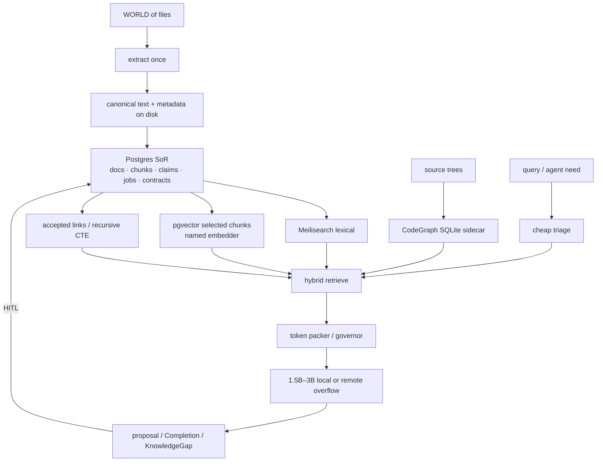

# About Memory, RAG, and Graphs

**Date:** 2026-08-27  
**Status:** recap / design instrument (not a spec, not an implementation plan)  
**Reads:** four prior Cursor chats (all recovered; one UUID was wrong — see §1.1); Revival v2–v4; Projet Complexe notes 14 / 17 / 18; EnvHarness and AutoDesign overlaps; NLP recap; AI agents literature review; CLR / reverse prompting; Four Layers; Cognitive Institutions; Long, *AI-Supervisor*, arXiv:2603.24402v2  
**Books (paraphrase only):** Labaschin & Wallace *Managing Memory for AI Agents*; Norman *Agentic RAG Systems*; Devlin *Building LLM Agents with RAG, Knowledge Graphs, and Reflection*; Magda *Just Use Postgres*; Stewart & Huang *Agentic AI Data Architectures*; Kleppmann & Riccomini *Designing Data-Intensive Applications* (2nd ed.); Gazit & Ghaffari *Mastering NLP*; Grootendorst/Alammar via the agents review; Bhagwat; Berryman; Kar; Lanham  
**Hardware this note is written against:** Debian 13 laptop — Intel i7-8750H (6C/12T), 32 GB RAM (~16 GB available under load), GTX 1050 Mobile 4 GB Pascal (driver 580 / CUDA 13), 32 GB swap, NVMe ~884 GB with hundreds of GB free. Overflow: dedicated remote server (16 GB RAM), not the brain.

This document **paraphrases**. It does not paste books, papers, or chat dumps into the second brain. That is the same failure mode the August notes already named for Wikipedia dumps: a library, not an import.

Each block is asked the same four questions used elsewhere on this shelf:

1. What was actually claimed (chat, paper, or book)?
2. How is it implemented in the wild?
3. Where does it sit on ASC / Projet Complexe ASC / Projet Complexe / Compose / Tauri?
4. Steal, adapt, or refuse?

---

# 0. Verdict in one page

Retrieval quality on this laptop is **not** a bigger local model. The 1050 cannot usefully run 7B-class GPU inference, let alone FreeToken-class MoE offload. Quality has to come from **indexes + packing + allowlisted tools**. A 1.7B–3B local model with an excellent working set beats a stuffed 70B and beats the 15 GB Devstral already sitting in Ollama.

The four chats, read together, say the same thing v3 already decided, and they add two corrections: hardware (tiny local models), and **which graph is which**.

| Source | What it actually adds |
|---|---|
| [Codegraph project comparison](7cad74c7-606b-48c1-b38d-db6a05743d4c) | Code graphs are a **sidecar**, not the knowledge plane. Steal **CodeGraph** (Rust + SQLite + MCP, no LLM to index). Do **not** make Memgraph/Qdrant the second brain. Do **not** make Tencent’s hub the memory OS. |
| [EnvHarness then AutoDesign](fbc9ea42-b3db-4938-9e5e-b70bcb5dcf6b) | Skill lives in the **harness**, not the weights. Wrap the world (EnvHarness). Freeze the model, evolve packing/tools with a gate (AutoDesign). HITL remains the only commit of Claims. |
| [FreeToken installation issue](e93874b2-b3a1-4a03-979c-b138f28f3a44) | This GPU is **not** a local-frontier box. Stay Ollama / llama.cpp. Short context. Overflow is remote and metered, not a Pascal miracle. |
| [AI-Supervisor PDF summary](969f7e68-b53b-42c3-aee0-5dc456d46eee) | Persistent **Research World Model** with uncertainty on edges, not a stateless paper pipeline. Steal persistence + `proposed`/`accepted`. Refuse unsupervised “AI professor,” multi-agent consensus as truth, and a dedicated lab graph product. (Wrong UUID `1ef63e72-…` pointed here.) |

**Ideal stack for Projet Complexe on this computer**, least performance budget for maximum retrieval quality:

```text
Filesystem (canonical) → extract (bounded job)
                       → Postgres SoR
                            ├─ Meilisearch (lexical first)
                            ├─ pgvector (selected chunks, named spaces)
                            ├─ accepted_links (conceptual graph, recursive CTE)
                            └─ CodeGraph SQLite sidecar (code only, MCP to Cursor)

Harness: cheap triage → lexical → optional vector → accepted walk → packed window
         local 1.5B–3B (GPU) or 7B (CPU) → remote overflow
MCP: optional transport. CodeGraph MCP is the only MCP worth installing day one.
```

**Compose vs SQLite in the Tauri app:** Compose for Postgres + Meilisearch (Projet Complexe ASC owns lifecycle). SQLite is allowed for **CodeGraph’s code index** and for **Tauri chrome** (settings, drafts, UI cache). SQLite is **not** the system of record for Claims, corpus, jobs, or the conceptual graph.

**Arango / Memgraph / Qdrant / FreeToken / Tencent hub / LangChain-as-brain / embed-everything / GraphRAG-as-truth:** refuse as identity. Later, maybe, if a named measurement says Postgres traversals hurt.



---

# 1. The four chats

Cite prior chats as `[title](uuid)` without `.jsonl`. Transcripts live under Cursor’s agent-transcripts; this note is the durable recap.

## 1.1 [AI-Supervisor PDF summary](969f7e68-b53b-42c3-aee0-5dc456d46eee)

**ID correction:** the UUID `1ef63e72-5552-45cd-b418-0ebfcfbec772` was not on disk. The matching chat is this one, under the projet-complexe workspace: user asked to summarize `/home/paul/Downloads/2603.24402v2.pdf` (Long, *AI-Supervisor: Autonomous AI Research Supervision via a Persistent Research World Model*, arXiv:2603.24402v2). Revival v3 already listed the paper; this chat is the close reading.

### What the paper actually claims

Current “AI scientist” systems (AI Scientist, AI-Researcher, Agent Laboratory, and kin) are mostly **stateless pipelines**: they generate ideas and text from prompts, do not keep a lasting map of the field, do not empirically probe gaps, and still need a human expert for direction and rigor. The pitch: curiosity-driven *research supervision* without institutional affiliation — not merely paper generation.

The core object is a shared **Research World Model (RWM)**: a knowledge graph of papers, methods, modules, benchmarks, gaps, and limitations, with uncertainty flags (`U=0` verified, `U=1` unverified) and performance metrics on edges. Agents read/write this graph; only corroborated findings get committed.

Three contributions the chat recorded:

1. **Structured gap discovery** — decompose methods into modules, check them on benchmarks, map real failures.
2. **Self-correcting discovery loops** — probe *why* things fail, benchmark bias, whether eval protocols still hold.
3. **Cross-domain development loops** — 5-WHY → abstract mechanism → search other fields, with a 10-criterion quality gate that forces *reassessment* (not just more search) on failure.

Pipeline sketch: 0 supervision (interest → directions) → 1 literature (parallel multi-venue search) → 2a build RWM → 2b gap probing + consensus → 3 method development → 4–7 eval, packaging, writing, review (route back on weaknesses).

Reported highlights (paper’s numbers, not independently re-run here): gap discovery on Scientist-Bench 27 tasks, alignment 4.44/5, precision 0.807, recall 1.0; full method-development loop 8.0/10 vs 5.6 without the cross-domain loop; 16 cross-project graph links as the KG grows 7→13→19; +24% relative precision from consensus vs best single agent; novelty 20.6/25 cross-domain vs 15.6 within-domain. Cost claimed ~$8–16/run with Qwen-72B. Code: [github.com/autoproflab-debug/AI-Supervisor](https://github.com/autoproflab-debug/AI-Supervisor). Limitations they state: non-zero API cost; human still needed for topic/contribution; quality capped by the underlying LLM; binary uncertainty is coarse.

**Bottom line of the chat:** research automation should be **active exploration + a living world model**, not one-shot LLM generation.

### Where it sits on this stack

| Their object | Here |
|---|---|
| Persistent RWM across projects | Postgres Claims / Links / Gaps + files — **not** a second graph product |
| `U=0` / `U=1` on edges | `accepted` vs `proposed` (v3 already stole this) |
| Gaps as first-class | KnowledgeGap already in v2 |
| Consensus before write | **Human** is the consensus device at household scale |
| Multi-agent society + quality gate | Allowlisted pivots + killswitch + HITL; not a chatting lab |
| Cross-project memory (7→13→19 nodes) | Persistence is the point of a second brain. Scale is tiny; SQL is enough |
| Qwen-72B full pipeline | Remote overflow, metered. Not this 1050. Not a default job |
| Unsupervised paper mill (phases 4–7) | **Refuse** as identity (v3 §9.7, v4 plane D) |

This is the missing fourth argument next to CodeGraph and Tencent: **a living graph with uncertainty is the right *memory* shape for research**, and it is still not a reason to install Memgraph, Arango, or an “AI professor.” It is a reason to keep `proposed`/`accepted` on links, to treat KnowledgeGaps as objects rather than failed RAG, and to refuse stateless chat-as-memory *and* unsupervised gap mining that writes the graph.

**Steal.** Persistent world across sessions. Uncertainty on edges. Gaps as objects. A quality gate that *reassesses* instead of searching forever (pair with EnvHarness/AutoDesign: the gate is HITL + killswitch, not a 10-criterion LLM rubric as ontology). Elastic token budget only as the packing governor.

**Adapt.** Their “consensus” → two extractors may *propose*; the human accepts. Cross-domain 5-WHY → a `research` composition, sandboxed, never production self-mod of pivots (v3). Binary U is coarse → `proposed` / `accepted` / `valid_at` / provenance is richer and cheaper.

**Refuse.** Standing up AI-Supervisor as the product. GPU benchmark jobs as default gap discovery. Multi-agent chat until agreement. Auto-commit of LLM triplets. “Spend until it looks like a lab.” Qwen-72B as the local brain. Their KG growth story as a reason to pick a graph database — 19 nodes is a Postgres table.

v3 §9.7 already had this steal/adapt/refuse table. The chat does not reopen it. It *grounds* it: the PDF is the temptation; the household stack is the refusal of the mill and the theft of the flags.

## 1.2 [Codegraph project comparison](7cad74c7-606b-48c1-b38d-db6a05743d4c) — 2026-08-27

Question: differences between [colbymchenry/codegraph](https://github.com/colbymchenry/codegraph) and [vitali87/code-graph-rag](https://github.com/vitali87/code-graph-rag), then [TencentCloud/TencentDB-Agent-Memory](https://github.com/TencentCloud/TencentDB-Agent-Memory).

### What they actually are

| | **CodeGraph** | **Code-Graph-RAG** | **TencentDB Agent Memory** |
|---|---|---|---|
| Job | Pre-indexed **code** graph for coding agents | Full RAG + agent over a **code** graph: ask, edit, optimize in English | Team **memory hub**: chat, skills, wiki, *and* a code graph |
| Core | Rust parse kernel + Node CLI/MCP | Python + Tree-sitter | Node ≥ 22, Memory Core + Hub UI + Proxy |
| Store | Local SQLite (`.codegraph/`) | **Memgraph** + optional **Qdrant** | Hub DB + whatever the wiki/code pieces need |
| LLM to index? | **No** | Yes, for NL→Cypher and agent loops | Yes (keys required) |
| How agents attach | **MCP** | CLI + MCP | **Proxy** (point the agent’s base URL at it), not primarily MCP |
| Docker extra graph DB? | No | Yes | Hub, not a drop-in indexer |
| Fit on this laptop | **Yes** — sidecar | Painful — second graph engine + vectors | No — vendor hub as identity |

One-line difference the chat settled: CodeGraph is a **drop-in agent accelerator**. Code-Graph-RAG is a **standalone analysis / refactor platform**. Tencent is a **different category**: a shared “save file” for agent teams, where code graphs are only one of four asset types.

Tencent’s four assets (paraphrase of their README, not a product to install):

| Asset | Role in *their* product | Already exists here as |
|---|---|---|
| Chat memory | Preferences, facts, decisions; L0→L3 distillation | Session scratch ≠ Claims |
| Skill | Versioned reusable workflows | YAML `able`, hooks, pivots |
| Wiki | Structured docs + link graph (Karpathy-style) | Notes / files, not a memory OS |
| CodeGraph | Symbols, calls, impact paths | Programming-assistance worker; **not** the personal graph |

### Steal / adapt / refuse (code graphs)

**Steal from CodeGraph.** Local SQLite index, no LLM to parse, MCP so Cursor already knows how to ask “what calls this.” Watcher / auto-sync is optional. This is the least RAM for the most *code* retrieval quality on a 32 GB laptop that already runs Cursor. It matches v4’s rule: Tree-sitter work is **delegated**, not reimplemented. v4 named code-graph-rag as the example; **this chat revises the Implementation for this hardware toward CodeGraph.** Keep the pivot name (`code-index` / programming-assistance). Swap the engine without swapping the vocabulary.

**Adapt from Code-Graph-RAG.** Tree-sitter as the parse idea; NL→Cypher as a *later* research toy; dead-code / impact as reports, not as Claims. If a future measurement says you need runtime `CALLS` tracing, that is a named Environment, not day-one Compose.

**Refuse as identity.**

- Memgraph + Qdrant as the knowledge plane (v3 already chose Postgres).
- “The code graph *is* the second brain.” Code entities are not Notes, Claims, or KnowledgeGaps.
- Tencent hub: vendor ACLs, LLM keys, proxy-as-OS, collapsing chat/wiki/skills/code into one “memory product.” Steal the *cut* (those four are different types). Do not steal the product.
- Unbounded MCP tool catalogs. CodeGraph MCP is one allowlisted server for **code**, when Cursor is the host. When ASC is the host, a CLI behind an entry point is enough.

Revival v4 already said: code-graph-rag’s MCP is the correct use of MCP (neighbor host). This chat adds: **on a GTX 1050 + 32 GB box, do not also pay for Memgraph.**

## 1.3 [EnvHarness then AutoDesign](fbc9ea42-b3db-4938-9e5e-b70bcb5dcf6b) — 2026-08-24

Already written in durable form:

- [Overlap with EnvHarness](Overlap%20with%20EnvHarness.md) — [arXiv:2608.19880](https://arxiv.org/abs/2608.19880)
- [Overlap with AutoDesign](Overlap%20with%20AutoDesign%20-%20Meta%20Harness%20Optimization%20for%20Long-Horizon%20Agentic%20Design.md) — [arXiv:2608.13560](https://arxiv.org/abs/2608.13560)

Same week, two sides of “harness, not weights.”

**EnvHarness** wraps a *frozen environment* at `reset()` / `step()`. Three plug-ins: Stage (start harder or easier), Contract (filter actions, rewrite observations), Chain (compose tasks). Steal wrap + difficulty band. Refuse gym/Python-as-source-of-truth.

**AutoDesign** freezes *weights*, evolves harness H (context, tools, runtime, orchestration, evaluation). Two loops: inner generate–critique–revise; outer one-component gated update. Steal two-loop picture and gated update. Refuse self-rewriting ASC, poster mill, VLM-as-Claim.

**What this means for memory and RAG:** packing *is* the Contract. Retrieval *is* observation rewrite. The token governor *is* the difficulty band (CLR). Evolving “memory” by letting an agent rewrite hooks every night is AutoDesign’s outer loop **without** their train/dev gate and without HITL — refuse. Nightly consolidation that *proposes* packs, skills, or Claims, with a human accept, is the adapted outer loop.

## 1.4 [FreeToken evaluation](e93874b2-b3a1-4a03-979c-b138f28f3a44) — 2026-08-27

FreeToken is a large-MoE local-offload path aimed at RTX 30+ with lots of RAM. This machine: driver and CUDA look fine; **Pascal 4 GB is not**.

Stay **Ollama / llama.cpp**. Tiny MoE (OLMoE) is a demo, not quality. Best local: **1.5B–3B dense Q4/Q5**, `num_ctx` 2k–4k. Suggested pulls from that chat: `qwen3:1.7b` (default), `phi4-mini` (math, tight), `llama3.2:3b`, `qwen2.5-coder:1.5b` / `:3b`. Skip the already-installed ~4.7 GB `qwen2.5-coder:latest` and ~15 GB `devstral-small-2` **on the GPU**. Overflow = remote metered, not FreeToken.

**What this means for RAG:** you cannot “fix retrieval” by stuffing more tokens into a local 70B. You fix it by **not stuffing**. CLR already said a 7B with excellent retrieve beats a stuffed 70B; here even 7B-on-GPU is painful. Default: **excellent retrieve + tiny GPU model**, optional 7B on CPU for overnight jobs, remote for gravity.

Current Ollama list on this machine at time of writing: those two oversized blobs. They are a RAM tax even when idle if loaded. Treat them as *optional CPU experiments*, not as the default backend.

---

# 2. Binding architecture (do not reopen)

From Revival v3 (engine list) and v4 (hooks, tools, MCP). This note does not reopen the three-project cut.

| Layer | Authority |
|---|---|
| **ASC** | What exists, what can be done, where, how it executes |
| **Projet Complexe ASC** | Which possibilities this environment exposes; Compose lifecycle; packs; killswitch |
| **Projet Complexe** | What it *means*: Tasks, Claims, Links, gaps, HITL |
| **Tauri** | Thin visual control plane. CLI = GUI. Webview does not own sockets to engines |

**Knowledge ≠ RAG.** Claims, evidence, gaps, HITL. Indexes are projections. Extract once, fan-out. Canonical text on disk.

**Graph is conceptual.** Default store: Postgres JSONB + accepted-link tables + recursive CTEs. A dedicated graph engine stays an open, later choice if traversals hurt.

**Retrieval order (do not invert):**

1. Filesystem + filenames + git / ripgrep (still wins on *this repo* and on code).
2. Meilisearch lexical (quotes, names, typo-tolerant titles, filters).
3. Optional pgvector on *selected* chunks, **named embedding space**, never mixed across embedders.
4. Accepted-neighbour walk in Postgres (not a dump of proposed triplets).
5. Packed RAG inside `research` / `run-agent` — pointers plus short inert spans.
6. Offline encyclopedia (Kiwix) when the home link is down — never as graph nodes.
7. Graph-RAG community reports only on a chosen personal corpus, as generated Notes, not as the UI home.

**MCP** is optional transport. Tools = allowlisted ASC entry points. YAML `able` → JSON Schema projection. Local-first; cloud metered overflow. Killswitch Task ↔ research.

Note 17 still describes Solr / Tika / Arango as *examples*. v3 rewrote the engine list. Note 18 still holds: Graph RAG over *your* notes; Wikipedia as a library; IEML as a compass.

---

# 3. This laptop’s performance budget

Numbers from the machine on 2026-08-27, not from a brochure.

| Resource | Reality | Consequence |
|---|---|---|
| RAM | 32 GB; ~16 GB “available” with normal desktop + Cursor | Postgres + Meilisearch + Ollama 2B + CodeGraph SQLite **fits**. Postgres + Meilisearch + Memgraph + Qdrant + 7B GPU **does not**. |
| GPU | GTX 1050 4 GB Pascal | Embeddings: **CPU**. Generation: 1.5B–3B Q4/Q5 or CPU 7B. No FreeToken. No Devstral on GPU. |
| CPU | i7-8750H, 12 threads | Fine for Meilisearch, pgvector HNSW on a selected corpus, overnight embed batches, CodeGraph parse. |
| Disk | NVMe root + HDD Nextcloud for books | Canonical corpus on NVMe. Book library stays on the HDD; do not import it into the graph. |
| Docker already | local stacks exist (Solr 8, MariaDB, Redis, …) | Do **not** run those Compose stacks at the same time as the Projet Complexe stack if you care about the 16 GB headroom. |
| Dedi | 16 GB, HDDs, 200 Mbps | Batch OCR/ASR, heavy embed rebuilds, Kiwix dumps. Not interactive packing. |

**Energy / Meadows:** every always-on engine is a delay you cannot see. Prefer jobs that start, write, and exit (Kofler; Magda’s “land structured results then stop”). Meilisearch and Postgres are the two daemons worth paying for. Ollama is a daemon only when you are actually generating.

**Simultaneous-load rule of thumb** (not a benchmark, a ceiling):

```text
Always-on:   Postgres ~0.5–1 GB   Meilisearch ~0.3–0.5 GB
On demand:   Ollama 1.7B–3B ~2–3 GB VRAM / or 7B CPU ~5–8 GB RAM
Sidecar:     CodeGraph SQLite — process RAM, not a second DB server
Never-on-laptop-together: Memgraph + Qdrant + Arango + Solr + large Ollama
```

Cap Compose: `mem_limit` on Postgres and Meilisearch. `shared_buffers` 256 MB class, not a 16 GB dedi-sized Postgres on the laptop.

---

# 4. What “memory” is (and is not)

## 4.1 The industry collapse

Labaschin & Wallace are the honest field report: agents retrieve **nondeterministically**; hosted “memory” is lock-in; Redis/Mem0/LangGraph are worked examples, not a survey. Grootendorst follows CoALA: working / episodic / semantic / procedural / parametric.

The 2025–2026 product move is to sell **one** of these as the product:

| Product shape | What it actually stores | Why it fails as Projet Complexe |
|---|---|---|
| Vector DB as memory | Nearest chunks | Paraphrase ≠ Claim; no unknowns; embedder lock-in |
| Chat “memory” (vendor) | Summaries + preferences | Amnesia with a smile; negations die in summaries (Labaschin’s legal warning) |
| Memory MCP | Whatever the server embeds | Transport pretending to be a store (v4) |
| Tencent-style hub | Chat + skills + wiki + code graph | Four types smashed into one ACL surface |
| GraphRAG community reports | LLM summaries of clusters | Generated Notes at best; not the UI home; not truth |
| Fine-tune the notes into a 7B | Weights | Notes change; weights do not like to; cannot export across providers |

**Steal the labels. Refuse the stores.**

## 4.2 Mapping onto this stack

| CoALA / Labaschin label | Here | Store | Promotion |
|---|---|---|---|
| Working | Packed window for one pivot invocation | RAM / prompt | Discarded after the call, except traces |
| Episodic | `run-agent` / `research` events, tool traces | Postgres | Distillation **proposes**; HITL accepts |
| Semantic | Claims, accepted links, canonical passages | Postgres + Meilisearch + selected pgvector | Accept/reject, `valid_at`, provenance |
| Procedural | Hooks, pivot implementations, YAML `able` | Git + filesystem | Human commit, AutoDesign-style gated update |
| Parametric | Model weights | Ollama / remote | Frozen by default (AutoDesign) |
| Sensory | OCR / ASR / images | Canonical files; opt-in jobs | Cost cliff; not a default memory type |

Tencent’s L0–L3 distillation is **interesting as a process**, toxic as a product. L0 = raw transcript. L1 = extractives. L2 = structured facts. L3 = durable Claims. Only L3 may enter the knowledge plane, and only through HITL. Nightly consolidation (Meadows delays), not every-turn embed.

Karpathy-style LLM wiki: compilation-at-ingest versus RAG. **Adapt** as: extract once to canonical text; optional compiled notes; never replace the files with a wiki service.

## 4.3 Packing is not memory

Berryman / Grootendorst / CLR: the window is a scarce working set. FIFO and stacked summaries destroy early constraints. Semantic cache helps repeated **single-shot** corpus questions and breaks in multiturn (Labaschin).

The packer (Revival v3) is the memory *controller*, not the memory. It selects, compresses, orders (lost-in-the-middle), and leaves inert citations as pointers.

Gazit/Ghaffari (NLP recap): **cheap triage before packing**. Classify → pack → choose Technology → authorize. Do not start `run-agent` by embedding the query.

---

# 5. RAG, Graph RAG, code-graph RAG

## 5.1 Classic RAG (still necessary, still insufficient)

Norman (*Agentic RAG Systems*) and Devlin: RAG is grounding, not intelligence. Production RAG is hybrid, evaluated, chunked on purpose, with a refusal path when retrieval is weak.

Magda chapter 8 is the *minimum* loop: embed selected rows, cosine search, prompt an LLM. A second brain needs contracts, provenance, accept/reject, killswitch, and a lexical engine that does not depend on an embedder being warm.

**Chunking (state of the art, stolen as policy, not as a library):**

- Hierarchical: document → section → passage. Retrieve small, expand parent if needed (Gazit; Norman).
- Do not embed 80-page OCR as one vector.
- Language-aware: fr / en / pt analyzers in Meilisearch; **named** embedding spaces if the embedder is multilingual vs English-only. English-only embeddings as the store is a closed door (v4).
- Selected corpora only. Photos, video ASR, bibliographic HTML: opt-in cliffs (note 17, still true).

**Hybrid retrieve (least budget, most quality):**

1. Lexical shortlist (Meilisearch) — cheap, names and quotes.
2. Optional vector re-rank or fusion on that shortlist — not a full-corpus ANN scan every query.
3. Accepted-neighbour walk, hop-limited (2–3), **accepted** edges only.
4. Tiny reranker on top-k **only if** a CPU model earns its keep in evals. Skip cross-encoders on the 1050.
5. Pack to token budget. If confidence is low: KnowledgeGap, not a fluent lie.

Agentic RAG (Norman): the model may *issue* another retrieve. Steal as an allowlisted `search-knowledge` loop with a step cap. Refuse unbounded “search until bored.”

## 5.2 Graph RAG (Microsoft-style and after)

Note 18 already defined it: turn *your* corpus into an explicit graph, retrieve a **bounded subgraph** or a **community summary**, not only similar paragraphs. It is still retrieval. It is not ASC. It is not the knowledge model.

State of the art in 2025–2026 (paraphrase, not a shopping list):

- Entity/relation extract → graph → local neighbourhood (cheap) vs Leiden/Louvain communities + LLM summaries (expensive, stale).
- LightRAG / lazy graphs: extract less, query more — tempting, still not Claims.
- Uncertainty on edges (Long’s RWM, [chat recap](969f7e68-b53b-42c3-aee0-5dc456d46eee), adapted in v3): `proposed` vs `accepted`. Binary `U=0`/`U=1` is coarser than `valid_at` + provenance; steal the *flag*, not the bit.

**On this laptop:** community-summary GraphRAG is a **batch job** on a chosen corpus, writing Notes. It is not an always-on indexer. Neighbourhood walk in Postgres is the interactive Graph RAG. Long’s RWM is the same walk plus HITL commit — not a 72B lab and not Leiden communities.

**Never Graph-RAG Wikipedia.** QID as a pointer, Kiwix as a book.

**Three graphs, three jobs** (this is the correction the four chats make together):

| Graph | Job | Engine on this box |
|---|---|---|
| Personal / research world | Claims, typed links, gaps, uncertainty | Postgres accepted_links |
| Code | Symbols, calls, impact | CodeGraph SQLite |
| Microsoft-style GraphRAG communities | Optional batch Notes on *your* corpus | Job, not a daemon |

Tencent’s wiki+chat+skills+codegraph hub is the collapse of all three plus procedures. Long’s mill is the collapse of the first into unsupervised agents. Both are refusals. The useful remainder is: **persist the research world, flag uncertainty, do not auto-commit.**

## 5.3 Code-graph RAG is a different graph

Mixing “Graph RAG” with “code graph” is how you get Memgraph as the second brain.

| | Personal knowledge graph | Code graph |
|---|---|---|
| Nodes | Claims, notes, people, works, gaps | Files, symbols, calls, imports |
| Edges | Typed, HITL-accepted | Parser-true (or traced) |
| Truth | Contested, dated, multilingual | The compiler is the critic |
| Engine | Postgres accepted_links | CodeGraph SQLite (this hardware) |
| Query | Meilisearch + walk + pack | MCP `codegraph_explore` / CLI |
| LLM at index time | Optional, never required | **No** (CodeGraph) |

Ripgrep remains cheaper than any graph for “where is this string.” The code graph earns its keep for **impact** (“what calls this”) and **structure** (“who implements this trait”), which grep lies about.

---

# 6. Local indexes (what to run, what to skip)

| Index | Role | Day one on this laptop? | Why |
|---|---|---|---|
| Filesystem + git | Canonical; addressability | **Yes** | SoR for bytes |
| ripgrep / glob | Code and this repo | **Yes** | Cheapest high precision |
| Meilisearch | Lexical projection, UI + packer | **Yes** | Typo-tolerant top-k; v3 default |
| Postgres `tsvector` | Fallback FTS | **Yes, as fallback** | Progressive enhancement if Meilisearch is down |
| pgvector | Selected semantic projection | **Yes, selected** | Named spaces; HNSW; CPU embed |
| CodeGraph SQLite | Code symbols/calls | **Yes, sidecar** | No extra server |
| Solr | Old note-17 lexical | **No** | JVM; other local project instances already have it in their stack; Meilisearch replaced it |
| Qdrant / Chroma / FAISS-as-identity | Vector boutique | **No** | pgvector is enough at this scale |
| Memgraph / Neo4j | Code or property graph server | **No** | RAM + ops; CodeGraph covers code |
| Arango | Multi-model graph | **Later, if measured** | v3: open door, not default |
| DuckDB | Analytics over extracts | **Maybe later** | Not SoR; good for one-shot reports |
| Redis | Cache / queues | **No as memory** | Labaschin’s default; lock-in of TTL-as-forgetting |
| Kiwix / DBpedia files | Offline encyclopedia | **Optional, on HDD/dedi** | Library, not import |
| Embed-everything | — | **No** | Fatal for small windows and for the 1050 |

**Embedder on this machine:** small multilingual on **CPU** (e5-small / nomic class — named Environment, not this note). Batch overnight. Do not GPU-embed on 4 GB Pascal. Do not mix spaces.

**Meilisearch vs Postgres FTS:** Magda is honest that `tsvector` tokenises, stems, ranks. It is not typo-tolerant UI search. Keep both roles distinct.

---

# 7. Databases: why Postgres, why not the zoo

## 7.1 Postgres as system of record (Magda, adapted)

Magda’s slogan is a pressure-release against a specialised store per feature, not a religion that deletes Meilisearch or the filesystem.

Steal:

- One identity for documents, chunks, claims, tasks, jobs, contracts (JSONB where schemaless, tables where queried).
- pgvector in-process with the SoR: no split-brain “the vector DB has a chunk the DB doesn’t.”
- Recursive CTEs for accepted walks at personal-graph scale.
- Roles: the model worker is not the superuser.
- Docker Postgres as the *dev shape* that later matches dedi.

Stewart & Huang (*Agentic AI Data Architectures*): distributed SQL as the unification story for enterprise agents. **Adapt:** the unification idea (do not add a DB per agent capability). **Refuse:** Cockroach / cloud Spanner as the laptop default. This is a local-first second brain, not an enterprise fabric.

Kleppmann (DDIA 2e): indexes are **derived data**. If Meilisearch dies, you rebuild from Postgres + files. If SQLite-in-Tauri is treated as SoR, you have a second brain that cannot be queried from the CLI, cannot be jobbed on dedi, and cannot be snapshotted cleanly. Local-first is **files + Postgres**, not “the GUI owns a sqlite file the agents cannot see.”

## 7.2 Arango, later

v2/note 17 put Arango in the default picture because one engine can do docs + graph + search. v3 moved graph to Postgres because:

- Personal accepted-link graphs are small.
- Traversal pain is a measurement, not a fear.
- Arango is another daemon, another backup, another query language for the UI to accidentally own.

Revisit Arango (or another graph engine) **only if** hop-2/hop-3 accepted walks on real data are slow or awkward in SQL. That is an Implementation swap behind `relate`. The conceptual graph does not move.

## 7.3 SQLite: two legitimate uses, one trap

| Use | Verdict |
|---|---|
| CodeGraph `.codegraph/` | **Yes.** Process-local code index; rebuildable from source. |
| Tauri settings, address-bar drafts, UI cache | **Yes.** Chrome, not knowledge. |
| App database for Claims / corpus / jobs | **No.** Breaks CLI=GUI, dedi overflow, Compose projections, Magda’s “land in Postgres.” |
| LiteFS / Turso as cloud SQLite | **No** as identity. Local-first is not “SQLite in the region.” |
| Embedded Postgres (PGlite, etc.) | **Later Fallback** if Compose is too heavy on a *smaller* machine. Not the first shape: PCA is already Compose-shaped so laptop and dedi rhyme. |

Tauri can *talk* to Postgres on `127.0.0.1` through the Rust side or through ASC. The webview still must not open DB sockets (note 17). That constraint is unchanged.

## 7.4 Compose vs “built into the Tauri binary”

| | Docker Compose (PCA) | Everything in the Tauri app |
|---|---|---|
| CLI = GUI | Natural | Lie — agents need the same engines |
| Dedi overflow | Same compose file, different host | Rewrite |
| Crash isolation | DB lives if the GUI dies | One process, one fate |
| RAM | Capped services | Temptation to “just sqlite” then regret |
| GPU | Ollama **on the host**, not in Docker (Pascal passthrough is not worth it) | Same if you are careful |
| Day-one complexity | Real (you already run Compose for local ASC project instances) | False simplicity |

**Opinion:** Projet Complexe ASC Compose = `postgres` + `meilisearch` (+ optional embed worker **profile**). Ollama stays native. CodeGraph stays native. Tauri stays a host process. OCR/ASR/Docling are **jobs**, not always-on JVM Tika.

Do not put Solr, Arango, Memgraph, Qdrant, Redis-as-memory, or a second MySQL in that compose file.

---

# 8. Harness, MCP, local vs remote tools

v4 already answered the original “drop MCP, use DSL” question: **local tools are ASC entry points; MCP is a plug for neighbor hosts.**

This chat cluster adds hardware teeth:

| Tool class | How it should appear | Protocol |
|---|---|---|
| extract, index, relate, research, run-agent | ASC pivots, YAML `able` | CLI / hooks; JSON Schema generated |
| search-knowledge | Pivot over Meilisearch + pgvector + walk | Same |
| code-index explore | CodeGraph CLI when ASC is host | **MCP when Cursor is host** |
| Computer-use / unbounded browser | — | Refuse as default |
| Memory MCP | — | Refuse as store |
| Remote MCP (GitHub, cloud DBs) | Optional, allowlisted, metered | Adapter, not vocabulary |

EnvHarness Contract = `pre_llm` / `post_llm` + allowlist + packed observations.  
AutoDesign outer loop = gated updates to packs/hooks, HITL, one component at a time.

**Remote overflow:** Moslem & Kelleher routing (v3) + Gazit triage. Local default. Remote when stakes, language, or retrieval confidence demand it. Not when the 1050 is sad — the 1050 is *always* sad; design for that.

---

# 9. Ideal implementation (opinionated)

This is inspiration for Projet Complexe, not a spec. Names below are ordinary pivots, not `$` placeholders.

## 9.1 Data plane

1. **Bytes stay on disk.** PDFs, notes, code, media. Nextcloud books stay a library.
2. **extract** writes canonical text + a contract-shaped record (Sanderson: producer/consumer; quarantine bad parses). Docling / pdftotext / OCR / ASR as Implementations. No Tika identity. GROBID only for bibliographic when DOI lookup fails (v3).
3. **Postgres** is SoR for metadata, chunks, claims, tasks, jobs, accepted_links, embedder name + model card on each vector row.
4. **Meilisearch** is fed from Postgres (or from the same extract event). Per-locale indexes or language filters. Rebuildable.
5. **pgvector** only for chunks that survived a selection policy (not every OCR line).
6. **CodeGraph** on programming working copies only. `.codegraph/` gitignored. MCP attached to Cursor, not to the knowledge UI.

## 9.2 Query plane (packer)

```text
triage (cheap: heuristics / tiny classifier)
  → if code-shaped: ripgrep then CodeGraph
  → if knowledge-shaped: Meilisearch top-k
       → optional vector on that candidate set
       → hop-limited accepted walk
  → pack to num_ctx (2k–4k local default)
  → generate
  → post_llm: citations inert, proposals not Claims
```

Eval: Winteringham — retrieval that only works in English has failed. Measure recall@k **on this corpus**, hybrid vs lexical-only. Do not trust RAGAS as ontology.

## 9.3 Memory plane

- Session scratch in the harness (working).
- Traces in Postgres (episodic).
- Distillation job: L0→L3 **proposals**, human accept (semantic).
- Research world: links persist across sessions with `proposed`/`accepted` (Long, adapted). Gaps stay objects when retrieve is weak.
- Procedures in git (procedural).
- No every-turn embed. No Redis TTL as forgetting of personal knowledge. Forgetting is a HITL policy, not a cache eviction.
- No unsupervised consensus loop that writes the graph. Persistence ≠ a paper mill.

## 9.4 Process plane

- Compose up/down via ASC, not via the Solid view.
- Indexing is a job with a progress event the UI may watch (note 17 IPC).
- Heavy jobs: nice/ionice locally, or ssh to dedi.
- Killswitch: Task ↔ research (v2–v4).

## 9.5 What “done enough” looks like for a first Tauri slice

Not GraphRAG. Not a memory hub. Not 70B.

A search box that hits Meilisearch, a claim pane that hits Postgres, a graph pane that draws **accepted** links from SQL, a packing preview that shows token budget, and Cursor still able to ask CodeGraph about a repo. That is already more retrieval quality than a zoo of engines.

---

# 10. Steal / adapt / refuse (master table)

| Item | Move | Why |
|---|---|---|
| CodeGraph SQLite + MCP | **Steal** | Least budget, best code retrieve; no LLM to index |
| Code-Graph-RAG Tree-sitter / impact reports | **Adapt** | Ideas; not Memgraph-as-SoR |
| Tencent L0–L3 types | **Adapt** | Process; HITL before Claims |
| Tencent hub / proxy OS | **Refuse** | Vendor memory product |
| EnvHarness wrap + band | **Steal** | Packing as Contract; CLR |
| EnvHarness gym / Python rules as SoT | **Refuse** | YAML + DSL are SoT |
| AutoDesign two-loop + gated one-component | **Steal** | Evolve harness, freeze weights |
| AutoDesign self-patching production ASC | **Refuse** | Killswitch is not an optimizer |
| FreeToken / Pascal MoE | **Refuse** | Hardware mismatch |
| Ollama 1.5B–3B short ctx | **Steal** | Matches 1050 |
| Magda Postgres + pgvector | **Steal** | SoR; selected ANN |
| Magda “delete Meilisearch” | **Refuse** | Typo-tolerant UI + packer |
| Norman hybrid / eval / refuse-when-weak | **Steal** | Production RAG without the framework |
| Devlin RAG + graph + reflection | **Adapt** | Connecting outside the window; reflection = inspect + HITL |
| Stewart distributed SQL | **Adapt** | One SoR idea; not cloud Spanner |
| Kleppmann derived indexes | **Steal** | Rebuild Meilisearch; files remain |
| Labaschin memory types + lock-in warning | **Steal** | Labels and honesty |
| Labaschin Redis/Mem0 as architecture | **Refuse** | Stores |
| GraphRAG neighbourhood on accepted links | **Steal** | Interactive, cheap |
| GraphRAG community reports as home | **Refuse** | Generated Notes at most |
| Long RWM persistence + uncertainty flags | **Steal** | Living world, not stateless chat |
| Long `U=0`/`U=1` as the only epistemology | **Adapt** | `proposed`/`accepted` + `valid_at` + provenance |
| Long consensus / 72B lab / paper mill | **Refuse** | HITL is consensus; 1050 is not Qwen-72B |
| AI-Supervisor as a Compose service | **Refuse** | v3 already; this chat confirms the temptation |
| Wikipedia in the graph | **Refuse** | Library / QID pointers |
| MCP as vocabulary | **Refuse** | v4 |
| MCP as CodeGraph plug for Cursor | **Steal** | Neighbor host |
| SQLite as app SoR | **Refuse** | Breaks CLI=GUI |
| Arango day one | **Refuse** | Measure first |
| Embed everything | **Refuse** | Small windows + 1050 |
| LangChain / FAISS identity | **Refuse** | NLP recap |
| Solr + Tika identity | **Refuse** | v3 engine rewrite |

---

# 11. Open tasks (not this note)

1. Name the embedder Environment (model card, multilingual, CPU batch).
2. Compose file with memory caps; document “do not run other local project stacks with Solr at the same time.”
3. CodeGraph as an Implementation behind a programming-assistance entry point; MCP optional.
4. Distillation job sketch (L0–L3) with HITL, no auto-Claim.
5. Eval set: fr/en/pt questions against a slice of the personal corpus — lexical vs hybrid.
6. Decide whether overnight 7B-CPU is worth the RAM vs remote overflow (quota, not GPU).
7. Unload or stop shipping `devstral-small-2` / 4.7 GB coder as default Ollama models on this GPU.

None of these reopen Postgres-vs-Arango as a religious war. They implement v3 on *this* box, with CodeGraph instead of Memgraph, Long’s uncertainty flags instead of an AI-Supervisor lab, and a model small enough to leave RAM for the indexes that actually make it smart.
