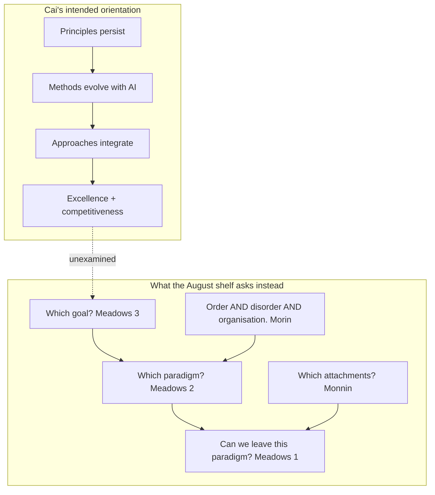
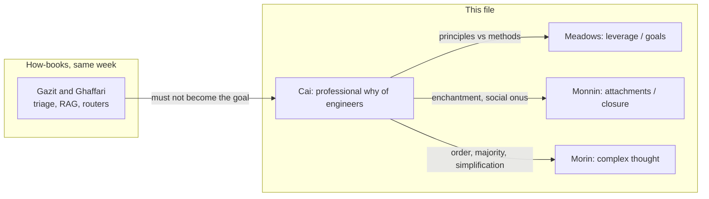
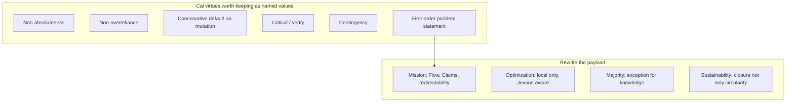
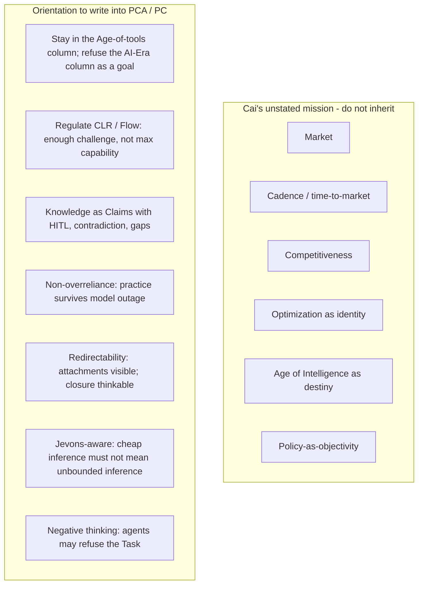

# Beyond how — general guiding vision, alignment, direction, and values

## Kevin Cai, *The AI-Enabled Engineer* read with Meadows, Monnin, and Morin

**Date:** 2026-08-26  
**Status:** literature recap / orientation instrument (not a spec, not an implementation plan)  
**Source:** Kevin Cai, *The AI-Enabled Engineer: A Comprehensive Framework for Engineering Excellence in the Age of Intelligence*.  
**Reads against:** ASC README; Revival v2–v4; Reverse Prompting / Cognitive Load Ratio; Meadows leverage-points note; Agents of Redirection (Meadows, Monnin, Lévy); *What is Ecological Redirection?*; Four Layers; Cognitive Institutions; Edgar Morin *La Méthode* (v1 + long recap); *Standing on the Shoulders of Giant Zombies* (2021); NLP recap of Gazit & Ghaffari (same week).  
**End goal:** steal what this book contributes to the **why** of agentic work that might come out of Projet Complexe — vision, alignment, direction, values — without importing Cisco-era “engineering excellence,” competitiveness, or an unexamined Age of Intelligence as destiny.

This document **paraphrases**. It is not a substitute for the book. Long quotation would be both a copyright problem and the failure already named for Wikipedia dumps: a library, not an import. Terms of art are kept (`Age of Intelligence`, `AI Era`, `intelligence + crafting`, `first-order thinking`, `Jevons paradox`). Arguments are restated in the vocabulary already in use: Task, Claim, pivot, hook, killswitch, Cognitive Load Ratio, redirection, attachments, tetralogue, leverage points.

Each chapter is asked four questions, then a fifth that the NLP recap did not need:

1. What does Cai actually claim?
2. How does he implement the claim (case studies, taxonomies, consumer-product examples)?
3. Where does it sit on the August 2026 stack (ASC / Projet Complexe ASC / Projet Complexe)?
4. Steal, adapt, or refuse — for *orientation*, not for a Python stack.
5. **What would Meadows, Monnin, and Morin do with this claim?**

The fifth question is the point of this file. Gazit & Ghaffari (same week) is a *how* book: routers, RAG, classifiers. Cai is a *why* book that does not know it is incomplete. The incompleteness is useful. It is the professional common sense that a second brain will meet in every engineer-shaped agent, unless the agent is given a different goal.

---

# 0. Verdict in one page

Cai’s most useful sentence is not about AI. It is Harrington Emerson, quoted in the appendix and already live in chapter 1:

> Methods may be a million. Principles are few. Grasp principles and you can choose methods. Grasp only methods and you will have trouble.

He organises the whole book on that cut:

| Cai’s word | He calls it | Persistence | Meadows analogue | Danger if taken as the whole |
|---|---|---|---|---|
| **Principles** | the *why* — first principles plus derived professional virtues | “remain constant” | mostly levels 12–5, with *mission* named at 3 | the *why* he lists is still efficiency, delivery, competitiveness |
| **Methods** | the *how* — math, experiment, approximation, observation, system, hybrid, data, CoT | evolve with tools | level 10 stocks/flows of procedure | CoT as a “method” confuses a model trick with a scientific method |
| **Approaches** | strategy that composes methods — prototype, stage, specify, modularise, validate… | mid-lived | level 10–8 architecture | time-to-market and cost-effectiveness sneak in as if they were physics |
| **Applications** | hardware, software, then “non-engineering” (surveys, policy) | contingent | execution | exporting engineering “objectivity” into democracy |
| **Age of Intelligence** | now: narrow AI *embedded as a tool* that augments humans | a named present | a paradigm (level 2) | enchantment: the age as weather, not a choice |
| **AI Era** | anticipated future: AGI as independent agent of economy and governance | a named temptation | a worse paradigm | the trajectory Monnin would ask us to *close*, not merely postpone |

The book is a **continuationist** engineering gospel: principles endure, AI is a partner, hardware and software have fused, engineers must stay the architects of innovation, society needs their objectivity, sustainability is circular design plus AI-optimised cities. That is *ecological transition* in the booklet’s sense (better means), not *ecological redirection* (other ends, plus closure).

It is still worth reading here, because Cai accidentally supplies:

1. A **vocabulary of professional virtues** that agents will otherwise absorb from Cursor rules and vendor blogs without anyone naming them (non-overreliance, non-absoluteness, conservative thinking, thoroughness, contingency, evidence).
2. A **crack in his own wall**: the appendix on **Jevons** and **Marcuse**, which, if allowed to rewrite chapter 3.12 (optimization) and chapter 6 (policy as objectivity), would turn this into a different book.
3. A **distinction he wants to hold** — Age of Intelligence (tool) versus AI Era (autonomous governance) — that Projet Complexe should treat as a *killswitch on a civilisational trajectory*, not as a product roadmap.

**One-line steal**

Keep Cai’s cut (*why* ≠ *how*), keep **non-overreliance** as a named virtue of every `run-agent`, keep **first-order thinking** as “do not spend a frontier model on the wrong problem,” and keep **Jevons** as a mandatory balancing loop on “smarter agents.” Change the *mission*. Engineering excellence in the Age of Intelligence is not Projet Complexe’s goal. **Keeping cognition inside a Flow band, knowledge as committed Claims, and technical systems redirectable** is.

---

# 1. How this book sits on the interpretive shelf

Four Layers already stacked authors:

| Layer | Author | Question |
|---|---|---|
| Ontology | Monnin | What kind of entity is this? What persists? |
| Semantics | Lévy | How can meaning be computable? |
| Dynamics | Meadows | How does the system evolve? Where to intervene? |
| Execution | agent frameworks | How does computation act? |

Cai lives almost entirely on **execution**, while *talking* as if he owned dynamics and values. That mismatch is the recap.

Morin’s long recap already said: Meadows maps *where* to intervene; Morin maps *how to think* when the observer is inside the loop. Cai maps *how a Cisco-shaped engineer stays excellent* when the loop includes GPUs. Useful, smaller.

The 2021 *Giant Zombies* mémoire already refused éco-conception as a sufficient answer: measuring and greening digital services while the giants (hyperscale, extractive stacks) stay enchanted. Cai’s chapter 7.3.3 (sustainability engineering: digital twins, smart cities, modular phones) is that insufficient answer, written from inside Unified Computing. The appendix on Jevons is the mémoire’s rebound effect, named but not allowed to govern.

Projet Complexe does not need another Cisco framework. It needs to **not inherit Cisco’s goal by default** when it wraps Ollama and Cursor.

---

# 2. Chapter-by-chapter

Depth follows orientation, not page count. Hardware pathways and optoelectronics are thin on purpose.

## Foreword and preface — the profession narrates itself

**Claim.** Engineering *is* civilisation’s instrument. We are leaving the Information Era for an Age of Intelligence in which AI is a design partner, not a calculator. The book will not be a manual of formulas. It will be a framework: flexibility over prescription, systems thinking over silos, continuous learning over static knowledge. Three commitments: (1) old virtues still hold (logic, conservative thinking, creativity, simplification); (2) intelligence is now *inside* systems, so we design *with and for* it; (3) engineers now owe ethics, privacy, sustainability, and social impact, because intelligent systems shape behaviour. The synthesis he wants is **intelligence + crafting**: algorithmic power plus physical implementation. Without crafting, AI stays a demo.

**Meadows.** The foreword is already a **paradigm** (level 2): engineer as the one who “leads with conscience” while the pendulum of invention/production swings East/West faster under AI. Changing parameters of education is level 12. Changing the story of what engineering *is for* would be level 3. He never quite does the latter: human welfare is named, competitiveness and scale remain the plot.

**Monnin.** “From stone to steel to intelligence” is the enchantment of linear progress. Zombie technologies persist because they feel like magic (distance vanishes, compute feels weightless). A Cisco UCS leader writing “intelligence + crafting” is *closer* to disenchantment than a pure LLM book — he insists on boards, packages, thermals, factories. Steal that insistence. Refuse the idea that the right response to hidden infrastructure is *more* intelligence in the same factories.

**Morin.** Science / technique / society are already a triad in the Morin recap. The foreword still treats engineering as the master term that *applies* science and *serves* society. Recursive implication (engineering also produces the society that then “needs” more engineering) is underplayed.

**Steal / refuse.** Steal: do not let Projet Complexe agents become disembodied text machines; ASC is the crafting layer (files, hosts, processes). Steal: principles named separately from tools. Refuse: “excellence in the Age of Intelligence” as the banner of the project.

## Chapter 1 — Introduction: epochs, triad, social onus, two futures

**Claim.** Engineering epochs: empirical antiquity → steam → electricity/mass production → digital → Information Era (data as resource) → Age of Intelligence (autonomous-ish decisions, neural nets, human–AI interaction) with **principles held constant**. Software was the big ontological shock (logic, not natural law). Hardware–software co-design is now the default (phones, EVs, maybe humanoids). Education must move from narrow expertise to bridging, agility, system-level thought. The book’s audience is consumer-product engineers, not Kossiakoff’s military/space systems-of-systems.

The structural triad:

- **Principles** = why, not further decomposable first principles plus derived ones (conservative thinking, optimization…).
- **Methods** = how, procedures (FEA, test, requirements…).
- **Approaches** = compositions of methods (prototype, stage, validate, systems engineering, agile).

He teaches methods first because that is how engineers actually meet the field, then principles, then approaches — pedagogy against his own hierarchy.

**Distinctive bets.** Combinational angle (engineer + analyst + educator). Duality of principle and approach (e.g. conservative thinking as both a virtue and a verification style). **Social onus:** “no harm,” Asimov as talisman, engineers helping social science become more objective. Hardware evolution as demand-meeting. Closed-form engineering equations as high-quality AI training data. Four future pathways with **AI as hub**: foundation, integration, application, synthesis. Competitiveness redefined around intelligent products. Terminologies. Then the distinction that matters:

| Now — Age of Intelligence | Later — AI Era |
|---|---|
| Narrow ML/generative AI *embedded* | AGI, fully autonomous agents |
| Augments human decision | Independently manages economy and social systems |
| Assistants, recommendations, productivity | Institutional and philosophical reconfiguration of value |
| He wants engineers to stay architects | He *anticipates* this; he does not refuse it |

Timeframes overlap (Webster: informatisation of existing structures, not clean replacement).

**Meadows.** The Age/AI-Era split is a rare **level 2 articulation**. Most agent blogs collapse them. Cai says: we are still in tool-augmentation; autonomous governance is something else. Projet Complexe should treat the right-hand column as a **goal not to optimise toward**. Revival v4 already: the model is not the control plane; killswitch; HITL on Claims. That is staying in the left column *on purpose*.

**Monnin.** Social onus as “introduce objective methods into social science” is the wrong onus. Redirection’s onus is: inquire into attachments, decide what to keep and what to close, without liquidating the democratic question. Exporting survey-NPL into policy (chapter 6) is transition-engineering of democracy.

**Morin.** “Principles remain constant” is Order-King. Morin’s tetralogue: order, disorder, organisation, interactions co-produce. A principle that cannot be revised is a paradigm that cannot be transcended (Meadows 1). Cai’s own later “non-absoluteness” contradicts this constancy. Hold the contradiction; do not smooth it.

**Steal.** The triad why / how / composition maps cleanly onto **pivot (named capability) / Implementation / ASC composition**. Age vs AI Era as a documented fork. Social onus as a *slot* that we fill differently.  
**Refuse.** Asimov as a sufficient ethics. Closed-form equations as the royal road to training data for a second brain (our corpus is heterogeneous, multilingual, claimed, contradicted). AI as the obligatory hub of all four pathways.

## Chapter 2 — Engineering methods

**Claim.** A catalogue: mathematical, experimental, approximation, observation, **system methods** (with disciplinary variants: mechanical, electrical, civil, biomedical, interdisciplinary), hybrid, data-driven, and — oddly last — **chain of thought**. AI integration is “the future of methodology,” present-tense.

**Meadows.** This is level 12–10: the toolkit. System methods (requirements, interfaces, verification) are the beginning of architecture. CoT as a peer of “experimental method” is a category error that the NLP book would also make: a prompting regime is not a scientific method. For CLR, CoT is a *cost*: it spends capacity. Putting it in the methods chapter naturalises that spend.

**Monnin.** Data-driven methods hide the cost of data (mines, labelling labour, energy). Observation methods could have been the place to *make infrastructure visible*. They stay lab-and-sensor.

**Morin.** Approximation and trial (chapter 3 will add trial-and-error as a principle) are the healthy admission of incompleteness. System methods that only integrate disciplines still assume a whole that can be specified. Complex systems (chapter 7.4) will almost say otherwise.

**Steal.** Keep a named list of *kinds of knowing* an agent may use: compute, experiment, approximate, observe, compose, fit data — and treat CoT as optional, budgeted, not a default method.  
**Refuse.** CoT as methodology identity. “AI integration” as the destiny of every method.

## Chapter 3 — Engineering principles  ★ values core

Twenty-odd principles. This is the chapter to argue with, not to skim. Cai’s list is a **folk axiology of industry engineering**. Projet Complexe will either rewrite it or silently run it.

### 3.0 First principles

Reduce to physics/logic that cannot be decomposed further; then recompose for cars, diagnostics, aerospace, robots, renewables. Classic. Fine as a *method of thought* for a signal-integrity problem. Fatal as a *theory of knowledge* for a second brain: Claims are not first principles; they are committed, situated, revisable.

**Morin:** first principles as master term break the productive circle.  
**Steal as Fallback** for code and hardware workers. **Refuse** as the epistemology of `research`.

### 3.1 Non-absoluteness

Engineering is not science’s pursuit of perfection. Cost and time bind. Four reasons: philosophical orientation toward practicality; historical onus to deliver usable things; effectiveness (usability, operability, reliability) rather than infinite lifetime; **mission-driven** calling (iPhone as social-effect example). Boeing 787 case: composites vs manufacturability, 20% fuel target, budget/time blow-up, still “met core technical targets.”

**Meadows:** this is a balancing loop against the reinforcing loop of “one more 9 of quality.” Good. The 787 story is also a reinforcing loop of sunk cost ($5.8B → $32B). He celebrates the mission more than he interrogates the delay.

**Morin:** non-absoluteness is the healthiest principle in the book. Disorder, constraint, “good enough” as organisation.  
**Steal hard** for agents: a 7B in Flow is non-absolute intelligence. The README’s under-challenge ramble is what happens when you give a model *science’s* unlimited time.

**Refuse** the iPhone as the exemplar of social mission.

### 3.2–3.4 Trial and error, open-mindedness, being critical

The experimental virtues. Open-mindedness: receptivity without becoming uncritical. Being critical: includes downstream/unintended effects in interconnected systems; pairs with conservative thinking.

**Steal** as HITL and `inspect-agent` culture. **Morin:** dialogic — yes *and* no.  
**Watch:** “open-mindedness” in industry often means open to *new vendors*, not open to *renouncing a product line*.

### 3.5 Conservative thinking / 3.6 Practicality / 3.7 Creativity

Safety margins, proven approaches, practicality as the twin of non-absoluteness, creativity as generate / facilitate / evaluate. Conservative thinking returns as an *approach* in 4.12.

**Meadows 8** (balancing loops) and **5** (rules: safety factors).  
**Steal** for mutating tools and Claim commit: conservative by default, creativity in the research orientation, killswitch between them (Revival v2). That is more structured than Cai’s list, which treats them as coequal virtues that a mature engineer “balances.”

### 3.8 Non-overreliance on technology  ★ Monnin’s door

The information-era computer is an “omnipresent companion.” Tools became so friendly they seem **almost magical**. Four side effects:

| Side effect | Plainly |
|---|---|
| A Blind trust | Successive good outputs → complacency |
| B Little verification | Cross-checks atrophy until a failure |
| C Skill deterioration | Intuition replaced by shortcuts; tool users not principle-knowers |
| D Erosion of scientific thinking | Numerics crowd out analysis; cannot work without the tool |

Long-term: the profession becomes dependency. AI **amplifies** this. Counter-virtue: technology supplements, does not supplant; distinguish machine knowledge (algorithmic, pattern, probabilistic) from human knowledge (experience, ethics, context); keep engineers as architects, not subjects. Ariane 5 Flight 501: reuse without re-examining context; €370M; all four side effects.

**Monnin.** This is the most important page in the book for this shelf. Enchantment, invisible infrastructure, skill as attachment to a tool that then cannot be abandoned. Zombie: the toolchain stays socially alive (career, identity, “how we work”) while the engineer’s independent competence dies. Redirection of *agents* starts here: **an agent that cannot be turned off without the practice collapsing is already a zombie attachment.**

**Meadows 5 and 8:** rules that force verification; balancing loops (human check). The leverage-points note already said: “Never execute shell without approval.” Cai gives the *ethical psychology* for that rule.

**Morin:** the subject must remain in the loop (`Je` that produces itself). An agent that cannot be inspected is not an observer; it is an anonymous function. Non-overreliance is how the human stays a term in the trinity agent / environment / species-of-machine.

**Steal as a Projet Complexe value, written on the wall:** every `run-agent` is guilty until verification; skills in the human (and in named pivots) must survive model outage; magic UX is a warning light.  
**Refuse** stopping at “keep humans in the loop” while still scaling the enchanted stack. The Ariane lesson is *context*, not “add a reviewer.”

### 3.9 Logical thinking / 3.10 Engineering prospecting

Logic plus a call to look ahead (nuclear, etc.) as “collective wisdom.” Prospecting is Meadows-adjacent (information about the future) but still a **pipeline of novelty**, not of closure.

### 3.11 Majority rule

When deterministic cause is hidden, follow the statistically dominant pattern (semiconductor yield: pressure band in 72% of good runs). Exceptions: **safety-critical rare failures** still matter; **breakthrough work** must not be imprisoned by the majority.

**Morin.** Majority rule is Order. The exceptions are the only Morinian sentences: noise, minority, the rare, the new. Knowledge work in Projet Complexe is *made of* minorities (a contradiction, a KnowledgeGap, a claim that is true once). An agent that “majoritises” the corpus will delete the point of curation.

**Meadows 6:** information flows — which observations count. Majority is one aggregator. Weighted expertise, HITL, and “rare but lethal” are others.

**Steal the exceptions as the rule for Claims.** **Refuse** majority as the default for `research`.

### 3.12 Optimization  ★ Meadows trap

Engineering’s *distinctive* aim, he says, is efficiency. Four ways: design parameters, hardware, software (OTA), combined. Then AI: generative design, adaptive performance, predictive maintenance, multidimensional integration, quantum-inspired, autonomous optimisation learning. Future: AI as partner pushing performance.

**Meadows.** This is **level 12 wearing the badge of level 3.** “The goal is optimization” is how you never reach the goal *of the system*. The leverage-points note already warned: everyone starts at temperature and chunk size. Cai elevates that habit to a professional identity.

**Monnin / redirection booklet.** Transition = optimisation engineering. Redirection = arts of closure. Chapter 3.12 is the antagonist of the booklet’s table, in one section.

**Jevons (his own appendix).** He knows rebound exists. He does not let it rewrite this principle. That is the book’s central unfinished thought.

**Steal:** optimisation as a *local* move inside a named constraint (latency budget, token budget, CLR band).  
**Refuse:** optimisation as the meaning of engineering, of agents, or of Projet Complexe.

### 3.13 Simplification

Reasons: unknown theory, limited empirics, efficiency with what we know, brute trial, **habit**. The PCB right-angle vs skin-effect example: a simple geometric + physical argument beats 3D EM as first move. He wants simplification as a *principle*, not only a forced tactic.

**CLR / README.** Simplification is challenge regulation: reduce branching, not intelligence.  
**Morin.** Simplification that *deletes* the relevant complexity is the *école du Deuil* (specialist fragment). Simplification that *finds the hologrammatic node* is en-cyclo-pedie. Distinguish them. Cai’s example is the good kind (the right physical node). His 80/20 later can be the bad kind (ignore the 20% that kills).

### 3.14–3.17 Continuous improvement, pioneering, thoroughness, contingency

Kaizen, frontier, completeness, backup plans. Contingency is cousin to killswitch. Pioneering and continuous improvement without **stop conditions** are reinforcing loops (Meadows 7) that produce zombie features.

**Steal** thoroughness for `extract` / citations; contingency for overflow and HITL.  
**Adapt** improvement: improve the *index and the Claims*, not the raw prompt count.  
**Refuse** pioneering as a duty. Redirection includes not pioneering some things.

### 3.18 Mission orientation  ★ Meadows 3, wrong payload

Five factors that constitute the unstated mission: **market demand**, **schedule promises**, **ethical regulation**, **quality**, **expected innovation**. A–C mostly external; D both; E how the business prospers. Together: “social onus.” AI makes this history-making.

This is the most honest page in the book, and the one to rewrite.

| Cai’s mission factor | Meadows | Projet Complexe rewrite |
|---|---|---|
| Market | goal = growth | not a goal; maybe a constraint on paid overflow |
| Schedule / yearly refresh | delay abused as product treadmill | Task deadlines exist; they do not obligate feature cadence |
| Ethics / law | rules (5) | keep; plus redirection law of closure |
| Quality / safety | balancing (8) | keep for tools that mutate the world |
| Innovation | reinforcing (7) | optional; curation and contradiction can matter more |

**Monnin.** Mission as market+schedule+innovation is exactly the attachment structure of the firms that cannot redirect. The “calling” is real (people *are* attached). Inquiry would start there, not baptise it as principle.

**Steal the slot “mission.”** Fill it with: Flow-band cognition; committed knowledge; redirectability; multilingual habitability of the corpus; human remains architect (3.8).  
**Refuse** his five factors as our five.

### 3.19 Evidence-based decision-making

Facts, simulation, lab; AI as bias-reducing pattern engine. Subjectivity allowed for creativity if later tested.

**Steal** for Claims: evidence, provenance, HITL.  
**Refuse** AI as the thing that “minimises human bias” in a personal corpus — it has other biases, and curation *is* a human valuation (Dewey, in the redirection booklet).

### 3.20 Environment and sustainability

Products must not harm in use (emissions within allowance). End of life: degradable, decomposed (packaging), reused/recycled, destroyed (single-use medical), **abandoned** (failure of the circular story: plastics, e-waste dumped, batteries). Design for take-back, less-harmful abandonment, realistic fate in regions without waste systems. AI / 2024 chemistry Nobel as hope for better materials.

**Monnin.** This is transition-plus-a-glimpse. Abandonment named as *failure of management*, not as a reason to **not produce** the object class. Negative commons (Guaíba, nuclear, polluted soils) are absent. “Compatible with sustainability” as a tenet for future generations is the reconciliation horizon the booklet rejects.

**Meadows 3 vs 12:** greener materials are parameters; *whether this product line should exist* is the goal.

**Steal** abandonment as a first-class fate in any `publish` / hardware-adjacent thought; lifecycle metadata on digital objects too (what corpus, what model, what energy class).  
**Refuse** as the ecological philosophy of the project. The booklet and *Giant Zombies* already own that layer.

### 3.21 First-order thinking  ★ meta-principle, half-Meadows

Placed last on purpose: a capstone. Clear problem statement (wrong problem, solved well, is failure). Integrates other principles. Maturity = not weighting everything equally. Priorities. **80/20.** Business habit of first things first. Protect the critical. In complex systems, find the interactions that matter.

**Meadows.** Problem-statement discipline is close to **changing the information** (6) and sometimes the **goal** (3): “are we solving the symptom?” 80/20 is **not** that. 80/20 is resource allocation inside an unexamined goal (level 12 with a pie chart).

**CLR.** First-order thinking is the right name for triage: what is the actual challenge, what capacity do we have, what must not be compromised (constraints). The NLP recap already stole retrieval-confidence as a sensor. Cai steals the *managerial* form of the same idea.

**Morin:** “strip away assumptions” can be Cartesian. The better reading is: name the hologrammatic node (the 20% that *is* the system), not the 20% that is easiest to metricise.

**Steal** problem-statement-before-model; never compromise the critical (killswitch, gravity, HITL).  
**Refuse** 80/20 as a reason to ignore minority Claims, rare safety failures (he already knew this in 3.11), or ecological tails.

## Chapter 4 — Engineering approaches

**Claim.** How principles become organised work: prototyping, staging, specification, segmenting/modularity, documenting, spectrum limiting, validating (including digital twins, probabilistic and AI-enhanced validation, ethical/safety validation), interdisciplinary interaction, cost-effectiveness, reliability, durability, conservative-thinking-as-approach, **time-to-market** (with AI compressing cycles: rapid prototype, predictive modelling, automated test, resource allocation, knowledge management, risk mitigation).

**Meadows 10 and 9:** staging and delays; modularity as stocks/flows. Time-to-market is a **goal infection**: speed as purpose. AI compressing validation is a reinforcing loop that 3.8 just warned against (less verification).

**Monnin.** Documenting and specification are ontological (what exists, what is the same after a change). Spectrum limiting is interesting: *not* using the whole possible band — a tiny art of renunciation inside RF. Steal the *shape* (limits as design), not the telecom content.

**Steal:** staging, modularity, documenting, validation, conservative approach, spectrum-limiting as a metaphor for **allowlists**.  
**Refuse:** time-to-market and cost-effectiveness as approaches of the same rank as validation. They are pressures, not arts.

## Chapter 5 — Engineering applications (hardware / software)

**Claim.** Hardware: purposes, transformation by discipline, pathways, approaches, **competitiveness**, customer satisfaction, business viability, environmental responsibility, AI prediction of product development. Software: performance, architecture, reliability, hardware–software security, resource management, testing, maintenance. Examples: sensors, networks, software architecture, intelligent control, cross-cutting themes.

This is the Cisco book. Environmental responsibility here is still product-and-customer framed. Competitiveness gets a full section; redirection gets none.

**Monnin.** “Hardware’s purposes” could have been “what world does this object make possible?” It stays “what demand does it meet?” Demand is an attachment, presented as nature.

**Steal:** security as hardware–software integration (agents that call tools are in this fusion); maintenance as first-class (Monnin 2013: maintenance = existence).  
**Refuse:** competitiveness and customer-satisfaction sections as orientation. A second brain is not a product line.

## Chapter 6 — Non-engineering applications  ★ the wrong social mission

**Claim.** AI splits: STEM needs “genuine” logical/physical reasoning beyond statistics; social science can keep pattern recognition. Therefore engineering’s gift to policy is **systematic objectivity**: better surveys, bias management, AI-enhanced question design, problem classes (genuine / preconceived / undiscovered / poorly defined). Not replacing politics; making democracy more rigorous. Objectivity blueprint, then policymaking.

**Monnin / Dewey (booklet).** Collective inquiry is *valuation of attachments*, done in common, including conflict. It is not a more neutral questionnaire. “Objectivity establishment” as the export of engineering to the polis is a power move: who frames the problem statement owns Meadows 6.

**Morin.** The STEM vs social split is classical disjunction. Complex problems (climate, cities, agents) are *both*. Cai’s “interdisciplinary convergence” still has engineering as the rigor-bringer.

**Meadows 6 and 3:** better surveys can improve information. They cannot choose the goal of the city.

**Giant Zombies.** Digital services that “help policy” without situated inquiry repeat the spectral cloud.

**Steal** the four problem classes as a hygiene check on Tasks (“are we solving a preconceived problem?”).  
**Refuse** Projet Complexe-as-policy-engine, NLP-on-the-demos, “engineers reform social science.” If agents ever touch public life, the orientation is inquiry and redirection, not objectivity-as-a-service.

## Chapter 7 — Future engineering trends

**Claim.** AI near/mid/long, new training directions, applications, AI–robotics fusion. Science, engineering, and social science relations. Emerging: quantum (hybrid), bio-inspired (including biomass/energy), **sustainability engineering**, optoelectronics. Close: practice in complex systems — unexpected behaviour, human/cultural factors, ethics, global teams, business understanding.

**Sustainability engineering (7.3.3).** Broader than cost-performance: present needs without compromising future resources. From end-of-pipe to circular / lifecycle. Modular phones, Copenhagen/Singapore sensors, self-healing concrete, Israel water+AI, BMW digital twins, Amsterdam traffic, Singapore vertical farms, Australia VPPs, DAC as horizon. AI as real-time optimiser of the urban metabolism.

**Monnin.** This is the **smart-city enchantment** paragraph. Invisible logistics, weightless optimisation, the city as a dashboard. Zombie: these systems create attachments (jobs, tenders, identities) that make later closure harder. The booklet: transition confuses conditions and consequences. Sensor-optimised traffic can increase vehicle-km (Jevons again).

**Meadows.** Urban AI is levels 12–8 with a 6 (more information). Without a goal change (fewer cars, closed product lines), it is dashboarding.

**Morin.** “Complex systems” at 7.4 finally admits uncertainty and the human element. Too late to restructure chapter 3.12, but steal as a door: agents in Projet Complexe operate in tetralogue, not in BMW Leipzig.

**Steal:** complex-systems humility; lifecycle imagination.  
**Refuse:** sustainability-engineering-as-AI-optimisation of existing urban/industrial form. Bio-inspired and quantum as identity of the project (open doors, do not build).

## Chapter 8 — Reflections

**Claim.** Insights are provisional. Fundamentals persist. AI enhances rather than replaces, though AGI would need to beat humans at **both** intelligence and crafting. Physical–digital fusion is real. Engineering addresses social challenges. Depth vs breadth tension. Ethics grows with power. Organisations should innovate without throwing out what worked. The book is an introduction for young professionals, aspirational and speculative, not a research monograph.

**Meadows 1.** “Provisional insights” is the only transcendence in the book — and it is modest (our conclusions are temporary because *tech is fast*, not because paradigms are optional).

**Monnin.** AGI that also crafts is a more complete automaton, not a more responsible one. The dual mastery is the sorcerer’s dream.

**Steal** provisionality as a value: this orientation file must be revisable.  
**Refuse** AGI-plus-crafting as the north star.

## Chapter 9 — Appendix  ★ the repressed chapter

Emerson’s twelve efficiency principles (ideals, common sense, counsel, discipline, fair deal, records, planning, standards, conditions, operations, written instructions, efficiency reward). Extra system properties. Oppenheimer *The Open Mind*. **Jevons paradox. Marcuse *One-Dimensional Man*.** Systems vs hardware/software engineering. Work norms and company culture.

If Cai had started here, chapter 3 would be different. He starts with methods and *ends* with the critics in an annex. That placement is itself a Meadows 6 failure: the information that could change the goal arrives after the goal is installed.

### Jevons (9.4)

Efficiency cheapens use → more applications, more consumption of the same resource, savings spent on other uses of it. Coal then; cars now (more miles, bigger vehicles, longer commutes, plus aviation). He says policymakers must look at the **technological/behavioural divide** and at justice.

**For agents.** A local 7B that is “cheaper per Task” will, without a balancing rule, produce **more Tasks**, more tokens, more training fine-tunes, more “just one more agent.” That is Jevons on cognition. CLR and killswitch are anti-Jevons devices: they cap *throughput of reasoning*, not only unit cost.

**Meadows 7:** efficiency is a reinforcing loop unless a balancing loop (caps, closures, quotas, “enough”) is designed. Cai describes the paradox and returns to optimisation.

### Marcuse (9.5)

One-dimensional society: opposition absorbed, false needs, technology as domination, administered life, flattened language, loss of **negative thinking** (the capacity to imagine that the real is not the only possible). Hope in not-fully-integrated groups.

**For agents.** A helpful default model is a flattening machine: it continues the plausible. Projet Complexe’s Claims, contradictions, KnowledgeGaps, and killswitch are **negative thinking** as infrastructure. An agent that only “completes the user’s project” (leverage-points note, old goal) can be one-dimensional. An agent that can say *this Task should not exist* is otherwise.

**Monnin** would add: imagining closure is the political form of negative thinking.

**Steal Jevons and Marcuse as first-class orientation**, not appendix trivia.  
**Emerson:** “clearly defined ideals” = Meadows 3. Use it. Do not use 1912 factory efficiency as the ideal.

---

# 3. The why of agentic work from Projet Complexe

Gazit & Ghaffari told us how to triage a prompt. Cai, read with the three, tells us **what a triage is for**.

## 3.1 Not this mission

## 3.2 Meadows: where Cai sits, where we should sit

| Leverage | Cai | Projet Complexe orientation |
|---|---|---|
| 12 Parameters | Most of ch. 2–5; AI optimisation | Allowed locally (packing, temperature) |
| 11 Buffers | Memory, caches, context | CLR working set, not “bigger window” as virtue |
| 10 Stocks/flows | Methods, modularity, HW/SW fusion | Pivots, hooks, extract-once |
| 9 Delays | Staging; also the yearly product treadmill | Nightly curation > instant memory; *slow* as a value |
| 8 Balancing | Conservative thinking, validation, non-overreliance | Verifier, HITL, killswitch |
| 7 Reinforcing | Continuous improvement, pioneering, cheaper AI → more AI | Jevons loop must be *named and capped* |
| 6 Information | Surveys, evidence, majority stats | Locale, provenance, who sees what; inquiry not dashboard |
| 5 Rules | Ethics as regulation; safety exceptions | Allowlists, gravity, mutating tools need approval |
| 4 Self-organisation | Autonomous optimisation learning | Dangerous without 3 and 1; EnvHarness-style wrap, don’t rewrite the verifier |
| 3 Goal | Named “mission,” filled with market | **Rewrite** |
| 2 Paradigm | Age of Intelligence / intelligence+crafting | Tool-augmentation + crafting (ASC); not agent-as-employee |
| 1 Transcend | “Insights are provisional” because tech is fast | Provisional because **every paradigm is limited**; closure is thinkable |

The agentic work that “may come out of” Projet Complexe is not justified by capability. It is justified if it **moves leverage upward**: better information in the corpus, better rules, a different goal, a paradigm that can still be left.

## 3.3 Monnin: attachments, magic, zombies, redirection

Cai’s magical tools (3.8) and smart cities (7.3.3) are the enchantment essay in engineer dialect. The questions the Agents-of-Redirection note already asked, now aimed at *this* book’s future:

- Which attachments do coding agents create (identity as “AI-enabled engineer,” inability to work offline, career lock-in to a vendor loop)?
- Which infrastructures become un-abandonable (always-on GPU, always-on index, always-on overflow API)?
- What maintenance burden accumulates (eval harnesses, prompt packs, fine-tunes, caches pretending to be memory)?
- What planetary costs stay invisible (Jevons on tokens; UCS-class hardware)?
- When should an agent be **removed** rather than improved?

That last question is the orientation. Revival v2 killswitch is the miniature. Redirection is the same gesture at system scale.

Digital objects (Four Layers): Cai still talks products and code. Projet Complexe already wanted PDFs, annotations, Claims, relations as *entities with identity*. Agents should manipulate those, not “facts in a vector store.” That is Monnin’s ontology serving Meadows 6.

## 3.4 Morin: complex thought versus one-dimensional assistance

Cai’s dominant operators: simplify, majority, optimise, 80/20, first-order. Morin’s: tetralogue, recursion, dialogic, hologrammatic, *réapprendre à apprendre*.

Translation for agents:

| Cai operator | Morin correction | Practice |
|---|---|---|
| Simplify | Do not delete the node that holds the whole | Pack the hologrammatic chunk, not the shortest |
| Majority | Minority, noise, contradiction organise knowledge | Store KnowledgeGaps; do not average Claims |
| Optimise | Organisation includes disorder | Failure, conflict, unfinished Tasks are not only bugs |
| 80/20 | The tail may be the ethical/ecological object | Rare high-stakes, rare languages, rare closures |
| First-order problem | Observer in the loop | The Task includes the agent’s own effect on the corpus |
| Constant principles | Method is made by walking | `caminante`: pivots stabilised after use, not a Cartesian table |

An agent that only helps you ship is Marcuse’s one-dimensional man with a copilot. An agent that can reorganise *how it knows* (Morin, Meadows 1–2, CLR level 4) is the actual ambition the README already teased — and it is a **why**, not a LangGraph.

## 3.5 Alignment, in this vocabulary

“Alignment” in industry means the model matches the vendor’s preference model. Cai means the engineer matches professional virtues. Neither is enough.

Alignment for Projet Complexe, after this reading:

1. **Goal alignment** (Meadows 3): Flow, Claims, redirectability — not completionism.
2. **Virtue alignment** (Cai 3.8, 3.1, 3.5): non-overreliance, non-absoluteness, conservative mutation.
3. **Paradigm alignment** (Cai’s own split): stay in Age-of-tools; do not build toward his AI Era.
4. **Ecological alignment** (Monnin, Jevons): caps, closures, visible attachments; no smart-city destiny.
5. **Epistemic alignment** (Morin, Marcuse): keep negative thinking, disorder, minority, the right to refuse.

The NLP triage record (intent, stakes, gravity, retrieval confidence) is *how* those alignments bite per request. This file is *why* the record has a `whether_may_answer = refuse` field.

---

# 4. Steal / adapt / refuse — compact

| Item | Verdict | As orientation |
|---|---|---|
| Principles ≠ methods ≠ approaches | **Steal** | why / how / composition; pivots vs Implementations |
| Intelligence + crafting | **Steal** | ASC + local hardware; no disembodied brain |
| Age of Intelligence vs AI Era | **Steal the fork, refuse the destination** | tool column as commitment |
| Social onus as a slot | **Adapt** | fill with redirection + Flow, not market |
| Non-overreliance + Ariane | **Steal** | magic UX = alarm; context-sensitive reuse |
| Non-absoluteness | **Steal** | 7B in band > fake AGI |
| Conservative + contingency | **Steal** | killswitch family |
| First-order problem statement | **Steal** | triage / CLR |
| 80/20 as capstone | **Refuse as epistemology** | tails matter |
| Optimization as distinctive aim | **Refuse** | local tactic only |
| Majority rule | **Adapt** | keep safety/breakthrough exceptions as the knowledge default |
| Mission = market, schedule, quality, innovation | **Refuse payload** | keep the word, change the five |
| Sustainability as circular + AI cities | **Refuse as philosophy** | steal abandonment as a named fate |
| Ch. 6 policy objectivity | **Refuse** | steal “preconceived problem” hygiene |
| Jevons | **Steal as mandatory loop** | cap agent throughput |
| Marcuse | **Steal** | negative thinking; refuse-the-Task |
| Emerson’s “clear ideals” | **Steal** | then write *our* ideals |
| Time-to-market, competitiveness | **Refuse** | pressures, not values |
| AGI that also crafts | **Refuse** | more complete automaton |
| CoT as engineering method | **Refuse** | budgeted Implementation |
| Provisional conclusions | **Steal** | this file included |

---

# 5. What this book does not settle

- **Which systems to close.** He can only improve them.
- **Attachments as the reason improvement fails.** He sees skill-loss, not cultural lock-in.
- **Observer-in-the-system** as method (Morin), not only as “ethics section.”
- **fr / en / pt, modest hardware, vendor-free** — out of scope; our constraints, not his.
- **Claims vs products.** A second brain is not a Dreamliner.
- **How to institutionalise negative thinking** without a Frankfurt seminar — that is Projet Complexe’s HITL, gaps, and killswitch, if we keep them sacred.

---

# 6. Reading order if you only want the why

1. Chapter 1.1.1 (triad) + 1.1.3 (Age vs AI Era).  
2. Chapter 3.8 (non-overreliance), 3.1 (non-absoluteness), 3.18 (mission — to rewrite), 3.12 (optimization — to refuse as identity), 3.21 (first-order — to keep as problem-statement).  
3. Appendix 9.4–9.5 (Jevons, Marcuse) — read *before* trusting chapter 7.3.3.  
4. Chapter 3.20 + 7.3.3 (sustainability) against the redirection booklet.  
5. Chapter 6 only to know the temptation (objectivity-for-the-polis).  
6. Chapter 8 for the AGI-and-crafting north star to reject.  
7. Skim 2, 4, 5 as professional folklore, not as destiny.

---

# 7. Relation to the other August 2026 notes

- **NLP recap (Gazit & Ghaffari):** how to sort a request. This file: why the sort may end in *refuse*, *smaller model*, or *no agent*. Jevons is why “cheap local default” can still be a trap without a cap.
- **CLR / reverse prompting:** Cai’s first-order thinking is the managerial cousin; CLR is the cognitive one. Together: right problem, right band, right to stop.
- **Leverage points:** Cai is a map of where *industry* spends effort (12–8) with labels stolen from 5–3. Use the labels; move the spend.
- **Agents of Redirection / booklet / Giant Zombies:** the missing normative layer. Cai is the well-meaning inside of the giant.
- **Morin recap:** tetralogue vs majority/simplify/optimise. Do not let chapter 3 become the agent’s personality.
- **Revival v4:** five harness layers stay *how*. Goal, paradigm, and closure stay *why*. Do not let a Cisco framework fill the why-slot because it said the word “principles.”

---

# 8. Bottom line

Cai is an honest engineer of the continuation. He knows tools enchant, rebound exists, language can flatten, and AGI-as-governor would be a different epoch. He still orients the young professional toward **excellence, integration, optimisation, and social objectivity** inside that continuation.

Projet Complexe’s agentic work, if it happens, is not justified as “becoming an AI-enabled engineer.” It is justified as a **situated, killswitch-bearing, Jevons-aware craft** that keeps humans as architects, knowledge as something one can contradict, and technical systems as things one might still redirect.

The general guiding vision, compressed:

> Grasp a few principles — non-overreliance, non-absoluteness, first-order problems, redirectability, enoughness — then choose methods, including the method of not calling an agent.

That is Emerson’s sentence with Monnin’s ending. Cai supplied the sentence. He did not supply the ending. That is our job.
