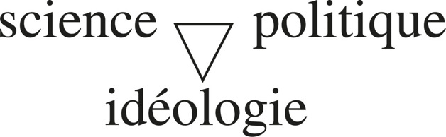
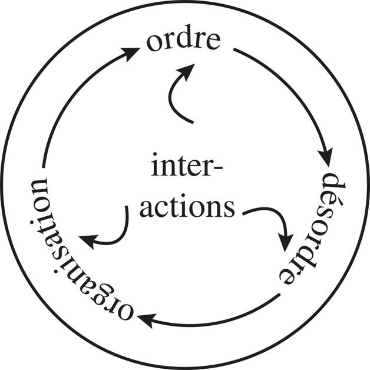
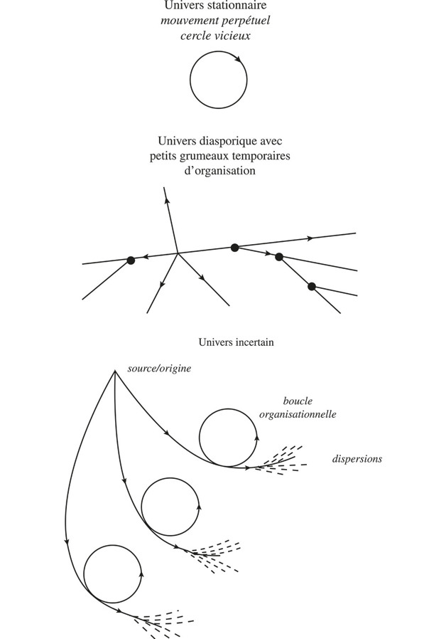
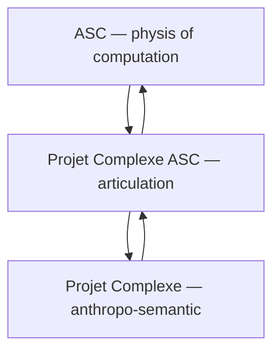
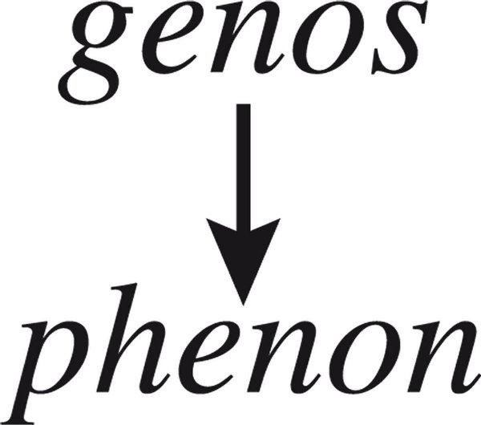
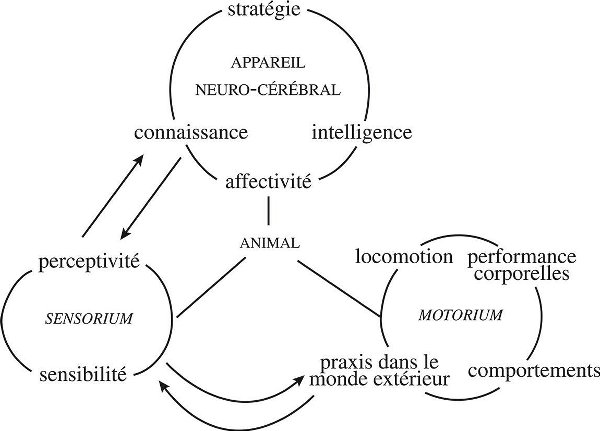
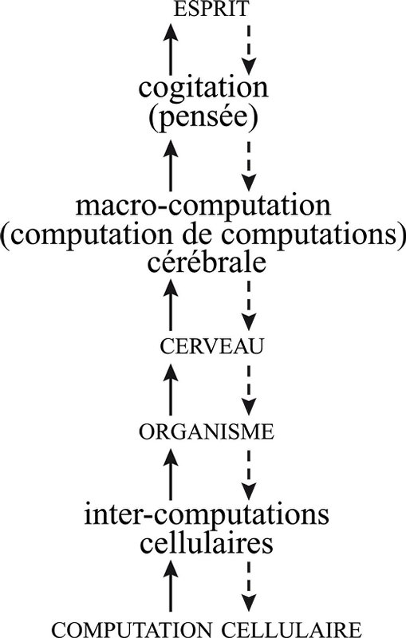
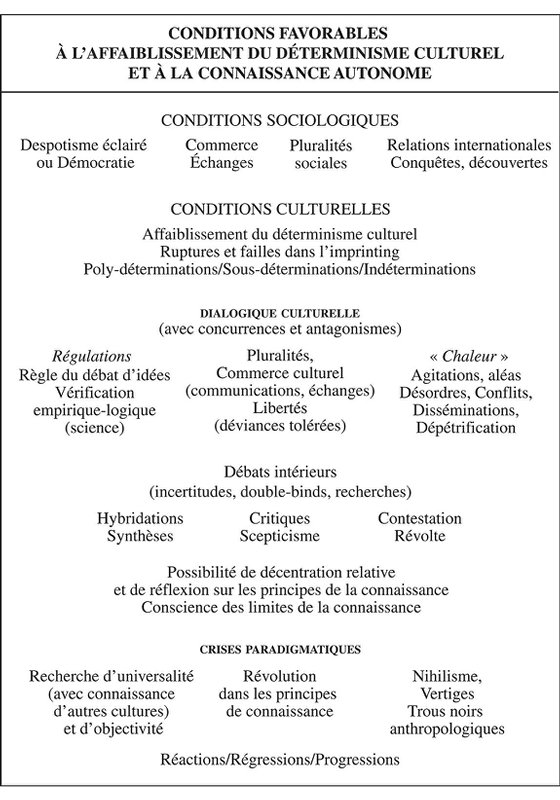
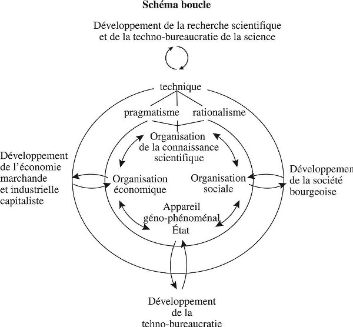
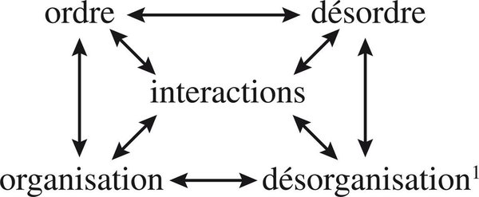

# Edgar Morin — La Méthode

Applicability to **ASC**, **Projet Complexe**, and **Projet Complexe ASC**.

Morin’s six volumes (1977–2004; Seuil 2008) are not a systems-engineering handbook. They are a reform of thought: how to name, relate and act inside realities that are simultaneously ordered, disordered, organised, autonomous and dependent. That is close to the question the three projects already share:

> How can a computational environment become sufficiently explicit, nameable and composable that both humans and autonomous agents can navigate and act within it?

Meadows maps *where* to intervene. Morin maps *how to think* once the object of intervention is itself a loop: observer inside the observed, part inside the whole, agent inside an environment that the agent also produces.

The filter used here is the same three-scope split as in the revival note:

| Scope | Morin asks | Design consequence |
| ----- | ----- | ----- |
| **ASC** | What is this thing, where is it, how is it addressed, what can be done with it? | Vocabulary of naming, addressing, composition, execution. Organisation before objects. Recursion, dialogic, hologrammatic as *constraints on the vocabulary*, not as a second-brain ontology. |
| **Projet Complexe** | What am I trying to accomplish, what do I know, how are things related, how should I act? | Tasks, knowledge, relations, research, agents as a semantic environment. Ideas have an ecology. Knowledge of knowledge is a first-class activity. |
| **Projet Complexe ASC** | Which generic ASC possibilities does this environment expose, under which stable pivots? | Thin entry points (`research`, `index`, `run-agent`, …). Must not become a second ASC, and must not smuggle Projet Complexe concepts into the core. |

Figures are **the original JPEG rasters from the Seuil 2008 EPUBs**, copied as-is. No thresholding, no PNG conversion. Layout *is* often the argument (spirals, nested circles, typographic posters); those stay as book images. Mermaid appears only as a labeled reconstruction of a simple topology.

Shared front matter (*Mission impossible*, *Introduction générale — L’esprit de la vallée*) is covered once. Later volumes reprint it.

---

## Shared front matter — L’esprit de la vallée

Morin starts from a triple wall: encyclopedic impossibility, epistemological disjunction, logical vicious circle. Physics depends on an anthropo-social observer; anthropo-social knowledge depends on physics. Classical method breaks the circle by choosing one master term (Matter, Mind, Information, Class Struggle). Morin keeps the circle and tries to turn it into a productive cycle.

That is already an architectural rule.

- **Do not reduce ASC to Projet Complexe**, nor Projet Complexe to ASC. Mutual implication is the point. The thin middle layer exists so the circle can turn without either side swallowing the other.
- **Do not start from a ready-made method.** *Caminante no hay camino*: the method is produced by the work. Entry points, hooks and compositions are discovered by walking the environment, then stabilised. They are not a Cartesian table of clear and distinct primitives declared in advance.
- **En-cyclo-pedie** is not accumulation. It is putting knowledge *in cycle*: articulating the disjoint at strategic nodes. ASC should name and address those nodes (files, processes, machines, capabilities). Projet Complexe should relate them as tasks and knowledge. Neither should try to store “everything”.
- **Réapprendre à apprendre** is Meadows’ levels 2–1: the organising principle of knowledge, not more parameters. An agent that only accumulates facts without reorganising how it knows is still inside the *école du Deuil* (specialist fragment, no view of the puzzle).

The two introductory triads are not decorations. They are the first hologrammatic diagrams of the whole work:



Science is never only science. Technique, state, ideology and research organisations co-produce what counts as knowledge. For a local agent environment this means: a `research` pivot is already political and technical. Pretending it is a pure retrieval function hides the apparatus.


The human is a trinity that cannot be reduced to one term. Computational analogue: **agent / environment / species-of-machine** (runtime instance, surrounding processes and files, the class of programs and capabilities that generate both). Kill one term and the others become ghosts.

The subject is not expelled from the method. It is drawn as a recursive loop:


*Je* produces itself by looping. An agent that cannot appear as an addressable *self* (inspectable process, named runtime, writable trace) is not an observer in the system. It is only an anonymous function.

---

# Tome 1 — La Nature de la Nature (1977)

Physical organisation, before life and mind. This volume is the main source for ASC’s *generic* vocabulary: object vs system, organisation, machine, loop, opening, command/communication, information.

## Avertissement

Tome 1 is not a cosmology for its own sake. It is the first turn of the spiral: without a physical concept of organisation, biology and anthropo-sociology remain extra-physical ghosts. ASC should likewise not start from “task” or “knowledge”. It starts from things that already exist in the computational physis: files, processes, machines, execution.

## Part I — L’ordre, le désordre et l’organisation

### 1. L’ordre et le désordre

Classical science made Order-King: law, determinism, element. Thermodynamics, microphysics and cosmogenesis reintroduce disorder as productive. Morin’s tetralogue is not a slogan. It is the minimal generative set:



**Order, disorder, organisation, interactions** co-produce one another. Interactions sit in the middle because nothing happens without them.

Applicability:

- An ASC environment that only models *order* (schemas, types, allowed operations) will treat noise, failure, partial names and conflicting declarations as bugs to delete. Morin: disorder is often the source of organisation.
- An environment that only celebrates *disorder* (free-form notes, unconstrained agents) never becomes addressable. Organisation is what makes a name a name.
- **Interactions** are first-class: hooks, compositions, process boundaries, messages. ASC’s question “what can be done with it?” is an interaction question, not a substance question.

The three universes of cosmogenesis are the same argument drawn as topology. This is the figure that becomes unreadable if binarised; the original JPEG is the source:



1. **Stationary universe** — closed perpetual motion, vicious circle. A monolith that restarts itself and never opens (Projet Complexe owning filesystem, Docker, Solr, agents, task model, OS abstraction).
2. **Diasporic universe** — dispersion with temporary clumps of organisation. A pile of scripts, containers and notes with no recursive loop. Local order, global scatter.
3. **Uncertain universe** — origin, organisational loop, then dispersion. The complex case: organisation is a loop *inside* a flow that remains open and mortal. ASC + thin pivots + semantic environment should look like this, not like (1) or (2).

Chaosmos: cosmos and chaos are not two worlds. Soleils and atoms are organisations that *use* disorder. Computational analogue: a service, a worker, an agent is an improbable local organisation that must continually reorganise against entropy (crashes, stale indexes, context rot).

The observer is inside the observation. There is no Sirius from which to name the system without being one of its processes. `inspect` and `inspect-agent` are not optional diagnostics. They are the reintegration of the observer.

### 2. L’organisation (de l’objet au système)

The object-substance and the elementary unit lose their royalty. What remains is the archipelago of systems. First definition: a system is a complex unity organised from interrelations.


Interactions → interrelations → the triad **interrelations / organisation / système**.

This is the strongest ASC sentence in the six volumes: **stop treating computational things as objects with properties; treat them as organised interrelations that can be named.** A file is not a blob. It is a node in path, permission, process, mount, editor, index, agent-read. A capability is not a function pointer. It is an organised relation between name, hook, environment and execution.

*Unitas multiplex.* The whole is more *and* less than the sum of the parts:


- **Plus:** emergences, globality (a composition `run-agent` that none of the hooks is, by itself).
- **Less:** constraints, lost virtualities (an agent inside a capability set cannot do everything the unconstrained shell could).
- The pivot is **organisations / interrelations**. That is Projet Complexe ASC’s job: not new substances, but the organised relations that produce both emergence and constraint.

Holism and reductionism are both refused. The circuit is relational. The whole is not all: it is split (emergent / immersed, expressed / repressed). A system must be **open and closed**. Closure makes identity (a named entry point). Opening makes existence (it must read the environment, spawn processes, fail).

The observing system and the observed system transact. ASC that cannot represent *itself* as a system among systems (its own processes, its own files, its own hooks) repeats the classical expulsion of the subject.

## Part II — Organisaction (organisation active)

### 1. Les êtres-machines

At the beginning was action. A machine, for Morin, is not a clock. It is a physical organising being: praxis, transformation, production. Families: arkhe-machine (the Sun), proto-machines, living poly-machines, social mega-machine, artificial machines.

Genealogy matters. Artificial machines are the poorest: they do not produce themselves. Living and social machines do. Agents sit awkwardly in between: they are artificial, but we ask them to *act* as if they had production-of-self (memory, skills, reorganisation).

**Machines of machines (poly-machines).** Isolating a machine and relating machines are two complementary operations. ASC should name both the unit and the composition. The designer/conceiver problem does not disappear: someone (human, hook, agent) still composes. Composition is not inheritance. It is organisation of machines by machines.

### 2. La production-de-soi (la boucle et l’ouverture)

From whirlwind to loop: retroaction becomes recursion. Recursion is not “a function calling itself”. It is an organisation whose products are necessary to its own production.

- Morphostasis, regulation, homeostasis, then **permanent reorganisation**. A knowledge index that is only built once is a stationary universe. A living index is a loop that reorganises as sources change.
- Opening is thermodynamic, organisational and existential. Autonomy is **dependent autonomy**: the more organised the being, the more it needs its environment. An “autonomous agent” that does not declare its environment, tools and permissions is a myth of closure.
- Positive and negative feedback both operate. Reinforcing loops (skill libraries, successful workflows) and balancing loops (verification, refusal, timeouts) are the same tetralogue in cybernetic clothes. Meadows’ levels 8–7 sit here, but Morin insists they are not optional add-ons: they are how the being *is*.

### 3. De la cybernétique à la sybernétiqe

Command and communication are the Gordian knot. Four schemas, not one hierarchy:


1. Command over communication, with dashed feedback.
2. Reciprocal link: feedbacks that can *modify* the command.
3. Full recursive loop, neither term first.
4. Communication over command: cooperative / community organisation.

Wiener’s cybernetics tends to freeze (1): apparatus, servomechanism, enslavement. Morin wants a science of communicational organisation (**sybernétiqe**): command as an emergence of communication, not only communication as a servant of command.

Applicability:

- ASC entry points look like (1) if they are only `execute this hook`. They become (2)–(3) when inspect, logs, agent reports and human approval can modify the command.
- A desktop that only *displays* what ASC already commanded is (1). A semantic environment where relations, tasks and research *reprogram* which pivots exist is closer to (4): communication (knowledge, names, links) generating command.
- **Appareil**: the State-apparatus and the social mega-machine are warnings. A process manager, an agent runtime, an index can become an apparatus that enslaves the rest of the environment. Thin pivots are an ethical as well as an architectural choice.

### 4. L’émergence de la causalité complexe

Endo-causality, generative causality, endo-eco-causality. Finality returns as teleonomy, not as the watchmaker. Ends are uncertain; means and ends permute.

For agents: a goal is not a static `maximise reward`. It is an emergent finality inside a loop that includes the environment. `Complete the user's project` (Meadows level 3) is still too clean unless the project can rewrite the goal. Ecology of action starts here and is named as such in Tome 6.

### 5. Première boucle épistémologique

Physics → biology → anthropo-sociology, and back. “We are machines” is not reduction: it is articulation. The wheel is vicious if you break it, productive if you keep it turning.

The three-project architecture *is* this loop at small scale:



*Reconstruction, not a book figure.* The book’s point is the circulation, not the boxes.

## Part III — Organisation régénérée et générative

### 1. L’organisation néguentropique

Negentropy is not the opposite of entropy stored in a battery. It is a dialogic: organisation that works *with* and *against* degradation. Indexes, memories, containers, git histories are local negentropic organisations. They cost energy and attention. They die if not regenerated.

### 2. La physique de l’information

Shannon is necessary and insufficient. The bit measures signal transmission, not generative meaning. Information that cannot regenerate organisation is not living information.

- **Bit / redundancy / noise** are relative to an observer and an organisation. An embedding is not “the information”. It is a translation for one apparatus.
- Genealogy of information: from proto-loop to generative complex, programme, memotheque, event-generativity. Memory is not a buffer (Meadows 11). It is generative mnesis: the past that can produce new organisation.
- Anthropo-socio-informational deployment: the **noosphere** already appears. Projet Complexe’s knowledge layer is a noological environment. ASC should carry bits, processes and files; it should not have to understand “idea”.

Knowledge of organisation and organisation of knowledge form a loop. Observation is praxis and has a cost. That is why `index`, `extract`, `recognize` belong in Projet Complexe ASC: they are costly translations, not ASC primitives.

## Conclusion of Tome 1

From the complexity of nature to the nature of complexity. First spiral: physis regenerated, physis generalised, physis open. Method begins as anti-method (ignorance, uncertainty, confusion as virtues) and must become a method that *links*.

For the three projects: **organisation is the Salzburg twig** around which key concepts crystallise. If ASC gets organisation (name, address, compose, execute) wrong, no amount of GUI or agent personality will save Projet Complexe.

---

# Tome 2 — La Vie de la Vie (1980)

Life without “vitalism”: ecology generalised, then *autos*, then organisation of living activities, then the prefix **RE**, then an incompressible paradigm. This volume is the main source for **autonomy/dependence**, **computo**, and **environment as organising**.

## Introduction — La vie sans la vie

Do not extract a substance called Life. Reconstruct the organisational complex that we call living. Same rule: do not extract a substance called Agent. Reconstruct the organisational complex (process, tools, memory, environment, observer) that we call an agent.

## Part I — L’écologie généralisée (oikos)

Eco-system as living machine. Complementarities: association, symbiosis, parasitism, predation. The **pluriboucle**: loops of loops. Eco-disorganisation / permanent reorganisation. Eco-tetragram (the tetralogue lived as ecology). Eco-communication.

Principles of the ecological relation that transfer almost unchanged:

1. Bio-thanatic inscription — every organisation lives of death (GC, eviction, forgetting).
2. **Eco-auto-organisation** — autonomy is ecological.
3. Mutual recursive development of complexity.
4. **Dependence of independence.**
5. Dialogic explanation of living phenomena.

**Écologie de l’action** and **écologie des idées** are named here, long before Tomes 4 and 6. Action and ideas have environments. A `research` pivot that ignores the ecology of sources, indexes, previous agents and the user’s current task is not research. It is predation on a context window.

Double piloting: the living being is piloted from inside *and* from the eco-system. An agent that only has an inner planner is a closed organism fantasy. An agent that is only a function of Solr hits is a pure eco-effect. Need both.

## Part II — L’autonomie fondamentale (autos)

### De l’autonomie à l’autos / Auto-(géno-phéno)-organisation



*Genos* (generative, species-like, programmable) and *phenon* (phenomenal, individual, enacted) are an uniduality, not a stack of layers to compile away.

| Morin | ASC / PC |
| ----- | ----- |
| Genos | Declaration, capability, class of hook, YAML, species of entry point |
| Phenon | This process, this run, this agent instance, this index build |
| Appareil computant | Runtime that translates genos into phenon and back (logs, traces, memory) |
| Empire of genes vs empire of milieu | Code-determinism vs environment-determinism; both miss the **republic of the complex** |

Do not let “the prompt” or “the model” become gene-king. Do not let “the user’s folder” become milieu-king. The computant apparatus sits between them.

### Individualité, sujet, computo

The biological subject is already there in *E. coli*: self/non-self, ego-auto-reference, computation *for itself*. *Computo ergo sum* precedes *cogito*.

This is the sharpest agent sentence in the work: **an agent is not first a thinker. It is a computant-for-itself that may, later, cogitate.**

- Discrimination of self: identity of the runtime (name, pid, session, memory store).
- Computation for self: the loop is not “answer the user” only; it maintains its own organisation (context, tools, traces).
- Inclusion: auto-(géno-socio)-centrism. The agent is also of a species (Hermes, Pi, a Projet Complexe worker) and of a society (other agents, the user, services).
- Uncertainty of individuality: the agent is not an elementary particle. It is a non-elementary individual.

Cogito as spiral (Villain’s drawing in the book — layout *is* the argument; keep the JPEG, do not mermaid it):


### Animalité, sociétés de troisième type

Animal: locomotor loop, endo-exo-loop, **programme vs stratégie**. Programme is genos-heavy. Strategy plays with disorder, invention, art. Agents that can only execute playbooks are programmes. Agents that can replan under uncertainty are strategies. Both are needed; they are complementary, not a maturity ladder that abolishes programmes.

Third-type entities: societies with a social *genos* (culture) and a geno-phenomenal State-apparatus. Projet Complexe is not a society. It is a semantic environment in which a small society of agents can appear. Do not build Léviathan (Tome 5) into the desktop.

## Part III — Organisation des activités vivantes

Against the pseudo-rational scheme of organisation:

- Diversity, differentiation, specialisation — and **de-specialisation**, polyvalence.
- **Hierarchy / heterarchy / anarchy.** The integron, looped hierarchy, insufficiency of hierarchy.
- Centrism / polycentrism / acentrism.
- Bricolage, underlying anarchy.
- **Inoptimisable optimum.** Error is ineliminable and complexifying.

ASC should not enforce a single tree of control. Capabilities, hooks and agents need heterarchy (multiple valid paths to the same named operation) and a tolerated anarchy of bricolage (the shell remains). Projet Complexe can *display* a cleaner semantic order without pretending the physis underneath is a bureaucracy.

## Part IV — RE : du préfixe au paradigme

RE is not mere repetition. Rememorisation, reflection, recursion. The new of the again. Neither Eternal Return nor death drive. Spiral RE: return inside non-return; innovation inscribed in a return that it transforms.

`re-index`, `re-search`, `re-run`, reflection agents: name them as **RE**, not as retries (Meadows 12). Regeneration is organisational.

## Part V — Le paradigme incompressible

The matrix that must not be compressed:

> auto-(géno-phéno-égo)-éco-re-organisation (computationnelle-informationnelle-communicationnelle)

A paradigm does not explain. It *allows* explanation. If any hyphenated piece is dropped, the living (or the agent) is mutilated.

- Drop *éco* → closed agent fantasy.
- Drop *re-* → snapshot that cannot regenerate.
- Drop *computationnelle* → vitalist GUI.
- Drop *communicationnelle* → isolated computo with no names to share.
- Drop *égo* → no subject, no addressable *je*.

This is the acceptance test for “autonomous agent” in this architecture.

---

# Tome 3 — La Connaissance de la Connaissance (1986)

Knowledge of knowledge. No foundation (Gödel, Tarski). Reintegrate the subject. This volume is the main source for **computo vs cogito**, **knowledge as activity**, and why Projet Complexe is not a database.

## Introduction

Abyss: the unknown of knowledge, pathology of knowing, crisis of foundations. Meta-point of view: bio-anthropo-sociological opening, permanent reflexivity, reintegration of the subject, radical interrogation. Method remains unfinished.

Projet Complexe’s knowledge layer should expose **limits, uncertainties, blind spots**, not only hits. An index that cannot represent “this is uncertain / this is a translation / this is an agent’s guess” is Shannon without generativity.

## 1. Biologie de la connaissance

To know is primarily to compute. Living computation, *computo*, auto-computation, auto-exo-reference, polycellular computo. Two logics of computation. Artificial machines compute without existing-for-themselves.

Implication: LLM-as-autocomplete is computation without *computo*. A Projet Complexe agent needs a self-referential loop (state, memory, name) or it is a tool, which is fine — but then do not call it an agent.

## 2. L’animalité de la connaissance



The animal is already an architecture:

| Sphere | Function | Computational analogue |
| ----- | ----- | ----- |
| Sensorium | perceptivity, sensibility | observe, read, search, watch |
| Motorium | locomotion, praxis, behaviours | execute, write, spawn, publish |
| Appareil neuro-cérébral | strategy, affectivity, knowledge, intelligence | plan, relate, remember, choose tools |

Loops: knowledge ↔ perceptivity; sensibility ↔ praxis. An agent that only has motorium (tools) or only sensorium (RAG) is not an animal. The revival note’s task / knowledge / agent triad is this figure in other words.

Learning, cognitive strategies, curiosity: autonomisation of knowledge. `research` as curiosity with strategy, not as a single search call.

## 3–5. Esprit / cerveau, machine hyper-complexe, computer et cogiter

What is a mind capable of conceiving a brain capable of producing a mind? Uniduality, not schism. Dialogic, recursive, hologrammatic principles. Bi-hemispheric and triune warnings against a single module diagram.

Computer and cogitate: computant operations and cogitant operations, language, conscientisation. Uniduality again.



Solid arrows up (emergence), dashed arrows down (re-entrant constraint). Levels: cellular computation → inter-cellular → organism → brain → macro-computation (computation of computations) → cogitation → esprit.

**Macro-computation (computation of computations)** is the agent-relevant layer: not more tokens, but computation that takes computations as objects — traces, plans, tool results, other agents. That is what `inspect-agent`, reflection, and workflow memory are for.

Do not flatten this stack into “the model”. The model is at most one computant organ inside a larger organisation.

## 6–9. Existentialité, doubles jeux, double pensée, intelligence–pensée–conscience

Knowledge has a psyche: obsession with certainty, religion of truth, error of truth. Analogical and logical, mythos and logos, explanation and comprehension. Intelligence, thought, consciousness of consciousness. The iceberg of unconsciousness.

Projet Complexe will mix sources, myths, diagrams, code, notes. The environment should not force everything through one “logical” schema (that is the grand Western paradigm of Tome 4). Analogical linking (`relate`) and logical indexing (`index`) are a dialogic, not a pipeline where analogy is a bug.

## Conclusions of Tome 3

Conditions of knowledge: inherence–separation–communication. The mind is in the world which is in the mind. Limits, uncertainties, black holes, verifiers. Foundations of a knowledge without foundation.

For agents: verification is not a moral extra. It is how knowledge stays knowledge. But verifiers are themselves organisations with blind spots. Meadows’ balancing loops live here; Morin adds that they cannot found certainty.

---

# Tome 4 — Les Idées (1991)

Ecology of ideas, noosphere, organisation of ideas (language, logic, **paradigmatology**). This volume is the main source for Projet Complexe’s knowledge environment and for not turning ASC into an ideology of computation.

## Part I — L’écologie des idées

Idols of the tribe. Cultural determinisms and *bouillons de culture*. Intellectual class and two cultures. Complexity of the sociology of knowledge. Return on hic et nunc.

Ideas do not float. They have niches, predators, symbiotic hosts, imprinting. A second brain that stores “ideas” without their ecology (sources, institutions, tools, previous agents, the user’s projects) stores corpses.



Favourable conditions for the life of ideas are organisational, not just cognitive. Projet Complexe’s job is partly to *keep those conditions* (relations, recency, conflict, context). ASC’s job is to make the underlying files and processes addressable so the ecology can run.

## Part II — La vie des idées (noosphère)

Third kingdom: systems of ideas, genesis and metamorphoses. Knowledge items in Projet Complexe are noological beings. They should be nameable without being reduced to files (ASC) or to GUI cards (desktop).

## Part III — L’organisation des idées (noologie)

Language, rationality and logic, **arrière-pensée**: paradigmatology. Kuhn, Foucault, Maruyama. The grand paradigm of the West: disjunction of subject and object.

This is Meadows’ level 2 with a name. As long as the paradigm is “agent as chatbot”, information flow and self-organisation stay cosmetic. The revival’s paradigm is closer to: **computational environment as explicit, nameable, composable physis**, with a semantic environment on top, and agents as living-like organisations inside both.

The science / technique / society loop, drawn as a book figure:



Organisation of scientific knowledge ↔ economic organisation ↔ social organisation ↔ geno-phenomenal State-apparatus; each with its developmental halo (research techno-bureaucracy, market, bourgeois society, techno-bureaucracy). Pragmatism and rationalism meet in *technique*.

A local stack (LLM, Solr, ArangoDB, Docling, agent runtime) is already this loop in miniature. Projet Complexe ASC should name the *pivots*, not pretend the loop is a neutral toolchain.

## Conclusion of Tome 4

Ideas and men. Do not let the noosphere enslave the subject (possession by ideas). Do not let the subject pretend ideas are mere tools. Dialogic.

---

# Tome 5 — L’Humanité de l’Humanité (2001)

The human trinity, identity, Léviathan, planetary identity, **méta-machines**. This volume is the main source for *what agents are doing to the human complex*, and for not confusing Projet Complexe with a mega-machine.

## Part I — La trinité humaine

Cosmic and biological rooting, hominisation. Then the four-term loop:


Brain, mind, language, culture: none is cause of the others. An agent environment that only stores language (tokens, notes) without culture (practices, projects, rituals of use) and without a body of traces (the “brain” of indexes, logs, files) is one vertex pretending to be the square.

Trinity individu / société / espèce again. Un multiple: unity ↔ diversity. ASC names must keep diversity (this machine, this project) without losing generic vocabulary (any machine, any project).

The tetralogue returns as a human-scale figure:



## Part II — L’identité individuelle

Subject, polymorphic identity, mind and consciousness, **sapiens-demens**, beyond reason and madness, bearable reality.

Sapiens-demens is a design constraint: agents will mythologise, obsess, hallucinate, over-certify. Architecture should expect demens, not treat it as a temperature bug. Balancing loops, but also *comprehension* (Tome 6), not only punishment of error.

## Part III — Les grandes identités

Archaic social identity, **Léviathan**, historical identity, planetary identity, future identity.

### Léviathan

The State as geno-phenomenal apparatus. Warning for any environment that concentrates command (Tome 1 schema 1) over all files, agents and knowledge. Projet Complexe must not become the State of the home directory. ASC remains generic precisely so a desktop cannot totalise.

### Identité future — méta-machines

Toward meta-machines; meta-humanity / super-humanity? Auto-organisation of machines, AI, demortality, Matrix/Bill Joy as symptoms. Reform of thought is required *because* the machines are becoming organisational, not because we need a nicer chatbot.

Applicability:

- Agents that can spawn agents, write hooks, and modify pivots are already proto-meta-machines.
- The ethical and architectural question is whether that loop remains *inspectable, stoppable, nameable* (ASC) and *comprehensible* (Projet Complexe), or becomes an apparatus without observer.
- `stop-agent`, `inspect-agent`, capability permissions are not product features. They are the minimum of sapiens facing its own machines.

## Part IV — Le complexe humain

Awake and sleepwalkers. Return to the generic human. Second prehistory. The project of a computational environment is a small piece of that second prehistory: making the machine world thinkable without disjoining it from the human trinity.

---

# Tome 6 — Éthique (2004)

Ethics under uncertainty. This volume is the main source for **écologie de l’action**, reliance, cognitive democracy, and why “just let the agent run” is not a method.

## Part I — Pensée de l’éthique / éthique de pensée

Subjective exigency, ethical reliance, moral autonomy. Crisis of foundations: ethics must be resourced, not deduced.

**Incertitude éthique:**

- Intention ≠ action (ecology of action).
- Limited predictability.
- Double necessity of risk and precaution.
- Perverse secondary effects of salutary actions.
- Ends and means permute; finalities drift.

Ethical contradictions, ethico-political dialogic, uncertainty in the sciences. Ethical illusion. Complexity of ethics. *Travailler à bien penser*: from complex thought to ethics.

For agents: a planner that only maximises task completion will invert ends and means (the classic “the agent did what you asked”). Ecology of action must be in the loop: inspect effects, delays, other agents, the user’s knowledge environment. Meadows’ delays (level 9) are ethical, not only technical.

The parts ↔ whole loop is now ethical:


An action that optimises a part (one agent, one index, one project) can mutilate the whole (the rest of the computational environment, the user’s attention, other tasks). Composition has moral weight because it has organisational weight.

## Part II — Éthique, science, politique

Science / technique / society / politics. Blind spot, ethical compromises, reform, possible transformation of human nature. Ethics and politics: realism, crisis, hope?

The local analogue is not parliament. It is: who may run what, on which machine, with which traces, under which approval. Capability permissions are the smallest ethico-political organisation of ASC.

## Part III — Auto-éthique

Self-examination, autocritique, psychic culture, ethical recursion, resistance to *moraline*, honour, responsibility, virtues. Ethics of reliance: recognition, courtesy, tolerance, liberty, fidelity, love. Ethics of comprehension (error, indifference, possession by ideas, egocentrism, abstraction, fear of understanding). Magnanimity, pardon. Art of living: poetry and/or wisdom.

Transferable without kitsch:

- Agents need **auto-examen** (reflection that can change the next command — Tome 1 schema 2).
- **Comprehension** of error, not only retry.
- Resistance to purification ethics (“the agent must never be wrong”) which produces hidden failure.

## Part IV — Socio-éthique

Ethics of community, democratic loop. Annex: **cognitive democracy**.

A semantic environment shared by human and agents is a tiny cognitive polity. Names, indexes and traces must be contestable. If only the agent can read the true state, the user is no longer a citizen of their own environment.

## Part V — Anthropo-éthique

Assume the human condition; planetary humanism; regenerative paths (reform of society, of mind/education, of life, of science) in a loop of reforms. Ethical hope as metamorphosis, not as programme.

## Conclusions — Du mal / Du bien

No Principle of Evil; humanity of evil; emergence. Complex thought and ethics as reliance. Fragility, modesty, regenerate. Hope/despair. Ethics of resistance. Ethical faith without foundation.

For this architecture: **there is no Principle of Evil in autonomy.** Agents going wrong is organisational (apparatus, closed loops, disjunction of observer). The response is regeneration and resistance (inspect, stop, recompose), not a total ban on self-organisation (Meadows 4) and not a leap to uncontrolled meta-machines (Tome 5).

---

# Synthesis for the three projects

Morin’s incompressible living paradigm, rewritten as an acceptance test:

```text
auto-(géno-phéno-égo)-éco-re-organisation
  (computationnelle-informationnelle-communicationnelle)
```

Mapped without smuggling Projet Complexe into ASC:

| Hyphen | ASC (generic) | Projet Complexe ASC (pivots) | Projet Complexe (semantic) |
| ----- | ----- | ----- | ----- |
| auto- | named thing that can act (process, worker, machine) | `run-agent`, `inspect-agent`, `stop-agent` | agent as actor in tasks/knowledge |
| géno- | declarations, capabilities, species of entry point | YAML/hooks that generate runs | types of project, research, relation |
| phéno- | this execution, this file, this live process | a given run’s traces and outputs | this task, this document, this session |
| égo- | addressable identity of a runtime | inspectable *je* of an agent | the user’s subject-position in the environment |
| éco- | environment: FS, processes, machines, network | compositions that bind tools (search, index, llm) without making them ASC primitives | oikos of sources, ideas, projects, other agents |
| re- | restart, regenerate, watch | `re-index`, reflection, retry-as-reorganisation | living knowledge, not a snapshot second brain |
| computationnelle | execute, compose, hook | agent runtime as one computant apparatus | strategy vs programme in work |
| informationnelle | bytes, files, signals | extract, embed, index as translations | meaning, uncertainty, sources |
| communicationnelle | names, addresses, messages | stable pivots others can call | relations, language, culture of use |

What not to do (Morin’s disjunctions, as architecture):

1. **Object instead of organisation** — treating files, agents, notes as substances with properties, ignoring interrelations.
2. **Closed autonomy** — agents without environment declarations; desktop that owns the OS.
3. **Shannon without generativity** — embeddings and indexes as “the knowledge”.
4. **Command without communication** — hooks that cannot be modified by inspection, traces, or the semantic layer.
5. **Chatbot paradigm** — cogito without computo, language without culture/brain/traces.
6. **Léviathan** — one apparatus (the app, the agent swarm, the index) enslaving the rest.
7. **Ethics as filter at the end** — instead of ecology of action inside the loop.

Highest-return translations (parallel to the Meadows note, different axis):

1. Make **organisation** nameable: not more metadata fields, but explicit interrelations (what composes what, what can execute what, what observes what).
2. Keep the **circle** ASC ↔ Projet Complexe turning through a thin pivot layer; do not break it by reduction either way.
3. Treat agents as **computant organisations** (sensorium / motorium / strategy, genos/phenon, eco-auto-re-) rather than as chat sessions with tools.
4. Put **RE** in the architecture: indexes, memories, pivots and agents must regenerate, not only store.
5. Reintegrate the **observer**: inspect, traces, cognitive democracy over the home environment.
6. Hold **command and communication** in dialogic: execution is real; so is the possibility that knowledge and relations rewrite what may be executed.
7. Accept **uncertainty and demens** as organisational facts: verification, comprehension, stoppability, not purification.

The book figures stay as original JPEGs in `edgar-morin-la-methode/`. Only a subset is embedded here. The rest of the EPUB rasters are in that folder for later use; they were not converted.

**Confidence:** high on the mapping of organisation, recursion, computo, ecology of action, and the three-scope split; medium on which additional Tome 2 pictograms would still earn their place in a later pass.
