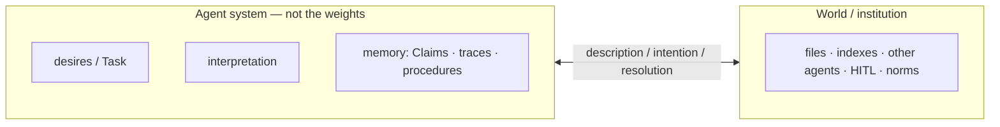
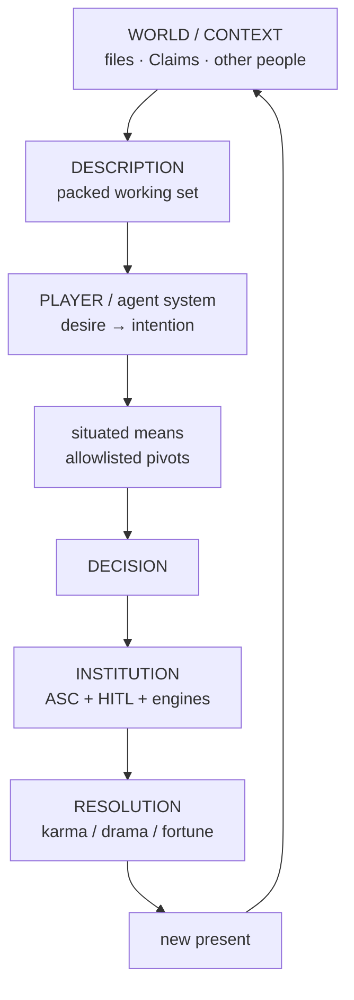
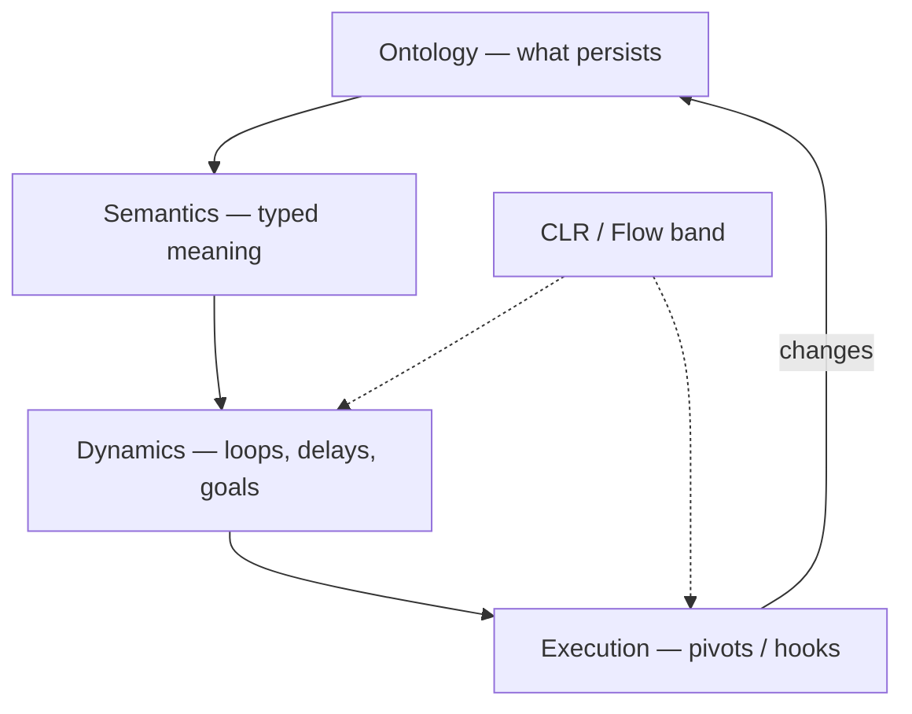
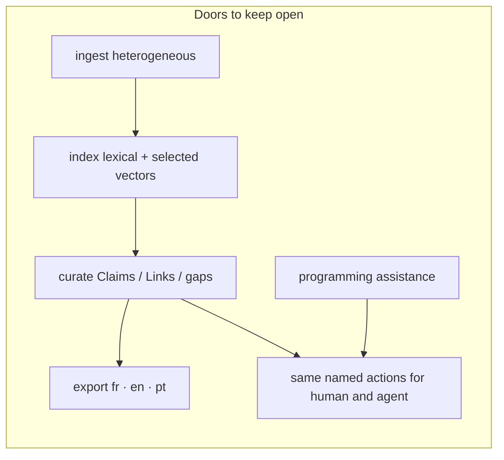
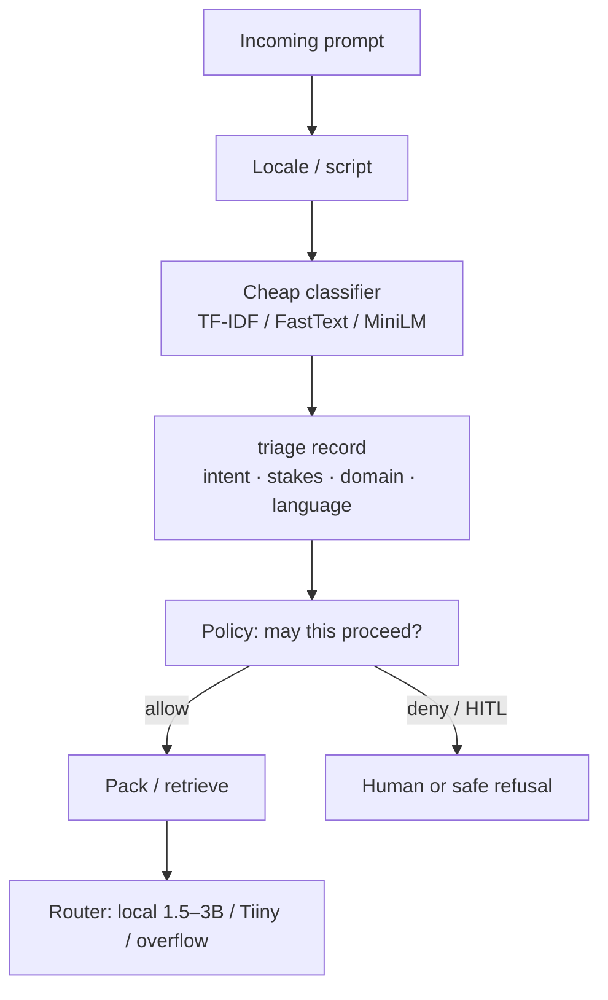
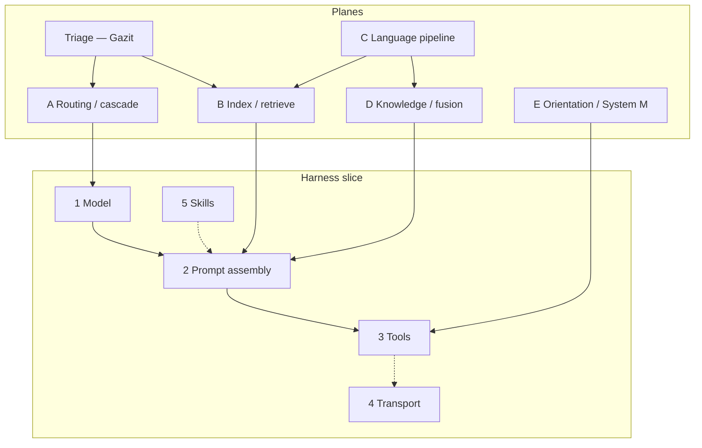
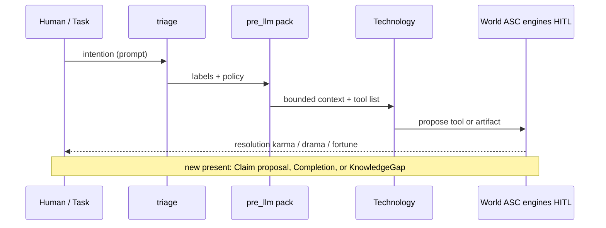
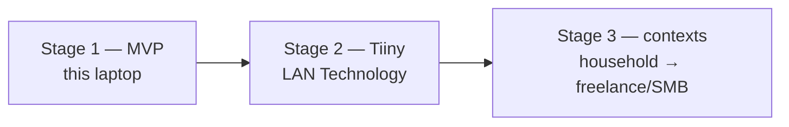
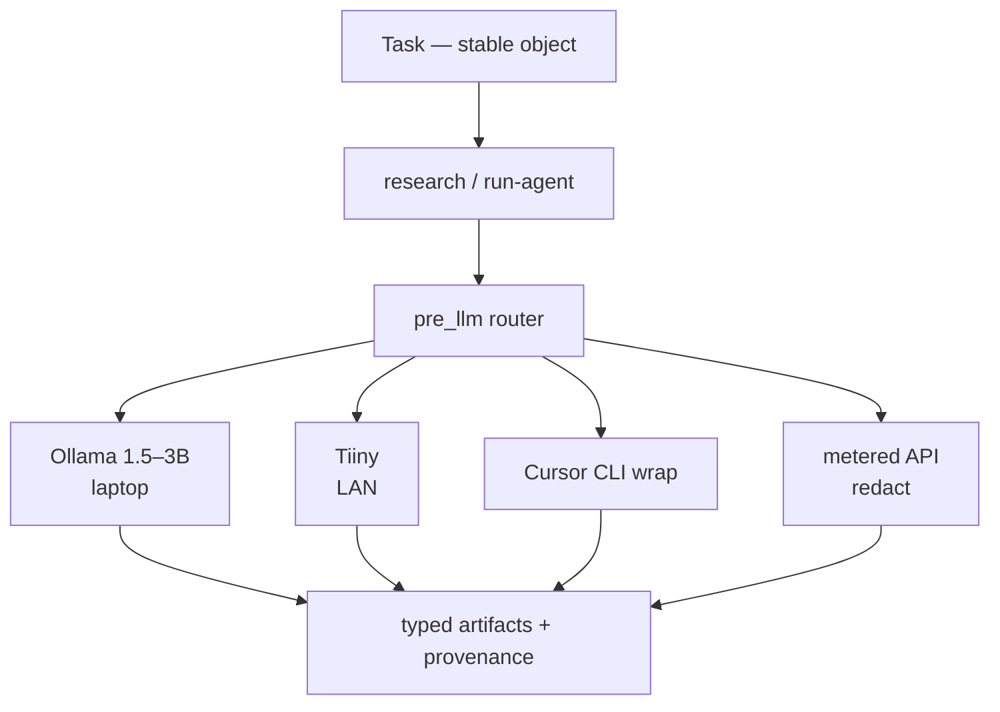

# Projet Complexe 2026 Revival (v5)

## ASC, Projet Complexe, and Projet Complexe ASC — distilled for a living second brain

**Date:** 2026-08-28  
**Status:** architecture note / design instrument (not a spec, not an implementation plan)  
**Keeps:** Revival v2 (three-project cut, killswitch, genericity); v3 (extract-once, Postgres as SoR, lexical-first retrieval); v4 (hooks around LLM calls, tools as entry points, DSL vs MCP, language as a system, routing).  
**Adds:** (1) a merged jargon table; (2) an updated literature cut; (3) three groundwork notes as *reference points that stay visible* — Meadows leverage, Lefèvre’s desire–world loop, Monnin/Lévy redirection; (4) a staged construction path: laptop MVP → Tiiny on the LAN → later small-business contexts.

This note exists because v4 answered a precise engineering question (how agents get tools) and then opened five more *planes* (routing, index, language, knowledge, orientation). Those planes are still right. They are not yet a picture of **what Projet Complexe is for**, nor of **how autonomy is produced**, nor of **which trajectory this garage project must refuse**. The August 26–27 recaps ([About Natural Language Processing](About%20Natural%20Language%20Processing.md), [About Memory, RAG, and Graphs](About%20Memory,%20RAG,%20and%20Graphs.md)) and the three groundwork files supply that picture. v5 distills them into one instrument.

> ASC is authoritative about execution. Projet Complexe is authoritative about interpretation. The coupling between them is the product — not the model.

## Jargon notes

Terms as **this** note uses them. Industry synonyms are listed so they do not get imported as identity. The table merges the memory recap’s glossary with words that v4, the NLP recap, the groundwork files, and this rewrite would otherwise leave opaque.

| Term | Alternative notations, synonyms | Definition | Examples, use cases |
|---|---|---|---|
| ASC | Agnostic Shell Controller | Thin glue: names, pivots, hooks, wrappers. Not a program that “is” the second brain. `$subject` / `$action` (or `$subject` / `$object` / `$action`) folders become `make` entry points. | `make extract`; `pre_llm` hook; YAML `able` contracts. |
| Pivot | Entry point; `$subject-$action`; named capability | A stable name for something that can be done. The Implementation behind it may change. | `extract`, `index`, `relate`, `research`, `run-agent`, `publish`. |
| Hook | Variant; `pre_*` / `post_*` | File-based event: wrap an action without rewriting it. Combinatory with env (host, instance, provider). | `pre_llm`, `post_extract`, `pre_extract/pdf`. |
| DSL | ASC DSL | Filename-safe encoding of argv (`p1`, `b-y`, `o-max-4`). For *addressing and validation*, not for chatting with a model. | YAML `validate:`; hook filenames. Compiles *to* JSON Schema for the model. |
| Genericity | Primordial → primitives → core → extension → override → specific | How reusable an Implementation is. Promote a local name; do not start from an MCP registry. | Core: hook wrap. PCA: which tools exist. PC: what a Claim means. |
| Active dir | `$subject` folder | Directory whose files ASC discovers (includes, globals, hooks, actions). | `asc/extensions/agent`; `scripts/asc/extend/research`. |
| Projet Complexe | PC; the interpretive layer; “second brain” | Semantic and visual environment for tasks, knowledge, research, projects, agents. Owns meaning. Desktop: Tauri + SolidJS (secondary). | Coordinate + mode; Claim pane; graph of *accepted* links. |
| Projet Complexe ASC | PCA; the thin bridge | Domain-specific pivots and compositions. Uses ASC specifically without becoming a second ASC. | Allowlists; packing recipe; locale Requirements; router policy. |
| Task ↔ knowledge duality | Two orientations; mutual killswitch | Same activity, two projections. Default is task-oriented. Switching mode keeps the coordinate. For agents: stop acting to research; stop researching to act. | Task view: next pivot / gap. Knowledge view: graph, claims, unknowns. |
| Coordinate | Location; `goal` + `focus` + `trail` + `depth` | Where you are in meaning-space. Mode is a *projection* of a coordinate, not a different app. | Hash codec in the UI; filename-safe names so the terminal can inspect the same place. |
| Killswitch | System M (Dupoux et al.); orientation switch | Explicit stop: research may not act; a Task may suspend when knowledge is missing. Not a regex filter. | `research` catalog has no `bash`; Task writes a KnowledgeGap instead of guessing. |
| Context | Working set; prompt contents | Everything currently in the model’s input this turn. Not the archive and not memory. | A packed `run-agent` prompt. |
| Model window | Context window; `num_ctx` | Hard token budget of one inference call. Retrieval quality is how you *spend* this, not how you enlarge it. | Local 2k–4k on a GTX 1050; a 128k API is not a reason to stuff OCR. |
| Packing | Context engineering; token packer; governor | Select, compress, order, and budget what enters the window. The memory *controller*, not the memory. | CLR band; Hermes-style frozen preference block + on-demand FTS. |
| CLR | Cognitive Load Ratio; Flow band for agents | Task complexity vs *effective* capacity (retrieval, tools, packing, window — not model size). Regulate the band. | 1.7B + excellent retrieve vs stuffed 70B; reverse-prompting note. |
| Triage | Cheap classifier; request-level policy | Decide *before* packing: intent, locale, stakes, local vs remote, retrieve vs refuse. | Gazit two-level router; TF-IDF Fallback; labels: task / research / publish / code-assist. |
| Routing / cascade | Model router; plane A | Pick among *independently trained* models, or try small then escalate. Not MoE inside one net. | Default: tiny local. Mid: Tiiny on LAN. Overflow: metered API / Cursor CLI. |
| Harness | Surround; AutoDesign’s `H`; agent loop | Everything *around* frozen weights: prompts, tools, validators, packing, killswitch. Skill accumulates here. | EnvHarness Contract; `pre_llm` / `post_llm`; Pi / Cursor as workers. |
| Tool | Function calling; action | Named operation with a schema, executed by the *host* after the model requests it. Not a skill, not MCP. | Allowlisted ASC entry point; JSON Schema generated from YAML. |
| Skill | Agent Skills; `SKILL.md`; procedure brief | On-demand instructions (+ optional scripts). Progressive disclosure. Not a Claim, not a tool, not an OS. | YAML `able` + git; optional `SKILL.md` export for Pi/Claude. |
| MCP | Model Context Protocol | JSON-RPC plug: host lists/calls tools on a server. Transport only. Does not store knowledge. | CodeGraph MCP when Cursor is host; refuse “memory MCP” as the store. |
| Retrieval | Recall; search; fetch | Choosing *which* stored items enter the window. Still not knowledge. | Meilisearch top-k; accepted-neighbour walk; `session_search`. |
| RAG | Retrieval-augmented generation | Retrieve then generate from packed hits. Grounding, not intelligence. Graph RAG / agentic RAG are variants of *how* you retrieve. | `research` packing pointers + short spans. |
| Graph RAG | Microsoft GraphRAG-style; neighbourhood retrieval | Build a graph from *your* texts, retrieve a bounded subgraph or community summary. A strategy, not the knowledge model. | Schema-guided `relate` on selected corpora; never on Wikipedia. |
| Conceptual graph | Personal graph; interpretive graph | Meaning graph (typed links, uncertainty). Not required to be one database. | Claims–Links–Gaps in Postgres; drawn in Tauri. |
| Code graph | AST graph; CodeGraph | Structure of a *source tree* (file / function / call). Sidecar, not the second brain. | [colbymchenry/codegraph](https://github.com/colbymchenry/codegraph) SQLite + MCP. |
| Claim | Accepted belief; typed assertion | Inspectable statement the household will stand on: provenance, confidence, `valid_at`. HITL promotes a proposal to a Claim. | “This PDF says X (quote, page).” Not MEMORY.md. |
| KnowledgeGap | Unknown; insufficiency | First-class object: what is missing, for which decision, at what budget. Not a failed RAG. | Task suspends; `research` starts; killswitch if still insufficient. |
| HITL | Human-in-the-loop | Human is the commit device for knowledge (and for harness patches). LLM consensus is not HITL. | Claim accept; `write_approval` on. |
| SoR | System of record | Store whose ids other projections rebuild from. Files for *bytes*; Postgres for metadata/claims/jobs. Indexes are derived. | Canonical PDF on disk; Claim row; Meilisearch rebuildable. |
| SoT | Source of truth (for a *contract*) | The artifact other projections are generated from. Distinct from SoR: YAML `able` is SoT for tool schemas; Postgres is SoR for Claims. | YAML → JSON Schema / MCP / TypeBox. |
| Lexical memory | FTS; BM25; Meilisearch; `tsvector` | Recall by words, typos, quotes, names — no embedder. First retrieval step on modest hardware. | Meilisearch for the corpus; FTS on traces. |
| Always-on memory | MEMORY.md; preference block | Tiny set injected every turn. Must be bounded. Preferences and constraints, not the archive. | Frozen at `run-agent` start (Hermes snapshot trick). |
| Episodic recall | Session search | Finding *past events* (turns, traces), not world facts. Cheap as FTS over raw messages. | Hermes `session_search`; Postgres `tsvector` on traces. |
| Extract-once | Canonical extract | One bounded job writes plain text + metadata; indexes fan out. Opposite of re-parsing the book every query. | Tika/Docling/pdftotext → file → Postgres → Meilisearch. |
| Progressive disclosure | LOD (level of detail); skill levels | Names first, bodies on demand, full passages last. Same idea as graph zoom. | Hermes `skills_list` → `skill_view`; UI LOD 0–4. |
| LOD | Level of detail (*not* Linked Open Data) | How much of a graph you fetch or draw. In Semantic Web writing, LOD often means Linked Open Data — this note spells that out. | LOD 0 clusters … LOD 4 citations. |
| QID | Wikidata item id | `Q` + number. A *pointer* into the public library, not a node to import. | `Q1290` = Pierre Lévy. |
| IEML | Information Economy MetaLanguage; USL | Lévy’s constructed language for computable semantics. Compass, not runtime. Do not put morphemes in the UI hash. | Optional later annotation on durable Concepts. |
| Control plane | Who may start engines | Starts, stops, authorizes computation. Not the GUI, not WhatsApp, not MCP. | ASC / PCA over Compose; Tauri is a thin adapter. |
| Leverage points | Meadows 12→1 | Places to intervene, from parameters (weak) to paradigms (strong). Engineers over-spend at 12–10. | Temperature = 12; allowlists = 5; killswitch goal = 3; “agent as collaborator” = 2. |
| Attachments | Monnin | Why systems resist redirection: habits, identities, infrastructures, expectations. Not only lock-in or cost. | “We cannot drop Compose because the UI assumes Solr.” Inquire before adding. |
| Zombie technology | Monnin 2026 | A system still socially alive while ecologically (or temporally) dead. Enchantment hides infrastructure. | Cloud chat as “the brain”; always-on agents that cannot be turned off. |
| Redirection | Ecological redirection | Some trajectories must be abandoned, transformed, or dismantled — not merely greened. Meadows level 3 (goals), not 12. | Keep inference local-first; refuse messenger-as-host; name a Technology so it can be closed. |
| Relational autonomy | Lefèvre | Autonomy is a property of the *coupling* with a resistant world, not independence from it. | Agent formulates intention; world resolves (karma / drama / fortune); new present. |
| Drama / karma / fortune | Lefèvre resolution modes | Authority decides / means suffice / chance decides. Hybrid in real organisations. | HITL = drama; deterministic tool JSON = karma; retrieval miss = fortune-ish. |
| Frozen environment | EnvHarness wrap | Do not rewrite the world or the human checker; wrap `reset`/`step` (or `pre_llm`/`post_llm`) to regulate difficulty. | Packing as Contract over a living corpus. |
| Frozen model | AutoDesign | Evolve the harness, not the weights. Inner loop: one Task. Outer loop: gated harness patches (HITL). | YAML + hooks accumulate skill; do not fine-tune as v1 identity. |
| Tiiny | Tiiny AI Pocket Lab | Pocket LAN inference box (CES/Kickstarter 2026): large local models, OpenAI-compatible API, offline. A **Technology**, not a host. | Stage 2: `provider=tiiny` behind `run-agent`. |
| Remote overflow | Metered cascade | When local + indexes are not enough, call a remote model under quota. | Cursor CLI wrap; API with redaction (`pre_llm`). |
| SMB | Small / medium business | Later context for the same named pivots — not a different product ontology. | Potential future freelance work; still CLI = GUI. |
| Technology | Model serving; provider | A swappable inference or extract *engine* (Ollama, Tiiny, an API, Docling). Named in YAML, not in the Task’s identity. | `provider=ollama\|tiiny\|cursor-cli\|api`. |
| Implementation | How; case study | A concrete way to satisfy a Task or a pivot. Includes failures (“how not to”). | pdftotext vs Docling vs Tika behind `extract`. |
| Environment | Where it runs | Constraints on an Implementation: GPU, LAN-only, OS. | `lan-only` vs `api-ok`; this laptop vs dedi. |
| Requirement | Condition; fallback chain | What must hold for an Implementation to apply. AND / OR / fallback. | “Must stay on LAN”; “needs a page callback.” |
| Factor | Relevance, importance, priority | Weight on a Link or a Feature — closer to fusion than to cosine. | “This contradiction matters for decision D.” |
| Lethal trifecta | Bhagwat | Private corpus + untrusted web + outbound tools in one catalog. Injection path. | Research catalog without `bash` / mail-send. |
| Flow | Csikszentmihalyi; epistemic flow | Humans: challenge ≈ skill. Agents: task complexity ≈ effective capacity (CLR). | Prompting as band regulation, not “be clear.” |

If a vendor word is missing here, treat that as a hint: it probably should not become identity.

---

# 0. Verdict in one page

## 0.1 What Projet Complexe is (2026)

A **semantic and visual environment** where heterogeneous sources (PDFs, notes, web captures, code, later audio) can be ingested and indexed; where **French, English, and Portuguese** are first-class for retrieval *and* for exports; where **curation** (accept / contradict / gap) is the knowledge act; where **programming assistance** is a worker, not the institution; where a **local agent** uses the same named actions a human uses from the terminal — on **modest hardware**, **without a vendor as the brain**.

The 2009–2014 duality (task-oriented vs knowledge-oriented) is now a **control principle**: know enough to act, act until knowledge is missing, stop researching when the task no longer justifies inquiry.

It is being built in **stages** (§6), as a freelance garage project that might one day pay bills. Stage 1 must already be the real architecture at small scale — not a toy that has to be thrown away when Tiiny arrives or when a client appears.

## 0.2 What the three groundwork notes force

v4’s five harness layers are how *tools* work. They do not say where to spend effort, how an agent becomes autonomous, or which attachments to refuse. These three files stay in the frame for the rest of this note:

| Groundwork | Core claim | What it forbids if forgotten |
|---|---|---|
| [AI Agents Leverage Points](<AI Agents Leverage Points (Places to Intervene in a System) Applicability.md>) | Spend at Meadows 6–1 (information flows, rules, goals, paradigms), not at 12–11 (temperature, bigger buffers). | Another year of model shopping and chunk-size A/B tests as the main work. |
| [Arthur Lefèvre](<Arthur Lefèvre - Désirs, Conflits & Communication.md>) | Autonomy is produced in a **description → intention → resolution → new present** loop with a world that remembers, constrains, and talks back. The LLM is not “the agent.” | Equating agency with a larger tool catalogue or with “the model asked.” |
| [Agents of Redirection](<Agents of Redirection (Donella Meadows, Alexandre Monnin, Pierre Lévy).md>) | Name attachments; keep trajectories **closable**. Lévy: explicit semantics so meaning can be handed on. Monnin: infrastructure and enchantment. Meadows: goals, not parameters. | Zombie always-on agents; cloud chat as memory; a stack you cannot dismantle. |

Csikszentmihalyi / CLR sits beside them as **regime regulation** (keep the coupling inside a Flow band). Four Layers sits as **which question you are asking** (ontology / semantics / dynamics / execution). Cai’s *AI-Enabled Engineer* (recap: [Beyond how](Beyond%20how%20-%20general%20guiding%20vision,%20alignment,%20direction,%20and%20values.md)) is the professional *why* this project must **not** inherit: excellence + competitiveness as mission. The mission here is: **cognition in band, knowledge as committed Claims, systems redirectable.**

## 0.3 What v4 still gets right (harness cut)

Do not reopen:

1. LLM call = hooked entry point (`pre_llm` / `post_llm`).
2. Tools the model sees = **allowlisted** entry points. YAML `able` is source of truth; JSON Schema / MCP / TypeBox are projections.
3. Skills = briefs, not executables. Optionally emit `SKILL.md`.
4. MCP = foreign plug, not vocabulary.
5. Do not rebuild Pi, Cursor, or code-graph-rag. Wrap.
6. Do not teach frontier models a private DSL.
7. fr / en / pt are Requirements, not a model marketing bullet.
8. Routing/cascading is how modest hardware stays compatible with later models.

## 0.4 What the later recaps add (must not stay in side files)

| Recap | One-line steal |
|---|---|
| Gazit & Ghaffari (NLP) | A **named triage step** before packing: cheap classify, then dispatch. Complexity ≠ prompt length. Encoder-as-classifier on the hot path, not a 70B guessing the label. |
| Memory / RAG / graphs | Retrieval quality on *this* laptop is **indexes + packing + allowlists**, not a bigger local model. Several graphs must not share a word. Postgres SoR; Meilisearch first; Hermes packing tricks; CodeGraph as code sidecar. |
| EnvHarness (arXiv:2608.19880) | Wrap the world (`reset`/`step` ≈ `pre_llm`/`post_llm`); freeze the verifier (HITL). |
| AutoDesign (arXiv:2608.13560) | Freeze the model; evolve the harness in a **gated** outer loop. HITL is the gate. |

## 0.5 Recommendation (usable beyond this PKM)

**Build a thin ASC wrap and a small interpretive world, then grow providers under the same names.**

1. **ASC-generic:** hooked `llm` (or inner call of `run-agent`); YAML → JSON Schema; dispatcher tool-name → entry point; traces that name pivot + Technology + Task id.
2. **PCA:** triage labels; packing + locale; router policy (laptop → Tiiny → overflow); killswitch; HITL commit; `publish` contracts.
3. **Projet Complexe:** Claims, Links, KnowledgeGaps, coordinates, two orientations. Agents propose; humans accept.
4. **Refuse:** messenger-as-host; memory MCP; GraphRAG summaries as wiki; English-only embeddings as store; computer-use as default; paper-mill autonomy; Tiiny or Cursor as identity.

---

# 1. The three projects and the coupling

Same cut as the [Projet Complexe README](../../../../../projet-complexe/app/README.md) and v2. Restated because every later section will try to collapse it.

```text
Projet Complexe          →  meaning, tasks, knowledge, research, agents, desktop UI
        ↓
Projet Complexe ASC      →  domain-specific pivots, compositions, integrations
        ↓
ASC                      →  generic computational vocabulary (names, pivots, execution)
```

| Project | Question | Role |
|---|---|---|
| **ASC** | What exists computationally, and what can be done? | Substrate over shell / filesystem / processes / machines |
| **Projet Complexe ASC** | Which capabilities does *this* environment expose? | Thin bridge: entry points and packs without contaminating ASC |
| **Projet Complexe** | What am I trying to accomplish, what do I know, what does it mean? | Semantic + visual environment |

Rule of thumb: Projet Complexe should use ASC without becoming ASC-specific; PCA should use ASC specifically without becoming a second ASC.

Lefèvre’s correction: **the agent is the coupling**, not the box labelled “LLM.”



ASC names operations on the world. Projet Complexe names what the world *means*. PCA is the allowlist and the pack that keeps the loop inside a CLR band.

First milestone (unchanged): a useful operation is a **stable pivot**, runnable from the terminal, consumed by the UI without the UI knowing the Implementation.

---

# 2. Groundwork that must stay visible

These are not epigraphs. They are tests on every later choice.

## 2.1 Meadows: places to intervene (spend here, not there)

Leverage points, **least** effective (12) to **most** transformative (1). The agent-applicability note maps them onto architecture. Distilled for Projet Complexe:

| # | Point | In this project | v1 spend? |
|---|---|---|---|
| 12 | Parameters | temperature, chunk size, `num_ctx` | Tiny. Log them; do not live here. |
| 11 | Buffers | longer chat, bigger vector store | Bounded always-on memory; not “more RAM = more mind.” |
| 10 | Stocks and flows | extract-once → Postgres → projections | **Yes:** canonical files + derived indexes (Kleppmann). |
| 9 | Delays | nightly distillation, not every-turn `/learn` | **Yes:** propose Claims on a delay; HITL later. |
| 8 | Balancing loops | verifier, killswitch, evals | **Yes:** `post_llm` contract-check; Winteringham evals. |
| 7 | Reinforcing loops | accepted procedures / skills grow | Gated. Human promotes a skill; Hermes-style auto-write stays off. |
| 6 | Information flows | triage + specialised packing (planner ≠ coder ≠ researcher) | **Yes:** Gazit’s cheap front door. |
| 5 | Rules | allowlists, `lan-only`, dual authz | **Yes:** Bhagwat lethal trifecta; catalog is a design artifact. |
| 4 | Self-organisation | spawn specialists, rewrite harness | Later, AutoDesign-shaped, **HITL outer loop**. Not a Gödel machine. |
| 3 | Goal | complete a long Task / keep a living map — not “answer the chat” | **Yes:** name the goal in the Task object. |
| 2 | Paradigm | collaborator + redirectable stack, not chatbot-as-OS | **Yes:** already chosen. Defend it. |
| 1 | Transcend paradigms | architectures as hypotheses | Door open; not v1. ASC names Implementations so they can be replaced. |

**Synthesis (from that note, kept):** distinct memory kinds; planner–executor–reviewer; specialised information; reusable skills; long-term project goal; later, evaluate the architecture itself. That is Meadows 10→1. Model shopping is 12.

## 2.2 Lefèvre: autonomy from the loop, not from the catalogue

The 2020 thesis (*Désirs, Conflits & Communication*) is a theory of **autonomous action in an asymmetric dialogue with a world that responds**. Mapped:



Steal:

- **Intention ≠ tool call.** The model proposes; the world (hooks, allowlist, human, physics of the filesystem) resolves. “Model asked” is not authorization (Lanham, already v4).
- **Incompleteness is productive.** KnowledgeGap is constitutive, not a defect to RAG away. Lefèvre: a useful degree of unknown creates exploration. Revival: the killswitch.
- **Shared present, irreversible.** Each action must change the semantic conditions of the next (Completion, new Claim, new gap) — not replay a planner against the same state blob.
- **Desire → quest → scene → campaign.** Tasks nest. UI nested tabs / trail already said this ([17-ui-design-ideas](../../../../../projet-complexe/data/ideas/2026/08/17-ui-design-ideas.md)).
- **Drama / karma / fortune.** HITL is drama. A deterministic `extract` is karma. A retrieval miss is closer to fortune. The architecture should *say which regime* a step is in.
- **The *meneur* is an institution.** ASC + PCA + HITL occupy that slot: maintain context, expose information, resolve conflicts, transform the world. Not a narrator LLM.

Refuse: pre-filtering intention until the agent has no sovereignty (Lefèvre on metagaming). Constrain by **consequences and allowlists**, not by secretly taking over the decision.

## 2.3 Redirection: Meadows, Monnin, Lévy

Monnin’s arc (2013 Web ontology → ecological redirection) plus Meadows plus Lévy:

| Meadows | Monnin | Lévy | Here |
|---|---|---|---|
| Feedback | Attachments | — | Do not add a daemon you cannot turn off |
| Resilience | Maintenance | — | Extract-once files you can rebuild indexes from |
| Leverage | Redirection | — | Change the *goal* of `run-agent` (complete Task, not maximize tokens) |
| System purpose | Ecological compatibility | — | Local-first; metered overflow; 30W Tiiny vs a rented GPU farm |
| Paradigms | Enchantment / zombies | Implicit vs explicit semantics | Cloud chat feels weightless; typed Claims travel across providers |
| Delays | Geological / infrastructural time | Durable USL / id | Distillation delayed; ids that survive Ollama → Tiiny → API |

Lévy’s remaining job (already in [Would IEML really add tangible value](Would%20IEML%20really%20add%20tangible%20value%20for%20agents.md) and note 18): **explicit structure for handoff**, not IEML-as-runtime. Multi-provider ASC makes that urgent: Ollama’s latent “cat ≈ feline” does not travel to Tiiny or to Cursor CLI. What travels is the typed graph + provenance.

Monnin’s question on every new attachment: *under what circumstances should this agent or this engine be removed rather than improved?*

## 2.4 Four layers + CLR (compact)

| Layer | Question | Author-shaped | v5 object |
|---|---|---|---|
| Ontology | What exists? What persists? | Monnin | Files, versions, Claims as Web-like objects — not embeddings-as-being |
| Semantics | What does it mean? | Lévy | Typed links, optional later USL; not IEML in the hash |
| Dynamics | How does it evolve? | Meadows | Killswitch, delays, balancing loops |
| Execution | Who changes it? | ASC / harnesses | Pivots, hooks, workers |

CLR: good prompting is **challenge regulation**. EnvHarness operationalizes that for frozen gyms; packing + triage operationalize it for a living corpus. AutoDesign operationalizes skill-in-the-harness for frozen weights.



---

# 3. Literature review summary

Door inventory, not a second agents-literature-review. **Interesting** = not just another “build an agent” chapter. **For Projet Complexe** = keep / adapt / do not let this become identity.

## 3.0 Ambition lens

Closing a door = an identity choice a later year cannot undo without a rewrite: English-only embeddings as the store; a cloud chat product as memory; RAG as knowledge; MCP as vocabulary; one graph database as the conceptual model; computer-use as “agency”; a prompt pack as the product; Tiiny or Cursor as “the brain.”

Keeping a door open = **naming the capability** and leaving the Implementation swappable. Language is metadata on sources and exports. Provider is a sidecar on `run-agent`.



## 3.1 Consolidated table

Successor of v4 §2.1, split by plane so it stays readable. Duplicate files of the same work are one row. Peripheral prompt-pack manuals are collapsed.

### A. Harness, agents, tools

| Source | Interesting / original | For Projet Complexe |
|---|---|---|
| **Berryman & Ziegler, *Prompt Engineering for LLMs* (2025)** | Prompting = **application loop**: snippetize, score, assemble, parse, tools. | Steal: `pre_llm` / `post_llm` *are* this loop. |
| **Bhagwat, *Principles* (2024) + *Patterns* (2026)** | Tool design first; lethal trifecta; middleware; evals. | Steal allowlist, traces, compile Task into steps. MCP = remote execution with a brochure. |
| **Lanham, *AI Agents in Action* (2025)** | Confirm-then-execute vs autonomous. | Steal HITL as a *state*. Autonomy is an explicit Requirement. |
| **Albada, *Building Applications with AI Agents* (2025)** | Lifecycle questions: when agent, when RAG, when multi-agent. | Steal questions. Refuse another framework ontology. |
| **Dibia, *Designing Multi-Agent Systems* (2025)** | Workflow (explicit) vs autonomous (emergent). | Default to named ASC steps. Later autonomy opt-in. |
| **Kar, *Building Multimodal…* (2026)** | Pattern catalog; local Ollama chapter; MCP chapter. | Steal HITL, guardrails-as-layer. MCP = one chapter. |
| **Huang, *LLM Design Patterns* (2025)** | Pattern language for LLM systems: data prep, RAG, agents, eval, security (OWASP-adjacent). | Steal as a *checklist* against YAML contracts. Refuse as stack. |
| **Ozdemir, *Building Agentic AI Workflows* (2025)** | Explicit tools > computer-use; compression; local-ish case studies. | Steal multimodel + compression. Computer-use later, sandboxed. |
| **Pi (earendil-works)** | Documented `transformContext` → provider; skills; tools. | Wrap, do not rebuild. Mirror events as ASC hook names. |
| **Hermes Agent (NousResearch)** | Bounded MEMORY.md, FTS5 on sessions, progressive skills. | Steal packing. Refuse WhatsApp-as-host and agent-written Claims. |
| **EnvHarness, arXiv:2608.19880** | Wrap frozen env at reset/step; Stage/Contract/Chain. | Steal interface taxonomy + difficulty band. Refuse gym/Python-as-SoT. |
| **AutoDesign, arXiv:2608.13560** | Freeze model; evolve harness; one-component gated update. | Steal two-loop picture. Refuse self-patching ASC core; HITL is the outer gate. |
| **Clawdbot / OpenClaw handbook** | Local-first + messengers. | Steal sandbox. Refuse messenger as control plane. |

### B. Retrieval, memory, data

| Source | Interesting / original | For Projet Complexe |
|---|---|---|
| **Norman, *Agentic RAG Systems* (2026)** | Why naive RAG fails; hybrid; GraphRAG ceiling; RAGAS. | Steal hybrid cascade + “static retrieval cannot recover.” GraphRAG = Implementation of `relate`, not the wiki. |
| **Labaschin & Wallace, *Managing Memory* (2025)** | Memory types; multimodel economics; MCP-as-memory warning. | Steal cost-of-tools and lock-in warning. Refuse memory MCP. |
| **Magda, *Just Use Postgres* (2025)** | One database: relational, JSON, FTS, pgvector. | SoR until it hurts. |
| **Stewart & Huang, *Agentic AI Data Architectures* (2026)** | Memory as fragmented *data*, not small models. | Steal diagnosis. Adapt as Postgres, not Cockroach-at-home. |
| **Kleppmann & Riccomini, *DDIA* 2nd ed. (2026)** | Derived indexes; logs; rebuildability. | Steal: Meilisearch/pgvector are projections. Files remain. |
| **McGrattan, *Vector Databases for Enterprise AI* (2026)** | Query-time behaviour; RAG pipeline failure modes; **embeddings as governed assets**; **when not to adopt** a vector DB; deletion/lineage. | Steal governance and “hybrid + filters.” Confirm: named embedding spaces; do not make a standalone vector product the mind. |
| **Devlin, *Building LLM Agents* + RAG/KG/Reflection (2025)** | RAG + graph + reflection recipe. | Steal reflection as `post_llm`. Refuse RAG+KG as knowledge plane. |
| **Gazit & Ghaffari, *Mastering NLP* 2nd (2026)** | Textbook that ends as router + RAG + guardrails. Two-level triage; classification as cheap front door; retrieval stays while the model moves. | Steal triage. Refuse LangChain/FAISS/MCP-as-vocabulary (already [NLP recap](About%20Natural%20Language%20Processing.md)). |
| **Shan et al., *Graph Learning Techniques* (2025) + Menshawy et al., *Scaling Graph Learning* (2025)** | Production GNNs, enterprise inference. | Later door if Postgres traversals *measure* as painful. Refuse as identity. |
| **CodeGraph (colbymchenry)** | Rust + SQLite code index; no LLM to index; MCP. | Steal as code sidecar on this laptop. |
| **code-graph-rag (vitali87)** | Tree-sitter + Memgraph + NL Cypher. | Wrap when the object is a repo. Keep Memgraph out of knowledge SoR. |

### C. Language, research, fusion, orientation

| Source | Interesting / original | For Projet Complexe |
|---|---|---|
| **Yu & Yao, *Intelligent Language Services* (2026)** | Language work is a **system**: ingest → terms → generate → QA → versioned export. | Doctrine for fr/en/pt. `publish` is a contract, not a prompt. See v4 §2.2. |
| **Kolade & Egbetokun, *Generative AI in Research* (2026)** | LLMs in research design and feedback. | Desktop is a research instrument. Refuse unsupervised “the agent wrote my MA.” |
| **Koch & Schlangen, *The Future of Information Fusion* (2025)** | Aleatoric vs epistemic; trustworthiness of fused statements. | Factor on a Link is closer to this than to cosine. |
| **Long, *AI-Supervisor*, arXiv:2603.24402** | Persistent Research World Model; uncertainty on edges; gap discovery. | Steal shape + `proposed`/`accepted`. Refuse paper mill and consensus-as-truth. |
| **Dupoux, LeCun, Malik, arXiv:2603.15381** | Systems A/B/M; current AI does not learn like organisms. | Killswitch ≈ System M. Do not fake learning with chat logs. |
| **Moslem & Kelleher, arXiv:2603.04445** | Routing/cascading independently trained models. | How modest hardware stays compatible with later quality. |
| **Cai, *The AI-Enabled Engineer* (2026)** | Principles vs methods; Age of Intelligence vs AI Era; Jevons in the appendix. | Steal the *cut* (why ≠ how) and non-overreliance. **Change the mission** (see Beyond how). Refuse competitiveness-as-goal. |
| **Toscani, *Augmented prAIority* (2025)** | Human judgment through data + AI; priority as a design object. | Steal: packing and HITL are how *priority* is enacted. Refuse dashboards-as-knowledge. |
| **Kolb & Rosen, *Cognitive Kin* (2026)** | Meaning stays human. | Collaborator model. |
| **Nolan & Stoudt, *Communicating with Data* (2021)** | How claims are *shown*. | `publish` is writing craft. |
| **Sanderson et al., *Data Contracts* (2025)** | Schema + owner + SLO. | YAML `able` for tools *and* export genres. |
| **Winteringham, *Software Testing with Generative AI* (2024)** | Skeptical LLM use; contracts; TDD. | Evals on traces and on fr/en/pt. LLM-as-only-judge fails. |
| **Hewlett, *Beyond algorithms* (2027)** | AI as intellectual/ethical capital; flourishing vs acceleration. | Soft orientation ally. Refuse “capital architecture” as ontology. |
| **Deutsch, *The Agentic Architect* (2026)** | Agency of *practitioners* (architecture profession) vs AI. | Peripheral. Steal “what we will always do better.” Not a product metaphor. |

### D. Privacy, security, modest ops

| Source | Interesting / original | For Projet Complexe |
|---|---|---|
| **Baihan Lin, *Privacy and Security for LLMs* (2026)** | RAG privacy; redact before cloud hop. | `pre_llm` redaction. Local-default. |
| **Wong, *AI Cybersecurity Handbook* + Bartlett, *How to Talk to AI*** | Injection, narrative entanglement. | Prompt as attack surface; hooks, not pep talks. |
| **Osmani, *Beyond Vibe Coding* / *Effective Software Engineer* / *Web Performance…* (2025–26)** | NIH; 70% problem; performance as craft. | Filter for §4–§5: wrap Pi. UI governor already in proposed architecture. |
| **Reddi, *Introduction to ML Systems* (2025)** | Serving, batching, SLOs. | Model as Environment with SLOs (Ollama / Tiiny / API). |
| **Clinton, *Obsolete Guide* (2024)** | Title admits decay. | Do not freeze a vendor stack as identity. |
| **Brikman, *Fundamentals of DevOps* (2025)** | Glue is a profession. | ASC *is* this layer. No k8s for the laptop. |
| **Kofler, *Scripting Automation* (2024)** | Bash/Python glue. | Entry points may be bash. CLI = GUI. |
| **Raschka, *Build a Reasoning Model From Scratch* (2026)** | How reasoners are trained. | Late door. Not v1. |
| **Edwards, *Adversarial ML* (2026) + *Combating Misinformation* (Lahby et al., 2026)** | Attacks; synthetic media. | Steal: Claims need provenance. Refuse red-team product identity. |

### E. Further review (title → ToC → keep)

Most titles stay on the shelf as *library*, not as architecture. These earned a row because they name a door v4 left implicit.

| Source | Interesting / original | For Projet Complexe |
|---|---|---|
| **Callon, Lascoumes, Barthe, *Acting in an Uncertain World* (2009)** | Technical democracy: hybrid forums, uncertainty as public. | HITL is not a UX checkbox; it is how uncertain Claims stay legitimate. |
| **Illich, *La Convivialité* (1973)** | Tools that extend autonomy vs tools that create addiction/attachment. | Test on Tiiny and on Cursor: convivial if you can walk away; zombie if the workflow dies without them. |
| **Bihouix, *L’âge des Low-Tech* (2014)** | High-tech as material trap; sufficiency. | Modest hardware is a *value*, not a temporary embarrassment. |
| **Simondon, *Du mode d’existence des objets techniques* (1958/89)** | Technical objects have a mode of existence; concretisation. | ASC pivots as the “named object”; Implementations concretise. Ally of Monnin’s ontology. |
| **Norman, *Living with Complexity* (2011)** | Complexity can be *manageable* (signifiers, conceptual models). | Task/knowledge duality + coordinate is the conceptual model. Do not “simplify” by deleting KnowledgeGap. |
| **Cooper, *About Face* 4th (2014)** | Goal-directed interaction design; personas as *goals*. | Default task-oriented mode. Address bar = goals + pivots, not sitemap. |
| **Ware, *Information Visualization* (2021) + Meirelles, *Design for Information* (2013)** | Perception limits; information design. | Performance governor + LOD are perceptual, not only GPU. |
| **Martin, *Everyday Information Architecture* (2019)** | IA for working systems, not marketing sites. | Chrome (tabs, address bar) from [17-ui](../../../../../projet-complexe/data/ideas/2026/08/17-ui-design-ideas.md). |
| **Kalir & Garcia, *Annotation* (2021)** | Annotation as scholarly practice. | Notes/Claims as *annotations on sources*, not a second document dump. |
| **D’Ignazio & Klein, *Data Feminism* (2020)** | Whose data, whose categories. | Closed Type of Link is a political choice; do not pretend schema.org is neutral. |
| **Bellotti, *Kill It with Fire* (2021)** | Aging systems; strangler patterns. | How to *redirect* a zombie Implementation without a rewrite. ASC’s job. |
| **Edwards, *A Vast Machine* (2010)** | Climate knowledge as infrastructural. | Indexes are infrastructure; maintenance is the knowledge work. |
| **Ostrom, *Governing the Commons* (1990)** | Rules-in-use; nested institutions. | Household allowlists; later SMB: who may `publish`, who commits Claims. |
| **Escobar, *Designs for the Pluriverse* (2017) + Papanek, *Design for the Real World* (1972)** | Design as world-making; real-world constraints. | UI is not a dashboard of engines. Refuse smart-city enchantment (Greenfield, on the same shelf). |
| **Stengers, *Cosmopolitiques* + Latour, *Enquête sur les modes d’existence*** | Multiple modes of existence; diplomacy. | Four Layers already; do not collapse Task and Claim into one “graph DB type.” |
| **Christian & Griffiths, *Algorithms to Live By* (2016)** | Caching, explore/exploit, sorting as cognitive metaphors. | Explore/exploit ≈ research vs task. Caching ≠ Claims (Gazit warning). |
| **Booth Sweeney & Meadows, *Systems Thinking Playbook*** | Exercises for leverage and delays. | Pedagogy for `inspect-agent` later, not a Compose service. |
| **Ousterhout, *A Philosophy of Software Design* (2015)** | Deep modules, complexity budget. | ASC stays thin; PCA stays thin; complexity lives in named compositions. |
| **Hunt & Thomas, *Pragmatic Programmer* 20th (2020)** | Tracer bullets; DRY vs coupling. | MVP as tracer: one pivot, terminal, then UI. |
| **Kane & Matthias, *Docker Up & Running* 3rd (2023)** | Compose as craft. | Lifecycle stays ASC. Tauri is not a container. |
| **Noback, *Advanced Web Application Architecture* (2020)** | Hexagonal / ports. | Tauri adapter = port; ASC = inside. Do not invert. |

**Looked at, not promoted:** prompt-pack manuals (Gautam, Sonvane) — folklore; vision textbooks (Torralba, Chen, Shih) — keep the *figure extract* door only; Sayed three-volume inference — background; game-theory-for-AI (Salimi) — refuse as coordination ontology; most collapsology / climate-militant titles — already represented by Monnin + the 2021 mémoire; most Design typography manuals — UI craft later.

## 3.2 Language as a system (kept from v4, shortened)

Yu & Yao: a post or a chapter is the **surface** of ingest → terminology → generate → evaluate → revise. Terminology is a curated stock (entities), not an embedding cluster. Locale on extract / index / pack / `publish`. Evals that only pass in English have failed.

Gazit adds the **front door**: detect locale *in triage*, because a Portuguese prompt forced through an English-only tokenizer is already a CLR failure.

## 3.3 NLP: triage before packing (Gazit & Ghaffari)

The missing operationalisation of the CLR note’s “semantic analysis → complexity estimation → context restructuring.”



Steal: define classes first; imbalance literacy (easy file-renames vs Claim commit); YAML parameters for the classifier; encoder-as-classifier on the hot path. Refuse: keyword heuristics that mis-triage French/Portuguese; using a generative LLM to choose the label; semantic cache of *curation* answers.

Application-level policy (once): data residency, default local vs remote, paid-models allowed. Request-level (every prompt): the diagram above.

## 3.4 Memory, RAG, and graphs (recap distilled)

On the current laptop (i7-8750H, 32 GB RAM, GTX 1050 4 GB Pascal), a 7B-class GPU model is already the wrong spend. Quality comes from **indexes + packing + allowlists**. A 1.5B–3B with an excellent working set beats a stuffed 70B.

**Ideal stack (least budget, maximum retrieve):**

```text
Filesystem (canonical) → extract (bounded job)
                       → Postgres SoR
                            ├─ Meilisearch (lexical first)
                            ├─ pgvector (selected chunks, named spaces)
                            ├─ accepted_links (conceptual graph, recursive CTE)
                            └─ CodeGraph SQLite sidecar (code only)

Harness: cheap triage → lexical → optional vector → accepted walk → packed window
         local 1.5B–3B (GPU) or 7B (CPU) → Tiiny (LAN) → remote overflow
```

Three graphs, three names:

| Graph | Job | Engine |
|---|---|---|
| Lexical / vector index | Pack a small window | Meilisearch + selected pgvector |
| Conceptual / evidentiary | Claims, typed Links, gaps | Postgres |
| Code structure | File / function / call | CodeGraph SQLite |

McGrattan’s report aligns: hybrid retrieval, embeddings as governed assets, **when not to adopt** a dedicated vector database. Magda already opened the one-Postgres door. Projet Complexe’s [17-local-dev-stack](../../../../../projet-complexe/data/ideas/2026/08/17-local-dev-stack-architecture.md) still names Solr as a *Compose example*; that is not identity. The live lexical brain in this revival is **Meilisearch** (v3), with ripgrep as stage-1 Fallback.

Hermes steal: freeze the tiny preference block for the session (prefix cache); FTS on raw traces; progressive skill disclosure. Hermes refuse: `/learn` as SoR; gateway as host.

## 3.5 What the shelves agree on — and the silences

**Agree:** host executes, not the model; few named tools; packing is code; naive RAG fails; local-first is design; more tools raise capability *and* cost/injection/eval burden; freeze weights, wrap world / evolve harness.

**Silent — where this project can stay original:**

- Three working languages as a Requirement.
- Filename-safe addressing (DSL) of tools and hook variants.
- One vocabulary for machines, processes, and model calls.
- Several graphs that must not share a word.
- Lefèvre’s loop as the micro-theory of agency (world as interlocutor).
- Redirection: attachments named, engines closable.
- A modest Research World Model that **commits only with a human**.

---

# 4. Distilled architecture (for Projet Complexe, not for a new agent product)

## 4.1 Interpretive objects (Projet Complexe)

From the 2010s diagrams (Histevents / knowledge v08 / task v09 / reasoning v02) plus 2026 additions. Not a Drupal revival; not schema.org as runtime.

**Knowledge-oriented:** Source, Note, Assembly, Concept, Link (typed: similarity, complement, variant, contradiction), Factor, Claim, Evidence, KnowledgeGap, confidence, `valid_at`, provenance (`extracted_by`, provider, time).

**Task-oriented:** Task, Implementation, Requirement (AND/OR/fallback), Environment, Alternative, Completion, Actor.

**Public-world kinds** (Person, Place, Event): optional spelling (`schema:Person`) + **QID / wiki title pointer**. Offline Wikipedia/DBpedia is a *library* ([note 18](../../../../../projet-complexe/data/ideas/2026/08/18-graph-rag-wikipedia-db-pedia-ieml.md)), never imported into the personal graph.

The UI projects these through a **coordinate** and a **mode**. Graph renderer is a scene with LOD; PixiJS is one backend ([14-proposed-architecture](../../../../../projet-complexe/data/ideas/2026/08/14-proposed-architecture.md)).

## 4.2 Execution (ASC) and composition (PCA)

v4’s five layers still describe *how a model gets tools*. The extra planes describe *what this instance is for*.



**Catalog the model sees:** short list of pivot names + generated schemas. Not the filesystem. Not `make hook`.

**DSL:** YAML, hook filenames, logs. In the model’s mouth only as a Fallback for tiny local models without native tool calling.

## 4.3 Lefèvre loop mapped onto pivots



Institution (`meneur`) = PCA allowlist + ASC hooks + HITL. Not a second narrator model.

## 4.4 Where pieces live (genericity test)

Would another project, not a second brain, need this?

| Piece | Home |
|---|---|
| Hook wrap around any named action, including `llm` | **ASC core** (doctrine now) |
| DSL as argv; YAML → JSON Schema | **ASC core** |
| MCP client adapter | **ASC contrib** or PCA, after two foreign tools |
| Allowlists, packing, locale, router policy, killswitch | **PCA** |
| Claims, Links, Gaps, terminology, coordinates | **Projet Complexe** |
| Pi / Cursor / Ollama / Tiiny | **PCA Environment YAML** — Technologies |
| CodeGraph | **PCA opt-in** — code Tasks |
| Skill marketplace, MCP registry in the UI | **Refuse** |
| ASC as MCP host visible to the webview | **Refuse** |

## 4.5 Wheel-reinventing (unchanged in spirit)

Rebuild Pi, MCP, Memgraph-for-claims, a computer-assisted translation (CAT) tool, a paper mill, or a router product = NIH (Osmani). The ASC-shaped gap is still small: **name the model call and the tools in the same system that names containers and YAML entities.** Language contracts, Factor-on-Link, HITL graph = PCA / PC work. Split the two gaps.

## 4.6 Complementary vs exclusive (short)

**Combine:** ASC hooks + Pi; entry points + MCP adapter; v3 retrieval + `pre_llm`; CodeGraph + `relate` on a repo; Ollama `research` + Cursor `run-agent` (code); HITL + Koch-style Factors; locale filters + `publish` contracts.

**Pick one per role:** YAML `able` as SoT (not three schema languages); one coding worker per Task; Meilisearch as the live lexical brain; Postgres for claims (not Memgraph); ASC as host (not LangGraph).

**Actually exclusive:** model never sees `make hook`; research orientation vs `bash` in the same catalog; extract-once vs memory daemon rewriting notes; canonical text keeps source language vs English-only store; HITL commit vs multi-agent consensus as writer; local files as SoR vs cloud chat as memory.

---

# 5. A concrete (still non-spec) shape

```text
User / Projet Complexe
        │  (named pivot only)
        ▼
PCA: run-agent | research | extract | publish | …
        │
        ▼
ASC: entry point + pre_* / post_*
        │
        ├─► triage:  classify (cheap), policy (lan-only / HITL / refuse)
        ├─► pre_llm: route (1.5–3B vs Tiiny vs overflow vs Cursor CLI),
        │            redact if the hop is cloud,
        │            pack (lexical first, locale-aware, accepted walk),
        │            inject catalog subset + skill descriptions only,
        │            enforce token budget / CLR
        ├─► llm:     the Technology the router chose
        ├─► post_llm: parse, contract-check, cascade if needed,
        │             propose typed artifact  OR  dispatch allowlisted tool
        │             (that tool has its own pre_/post_)
        └─► loop until stop-agent | killswitch | HITL accept
```

UI path (when it exists): Solid sends **allowlisted** commands; Rust is a pipe; ASC opens localhost sockets to Compose; bulky media stays on disk ([17-local-dev-stack](../../../../../projet-complexe/data/ideas/2026/08/17-local-dev-stack-architecture.md)).

---

# 6. Staged construction

Not a Gantt chart. Three **inference regimes** under the same names. Lefèvre: the world gets richer; the agent system stays the same kind of coupling. Monnin: each stage adds attachments — name them so they can be closed.



## 6.1 Stage 1 — MVP (now)

**Hardware (from the memory recap):** Debian laptop, i7-8750H, 32 GB RAM, GTX 1050 Mobile 4 GB. The 1050 cannot usefully run 7B-class GPU inference. Indexes are the intelligence.

**Inference:**

| Path | Role |
|---|---|
| **Ollama** on the laptop | Tiny dense models (1.5B–3B Q4/Q5, short `num_ctx`) for triage assist, packing-side classify, cheap `research` drafts |
| **Cursor CLI wrap** | Overflow *and* code Tasks: a worker with files and tools, not the second brain |

**Must exist as names, even if Implementations are stubs:** `extract`, `index` (lexical first — even ripgrep + files before Meilisearch), `run-agent`, `research` (may be “pack + complete”), HITL file for proposed Claims.

**May wait:** Tauri window, Compose, pgvector, Graph RAG, Wikipedia dumps, IEML, CodeGraph, `publish` genres beyond “note.”

**Lefèvre test:** the world already talks back (filesystem, git, you). Do not wait for a graph DB to have an interlocutor.

**Meadows test:** spend on allowlists, traces, and a killswitch (5–3), not on buying a 70B.

**Redirection test:** you can stop Ollama and still `extract` from the terminal.

Tracer-bullet (Hunt & Thomas): one pivot, terminal, then UI.

## 6.2 Stage 2 — Tiiny on the home LAN (when delivered)

[Tiiny AI Pocket Lab](https://tiiny.ai/) (CES / Kickstarter 2026): pocket inference computer, large local models claimed (vendor: up to ~120B, ~20 tok/s, 80 GB LPDDR5X, ~30–35 W TDP, OpenAI-compatible API, offline). Treat vendor numbers as **hypotheses**. Kickstarter estimated delivery around Aug 2026; as of this note the device is still forthcoming (expected on the home LAN in the coming months). Integrate when the box is actually there.

**Architectural placement:** a **Technology** behind the same `run-agent` / `research` pivots (`provider=tiiny`), like Ollama and like an API. Not a host. Not a memory. Not a WhatsApp. The laptop remains the control plane (ASC). Tiiny is an interlocutor in Lefèvre’s sense: more *means* in the world, not a new desire.



**Attachments to name (Monnin):** power, another always-on box, vendor inference engine, LAN trust. Requirement `lan-only` should be able to **prefer Tiiny and forbid API** without rewriting Tasks.

**CLR:** a 120B with a stuffed window still fails. Packing does not get less important because the box is bigger. Cascade: tiny local → Tiiny → Cursor/API.

**Illich test:** if Tiiny is away for repair, stage 1 still works (degraded). If it does not, you have built a zombie.

## 6.3 Stage 3 — other contexts (including SMB)

Garage project first. If it ever invoices: **same pivots**, different Environment/Requirement packs (Ostrom: nested rules-in-use).

| Context | What changes | What must not |
|---|---|---|
| Household research | HITL is you; corpus is personal | Cloud as SoR |
| Freelance client work | `lan-only` or air-gap; redaction; who may `publish` | Mixing client corpus into household Claims without an ACL |
| Small team / SMB | roles; audit (McGrattan governance); maybe a second Tiiny | Messenger-as-host; “the model is the employee” |
| Public export | `publish` contracts + licences (CC BY-SA if Wikipedia text) | schema.org JSON-LD as the *internal* ontology |

Cai’s “AI Era” (agents independently managing economy and governance) is a **goal not to optimise toward**. Stay in his “Age of Intelligence”: tools that augment, with engineers (you) still architects — and with Monnin’s closure option.

---

# 7. Recommendations (decisions meant to travel)

1. **Treat agent tools as named entry points with contracts.** Protocols change. Names and allowlists need not.
2. **Treat skills as briefs.** Executables are entry points.
3. **Treat MCP as a foreign plug.** Default local path: ASC.
4. **Treat prompt pre/post as hooks.** A hook may call Python/TS; the name stays ASC.
5. **Do not rebuild Pi or Cursor.** Workers. Copy Pi’s event list when naming `pre_llm` variants.
6. **Do not rebuild a code-graph platform.** CodeGraph sidecar if needed; Memgraph out of knowledge SoR.
7. **Do not teach frontier models a private DSL.** Compile to JSON Schema.
8. **Measure extra tools as cost.** The catalog is a design artifact.
9. **Keep the graphs apart.** Index ≠ Claims/Links ≠ code AST ≠ traces.
10. **Effectiveness over completeness.** Thin wrap that works with Ollama and one coding harness beats a universal agent OS.
11. **fr / en / pt as Requirements** on ingest, index, pack, `publish`.
12. **Routing/cascading** so modest hardware is not a dead end. Do not freeze a vendor (Clinton) or a box (Tiiny) as identity.
13. **Triage before packing.** Cheap classifier; generative model is not the labeler.
14. **Spend at Meadows 6–1.** Information flows, rules, goals, paradigm. Parameters last.
15. **Keep the Lefèvre loop.** Intention vs resolution; incompleteness as KnowledgeGap; institution as ASC+HITL.
16. **Name attachments; keep closable.** Every new daemon, GPU box, and chat bridge is a redirection problem.
17. **HITL commits Claims.** Distillation may propose on a delay (Meadows 9). Consensus of agents is not science (Kolade, Long).
18. **CLI = GUI.** Anything the window can cause remains reproducible from `$PROJECT_DOCROOT`.

---

# 8. First experiments (when someone implements — not now)

Ordered by information per effort. What would *falsify* this note.

1. Dummy `llm` entry point: `pre_llm` prepends a line; `post_llm` writes the completion. Proves hooks wrap the model.
2. One tool: lexical search as the only catalog item; JSON Schema from YAML. Proves compile-don’t-replace.
3. HITL: `write-note` always suspends. Proves “model asked” ≠ execute.
4. Injection: retrieved chunk says to call `bash`; catalog has no `bash`.
5. Locale fail: mixed fr/en/pt; Portuguese query packing only English = failed eval.
6. Cascade traces name which Technology ran (Ollama vs Cursor CLI).
7. `publish` contract rejects a post missing language + provenance.
8. **Triage:** TF-IDF (or regex Fallback) labels `research` vs `code-assist` before any LLM; confusion matrix on a week of real prompts.
9. **Killswitch:** a Task with a KnowledgeGap cannot see write-tools.
10. **Redirection drill:** stop Ollama; `extract` still runs; Tiiny (later) unplugged; stage 1 still degrades gracefully.

If 2 is harder than a LangChain `@tool`, the YAML generator is the actual ASC work. If 5–7 and 8–10 are skipped, the harness works and Projet Complexe does not.

---

# 9. Open choices (do not pretend they are settled)

- Inner name of the model call: `llm` vs folding entirely inside `run-agent`.
- Whether stage 1 ships a Pi worker at all, or only Ollama + Cursor CLI wrap + a 50-line loop.
- MCP adapter timing (after two foreign tools).
- Constrained DSL for tiny models without tool calling — Fallback with evals, or no tools for that model.
- Default hop vs overflow once Tiiny exists; redaction rules for any cloud hop.
- Embedding / analyzer strategy for three locales — pick by evals on *this* corpus.
- How much of AI-Supervisor’s graph to grow in v1 (gaps + `valid_at` + HITL is enough).
- Whether `publish` is in the v1 catalog.
- Kiwix vs dumps for offline fr/en/pt lookup (never as Arango import).
- When a knowledge-gap spawns a nested tab vs a child in the trail (UI note still open).
- Requirement vs Condition as distinct entities (2010s todo) once agents generate fallback chains.

---

# 10. Relation to v2 / v3 / v4

| Topic | Earlier revival | v5 |
|---|---|---|
| Three projects, killswitch, genericity | v2 | Kept; Lefèvre supplies the *coupling* |
| Retrieval: Postgres + lexical + selected vectors | v3 (Meilisearch named) | Kept; CodeGraph sidecar; McGrattan governance; hardware: tiny local models |
| Extract profiles | v3 | Unchanged — tools of `extract` |
| MCP / tools / DSL / Pi | v4 | Unchanged cut |
| Languages | v4 (Yu & Yao) | Plus triage-time locale (Gazit) |
| Hardware / routing | v4 (Moslem) | Plus 1050 constraint; **Tiiny as named stage-2 Technology** |
| Research loop | v2–v4 | Plus Long’s flags; Lefèvre’s present; Callon’s uncertain-world HITL |
| Orientation | implicit | Meadows spend map; Monnin attachments; Cai mission rewrite |
| NLP / packing | implicit | Named triage step |
| UI / IPC | projet-complexe notes 14/17 | Referenced, not duplicated |

---

# 11. Bottom line

v4 was right about **glue**: LLM calls and tools are entry points; hooks pre- and post-process; YAML is the contract; DSL addresses; JSON/MCP are projections; the model never owns the machine.

v5 says what that glue is *for*, and what would make it a zombie:

- **Meadows:** do not spend the decade on temperature and model shopping. Change information flows, rules, and the goal.
- **Lefèvre:** autonomy is a dialogue with a resistant, remembering world. Give the agent an interlocutor (files, Claims, you), not a larger API.
- **Monnin / Lévy:** keep the stack redirectable; keep meaning explicit enough to survive Ollama → Tiiny → Cursor CLI.
- **Gazit:** triage before you spend the window.
- **Memory recap:** on this laptop, indexes are the intelligence.
- **Stages:** ship a real architecture at Ollama+Cursor scale; add Tiiny as a provider, not a religion; if SMB appears, nest rules, do not fork the ontology.

The idea remains **the right shape for ASC** and **the wrong shape for a new agent product**. Projet Complexe is the interpretive world that wrap is in service of — a place to work in Flow, to curate without drowning, and to walk away from any Implementation that starts to look immortal.
