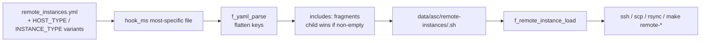
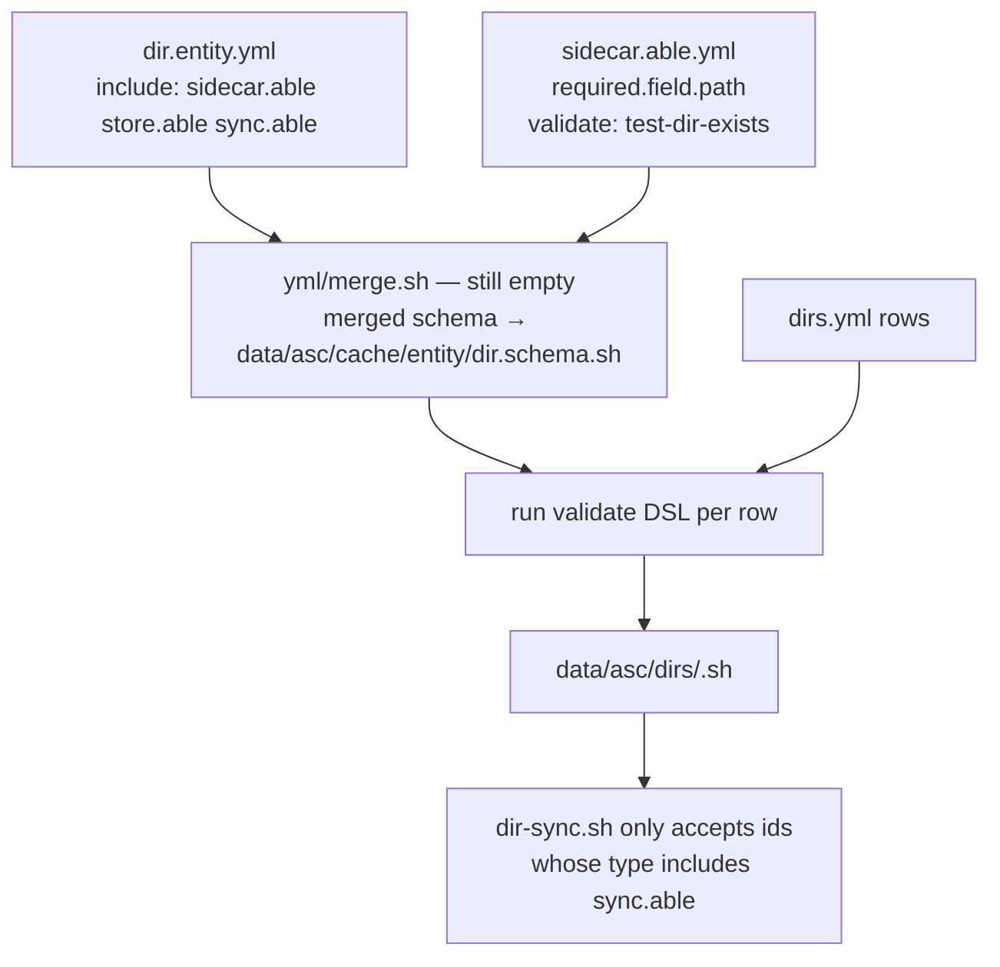
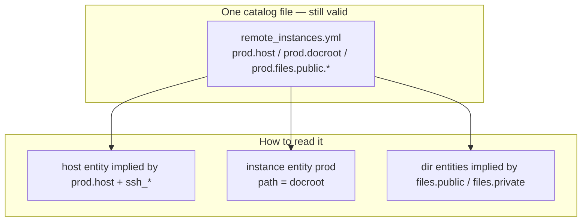

# ASC YAML entities — first implementation draft

| Field | Value |
|-------|--------|
| **Date** | 2026-09-01 |
| **Status** | idea / first draft (feeds README `### Entities`; not an implementation go-ahead) |
| **Feeds** | root `README.md` § Entities; living `docs/asc/entities.md`; YAML body plan `changelog/2026/07/24-yml-structure.md` |
| **Immediate use** | projet-complexe MVP + backup/sync between laptops and dedi-2025 |

This note generalizes the **already-running** remote-instances YAML compiler so the same machinery can name hosts, ASC instances, and directory “places of interest” (backup source/dest). It does **not** invent a second YAML dialect, a graph store, or Kubernetes entity types.

Related living docs (do not duplicate here): `docs/asc/entities.md`, `docs/asc/yml-structure.md`, `docs/asc/organization.md`.

---

## 0. What already works (reuse this, do not replace it)

The only complete YAML-entity runtime in ASC today is **not** `*.entity.yml`. Those files are almost all empty stubs. The working path is:

| Step | Where |
|------|--------|
| Declare | `remote_instances.yml` (hook variants: `remote_instances.$HOST_TYPE.$INSTANCE_TYPE.yml`, …) — specimen: `SPECIMEN.remote_instances.yml` |
| Discover most-specific file | `hook_ms` in `f_remote_instances_setup()` (`asc/extensions/remote/remote.inc.sh`) |
| Parse | `f_yaml_parse` → `asc/vendor/bash-yaml` (`asc/yml/yml.inc.sh`) |
| Resolve `includes:` fragments | same `f_remote_instances_setup()` — child non-empty keys win |
| Generate | `data/asc/remote-instances/<id>.sh` (`export REMOTE_INSTANCE_*`) |
| Load | `f_remote_instance_load` |
| Act | `ssh` / `scp` / `rsync` wrappers in `remote.inc.sh`; `remote/files_dir_sync_from.sh`; `remote_instance/db/sync_from.sh` |
| When | `asc/extensions/remote/instance/post_init.hook.sh` (during `make init` / `reinit` / `setup`) |

Worked YAML shape (from the comment block in `remote.inc.sh`):

```yaml
includes:
  common:
    ssh:
      user: paul
      exec_prefix: '[ -f ~/.bashrc ] && . ~/.bashrc ;'
  drupal:
    docroot: /var/www/drupal/root
    files:
      public:
        remote: '{{ DOCROOT }}/web/sites/default/files'
        local: '{{ SERVER_DOCROOT }}/sites/default/files'

prod:
  includes: common drupal
  host: 3.4.5.6
  domain: prod.foobar.com
```

Flattening: `ssh.user` → `ssh_user`, `files.public.remote` → `files_public_remote`. Tokens `{{ DOCROOT }}`, `{{ DOMAIN }}`, any global, and `{{ %Y-%m-%d... }}` are replaced at **read** time (`f_remote_definition_tokens_replace`), not at generate time for dump filenames.

A remote without `host` is skipped (`Notice : there is no 'host' for remote '$remote_id'`). Default SSH line: `ssh -T -A [$ssh_user@]$host` (`-p` if `ssh_port` set). `ssh_connect_cmd` is already overridable per id.

Partial file sync already exists: global `ASC_REMOTE_FILES_SUFFIXES` (default `public private`) + paired `files.<suffix>.remote` / `files.<suffix>.local` + `rsync -avL` in `files_dir_sync_from.sh`.

That is the entity system. Everything below is: **same compiler, more catalogs, schema files that actually constrain keys**.



---

## 1. Two YAML layers (do not mix them)

| Layer | Files | Role | Runtime today |
|-------|--------|------|----------------|
| **Type / contract** | `*.entity.yml`, `*.able.yml`, `*.yml.yml` beside `$subject` | Schema: which fields exist, defaults, `validate:` DSL, which actions apply | Draft only (`entity.entity.yml`, `able.able.yml`, `wrap.able.yml`, `git/state.able.yml`, `repo.entity.yml`). **No loader.** Empty: `yml/parse.sh`, `yml/merge.sh`, `yml/extend.sh`, `entity/yml.sh`, `entity/field_val.sh` |
| **Catalog / instances** | Project-root YAML (`remote_instances.yml`, later `hosts.yml`, `dirs.yml`) | Named rows: `prod`, `dedi-2025`, `home_photos` | **Implemented** for remotes only |

README field vs prop stays:

| Term | Meaning | Lives in |
|------|---------|----------|
| **prop** | Inherit.able constants shared by all of that kind (`required`, `optional` on a type file) | `*.entity.yml` / `*.able.yml` |
| **field** | Store.able per-row values (path, hostname, ssh_user) | Catalog YAML → generated `export …` → optional sidecar/registry |

`HOST_TYPE` and `INSTANCE_TYPE` are **hook variants**, not host/instance entity ids. Keep them. A laptop running a local compose stack is `HOST_TYPE=local` even if the host entity id is `t14`.

---

## 2. Two `include` mechanisms (lock the spellings)

These are already used with different meanings. Keep both; do not unify.

### 2.1 Catalog fragments — `includes:` (plural) — **implemented**

In the **same** catalog file:

```yaml
includes:
  common:
    ssh:
      user: paul
prod:
  includes: common
  host: 3.4.5.6
```

- Reserved root key `includes` is not a row id.
- Space-separated fragment names.
- Merge is **per flattened key**: inherit only keys the row does not already set.
- Nested maps do not wipe siblings (`ssh.port` on the row does not drop `ssh.user` from the fragment).

This is the reuse the user already has. Use it for backup dirs the same way (`includes: photos_filters`).

**Missing:** fragments cannot live in another file. Do not add file-level YAML include until a catalog actually needs it. Copy-paste a fragment block, or wait.

### 2.2 Schema inheritance — `include:` (singular) — **draft only**

On type/contract files (Wave B, `docs/asc/yml-structure.md`):

```yaml
# asc/extensions/entity/asc/able.able.yml
include:
  - contract.entity

# asc/extensions/entity/entity/entity.entity.yml
include: asc.yml
```

Target resolution is still open in the YAML plan (`contract.entity` → `contract.entity.yml`, lookup like active dirs). Recommendation: resolve like hooks — most-specific `*.entity.yml` / `*.able.yml` / `*.yml.yml` whose **stem** matches the include token, walking the usual genericity list (`asc/` → enabled extensions → contrib → extend → override).

Scalar vs list: accept both; normalize to a list in the merger.

---

## 3. What happens when a contract (`*.able.yml`) is included

Including `sidecar.able` (or `store.able`, `sync.able`) on an entity **type** is not a data copy and does not create scripts. It is three attachments:

1. **Fields** — merge that able’s `required` / `optional` into the type’s field set (same nested `required.field` / `optional.field` shape as `entity.entity.yml`).
2. **Checks** — each field’s `validate:` DSL must pass for every catalog row of that type (on init, same moment as `f_remote_instances_setup`).
3. **Actions** — the `$subject/$action` scripts that implement that able become **applicable** to those rows. Discovery of scripts is unchanged (active dirs). The contract only says “this row is a valid target”.



Instance-level extra `include: sync.able` on a single row is **YAGNI** for the MVP. If a dir is in `dirs.yml`, it is a place of interest and already sync.able. Do not make every filesystem directory an entity.

`is/able.sh` and `has/sidecar.sh` stay the predicates:

- `entity-is-able <id> sync` → merged schema contains `sync`
- `entity-has-sidecar <id>` → resolve `path` (+ host/hardware), then sidecar checks

Both scripts are empty today.

**Wrap contract already shows the pattern** (`asc/extensions/entity/asc/wrap.able.yml`):

```yaml
wrap:
  required:
    prop:
      wrapper:
        validate:
          - test-file-exists(p1)
```

Meaning: a wrap.able thing must point at a real wrapper file. `sidecar.able` is the same idea for a path.

**Hard rule from archive notes (keep):** includes of types/contracts are namespaced by file stem (`sidecar.able`, `store.able`), not a free-form `contract:` string.

---

## 4. `sidecar.able` — the filesystem as the concrete side of a concept

Docs already say: entity = virtual; YAML/file/dir = concrete sidecar (`docs/asc/entities.md` § sidecar). `asc/sidecar/sidecar.sh` even TODOs “sidecar of a sidecar”.

For this draft, `sidecar.able` only answers: **does this entity currently have a usable on-disk path?**

### 4.1 Fields the contract adds

| Field | Default | Purpose |
|-------|---------|---------|
| `path` | none (instance: `{{ PROJECT_DOCROOT }}`) | Absolute or tokenized path on that host |
| `host` | `localhost` | Hostname/IP **string** (today’s remote key). Not `HOST_TYPE`. |
| `hardware` | empty | Optional disk UUID. If set, identity is the device, not the host. Path is the mount path **on the host where it is currently plugged in**. |

`host` stays the remote-instances key name (backward compatible). Synonym `hostname` can be added in `yml.yml` later; do not rename the catalog key in v1.

### 4.2 Checks (fail closed)

Implement as `asc/utils/test/*.sh` — **those files exist and are empty**. `wrap.able.yml` already names `test-file-exists`. Fill these first; do not add a new test framework.

| Check | Script to fill | When |
|-------|----------------|------|
| Path exists | `test/file_exists.sh` / `test/dir_exists.sh` | always before read/write |
| Is a directory (dir entity) | `test/dir_exists.sh` | dir / store |
| Writable (dest) | **missing** — add `test/dir_writable.sh` | before sync dest |
| Readable (src) | **missing** — add `test/dir_readable.sh` or `test/file_readable.sh` | before sync src |
| Owner | `file/owner.able.yml` is empty; a `test/owner.sh` comparing `stat -c %U` to `$USER` (warn, don’t fail by default) | optional |
| ACL / mode | `acl.able.yml` empty — **out of MVP** | later |

`sidecar.able.yml` (to write in `asc/dir/` and/or `asc/sidecar/`, one body, include from the other) should look like:

```yaml
include:
  - contract.entity

required:
  field:
    path:
      validate: test-not-empty(p1)

optional:
  field:
    host:
      default:
        val: localhost
    hardware:
      default:
        val: ''
```

Existence/writable checks are **runtime** (the disk may be unplugged). Do not run them as YAML schema validation on init for paths that live on other hosts or on removable hardware. Init only validates that `path` is non-empty and tokens are well-formed. `has/sidecar.sh` runs the FS checks at action time, locally; remotely it uses `f_remote_exec_wrapper` (`test -d`, `test -w`).

### 4.3 Nested sidecars of an ASC instance

The instance **is** the project folder. Its sidecars are already on disk:

| Sidecar | Concrete path | Existing contract sketch |
|---------|---------------|--------------------------|
| Work tree | instance `path` (git) | `asc/git/state.able.yml` (enum only, no loader) |
| Generated ASC state | `<path>/data/asc/` (cache, `global.vars.sh`, `generated.mk`, `remote-instances/`) | forget.able / init — already generated, not modeled |
| App data | `<path>/data/` (logs, media, private, …) | often gitignored; this is what backups care about |
| Compose files | `<path>/compose.yml` (generated) | compose extension |

Do not generate extra YAML sidecars next to every file. Git state is read from `git status` when needed. Cache state is “does `data/asc/cache` exist after init”.

`sidecar.wrap.sh` (history files `*.sidecar.txt` beside `data/threads/*.yml`) is a **different** sidecar: audit companion of a durable file. Leave it alone for backup/sync.

---

## 5. Three entity types for the generalization

Fill **these** type files. Ignore the rest of the empty `*.able.yml` trees (`asc/dir/crud.able.yml`, hardware preview, …).

### 5.1 `host` — `asc/host/host.entity.yml` (currently empty)

Identity: YAML row id (`dedi-2025`, `t14`, `localhost`).

| Field | Default | Already used as |
|-------|---------|-----------------|
| `host` / hostname | `localhost` | `REMOTE_INSTANCE_HOST` |
| `ssh_user` | empty | `REMOTE_INSTANCE_SSH_USER` |
| `ssh_port` | empty | `REMOTE_INSTANCE_SSH_PORT` |
| `ssh_exec_prefix` | empty | `REMOTE_INSTANCE_SSH_EXEC_PREFIX` |
| `ssh_connect_cmd` | built from user@host | **escape hatch for kubectl/aws/gcloud** |
| `prefix` | `[$ssh_user@]$host` | `REMOTE_INSTANCE_PREFIX` for rsync/scp |

Reuse `f_host_os`, `f_host_ip` (`asc/host/host.inc.sh`) only for **the machine running this process**, not for catalog rows.

Host-level key/value store already exists: `file_registry` with namespace `host` and `FILE_REGISTRY_HOST_LEVEL_PATH` (default `/opt/asc-registry`). That is not backup storage; do not overload it.

**“This machine” among several laptops:** catalog rows are named. The running process needs a pointer. Recommendation: gitignored `.env-local.yml` scalar `SELF_HOST_ID: t14`. Fallback: `localhost` row, or `hostname -s` if it matches a row id. Do not use `HOST_TYPE` for this.

### 5.2 `instance` — `asc/instance/instance.entity.yml` (currently empty)

Identity: YAML row id. Default **current** instance is implicit (no catalog row required): `path={{ PROJECT_DOCROOT }}`, `host=localhost` / `SELF_HOST_ID`.

| Field | Default | Already used as |
|-------|---------|-----------------|
| `path` | `{{ PROJECT_DOCROOT }}` | `REMOTE_INSTANCE_DOCROOT` (today named `docroot`) |
| `host` | hostname string, same as now | inlined; optional later `host_id` |
| `domain` | empty | web-only; optional |
| `type` | `{{ INSTANCE_TYPE }}` | `dev` / `staging` / `prod` |
| `provision_using` | `{{ PROVISION_USING }}` | `compose` / `asc` / project values like `argocd` |

Detection of “this path is an ASC instance”: `path/asc/bootstrap.sh` exists. That check is already in `nested_instance/nested_instance/list.sh` (comments still say `nested_asc` — path drift to fix).

`nested_instance` list/exec is how you talk to **another local** ASC checkout. `remote` + `remote_instance` is how you talk to a checkout (or a mere docroot) **over SSH**. Same entity type, different connect: local `cd` vs `ssh_connect_cmd`.

Keep catalog key `docroot` as synonym of `path` for remotes (token `{{ DOCROOT }}` is already in the wild). Schema can declare `path` with synonym `docroot`.

### 5.3 `dir` — places of interest — `asc/dir/dir.entity.yml` (currently empty)

Not “every folder on disk”. Only dirs you declare for store/sync (backup source, backup dest, Drupal `files`, Immich library, pendrive folder).

Includes: `sidecar.able`, `store.able`, `sync.able`.

| Field | Default | Notes |
|-------|---------|--------|
| `path` | required | |
| `host` | `localhost` | same string rules as remotes |
| `hardware` | empty | UUID; see § 6 |
| `ssh_*` | inherit from host row if `host_id` added later; else inline like remotes | |

`store.able` (`asc/data/store.able.yml` and `asc/extensions/memory/store/store.able.yml` are empty): for MVP it only marks “this dir is a store endpoint”. Do not implement `memory/store/locate.sh` yet.

`file_registry` stays a **file-per-key** store. It is not a dir backup.

Roles “source” vs “dest” are **arguments of `dir-sync`**, not types. The same dir is source on one call and dest on another.

---

## 6. Hardware — same pendrive, different host

`asc/extensions/hardware/` is a stub forest (`uuid.able.yml` empty, extension **disabled** by default in `asc/extensions/.asc_extensions_ignore`). Do not enable the whole hardware extension for MVP.

One small helper is enough, living next to `dir` or as a single script under `host`:

```sh
# resolve mountpoint for UUID; empty if not present on this machine
lsblk -no UUID,MOUNTPOINT
# or findmnt -S UUID=...
```

If `hardware` is set:

1. On **this** host: resolve UUID → mountpoint; `path` may be relative to that mount (`path: Pictures` → `<mountpoint>/Pictures`) or absolute under it.
2. If not plugged in: `has/sidecar` fails; `dir-sync` aborts with a clear message. No network guess.
3. Do not key the catalog row by host. The row id stays `pendrive_photos`. Host is wherever the UUID is mounted **right now**.

Nested_hardware, health.able, etc. stay untouched.

---

## 7. Partial sync between dirs

Do not write a sync engine. Wrap **rsync** (already used). Optional Syncthing/Nextcloud wrappers belong in `scripts/asc/extend/` of the instance that owns backups (likely home), not in ASC core.

### 7.1 Named subsets (copy the remote-files pattern)

Today:

```yaml
files:
  public:
    remote: '{{ DOCROOT }}/web/sites/default/files'
    local: '{{ SERVER_DOCROOT }}/sites/default/files'
```

plus `ASC_REMOTE_FILES_SUFFIXES='public private'` and a loop in `files_dir_sync_from.sh`.

Generalize to **rel paths inside a dir entity** (same-host or two dir ids):

```yaml
includes:
  photos_filters:
    sync:
      exclude:
        - '.trash/**'
        - '*.tmp'
        - '.stfolder/**'   # if a Syncthing tree is also rsynced
      subsets:
        originals:
          rel: originals/
        thumbs:
          rel: thumbs/

home_photos:
  includes: photos_filters
  host: localhost
  path: /home/paul/Pictures

pendrive_photos:
  includes: photos_filters
  hardware: '0123-ABCD'
  path: Pictures
```

Action (name can wait; the implementation is rsync):

```text
make dir-sync -- home_photos pendrive_photos          # all subsets
```

| Case | Command shape (already in tree) |
|------|----------------------------------|
| Same host | `rsync -a --exclude … "$src/$rel" "$dest/$rel"` |
| Dest remote | `rsync -a … "$src/$rel" "$prefix:$dest/$rel"` — same prefix as `REMOTE_INSTANCE_PREFIX` |
| Src remote | reverse; `files_dir_sync_from.sh` is this case |
| Dry-run | existing `DEBUG_MODE` on `f_remote_download` / `f_remote_upload`; add `rsync -n` for dir-sync |
| Ignore existing | `f_remote_upload … --ignore-existing` already uses `rsync -vau` |

`--files-from` / include lists: only if exclude globs are not enough. Don’t add them in v1.

Web-project `files.public.remote` vs `files.public.local` remains a **pair of paths on two instances**, not two dir catalog rows. Keep generating those keys in `f_remote_definition_get_keys`. A later optional rewrite can compile them into two dir ids; not required to keep remotes working.

### 7.2 What `sync.able` actually contains

```yaml
# conceptual body — new file asc/dir/sync.able.yml (or memory/store/)
optional:
  field:
    sync_exclude: {}
    sync_subsets: {}
  prop:
    tool:
      default:
        val: rsync
```

`tool: syncthing` does **not** run Syncthing from core. It means: this row is documented as a Syncthing folder; ASC `dir-sync` still uses rsync unless a project `scripts/asc/extend/dir/sync.syncthing.hook.sh` exists (variant `PROVISION_USING` or a dedicated field). Same pattern as compose hooks (`start.compose.hook.sh`).

---

## 8. Old CWT / ASC web remotes — still `remote_instances.yml`

Do **not** require a split into `hosts.yml` + `instances.yml` for existing stacks. The compiler already treats each root key as an instance row with **inlined** host fields (`host`, `ssh_*`, `docroot`, `domain`, `files.*`, `dumps.*`).



Optional later: a `hosts:` block in the same file (or `hosts.yml`) for reuse across `prod` / `staging` / several projects. Until then, repeating `ssh.user` via `includes: common` is enough (already the specimen pattern).

**Backward compatible `host:`:** it is a **hostname/IP string**, not a host-entity id. SPECIMEN uses `host: prod.specimen.home.arpa`. Do not reinterpret `host: dedi-2025` as an id unless we add an explicit `host_id:` field. Safer v1: never magically join; `host` stays a string.

### 8.1 Local Docker Compose vs remote Argo CD / k8s / AWS

Already modeled. Do not add cluster entity types in core.

| Situation | Globals / fields | What runs |
|-----------|------------------|-----------|
| Laptop compose stack | `HOST_TYPE=local`, `PROVISION_USING=compose`, current instance implicit | `asc/extensions/compose/instance/*.compose.hook.sh` (`start.compose.hook.sh` → `f_dc_instance_start`) |
| Same project, SSH to a server that has a docroot | `remote_instances.yml` row + `remote` + `remote_instance` extensions **enabled** | `f_remote_exec_wrapper`, `stack/deploy.sh`, `db/sync_from.sh` |
| Server is only a kube API / Argo CD | same row, override `ssh_connect_cmd` (e.g. `kubectl exec …` or a small wrapper script) | still one “remote instance” id from ASC’s point of view |
| Dedi has **no** `asc/bootstrap.sh` | it is a **host** (+ dirs), **not** an ASC instance | use `dir-sync` / `f_remote_exec_wrapper` raw commands; do not call `make` remotely |

`PROVISION_USING=argocd` (or similar) is a **variant** for hooks (`deploy.argocd.hook.sh` in projet-complexe **extend**, not core). Core keeps `ssh_connect_cmd` as the connect string.

`remote_instance` extension = lifecycle against a **remote ASC or remote stack** (`remote/init.sh`, `setup.sh`, `destroy.sh`, `stack/deploy.sh`). Enable it only on instances that actually SSH into copies of the same stack.

Default `asc/extensions/.asc_extensions_ignore` **disables** `remote` and `remote_instance`. Projet-complexe-asc must omit those lines in `scripts/asc/override/.asc_extensions_ignore`.

### 8.2 Key list today is hardcoded — this is the main schema gap

`f_remote_definition_get_keys()` lists `id host domain docroot prefix ssh_* dumps_*` and dynamically `files_${suffix}_{remote,local}` plus DB dump keys if `f_db_get_ids` exists, then `hook -s 'remote_definition_keys' -a 'alter'`.

When type files grow real `required`/`optional` fields, **that function should be fed by the merged schema** (plus dynamic suffix families). Until the merger exists, keep the hardcoded list and add dir-catalog keys the same way (a `f_dir_definition_get_keys` copy). Duplicating the setup loop once is better than a premature generic ORM.

---

## 9. Generic catalog compiler (the actual code change)

Extract the loop in `f_remote_instances_setup()` (parse → skip reserved keys → merge includes → require identity field → write `data/asc/<folder>/<id>.sh`) so remotes, hosts, and dirs share it.

| Catalog file (hook `-a` / `-c yml` / `-r`) | Identity field | Output dir | Export prefix |
|--------------------------------------------|----------------|------------|-----------------|
| `remote_instances.yml` | `host` required (as today) | `data/asc/remote-instances/` | `REMOTE_INSTANCE_` |
| `hosts.yml` (optional) | `host` hostname | `data/asc/hosts/` | `HOST_ENTITY_` (name TBD; avoid clashing `HOST_TYPE`) |
| `dirs.yml` (optional) | `path` required | `data/asc/dirs/` | `DIR_` |

Load functions: copy `f_remote_instance_load`. Token replace: reuse `f_remote_definition_tokens_replace` parameterized by prefix, or a slim `f_yaml_tokens_replace` in `yml.inc.sh` (tokens already support any global).

Empty stubs waiting for this: `asc/yml/parse.sh`, `merge.sh`, `extend.sh`. Recommendation: put **schema** merge in `yml/merge.sh`; keep catalog compile next to the existing remote function (or `yml/extend.sh` if you want one entry point). Do not block remotes on schema merge — dirs can ship with a copied setup function first.

---

## 10. Backup MVP — where catalogs live

Places of interest that span **several git repos and machines** (laptops, pendrives, dedi Nextcloud/Syncthing trees) should be declared in the ASC instance that will run the sync actions.

That is probably **home** (`$HOME` as a CWT/ASC context) or a tiny dedicated stack, **not** projet-complexe-asc. Projet-complexe-asc keeps `remote_instances.yml` for app/files/db remotes.

Home `dirs.yml` example (illustrative):

```yaml
includes:
  rsync_common:
    ssh:
      user: paul
    sync:
      exclude:
        - '.trash/**'
        - '*.tmp'

dedi_nextcloud:
  includes: rsync_common
  host: 1.2.3.4
  path: /var/lib/nextcloud/data   # whatever the real path is

home_documents:
  includes: rsync_common
  host: localhost
  path: /home/paul/Documents
```

Syncthing on dedi remains the long-running replica. ASC `dir-sync` is the **explicit**, logged, rsync-based pull/push you run from a laptop (or a cronjob via existing `crontab` extension). No need to wrap Syncthing to get an MVP.

---

## 11. Gap list (implementation, ordered)

Only items that unblock README + projet-complexe / backup. Not a rewrite of `docs/asc/entities.md`.

### Must fill (small, existing empty files)

1. `asc/utils/test/file_exists.sh`, `dir_exists.sh`, `not_empty.sh` — referenced by DSL / wrap.able, currently 0 bytes.
2. `test/dir_writable.sh` (new) for sync dest.
3. `asc/dir/sidecar.able.yml` + `asc/dir/sync.able.yml` + `asc/data/store.able.yml` **bodies** (short, as in § 4–7). Leave sibling stubs empty.
4. `asc/host/host.entity.yml` and `asc/instance/instance.entity.yml` **bodies** (field lists above). Keep `docroot` synonym on instance.
5. Enable `remote` (and `remote_instance` if SSH stack deploy is in scope) in projet-complexe-asc override ignore file.

### Should extract / copy

6. Generic catalog writer copied from `f_remote_instances_setup` for `dirs.yml` → `data/asc/dirs/<id>.sh`.
7. `dir-sync` action wrapping rsync, reusing prefix construction and token replace.
8. `has/sidecar.sh`: local `test -d`/`test -w`; if `hardware` set, UUID → mountpoint; if `host` ≠ this machine, `f_remote_exec_wrapper`.
9. `SELF_HOST_ID` in `.env-local.yml` specimen / docs.

### Later (do not do for MVP)

10. Schema `include:` merger (`yml/merge.sh`) feeding `f_remote_definition_get_keys`.
11. `host_id` join; split `hosts.yml`.
12. `memory/storage/detect.sh`, `store/locate.sh`.
13. Hardware extension enablement / inventory.
14. `owner.able` / `acl.able` enforcement.
15. Compiling `files.public.*` into dir catalog rows.
16. Syncthing/Nextcloud/Argo CD as core tools.
17. Filling `asc/dir/*.able.yml` mass stubs.
18. `contract.entity.yml` `rules:` (still `todo: TODO`).

### Path drift to fix when touching nested instances

- Files live under `asc/extensions/nested_instance/` but comments/docs still say `nested_asc`. Align names when that extension is next edited.

---

## 12. README `### Entities` — condensation (for the rewrite)

Use this as the README body; keep this idea file for examples and gaps.

**Entities** are named YAML rows plus optional type files. The running implementation is the remote-instances compiler: catalog YAML → flattened generated bash → `ssh`/`rsync` actions.

- **Type files** (`*.entity.yml`) declare props (`required` / `optional`) and which contracts (`*.able.yml`) apply.
- **Contracts** attach fields, `validate:` DSL, and applicable actions. They do not copy data and do not create scripts.
- **Catalog files** (`remote_instances.yml`, later `dirs.yml`) declare rows. Reuse YAML parts with in-file `includes:` (already implemented).
- **Field** = per-row value (path, host, ssh_user) stored in generated `data/asc/…/<id>.sh`. **Prop** = shared type constant.
- A **sidecar** is the concrete filesystem path of an entity. `sidecar.able` checks that path (exists, dir, writable) at action time. An ASC instance’s sidecar is its `$PROJECT_DOCROOT`; git work tree and `data/` are nested sidecars, not extra YAML.
- **Host** entity: hostname string (default `localhost`), optional SSH fields. **Instance** entity: `path`/`docroot` (default `PROJECT_DOCROOT`) on a host. **Dir** entity: a declared place of interest (`store.able` + `sync.able`).
- Web remotes stay one file: each id inlines host + instance + `files.*` subsets. `ssh_connect_cmd` covers non-SSH transports. Compose vs Argo CD is `PROVISION_USING` + hooks, not a new type.
- Partial sync = named subsets + rsync excludes, same as `files.public` / `files.private`.

Point at `SPECIMEN.remote_instances.yml` and `f_remote_instances_setup()`. State that `*.entity.yml` loaders are still TODO except this catalog path.

---

## 13. Open questions

1. **Backup catalog home:** home ASC instance vs projet-complexe-asc vs a dedicated stack? (Draft assumes home for cross-repo dirs, projet-complexe-asc for app remotes.)
2. **Is dedi-2025 an ASC instance** (has `asc/bootstrap.sh` on the server) or only a host + dirs (Argo CD / Nextcloud / Syncthing)? This decides whether `remote_instance` lifecycle scripts apply.
3. **`SELF_HOST_ID` vs `hostname -s` vs a mandatory `localhost` row** for “this laptop”.
4. **Export prefix** for dir/host generated files (`DIR_` / `HOST_ENTITY_`) — bikeshed before coding.
5. **Relative `path` when `hardware` is set:** relative to mountpoint, or always absolute?
6. **Lock include spellings** (`includes:` catalog vs `include:` schema) in `changelog/2026/07/24-yml-structure.md` Wave B Qs — this draft picks a side.
7. **`docroot` vs `path`:** keep both as synonyms forever, or migrate remotes later?

---

## 14. Deliberate non-goals

- Drupal-like field UI, graph DB, SKOS taxonomy runtime.
- Making `entity` a required extension to parse remotes (remotes already work with `remote` enabled and `entity` stubs unused).
- Replacing git with YAML state machines (`state.able.yml` stays an enum sketch).
- Wrapping Syncthing as the primary transport.
- Kubernetes/Argo CD/AWS resource types in `asc/extensions/entity`.
